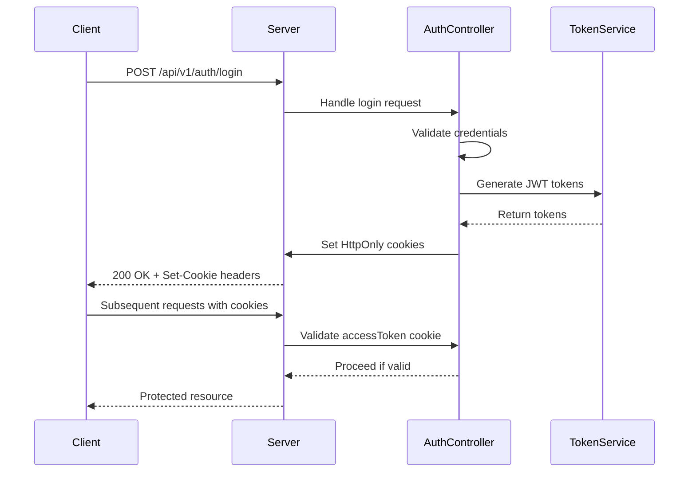
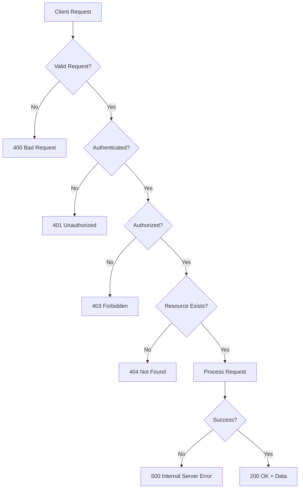

# API Documentation

<cite>
**Referenced Files in This Document**   
- [auth.controller.ts](file://apps/server/src/shared/controller/domains/auth.controller.ts)
- [tenants.controller.ts](file://apps/server/src/shared/controller/resources/tenants.controller.ts)
- [users.controller.ts](file://apps/server/src/shared/controller/resources/users.controller.ts)
- [roles.controller.ts](file://apps/server/src/shared/controller/resources/roles.controller.ts)
- [spaces.controller.ts](file://apps/server/src/shared/controller/resources/spaces.controller.ts)
- [subjects.controller.ts](file://apps/server/src/shared/controller/resources/subjects.controller.ts)
- [sessions.controller.ts](file://apps/server/src/shared/controller/resources/sessions.controller.ts)
- [main.ts](file://apps/server/src/main.ts)
- [app.module.ts](file://apps/server/src/module/app.module.ts)
- [createTenantDto.ts](file://packages/shared-api-client/src/model/createTenantDto.ts)
- [loginPayloadDto.ts](file://packages/shared-api-client/src/model/loginPayloadDto.ts)
- [signUpPayloadDto.ts](file://packages/shared-api-client/src/model/signUpPayloadDto.ts)
- [userDto.ts](file://packages/shared-api-client/src/model/userDto.ts)
- [tenantDto.ts](file://packages/shared-api-client/src/model/tenantDto.ts)
- [roleDto.ts](file://packages/shared-api-client/src/model/roleDto.ts)
- [spaceDto.ts](file://packages/shared-api-client/src/model/spaceDto.ts)
- [subjectDto.ts](file://packages/shared-api-client/src/model/subjectDto.ts)
- [sessionDto.ts](file://packages/shared-api-client/src/model/sessionDto.ts)
- [queryTenantDto.ts](file://packages/shared-api-client/src/model/getTenantsByQueryParams.ts)
- [queryUserDto.ts](file://packages/shared-api-client/src/model/getUsersByQueryParams.ts)
</cite>

## Table of Contents
1. [Introduction](#introduction)
2. [API Base URL and Versioning](#api-base-url-and-versioning)
3. [Authentication and Security](#authentication-and-security)
4. [Rate Limiting](#rate-limiting)
5. [Response Structure](#response-structure)
6. [Error Handling](#error-handling)
7. [Pagination, Filtering, and Sorting](#pagination-filtering-and-sorting)
8. [Endpoint Details](#endpoint-details)
   - [Authentication Endpoints](#authentication-endpoints)
   - [Tenant Management](#tenant-management)
   - [User Management](#user-management)
   - [Role Management](#role-management)
   - [Space Management](#space-management)
   - [Subject Management](#subject-management)
   - [Session Management](#session-management)
9. [Data Validation Rules](#data-validation-rules)
10. [Sample Requests](#sample-requests)
11. [Deprecation Notices](#deprecation-notices)

## Introduction
This document provides comprehensive documentation for the prj-core backend API, a RESTful service built with NestJS. The API supports tenant-based multi-tenancy with JWT authentication via HTTP-only cookies. It follows a consistent pattern across resources with standardized endpoints for CRUD operations, filtering, pagination, and soft deletion.

The API is organized into domains and resources, with endpoints grouped by functionality. All endpoints follow REST principles with appropriate HTTP methods and status codes. The API uses a consistent response structure with metadata for pagination and status information.

**Section sources**
- [main.ts](file://apps/server/src/main.ts#L50-L72)
- [app.module.ts](file://apps/server/src/module/app.module.ts#L66-L160)

## API Base URL and Versioning
The API is accessible at the base URL with versioning in the path:

**Base URL**: `https://api.example.com/api/v1`

All endpoints are prefixed with `/api/v1` as configured in the `AppModule` with NestJS RouterModule. The versioning scheme follows semantic versioning principles, where breaking changes will result in a new major version.

The API documentation is available at `/api` path as configured in the main application setup, providing Swagger UI for interactive exploration of all endpoints.

```mermaid
graph TB
A[Client Application] --> B[/api/v1]
B --> C[Authentication]
B --> D[Tenants]
B --> E[Users]
B --> F[Roles]
B --> G[Spaces]
B --> H[Subjects]
B --> I[Sessions]
```

**Diagram sources**
- [main.ts](file://apps/server/src/main.ts#L71-L72)
- [app.module.ts](file://apps/server/src/module/app.module.ts#L66-L160)

## Authentication and Security
The prj-core API uses JWT-based authentication with tokens stored in HTTP-only cookies for enhanced security against XSS attacks.

### Authentication Methods
- **Primary Method**: Cookie-based JWT authentication
- **Token Storage**: HTTP-only, secure cookies
- **Token Types**: Access token (short-lived) and Refresh token (long-lived)

### Required Headers
- `Content-Type: application/json` for all requests with request bodies
- Authentication is handled via cookies, so no Authorization header is required

### Access Permissions
Most endpoints require authentication, except for public endpoints marked with the `@Public()` decorator:

- `POST /api/v1/auth/login`
- `POST /api/v1/auth/sign-up`
- `POST /api/v1/auth/token/refresh`

Authenticated endpoints validate the JWT access token from the `accessToken` cookie. The `ContextService` extracts user information from the validated token for use in business logic.



**Diagram sources**
- [auth.controller.ts](file://apps/server/src/shared/controller/domains/auth.controller.ts#L60-L97)
- [main.ts](file://apps/server/src/main.ts#L58-L63)

**Section sources**
- [auth.controller.ts](file://apps/server/src/shared/controller/domains/auth.controller.ts#L60-L253)
- [main.ts](file://apps/server/src/main.ts#L58-L63)

## Rate Limiting
The API implements rate limiting to prevent abuse and ensure service availability. The rate limiting is configured globally using NestJS Throttler module.

- **Limit**: 100 requests per 5 minutes per IP address
- **Burst**: Up to 100 requests can be made within the 5-minute window
- **Headers**: Rate limit information is included in response headers

When the rate limit is exceeded, the API returns a 429 Too Many Requests status code with details about the limit and reset time.

The rate limiting guard is applied globally through the `APP_GUARD` provider in the `AppModule`, ensuring consistent protection across all endpoints.

**Section sources**
- [app.module.ts](file://apps/server/src/module/app.module.ts#L168-L171)

## Response Structure
All API responses follow a consistent structure defined by the `ApiResponseEntity` decorator and `wrapResponse` utility function.

### Standard Response Format
```json
{
  "data": {},
  "status": 200,
  "message": "success",
  "meta": {}
}
```

### Response Fields
- **data**: The primary response payload (resource object or array)
- **status**: HTTP status code
- **message**: Human-readable status message
- **meta**: Additional metadata (pagination, timestamps, etc.)

For collection endpoints, the meta field includes pagination information:
```json
"meta": {
  "currentPage": 1,
  "perPage": 10,
  "total": 100,
  "totalPages": 10
}
```

The response structure is standardized through the `ResponseEntityInterceptor` and `wrapResponse` function, ensuring consistency across all endpoints.

**Section sources**
- [users.controller.ts](file://apps/server/src/shared/controller/resources/users.controller.ts#L109-L115)
- [tenants.controller.ts](file://apps/server/src/shared/controller/resources/tenants.controller.ts#L94-L99)
- [util/response.util.ts](file://apps/server/src/shared/util/response.util.ts)

## Error Handling
The API provides comprehensive error handling with standardized error responses and appropriate HTTP status codes.

### Error Response Structure
```json
{
  "statusCode": 400,
  "message": "Error description",
  "error": "Bad Request"
}
```

### Common Status Codes
- **400 Bad Request**: Invalid request parameters or body
- **401 Unauthorized**: Authentication required or failed
- **403 Forbidden**: Insufficient permissions
- **404 Not Found**: Resource not found
- **409 Conflict**: Resource already exists
- **429 Too Many Requests**: Rate limit exceeded
- **500 Internal Server Error**: Unexpected server error

### Domain-Specific Error Messages
The authentication endpoints define specific error messages for better client-side handling:

- `INVALID_EMAIL_OR_PASSWORD_FORMAT`: Email or password format is invalid
- `INVALID_CREDENTIALS`: Email and password do not match
- `REFRESH_TOKEN_NOT_FOUND`: Refresh token cookie is missing
- `REFRESH_TOKEN_EXPIRED`: Refresh token has expired
- `EMAIL_ALREADY_EXISTS`: Email is already registered

These error messages are defined as constants in the `AuthController` to ensure consistency between code and documentation.



**Diagram sources**
- [auth.controller.ts](file://apps/server/src/shared/controller/domains/auth.controller.ts#L31-L49)
- [auth.controller.ts](file://apps/server/src/shared/controller/domains/auth.controller.ts#L70-L77)

**Section sources**
- [auth.controller.ts](file://apps/server/src/shared/controller/domains/auth.controller.ts#L31-L49)
- [auth.controller.ts](file://apps/server/src/shared/controller/domains/auth.controller.ts#L70-L77)

## Pagination, Filtering, and Sorting
The API supports pagination, filtering, and sorting for collection endpoints through query parameters.

### Pagination Parameters
All collection endpoints support standard pagination:

- **skip**: Number of items to skip (default: 0)
- **take**: Number of items to return (default: 10, max: 100)

Example: `GET /api/v1/users?skip=10&take=20`

### Filtering
Resources can be filtered by various attributes depending on the entity:

- **Text search**: `search` parameter for full-text search
- **Status filters**: `isActive`, `isDeleted` boolean filters
- **Date ranges**: `createdAtFrom`, `createdAtTo` for creation date filtering
- **Relationship filters**: `tenantId`, `userId`, `spaceId` for filtering by relationships

### Sorting
Results can be sorted by specifying the field and order:

- **sort**: Field name to sort by (e.g., `createdAt`, `name`)
- **order**: Sort direction (`ASC` or `DESC`)

Example: `GET /api/v1/users?sort=createdAt&order=DESC`

The filtering and sorting functionality is implemented through the `QueryDto` classes and the `getManyByQuery` service methods, providing a consistent interface across all resources.

**Section sources**
- [queryUserDto.ts](file://packages/shared-api-client/src/model/getUsersByQueryParams.ts)
- [queryTenantDto.ts](file://packages/shared-api-client/src/model/getTenantsByQueryParams.ts)
- [users.controller.ts](file://apps/server/src/shared/controller/resources/users.controller.ts#L94-L115)

## Endpoint Details

### Authentication Endpoints

#### POST /api/v1/auth/login
Authenticate a user and receive JWT tokens.

**Request Parameters**
- **Body**: `LoginPayloadDto` with email and password

**Request Example**
```json
{
  "email": "user@example.com",
  "password": "password123"
}
```

**Response Schema**
```json
{
  "accessToken": "jwt-token",
  "refreshToken": "refresh-token",
  "user": { "id": "uuid", "email": "user@example.com" },
  "mainTenantId": "uuid"
}
```

**Status Codes**
- 200: Login successful
- 400: Invalid email or password format
- 401: Invalid credentials
- 500: Internal server error

**Authentication**: Public (no authentication required)

**Section sources**
- [auth.controller.ts](file://apps/server/src/shared/controller/domains/auth.controller.ts#L60-L97)

#### POST /api/v1/auth/sign-up
Create a new user account.

**Request Parameters**
- **Body**: `SignUpPayloadDto` with email, password, and name

**Request Example**
```json
{
  "email": "newuser@example.com",
  "password": "password123",
  "name": "New User"
}
```

**Response Schema**: Same as login response

**Status Codes**
- 201: User created successfully
- 400: Invalid signup format
- 409: Email already exists
- 500: Internal server error

**Authentication**: Public (no authentication required)

**Section sources**
- [auth.controller.ts](file://apps/server/src/shared/controller/domains/auth.controller.ts#L181-L199)

#### POST /api/v1/auth/token/refresh
Refresh JWT tokens using the refresh token cookie.

**Request Parameters**: None (uses refreshToken cookie)

**Response Schema**: Same as login response

**Status Codes**
- 200: Tokens refreshed successfully
- 401: Refresh token not found or invalid
- 500: Internal server error

**Authentication**: Public (no authentication required, uses refresh token cookie)

**Section sources**
- [auth.controller.ts](file://apps/server/src/shared/controller/domains/auth.controller.ts#L100-L144)

#### GET /api/v1/auth/verify-token
Verify the validity of the current access token.

**Request Parameters**: None (uses accessToken cookie)

**Response Schema**
```json
true
```

**Status Codes**
- 200: Token is valid
- 401: Token is invalid or not found
- 500: Internal server error

**Authentication**: Required (valid accessToken cookie)

**Section sources**
- [auth.controller.ts](file://apps/server/src/shared/controller/domains/auth.controller.ts#L203-L220)

#### POST /api/v1/auth/logout
Log out the current user and clear authentication cookies.

**Request Parameters**: None

**Response Schema**
```json
true
```

**Response Headers**
- `Set-Cookie: accessToken=; Path=/; Expires=Thu, 01 Jan 1970 00:00:00 GMT`
- `Set-Cookie: refreshToken=; Path=/; Expires=Thu, 01 Jan 1970 00:00:00 GMT`

**Status Codes**
- 200: Logout successful
- 500: Internal server error

**Authentication**: Required (valid accessToken cookie)

**Section sources**
- [auth.controller.ts](file://apps/server/src/shared/controller/domains/auth.controller.ts#L223-L252)

### Tenant Management

#### POST /api/v1/tenants
Create a new tenant.

**Request Parameters**
- **Body**: `CreateTenantDto` with tenant details

**Response Schema**: `TenantDto`

**Status Codes**
- 200: Tenant created successfully
- 500: Internal server error

**Authentication**: Required

**Section sources**
- [tenants.controller.ts](file://apps/server/src/shared/controller/resources/tenants.controller.ts#L45-L52)

#### GET /api/v1/tenants/my
Get tenants associated with the current user.

**Request Parameters**: None

**Response Schema**: Array of `TenantDto`

**Status Codes**
- 200: Success
- 500: Internal server error

**Authentication**: Required

**Section sources**
- [tenants.controller.ts](file://apps/server/src/shared/controller/resources/tenants.controller.ts#L35-L43)

#### GET /api/v1/tenants
Get tenants with filtering and pagination.

**Request Parameters**
- **Query**: `QueryTenantDto` with skip, take, search, and filter options

**Response Schema**: Paginated response with array of `TenantDto`

**Status Codes**
- 200: Success
- 500: Internal server error

**Authentication**: Required

**Section sources**
- [tenants.controller.ts](file://apps/server/src/shared/controller/resources/tenants.controller.ts#L89-L101)

#### GET /api/v1/tenants/:tenantId
Get a specific tenant by ID.

**Request Parameters**
- **Path**: tenantId

**Response Schema**: `TenantDto`

**Status Codes**
- 200: Success
- 500: Internal server error

**Authentication**: Required

**Section sources**
- [tenants.controller.ts](file://apps/server/src/shared/controller/resources/tenants.controller.ts#L54-L60)

#### PATCH /api/v1/tenants/:tenantId
Update a tenant by ID.

**Request Parameters**
- **Path**: tenantId
- **Body**: `UpdateTenantDto` with updated fields

**Response Schema**: `TenantDto`

**Status Codes**
- 200: Success
- 500: Internal server error

**Authentication**: Required

**Section sources**
- [tenants.controller.ts](file://apps/server/src/shared/controller/resources/tenants.controller.ts#L62-L71)

#### PATCH /api/v1/tenants/:tenantId/removedAt
Soft delete a tenant by setting removedAt timestamp.

**Request Parameters**
- **Path**: tenantId

**Response Schema**: `TenantDto`

**Status Codes**
- 200: Success
- 500: Internal server error

**Authentication**: Required

**Section sources**
- [tenants.controller.ts](file://apps/server/src/shared/controller/resources/tenants.controller.ts#L73-L79)

#### DELETE /api/v1/tenants/:tenantId
Hard delete a tenant.

**Request Parameters**
- **Path**: tenantId

**Response Schema**: `TenantDto`

**Status Codes**
- 200: Success
- 500: Internal server error

**Authentication**: Required

**Section sources**
- [tenants.controller.ts](file://apps/server/src/shared/controller/resources/tenants.controller.ts#L81-L87)

### User Management

#### POST /api/v1/users
Create a new user.

**Request Parameters**
- **Body**: `CreateUserDto` with user details

**Response Schema**: `UserDto`

**Status Codes**
- 200: User created successfully
- 500: Internal server error

**Authentication**: Required

**Section sources**
- [users.controller.ts](file://apps/server/src/shared/controller/resources/users.controller.ts#L35-L43)

#### GET /api/v1/users
Get users with filtering and pagination.

**Request Parameters**
- **Query**: `QueryUserDto` with skip, take, search, and filter options

**Response Schema**: Paginated response with array of `UserDto`

**Status Codes**
- 200: Success
- 500: Internal server error

**Authentication**: Required

**Section sources**
- [users.controller.ts](file://apps/server/src/shared/controller/resources/users.controller.ts#L91-L116)

#### GET /api/v1/users/:userId
Get a specific user by ID.

**Request Parameters**
- **Path**: userId

**Response Schema**: `UserDto`

**Status Codes**
- 200: Success
- 500: Internal server error

**Authentication**: Required

**Section sources**
- [users.controller.ts](file://apps/server/src/shared/controller/resources/users.controller.ts#L45-L51)

#### PATCH /api/v1/users/:userId
Update a user by ID.

**Request Parameters**
- **Path**: userId
- **Body**: `UpdateUserDto` with updated fields

**Response Schema**: `UserDto`

**Status Codes**
- 200: Success
- 500: Internal server error

**Authentication**: Required

**Section sources**
- [users.controller.ts](file://apps/server/src/shared/controller/resources/users.controller.ts#L64-L73)

#### PATCH /api/v1/users/:userId/removedAt
Soft delete a user by setting removedAt timestamp.

**Request Parameters**
- **Path**: userId

**Response Schema**: `UserDto`

**Status Codes**
- 200: Success
- 500: Internal server error

**Authentication**: Required

**Section sources**
- [users.controller.ts](file://apps/server/src/shared/controller/resources/users.controller.ts#L75-L81)

#### DELETE /api/v1/users/:userId
Hard delete a user.

**Request Parameters**
- **Path**: userId

**Response Schema**: `UserDto`

**Status Codes**
- 200: Success
- 500: Internal server error

**Authentication**: Required

**Section sources**
- [users.controller.ts](file://apps/server/src/shared/controller/resources/users.controller.ts#L83-L89)

#### PATCH /api/v1/users/removedAt
Soft delete multiple users.

**Request Parameters**
- **Body**: Array of userId strings

**Response Schema**: Count of deleted users

**Status Codes**
- 200: Success
- 500: Internal server error

**Authentication**: Required

**Section sources**
- [users.controller.ts](file://apps/server/src/shared/controller/resources/users.controller.ts#L53-L62)

### Role Management

#### POST /api/v1/roles
Create a new role.

**Request Parameters**
- **Body**: `CreateRoleDto` with role details

**Response Schema**: `RoleDto`

**Status Codes**
- 200: Role created successfully
- 500: Internal server error

**Authentication**: Required

**Section sources**
- [roles.controller.ts](file://apps/server/src/shared/controller/resources/roles.controller.ts#L30-L36)

#### GET /api/v1/roles
Get roles with filtering and pagination.

**Request Parameters**
- **Query**: `QueryRoleDto` with skip, take, search, and filter options

**Response Schema**: Paginated response with array of `RoleDto`

**Status Codes**
- 200: Success
- 500: Internal server error

**Authentication**: Required

**Section sources**
- [roles.controller.ts](file://apps/server/src/shared/controller/resources/roles.controller.ts#L73-L86)

#### GET /api/v1/roles/:roleId
Get a specific role by ID.

**Request Parameters**
- **Path**: roleId

**Response Schema**: `RoleDto`

**Status Codes**
- 200: Success
- 500: Internal server error

**Authentication**: Required

**Section sources**
- [roles.controller.ts](file://apps/server/src/shared/controller/resources/roles.controller.ts#L38-L44)

#### PATCH /api/v1/roles/:roleId
Update a role by ID.

**Request Parameters**
- **Path**: roleId
- **Body**: `UpdateRoleDto` with updated fields

**Response Schema**: `RoleDto`

**Status Codes**
- 200: Success
- 500: Internal server error

**Authentication**: Required

**Section sources**
- [roles.controller.ts](file://apps/server/src/shared/controller/resources/roles.controller.ts#L46-L55)

#### PATCH /api/v1/roles/:roleId/removedAt
Soft delete a role by setting removedAt timestamp.

**Request Parameters**
- **Path**: roleId

**Response Schema**: `RoleDto`

**Status Codes**
- 200: Success
- 500: Internal server error

**Authentication**: Required

**Section sources**
- [roles.controller.ts](file://apps/server/src/shared/controller/resources/roles.controller.ts#L57-L63)

#### DELETE /api/v1/roles/:roleId
Hard delete a role.

**Request Parameters**
- **Path**: roleId

**Response Schema**: `RoleDto`

**Status Codes**
- 200: Success
- 500: Internal server error

**Authentication**: Required

**Section sources**
- [roles.controller.ts](file://apps/server/src/shared/controller/resources/roles.controller.ts#L65-L71)

### Space Management

#### GET /api/v1/spaces/current
Get the current user's active space.

**Request Parameters**: None

**Response Schema**: `SpaceDto`

**Status Codes**
- 200: Success
- 401: Tenant information not found
- 400: Space ID is missing from tenant
- 404: Space not found
- 500: Internal server error

**Authentication**: Required

**Section sources**
- [spaces.controller.ts](file://apps/server/src/shared/controller/resources/spaces.controller.ts#L37-L109)

#### POST /api/v1/spaces
Create a new space.

**Request Parameters**
- **Body**: `CreateSpaceDto` with space details

**Response Schema**: `SpaceDto`

**Status Codes**
- 200: Space created successfully
- 500: Internal server error

**Authentication**: Required

**Section sources**
- [spaces.controller.ts](file://apps/server/src/shared/controller/resources/spaces.controller.ts#L110-L116)

#### GET /api/v1/spaces
Get spaces with filtering and pagination.

**Request Parameters**
- **Query**: `QuerySpaceDto` with skip, take, search, and filter options

**Response Schema**: Paginated response with array of `SpaceDto`

**Status Codes**
- 200: Success
- 500: Internal server error

**Authentication**: Required

**Section sources**
- [spaces.controller.ts](file://apps/server/src/shared/controller/resources/spaces.controller.ts#L153-L166)

#### GET /api/v1/spaces/:spaceId
Get a specific space by ID.

**Request Parameters**
- **Path**: spaceId

**Response Schema**: `SpaceDto`

**Status Codes**
- 200: Success
- 500: Internal server error

**Authentication**: Required

**Section sources**
- [spaces.controller.ts](file://apps/server/src/shared/controller/resources/spaces.controller.ts#L118-L124)

#### PATCH /api/v1/spaces/:spaceId
Update a space by ID.

**Request Parameters**
- **Path**: spaceId
- **Body**: `UpdateSpaceDto` with updated fields

**Response Schema**: `SpaceDto`

**Status Codes**
- 200: Success
- 500: Internal server error

**Authentication**: Required

**Section sources**
- [spaces.controller.ts](file://apps/server/src/shared/controller/resources/spaces.controller.ts#L126-L135)

#### PATCH /api/v1/spaces/:spaceId/removedAt
Soft delete a space by setting removedAt timestamp.

**Request Parameters**
- **Path**: spaceId

**Response Schema**: `SpaceDto`

**Status Codes**
- 200: Success
- 500: Internal server error

**Authentication**: Required

**Section sources**
- [spaces.controller.ts](file://apps/server/src/shared/controller/resources/spaces.controller.ts#L137-L143)

#### DELETE /api/v1/spaces/:spaceId
Hard delete a space.

**Request Parameters**
- **Path**: spaceId

**Response Schema**: `SpaceDto`

**Status Codes**
- 200: Success
- 500: Internal server error

**Authentication**: Required

**Section sources**
- [spaces.controller.ts](file://apps/server/src/shared/controller/resources/spaces.controller.ts#L145-L151)

### Subject Management

#### POST /api/v1/subjects
Create a new subject.

**Request Parameters**
- **Body**: `CreateSubjectDto` with subject details

**Response Schema**: `SubjectDto`

**Status Codes**
- 200: Subject created successfully
- 500: Internal server error

**Authentication**: Required

**Section sources**
- [subjects.controller.ts](file://apps/server/src/shared/controller/resources/subjects.controller.ts#L31-L38)

#### GET /api/v1/subjects
Get subjects with filtering and pagination.

**Request Parameters**
- **Query**: `QuerySubjectDto` with skip, take, search, and filter options

**Response Schema**: Paginated response with array of `SubjectDto`

**Status Codes**
- 200: Success
- 500: Internal server error

**Authentication**: Required

**Section sources**
- [subjects.controller.ts](file://apps/server/src/shared/controller/resources/subjects.controller.ts#L86-L98)

#### GET /api/v1/subjects/:subjectId
Get a specific subject by ID.

**Request Parameters**
- **Path**: subjectId

**Response Schema**: `SubjectDto`

**Status Codes**
- 200: Success
- 500: Internal server error

**Authentication**: Required

**Section sources**
- [subjects.controller.ts](file://apps/server/src/shared/controller/resources/subjects.controller.ts#L40-L46)

#### PATCH /api/v1/subjects/:subjectId
Update a subject by ID.

**Request Parameters**
- **Path**: subjectId
- **Body**: `UpdateSubjectDto` with updated fields

**Response Schema**: `SubjectDto`

**Status Codes**
- 200: Success
- 500: Internal server error

**Authentication**: Required

**Section sources**
- [subjects.controller.ts](file://apps/server/src/shared/controller/resources/subjects.controller.ts#L59-L68)

#### PATCH /api/v1/subjects/:subjectId/removedAt
Soft delete a subject by setting removedAt timestamp.

**Request Parameters**
- **Path**: subjectId

**Response Schema**: `SubjectDto`

**Status Codes**
- 200: Success
- 500: Internal server error

**Authentication**: Required

**Section sources**
- [subjects.controller.ts](file://apps/server/src/shared/controller/resources/subjects.controller.ts#L70-L76)

#### DELETE /api/v1/subjects/:subjectId
Hard delete a subject.

**Request Parameters**
- **Path**: subjectId

**Response Schema**: `SubjectDto`

**Status Codes**
- 200: Success
- 500: Internal server error

**Authentication**: Required

**Section sources**
- [subjects.controller.ts](file://apps/server/src/shared/controller/resources/subjects.controller.ts#L78-L84)

#### PATCH /api/v1/subjects/removedAt
Soft delete multiple subjects.

**Request Parameters**
- **Body**: Array of subjectId strings

**Response Schema**: Count of deleted subjects

**Status Codes**
- 200: Success
- 500: Internal server error

**Authentication**: Required

**Section sources**
- [subjects.controller.ts](file://apps/server/src/shared/controller/resources/subjects.controller.ts#L48-L57)

### Session Management

#### POST /api/v1/sessions
Create a new session.

**Request Parameters**
- **Body**: `CreateSessionDto` with session details

**Response Schema**: `SessionDto`

**Status Codes**
- 200: Session created successfully
- 500: Internal server error

**Authentication**: Required

**Section sources**
- [sessions.controller.ts](file://apps/server/src/shared/controller/resources/sessions.controller.ts#L31-L38)

#### GET /api/v1/sessions
Get sessions with filtering and pagination.

**Request Parameters**
- **Query**: `QuerySessionDto` with skip, take, search, and filter options

**Response Schema**: Paginated response with array of `SessionDto`

**Status Codes**
- 200: Success
- 500: Internal server error

**Authentication**: Required

**Section sources**
- [sessions.controller.ts](file://apps/server/src/shared/controller/resources/sessions.controller.ts#L86-L97)

#### GET /api/v1/sessions/:sessionId
Get a specific session by ID.

**Request Parameters**
- **Path**: sessionId

**Response Schema**: `SessionDto`

**Status Codes**
- 200: Success
- 500: Internal server error

**Authentication**: Required

**Section sources**
- [sessions.controller.ts](file://apps/server/src/shared/controller/resources/sessions.controller.ts#L40-L46)

#### PATCH /api/v1/sessions/:sessionId
Update a session by ID.

**Request Parameters**
- **Path**: sessionId
- **Body**: `UpdateSessionDto` with updated fields

**Response Schema**: `SessionDto`

**Status Codes**
- 200: Success
- 500: Internal server error

**Authentication**: Required

**Section sources**
- [sessions.controller.ts](file://apps/server/src/shared/controller/resources/sessions.controller.ts#L59-L68)

#### PATCH /api/v1/sessions/:sessionId/removedAt
Soft delete a session by setting removedAt timestamp.

**Request Parameters**
- **Path**: sessionId

**Response Schema**: `SessionDto`

**Status Codes**
- 200: Success
- 500: Internal server error

**Authentication**: Required

**Section sources**
- [sessions.controller.ts](file://apps/server/src/shared/controller/resources/sessions.controller.ts#L70-L76)

#### DELETE /api/v1/sessions/:sessionId
Hard delete a session.

**Request Parameters**
- **Path**: sessionId

**Response Schema**: `SessionDto`

**Status Codes**
- 200: Success
- 500: Internal server error

**Authentication**: Required

**Section sources**
- [sessions.controller.ts](file://apps/server/src/shared/controller/resources/sessions.controller.ts#L78-L84)

#### PATCH /api/v1/sessions/removedAt
Soft delete multiple sessions.

**Request Parameters**
- **Body**: Array of sessionId strings

**Response Schema**: Count of deleted sessions

**Status Codes**
- 200: Success
- 500: Internal server error

**Authentication**: Required

**Section sources**
- [sessions.controller.ts](file://apps/server/src/shared/controller/resources/sessions.controller.ts#L48-L57)

## Data Validation Rules
The API enforces strict data validation rules for all input parameters.

### Required vs Optional Parameters
- **Required**: All fields without default values in DTOs
- **Optional**: Fields with default values or marked as optional in DTOs

### Field Constraints
- **String fields**: Minimum length of 1 character, trimmed whitespace
- **Email fields**: Valid email format (RFC 5322)
- **Password fields**: Minimum 8 characters, with complexity requirements
- **Numeric fields**: Within defined ranges
- **UUID fields**: Valid UUID format (v4)
- **Boolean fields**: true or false values

### Validation Implementation
Validation is implemented using class-validator decorators in the DTO classes, ensuring consistent validation across the API. The validation pipes automatically validate incoming requests and return appropriate error responses for invalid data.

**Section sources**
- [loginPayloadDto.ts](file://packages/shared-api-client/src/model/loginPayloadDto.ts)
- [signUpPayloadDto.ts](file://packages/shared-api-client/src/model/signUpPayloadDto.ts)
- [createTenantDto.ts](file://packages/shared-api-client/src/model/createTenantDto.ts)

## Sample Requests

### Login with curl
```bash
curl -X POST https://api.example.com/api/v1/auth/login \
  -H "Content-Type: application/json" \
  -d '{
    "email": "user@example.com",
    "password": "password123"
  }'
```

### Create User with curl
```bash
curl -X POST https://api.example.com/api/v1/users \
  -H "Content-Type: application/json" \
  -H "Cookie: accessToken=your-jwt-token" \
  -d '{
    "name": "John Doe",
    "email": "john@example.com"
  }'
```

### Get Users with Filtering
```bash
curl -X GET "https://api.example.com/api/v1/users?search=john&skip=0&take=10" \
  -H "Cookie: accessToken=your-jwt-token"
```

### Update User with Postman
```
PUT /api/v1/users/123e4567-e89b-12d3-a456-426614174000
Headers:
  Content-Type: application/json
  Cookie: accessToken=your-jwt-token
Body:
{
  "name": "John Smith",
  "email": "john.smith@example.com"
}
```

### Delete User
```bash
curl -X DELETE https://api.example.com/api/v1/users/123e4567-e89b-12d3-a456-426614174000 \
  -H "Cookie: accessToken=your-jwt-token"
```

**Section sources**
- [auth.controller.ts](file://apps/server/src/shared/controller/domains/auth.controller.ts)
- [users.controller.ts](file://apps/server/src/shared/controller/resources/users.controller.ts)

## Deprecation Notices
The following endpoints have been deprecated and will be removed in future versions:

### Deprecated Endpoints
- `PATCH /api/v1/users/removedAt`: This endpoint uses a non-standard pattern for bulk operations. Use individual `PATCH /api/v1/users/:userId/removedAt` calls instead.
- `PATCH /api/v1/subjects/removedAt`: This endpoint uses a non-standard pattern for bulk operations. Use individual `PATCH /api/v1/subjects/:subjectId/removedAt` calls instead.
- `PATCH /api/v1/sessions/removedAt`: This endpoint uses a non-standard pattern for bulk operations. Use individual `PATCH /api/v1/sessions/:sessionId/removedAt` calls instead.

### Migration Guide
For bulk operations, clients should:
1. Collect the IDs of resources to be updated
2. Make individual requests for each resource
3. Handle responses and errors for each request separately
4. Implement retry logic for failed requests

This change improves error handling and provides better feedback for individual operations.

**Section sources**
- [users.controller.ts](file://apps/server/src/shared/controller/resources/users.controller.ts#L53-L62)
- [subjects.controller.ts](file://apps/server/src/shared/controller/resources/subjects.controller.ts#L48-L57)
- [sessions.controller.ts](file://apps/server/src/shared/controller/resources/sessions.controller.ts#L48-L57)