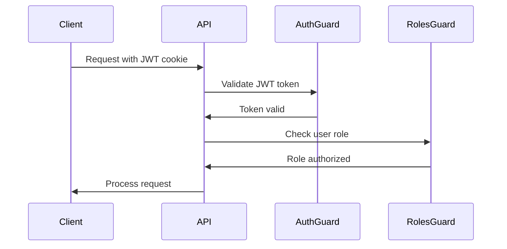
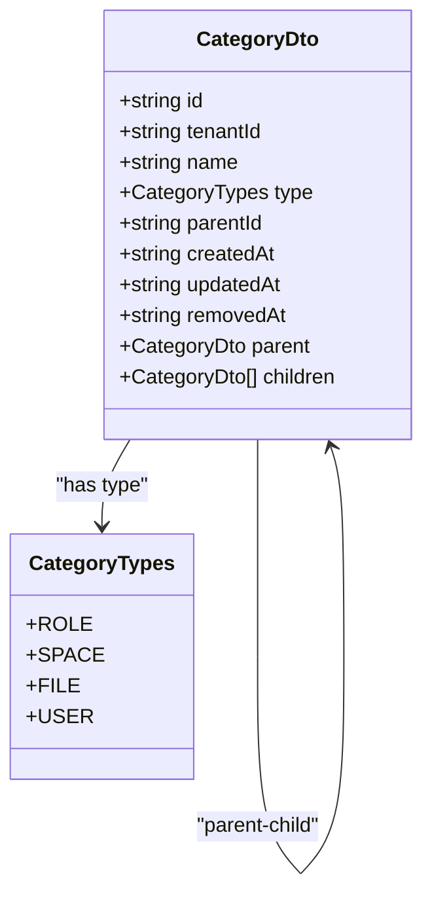
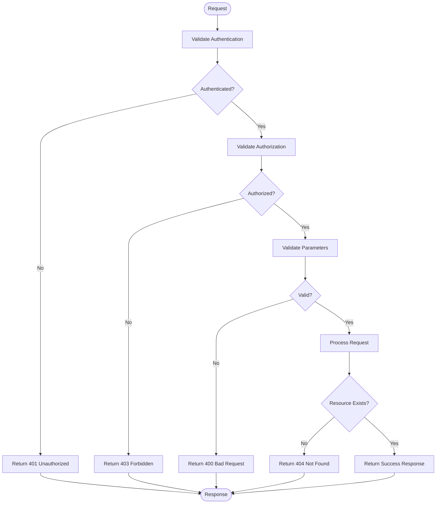
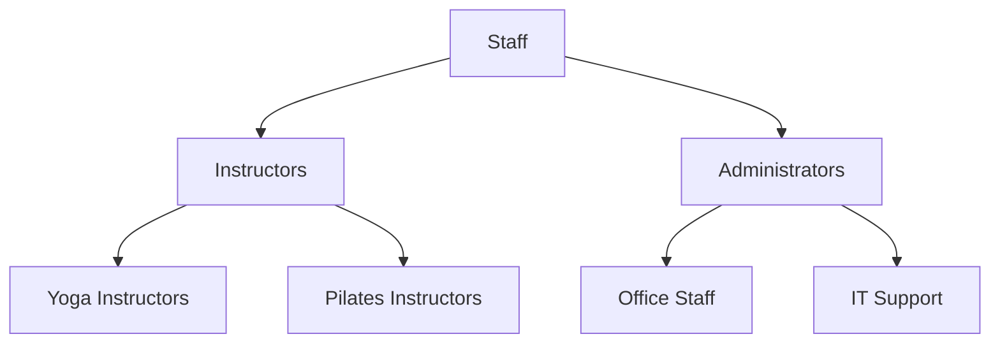

# Categories API

<cite>
**Referenced Files in This Document**   
- [categories.controller.ts](file://apps/server/src/shared/controller/resources/categories.controller.ts)
- [categories.service.ts](file://apps/server/src/shared/service/resources/categories.service.ts)
- [category.dto.ts](file://packages/schema/src/dto/category.dto.ts)
- [query-category.dto.ts](file://packages/schema/src/dto/query/query-category.dto.ts)
- [createCategoryDto.ts](file://packages/api-client/src/model/createCategoryDto.ts)
- [updateCategoryDto.ts](file://packages/api-client/src/model/updateCategoryDto.ts)
- [category.entity.ts](file://packages/schema/src/entity/category.entity.ts)
- [jwt.auth-guard.ts](file://apps/server/src/shared/guard/jwt.auth-guard.ts)
- [roles.guard.ts](file://apps/server/src/shared/guard/roles.guard.ts)
</cite>

## Table of Contents
1. [Introduction](#introduction)
2. [Authentication and Authorization](#authentication-and-authorization)
3. [Category Structure](#category-structure)
4. [API Endpoints](#api-endpoints)
   - [Get All Categories](#get-all-categories)
   - [Create Category](#create-category)
   - [Get Category by ID](#get-category-by-id)
   - [Update Category](#update-category)
   - [Delete Category](#delete-category)
5. [Query Parameters](#query-parameters)
6. [Request and Response Examples](#request-and-response-examples)
7. [Error Handling](#error-handling)
8. [Relationships with Other Entities](#relationships-with-other-entities)

## Introduction
The Categories API provides comprehensive functionality for managing hierarchical categories within the system. Categories serve as organizational units for various entities such as roles, spaces, files, and users. This API supports standard CRUD operations with additional features for hierarchical organization and tenant-based isolation.

The API follows REST principles with JSON payloads and is designed to work with JWT-based authentication. All category operations are tenant-scoped, ensuring data isolation between different tenants in the system.

**Section sources**
- [categories.controller.ts](file://apps/server/src/shared/controller/resources/categories.controller.ts#L25-L82)
- [categories.service.ts](file://apps/server/src/shared/service/resources/categories.service.ts#L7-L136)

## Authentication and Authorization
All endpoints in the Categories API require JWT authentication via cookie-based sessions. The API uses a two-layer security model:

1. **Authentication**: JWT token validation through the `JwtAuthGuard`
2. **Authorization**: Role-based access control through the `RolesGuard`

The system requires users to have appropriate roles within their tenant to perform category operations. The authentication process validates the JWT token in the request cookies, while authorization checks ensure the user has the necessary permissions for the requested operation.



**Diagram sources**
- [jwt.auth-guard.ts](file://apps/server/src/shared/guard/jwt.auth-guard.ts#L12-L62)
- [roles.guard.ts](file://apps/server/src/shared/guard/roles.guard.ts#L13-L58)

## Category Structure
Categories are hierarchical entities that can have parent-child relationships. Each category has a type that determines its purpose within the system. The structure supports nested organization with unlimited depth.

### Category Properties
| Property | Type | Required | Description |
|--------|------|----------|-------------|
| id | string (UUID) | Yes | Unique identifier |
| name | string | Yes | Category name |
| type | CategoryTypes | Yes | Category type (Role, Space, File, User) |
| parentId | string (UUID) \| null | No | Parent category ID (null for root categories) |
| tenantId | string (UUID) | Yes | Tenant identifier |
| createdAt | string (ISO date) | Yes | Creation timestamp |
| updatedAt | string (ISO date) | Yes | Last update timestamp |
| removedAt | string (ISO date) \| null | Yes | Deletion timestamp |

### Category Types
The system supports four category types:
- **Role**: Organizational roles within the tenant
- **Space**: Physical or virtual spaces
- **File**: File classification categories
- **User**: User classification categories



**Diagram sources**
- [category.dto.ts](file://packages/schema/src/dto/category.dto.ts#L10-L28)
- [category.entity.ts](file://packages/schema/src/entity/category.entity.ts#L8-L69)
- [category-types.enum.ts](file://packages/schema/src/enum/category-types.enum.ts#L4-L24)

## API Endpoints

### Get All Categories
Retrieve a paginated list of categories with optional filtering and sorting.

- **HTTP Method**: GET
- **URL Pattern**: `/api/v1/categories`
- **Authentication**: Required (JWT)
- **Authorization**: User must have appropriate tenant role

**Query Parameters**: See [Query Parameters](#query-parameters) section

**Response**:
- Status: 200 OK
- Content-Type: application/json
- Body: Paginated list of CategoryDto objects

**Section sources**
- [categories.controller.ts](file://apps/server/src/shared/controller/resources/categories.controller.ts#L30-L40)
- [categories.service.ts](file://apps/server/src/shared/service/resources/categories.service.ts#L60-L136)

### Create Category
Create a new category within the current tenant.

- **HTTP Method**: POST
- **URL Pattern**: `/api/v1/categories`
- **Authentication**: Required (JWT)
- **Authorization**: User must have appropriate tenant role

**Request Body**:
```json
{
  "tenantId": "string",
  "name": "string",
  "type": "Role|Space|File|User",
  "parentId": "string|null"
}
```

**Validation Constraints**:
- tenantId: Required, must be valid UUID
- name: Required, non-empty string
- type: Required, must be one of the valid CategoryTypes
- parentId: Optional, must be valid UUID if provided

**Response**:
- Status: 201 Created
- Content-Type: application/json
- Body: Created CategoryDto object

**Section sources**
- [categories.controller.ts](file://apps/server/src/shared/controller/resources/categories.controller.ts#L42-L51)
- [createCategoryDto.ts](file://packages/api-client/src/model/createCategoryDto.ts#L10-L16)

### Get Category by ID
Retrieve a specific category by its ID.

- **HTTP Method**: GET
- **URL Pattern**: `/api/v1/categories/{categoryId}`
- **Authentication**: Required (JWT)
- **Authorization**: User must have appropriate tenant role

**Path Parameters**:
- categoryId: string (UUID) - The ID of the category to retrieve

**Response**:
- Status: 200 OK
- Content-Type: application/json
- Body: CategoryDto object

**Section sources**
- [categories.controller.ts](file://apps/server/src/shared/controller/resources/categories.controller.ts#L52-L59)
- [categories.service.ts](file://apps/server/src/shared/service/resources/categories.service.ts#L38-L40)

### Update Category
Update an existing category.

- **HTTP Method**: PATCH
- **URL Pattern**: `/api/v1/categories/{categoryId}`
- **Authentication**: Required (JWT)
- **Authorization**: User must have appropriate tenant role

**Path Parameters**:
- categoryId: string (UUID) - The ID of the category to update

**Request Body**:
```json
{
  "tenantId": "string",
  "name": "string",
  "type": "Role|Space|File|User",
  "parentId": "string|null"
}
```

**Response**:
- Status: 200 OK
- Content-Type: application/json
- Body: Updated CategoryDto object

**Section sources**
- [categories.controller.ts](file://apps/server/src/shared/controller/resources/categories.controller.ts#L61-L73)
- [updateCategoryDto.ts](file://packages/api-client/src/model/updateCategoryDto.ts#L10-L16)

### Delete Category
Delete a category by its ID.

- **HTTP Method**: DELETE
- **URL Pattern**: `/api/v1/categories/{categoryId}`
- **Authentication**: Required (JWT)
- **Authorization**: User must have appropriate tenant role

**Path Parameters**:
- categoryId: string (UUID) - The ID of the category to delete

**Response**:
- Status: 204 No Content
- Body: None

**Section sources**
- [categories.controller.ts](file://apps/server/src/shared/controller/resources/categories.controller.ts#L75-L81)
- [categories.service.ts](file://apps/server/src/shared/service/resources/categories.service.ts#L49-L51)

## Query Parameters
The GET endpoint supports various query parameters for filtering, sorting, and pagination.

### Pagination Parameters
| Parameter | Type | Default | Constraints | Description |
|---------|------|---------|-------------|-------------|
| skip | number | 0 | minimum: 1 | Number of records to skip |
| take | number | 20 | minimum: 1, maximum: 50 | Number of records to return |

### Filtering Parameters
| Parameter | Type | Description |
|---------|------|-------------|
| name | string | Filter by category name (exact match) |
| type | CategoryTypes | Filter by category type |
| parentId | string (UUID) | Filter by parent category ID |
| tenantId | string (UUID) | Filter by tenant ID |
| serviceId | string (UUID) | Filter by service ID |

### Sorting Parameters
| Parameter | Type | Default | Description |
|---------|------|---------|-------------|
| nameSortOrder | SortOrder | ASC | Sort order for category names (ASC or DESC) |

**Section sources**
- [query-category.dto.ts](file://packages/schema/src/dto/query/query-category.dto.ts#L5-L23)
- [getCategoriesByQueryParams.ts](file://packages/api-client/src/model/getCategoriesByQueryParams.ts#L11-L27)

## Request and Response Examples

### Create Category Request
```bash
curl -X POST https://api.example.com/api/v1/categories \
  -H "Content-Type: application/json" \
  -H "Cookie: JWT_TOKEN=your-jwt-token" \
  -d '{
    "tenantId": "tenant-123",
    "name": "Instructors",
    "type": "Role",
    "parentId": null
  }'
```

### Create Category Response
```json
{
  "id": "cat-456",
  "seq": 1,
  "createdAt": "2025-01-15T10:30:00.000Z",
  "updatedAt": "2025-01-15T10:30:00.000Z",
  "removedAt": null,
  "tenantId": "tenant-123",
  "name": "Instructors",
  "type": "Role",
  "parentId": null,
  "parent": null,
  "children": []
}
```

### Get All Categories Response (Paginated)
```json
{
  "data": [
    {
      "id": "cat-1",
      "seq": 1,
      "createdAt": "2025-01-15T10:00:00.000Z",
      "updatedAt": "2025-01-15T10:00:00.000Z",
      "removedAt": null,
      "tenantId": "tenant-123",
      "name": "Staff",
      "type": "Role",
      "parentId": null,
      "parent": null,
      "children": [
        {
          "id": "cat-2",
          "seq": 2,
          "createdAt": "2025-01-15T10:15:00.000Z",
          "updatedAt": "2025-01-15T10:15:00.000Z",
          "removedAt": null,
          "tenantId": "tenant-123",
          "name": "Instructors",
          "type": "Role",
          "parentId": "cat-1",
          "parent": {
            "id": "cat-1",
            "name": "Staff"
          },
          "children": []
        }
      ]
    }
  ],
  "meta": {
    "total": 1,
    "page": 1,
    "take": 20,
    "itemCount": 1,
    "pageCount": 1,
    "hasPreviousPage": false,
    "hasNextPage": false
  }
}
```

**Section sources**
- [categories.controller.ts](file://apps/server/src/shared/controller/resources/categories.controller.ts#L30-L40)
- [categories.service.ts](file://apps/server/src/shared/service/resources/categories.service.ts#L60-L136)

## Error Handling
The API returns standardized error responses with appropriate HTTP status codes.

### Status Codes
| Code | Status | Description |
|------|--------|-------------|
| 200 | OK | Successful GET request |
| 201 | Created | Successful POST request |
| 204 | No Content | Successful DELETE request |
| 400 | Bad Request | Invalid request parameters or body |
| 401 | Unauthorized | Missing or invalid authentication |
| 403 | Forbidden | Insufficient permissions |
| 404 | Not Found | Resource not found |
| 500 | Internal Server Error | Unexpected server error |

### Common Error Scenarios
- **401 Unauthorized**: JWT token missing or invalid
- **403 Forbidden**: User lacks required role for the operation
- **404 Not Found**: Category ID does not exist
- **400 Bad Request**: Invalid request body or parameters



**Diagram sources**
- [jwt.auth-guard.ts](file://apps/server/src/shared/guard/jwt.auth-guard.ts#L12-L62)
- [roles.guard.ts](file://apps/server/src/shared/guard/roles.guard.ts#L13-L58)

## Relationships with Other Entities
Categories are used to organize various entities within the system. The hierarchical structure allows for flexible organization and classification.

### Entity Relationships
- **Programs**: Categories classify programs by type (e.g., fitness, wellness)
- **Exercises**: Categories organize exercises by muscle group or activity type
- **Spaces**: Categories define space types (e.g., studio, outdoor, virtual)
- **Users**: Categories classify users by role or membership type

### Hierarchical Structure Example


The category hierarchy supports unlimited nesting depth, allowing for complex organizational structures. Each category maintains references to its parent and children, enabling efficient traversal of the hierarchy.

**Section sources**
- [category.entity.ts](file://packages/schema/src/entity/category.entity.ts#L25-L60)
- [category.dto.ts](file://packages/schema/src/dto/category.dto.ts#L23-L27)