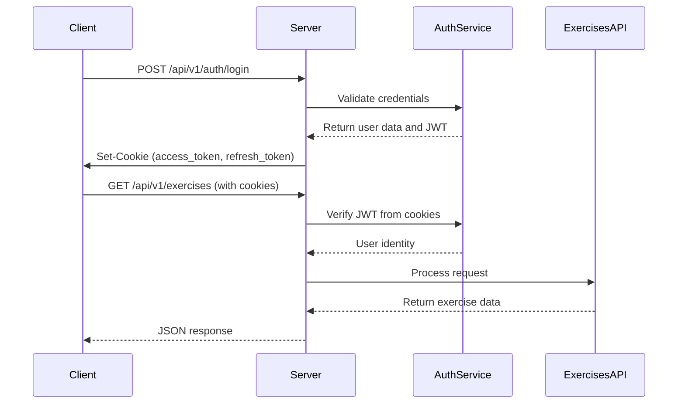
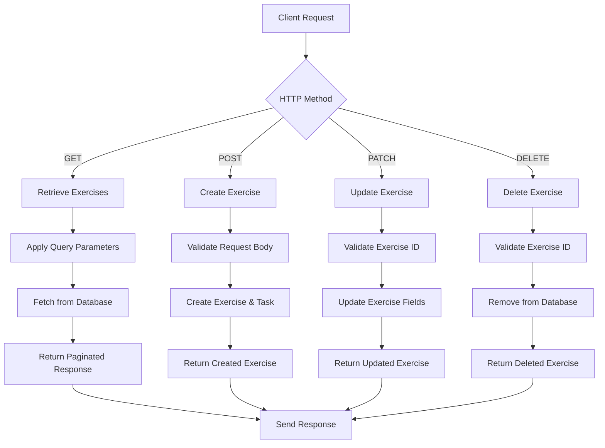
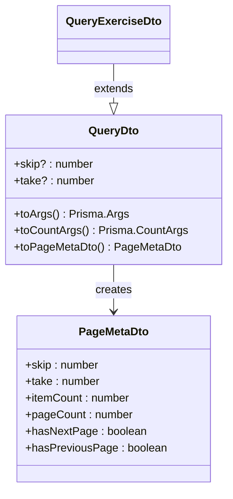
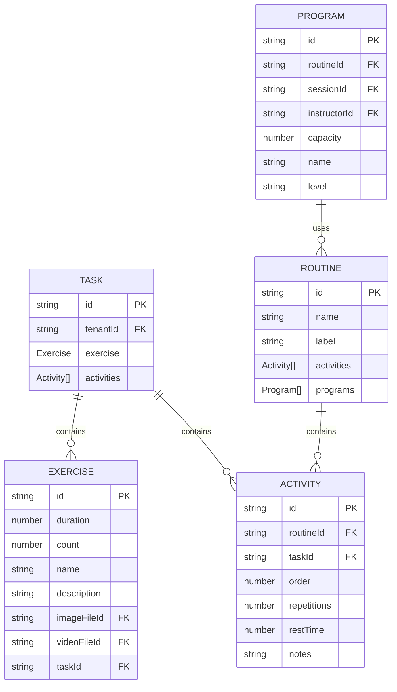

# Exercises API

<cite>
**Referenced Files in This Document**   
- [exercises.controller.ts](file://apps/server/src/shared/controller/resources/exercises.controller.ts)
- [exercises.service.ts](file://apps/server/src/shared/service/resources/exercises.service.ts)
- [exercises.repository.ts](file://apps/server/src/shared/repository/exercises.repository.ts)
- [exercise.dto.ts](file://packages/schema/src/dto/exercise.dto.ts)
- [create-exercise.dto.ts](file://packages/schema/src/dto/create/create-exercise.dto.ts)
- [update-exercise.dto.ts](file://packages/schema/src/dto/update/update-exercise.dto.ts)
- [query-exercise.dto.ts](file://packages/schema/src/dto/query/query-exercise.dto.ts)
- [query.dto.ts](file://packages/schema/src/dto/query/query.dto.ts)
- [abstract.dto.ts](file://packages/schema/src/dto/abstract.dto.ts)
- [exercise.entity.ts](file://packages/schema/src/entity/exercise.entity.ts)
- [task.entity.ts](file://packages/schema/src/entity/task.entity.ts)
- [activity.entity.ts](file://packages/schema/src/entity/activity.entity.ts)
- [routine.entity.ts](file://packages/schema/src/entity/routine.entity.ts)
- [program.entity.ts](file://packages/schema/src/entity/program.entity.ts)
- [jwt.auth-guard.ts](file://apps/server/src/shared/guard/jwt.auth-guard.ts)
- [auth.guard.ts](file://apps/server/src/shared/guard/auth.guard.ts)
</cite>

## Table of Contents
1. [Introduction](#introduction)
2. [Authentication and Authorization](#authentication-and-authorization)
3. [Request and Response Format](#request-and-response-format)
4. [Exercise Endpoints](#exercise-endpoints)
5. [Query Parameters for Filtering, Sorting, and Pagination](#query-parameters-for-filtering-sorting-and-pagination)
6. [Exercise Relationships with Other Entities](#exercise-relationships-with-other-entities)
7. [Error Responses](#error-responses)
8. [Sample curl Commands](#sample-curl-commands)

## Introduction
The Exercises API provides CRUD operations for managing exercise data within the system. Exercises represent physical activities that can be included in training programs and routines. Each exercise contains information such as name, duration, repetition count, and associated media files. The API follows RESTful principles and uses JWT-based authentication for secure access.

**Section sources**
- [exercises.controller.ts](file://apps/server/src/shared/controller/resources/exercises.controller.ts#L1-L90)

## Authentication and Authorization
All Exercises API endpoints require JWT-based authentication using cookie-based tokens. The system implements a guard mechanism that validates JWT tokens for every request, except for explicitly marked public routes (none exist for the Exercises API).

The authentication process works as follows:
1. Clients must first obtain a JWT token through the authentication endpoint
2. The server sets HttpOnly cookies containing access and refresh tokens
3. For subsequent requests to the Exercises API, the browser automatically includes these cookies
4. The server validates the JWT token and extracts user information
5. Access is granted if the token is valid and not expired

The `JwtAuthGuard` is applied to all exercise endpoints, ensuring that only authenticated users can access the resources. The guard checks for the presence of a valid JWT token in the request cookies and validates it against the user database.



**Diagram sources**
- [jwt.auth-guard.ts](file://apps/server/src/shared/guard/jwt.auth-guard.ts#L1-L49)
- [auth.guard.ts](file://apps/server/src/shared/guard/auth.guard.ts#L1-L13)

**Section sources**
- [jwt.auth-guard.ts](file://apps/server/src/shared/guard/jwt.auth-guard.ts#L1-L49)
- [auth.guard.ts](file://apps/server/src/shared/guard/auth.guard.ts#L1-L13)

## Request and Response Format
The Exercises API uses JSON for request and response payloads. All responses follow a consistent structure that includes status information and data.

### Request Payload Structure
When creating or updating exercises, the request body must be a JSON object with the following structure:

- `name` (string): The name of the exercise (required)
- `count` (number): The number of repetitions (required)
- `duration` (number): The duration in seconds (required)
- `description` (string, optional): Additional details about the exercise
- `imageFileId` (string, optional): ID of the associated image file
- `videoFileId` (string, optional): ID of the associated video file
- `tenantId` (string): ID of the tenant (required for creation)

### Response Format
All successful responses follow the same structure:

```json
{
  "httpStatus": 200,
  "message": "success",
  "data": { /* exercise data or array of exercises */ }
}
```

For paginated responses, the response includes additional metadata:

```json
{
  "httpStatus": 200,
  "message": "success",
  "data": [ /* array of exercises */ ],
  "meta": {
    "skip": 0,
    "take": 10,
    "itemCount": 25,
    "pageCount": 3,
    "hasNextPage": true,
    "hasPreviousPage": false
  }
}
```

**Section sources**
- [exercise.dto.ts](file://packages/schema/src/dto/exercise.dto.ts#L1-L38)
- [create-exercise.dto.ts](file://packages/schema/src/dto/create/create-exercise.dto.ts#L1-L14)
- [update-exercise.dto.ts](file://packages/schema/src/dto/update/update-exercise.dto.ts#L1-L5)

## Exercise Endpoints
The Exercises API provides comprehensive CRUD operations for managing exercise data.

### GET /api/v1/exercises
Retrieves a paginated list of exercises based on query parameters.

- **Method**: GET
- **Authentication**: Required (JWT via cookies)
- **Response Code**: 200 (OK)
- **Response Schema**: Array of ExerciseDto objects with pagination metadata

### POST /api/v1/exercises
Creates a new exercise.

- **Method**: POST
- **Authentication**: Required (JWT via cookies)
- **Request Body**: CreateExerciseDto
- **Response Code**: 200 (OK)
- **Response Schema**: ExerciseDto object

The endpoint creates both an Exercise entity and its associated Task entity, linking them together. The tenantId from the request is used to associate the task with the appropriate tenant.

### GET /api/v1/exercises/{exerciseId}
Retrieves a specific exercise by ID.

- **Method**: GET
- **Authentication**: Required (JWT via cookies)
- **Path Parameter**: exerciseId (string) - The unique identifier of the exercise
- **Response Code**: 200 (OK)
- **Response Schema**: ExerciseDto object
- **Error Codes**: 404 (Not Found) if the exercise does not exist

### PATCH /api/v1/exercises/{exerciseId}
Updates an existing exercise.

- **Method**: PATCH
- **Authentication**: Required (JWT via cookies)
- **Path Parameter**: exerciseId (string) - The unique identifier of the exercise
- **Request Body**: UpdateExerciseDto (partial update)
- **Response Code**: 200 (OK)
- **Response Schema**: ExerciseDto object
- **Error Codes**: 404 (Not Found) if the exercise does not exist

### PATCH /api/v1/exercises/{exerciseId}/removedAt
Soft deletes an exercise by setting the removedAt timestamp.

- **Method**: PATCH
- **Authentication**: Required (JWT via cookies)
- **Path Parameter**: exerciseId (string) - The unique identifier of the exercise
- **Response Code**: 200 (OK)
- **Response Schema**: ExerciseDto object
- **Behavior**: Sets the removedAt field to the current timestamp, making the exercise invisible in normal queries

### DELETE /api/v1/exercises/{exerciseId}
Hard deletes an exercise from the database.

- **Method**: DELETE
- **Authentication**: Required (JWT via cookies)
- **Path Parameter**: exerciseId (string) - The unique identifier of the exercise
- **Response Code**: 200 (OK)
- **Response Schema**: ExerciseDto object
- **Behavior**: Permanently removes the exercise record from the database



**Diagram sources**
- [exercises.controller.ts](file://apps/server/src/shared/controller/resources/exercises.controller.ts#L31-L90)
- [exercises.service.ts](file://apps/server/src/shared/service/resources/exercises.service.ts#L18-L77)

**Section sources**
- [exercises.controller.ts](file://apps/server/src/shared/controller/resources/exercises.controller.ts#L31-L90)
- [exercises.service.ts](file://apps/server/src/shared/service/resources/exercises.service.ts#L18-L77)

## Query Parameters for Filtering, Sorting, and Pagination
The GET /api/v1/exercises endpoint supports various query parameters for filtering, sorting, and pagination.

### Pagination Parameters
- `skip` (number, optional): Number of records to skip (default: undefined)
- `take` (number, optional): Number of records to return (minimum: 1, maximum: 50, default: undefined)

These parameters enable pagination of results. The `skip` parameter specifies the offset from the beginning of the result set, while `take` specifies the maximum number of records to return.

### Default Sorting
By default, exercises are sorted by creation date in descending order (newest first). This is implemented in the QueryDto class, which automatically adds an orderBy clause to all queries if not explicitly overridden.

### Custom Filtering and Sorting
Additional filtering and sorting can be achieved by extending the base query parameters. The QueryExerciseDto inherits from QueryDto and can be extended to support exercise-specific filtering criteria such as name, duration range, or count range.

The pagination system uses the PaginationUtil class to convert query parameters into Prisma query arguments. The count of total records is retrieved separately to provide accurate pagination metadata.



**Diagram sources**
- [query-exercise.dto.ts](file://packages/schema/src/dto/query/query-exercise.dto.ts#L1-L4)
- [query.dto.ts](file://packages/schema/src/dto/query/query.dto.ts#L1-L59)
- [exercise.dto.ts](file://packages/schema/src/dto/exercise.dto.ts#L1-L38)

**Section sources**
- [query-exercise.dto.ts](file://packages/schema/src/dto/query/query-exercise.dto.ts#L1-L4)
- [query.dto.ts](file://packages/schema/src/dto/query/query.dto.ts#L1-L59)

## Exercise Relationships with Other Entities
Exercises are connected to several other entities in the system, forming a hierarchical structure for organizing training content.

### Exercise-Task Relationship
Each exercise is associated with exactly one task through the taskId field. The Task entity serves as a container that links exercises to broader organizational structures.



**Diagram sources**
- [exercise.entity.ts](file://packages/schema/src/entity/exercise.entity.ts#L1-L22)
- [task.entity.ts](file://packages/schema/src/entity/task.entity.ts#L1-L15)
- [activity.entity.ts](file://packages/schema/src/entity/activity.entity.ts#L1-L23)
- [routine.entity.ts](file://packages/schema/src/entity/routine.entity.ts#L1-L18)

### Activity-Routine Relationship
Tasks containing exercises are used within routines through the Activity entity. An Activity represents an instance of a task within a specific routine, allowing the same exercise to be used in multiple routines with different parameters (repetitions, rest time, order).

### Program-Routine Relationship
Routines are then used within programs, creating a hierarchy where:
- Programs contain Routines
- Routines contain Activities
- Activities reference Tasks
- Tasks contain Exercises

This structure allows for flexible organization of training content, where exercises can be reused across different routines and programs.

**Section sources**
- [exercise.entity.ts](file://packages/schema/src/entity/exercise.entity.ts#L1-L22)
- [task.entity.ts](file://packages/schema/src/entity/task.entity.ts#L1-L15)
- [activity.entity.ts](file://packages/schema/src/entity/activity.entity.ts#L1-L23)

## Error Responses
The Exercises API returns standardized error responses for various failure scenarios.

### Common Error Status Codes
- **400 Bad Request**: Invalid request parameters or body
- **401 Unauthorized**: Missing or invalid authentication token
- **403 Forbidden**: Authenticated user lacks required permissions
- **404 Not Found**: Requested exercise does not exist
- **500 Internal Server Error**: Unexpected server error

### Error Response Format
All error responses follow the same structure as success responses but with an error status code:

```json
{
  "httpStatus": 404,
  "message": "Exercise not found",
  "data": null
}
```

The API uses NestJS exception filters to ensure consistent error formatting across all endpoints. When an exercise is not found during retrieval, update, or deletion operations, a 404 Not Found response is returned.

**Section sources**
- [exercises.controller.ts](file://apps/server/src/shared/controller/resources/exercises.controller.ts#L31-L90)
- [exercises.service.ts](file://apps/server/src/shared/service/resources/exercises.service.ts#L52-L77)

## Sample curl Commands
Below are example curl commands demonstrating common operations with the Exercises API.

### Get All Exercises with Pagination
```bash
curl -X GET "http://localhost:3000/api/v1/exercises?skip=0&take=10" \
  -H "Cookie: access_token=your-jwt-token-here" \
  -H "Content-Type: application/json"
```

### Create a New Exercise
```bash
curl -X POST "http://localhost:3000/api/v1/exercises" \
  -H "Cookie: access_token=your-jwt-token-here" \
  -H "Content-Type: application/json" \
  -d '{
    "name": "Push Up",
    "count": 15,
    "duration": 60,
    "description": "Standard push up exercise",
    "tenantId": "tenant-123"
  }'
```

### Get a Specific Exercise
```bash
curl -X GET "http://localhost:3000/api/v1/exercises/exercise-456" \
  -H "Cookie: access_token=your-jwt-token-here" \
  -H "Content-Type: application/json"
```

### Update an Exercise
```bash
curl -X PATCH "http://localhost:3000/api/v1/exercises/exercise-456" \
  -H "Cookie: access_token=your-jwt-token-here" \
  -H "Content-Type: application/json" \
  -d '{
    "count": 20,
    "duration": 90
  }'
```

### Soft Delete an Exercise
```bash
curl -X PATCH "http://localhost:3000/api/v1/exercises/exercise-456/removedAt" \
  -H "Cookie: access_token=your-jwt-token-here" \
  -H "Content-Type: application/json"
```

### Hard Delete an Exercise
```bash
curl -X DELETE "http://localhost:3000/api/v1/exercises/exercise-456" \
  -H "Cookie: access_token=your-jwt-token-here" \
  -H "Content-Type: application/json"
```

**Section sources**
- [exercises.controller.ts](file://apps/server/src/shared/controller/resources/exercises.controller.ts#L31-L90)