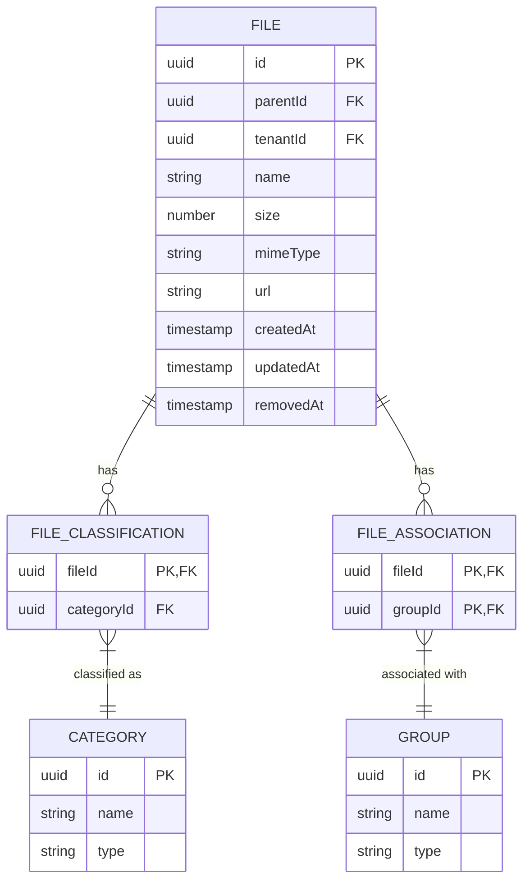

# Files API

<cite>
**Referenced Files in This Document**   
- [files.controller.ts](file://apps/server/src/shared/controller/resources/files.controller.ts)
- [files.service.ts](file://apps/server/src/shared/service/resources/files.service.ts)
- [file.dto.ts](file://packages/schema/src/dto/file.dto.ts)
- [file.entity.ts](file://packages/schema/src/entity/file.entity.ts)
- [query-file.dto.ts](file://packages/schema/src/dto/query/query-file.dto.ts)
- [query.dto.ts](file://packages/schema/src/dto/query/query.dto.ts)
- [file-association.dto.ts](file://packages/schema/src/dto/file-association.dto.ts)
- [file-classification.dto.ts](file://packages/schema/src/dto/file-classification.dto.ts)
</cite>

## Table of Contents
1. [Introduction](#introduction)
2. [Authentication and Authorization](#authentication-and-authorization)
3. [File Endpoints](#file-endpoints)
4. [Request Structure](#request-structure)
5. [Response Structure](#response-structure)
6. [Query Parameters](#query-parameters)
7. [File Associations and Classifications](#file-associations-and-classifications)
8. [Error Handling](#error-handling)
9. [Examples](#examples)

## Introduction
The Files API provides comprehensive file management capabilities for the application, enabling users to upload, retrieve, update, and delete files. The API supports file associations with various entities such as exercises and programs through classification and association mechanisms. All endpoints follow RESTful principles and return standardized response formats.

**Section sources**
- [files.controller.ts](file://apps/server/src/shared/controller/resources/files.controller.ts#L1-L71)
- [files.service.ts](file://apps/server/src/shared/service/resources/files.service.ts#L1-L56)

## Authentication and Authorization
All endpoints in the Files API require authentication via JWT (JSON Web Token). The authorization rules are enforced through the application's role-based access control system. Users must have appropriate permissions to perform file operations based on their role and the tenant context. The API validates the JWT token on each request and ensures the user has the necessary privileges to access or modify files.

**Section sources**
- [files.controller.ts](file://apps/server/src/shared/controller/resources/files.controller.ts#L21-L71)

## File Endpoints

### GET /:fileId
Retrieves a specific file by its ID.

- **HTTP Method**: GET
- **Response Status**: 200 (OK)
- **Authentication**: Required (JWT)

### POST /
Creates a new file record.

- **HTTP Method**: POST
- **Response Status**: 201 (Created)
- **Authentication**: Required (JWT)
- **Request Body**: CreateFileDto

### PATCH /:fileId/removedAt
Marks a file as removed (soft delete) by setting the removedAt timestamp.

- **HTTP Method**: PATCH
- **Response Status**: 200 (OK)
- **Authentication**: Required (JWT)

### PATCH /:fileId
Updates a file, including uploading a new file version.

- **HTTP Method**: PATCH
- **Response Status**: 200 (OK)
- **Authentication**: Required (JWT)
- **Request**: Multipart form data with files

**Section sources**
- [files.controller.ts](file://apps/server/src/shared/controller/resources/files.controller.ts#L25-L70)

## Request Structure

### File Upload (PATCH /:fileId)
File uploads are performed using multipart form data. The request must include:

- **Content-Type**: multipart/form-data
- **Form Field**: files (array of File objects)
- **File Size Limit**: Not explicitly defined in controller, but constrained by server configuration
- **Validation Rules**: 
  - Files must be provided in the multipart form
  - File metadata is validated according to FileDto schema

The API uses the @ApiFile decorator to document the file upload capability in the OpenAPI specification.

**Section sources**
- [files.controller.ts](file://apps/server/src/shared/controller/resources/files.controller.ts#L54-L61)

## Response Structure

### FileDto
The response format for file operations includes the following properties:

| Field | Type | Description |
|-------|------|-------------|
| id | string (UUID) | Unique identifier for the file |
| parentId | string (UUID) | ID of the parent file/directory |
| tenantId | string (UUID) | ID of the tenant that owns the file |
| name | string | File name |
| size | number | File size in bytes |
| mimeType | string | MIME type of the file |
| url | string | Public URL to access the file |
| createdAt | string (ISO date) | Creation timestamp |
| updatedAt | string (ISO date) | Last update timestamp |
| removedAt | string (ISO date) | Deletion timestamp (null if not removed) |
| tenant | TenantDto | Associated tenant information |
| classification | FileClassificationDto | File classification details |
| associations | Array<FileAssociation> | List of entity associations |

**Section sources**
- [file.dto.ts](file://packages/schema/src/dto/file.dto.ts#L8-L39)
- [file.entity.ts](file://packages/schema/src/entity/file.entity.ts#L7-L14)

## Query Parameters

### Pagination
The API supports pagination through the QueryFileDto which extends the base QueryDto. Available parameters:

| Parameter | Type | Required | Default | Description |
|-----------|------|----------|---------|-------------|
| skip | number | No | 0 | Number of records to skip |
| take | number | No | undefined | Number of records to return (maximum 50) |

### Sorting and Filtering
While the controller doesn't explicitly expose sorting and filtering parameters, the QueryDto base class provides orderBy functionality with a default of createdAt in descending order. Additional filtering can be implemented through the service layer's toArgs method which processes the query parameters into Prisma query arguments.

**Section sources**
- [query-file.dto.ts](file://packages/schema/src/dto/query/query-file.dto.ts#L3-L4)
- [query.dto.ts](file://packages/schema/src/dto/query/query.dto.ts#L6-L59)

## File Associations and Classifications

### File Classification
Files can be classified using categories through the FileClassification entity. Each classification includes:

- **fileId**: Reference to the file
- **categoryId**: Reference to the category
- **category**: CategoryDto object with classification details

This allows files to be categorized by type (e.g., exercise, program, etc.).

### File Associations
Files can be associated with various entities through the FileAssociation entity. Each association includes:

- **fileId**: Reference to the file
- **groupId**: Reference to the associated entity (which could represent exercises, programs, or other entities)
- **file**: FileDto object (excluded from Swagger documentation)

This association mechanism enables files to be linked to multiple entities across the system.



**Diagram sources**
- [file.dto.ts](file://packages/schema/src/dto/file.dto.ts#L8-L39)
- [file-association.dto.ts](file://packages/schema/src/dto/file-association.dto.ts#L5-L14)
- [file-classification.dto.ts](file://packages/schema/src/dto/file-classification.dto.ts#L5-L20)

**Section sources**
- [file-association.dto.ts](file://packages/schema/src/dto/file-association.dto.ts#L1-L15)
- [file-classification.dto.ts](file://packages/schema/src/dto/file-classification.dto.ts#L1-L21)

## Error Handling
The API returns standardized error responses with appropriate HTTP status codes:

| Status Code | Error Type | Description |
|-------------|------------|-------------|
| 400 | Bad Request | Invalid request parameters or body |
| 401 | Unauthorized | Missing or invalid authentication token |
| 403 | Forbidden | Insufficient permissions to perform the operation |
| 404 | Not Found | Requested file does not exist |
| 413 | Payload Too Large | File size exceeds server limits |
| 500 | Internal Server Error | Unexpected server error during processing |

The response format follows the ResponseEntity pattern with consistent error messaging.

**Section sources**
- [files.controller.ts](file://apps/server/src/shared/controller/resources/files.controller.ts#L25-L70)
- [files.service.ts](file://apps/server/src/shared/service/resources/files.service.ts#L34-L54)

## Examples

### Create File Response (201)
```json
{
  "data": {
    "id": "123e4567-e89b-12d3-a456-426614174000",
    "parentId": "123e4567-e89b-12d3-a456-426614174001",
    "tenantId": "123e4567-e89b-12d3-a456-426614174002",
    "name": "example.pdf",
    "size": 102400,
    "mimeType": "application/pdf",
    "url": "https://example.com/files/123e4567-e89b-12d3-a456-426614174000",
    "createdAt": "2023-01-01T00:00:00.000Z",
    "updatedAt": "2023-01-01T00:00:00.000Z",
    "removedAt": null
  },
  "meta": {
    "status": "success"
  }
}
```

### File Upload cURL Command
```bash
curl -X PATCH \
  'http://localhost:3000/files/123e4567-e89b-12d3-a456-426614174000' \
  -H 'Authorization: Bearer <your-jwt-token>' \
  -H 'Content-Type: multipart/form-data' \
  -F 'files=@/path/to/your/file.pdf' \
  -v
```

### Get Files with Pagination
```bash
curl -X GET \
  'http://localhost:3000/files?take=10&skip=0' \
  -H 'Authorization: Bearer <your-jwt-token>'
```

**Section sources**
- [files.controller.ts](file://apps/server/src/shared/controller/resources/files.controller.ts#L25-L70)
- [file.dto.ts](file://packages/schema/src/dto/file.dto.ts#L8-L39)