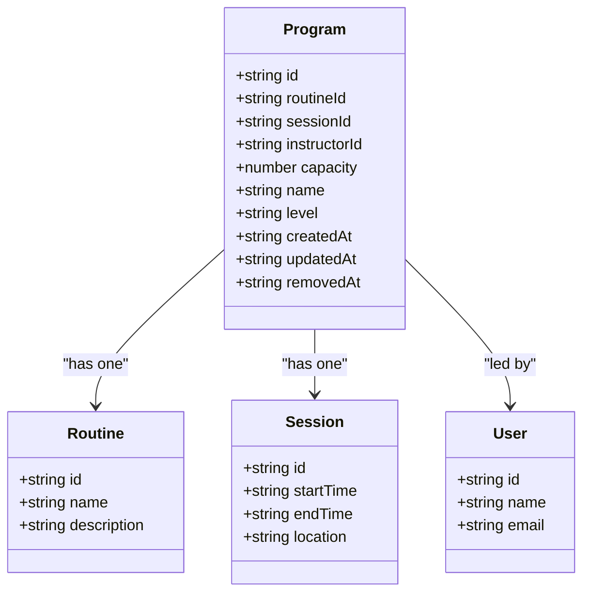
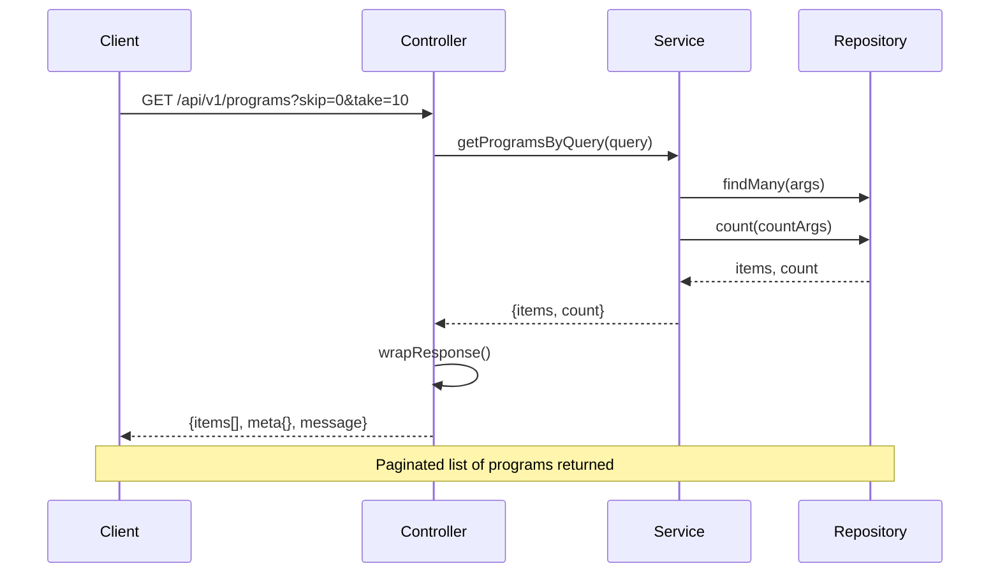
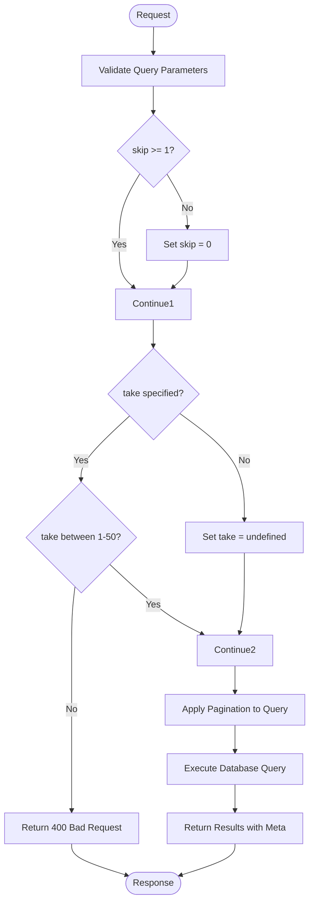
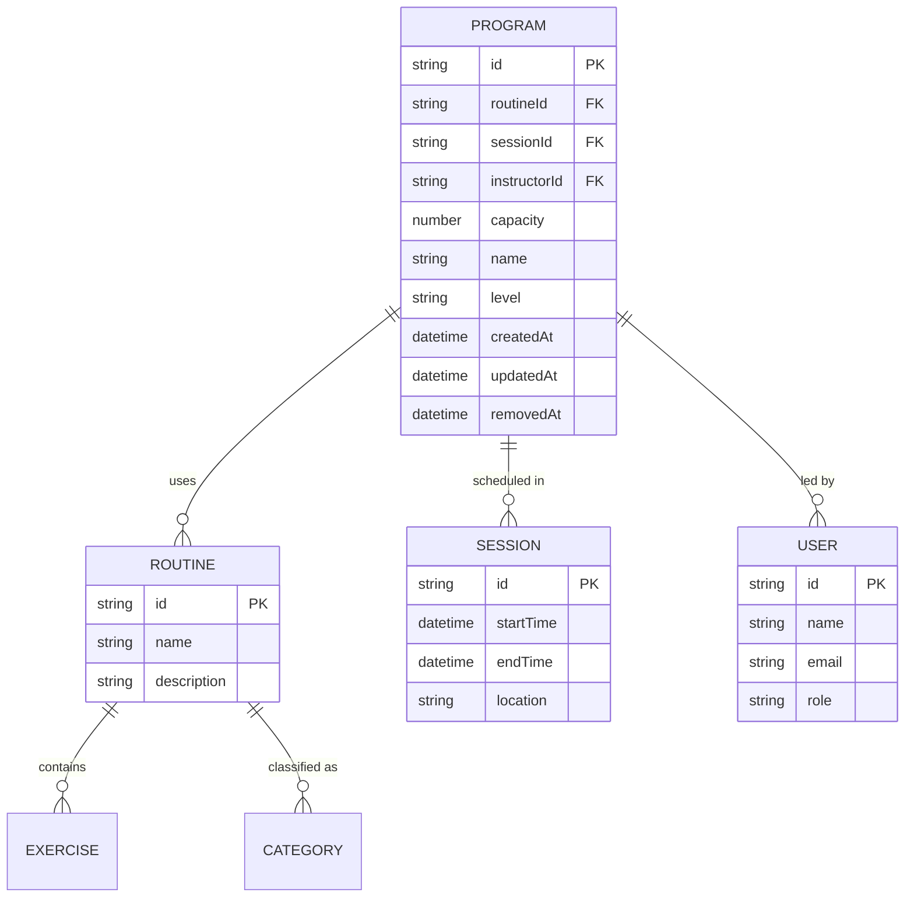

# Programs API

<cite>
**Referenced Files in This Document**   
- [programs.controller.ts](file://apps/server/src/shared/controller/resources/programs.controller.ts)
- [programs.service.ts](file://apps/server/src/shared/service/resources/programs.service.ts)
- [programs.repository.ts](file://apps/server/src/shared/repository/programs.repository.ts)
- [program.dto.ts](file://packages/schema/src/dto/program.dto.ts)
- [create-program.dto.ts](file://packages/schema/src/dto/create/create-program.dto.ts)
- [update-program.dto.ts](file://packages/schema/src/dto/update/update-program.dto.ts)
- [query-program.dto.ts](file://packages/schema/src/dto/query/query-program.dto.ts)
- [query.dto.ts](file://packages/schema/src/dto/query/query.dto.ts)
- [program.entity.ts](file://packages/schema/src/entity/program.entity.ts)
</cite>

## Table of Contents
1. [Introduction](#introduction)
2. [Authentication and Authorization](#authentication-and-authorization)
3. [Program Entity Structure](#program-entity-structure)
4. [CRUD Operations](#crud-operations)
   - [Create Program](#create-program)
   - [Get Program by ID](#get-program-by-id)
   - [Update Program](#update-program)
   - [Remove Program](#remove-program)
   - [Delete Program](#delete-program)
   - [List Programs](#list-programs)
5. [Query Parameters](#query-parameters)
6. [Request and Response Examples](#request-and-response-examples)
7. [Relationships with Other Entities](#relationships-with-other-entities)
8. [Error Handling](#error-handling)

## Introduction

The Programs API provides comprehensive management capabilities for program entities within the system. This API supports full CRUD (Create, Read, Update, Delete) operations for programs, which represent structured fitness or training sessions that include routines, exercises, and scheduling information. The API follows RESTful principles and uses JWT-based authentication for secure access.

The program entity serves as a central component that connects various aspects of the system including routines, sessions, instructors, and participants. This documentation details all available endpoints, request/response formats, authentication requirements, and relationships with other entities.

**Section sources**
- [programs.controller.ts](file://apps/server/src/shared/controller/resources/programs.controller.ts#L26-L88)

## Authentication and Authorization

All Programs API endpoints require JWT-based authentication. Clients must include a valid JWT token in the Authorization header for all requests.

```
Authorization: Bearer <your-jwt-token>
```

The API implements role-based access control (RBAC) to determine authorization levels:

- **Admin users**: Full access to all program operations including creation, modification, soft removal, and permanent deletion
- **Instructor users**: Can create, read, and update programs they own; can soft remove their own programs
- **Regular users**: Read-only access to active programs

Endpoints that modify program state (POST, PATCH, DELETE) require appropriate permissions. Attempting operations without sufficient privileges will result in a 403 Forbidden response.

The system distinguishes between "removal" and "deletion":
- **Remove**: Soft removal that sets the `removedAt` timestamp (PATCH /programs/{programId}/removedAt)
- **Delete**: Permanent removal from the database (DELETE /programs/{programId})

**Section sources**
- [programs.controller.ts](file://apps/server/src/shared/controller/resources/programs.controller.ts#L31-L78)
- [programs.service.ts](file://apps/server/src/shared/service/resources/programs.service.ts#L14-L54)

## Program Entity Structure

The Program entity represents a structured training session or course that includes scheduling information, capacity limits, and associated routines. Each program has the following properties:

| Field | Type | Required | Description |
|-------|------|----------|-------------|
| id | string (UUID) | Yes | Unique identifier for the program |
| routineId | string (UUID) | Yes | Reference to the associated routine |
| sessionId | string (UUID) | Yes | Reference to the associated session |
| instructorId | string (UUID) | Yes | Reference to the instructor user |
| capacity | number | Yes | Maximum number of participants |
| name | string | Yes | Name of the program |
| level | string \| null | No | Difficulty level (beginner, intermediate, advanced) |
| createdAt | string (ISO date) | Yes | Creation timestamp |
| updatedAt | string (ISO date) | Yes | Last update timestamp |
| removedAt | string (ISO date) \| null | No | Soft removal timestamp |

The program entity also includes relationships with other entities:
- **Routine**: The exercise routine associated with this program
- **Session**: The time slot and location information for this program
- **Instructor**: The user who leads this program



**Diagram sources**
- [program.dto.ts](file://packages/schema/src/dto/program.dto.ts#L13-L37)
- [program.entity.ts](file://packages/schema/src/entity/program.entity.ts#L8-L22)

**Section sources**
- [program.dto.ts](file://packages/schema/src/dto/program.dto.ts#L13-L37)
- [program.entity.ts](file://packages/schema/src/entity/program.entity.ts#L8-L22)

## CRUD Operations

### Create Program

Creates a new program with the specified properties.

- **HTTP Method**: POST
- **URL Pattern**: `/api/v1/programs`
- **Authentication**: Required (JWT)
- **Authorization**: Admin or Instructor role

**Request Body Parameters**:
All fields except `level` are required.

| Field | Type | Constraints | Description |
|-------|------|-------------|-------------|
| routineId | string | UUID format | ID of the associated routine |
| sessionId | string | UUID format | ID of the associated session |
| instructorId | string | UUID format | ID of the instructor user |
| capacity | number | Minimum: 1, Integer | Maximum number of participants |
| name | string | Minimum length: 1 | Name of the program |
| level | string | Optional | Difficulty level (e.g., "beginner", "intermediate", "advanced") |

**Response**:
- **Status Code**: 200 OK
- Returns the created program object with all fields including timestamps

**Section sources**
- [programs.controller.ts](file://apps/server/src/shared/controller/resources/programs.controller.ts#L31-L38)
- [create-program.dto.ts](file://packages/schema/src/dto/create/create-program.dto.ts#L5-L9)

### Get Program by ID

Retrieves a specific program by its unique identifier.

- **HTTP Method**: GET
- **URL Pattern**: `/api/v1/programs/{programId}`
- **Authentication**: Required (JWT)
- **Authorization**: Any authenticated user

**Path Parameters**:
| Parameter | Type | Description |
|-----------|------|-------------|
| programId | string | UUID of the program to retrieve |

**Response**:
- **Status Code**: 200 OK
- Returns the program object if found
- Returns 404 Not Found if the program does not exist or has been permanently deleted

**Section sources**
- [programs.controller.ts](file://apps/server/src/shared/controller/resources/programs.controller.ts#L40-L46)
- [programs.service.ts](file://apps/server/src/shared/service/resources/programs.service.ts#L34-L35)

### Update Program

Updates the properties of an existing program.

- **HTTP Method**: PATCH
- **URL Pattern**: `/api/v1/programs/{programId}`
- **Authentication**: Required (JWT)
- **Authorization**: Admin or owner (instructor) of the program

**Path Parameters**:
| Parameter | Type | Description |
|-----------|------|-------------|
| programId | string | UUID of the program to update |

**Request Body Parameters**:
All fields are optional. Only provided fields will be updated.

| Field | Type | Constraints | Description |
|-------|------|-------------|-------------|
| routineId | string | UUID format | New routine association |
| sessionId | string | UUID format | New session association |
| instructorId | string | UUID format | New instructor assignment |
| capacity | number | Minimum: 1, Integer | Updated capacity |
| name | string | Minimum length: 1 | Updated name |
| level | string | Optional | Updated difficulty level |

**Response**:
- **Status Code**: 200 OK
- Returns the updated program object

**Section sources**
- [programs.controller.ts](file://apps/server/src/shared/controller/resources/programs.controller.ts#L48-L57)
- [update-program.dto.ts](file://packages/schema/src/dto/update/update-program.dto.ts#L4)

### Remove Program

Soft removes a program by setting the `removedAt` timestamp. The program remains in the database but is not included in standard queries.

- **HTTP Method**: PATCH
- **URL Pattern**: `/api/v1/programs/{programId}/removedAt`
- **Authentication**: Required (JWT)
- **Authorization**: Admin or owner (instructor) of the program

**Path Parameters**:
| Parameter | Type | Description |
|-----------|------|-------------|
| programId | string | UUID of the program to remove |

**Response**:
- **Status Code**: 200 OK
- Returns the program object with the `removedAt` field set to the current timestamp

**Section sources**
- [programs.controller.ts](file://apps/server/src/shared/controller/resources/programs.controller.ts#L59-L65)
- [programs.service.ts](file://apps/server/src/shared/service/resources/programs.service.ts#L49-L54)

### Delete Program

Permanently deletes a program from the database.

- **HTTP Method**: DELETE
- **URL Pattern**: `/api/v1/programs/{programId}`
- **Authentication**: Required (JWT)
- **Authorization**: Admin role only

**Path Parameters**:
| Parameter | Type | Description |
|-----------|------|-------------|
| programId | string | UUID of the program to delete |

**Response**:
- **Status Code**: 200 OK
- Returns the deleted program object
- Returns 404 Not Found if the program does not exist

**Section sources**
- [programs.controller.ts](file://apps/server/src/shared/controller/resources/programs.controller.ts#L67-L73)
- [programs.service.ts](file://apps/server/src/shared/service/resources/programs.service.ts#L45-L47)

### List Programs

Retrieves a paginated list of programs matching the specified query parameters.

- **HTTP Method**: GET
- **URL Pattern**: `/api/v1/programs`
- **Authentication**: Required (JWT)
- **Authorization**: Any authenticated user

**Query Parameters**:
See [Query Parameters](#query-parameters) section for details.

**Response**:
- **Status Code**: 200 OK
- Returns a paginated response containing:
  - `items`: Array of program objects
  - `meta`: Pagination metadata including total count, skip, and take values
  - `message`: Status message ("success")

The response excludes soft-removed programs by default.



**Diagram sources**
- [programs.controller.ts](file://apps/server/src/shared/controller/resources/programs.controller.ts#L75-L87)
- [programs.service.ts](file://apps/server/src/shared/service/resources/programs.service.ts#L22-L31)

**Section sources**
- [programs.controller.ts](file://apps/server/src/shared/controller/resources/programs.controller.ts#L75-L87)
- [programs.service.ts](file://apps/server/src/shared/service/resources/programs.service.ts#L22-L31)

## Query Parameters

The GET /programs endpoint supports query parameters for filtering, sorting, and pagination. These parameters are defined in the `QueryProgramDto` class which extends the base `QueryDto`.

### Pagination Parameters

| Parameter | Type | Default | Constraints | Description |
|-----------|------|---------|-------------|-------------|
| skip | number | 0 | Minimum: 1 (if specified), Integer | Number of records to skip (for pagination) |
| take | number | undefined | Minimum: 1, Maximum: 50, Integer | Number of records to return |

By default, results are ordered by creation date in descending order (newest first).

### Usage Examples

**Get first 10 programs**:
```
GET /api/v1/programs?take=10
```

**Get programs 11-20**:
```
GET /api/v1/programs?skip=10&take=10
```

**Get all programs (limited to 50 maximum)**:
```
GET /api/v1/programs?take=50
```

The system enforces a maximum limit of 50 items per request to prevent performance issues with large result sets.



**Diagram sources**
- [query.dto.ts](file://packages/schema/src/dto/query/query.dto.ts#L6-L58)
- [query-program.dto.ts](file://packages/schema/src/dto/query/query-program.dto.ts#L3)

**Section sources**
- [query.dto.ts](file://packages/schema/src/dto/query/query.dto.ts#L6-L58)
- [query-program.dto.ts](file://packages/schema/src/dto/query/query-program.dto.ts#L3)

## Request and Response Examples

### Create Program Request

```json
{
  "routineId": "c4e4b2e1-3b2c-4d1a-9e8a-1b2c3d4e5f6a",
  "sessionId": "d5f5c3d2-4c3d-5e2b-af9b-2c3d4e5f6g7b",
  "instructorId": "a1b2c3d4-5e6f-7a8b-9c0d-1e2f3g4h5i6j",
  "capacity": 15,
  "name": "Morning Yoga Session",
  "level": "beginner"
}
```

### Create Program Response (200 OK)

```json
{
  "data": {
    "id": "e6g6d4e3-5f4e-6f3c-8d0a-3d4e5f6g7h8c",
    "routineId": "c4e4b2e1-3b2c-4d1a-9e8a-1b2c3d4e5f6a",
    "sessionId": "d5f5c3d2-4c3d-5e2b-af9b-2c3d4e5f6g7b",
    "instructorId": "a1b2c3d4-5e6f-7a8b-9c0d-1e2f3g4h5i6j",
    "capacity": 15,
    "name": "Morning Yoga Session",
    "level": "beginner",
    "createdAt": "2025-01-15T10:30:00.000Z",
    "updatedAt": "2025-01-15T10:30:00.000Z",
    "removedAt": null
  }
}
```

### Get Programs Response (200 OK)

```json
{
  "data": [
    {
      "id": "e6g6d4e3-5f4e-6f3c-8d0a-3d4e5f6g7h8c",
      "routineId": "c4e4b2e1-3b2c-4d1a-9e8a-1b2c3d4e5f6a",
      "sessionId": "d5f5c3d2-4c3d-5e2b-af9b-2c3d4e5f6g7b",
      "instructorId": "a1b2c3d4-5e6f-7a8b-9c0d-1e2f3g4h5i6j",
      "capacity": 15,
      "name": "Morning Yoga Session",
      "level": "beginner",
      "createdAt": "2025-01-15T10:30:00.000Z",
      "updatedAt": "2025-01-15T10:30:00.000Z",
      "removedAt": null
    },
    {
      "id": "f7h7e5f4-6g5f-7g4d-9e1b-4e5f6g7h8i9d",
      "routineId": "e5f5c3d2-4c3d-5e2b-af9b-2c3d4e5f6g7c",
      "sessionId": "e6g6d4e3-5f4e-6f3c-8d0a-3d4e5f6g7h8d",
      "instructorId": "b2c3d4e5-6f7g-8h9i-0j1k-2f3g4h5i6j7k",
      "capacity": 20,
      "name": "Evening Strength Training",
      "level": "intermediate",
      "createdAt": "2025-01-15T11:45:00.000Z",
      "updatedAt": "2025-01-15T11:45:00.000Z",
      "removedAt": null
    }
  ],
  "meta": {
    "skip": 0,
    "take": 10,
    "total": 2,
    "message": "success"
  }
}
```

### Error Response (400 Bad Request)

```json
{
  "error": "Bad Request",
  "message": "Validation failed",
  "statusCode": 400
}
```

### Sample cURL Commands

**Create a new program**:
```bash
curl -X POST https://api.example.com/api/v1/programs \
  -H "Authorization: Bearer <your-jwt-token>" \
  -H "Content-Type: application/json" \
  -d '{
    "routineId": "c4e4b2e1-3b2c-4d1a-9e8a-1b2c3d4e5f6a",
    "sessionId": "d5f5c3d2-4c3d-5e2b-af9b-2c3d4e5f6g7b",
    "instructorId": "a1b2c3d4-5e6f-7a8b-9c0d-1e2f3g4h5i6j",
    "capacity": 15,
    "name": "Morning Yoga Session",
    "level": "beginner"
  }'
```

**Get a specific program**:
```bash
curl -X GET https://api.example.com/api/v1/programs/e6g6d4e3-5f4e-6f3c-8d0a-3d4e5f6g7h8c \
  -H "Authorization: Bearer <your-jwt-token>"
```

**List programs with pagination**:
```bash
curl -X GET https://api.example.com/api/v1/programs?skip=0&take=10 \
  -H "Authorization: Bearer <your-jwt-token>"
```

**Update a program**:
```bash
curl -X PATCH https://api.example.com/api/v1/programs/e6g6d4e3-5f4e-6f3c-8d0a-3d4e5f6g7h8c \
  -H "Authorization: Bearer <your-jwt-token>" \
  -H "Content-Type: application/json" \
  -d '{
    "capacity": 20,
    "level": "all levels"
  }'
```

**Remove a program (soft delete)**:
```bash
curl -X PATCH https://api.example.com/api/v1/programs/e6g6d4e3-5f4e-6f3c-8d0a-3d4e5f6g7h8c/removedAt \
  -H "Authorization: Bearer <your-jwt-token>"
```

**Delete a program (permanent)**:
```bash
curl -X DELETE https://api.example.com/api/v1/programs/e6g6d4e3-5f4e-6f3c-8d0a-3d4e5f6g7h8c \
  -H "Authorization: Bearer <your-jwt-token>"
```

**Section sources**
- [programs.controller.ts](file://apps/server/src/shared/controller/resources/programs.controller.ts#L31-L87)
- [program.dto.ts](file://packages/schema/src/dto/program.dto.ts#L13-L37)

## Relationships with Other Entities

The Program entity maintains relationships with several other entities in the system:

### Routine Relationship
Each program is associated with exactly one routine, which defines the exercises and structure of the session.

- **Relationship Type**: Many-to-One (Many programs can use the same routine)
- **Field**: `routineId` (foreign key)
- **Access**: The program response includes routine details when available

### Session Relationship
Each program is scheduled in a specific time slot and location through a session.

- **Relationship Type**: Many-to-One (Many programs can occur in the same session slot)
- **Field**: `sessionId` (foreign key)
- **Access**: The program response includes session details when available

### Instructor Relationship
Each program is led by an instructor user.

- **Relationship Type**: Many-to-One (One instructor can lead multiple programs)
- **Field**: `instructorId` (foreign key)
- **Access**: The program response includes instructor details when available

### Exercise Relationship (Indirect)
Through the routine association, programs have access to a collection of exercises.

- **Relationship Type**: Many-to-Many (via routine)
- **Access**: Exercises can be retrieved by first getting the program's routine

### Category Relationship (Indirect)
Programs inherit category associations from their routines.

- **Relationship Type**: Many-to-Many (via routine)
- **Access**: Categories can be retrieved by first getting the program's routine



**Diagram sources**
- [program.dto.ts](file://packages/schema/src/dto/program.dto.ts#L13-L37)
- [routine.dto.ts](file://packages/schema/src/dto/routine.dto.ts)
- [session.dto.ts](file://packages/schema/src/dto/session.dto.ts)
- [user.dto.ts](file://packages/schema/src/dto/user.dto.ts)

**Section sources**
- [program.dto.ts](file://packages/schema/src/dto/program.dto.ts#L13-L37)
- [program.entity.ts](file://packages/schema/src/entity/program.entity.ts#L8-L22)

## Error Handling

The Programs API returns standardized error responses with appropriate HTTP status codes:

### Success Responses
- **200 OK**: Successful operation (all endpoints)
- **201 Created**: Resource created (alternative to 200 for POST)

### Client Error Responses
- **400 Bad Request**: Invalid request parameters or body
- **401 Unauthorized**: Missing or invalid authentication token
- **403 Forbidden**: Insufficient permissions for the requested operation
- **404 Not Found**: Requested program does not exist
- **422 Unprocessable Entity**: Validation errors in request data

### Server Error Responses
- **500 Internal Server Error**: Unexpected server error
- **503 Service Unavailable**: Service temporarily unavailable

### Common Error Scenarios

**Invalid UUID format**:
- Status: 400 Bad Request
- Scenario: Providing a malformed UUID in path or body parameters

**Missing required fields**:
- Status: 400 Bad Request
- Scenario: Omitting required fields in POST requests

**Access to unauthorized resource**:
- Status: 403 Forbidden
- Scenario: Instructor attempting to modify another instructor's program

**Non-existent program**:
- Status: 404 Not Found
- Scenario: Requesting a program with an ID that doesn't exist

**Database constraint violation**:
- Status: 400 Bad Request
- Scenario: Creating a program with a duplicate key or violating constraints

The API returns consistent error response formats with clear messages to help clients diagnose and resolve issues.

**Section sources**
- [programs.controller.ts](file://apps/server/src/shared/controller/resources/programs.controller.ts#L33-L77)
- [programs.service.ts](file://apps/server/src/shared/service/resources/programs.service.ts#L14-L54)