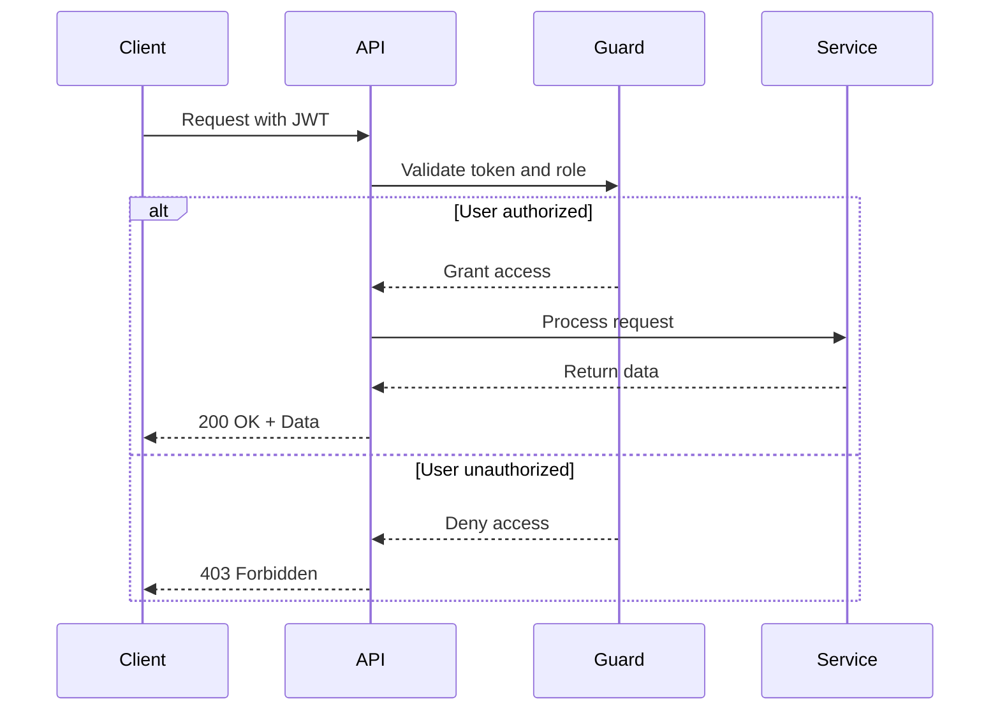
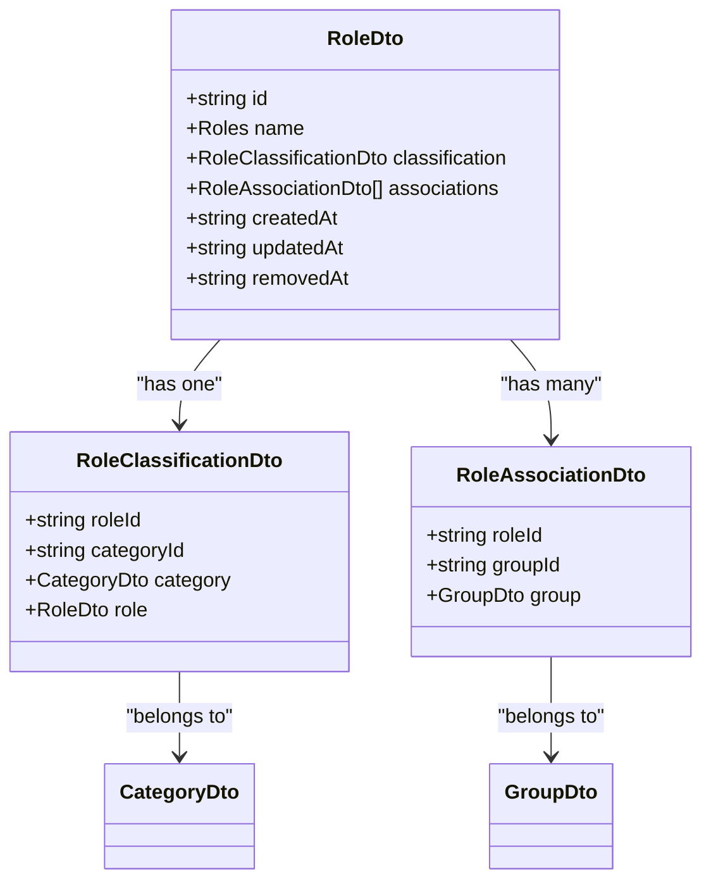
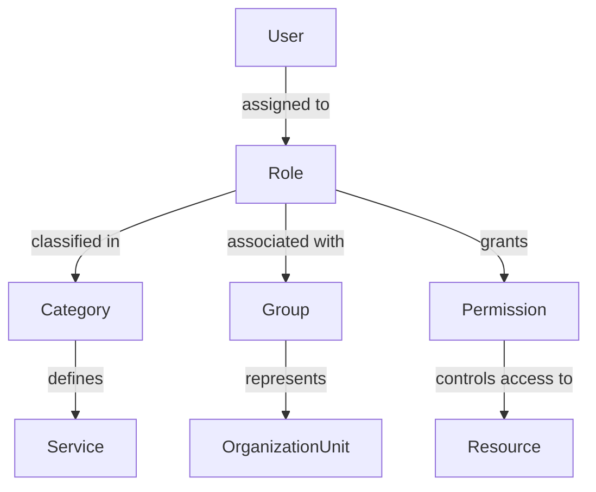

# Roles API

<cite>
**Referenced Files in This Document**   
- [roles.controller.ts](file://apps/server/src/shared/controller/resources/roles.controller.ts)
- [roles.service.ts](file://apps/server/src/shared/service/resources/roles.service.ts)
- [role.repository.ts](file://apps/server/src/shared/repository/role.repository.ts)
- [role.dto.ts](file://packages/schema/src/dto/role.dto.ts)
- [create-role.dto.ts](file://packages/schema/src/dto/create/create-role.dto.ts)
- [update-role.dto.ts](file://packages/schema/src/dto/update/update-role.dto.ts)
- [query-role.dto.ts](file://packages/schema/src/dto/query/query-role.dto.ts)
- [role-association.dto.ts](file://packages/schema/src/dto/role-association.dto.ts)
- [role-classification.dto.ts](file://packages/schema/src/dto/role-classification.dto.ts)
- [roles.guard.ts](file://apps/server/src/shared/guard/roles.guard.ts)
</cite>

## Table of Contents
1. [Introduction](#introduction)
2. [Authentication and Authorization](#authentication-and-authorization)
3. [Role Data Model](#role-data-model)
4. [CRUD Operations](#crud-operations)
5. [Query Parameters](#query-parameters)
6. [Request and Response Examples](#request-and-response-examples)
7. [Role Associations and Classifications](#role-associations-and-classifications)
8. [Error Handling](#error-handling)

## Introduction

The Roles API provides comprehensive management of user roles within the system. This API enables creation, retrieval, updating, and deletion of roles, which are essential components of the role-based access control (RBAC) system. Roles define the permissions and access levels for users within specific tenants and services.

The API follows RESTful principles with predictable resource URLs and standard HTTP methods. All endpoints require JWT authentication and appropriate role-based authorization to ensure secure access to role management functionality.

**Section sources**
- [roles.controller.ts](file://apps/server/src/shared/controller/resources/roles.controller.ts#L25-L88)

## Authentication and Authorization

All Roles API endpoints require JWT authentication. Users must include a valid JWT token in the Authorization header of their requests.

Authorization is enforced through role-based access control using the `RolesGuard`. Access to endpoints is restricted based on the user's role within their tenant. The guard validates that the authenticated user has the necessary role permissions to perform the requested operation.



**Diagram sources**
- [roles.guard.ts](file://apps/server/src/shared/guard/roles.guard.ts#L12-L58)

**Section sources**
- [roles.guard.ts](file://apps/server/src/shared/guard/roles.guard.ts#L12-L58)

## Role Data Model

The Role entity represents a named role within the system that can be assigned to users. Each role has a unique identifier and a name from a predefined set of role types.



**Diagram sources**
- [role.dto.ts](file://packages/schema/src/dto/role.dto.ts#L7-L17)
- [role-association.dto.ts](file://packages/schema/src/dto/role-association.dto.ts#L5-L15)
- [role-classification.dto.ts](file://packages/schema/src/dto/role-classification.dto.ts#L5-L21)

**Section sources**
- [role.dto.ts](file://packages/schema/src/dto/role.dto.ts#L7-L17)

## CRUD Operations

### Create Role
Creates a new role in the system.

- **HTTP Method**: POST
- **URL Pattern**: `/roles`
- **Authentication**: JWT required
- **Authorization**: Admin role required
- **Status Codes**: 
  - 200: Role created successfully
  - 400: Invalid request payload
  - 401: Unauthorized
  - 403: Insufficient permissions

### Get Role by ID
Retrieves a specific role by its ID.

- **HTTP Method**: GET
- **URL Pattern**: `/roles/{roleId}`
- **Authentication**: JWT required
- **Authorization**: Any authenticated user with appropriate role
- **Status Codes**:
  - 200: Role retrieved successfully
  - 401: Unauthorized
  - 403: Insufficient permissions
  - 404: Role not found

### Update Role
Updates an existing role's properties.

- **HTTP Method**: PATCH
- **URL Pattern**: `/roles/{roleId}`
- **Authentication**: JWT required
- **Authorization**: Admin role required
- **Status Codes**:
  - 200: Role updated successfully
  - 400: Invalid request payload
  - 401: Unauthorized
  - 403: Insufficient permissions
  - 404: Role not found

### Remove Role
Marks a role as removed by setting the removedAt timestamp (soft delete).

- **HTTP Method**: PATCH
- **URL Pattern**: `/roles/{roleId}/removedAt`
- **Authentication**: JWT required
- **Authorization**: Admin role required
- **Status Codes**:
  - 200: Role marked as removed successfully
  - 401: Unauthorized
  - 403: Insufficient permissions
  - 404: Role not found

### Delete Role
Permanently deletes a role from the system.

- **HTTP Method**: DELETE
- **URL Pattern**: `/roles/{roleId}`
- **Authentication**: JWT required
- **Authorization**: Admin role required
- **Status Codes**:
  - 200: Role deleted successfully
  - 401: Unauthorized
  - 403: Insufficient permissions
  - 404: Role not found

### Get Roles by Query
Retrieves a paginated list of roles based on query parameters.

- **HTTP Method**: GET
- **URL Pattern**: `/roles`
- **Authentication**: JWT required
- **Authorization**: Any authenticated user with appropriate role
- **Status Codes**:
  - 200: Roles retrieved successfully
  - 401: Unauthorized
  - 403: Insufficient permissions

**Section sources**
- [roles.controller.ts](file://apps/server/src/shared/controller/resources/roles.controller.ts#L30-L88)
- [roles.service.ts](file://apps/server/src/shared/service/resources/roles.service.ts#L9-L47)

## Query Parameters

The GET /roles endpoint supports query parameters for filtering, sorting, and pagination:

| Parameter | Type | Description | Required |
|---------|------|-------------|----------|
| page | number | Page number (1-indexed) | No |
| limit | number | Number of items per page | No |
| nameSortOrder | string | Sort order for role name (asc/desc) | No |
| createdAtSortOrder | string | Sort order for creation date (asc/desc) | No |

The response includes pagination metadata in the meta field, containing:
- total: Total number of roles matching the query
- page: Current page number
- limit: Number of items per page
- totalPages: Total number of pages

**Section sources**
- [query-role.dto.ts](file://packages/schema/src/dto/query/query-role.dto.ts#L5-L12)
- [roles.controller.ts](file://apps/server/src/shared/controller/resources/roles.controller.ts#L76-L85)

## Request and Response Examples

### Create Role Request
```json
{
  "name": "ADMIN",
  "serviceId": "svc-123",
  "categoryId": "cat-456"
}
```

### Create Role Response (200 OK)
```json
{
  "data": {
    "id": "role-789",
    "name": "ADMIN",
    "serviceId": "svc-123",
    "categoryId": "cat-456",
    "createdAt": "2025-01-01T00:00:00.000Z",
    "updatedAt": "2025-01-01T00:00:00.000Z"
  }
}
```

### Get Roles Response (200 OK)
```json
{
  "data": [
    {
      "id": "role-789",
      "name": "ADMIN",
      "classification": {
        "roleId": "role-789",
        "categoryId": "cat-456"
      },
      "associations": [
        {
          "roleId": "role-789",
          "groupId": "group-101"
        }
      ],
      "createdAt": "2025-01-01T00:00:00.000Z",
      "updatedAt": "2025-01-01T00:00:00.000Z"
    }
  ],
  "meta": {
    "total": 1,
    "page": 1,
    "limit": 10,
    "totalPages": 1,
    "message": "success"
  }
}
```

### Error Response (403 Forbidden)
```json
{
  "statusCode": 403,
  "message": "이 작업을 수행하려면 다음 역할 중 하나가 필요합니다: ADMIN. 현재 역할: USER",
  "error": "Forbidden"
}
```

### Sample curl Commands

Create a role:
```bash
curl -X POST https://api.example.com/roles \
  -H "Authorization: Bearer <jwt_token>" \
  -H "Content-Type: application/json" \
  -d '{
    "name": "ADMIN",
    "serviceId": "svc-123",
    "categoryId": "cat-456"
  }'
```

Get all roles with sorting:
```bash
curl -X GET "https://api.example.com/roles?nameSortOrder=asc&page=1&limit=10" \
  -H "Authorization: Bearer <jwt_token>"
```

Get a specific role:
```bash
curl -X GET https://api.example.com/roles/role-789 \
  -H "Authorization: Bearer <jwt_token>"
```

**Section sources**
- [create-role.dto.ts](file://packages/schema/src/dto/create/create-role.dto.ts#L6-L17)
- [role.dto.ts](file://packages/schema/src/dto/role.dto.ts#L7-L17)

## Role Associations and Classifications

Roles can be associated with groups and classified within categories, enabling a flexible access control system.

### Role Classifications
Role classifications link roles to categories, which represent different domains or services within the system. Each role can belong to one category.

### Role Associations
Role associations link roles to groups, enabling role-based access control at the group level. A role can be associated with multiple groups, allowing for flexible permission management across different organizational units.

The system supports complex access control scenarios where:
- Roles are categorized by service or domain
- Roles are assigned to specific groups
- Users inherit permissions through role assignments
- Permissions are evaluated based on role hierarchy and associations



**Diagram sources**
- [role-association.dto.ts](file://packages/schema/src/dto/role-association.dto.ts#L5-L15)
- [role-classification.dto.ts](file://packages/schema/src/dto/role-classification.dto.ts#L5-L21)

**Section sources**
- [role-association.dto.ts](file://packages/schema/src/dto/role-association.dto.ts#L5-L15)
- [role-classification.dto.ts](file://packages/schema/src/dto/role-classification.dto.ts#L5-L21)

## Error Handling

The Roles API returns standardized error responses with appropriate HTTP status codes:

| Status Code | Error Type | Description |
|------------|-----------|-------------|
| 400 | Bad Request | Invalid request payload or parameters |
| 401 | Unauthorized | Missing or invalid authentication token |
| 403 | Forbidden | Insufficient permissions for the requested operation |
| 404 | Not Found | Requested role does not exist |
| 500 | Internal Server Error | Unexpected server error |

Error responses follow the standard response entity format with error details in the message field. The roles.guard.ts implementation provides detailed error messages explaining the required roles versus the user's current role, aiding in troubleshooting access issues.

**Section sources**
- [roles.guard.ts](file://apps/server/src/shared/guard/roles.guard.ts#L30-L53)
- [roles.controller.ts](file://apps/server/src/shared/controller/resources/roles.controller.ts#L32-L36)