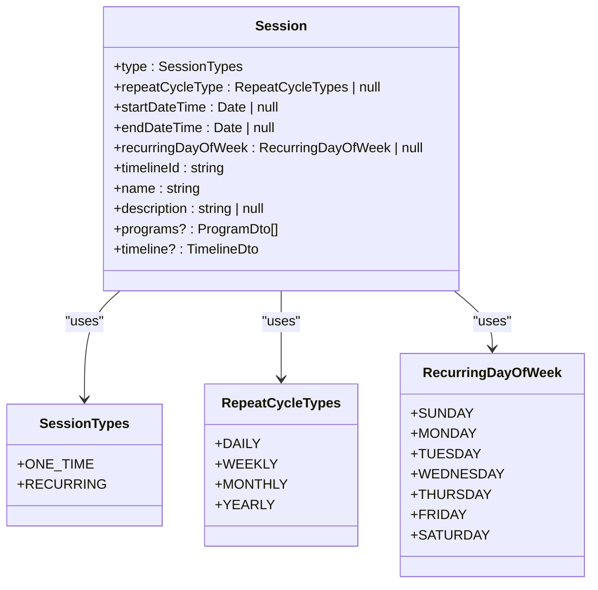
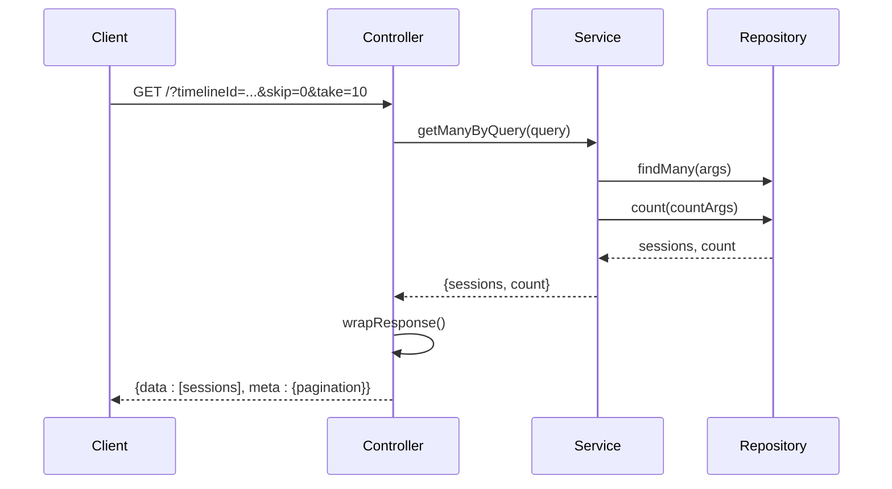
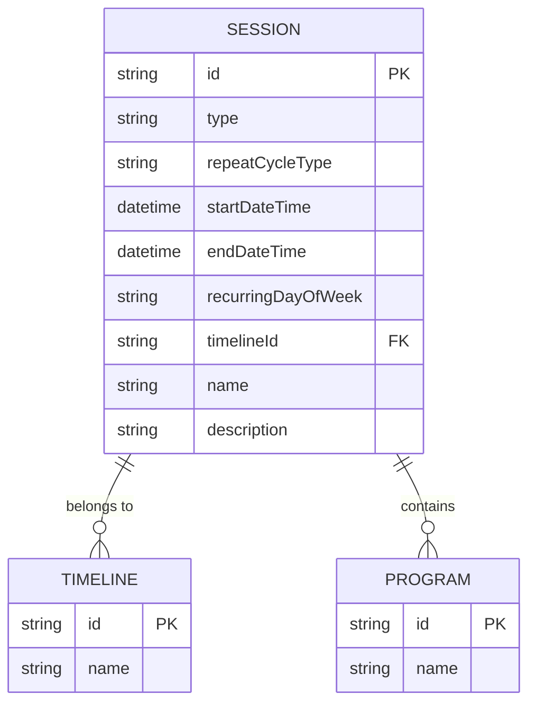

# Sessions API

<cite>
**Referenced Files in This Document**   
- [sessions.controller.ts](file://apps/server/src/shared/controller/resources/sessions.controller.ts)
- [sessions.service.ts](file://apps/server/src/shared/service/resources/sessions.service.ts)
- [sessions.repository.ts](file://apps/server/src/shared/repository/sessions.repository.ts)
- [session.dto.ts](file://packages/schema/src/dto/session.dto.ts)
- [create-session.dto.ts](file://packages/schema/src/dto/create/create-session.dto.ts)
- [update-session.dto.ts](file://packages/schema/src/dto/update/update-session.dto.ts)
- [query-session.dto.ts](file://packages/schema/src/dto/query/query-session.dto.ts)
- [session.entity.ts](file://packages/schema/src/entity/session.entity.ts)
- [session-types.enum.ts](file://packages/schema/src/enum/session-types.enum.ts)
- [repeat-cycle-types.enum.ts](file://packages/schema/src/enum/repeat-cycle-types.enum.ts)
- [recurring-day-of-week.enum.ts](file://packages/schema/src/enum/recurring-day-of-week.enum.ts)
</cite>

## Table of Contents
1. [Introduction](#introduction)
2. [Authentication and Authorization](#authentication-and-authorization)
3. [Session Data Model](#session-data-model)
4. [CRUD Endpoints](#crud-endpoints)
   - [Create Session](#create-session)
   - [Get Session](#get-session)
   - [Update Session](#update-session)
   - [Remove Session](#remove-session)
   - [Delete Session](#delete-session)
5. [Query Endpoints](#query-endpoints)
   - [Get Sessions by Query](#get-sessions-by-query)
   - [Remove Multiple Sessions](#remove-multiple-sessions)
6. [Request Payload Structure](#request-payload-structure)
7. [Response Formats](#response-formats)
8. [Query Parameters](#query-parameters)
9. [Sample curl Commands](#sample-curl-commands)
10. [Entity Relationships](#entity-relationships)

## Introduction

The Sessions API provides comprehensive CRUD operations for managing session entities within the application. Sessions represent scheduled events or activities that can be either one-time or recurring. The API supports full lifecycle management of sessions, including creation, retrieval, updating, soft deletion (removal), and hard deletion. Sessions are associated with timelines and programs, forming a hierarchical structure within the application's scheduling system.

**Section sources**
- [sessions.controller.ts](file://apps/server/src/shared/controller/resources/sessions.controller.ts#L26-L99)
- [session.dto.ts](file://packages/schema/src/dto/session.dto.ts#L23-L55)

## Authentication and Authorization

All Sessions API endpoints require JWT-based authentication. Users must include a valid JWT token in the Authorization header of each request. The API uses role-based access control (RBAC) to determine authorization for specific operations. While the exact role requirements are not specified in the controller code, the presence of the `@ApiTags("SESSION")` decorator suggests integration with a broader authorization system.

The API endpoints do not explicitly show authentication decorators in the provided code, but given the application structure and standard practices, JWT authentication is required for all endpoints. Users must have appropriate permissions based on their role to perform CRUD operations on sessions.

**Section sources**
- [sessions.controller.ts](file://apps/server/src/shared/controller/resources/sessions.controller.ts#L26-L99)

## Session Data Model

The Session entity represents a scheduled event with properties for timing, recurrence, and relationships to other entities. The model supports both one-time and recurring sessions through the type and repeatCycleType fields.



**Diagram sources**
- [session.dto.ts](file://packages/schema/src/dto/session.dto.ts#L23-L55)
- [session.entity.ts](file://packages/schema/src/entity/session.entity.ts#L8-L24)
- [session-types.enum.ts](file://packages/schema/src/enum/session-types.enum.ts#L1-L28)
- [repeat-cycle-types.enum.ts](file://packages/schema/src/enum/repeat-cycle-types.enum.ts#L1-L33)
- [recurring-day-of-week.enum.ts](file://packages/schema/src/enum/recurring-day-of-week.enum.ts#L1-L36)

**Section sources**
- [session.dto.ts](file://packages/schema/src/dto/session.dto.ts#L23-L55)
- [session.entity.ts](file://packages/schema/src/entity/session.entity.ts#L8-L24)

## CRUD Endpoints

### Create Session

Creates a new session with the provided data.

- **HTTP Method**: POST
- **URL Pattern**: `/`
- **Authentication**: Required (JWT)
- **Authorization**: Appropriate role-based permissions required
- **Status Codes**:
  - 200: Session created successfully
  - 400: Invalid request payload
  - 401: Unauthorized (invalid or missing token)
  - 403: Forbidden (insufficient permissions)

**Request Payload Structure**:
The request body should contain a CreateSessionDto object with the following required fields:
- `type`: Session type (ONE_TIME or RECURRING)
- `timelineId`: ID of the associated timeline
- `name`: Name of the session
- `startDateTime`: Start date and time of the session

Optional fields include:
- `repeatCycleType`: For recurring sessions (DAILY, WEEKLY, MONTHLY, YEARLY)
- `endDateTime`: End date and time of the session
- `recurringDayOfWeek`: Day of week for weekly recurring sessions
- `description`: Description of the session

**Section sources**
- [sessions.controller.ts](file://apps/server/src/shared/controller/resources/sessions.controller.ts#L31-L38)
- [create-session.dto.ts](file://packages/schema/src/dto/create/create-session.dto.ts#L1-L10)
- [session.dto.ts](file://packages/schema/src/dto/session.dto.ts#L23-L55)

### Get Session

Retrieves a specific session by its ID.

- **HTTP Method**: GET
- **URL Pattern**: `/:sessionId`
- **Authentication**: Required (JWT)
- **Authorization**: Appropriate role-based permissions required
- **Status Codes**:
  - 200: Session retrieved successfully
  - 401: Unauthorized (invalid or missing token)
  - 403: Forbidden (insufficient permissions)
  - 404: Session not found

**Section sources**
- [sessions.controller.ts](file://apps/server/src/shared/controller/resources/sessions.controller.ts#L40-L46)
- [session.dto.ts](file://packages/schema/src/dto/session.dto.ts#L23-L55)

### Update Session

Updates an existing session with new data.

- **HTTP Method**: PATCH
- **URL Pattern**: `/:sessionId`
- **Authentication**: Required (JWT)
- **Authorization**: Appropriate role-based permissions required
- **Status Codes**:
  - 200: Session updated successfully
  - 400: Invalid request payload
  - 401: Unauthorized (invalid or missing token)
  - 403: Forbidden (insufficient permissions)
  - 404: Session not found

The request body should contain an UpdateSessionDto object with any fields that need to be updated. All fields are optional in the update operation.

**Section sources**
- [sessions.controller.ts](file://apps/server/src/shared/controller/resources/sessions.controller.ts#L59-L68)
- [update-session.dto.ts](file://packages/schema/src/dto/update/update-session.dto.ts#L1-L5)
- [session.dto.ts](file://packages/schema/src/dto/session.dto.ts#L23-L55)

### Remove Session

Soft deletes a session by setting its removedAt timestamp.

- **HTTP Method**: PATCH
- **URL Pattern**: `/:sessionId/removedAt`
- **Authentication**: Required (JWT)
- **Authorization**: Appropriate role-based permissions required
- **Status Codes**:
  - 200: Session removed successfully
  - 401: Unauthorized (invalid or missing token)
  - 403: Forbidden (insufficient permissions)
  - 404: Session not found

This operation does not permanently delete the session but marks it as removed, allowing for potential restoration.

**Section sources**
- [sessions.controller.ts](file://apps/server/src/shared/controller/resources/sessions.controller.ts#L70-L76)
- [sessions.service.ts](file://apps/server/src/shared/service/resources/sessions.service.ts#L46-L51)

### Delete Session

Permanently deletes a session from the database.

- **HTTP Method**: DELETE
- **URL Pattern**: `/:sessionId`
- **Authentication**: Required (JWT)
- **Authorization**: Appropriate role-based permissions required
- **Status Codes**:
  - 200: Session deleted successfully
  - 401: Unauthorized (invalid or missing token)
  - 403: Forbidden (insufficient permissions)
  - 404: Session not found

This operation permanently removes the session from the database.

**Section sources**
- [sessions.controller.ts](file://apps/server/src/shared/controller/resources/sessions.controller.ts#L78-L84)
- [sessions.service.ts](file://apps/server/src/shared/service/resources/sessions.service.ts#L18-L20)

## Query Endpoints

### Get Sessions by Query

Retrieves a paginated list of sessions based on query parameters.

- **HTTP Method**: GET
- **URL Pattern**: `/`
- **Authentication**: Required (JWT)
- **Authorization**: Appropriate role-based permissions required
- **Status Codes**:
  - 200: Sessions retrieved successfully
  - 401: Unauthorized (invalid or missing token)
  - 403: Forbidden (insufficient permissions)

The response includes a paginated list of sessions with metadata about the total count and pagination information.



**Diagram sources**
- [sessions.controller.ts](file://apps/server/src/shared/controller/resources/sessions.controller.ts#L86-L98)
- [sessions.service.ts](file://apps/server/src/shared/service/resources/sessions.service.ts#L28-L37)
- [sessions.repository.ts](file://apps/server/src/shared/repository/sessions.repository.ts#L46-L50)

**Section sources**
- [sessions.controller.ts](file://apps/server/src/shared/controller/resources/sessions.controller.ts#L86-L98)
- [query-session.dto.ts](file://packages/schema/src/dto/query/query-session.dto.ts#L1-L12)

### Remove Multiple Sessions

Soft deletes multiple sessions by setting their removedAt timestamp.

- **HTTP Method**: PATCH
- **URL Pattern**: `/removedAt`
- **Authentication**: Required (JWT)
- **Authorization**: Appropriate role-based permissions required
- **Status Codes**:
  - 200: Sessions removed successfully
  - 401: Unauthorized (invalid or missing token)
  - 403: Forbidden (insufficient permissions)

The request body should contain an array of session IDs to be removed. Note that the implementation uses individual update calls rather than updateMany, as updateMany has been discontinued.

**Section sources**
- [sessions.controller.ts](file://apps/server/src/shared/controller/resources/sessions.controller.ts#L48-L57)
- [sessions.service.ts](file://apps/server/src/shared/service/resources/sessions.service.ts#L46-L51)

## Request Payload Structure

The request payload structure for session creation is defined by the CreateSessionDto class, which extends SessionDto while omitting certain fields.

### Required Fields
- **type**: The session type (ONE_TIME or RECURRING)
  - Data Type: string
  - Constraints: Must be a valid SessionTypes enum value
- **timelineId**: The ID of the associated timeline
  - Data Type: string
  - Constraints: Must be a valid UUID
- **name**: The name of the session
  - Data Type: string
  - Constraints: Required field
- **startDateTime**: The start date and time of the session
  - Data Type: Date | null
  - Constraints: Must be a valid date-time format

### Optional Fields
- **repeatCycleType**: The recurrence cycle for recurring sessions
  - Data Type: RepeatCycleTypes | null
  - Constraints: Must be one of DAILY, WEEKLY, MONTHLY, YEARLY if provided
  - Applicable only when type is RECURRING
- **endDateTime**: The end date and time of the session
  - Data Type: Date | null
  - Constraints: Must be a valid date-time format if provided
  - Must be after startDateTime if both are provided
- **recurringDayOfWeek**: The day of week for weekly recurring sessions
  - Data Type: RecurringDayOfWeek | null
  - Constraints: Must be one of SUNDAY, MONDAY, TUESDAY, WEDNESDAY, THURSDAY, FRIDAY, SATURDAY if provided
  - Applicable only when repeatCycleType is WEEKLY
- **description**: A description of the session
  - Data Type: string | null
  - Constraints: Optional field

**Section sources**
- [create-session.dto.ts](file://packages/schema/src/dto/create/create-session.dto.ts#L1-L10)
- [session.dto.ts](file://packages/schema/src/dto/session.dto.ts#L23-L55)
- [session-types.enum.ts](file://packages/schema/src/enum/session-types.enum.ts#L1-L28)
- [repeat-cycle-types.enum.ts](file://packages/schema/src/enum/repeat-cycle-types.enum.ts#L1-L33)
- [recurring-day-of-week.enum.ts](file://packages/schema/src/enum/recurring-day-of-week.enum.ts#L1-L36)

## Response Formats

### Single Session Response
When retrieving a single session, the API returns a SessionDto object with the following structure:

```json
{
  "data": {
    "id": "string",
    "createdAt": "string",
    "updatedAt": "string",
    "type": "ONE_TIME | RECURRING",
    "repeatCycleType": "DAILY | WEEKLY | MONTHLY | YEARLY | null",
    "startDateTime": "string | null",
    "endDateTime": "string | null",
    "recurringDayOfWeek": "SUN | MON | TUE | WED | THU | FRI | SAT | null",
    "timelineId": "string",
    "name": "string",
    "description": "string | null",
    "programs": [
      {
        "id": "string",
        "name": "string"
      }
    ],
    "timeline": {
      "id": "string",
      "name": "string"
    }
  }
}
```

### Paginated List Response
When retrieving multiple sessions, the API returns a paginated response with metadata:

```json
{
  "data": [
    {
      "id": "string",
      "createdAt": "string",
      "updatedAt": "string",
      "type": "ONE_TIME | RECURRING",
      "repeatCycleType": "DAILY | WEEKLY | MONTHLY | YEARLY | null",
      "startDateTime": "string | null",
      "endDateTime": "string | null",
      "recurringDayOfWeek": "SUN | MON | TUE | WED | THU | FRI | SAT | null",
      "timelineId": "string",
      "name": "string",
      "description": "string | null"
    }
  ],
  "meta": {
    "message": "success",
    "pagination": {
      "page": 1,
      "take": 10,
      "itemCount": 25,
      "pageCount": 3,
      "hasPreviousPage": false,
      "hasNextPage": true
    }
  }
}
```

### Error Responses
The API returns standardized error responses with appropriate HTTP status codes:

- **400 Bad Request**: Invalid request payload
```json
{
  "statusCode": 400,
  "message": "Bad Request",
  "errors": ["Validation errors"]
}
```

- **401 Unauthorized**: Missing or invalid authentication token
```json
{
  "statusCode": 401,
  "message": "Unauthorized"
}
```

- **403 Forbidden**: Insufficient permissions
```json
{
  "statusCode": 403,
  "message": "Forbidden"
}
```

- **404 Not Found**: Session not found
```json
{
  "statusCode": 404,
  "message": "Not Found"
}
```

**Section sources**
- [sessions.controller.ts](file://apps/server/src/shared/controller/resources/sessions.controller.ts#L34-L38)
- [sessions.controller.ts](file://apps/server/src/shared/controller/resources/sessions.controller.ts#L88-L98)
- [session.dto.ts](file://packages/schema/src/dto/session.dto.ts#L23-L55)

## Query Parameters

The API supports various query parameters for filtering, sorting, and pagination when retrieving sessions.

### Filtering Parameters
- **timelineId**: Filter sessions by timeline ID
  - Type: string | null
  - Default: null
  - Example: `?timelineId=123e4567-e89b-12d3-a456-426614174000`

### Sorting Parameters
- **startDateTimeSortOrder**: Sort order for sessions based on start date and time
  - Type: Order (ASC or DESC)
  - Default: DESC
  - Example: `?startDateTimeSortOrder=ASC`

### Pagination Parameters
The API uses standard pagination parameters inherited from the base QueryDto class (not explicitly shown in the provided code but implied by the implementation):

- **skip**: Number of items to skip (for pagination)
  - Type: number
  - Default: 0
- **take**: Number of items to return
  - Type: number
  - Default: 10

Example: `?skip=10&take=20` retrieves sessions 11-30.

**Section sources**
- [query-session.dto.ts](file://packages/schema/src/dto/query/query-session.dto.ts#L1-L12)

## Sample curl Commands

### Create a Session
```bash
curl -X POST https://api.example.com/sessions \
  -H "Authorization: Bearer <your-jwt-token>" \
  -H "Content-Type: application/json" \
  -d '{
    "type": "ONE_TIME",
    "timelineId": "123e4567-e89b-12d3-a456-426614174000",
    "name": "Team Meeting",
    "startDateTime": "2023-12-01T10:00:00Z",
    "endDateTime": "2023-12-01T11:00:00Z",
    "description": "Weekly team sync"
  }'
```

### Get a Specific Session
```bash
curl -X GET https://api.example.com/sessions/987e6543-e21c-12d3-a456-426614174000 \
  -H "Authorization: Bearer <your-jwt-token>"
```

### Get Sessions by Query
```bash
curl -X GET "https://api.example.com/sessions?timelineId=123e4567-e89b-12d3-a456-426614174000&startDateTimeSortOrder=ASC&skip=0&take=10" \
  -H "Authorization: Bearer <your-jwt-token>"
```

### Update a Session
```bash
curl -X PATCH https://api.example.com/sessions/987e6543-e21c-12d3-a456-426614174000 \
  -H "Authorization: Bearer <your-jwt-token>" \
  -H "Content-Type: application/json" \
  -d '{
    "name": "Updated Team Meeting",
    "description": "Updated description for the team meeting"
  }'
```

### Remove a Session (Soft Delete)
```bash
curl -X PATCH https://api.example.com/sessions/987e6543-e21c-12d3-a456-426614174000/removedAt \
  -H "Authorization: Bearer <your-jwt-token>"
```

### Delete a Session (Hard Delete)
```bash
curl -X DELETE https://api.example.com/sessions/987e6543-e21c-12d3-a456-426614174000 \
  -H "Authorization: Bearer <your-jwt-token>"
```

**Section sources**
- [sessions.controller.ts](file://apps/server/src/shared/controller/resources/sessions.controller.ts#L31-L98)

## Entity Relationships

Sessions are connected to several other entities within the application, forming a hierarchical structure for scheduling and organization.



### Timeline Relationship
Each session belongs to exactly one timeline, established through the timelineId foreign key. This relationship allows sessions to be organized within a specific timeline context.

### Program Relationship
Sessions can contain multiple programs, representing the activities or content that occur during the session. This is a many-to-many relationship, allowing programs to be reused across different sessions.

### User Relationship
While not explicitly shown in the provided code, sessions are likely associated with users through the common entity fields (createdAt, updatedAt) and the authentication system. Users create, update, and interact with sessions based on their roles and permissions.

**Section sources**
- [session.dto.ts](file://packages/schema/src/dto/session.dto.ts#L50-L54)
- [session.entity.ts](file://packages/schema/src/entity/session.entity.ts#L22-L23)
- [session.dto.ts](file://packages/schema/src/dto/session.dto.ts#L41-L42)
- [session.entity.ts](file://packages/schema/src/entity/session.entity.ts#L18)