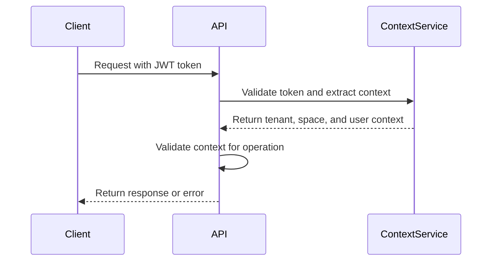
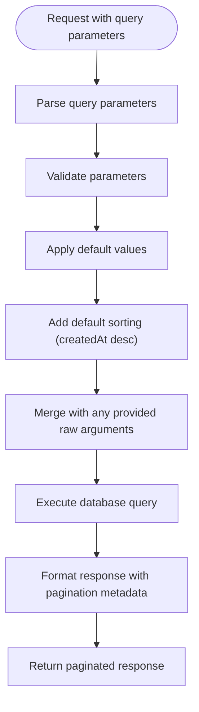
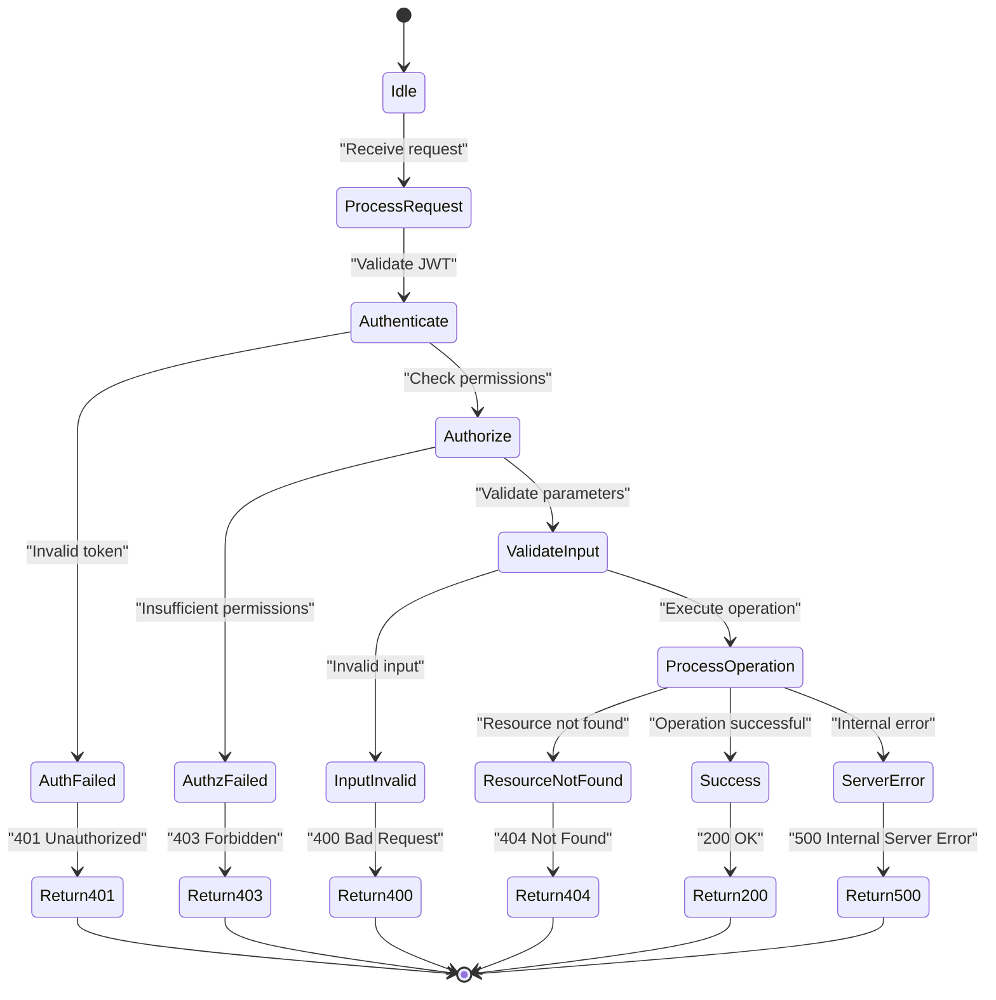

# Spaces API

<cite>
**Referenced Files in This Document**   
- [spaces.controller.ts](file://apps/server/src/shared/controller/resources/spaces.controller.ts)
- [space-associations.controller.ts](file://apps/server/src/shared/controller/resources/space-associations.controller.ts)
- [space-classifications.controller.ts](file://apps/server/src/shared/controller/resources/space-classifications.controller.ts)
- [spaces.service.ts](file://apps/server/src/shared/service/resources/spaces.service.ts)
- [space-associations.service.ts](file://apps/server/src/shared/service/resources/space-associations.service.ts)
- [space-classifications.service.ts](file://apps/server/src/shared/service/resources/space-classifications.service.ts)
- [spaces.repository.ts](file://apps/server/src/shared/repository/spaces.repository.ts)
- [space-association.dto.ts](file://packages/schema/src/dto/space-association.dto.ts)
- [space-classification.dto.ts](file://packages/schema/src/dto/space-classification.dto.ts)
- [space.dto.ts](file://packages/schema/src/dto/space.dto.ts)
- [create-space.dto.ts](file://packages/schema/src/dto/create/create-space.dto.ts)
- [update-space.dto.ts](file://packages/schema/src/dto/update/update-space.dto.ts)
- [query-space.dto.ts](file://packages/schema/src/dto/query/query-space.dto.ts)
- [context.service.ts](file://apps/server/src/shared/service/context.service.ts)
</cite>

## Table of Contents
1. [Introduction](#introduction)
2. [Authentication and Authorization](#authentication-and-authorization)
3. [Space Management Endpoints](#space-management-endpoints)
4. [Space Associations](#space-associations)
5. [Space Classifications](#space-classifications)
6. [Request Payload Structure](#request-payload-structure)
7. [Response Formats](#response-formats)
8. [Query Parameters](#query-parameters)
9. [Error Responses](#error-responses)
10. [Sample curl Commands](#sample-curl-commands)

## Introduction
The Spaces API provides comprehensive functionality for managing spaces within the application. This API enables creation, retrieval, update, and deletion of spaces, along with management of space associations and classifications. Spaces serve as organizational units that can be associated with tenants, users, programs, and other entities within the system.

**Section sources**
- [spaces.controller.ts](file://apps/server/src/shared/controller/resources/spaces.controller.ts#L27-L168)
- [space-associations.controller.ts](file://apps/server/src/shared/controller/resources/space-associations.controller.ts#L25-L114)
- [space-classifications.controller.ts](file://apps/server/src/shared/controller/resources/space-classifications.controller.ts#L25-L114)

## Authentication and Authorization
All endpoints in the Spaces API require JWT authentication. Users must include a valid JWT token in the Authorization header to access any endpoint. The system validates the token and extracts user context including tenant and space information.

Authorization rules are enforced through context validation:
- Users must have a valid tenant context to perform space operations
- The current space context is validated for operations requiring space context
- Administrative privileges may be required for certain operations based on role-based access control



**Diagram sources**
- [spaces.controller.ts](file://apps/server/src/shared/controller/resources/spaces.controller.ts#L37-L108)
- [context.service.ts](file://apps/server/src/shared/service/context.service.ts)

## Space Management Endpoints
The Spaces API provides RESTful endpoints for full CRUD operations on spaces.

### Create Space
- **HTTP Method**: POST
- **URL Pattern**: `/spaces`
- **Authentication**: Required (JWT)
- **Authorization**: User must have appropriate role/permissions

### Retrieve Current Space
- **HTTP Method**: GET
- **URL Pattern**: `/spaces/current`
- **Authentication**: Required (JWT)
- **Authorization**: User must have a valid tenant context with assigned space

### Retrieve Specific Space
- **HTTP Method**: GET
- **URL Pattern**: `/spaces/:spaceId`
- **Authentication**: Required (JWT)
- **Authorization**: User must have access to the specified space

### Update Space
- **HTTP Method**: PATCH
- **URL Pattern**: `/spaces/:spaceId`
- **Authentication**: Required (JWT)
- **Authorization**: User must have edit permissions for the specified space

### Soft Delete Space (Remove)
- **HTTP Method**: PATCH
- **URL Pattern**: `/spaces/:spaceId/removedAt`
- **Authentication**: Required (JWT)
- **Authorization**: User must have delete permissions for the specified space
- **Behavior**: Sets the `removedAt` timestamp without permanently deleting the record

### Hard Delete Space
- **HTTP Method**: DELETE
- **URL Pattern**: `/spaces/:spaceId`
- **Authentication**: Required (JWT)
- **Authorization**: User must have administrative delete permissions
- **Behavior**: Permanently removes the space record from the database

**Section sources**
- [spaces.controller.ts](file://apps/server/src/shared/controller/resources/spaces.controller.ts#L110-L151)

## Space Associations
Space associations represent relationships between spaces and other entities in the system.

### Create Space Association
- **HTTP Method**: POST
- **URL Pattern**: `/space-associations`
- **Authentication**: Required (JWT)

### Retrieve Space Association
- **HTTP Method**: GET
- **URL Pattern**: `/space-associations/:spaceAssociationId`
- **Authentication**: Required (JWT)

### Update Space Association
- **HTTP Method**: PATCH
- **URL Pattern**: `/space-associations/:spaceAssociationId`
- **Authentication**: Required (JWT)

### Remove Space Association (Soft Delete)
- **HTTP Method**: PATCH
- **URL Pattern**: `/space-associations/:spaceAssociationId/removedAt`
- **Authentication**: Required (JWT)

### Delete Space Association (Hard Delete)
- **HTTP Method**: DELETE
- **URL Pattern**: `/space-associations/:spaceAssociationId`
- **Authentication**: Required (JWT)

### Bulk Remove Space Associations
- **HTTP Method**: PATCH
- **URL Pattern**: `/space-associations/removedAt`
- **Authentication**: Required (JWT)
- **Request Body**: Array of space association IDs to remove

**Section sources**
- [space-associations.controller.ts](file://apps/server/src/shared/controller/resources/space-associations.controller.ts#L30-L98)

## Space Classifications
Space classifications provide categorization and typing for spaces.

### Create Space Classification
- **HTTP Method**: POST
- **URL Pattern**: `/space-classifications`
- **Authentication**: Required (JWT)

### Retrieve Space Classification
- **HTTP Method**: GET
- **URL Pattern**: `/space-classifications/:spaceClassificationId`
- **Authentication**: Required (JWT)

### Update Space Classification
- **HTTP Method**: PATCH
- **URL Pattern**: `/space-classifications/:spaceClassificationId`
- **Authentication**: Required (JWT)

### Remove Space Classification (Soft Delete)
- **HTTP Method**: PATCH
- **URL Pattern**: `/space-classifications/:spaceClassificationId/removedAt`
- **Authentication**: Required (JWT)

### Delete Space Classification (Hard Delete)
- **HTTP Method**: DELETE
- **URL Pattern**: `/space-classifications/:spaceClassificationId`
- **Authentication**: Required (JWT)

**Section sources**
- [space-classifications.controller.ts](file://apps/server/src/shared/controller/resources/space-classifications.controller.ts)

## Request Payload Structure
The request payload structure for space creation is defined by the `CreateSpaceDto` class.

### Create Space Request Body
The request body for creating a space includes the following fields:

```json
{
  "name": "string",
  "description": "string",
  "status": "ACTIVE | INACTIVE",
  "type": "string",
  "metadata": {}
}
```

**Validation Rules:**
- `name`: Required, string type
- `description`: Optional, string type
- `status`: Optional, enum with values "ACTIVE" or "INACTIVE", defaults to "ACTIVE"
- `type`: Optional, string type
- `metadata`: Optional, JSON object for additional custom data

The `CreateSpaceDto` extends `SpaceDto` but omits common entity fields (id, createdAt, updatedAt, removedAt) and relationship fields (spaceClassification, spaceAssociations, ground, tenants) to ensure these are not provided during creation.

**Section sources**
- [create-space.dto.ts](file://packages/schema/src/dto/create/create-space.dto.ts#L1-L12)
- [space.dto.ts](file://packages/schema/src/dto/space.dto.ts#L1-L32)

## Response Formats
The Spaces API returns standardized response formats for both single resources and collections.

### Single Space Response
When retrieving a single space, the API returns a `SpaceDto` object with the following structure:

```json
{
  "id": "string",
  "name": "string",
  "description": "string",
  "status": "ACTIVE | INACTIVE",
  "type": "string",
  "metadata": {},
  "createdAt": "string",
  "updatedAt": "string",
  "removedAt": "string",
  "spaceClassification": {
    "id": "string",
    "name": "string",
    "type": "string"
  },
  "spaceAssociations": [
    {
      "id": "string",
      "sourceId": "string",
      "sourceType": "string",
      "targetId": "string",
      "targetType": "string",
      "relationshipType": "string"
    }
  ],
  "ground": {
    "id": "string",
    "name": "string",
    "type": "string"
  },
  "tenants": [
    {
      "id": "string",
      "name": "string",
      "subdomain": "string"
    }
  ]
}
```

### Paginated List Response
When retrieving multiple spaces, the API returns a paginated response with metadata:

```json
{
  "data": [
    {
      "id": "string",
      "name": "string",
      "description": "string",
      "status": "ACTIVE | INACTIVE",
      "type": "string",
      "createdAt": "string",
      "updatedAt": "string"
    }
  ],
  "meta": {
    "totalItems": 0,
    "itemCount": 0,
    "itemsPerPage": 0,
    "totalPages": 0,
    "currentPage": 0
  },
  "message": "success"
}
```

**Section sources**
- [space.dto.ts](file://packages/schema/src/dto/space.dto.ts#L1-L32)
- [spaces.controller.ts](file://apps/server/src/shared/controller/resources/spaces.controller.ts#L153-L166)
- [query.dto.ts](file://packages/schema/src/dto/query/query.dto.ts#L55-L57)

## Query Parameters
The Spaces API supports various query parameters for filtering, sorting, and pagination.

### Pagination Parameters
- `skip`: Number of records to skip (for offset-based pagination)
- `take`: Number of records to return per page (maximum 50)

These parameters are defined in the `QueryDto` base class and inherited by `QuerySpaceDto`.

### Default Sorting
By default, results are sorted by `createdAt` in descending order (newest first). This can be overridden by providing custom ordering in the query parameters.

### Filtering
Additional filtering parameters can be passed in the query string to filter results based on specific criteria. These are processed by the `toArgs` method in the `QueryDto` class which merges the query parameters with default values and ordering.



**Diagram sources**
- [query.dto.ts](file://packages/schema/src/dto/query/query.dto.ts#L6-L58)
- [spaces.service.ts](file://apps/server/src/shared/service/resources/spaces.service.ts#L41-L48)

## Error Responses
The Spaces API returns standardized error responses with appropriate HTTP status codes.

### Success Responses
- **200 OK**: Successful GET, PATCH, or DELETE operation
- **201 Created**: Successful POST operation (space created)

### Client Error Responses
- **400 Bad Request**: Invalid request parameters or payload
- **401 Unauthorized**: Missing or invalid authentication token
- **403 Forbidden**: Insufficient permissions for the requested operation
- **404 Not Found**: Requested resource (space, association, etc.) not found

### Server Error Responses
- **500 Internal Server Error**: Unexpected server error

Specific error conditions include:
- When retrieving the current space without a valid tenant context: 401 Unauthorized
- When retrieving the current space without a space ID in the tenant: 400 Bad Request
- When a requested space is not found: 404 Not Found



**Diagram sources**
- [spaces.controller.ts](file://apps/server/src/shared/controller/resources/spaces.controller.ts#L60-L89)
- [spaces.service.ts](file://apps/server/src/shared/service/resources/spaces.service.ts)

## Sample curl Commands
Below are sample curl commands demonstrating common operations with the Spaces API.

### Create a New Space
```bash
curl -X POST https://api.example.com/spaces \
  -H "Authorization: Bearer <your-jwt-token>" \
  -H "Content-Type: application/json" \
  -d '{
    "name": "Development Team Space",
    "description": "Space for the development team collaboration",
    "status": "ACTIVE"
  }'
```

### Retrieve Current Space
```bash
curl -X GET https://api.example.com/spaces/current \
  -H "Authorization: Bearer <your-jwt-token>"
```

### Retrieve All Spaces with Pagination
```bash
curl -X GET "https://api.example.com/spaces?skip=0&take=10" \
  -H "Authorization: Bearer <your-jwt-token>"
```

### Update a Space
```bash
curl -X PATCH https://api.example.com/spaces/123e4567-e89b-12d3-a456-426614174000 \
  -H "Authorization: Bearer <your-jwt-token>" \
  -H "Content-Type: application/json" \
  -d '{
    "name": "Updated Space Name",
    "description": "Updated description for the space"
  }'
```

### Soft Delete a Space
```bash
curl -X PATCH https://api.example.com/spaces/123e4567-e89b-12d3-a456-426614174000/removedAt \
  -H "Authorization: Bearer <your-jwt-token>"
```

### Hard Delete a Space
```bash
curl -X DELETE https://api.example.com/spaces/123e4567-e89b-12d3-a456-426614174000 \
  -H "Authorization: Bearer <your-jwt-token>"
```

### Create a Space Association
```bash
curl -X POST https://api.example.com/space-associations \
  -H "Authorization: Bearer <your-jwt-token>" \
  -H "Content-Type: application/json" \
  -d '{
    "sourceId": "123e4567-e89b-12d3-a456-426614174000",
    "sourceType": "SPACE",
    "targetId": "987e6543-e21b-12d3-a456-426614174000",
    "targetType": "PROGRAM",
    "relationshipType": "BELONGS_TO"
  }'
```

**Section sources**
- [spaces.controller.ts](file://apps/server/src/shared/controller/resources/spaces.controller.ts)
- [space-associations.controller.ts](file://apps/server/src/shared/controller/resources/space-associations.controller.ts)