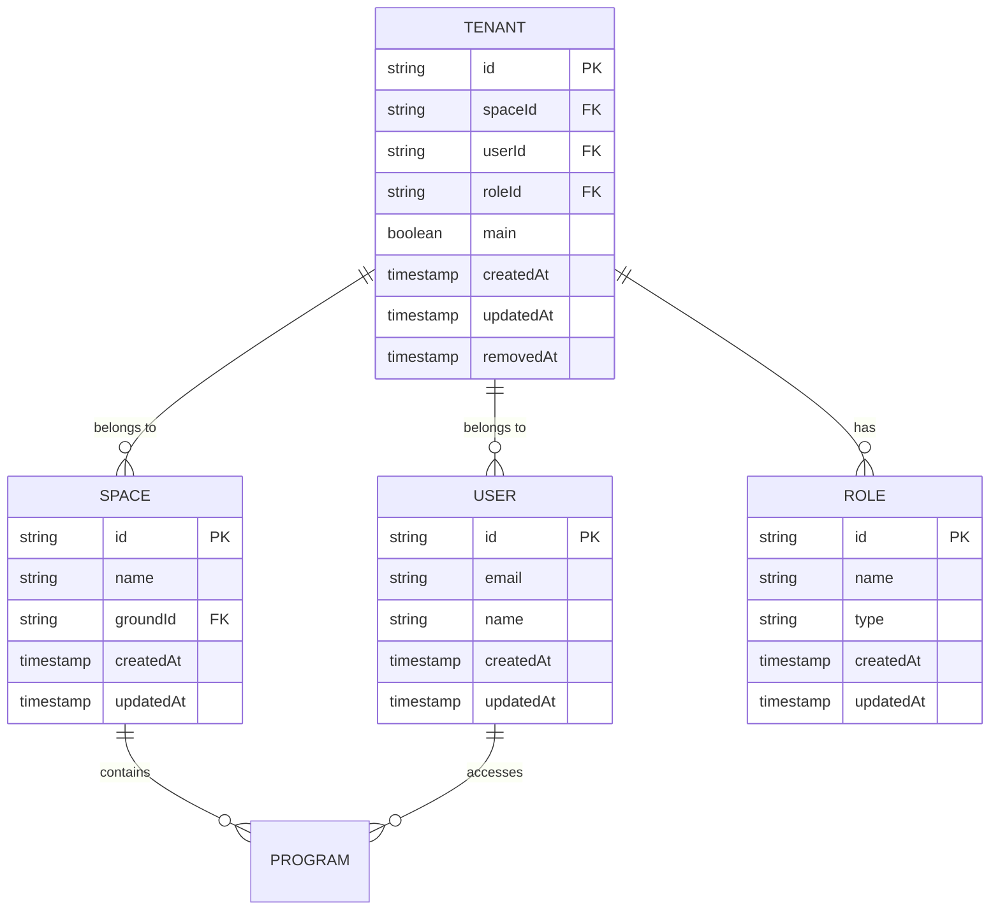

# Tenants API

<cite>
**Referenced Files in This Document**   
- [tenants.controller.ts](file://apps/server/src/shared/controller/resources/tenants.controller.ts)
- [tenants.service.ts](file://apps/server/src/shared/service/resources/tenants.service.ts)
- [tenants.repository.ts](file://apps/server/src/shared/repository/tenants.repository.ts)
- [tenant.entity.ts](file://packages/schema/src/entity/tenant.entity.ts)
- [tenant.dto.ts](file://packages/schema/src/dto/tenant.dto.ts)
- [createTenantDto.ts](file://packages/schema/src/dto/create/createTenant.dto.ts)
- [updateTenantDto.ts](file://packages/schema/src/dto/update/updateTenant.dto.ts)
- [queryTenantDto.ts](file://packages/schema/src/dto/query/queryTenant.dto.ts)
- [selectTenantDto.ts](file://packages/schema/src/dto/select-tenant.dto.ts)
</cite>

## Table of Contents
1. [Introduction](#introduction)
2. [Authentication and Authorization](#authentication-and-authorization)
3. [Tenant Creation](#tenant-creation)
4. [Tenant Retrieval](#tenant-retrieval)
5. [Tenant Update](#tenant-update)
6. [Tenant Deletion](#tenant-deletion)
7. [Query Parameters](#query-parameters)
8. [Response Format](#response-format)
9. [Error Responses](#error-responses)
10. [Tenant Associations](#tenant-associations)
11. [Sample curl Commands](#sample-curl-commands)

## Introduction

The Tenants API provides comprehensive functionality for managing tenant entities in a multi-tenant architecture. This API enables creation, retrieval, update, and deletion of tenants, with support for pagination, filtering, and sorting. Tenants serve as the organizational unit that associates users, spaces, and programs within the system.

The API follows RESTful principles with predictable resource URLs and standard HTTP methods. All endpoints require JWT authentication and appropriate authorization based on the user's role and tenant membership.

**Section sources**
- [tenants.controller.ts](file://apps/server/src/shared/controller/resources/tenants.controller.ts#L27-L103)

## Authentication and Authorization

All endpoints in the Tenants API require JWT authentication. Clients must include a valid JWT token in the Authorization header for all requests:

```
Authorization: Bearer <JWT_TOKEN>
```

Authorization rules are enforced based on the multi-tenancy model:
- Users can only access tenants they are associated with
- Administrative operations require appropriate role permissions within the tenant
- The `getMyTenants` endpoint returns only tenants associated with the authenticated user
- Operations on specific tenants require the user to be a member of that tenant

The API uses role-based access control (RBAC) to determine what operations a user can perform on a tenant. The relationship between users and tenants is managed through the tenant entity's userId and role associations.

**Section sources**
- [tenants.controller.ts](file://apps/server/src/shared/controller/resources/tenants.controller.ts#L35-L43)
- [contextService.ts](file://apps/server/src/shared/service/context.service.ts)

## Tenant Creation

### Endpoint
```
POST /api/v1/tenants
```

### Request
- **HTTP Method**: POST
- **Content-Type**: application/json
- **Authentication**: Required (JWT)

### Request Body (CreateTenantDto)
The request body must contain the following fields:

| Field | Type | Required | Description |
|-------|------|----------|-------------|
| spaceId | string (UUID) | Yes | The ID of the space associated with this tenant |
| userId | string (UUID) | Yes | The ID of the user creating the tenant |
| roleId | string (UUID) | Yes | The ID of the role for this tenant association |
| main | boolean | No | Whether this is the main tenant for the user-space relationship |

### Sample Request
```json
{
  "spaceId": "a1b2c3d4-e5f6-7890-g1h2-i3j4k5l6m7n8",
  "userId": "b2c3d4e5-f6g7-8901-h2i3-j4k5l6m7n8o9",
  "roleId": "c3d4e5f6-g7h8-9012-i3j4-k5l6m7n8o9p0",
  "main": true
}
```

### Success Response
- **HTTP Status**: 200 OK
- **Content-Type**: application/json

```json
{
  "httpStatus": 200,
  "message": "success",
  "data": {
    "id": "d4e5f6g7-h8i9-0123-j4k5-l6m7n8o9p0q1",
    "spaceId": "a1b2c3d4-e5f6-7890-g1h2-i3j4k5l6m7n8",
    "userId": "b2c3d4e5-f6g7-8901-h2i3-j4k5l6m7n8o9",
    "roleId": "c3d4e5f6-g7h8-9012-i3j4-k5l6m7n8o9p0",
    "main": true,
    "createdAt": "2025-01-01T00:00:00.000Z",
    "updatedAt": "2025-01-01T00:00:00.000Z",
    "removedAt": null
  }
}
```

**Section sources**
- [tenants.controller.ts](file://apps/server/src/shared/controller/resources/tenants.controller.ts#L45-L52)
- [tenants.service.ts](file://apps/server/src/shared/service/resources/tenants.service.ts#L19-L32)
- [createTenant.dto.ts](file://packages/schema/src/dto/create/createTenant.dto.ts)

## Tenant Retrieval

### Get All Tenants with Query Parameters
```
GET /api/v1/tenants
```

### Get Specific Tenant
```
GET /api/v1/tenants/{tenantId}
```

### Get User's Tenants
```
GET /api/v1/tenants/my
```

### Path Parameters
| Parameter | Type | Description |
|---------|------|-------------|
| tenantId | string (UUID) | The unique identifier of the tenant |

### Response Format
For single tenant retrieval (200 OK):
```json
{
  "httpStatus": 200,
  "message": "success",
  "data": {
    "id": "d4e5f6g7-h8i9-0123-j4k5-l6m7n8o9p0q1",
    "spaceId": "a1b2c3d4-e5f6-7890-g1h2-i3j4k5l6m7n8",
    "userId": "b2c3d4e5-f6g7-8901-h2i3-j4k5l6m7n8o9",
    "roleId": "c3d4e5f6-g7h8-9012-i3j4-k5l6m7n8o9p0",
    "main": true,
    "createdAt": "2025-01-01T00:00:00.000Z",
    "updatedAt": "2025-01-01T00:00:00.000Z",
    "removedAt": null,
    "space": {
      "id": "a1b2c3d4-e5f6-7890-g1h2-i3j4k5l6m7n8",
      "name": "Main Space",
      "groundId": "e5f6g7h8-i9j0-1234-k5l6-m7n8o9p0q1r2",
      "createdAt": "2025-01-01T00:00:00.000Z",
      "updatedAt": "2025-01-01T00:00:00.000Z"
    },
    "user": {
      "id": "b2c3d4e5-f6g7-8901-h2i3-j4k5l6m7n8o9",
      "email": "user@example.com",
      "name": "John Doe",
      "createdAt": "2025-01-01T00:00:00.000Z",
      "updatedAt": "2025-01-01T00:00:00.000Z"
    },
    "role": {
      "id": "c3d4e5f6-g7h8-9012-i3j4-k5l6m7n8o9p0",
      "name": "Administrator",
      "type": "ADMIN",
      "createdAt": "2025-01-01T00:00:00.000Z",
      "updatedAt": "2025-01-01T00:00:00.000Z"
    }
  }
}
```

For multiple tenants with pagination (200 OK):
```json
{
  "httpStatus": 200,
  "message": "success",
  "data": [
    {
      "id": "d4e5f6g7-h8i9-0123-j4k5-l6m7n8o9p0q1",
      "spaceId": "a1b2c3d4-e5f6-7890-g1h2-i3j4k5l6m7n8",
      "userId": "b2c3d4e5-f6g7-8901-h2i3-j4k5l6m7n8o9",
      "roleId": "c3d4e5f6-g7h8-9012-i3j4-k5l6m7n8o9p0",
      "main": true,
      "createdAt": "2025-01-01T00:00:00.000Z",
      "updatedAt": "2025-01-01T00:00:00.000Z",
      "removedAt": null
    }
  ],
  "meta": {
    "skip": 0,
    "take": 10,
    "count": 1
  }
}
```

**Section sources**
- [tenants.controller.ts](file://apps/server/src/shared/controller/resources/tenants.controller.ts#L54-L60)
- [tenants.controller.ts](file://apps/server/src/shared/controller/resources/tenants.controller.ts#L89-L102)
- [tenants.service.ts](file://apps/server/src/shared/service/resources/tenants.service.ts#L34-L48)

## Tenant Update

### Endpoint
```
PATCH /api/v1/tenants/{tenantId}
```

### Request
- **HTTP Method**: PATCH
- **Content-Type**: application/json
- **Authentication**: Required (JWT)

### Path Parameters
| Parameter | Type | Description |
|---------|------|-------------|
| tenantId | string (UUID) | The unique identifier of the tenant to update |

### Request Body (UpdateTenantDto)
The request body can contain any of the following fields to update:

| Field | Type | Description |
|-------|------|-------------|
| spaceId | string (UUID) | The ID of the space associated with this tenant |
| userId | string (UUID) | The ID of the user associated with this tenant |
| roleId | string (UUID) | The ID of the role for this tenant association |
| main | boolean | Whether this is the main tenant for the user-space relationship |

### Sample Request
```json
{
  "main": false
}
```

### Success Response
- **HTTP Status**: 200 OK
- **Content-Type**: application/json

```json
{
  "httpStatus": 200,
  "message": "success",
  "data": {
    "id": "d4e5f6g7-h8i9-0123-j4k5-l6m7n8o9p0q1",
    "spaceId": "a1b2c3d4-e5f6-7890-g1h2-i3j4k5l6m7n8",
    "userId": "b2c3d4e5-f6g7-8901-h2i3-j4k5l6m7n8o9",
    "roleId": "c3d4e5f6-g7h8-9012-i3j4-k5l6m7n8o9p0",
    "main": false,
    "createdAt": "2025-01-01T00:00:00.000Z",
    "updatedAt": "2025-01-02T00:00:00.000Z",
    "removedAt": null
  }
}
```

**Section sources**
- [tenants.controller.ts](file://apps/server/src/shared/controller/resources/tenants.controller.ts#L62-L71)
- [tenants.service.ts](file://apps/server/src/shared/service/resources/tenants.service.ts#L50-L68)
- [updateTenant.dto.ts](file://packages/schema/src/dto/update/updateTenant.dto.ts)

## Tenant Deletion

The API provides two methods for removing tenants: soft delete and hard delete.

### Soft Delete (Mark as Removed)
```
PATCH /api/v1/tenants/{tenantId}/removedAt
```

This endpoint sets the `removedAt` timestamp on the tenant record, effectively marking it as deleted without removing it from the database.

### Hard Delete
```
DELETE /api/v1/tenants/{tenantId}
```

This endpoint permanently removes the tenant record from the database.

### Path Parameters
| Parameter | Type | Description |
|---------|------|-------------|
| tenantId | string (UUID) | The unique identifier of the tenant to delete |

### Success Response
- **HTTP Status**: 200 OK
- **Content-Type**: application/json

```json
{
  "httpStatus": 200,
  "message": "success",
  "data": {
    "id": "d4e5f6g7-h8i9-0123-j4k5-l6m7n8o9p0q1",
    "spaceId": "a1b2c3d4-e5f6-7890-g1h2-i3j4k5l6m7n8",
    "userId": "b2c3d4e5-f6g7-8901-h2i3-j4k5l6m7n8o9",
    "roleId": "c3d4e5f6-g7h8-9012-i3j4-k5l6m7n8o9p0",
    "main": false,
    "createdAt": "2025-01-01T00:00:00.000Z",
    "updatedAt": "2025-01-02T00:00:00.000Z",
    "removedAt": "2025-01-03T00:00:00.000Z"
  }
}
```

**Section sources**
- [tenants.controller.ts](file://apps/server/src/shared/controller/resources/tenants.controller.ts#L73-L87)
- [tenants.service.ts](file://apps/server/src/shared/service/resources/tenants.service.ts)

## Query Parameters

The `GET /api/v1/tenants` endpoint supports various query parameters for filtering, sorting, and pagination.

### Supported Query Parameters
| Parameter | Type | Default | Description |
|---------|------|---------|-------------|
| skip | number | 0 | Number of records to skip (for pagination) |
| take | number | 10 | Number of records to return (for pagination) |
| sortBy | string | createdAt | Field to sort by |
| sortOrder | string | DESC | Sort order (ASC or DESC) |
| userId | string (UUID) | - | Filter tenants by user ID |
| spaceId | string (UUID) | - | Filter tenants by space ID |
| roleId | string (UUID) | - | Filter tenants by role ID |
| main | boolean | - | Filter tenants by main status |

### Example Usage
```
GET /api/v1/tenants?skip=0&take=20&sortBy=createdAt&sortOrder=ASC&userId=a1b2c3d4-e5f6-7890-g1h2-i3j4k5l6m7n8
```

This request returns the first 20 tenants associated with the specified user, sorted by creation date in ascending order.

**Section sources**
- [tenants.controller.ts](file://apps/server/src/shared/controller/resources/tenants.controller.ts#L89-L102)
- [queryTenant.dto.ts](file://packages/schema/src/dto/query/queryTenant.dto.ts)
- [tenants.service.ts](file://apps/server/src/shared/service/resources/tenants.service.ts)

## Response Format

All successful responses follow a consistent format with the following structure:

```json
{
  "httpStatus": number,
  "message": string,
  "data": object | array,
  "meta": object
}
```

### Field Descriptions
| Field | Type | Description |
|------|------|-------------|
| httpStatus | number | HTTP status code |
| message | string | Response message (typically "success" for successful operations) |
| data | object or array | The actual data payload |
| meta | object | Metadata about the response (included in list operations) |

### Meta Object (for list operations)
The meta object provides pagination information:

```json
{
  "skip": 0,
  "take": 10,
  "count": 25
}
```

| Field | Type | Description |
|------|------|-------------|
| skip | number | Number of records skipped |
| take | number | Number of records returned |
| count | number | Total number of records available |

**Section sources**
- [tenants.controller.ts](file://apps/server/src/shared/controller/resources/tenants.controller.ts#L94-L99)
- [response.util.ts](file://apps/server/src/shared/util/response.util.ts)

## Error Responses

The API returns standardized error responses with appropriate HTTP status codes.

### Common Error Status Codes
| Status Code | Error Type | Description |
|------------|-----------|-------------|
| 400 | Bad Request | Invalid request parameters or body |
| 401 | Unauthorized | Missing or invalid authentication token |
| 403 | Forbidden | Insufficient permissions for the operation |
| 404 | Not Found | Requested tenant does not exist |
| 409 | Conflict | Request conflicts with current state |
| 500 | Internal Server Error | Unexpected server error |

### Error Response Format
```json
{
  "httpStatus": 400,
  "message": "Bad Request",
  "errors": [
    {
      "field": "spaceId",
      "message": "spaceId must be a valid UUID"
    }
  ]
}
```

### Common Validation Errors
- **Missing required fields**: Returns 400 with details of missing fields
- **Invalid UUID format**: Returns 400 when ID parameters are not valid UUIDs
- **Access to unauthorized tenant**: Returns 403 when user attempts to access a tenant they don't belong to
- **Non-existent tenant**: Returns 404 when attempting to access or modify a non-existent tenant

**Section sources**
- [tenants.controller.ts](file://apps/server/src/shared/controller/resources/tenants.controller.ts)
- [exception.filters.ts](file://apps/server/src/shared/filter)

## Tenant Associations

Tenants serve as the central entity that associates users with spaces and roles in the multi-tenant architecture.

### Entity Relationships


**Diagram sources**
- [tenant.entity.ts](file://packages/schema/src/entity/tenant.entity.ts)
- [space.entity.ts](file://packages/schema/src/entity/space.entity.ts)
- [user.entity.ts](file://packages/schema/src/entity/user.entity.ts)
- [role.entity.ts](file://packages/schema/src/entity/role.entity.ts)

### Association Details
- **Space Association**: Each tenant is associated with exactly one space, which represents a physical or logical location.
- **User Association**: Each tenant links a user to a space, defining which users have access to which spaces.
- **Role Association**: The role determines the user's permissions within the tenant context.
- **Program Access**: Users gain access to programs through their tenant associations with spaces that contain those programs.

The `main` field indicates whether this is the primary tenant for the user-space relationship, which may affect default behavior in the application.

**Section sources**
- [tenant.entity.ts](file://packages/schema/src/entity/tenant.entity.ts)
- [tenants.service.ts](file://apps/server/src/shared/service/resources/tenants.service.ts)

## Sample curl Commands

### Create a Tenant
```bash
curl -X POST https://api.example.com/api/v1/tenants \
  -H "Authorization: Bearer <JWT_TOKEN>" \
  -H "Content-Type: application/json" \
  -d '{
    "spaceId": "a1b2c3d4-e5f6-7890-g1h2-i3j4k5l6m7n8",
    "userId": "b2c3d4e5-f6g7-8901-h2i3-j4k5l6m7n8o9",
    "roleId": "c3d4e5f6-g7h8-9012-i3j4-k5l6m7n8o9p0",
    "main": true
  }'
```

### Get All Tenants with Pagination
```bash
curl -X GET "https://api.example.com/api/v1/tenants?skip=0&take=10&sortBy=createdAt&sortOrder=DESC" \
  -H "Authorization: Bearer <JWT_TOKEN>"
```

### Get Specific Tenant
```bash
curl -X GET https://api.example.com/api/v1/tenants/d4e5f6g7-h8i9-0123-j4k5-l6m7n8o9p0q1 \
  -H "Authorization: Bearer <JWT_TOKEN>"
```

### Update a Tenant
```bash
curl -X PATCH https://api.example.com/api/v1/tenants/d4e5f6g7-h8i9-0123-j4k5-l6m7n8o9p0q1 \
  -H "Authorization: Bearer <JWT_TOKEN>" \
  -H "Content-Type: application/json" \
  -d '{
    "main": false
  }'
```

### Soft Delete a Tenant
```bash
curl -X PATCH https://api.example.com/api/v1/tenants/d4e5f6g7-h8i9-0123-j4k5-l6m7n8o9p0q1/removedAt \
  -H "Authorization: Bearer <JWT_TOKEN>"
```

### Hard Delete a Tenant
```bash
curl -X DELETE https://api.example.com/api/v1/tenants/d4e5f6g7-h8i9-0123-j4k5-l6m7n8o9p0q1 \
  -H "Authorization: Bearer <JWT_TOKEN>"
```

### Get User's Tenants
```bash
curl -X GET https://api.example.com/api/v1/tenants/my \
  -H "Authorization: Bearer <JWT_TOKEN>"
```

**Section sources**
- [tenants.controller.ts](file://apps/server/src/shared/controller/resources/tenants.controller.ts)