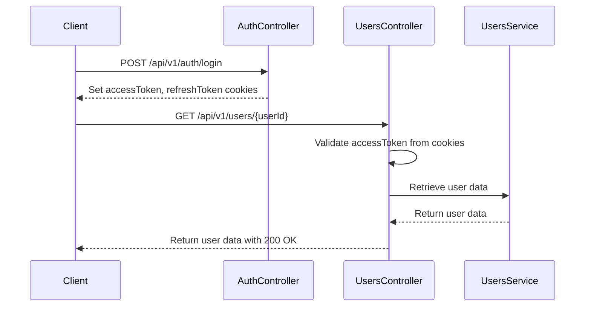
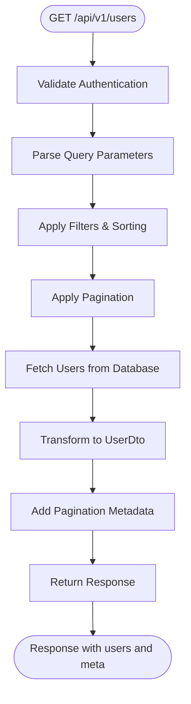
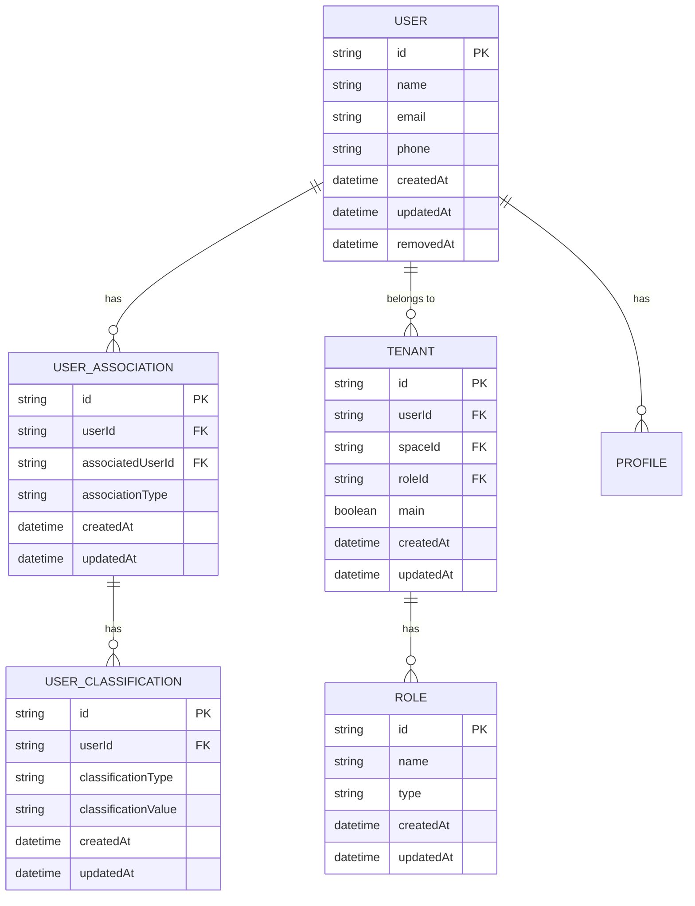

# Users API

<cite>
**Referenced Files in This Document**   
- [users.controller.ts](file://apps/server/src/shared/controller/resources/users.controller.ts)
- [user.dto.ts](file://packages/schema/src/dto/user.dto.ts)
- [create-user.dto.ts](file://packages/schema/src/dto/create/create-user.dto.ts)
- [update-user.dto.ts](file://packages/schema/src/dto/update/update-user.dto.ts)
- [query-user.dto.ts](file://packages/schema/src/dto/query/query-user.dto.ts)
- [user.entity.ts](file://packages/schema/src/entity/user.entity.ts)
- [user-association.dto.ts](file://packages/schema/src/dto/user-association.dto.ts)
- [user-classification.dto.ts](file://packages/schema/src/dto/user-classification.dto.ts)
- [auth.controller.ts](file://apps/server/src/shared/controller/domains/auth.controller.ts)
</cite>

## Table of Contents
1. [Introduction](#introduction)
2. [Authentication and Authorization](#authentication-and-authorization)
3. [User Creation](#user-creation)
4. [User Retrieval](#user-retrieval)
5. [User Update](#user-update)
6. [User Deletion](#user-deletion)
7. [Query Parameters](#query-parameters)
8. [Response Formats](#response-formats)
9. [Error Responses](#error-responses)
10. [User Associations and Classifications](#user-associations-and-classifications)
11. [Sample curl Commands](#sample-curl-commands)

## Introduction
The Users API provides comprehensive CRUD operations for user management within the system. This API enables creation, retrieval, updating, and deletion of user records, with support for filtering, sorting, and pagination. All endpoints (except authentication) require JWT-based authentication via cookies.

The API follows RESTful principles with predictable URL patterns and standard HTTP status codes. User data is represented in JSON format, with consistent response structures for both single and multiple user operations.

**Section sources**
- [users.controller.ts](file://apps/server/src/shared/controller/resources/users.controller.ts#L28-L125)

## Authentication and Authorization
All Users API endpoints require authentication using JWT tokens, which are transmitted via HTTP-only cookies. The system implements a token-based authentication mechanism with access and refresh tokens.

Authentication is enforced through the `@Auth()` decorator (not explicitly shown in the controller but implied by the architecture). The tokens are validated on each request, and users must be authenticated to access any user-related endpoints.

The authentication flow:
1. Users authenticate via `/api/v1/auth/login` endpoint
2. Server sets `accessToken` and `refreshToken` in HTTP-only cookies
3. Subsequent requests automatically include these cookies
4. Access token is validated for each protected endpoint
5. When access token expires, refresh token can be used to obtain new tokens



**Diagram sources**
- [auth.controller.ts](file://apps/server/src/shared/controller/domains/auth.controller.ts#L172-L177)
- [users.controller.ts](file://apps/server/src/shared/controller/resources/users.controller.ts#L45-L51)

## User Creation
Creates a new user in the system with the provided information.

### Endpoint
```
POST /api/v1/users
```

### Request Payload
The request body must contain a `CreateUserDto` object with the following properties:

| Field | Type | Required | Description | Constraints |
|-------|------|----------|-------------|-------------|
| name | string | Yes | User's full name | Minimum 1 character |
| email | string | Yes | User's email address | Must be valid email format |
| phone | string | Yes | User's phone number | No specific format enforced |
| password | string | Yes | User's password | Minimum 8 characters |
| spaceId | string | Yes | ID of the associated space | Must be valid UUID |

### Response
- **Status**: 200 OK
- **Content**: Created user object in `UserDto` format

### Example Request
```json
{
  "name": "John Doe",
  "email": "john.doe@example.com",
  "phone": "010-1234-5678",
  "password": "securePassword123",
  "spaceId": "a1b2c3d4-e5f6-7890-g1h2-i3j4k5l6m7n8"
}
```

**Section sources**
- [create-user.dto.ts](file://packages/schema/src/dto/create/create-user.dto.ts)
- [users.controller.ts](file://apps/server/src/shared/controller/resources/users.controller.ts#L35-L43)

## User Retrieval
Retrieves user information from the system, either individual users or lists of users with filtering capabilities.

### Get Single User
Retrieves a specific user by ID.

#### Endpoint
```
GET /api/v1/users/{userId}
```

#### Path Parameters
| Parameter | Type | Description |
|---------|------|-------------|
| userId | string | UUID of the user to retrieve |

#### Response
- **Status**: 200 OK
- **Content**: User object in `UserDto` format

### Get Multiple Users
Retrieves a list of users based on query parameters.

#### Endpoint
```
GET /api/v1/users
```

#### Query Parameters
Supports all parameters defined in `QueryUserDto` for filtering, sorting, and pagination (see [Query Parameters](#query-parameters) section).

#### Response
- **Status**: 200 OK
- **Content**: Paginated response containing array of `UserDto` objects with metadata



**Diagram sources**
- [users.controller.ts](file://apps/server/src/shared/controller/resources/users.controller.ts#L91-L115)
- [query-user.dto.ts](file://packages/schema/src/dto/query/query-user.dto.ts)

**Section sources**
- [users.controller.ts](file://apps/server/src/shared/controller/resources/users.controller.ts#L45-L51)
- [users.controller.ts](file://apps/server/src/shared/controller/resources/users.controller.ts#L91-L115)
- [user.dto.ts](file://packages/schema/src/dto/user.dto.ts#L16-L59)

## User Update
Updates an existing user's information.

### Endpoint
```
PATCH /api/v1/users/{userId}
```

### Path Parameters
| Parameter | Type | Description |
|---------|------|-------------|
| userId | string | UUID of the user to update |

### Request Payload
The request body must contain an `UpdateUserDto` object. All fields are optional, allowing partial updates.

| Field | Type | Description | Constraints |
|-------|------|-------------|-------------|
| name | string | Updated user name | Minimum 1 character |
| email | string | Updated email address | Must be valid email format |
| phone | string | Updated phone number | No specific format enforced |
| password | string | Updated password | Minimum 8 characters |

### Response
- **Status**: 200 OK
- **Content**: Updated user object in `UserDto` format

### Example Request
```json
{
  "name": "John Smith",
  "phone": "010-8765-4321"
}
```

**Section sources**
- [update-user.dto.ts](file://packages/schema/src/dto/update/update-user.dto.ts)
- [users.controller.ts](file://apps/server/src/shared/controller/resources/users.controller.ts#L64-L73)

## User Deletion
The system implements both soft and hard deletion of user records.

### Soft Delete (Archive)
Marks a user as deleted without removing the record from the database.

#### Endpoint
```
PATCH /api/v1/users/{userId}/removedAt
```

#### Path Parameters
| Parameter | Type | Description |
|---------|------|-------------|
| userId | string | UUID of the user to soft delete |

#### Response
- **Status**: 200 OK
- **Content**: User object with `removedAt` timestamp set

### Hard Delete
Permanently removes a user record from the database.

#### Endpoint
```
DELETE /api/v1/users/{userId}
```

#### Path Parameters
| Parameter | Type | Description |
|---------|------|-------------|
| userId | string | UUID of the user to hard delete |

#### Response
- **Status**: 200 OK
- **Content**: Deleted user object

### Bulk Soft Delete
Soft deletes multiple users in a single request.

#### Endpoint
```
PATCH /api/v1/users/removedAt
```

#### Request Payload
Array of user IDs to soft delete:
```json
["user-id-1", "user-id-2", "user-id-3"]
```

#### Response
- **Status**: 200 OK
- **Content**: Count of successfully soft-deleted users

**Section sources**
- [users.controller.ts](file://apps/server/src/shared/controller/resources/users.controller.ts#L75-L89)
- [users.controller.ts](file://apps/server/src/shared/controller/resources/users.controller.ts#L53-L62)

## Query Parameters
The `GET /api/v1/users` endpoint supports various query parameters for filtering, sorting, and pagination through the `QueryUserDto` class.

### Filtering Parameters
| Parameter | Type | Description |
|---------|------|-------------|
| id | string | Filter by user ID (exact match) |
| name | string | Filter by user name (partial match) |
| email | string | Filter by email address (exact match) |
| phone | string | Filter by phone number (exact match) |
| spaceId | string | Filter by space ID (exact match) |
| tenantId | string | Filter by tenant ID (exact match) |
| roleId | string | Filter by role ID (exact match) |

### Sorting Parameters
| Parameter | Type | Description | Default |
|---------|------|-------------|---------|
| sort | string | Field to sort by | id |
| order | string | Sort order: ASC or DESC | ASC |

### Pagination Parameters
| Parameter | Type | Description | Default |
|---------|------|-------------|---------|
| page | number | Page number (1-indexed) | 1 |
| limit | number | Number of items per page | 10 |

### Example Usage
```
GET /api/v1/users?name=John&sort=name&order=ASC&page=1&limit=20
```

**Section sources**
- [query-user.dto.ts](file://packages/schema/src/dto/query/query-user.dto.ts)
- [users.controller.ts](file://apps/server/src/shared/controller/resources/users.controller.ts#L94-L115)

## Response Formats
The API returns consistent response formats for all operations.

### Single User Response
```json
{
  "data": {
    "id": "a1b2c3d4-e5f6-7890-g1h2-i3j4k5l6m7n8",
    "createdAt": "2025-01-01T00:00:00.000Z",
    "updatedAt": "2025-01-01T00:00:00.000Z",
    "spaceId": "a1b2c3d4-e5f6-7890-g1h2-i3j4k5l6m7n8",
    "email": "john.doe@example.com",
    "name": "John Doe",
    "phone": "010-1234-5678",
    "profiles": [
      {
        "id": "b2c3d4e5-f6g7-8901-h2i3-j4k5l6m7n8o9",
        "name": "John Doe",
        "nickname": "John",
        "createdAt": "2025-01-01T00:00:00.000Z",
        "updatedAt": "2025-01-01T00:00:00.000Z"
      }
    ],
    "tenants": [
      {
        "id": "c3d4e5f6-g7h8-9012-i3j4-k5l6m7n8o9p0",
        "main": true,
        "spaceId": "a1b2c3d4-e5f6-7890-g1h2-i3j4k5l6m7n8",
        "roleId": "d4e5f6g7-h8i9-0123-j4k5-l6m7n8o9p0q1",
        "createdAt": "2025-01-01T00:00:00.000Z",
        "updatedAt": "2025-01-01T00:00:00.000Z",
        "role": {
          "id": "d4e5f6g7-h8i9-0123-j4k5-l6m7n8o9p0q1",
          "name": "USER",
          "type": "USER",
          "createdAt": "2025-01-01T00:00:00.000Z",
          "updatedAt": "2025-01-01T00:00:00.000Z"
        }
      }
    ],
    "associations": [],
    "classification": null
  },
  "message": "success",
  "meta": null
}
```

### Paginated Response
```json
{
  "data": [
    // Array of user objects
  ],
  "message": "success",
  "meta": {
    "totalItems": 150,
    "itemCount": 10,
    "itemsPerPage": 10,
    "totalPages": 15,
    "currentPage": 1
  }
}
```

### User DTO Structure
The `UserDto` class extends `AbstractDto` and includes the following fields:

| Field | Type | Description |
|------|------|-------------|
| id | string | Unique identifier (UUID) |
| createdAt | string | Creation timestamp (ISO 8601) |
| updatedAt | string | Last update timestamp (ISO 8601) |
| spaceId | string | Associated space ID |
| email | string | User's email address |
| name | string | User's full name |
| phone | string | User's phone number |
| profiles | ProfileDto[] | Array of associated profiles |
| tenants | TenantDto[] | Array of associated tenants with roles |
| associations | UserAssociationDto[] | Array of user associations |
| classification | UserClassificationDto | User classification information |

**Section sources**
- [user.dto.ts](file://packages/schema/src/dto/user.dto.ts#L16-L59)
- [users.controller.ts](file://apps/server/src/shared/controller/resources/users.controller.ts#L109-L114)

## Error Responses
The API returns standardized error responses with appropriate HTTP status codes.

### Common Error Codes
| Status Code | Error Type | Description | Example Response |
|------------|-----------|-------------|------------------|
| 400 | Bad Request | Invalid request parameters or payload | ```{"statusCode": 400, "message": "Invalid email format", "error": "Bad Request"}``` |
| 401 | Unauthorized | Missing or invalid authentication token | ```{"statusCode": 401, "message": "Token is invalid", "error": "Unauthorized"}``` |
| 403 | Forbidden | Authenticated user lacks required permissions | ```{"statusCode": 403, "message": "Access denied", "error": "Forbidden"}``` |
| 404 | Not Found | Requested user does not exist | ```{"statusCode": 404, "message": "User not found", "error": "Not Found"}``` |
| 409 | Conflict | Request conflicts with current system state | ```{"statusCode": 409, "message": "Email already exists", "error": "Conflict"}``` |
| 500 | Internal Server Error | Unexpected server error | ```{"statusCode": 500, "message": "Internal server error", "error": "Internal Server Error"}``` |

### Validation Errors
When request validation fails, the API returns detailed error information:

```json
{
  "statusCode": 400,
  "message": [
    "email must be an email",
    "name must be longer than or equal to 1 characters"
  ],
  "error": "Bad Request"
}
```

**Section sources**
- [users.controller.ts](file://apps/server/src/shared/controller/resources/users.controller.ts)
- [auth.controller.ts](file://apps/server/src/shared/controller/domains/auth.controller.ts#L31-L44)

## User Associations and Classifications
Users in the system can have various associations and classifications that define their relationships and roles within the organization.

### User Associations
User associations represent relationships between users and other entities in the system.



**Diagram sources**
- [user-association.dto.ts](file://packages/schema/src/dto/user-association.dto.ts)
- [user-classification.dto.ts](file://packages/schema/src/dto/user-classification.dto.ts)
- [user.entity.ts](file://packages/schema/src/entity/user.entity.ts#L11-L26)

### User Classifications
User classifications provide additional metadata about users, such as their role type or category.

The `UserClassificationDto` contains:
- **id**: Unique identifier
- **userId**: Reference to the associated user
- **classificationType**: Type of classification
- **classificationValue**: Value of the classification
- **createdAt**: Creation timestamp
- **updatedAt**: Last update timestamp

### Tenant Relationships
Each user belongs to one or more tenants, with exactly one main tenant. The tenant relationship includes:
- **Tenant membership**: Users can belong to multiple tenants
- **Main tenant**: One primary tenant per user
- **Role assignment**: Each tenant membership includes a role
- **Space association**: Tenants are associated with specific spaces

This structure enables multi-tenancy support, allowing users to participate in multiple organizational contexts with different roles and permissions.

**Section sources**
- [user-association.dto.ts](file://packages/schema/src/dto/user-association.dto.ts)
- [user-classification.dto.ts](file://packages/schema/src/dto/user-classification.dto.ts)
- [user.entity.ts](file://packages/schema/src/entity/user.entity.ts#L18-L24)

## Sample curl Commands
Example curl commands for common operations:

### Create User
```bash
curl -X POST https://api.example.com/api/v1/users \
  -H "Content-Type: application/json" \
  -H "Cookie: accessToken=your-access-token" \
  -d '{
    "name": "Jane Smith",
    "email": "jane.smith@example.com",
    "phone": "010-1111-2222",
    "password": "strongPassword123",
    "spaceId": "a1b2c3d4-e5f6-7890-g1h2-i3j4k5l6m7n8"
  }'
```

### Get Single User
```bash
curl -X GET https://api.example.com/api/v1/users/a1b2c3d4-e5f6-7890-g1h2-i3j4k5l6m7n8 \
  -H "Cookie: accessToken=your-access-token"
```

### Get Users with Filtering
```bash
curl -X GET "https://api.example.com/api/v1/users?name=John&sort=name&order=ASC&page=1&limit=10" \
  -H "Cookie: accessToken=your-access-token"
```

### Update User
```bash
curl -X PATCH https://api.example.com/api/v1/users/a1b2c3d4-e5f6-7890-g1h2-i3j4k5l6m7n8 \
  -H "Content-Type: application/json" \
  -H "Cookie: accessToken=your-access-token" \
  -d '{
    "name": "John Updated",
    "phone": "010-9999-8888"
  }'
```

### Soft Delete User
```bash
curl -X PATCH https://api.example.com/api/v1/users/a1b2c3d4-e5f6-7890-g1h2-i3j4k5l6m7n8/removedAt \
  -H "Cookie: accessToken=your-access-token"
```

### Hard Delete User
```bash
curl -X DELETE https://api.example.com/api/v1/users/a1b2c3d4-e5f6-7890-g1h2-i3j4k5l6m7n8 \
  -H "Cookie: accessToken=your-access-token"
```

**Section sources**
- [users.controller.ts](file://apps/server/src/shared/controller/resources/users.controller.ts)