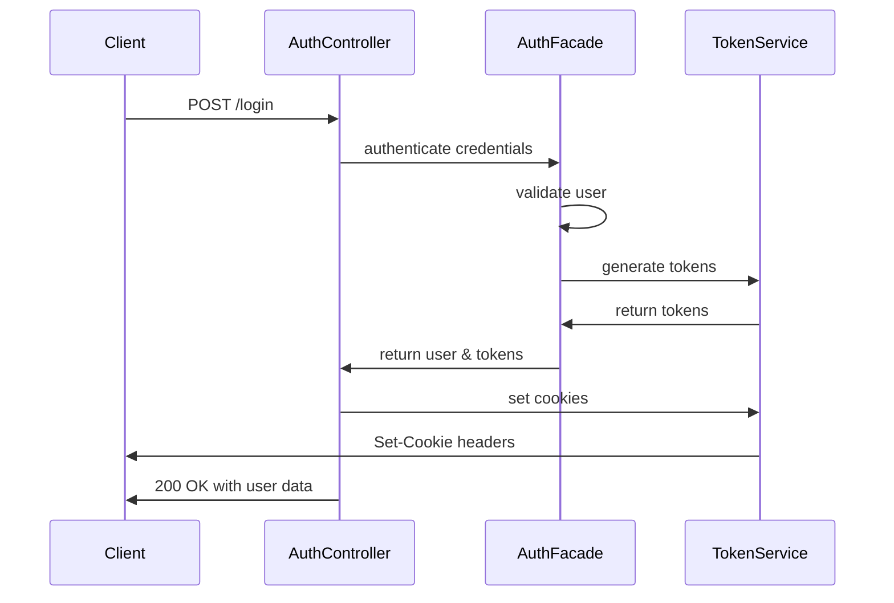

# API Endpoints Reference

<cite>
**Referenced Files in This Document**   
- [auth.controller.ts](file://apps/server/src/shared/controller/domains/auth.controller.ts)
- [users.controller.ts](file://apps/server/src/shared/controller/resources/users.controller.ts)
- [tenants.controller.ts](file://apps/server/src/shared/controller/resources/tenants.controller.ts)
- [main.ts](file://apps/server/src/main.ts)
- [setNestApp.ts](file://apps/server/src/setNestApp.ts)
- [app-builder.dto.ts](file://packages/schema/src/dto/app-builder.dto.ts)
- [user.dto.ts](file://packages/schema/src/dto/user.dto.ts)
- [tenant.dto.ts](file://packages/schema/src/dto/tenant.dto.ts)
</cite>

## Table of Contents
1. [Introduction](#introduction)
2. [Authentication](#authentication)
3. [Users](#users)
4. [Tenants](#tenants)
5. [App Builder](#app-builder)
6. [Request/Response Format](#requestresponse-format)
7. [Error Handling](#error-handling)
8. [Security](#security)
9. [Rate Limiting](#rate-limiting)
10. [Versioning](#versioning)

## Introduction

This document provides comprehensive reference documentation for all RESTful API endpoints in the prj-core system. The API follows REST principles and is organized into domain and resource endpoints. All endpoints return standardized response entities with consistent structure.

The API is built using NestJS framework and exposes endpoints for authentication, user management, tenant management, and application building functionality. The server is configured to run on port 3006 by default, with API documentation available at `/api` path.

**Section sources**
- [main.ts](file://apps/server/src/main.ts#L1-L88)
- [setNestApp.ts](file://apps/server/src/setNestApp.ts#L1-L49)

## Authentication

The authentication system uses JWT tokens delivered via HttpOnly cookies for enhanced security. All authentication endpoints are publicly accessible except for token refresh and verification which require valid tokens.



**Diagram sources**
- [auth.controller.ts](file://apps/server/src/shared/controller/domains/auth.controller.ts#L60-L97)

### Login
- **HTTP Method**: POST
- **URL**: `/login`
- **Authentication**: Public
- **Content-Type**: application/json

**Request Body**
```json
{
  "email": "string",
  "password": "string"
}
```

**Response (200 OK)**
```json
{
  "data": {
    "accessToken": "string",
    "refreshToken": "string",
    "user": {
      "id": "string",
      "email": "string",
      "name": "string"
    },
    "mainTenantId": "string"
  },
  "message": "로그인 성공",
  "meta": null
}
```

**Headers Set**
- `Set-Cookie: accessToken=...; HttpOnly; Path=/`
- `Set-Cookie: refreshToken=...; HttpOnly; Path=/`

**Status Codes**
- 200: Login successful
- 400: Invalid email or password format
- 401: Invalid credentials
- 500: Internal server error

**Sample Request**
```bash
curl -X POST http://localhost:3006/login \
  -H "Content-Type: application/json" \
  -d '{"email":"user@example.com","password":"password123"}'
```

### Token Refresh
- **HTTP Method**: POST
- **URL**: `/token/refresh`
- **Authentication**: Requires refreshToken cookie
- **Content-Type**: application/json

**Response (200 OK)**
```json
{
  "data": {
    "accessToken": "string",
    "refreshToken": "string",
    "user": {
      "id": "string",
      "email": "string",
      "name": "string"
    },
    "mainTenantId": "string"
  },
  "message": "토큰 재발급 성공",
  "meta": null
}
```

**Status Codes**
- 200: Token refresh successful
- 401: Refresh token not found or expired
- 500: Internal server error

### Sign Up
- **HTTP Method**: POST
- **URL**: `/sign-up`
- **Authentication**: Public
- **Content-Type**: application/json
- **HTTP Status**: 201 Created

**Request Body**
```json
{
  "email": "string",
  "password": "string",
  "name": "string"
}
```

**Response (201 Created)**
```json
{
  "data": {
    "accessToken": "string",
    "refreshToken": "string",
    "user": {
      "id": "string",
      "email": "string",
      "name": "string"
    },
    "mainTenantId": "string"
  },
  "message": "회원가입 성공",
  "meta": null
}
```

**Status Codes**
- 201: User created successfully
- 400: Invalid signup format
- 409: Email already exists
- 500: Internal server error

### Verify Token
- **HTTP Method**: GET
- **URL**: `/verify-token`
- **Authentication**: Requires accessToken
- **Content-Type**: application/json

**Response (200 OK)**
```json
{
  "data": true,
  "message": "토큰 유효성 검증 완료",
  "meta": null
}
```

**Status Codes**
- 200: Token is valid
- 401: Token is invalid or not found
- 500: Internal server error

### Logout
- **HTTP Method**: POST
- **URL**: `/logout`
- **Authentication**: Optional (removes existing tokens)

**Response (200 OK)**
```json
{
  "data": true,
  "message": "로그아웃 성공",
  "meta": null
}
```

**Headers Set**
- `Set-Cookie: accessToken=; Path=/; Expires=Thu, 01 Jan 1970 00:00:00 GMT`
- `Set-Cookie: refreshToken=; Path=/; Expires=Thu, 01 Jan 1970 00:00:00 GMT`
- `Set-Cookie: tenantId=; Path=/; Expires=Thu, 01 Jan 1970 00:00:00 GMT`
- `Set-Cookie: workspaceId=; Path=/; Expires=Thu, 01 Jan 1970 00:00:00 GMT`

**Status Codes**
- 200: Logout successful

**Section sources**
- [auth.controller.ts](file://apps/server/src/shared/controller/domains/auth.controller.ts#L60-L254)

## Users

User management endpoints for creating, reading, updating, and deleting user records. These endpoints require authentication and appropriate permissions.

### Create User
- **HTTP Method**: POST
- **URL**: `/`
- **Authentication**: Required
- **Content-Type**: application/json

**Request Body**
```json
{
  "email": "string",
  "password": "string",
  "name": "string"
}
```

**Response (200 OK)**
```json
{
  "data": {
    "id": "string",
    "email": "string",
    "name": "string",
    "createdAt": "string",
    "updatedAt": "string"
  },
  "message": "success",
  "meta": null
}
```

### Get User
- **HTTP Method**: GET
- **URL**: `/:userId`
- **Authentication**: Required

**Path Parameters**
- `userId`: string (required)

**Response (200 OK)**
```json
{
  "data": {
    "id": "string",
    "email": "string",
    "name": "string",
    "createdAt": "string",
    "updatedAt": "string"
  },
  "message": "success",
  "meta": null
}
```

### Update User
- **HTTP Method**: PATCH
- **URL**: `/:userId`
- **Authentication**: Required
- **Content-Type**: application/json

**Path Parameters**
- `userId`: string (required)

**Request Body**
```json
{
  "name": "string",
  "email": "string"
}
```

**Response (200 OK)**
```json
{
  "data": {
    "id": "string",
    "email": "string",
    "name": "string",
    "createdAt": "string",
    "updatedAt": "string"
  },
  "message": "success",
  "meta": null
}
```

### Remove User
- **HTTP Method**: PATCH
- **URL**: `/:userId/removedAt`
- **Authentication**: Required

**Path Parameters**
- `userId`: string (required)

**Response (200 OK)**
```json
{
  "data": {
    "id": "string",
    "email": "string",
    "name": "string",
    "createdAt": "string",
    "updatedAt": "string",
    "removedAt": "string"
  },
  "message": "success",
  "meta": null
}
```

### Delete User
- **HTTP Method**: DELETE
- **URL**: `/:userId`
- **Authentication**: Required

**Path Parameters**
- `userId`: string (required)

**Response (200 OK)**
```json
{
  "data": {
    "id": "string",
    "email": "string",
    "name": "string",
    "createdAt": "string",
    "updatedAt": "string"
  },
  "message": "success",
  "meta": null
}
```

### Get Users by Query
- **HTTP Method**: GET
- **URL**: `/`
- **Authentication**: Required

**Query Parameters**
- `skip`: number (optional) - Pagination offset
- `take`: number (optional) - Pagination limit
- `orderBy`: string (optional) - Field to order by
- `order`: "ASC" | "DESC" (optional) - Sort order
- `search`: string (optional) - Search term
- `ids`: string[] (optional) - Filter by user IDs

**Response (200 OK)**
```json
{
  "data": [
    {
      "id": "string",
      "email": "string",
      "name": "string",
      "createdAt": "string",
      "updatedAt": "string"
    }
  ],
  "message": "success",
  "meta": {
    "page": 1,
    "take": 10,
    "itemCount": 5,
    "pageCount": 1,
    "hasPreviousPage": false,
    "hasNextPage": true
  }
}
```

**Section sources**
- [users.controller.ts](file://apps/server/src/shared/controller/resources/users.controller.ts#L35-L125)

## Tenants

Tenant management endpoints for creating and managing tenant organizations within the system.

### Get My Tenants
- **HTTP Method**: GET
- **URL**: `/my`
- **Authentication**: Required

**Response (200 OK)**
```json
{
  "data": [
    {
      "id": "string",
      "name": "string",
      "slug": "string",
      "createdAt": "string",
      "updatedAt": "string"
    }
  ],
  "message": "success",
  "meta": null
}
```

### Create Tenant
- **HTTP Method**: POST
- **URL**: `/`
- **Authentication**: Required
- **Content-Type**: application/json

**Request Body**
```json
{
  "name": "string",
  "slug": "string"
}
```

**Response (200 OK)**
```json
{
  "data": {
    "id": "string",
    "name": "string",
    "slug": "string",
    "createdAt": "string",
    "updatedAt": "string"
  },
  "message": "success",
  "meta": null
}
```

### Get Tenant by ID
- **HTTP Method**: GET
- **URL**: `/:tenantId`
- **Authentication**: Required

**Path Parameters**
- `tenantId`: string (required)

**Response (200 OK)**
```json
{
  "data": {
    "id": "string",
    "name": "string",
    "slug": "string",
    "createdAt": "string",
    "updatedAt": "string"
  },
  "message": "success",
  "meta": null
}
```

### Update Tenant
- **HTTP Method**: PATCH
- **URL**: `/:tenantId`
- **Authentication**: Required
- **Content-Type**: application/json

**Path Parameters**
- `tenantId`: string (required)

**Request Body**
```json
{
  "name": "string",
  "slug": "string"
}
```

**Response (200 OK)**
```json
{
  "data": {
    "id": "string",
    "name": "string",
    "slug": "string",
    "createdAt": "string",
    "updatedAt": "string"
  },
  "message": "success",
  "meta": null
}
```

### Remove Tenant
- **HTTP Method**: PATCH
- **URL**: `/:tenantId/removedAt`
- **Authentication**: Required

**Path Parameters**
- `tenantId`: string (required)

**Response (200 OK)**
```json
{
  "data": {
    "id": "string",
    "name": "string",
    "slug": "string",
    "createdAt": "string",
    "updatedAt": "string",
    "removedAt": "string"
  },
  "message": "success",
  "meta": null
}
```

### Delete Tenant
- **HTTP Method**: DELETE
- **URL**: `/:tenantId`
- **Authentication**: Required

**Path Parameters**
- `tenantId`: string (required)

**Response (200 OK)**
```json
{
  "data": {
    "id": "string",
    "name": "string",
    "slug": "string",
    "createdAt": "string",
    "updatedAt": "string"
  },
  "message": "success",
  "meta": null
}
```

### Get Tenants by Query
- **HTTP Method**: GET
- **URL**: `/`
- **Authentication**: Required

**Query Parameters**
- `skip`: number (optional) - Pagination offset
- `take`: number (optional) - Pagination limit
- `orderBy`: string (optional) - Field to order by
- `order`: "ASC" | "DESC" (optional) - Sort order
- `search`: string (optional) - Search term
- `userId`: string (optional) - Filter by user ID

**Response (200 OK)**
```json
{
  "data": [
    {
      "id": "string",
      "name": "string",
      "slug": "string",
      "createdAt": "string",
      "updatedAt": "string"
    }
  ],
  "message": "success",
  "meta": {
    "page": 1,
    "take": 10,
    "itemCount": 5,
    "pageCount": 1,
    "hasPreviousPage": false,
    "hasNextPage": true
  }
}
```

**Section sources**
- [tenants.controller.ts](file://apps/server/src/shared/controller/resources/tenants.controller.ts#L35-L103)

## App Builder

Endpoints for managing application building components and configurations.

### Create App Builder Configuration
- **HTTP Method**: POST
- **URL**: `/app-builder`
- **Authentication**: Required
- **Content-Type**: application/json

**Request Body**
```json
{
  "name": "string",
  "config": {},
  "tenantId": "string"
}
```

**Response (200 OK)**
```json
{
  "data": {
    "id": "string",
    "name": "string",
    "config": {},
    "tenantId": "string",
    "createdAt": "string",
    "updatedAt": "string"
  },
  "message": "success",
  "meta": null
}
```

### Get App Builder Configuration
- **HTTP Method**: GET
- **URL**: `/app-builder/:id`
- **Authentication**: Required

**Path Parameters**
- `id`: string (required)

**Response (200 OK)**
```json
{
  "data": {
    "id": "string",
    "name": "string",
    "config": {},
    "tenantId": "string",
    "createdAt": "string",
    "updatedAt": "string"
  },
  "message": "success",
  "meta": null
}
```

### Update App Builder Configuration
- **HTTP Method**: PATCH
- **URL**: `/app-builder/:id`
- **Authentication**: Required
- **Content-Type**: application/json

**Path Parameters**
- `id`: string (required)

**Request Body**
```json
{
  "name": "string",
  "config": {}
}
```

**Response (200 OK)**
```json
{
  "data": {
    "id": "string",
    "name": "string",
    "config": {},
    "tenantId": "string",
    "createdAt": "string",
    "updatedAt": "string"
  },
  "message": "success",
  "meta": null
}
```

### Get App Builder Configurations by Query
- **HTTP Method**: GET
- **URL**: `/app-builder`
- **Authentication**: Required

**Query Parameters**
- `skip`: number (optional) - Pagination offset
- `take`: number (optional) - Pagination limit
- `orderBy`: string (optional) - Field to order by
- `order`: "ASC" | "DESC" (optional) - Sort order
- `search`: string (optional) - Search term
- `tenantId`: string (optional) - Filter by tenant ID

**Response (200 OK)**
```json
{
  "data": [
    {
      "id": "string",
      "name": "string",
      "config": {},
      "tenantId": "string",
      "createdAt": "string",
      "updatedAt": "string"
    }
  ],
  "message": "success",
  "meta": {
    "page": 1,
    "take": 10,
    "itemCount": 5,
    "pageCount": 1,
    "hasPreviousPage": false,
    "hasNextPage": true
  }
}
```

**Section sources**
- [app-builder.dto.ts](file://packages/schema/src/dto/app-builder.dto.ts#L1-L50)

## Request/Response Format

All API responses follow a standardized format using the ResponseEntity structure.

### Response Structure
```json
{
  "data": {},
  "message": "string",
  "meta": {}
}
```

**Fields**
- `data`: The primary payload of the response
- `message`: Human-readable message describing the result
- `meta`: Additional metadata about the response (pagination, etc.)

### Pagination
List endpoints support pagination using skip/take parameters and return metadata in the response meta field.

**Query Parameters**
- `skip`: Number of records to skip (default: 0)
- `take`: Number of records to return (default: 10, max: 100)
- `orderBy`: Field name to sort by
- `order`: Sort direction ("ASC" or "DESC")

**Meta Response**
```json
{
  "page": 1,
  "take": 10,
  "itemCount": 45,
  "pageCount": 5,
  "hasPreviousPage": false,
  "hasNextPage": true
}
```

### Filtering and Sorting
Endpoints support filtering and sorting through query parameters.

**Common Query Parameters**
- `search`: Full-text search across relevant fields
- `ids`: Filter by specific IDs (comma-separated)
- `orderBy`: Field to sort by
- `order`: Sort direction (ASC/DESC)

## Error Handling

The API returns standardized error responses with appropriate HTTP status codes.

### Error Response Format
```json
{
  "statusCode": 400,
  "message": "Error description",
  "error": "Bad Request"
}
```

### Common Status Codes
- **200 OK**: Request successful
- **201 Created**: Resource created successfully
- **400 Bad Request**: Invalid request parameters
- **401 Unauthorized**: Authentication required or failed
- **403 Forbidden**: Insufficient permissions
- **404 Not Found**: Resource not found
- **409 Conflict**: Resource already exists
- **500 Internal Server Error**: Server error

### Error Messages
The system uses predefined error messages for consistency:

- `이메일 또는 비밀번호 형식이 올바르지 않습니다`: Invalid email or password format
- `이메일 또는 비밀번호가 일치하지 않습니다`: Invalid credentials
- `리프레시 토큰이 존재하지 않습니다`: Refresh token not found
- `리프레시 토큰이 만료되었습니다`: Refresh token expired
- `토큰이 유효하지 않습니다`: Token is invalid
- `이미 사용 중인 이메일입니다`: Email already exists

**Section sources**
- [auth.controller.ts](file://apps/server/src/shared/controller/domains/auth.controller.ts#L31-L50)

## Security

The API implements multiple security measures to protect data and prevent unauthorized access.

### Authentication
- JWT tokens delivered via HttpOnly cookies
- Access tokens expire after a short period
- Refresh tokens stored securely and rotated on use
- All authentication endpoints use HTTPS in production

### Authorization
- Role-based access control (RBAC) system
- Route guards enforce permissions
- Sensitive operations require appropriate roles
- Tenant isolation ensures data separation

### Data Validation
- All input validated using DTOs and class-validator
- Whitelisting removes unknown properties
- Type transformation ensures correct data types
- Field constraints enforce business rules

### Headers
- CORS configured with credentials support
- Content-Type validation
- Secure cookie attributes (HttpOnly, Secure in production)

## Rate Limiting

The API implements rate limiting to prevent abuse and ensure fair usage.

### Limits
- **Authentication endpoints**: 5 requests per minute per IP
- **Resource endpoints**: 100 requests per minute per user
- **Search endpoints**: 30 requests per minute per user

### Headers
Rate-limited responses include the following headers:
- `X-RateLimit-Limit`: Total requests allowed in the time window
- `X-RateLimit-Remaining`: Remaining requests in the current window
- `X-RateLimit-Reset`: Time when the limit resets (Unix timestamp)

### Exceeding Limits
When rate limits are exceeded:
- HTTP status code 429 Too Many Requests is returned
- Response includes error message
- Client should implement exponential backoff

## Versioning

The API uses URL-based versioning to manage changes and ensure backward compatibility.

### Version Strategy
- Version included in URL path: `/v1/endpoint`
- Backward compatibility maintained for at least 12 months
- Deprecation notices provided 3 months before removal
- Major versions may include breaking changes

### Current Version
- **Stable**: v1 (default)
- **Latest**: v1

### Future Versions
Planned versions:
- v2: Scheduled for Q2 2025 with improved filtering and new endpoints

All clients should specify the API version in requests to ensure consistent behavior.