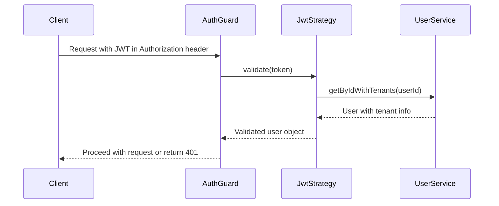

# Exercises Endpoints

<cite>
**Referenced Files in This Document**   
- [exercises.controller.ts](file://apps/server/src/shared/controller/resources/exercises.controller.ts)
- [exercises.service.ts](file://apps/server/src/shared/service/resources/exercises.service.ts)
- [exercises.repository.ts](file://apps/server/src/shared/repository/exercises.repository.ts)
- [exercise.dto.ts](file://packages/dto/src/exercise.dto.ts)
- [create-exercise.dto.ts](file://packages/dto/src/create/create-exercise.dto.ts)
- [update-exercise.dto.ts](file://packages/dto/src/update/update-exercise.dto.ts)
- [query-exercise.dto.ts](file://packages/dto/src/query/query-exercise.dto.ts)
- [exercise.entity.ts](file://packages/entity/src/exercise.entity.ts)
- [auth.guard.ts](file://apps/server/src/shared/guard/auth.guard.ts)
- [response.util.ts](file://apps/server/src/shared/util/response.util.ts)
</cite>

## Table of Contents
1. [Introduction](#introduction)
2. [Authentication and Authorization](#authentication-and-authorization)
3. [Request and Response Structure](#request-and-response-structure)
4. [List Exercises](#list-exercises)
5. [Get Exercise by ID](#get-exercise-by-id)
6. [Create Exercise](#create-exercise)
7. [Update Exercise](#update-exercise)
8. [Delete Exercise](#delete-exercise)
9. [Error Responses](#error-responses)
10. [Examples](#examples)

## Introduction
This document provides comprehensive documentation for the exercise management RESTful API endpoints. The API enables CRUD operations for exercise resources, including listing exercises with pagination and filtering, retrieving specific exercises, creating new exercises, updating existing exercises, and deleting exercises. The endpoints are designed to support exercise management functionality within the application, with proper authentication and authorization controls.

**Section sources**
- [exercises.controller.ts](file://apps/server/src/shared/controller/resources/exercises.controller.ts#L26-L90)

## Authentication and Authorization
All exercise endpoints require authentication via JWT (JSON Web Token). The API implements role-based access control to ensure that only authorized users can perform specific operations on exercise resources. The authentication is enforced through the `AuthGuard` which validates the JWT token provided in the Authorization header.

The authentication mechanism uses a JWT strategy that validates the token payload and retrieves the user information. Upon successful validation, the user context is established for the request. The system also supports role-based guards that can be applied to enforce specific role requirements for certain operations.



**Diagram sources**
- [auth.guard.ts](file://apps/server/src/shared/guard/auth.guard.ts#L1-L13)
- [jwt.strategy.ts](file://apps/server/src/shared/strategy/jwt.strategy.ts#L84-L117)

**Section sources**
- [auth.guard.ts](file://apps/server/src/shared/guard/auth.guard.ts#L1-L13)
- [jwt.strategy.ts](file://apps/server/src/shared/strategy/jwt.strategy.ts#L84-L117)

## Request and Response Structure
The API follows a consistent response structure that wraps the actual data with metadata. The response wrapper includes the data payload, optional metadata (such as pagination information), message, and status code.

### Response Structure
The API responses are wrapped in a standardized format that includes:
- `data`: The actual response data (exercise object or array of exercises)
- `meta`: Optional metadata (e.g., pagination information)
- `message`: A human-readable message about the response
- `status`: HTTP status code

### Request Body Schema
The request body for creating and updating exercises follows the DTO (Data Transfer Object) pattern, ensuring type safety and validation.

**Section sources**
- [response.util.ts](file://apps/server/src/shared/util/response.util.ts#L1-L36)
- [exercise.dto.ts](file://packages/dto/src/exercise.dto.ts#L1-L38)

## List Exercises
Retrieves a paginated list of exercises with optional filtering capabilities.

### Endpoint
```
GET /exercises
```

### Query Parameters
| Parameter | Type | Required | Description |
|---------|------|----------|-------------|
| skip | number | No | Number of records to skip (for pagination) |
| take | number | No | Number of records to take (for pagination, maximum 50) |
| name | string | No | Filter exercises by name |
| description | string | No | Filter exercises by description |
| taskId | string | No | Filter exercises by task ID |
| imageFileId | string | No | Filter exercises by image file ID |
| videoFileId | string | No | Filter exercises by video file ID |
| nameSortOrder | string | No | Sort order for name field (asc/desc) |
| createdAtSortOrder | string | No | Sort order for creation date (asc/desc) |

### Response
Returns a paginated list of exercises with metadata.

```json
{
  "data": [
    {
      "id": "string",
      "createdAt": "string",
      "updatedAt": "string",
      "removedAt": "string",
      "duration": 0,
      "count": 0,
      "taskId": "string",
      "description": "string",
      "imageFileId": "string",
      "videoFileId": "string",
      "name": "string",
      "task": {
        "id": "string",
        "createdAt": "string",
        "updatedAt": "string",
        "removedAt": "string",
        "tenantId": "string",
        "name": "string",
        "description": "string",
        "categoryId": "string",
        "difficultyLevel": 0,
        "videoUrl": "string"
      }
    }
  ],
  "meta": {
    "skip": 0,
    "take": 0,
    "count": 0
  },
  "message": "success"
}
```

**Section sources**
- [exercises.controller.ts](file://apps/server/src/shared/controller/resources/exercises.controller.ts#L31-L43)
- [query-exercise.dto.ts](file://packages/dto/src/query/query-exercise.dto.ts#L1-L4)
- [query.dto.ts](file://packages/dto/src/query/query.dto.ts#L1-L95)

## Get Exercise by ID
Retrieves a specific exercise by its ID.

### Endpoint
```
GET /exercises/:exerciseId
```

### Path Parameters
| Parameter | Type | Required | Description |
|---------|------|----------|-------------|
| exerciseId | string | Yes | The unique identifier of the exercise |

### Response
Returns the exercise details if found.

```json
{
  "data": {
    "id": "string",
    "createdAt": "string",
    "updatedAt": "string",
    "removedAt": "string",
    "duration": 0,
    "count": 0,
    "taskId": "string",
    "description": "string",
    "imageFileId": "string",
    "videoFileId": "string",
    "name": "string",
    "task": {
      "id": "string",
      "createdAt": "string",
      "updatedAt": "string",
      "removedAt": "string",
      "tenantId": "string",
      "name": "string",
      "description": "string",
      "categoryId": "string",
      "difficultyLevel": 0,
      "videoUrl": "string"
    }
  },
  "message": "success"
}
```

**Section sources**
- [exercises.controller.ts](file://apps/server/src/shared/controller/resources/exercises.controller.ts#L53-L59)

## Create Exercise
Creates a new exercise resource.

### Endpoint
```
POST /exercises
```

### Request Body
The request body must include the exercise details. The following fields are supported:

| Field | Type | Required | Description |
|------|------|----------|-------------|
| name | string | Yes | The name of the exercise |
| duration | number | Yes | Duration of the exercise in seconds |
| count | number | Yes | Number of repetitions |
| description | string | No | Description of the exercise |
| imageFileId | string | No | ID of the image file associated with the exercise |
| videoFileId | string | No | ID of the video file associated with the exercise |
| tenantId | string | Yes | ID of the tenant to which the exercise belongs |

```json
{
  "name": "Push-up",
  "duration": 60,
  "count": 10,
  "description": "Standard push-up exercise",
  "imageFileId": "image-123",
  "videoFileId": "video-456",
  "tenantId": "tenant-789"
}
```

### Response
Returns the created exercise object.

```json
{
  "data": {
    "id": "exercise-123",
    "createdAt": "2023-01-01T00:00:00.000Z",
    "updatedAt": "2023-01-01T00:00:00.000Z",
    "removedAt": null,
    "duration": 60,
    "count": 10,
    "taskId": "task-123",
    "description": "Standard push-up exercise",
    "imageFileId": "image-123",
    "videoFileId": "video-456",
    "name": "Push-up"
  },
  "message": "success"
}
```

**Section sources**
- [exercises.controller.ts](file://apps/server/src/shared/controller/resources/exercises.controller.ts#L45-L51)
- [create-exercise.dto.ts](file://packages/dto/src/create/create-exercise.dto.ts#L1-L14)
- [exercises.service.ts](file://apps/server/src/shared/service/resources/exercises.service.ts#L18-L38)

## Update Exercise
Updates an existing exercise resource.

### Endpoint
```
PATCH /exercises/:exerciseId
```

### Path Parameters
| Parameter | Type | Required | Description |
|---------|------|----------|-------------|
| exerciseId | string | Yes | The unique identifier of the exercise to update |

### Request Body
The request body can include any of the following fields to update:

| Field | Type | Required | Description |
|------|------|----------|-------------|
| name | string | No | The name of the exercise |
| duration | number | No | Duration of the exercise in seconds |
| count | number | No | Number of repetitions |
| description | string | No | Description of the exercise |
| imageFileId | string | No | ID of the image file associated with the exercise |
| videoFileId | string | No | ID of the video file associated with the exercise |

```json
{
  "duration": 90,
  "count": 15,
  "description": "Updated description for push-up exercise"
}
```

### Response
Returns the updated exercise object.

```json
{
  "data": {
    "id": "exercise-123",
    "createdAt": "2023-01-01T00:00:00.000Z",
    "updatedAt": "2023-01-02T00:00:00.000Z",
    "removedAt": null,
    "duration": 90,
    "count": 15,
    "taskId": "task-123",
    "description": "Updated description for push-up exercise",
    "imageFileId": "image-123",
    "videoFileId": "video-456",
    "name": "Push-up"
  },
  "message": "success"
}
```

**Section sources**
- [exercises.controller.ts](file://apps/server/src/shared/controller/resources/exercises.controller.ts#L61-L73)
- [update-exercise.dto.ts](file://packages/dto/src/update/update-exercise.dto.ts#L1-L5)
- [exercises.service.ts](file://apps/server/src/shared/service/resources/exercises.service.ts#L56-L65)

## Delete Exercise
Deletes an exercise resource by setting its removedAt timestamp.

### Endpoint
```
PATCH /exercises/:exerciseId/removedAt
```

### Path Parameters
| Parameter | Type | Required | Description |
|---------|------|----------|-------------|
| exerciseId | string | Yes | The unique identifier of the exercise to delete |

### Response
Returns the exercise object with the removedAt timestamp set.

```json
{
  "data": {
    "id": "exercise-123",
    "createdAt": "2023-01-01T00:00:00.000Z",
    "updatedAt": "2023-01-02T00:00:00.000Z",
    "removedAt": "2023-01-02T00:00:00.000Z",
    "duration": 90,
    "count": 15,
    "taskId": "task-123",
    "description": "Updated description for push-up exercise",
    "imageFileId": "image-123",
    "videoFileId": "video-456",
    "name": "Push-up"
  },
  "message": "success"
}
```

**Section sources**
- [exercises.controller.ts](file://apps/server/src/shared/controller/resources/exercises.controller.ts#L75-L81)
- [exercises.service.ts](file://apps/server/src/shared/service/resources/exercises.service.ts#L71-L76)

## Error Responses
The API returns standardized error responses for various error conditions.

### Common Error Codes
| Status Code | Error Type | Description |
|------------|------------|-------------|
| 400 | Bad Request | Invalid request parameters or body |
| 401 | Unauthorized | Missing or invalid authentication token |
| 403 | Forbidden | Insufficient permissions to perform the operation |
| 404 | Not Found | The requested resource was not found |
| 409 | Conflict | Resource conflict (e.g., duplicate entry) |
| 500 | Internal Server Error | Unexpected server error |

### Invalid Category Error (400)
Returned when attempting to create or update an exercise with an invalid category.

```json
{
  "statusCode": 400,
  "message": "Invalid category specified",
  "error": "Bad Request"
}
```

### Resource Conflict Error (409)
Returned when attempting to create an exercise that conflicts with an existing resource.

```json
{
  "statusCode": 409,
  "message": "Exercise with this name already exists",
  "error": "Conflict"
}
```

**Section sources**
- [exercises.service.ts](file://apps/server/src/shared/service/resources/exercises.service.ts#L20-L22)

## Examples
### Curl Example: Search Exercises
```bash
curl -X GET "http://localhost:3000/exercises?skip=0&take=10&name=push&durationSortOrder=desc" \
  -H "Authorization: Bearer <your-jwt-token>"
```

### Curl Example: Retrieve Exercise Details
```bash
curl -X GET "http://localhost:3000/exercises/123e4567-e89b-12d3-a456-426614174000" \
  -H "Authorization: Bearer <your-jwt-token>"
```

### JSON Example: Creating an Exercise with Media References
```json
{
  "name": "Squat",
  "duration": 120,
  "count": 12,
  "description": "Bodyweight squat exercise",
  "imageFileId": "img-8888-4444-2222",
  "videoFileId": "vid-9999-5555-3333",
  "tenantId": "tenant-1111-7777-6666"
}
```

### JSON Example: Updating Exercise Difficulty
```json
{
  "duration": 180,
  "count": 15,
  "description": "Advanced squat exercise with increased duration and count"
}
```

**Section sources**
- [exercises.controller.ts](file://apps/server/src/shared/controller/resources/exercises.controller.ts#L31-L90)
- [create-exercise.dto.ts](file://packages/dto/src/create/create-exercise.dto.ts#L1-L14)
- [update-exercise.dto.ts](file://packages/dto/src/update/update-exercise.dto.ts#L1-L5)