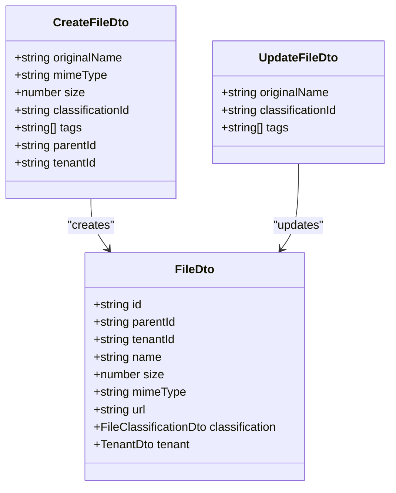
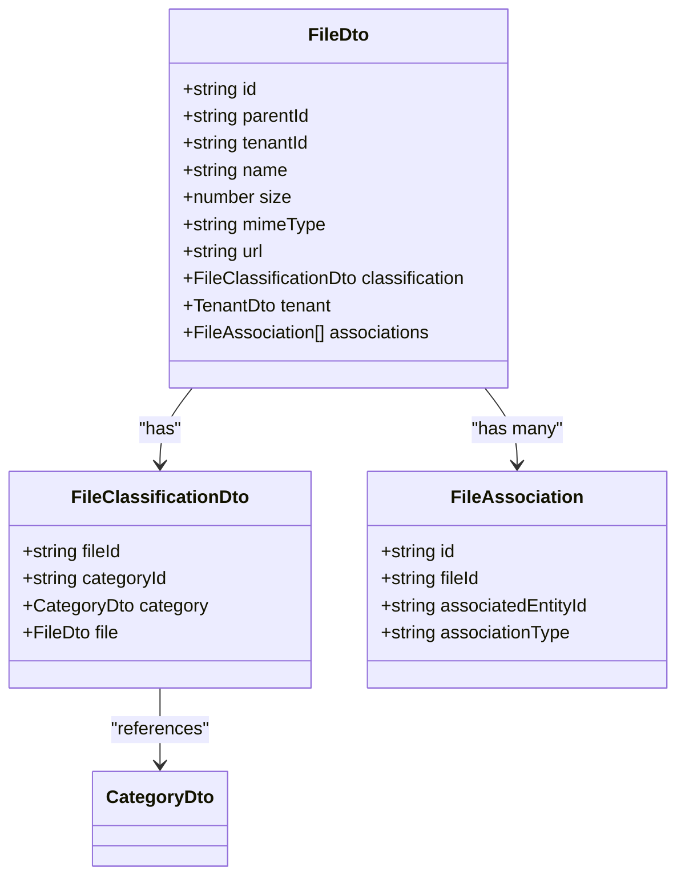
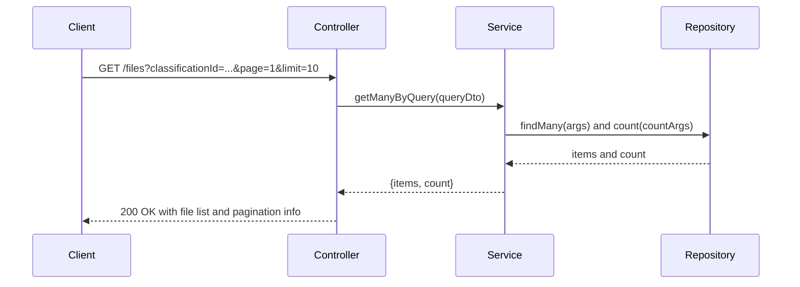
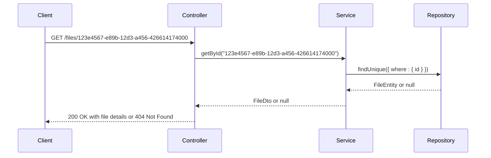
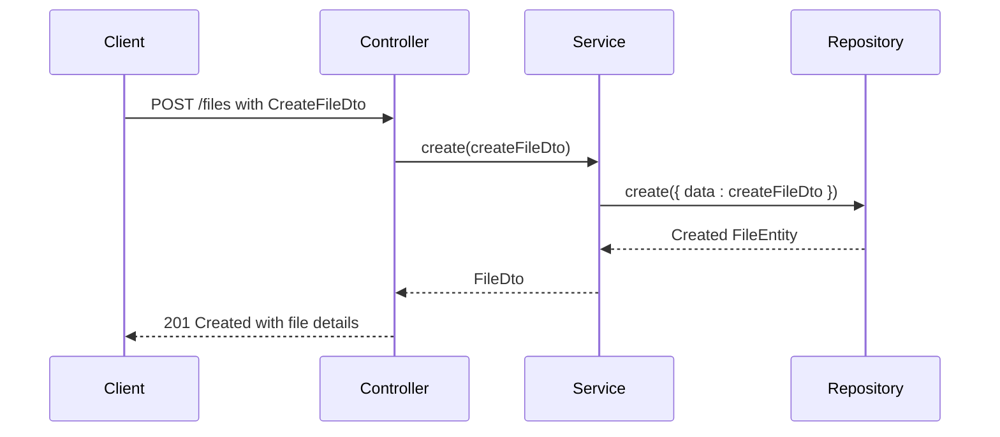
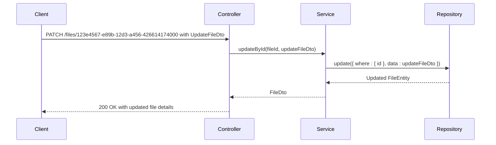
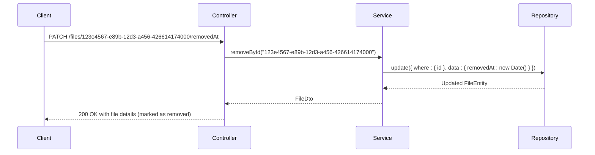

# Files Endpoints

<cite>
**Referenced Files in This Document**   
- [files.controller.ts](file://apps/server/src/shared/controller/resources/files.controller.ts)
- [files.service.ts](file://apps/server/src/shared/service/resources/files.service.ts)
- [file.dto.ts](file://packages/dto/src/file.dto.ts)
- [create-file.dto.ts](file://packages/dto/src/create/create-file.dto.ts)
- [update-file.dto.ts](file://packages/dto/src/update/update-file.dto.ts)
- [query-file.dto.ts](file://packages/dto/src/query/query-file.dto.ts)
- [file.entity.ts](file://packages/entity/src/file.entity.ts)
- [file-classification.dto.ts](file://packages/dto/src/file-classification.dto.ts)
</cite>

## Table of Contents
1. [Introduction](#introduction)
2. [Authentication and Authorization](#authentication-and-authorization)
3. [Request Schema](#request-schema)
4. [Response Structure](#response-structure)
5. [Endpoints](#endpoints)
   - [GET /files](#get-files)
   - [GET /files/:id](#get-filesid)
   - [POST /files](#post-files)
   - [PATCH /files/:id](#patch-filesid)
   - [DELETE /files/:id](#delete-filesid)
6. [Error Handling](#error-handling)
7. [Examples](#examples)
   - [JSON Example: Upload Video File](#json-example-upload-video-file)
   - [JSON Example: Update File Tags](#json-example-update-file-tags)
   - [cURL Example: File Upload](#curl-example-file-upload)
   - [cURL Example: File Retrieval](#curl-example-file-retrieval)

## Introduction

This document provides comprehensive documentation for the file management RESTful API endpoints. The API enables clients to perform CRUD operations on files, including listing files with advanced filtering and pagination, retrieving individual files, uploading new files with metadata, updating file metadata, and deleting files. The system supports file classification, access controls, and metadata management.

**Section sources**
- [files.controller.ts](file://apps/server/src/shared/controller/resources/files.controller.ts#L1-L67)
- [files.service.ts](file://apps/server/src/shared/service/resources/files.service.ts#L1-L52)

## Authentication and Authorization

All file management endpoints require authentication. Users must include a valid JWT token in the Authorization header to access any file-related operations. The system implements role-based access control (RBAC) to determine permissions for file operations. Access restrictions are enforced based on user roles and tenant associations. Users can only access files within their authorized scope, and attempts to access restricted resources will result in a 403 Forbidden response.

**Section sources**
- [files.controller.ts](file://apps/server/src/shared/controller/resources/files.controller.ts#L1-L67)
- [files.service.ts](file://apps/server/src/shared/service/resources/files.service.ts#L1-L52)

## Request Schema

The file management API uses standardized request schemas for creating and updating files. The core properties include:

- **originalName**: string - The original name of the file
- **mimeType**: string - The MIME type of the file (e.g., "video/mp4", "image/jpeg")
- **size**: number - The file size in bytes
- **classificationId**: string (UUID) - Identifier for the file classification/category
- **tags**: array of strings - Optional tags for file categorization and search
- **access controls**: Governed by tenantId and user permissions

The CreateFileDto and UpdateFileDto classes define the structure for file creation and modification operations, ensuring data consistency and validation.



**Diagram sources**
- [create-file.dto.ts](file://packages/dto/src/create/create-file.dto.ts)
- [update-file.dto.ts](file://packages/dto/src/update/update-file.dto.ts)
- [file.dto.ts](file://packages/dto/src/file.dto.ts)

**Section sources**
- [create-file.dto.ts](file://packages/dto/src/create/create-file.dto.ts)
- [update-file.dto.ts](file://packages/dto/src/update/update-file.dto.ts)
- [file.dto.ts](file://packages/dto/src/file.dto.ts)

## Response Structure

The API returns standardized responses for file operations. The FileDto class defines the response structure, which includes:

- **id**: string (UUID) - Unique identifier for the file
- **parentId**: string (UUID) - Identifier of the parent entity
- **tenantId**: string (UUID) - Identifier of the associated tenant
- **name**: string - File name
- **size**: number - File size in bytes
- **mimeType**: string - MIME type of the file
- **url**: string - Download URL for the file
- **classification**: FileClassificationDto - Classification information including category
- **tenant**: TenantDto - Associated tenant information
- **associations**: Array of FileAssociation - Additional file relationships

For list operations, the response includes pagination metadata with the total count of items and the current page of items.



**Diagram sources**
- [file.dto.ts](file://packages/dto/src/file.dto.ts#L1-L40)
- [file-classification.dto.ts](file://packages/dto/src/file-classification.dto.ts#L1-L21)
- [file-association.dto.ts](file://packages/dto/src/file-association.dto.ts)

**Section sources**
- [file.dto.ts](file://packages/dto/src/file.dto.ts#L1-L40)
- [file.entity.ts](file://packages/entity/src/file.entity.ts#L1-L12)

## Endpoints

### GET /files

Retrieves a paginated list of files with optional filtering capabilities.

**Query Parameters:**
- **classificationId**: Filter files by classification/category ID
- **fileType**: Filter by file type/mime type
- **startDate** and **endDate**: Filter by date range (created between dates)
- **search**: Text search on file names
- **page**: Page number for pagination (default: 1)
- **limit**: Number of items per page (default: 10)
- **sort**: Sort field and order (e.g., "name:asc", "createdAt:desc")



**Diagram sources**
- [files.controller.ts](file://apps/server/src/shared/controller/resources/files.controller.ts#L1-L67)
- [files.service.ts](file://apps/server/src/shared/service/resources/files.service.ts#L18-L28)
- [query-file.dto.ts](file://packages/dto/src/query/query-file.dto.ts)

**Section sources**
- [files.controller.ts](file://apps/server/src/shared/controller/resources/files.controller.ts#L1-L67)
- [files.service.ts](file://apps/server/src/shared/service/resources/files.service.ts#L18-L28)
- [query-file.dto.ts](file://packages/dto/src/query/query-file.dto.ts)

### GET /files/:id

Retrieves a specific file by its ID.

**Path Parameters:**
- **fileId**: The unique identifier of the file (UUID)

**Response:** Returns a 200 OK with the FileDto object if found, or 404 Not Found if the file does not exist.



**Diagram sources**
- [files.controller.ts](file://apps/server/src/shared/controller/resources/files.controller.ts#L21-L27)
- [files.service.ts](file://apps/server/src/shared/service/resources/files.service.ts#L30-L32)

**Section sources**
- [files.controller.ts](file://apps/server/src/shared/controller/resources/files.controller.ts#L21-L27)
- [files.service.ts](file://apps/server/src/shared/service/resources/files.service.ts#L30-L32)

### POST /files

Uploads a new file with associated metadata.

**Request Body:** CreateFileDto containing file metadata.

**Response:** Returns a 201 Created with the created FileDto object.



**Diagram sources**
- [files.controller.ts](file://apps/server/src/shared/controller/resources/files.controller.ts#L29-L36)
- [files.service.ts](file://apps/server/src/shared/service/resources/files.service.ts#L10-L16)
- [create-file.dto.ts](file://packages/dto/src/create/create-file.dto.ts)

**Section sources**
- [files.controller.ts](file://apps/server/src/shared/controller/resources/files.controller.ts#L29-L36)
- [create-file.dto.ts](file://packages/dto/src/create/create-file.dto.ts)

### PATCH /files/:id

Updates metadata for an existing file.

**Path Parameters:**
- **fileId**: The unique identifier of the file (UUID)

**Request Body:** UpdateFileDto containing the fields to update.

**Response:** Returns a 200 OK with the updated FileDto object.



**Diagram sources**
- [files.controller.ts](file://apps/server/src/shared/controller/resources/files.controller.ts#L47-L65)
- [files.service.ts](file://apps/server/src/shared/service/resources/files.service.ts#L34-L39)
- [update-file.dto.ts](file://packages/dto/src/update/update-file.dto.ts)

**Section sources**
- [files.controller.ts](file://apps/server/src/shared/controller/resources/files.controller.ts#L47-L65)
- [update-file.dto.ts](file://packages/dto/src/update/update-file.dto.ts)

### DELETE /files/:id

Marks a file as deleted by setting the removedAt timestamp (soft delete).

**Path Parameters:**
- **fileId**: The unique identifier of the file (UUID)

**Response:** Returns a 200 OK with the updated FileDto object that includes the removedAt timestamp.



**Diagram sources**
- [files.controller.ts](file://apps/server/src/shared/controller/resources/files.controller.ts#L38-L45)
- [files.service.ts](file://apps/server/src/shared/service/resources/files.service.ts#L45-L50)

**Section sources**
- [files.controller.ts](file://apps/server/src/shared/controller/resources/files.controller.ts#L38-L45)
- [files.service.ts](file://apps/server/src/shared/service/resources/files.service.ts#L45-L50)

## Error Handling

The API implements standardized error responses for various failure scenarios:

- **400 Bad Request**: Invalid request parameters or body (e.g., invalid file type, malformed JSON)
- **403 Forbidden**: Authentication successful but insufficient permissions to perform the operation
- **404 Not Found**: Requested file does not exist
- **413 Payload Too Large**: File size exceeds the maximum allowed limit
- **500 Internal Server Error**: Unexpected server error during processing

Error responses follow the ResponseEntity structure with appropriate status codes, error messages, and optional metadata for debugging.

**Section sources**
- [files.controller.ts](file://apps/server/src/shared/controller/resources/files.controller.ts#L1-L67)
- [files.service.ts](file://apps/server/src/shared/service/resources/files.service.ts#L1-L52)

## Examples

### JSON Example: Upload Video File

```json
{
  "originalName": "training-video.mp4",
  "mimeType": "video/mp4",
  "size": 15728640,
  "classificationId": "c3a5b6e0-4d7c-4fbc-b5f7-2f8c9f7a3d1e",
  "tags": ["training", "video", "q4"],
  "parentId": "a1b2c3d4-e5f6-7890-g1h2-i3j4k5l6m7n8",
  "tenantId": "t1u2v3w4-x5y6-7890-z1a2-b3c4d5e6f7g8"
}
```

**Section sources**
- [create-file.dto.ts](file://packages/dto/src/create/create-file.dto.ts)

### JSON Example: Update File Tags

```json
{
  "tags": ["training", "video", "q4", "edited"]
}
```

**Section sources**
- [update-file.dto.ts](file://packages/dto/src/update/update-file.dto.ts)

### cURL Example: File Upload

```bash
curl -X POST https://api.example.com/files \
  -H "Authorization: Bearer <your-jwt-token>" \
  -H "Content-Type: application/json" \
  -d '{
    "originalName": "training-video.mp4",
    "mimeType": "video/mp4",
    "size": 15728640,
    "classificationId": "c3a5b6e0-4d7c-4fbc-b5f7-2f8c9f7a3d1e",
    "tags": ["training", "video", "q4"]
  }'
```

**Section sources**
- [files.controller.ts](file://apps/server/src/shared/controller/resources/files.controller.ts#L29-L36)

### cURL Example: File Retrieval

```bash
curl -X GET https://api.example.com/files/123e4567-e89b-12d3-a456-426614174000 \
  -H "Authorization: Bearer <your-jwt-token>"
```

**Section sources**
- [files.controller.ts](file://apps/server/src/shared/controller/resources/files.controller.ts#L21-L27)