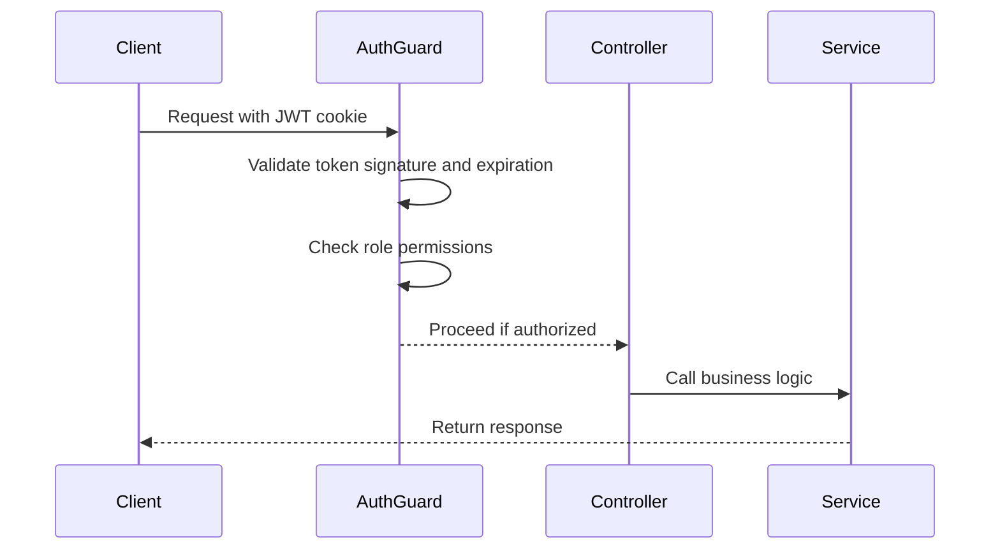

# Programs Endpoints

<cite>
**Referenced Files in This Document**   
- [programs.controller.ts](file://apps/server/src/shared/controller/resources/programs.controller.ts)
- [programs.service.ts](file://apps/server/src/shared/service/resources/programs.service.ts)
- [programs.repository.ts](file://apps/server/src/shared/repository/programs.repository.ts)
- [program.dto.ts](file://packages/schema/src/dto/program.dto.ts)
- [create-program.dto.ts](file://packages/schema/src/dto/create/create-program.dto.ts)
- [update-program.dto.ts](file://packages/schema/src/dto/update/update-program.dto.ts)
- [query-program.dto.ts](file://packages/schema/src/dto/query/query-program.dto.ts)
- [auth.guard.ts](file://apps/server/src/shared/guard/auth.guard.ts)
</cite>

## Table of Contents
1. [Introduction](#introduction)
2. [Authentication and Authorization](#authentication-and-authorization)
3. [Endpoint Overview](#endpoint-overview)
4. [Request and Response Structure](#request-and-response-structure)
5. [Endpoint Details](#endpoint-details)
6. [Error Responses](#error-responses)
7. [Usage Examples](#usage-examples)

## Introduction
This document provides comprehensive documentation for the RESTful API endpoints that manage programs within the system. The program management API enables CRUD operations for program entities, which represent scheduled activities or sessions with specific routines, instructors, and capacity limits. The endpoints support pagination, filtering, and proper authentication via JWT tokens.

**Section sources**
- [programs.controller.ts](file://apps/server/src/shared/controller/resources/programs.controller.ts#L1-L89)

## Authentication and Authorization
All program management endpoints require JWT-based authentication using cookie-based token transmission. The system implements role-based access control to ensure proper authorization.

- **Authentication**: JWT tokens are required and transmitted via cookies
- **Authorization**: Access is controlled by role categories and groups
- **Public Access**: No program endpoints are publicly accessible
- **Required Roles**: Users must have appropriate role permissions to access endpoints

The API uses a custom `AuthGuard` that checks for valid JWT tokens and enforces role-based access policies.



**Diagram sources**
- [auth.guard.ts](file://apps/server/src/shared/guard/auth.guard.ts#L1-L13)
- [programs.controller.ts](file://apps/server/src/shared/controller/resources/programs.controller.ts#L26-L28)

## Endpoint Overview
The program management API provides the following endpoints:

| Method | Endpoint | Description |
|--------|---------|-------------|
| POST | `/api/v1/programs` | Create a new program |
| GET | `/api/v1/programs` | List programs with pagination and filtering |
| GET | `/api/v1/programs/:id` | Retrieve a specific program by ID |
| PATCH | `/api/v1/programs/:id` | Update program details |
| PATCH | `/api/v1/programs/:id/removedAt` | Soft delete a program |
| DELETE | `/api/v1/programs/:id` | Hard delete a program |

**Section sources**
- [programs.controller.ts](file://apps/server/src/shared/controller/resources/programs.controller.ts#L31-L88)

## Request and Response Structure
### Request Body Schema
When creating or updating programs, the request body should include the following fields:

| Field | Type | Required | Description |
|-------|------|----------|-------------|
| name | string | Yes | Program name |
| capacity | number | Yes | Maximum number of participants |
| routineId | string (UUID) | Yes | Associated routine ID |
| sessionId | string (UUID) | Yes | Associated session ID |
| instructorId | string (UUID) | Yes | Instructor ID |
| level | string | No | Difficulty level (e.g., beginner, intermediate, advanced) |

### Response Structure
All successful responses follow a consistent wrapper pattern:

```json
{
  "data": { /* program data */ },
  "meta": {
    "skip": 0,
    "take": 10,
    "itemCount": 5,
    "pageCount": 1,
    "hasNextPage": false,
    "hasPreviousPage": false
  },
  "message": "success",
  "status": 200
}
```

The `data` field contains the program information, while `meta` provides pagination details for list responses.

**Section sources**
- [program.dto.ts](file://packages/schema/src/dto/program.dto.ts#L13-L37)
- [response.util.ts](file://apps/server/src/shared/util/response.util.ts#L1-L36)

## Endpoint Details
### GET /programs
Retrieve a paginated list of programs with optional filtering.

**Query Parameters**
| Parameter | Type | Required | Default | Description |
|-----------|------|----------|---------|-------------|
| skip | number | No | 0 | Number of items to skip |
| take | number | No | 10 | Number of items to take |

**Response**
- Status: 200 OK
- Content-Type: application/json
- Body: Array of program objects with pagination metadata

**Section sources**
- [programs.controller.ts](file://apps/server/src/shared/controller/resources/programs.controller.ts#L75-L88)
- [query-program.dto.ts](file://packages/schema/src/dto/query/query-program.dto.ts#L1-L3)

### GET /programs/:id
Retrieve a specific program by its ID.

**Path Parameters**
| Parameter | Type | Description |
|-----------|------|-------------|
| id | string (UUID) | The program ID |

**Response**
- Status: 200 OK
- Content-Type: application/json
- Body: Single program object

**Section sources**
- [programs.controller.ts](file://apps/server/src/shared/controller/resources/programs.controller.ts#L40-L46)

### POST /programs
Create a new program.

**Request Body**
```json
{
  "name": "Yoga Class",
  "capacity": 15,
  "routineId": "uuid-of-routine",
  "sessionId": "uuid-of-session",
  "instructorId": "uuid-of-instructor",
  "level": "beginner"
}
```

**Response**
- Status: 200 OK
- Content-Type: application/json
- Body: Created program object

**Section sources**
- [programs.controller.ts](file://apps/server/src/shared/controller/resources/programs.controller.ts#L31-L38)
- [create-program.dto.ts](file://packages/schema/src/dto/create/create-program.dto.ts)

### PATCH /programs/:id
Update an existing program's details.

**Path Parameters**
| Parameter | Type | Description |
|-----------|------|-------------|
| id | string (UUID) | The program ID |

**Request Body**
Partial program object with fields to update.

**Response**
- Status: 200 OK
- Content-Type: application/json
- Body: Updated program object

**Section sources**
- [programs.controller.ts](file://apps/server/src/shared/controller/resources/programs.controller.ts#L48-L57)
- [update-program.dto.ts](file://packages/schema/src/dto/update/update-program.dto.ts)

### DELETE /programs/:id
Permanently remove a program from the system.

**Path Parameters**
| Parameter | Type | Description |
|-----------|------|-------------|
| id | string (UUID) | The program ID |

**Response**
- Status: 200 OK
- Content-Type: application/json
- Body: Deleted program object

**Section sources**
- [programs.controller.ts](file://apps/server/src/shared/controller/resources/programs.controller.ts#L67-L73)

## Error Responses
The API returns standardized error responses for various failure scenarios:

| Status Code | Error Type | Description | Example Response |
|-------------|------------|-------------|------------------|
| 400 | Bad Request | Invalid request parameters or body | `{ "message": "Invalid input data", "status": 400 }` |
| 401 | Unauthorized | Missing or invalid authentication token | `{ "message": "Authentication required", "status": 401 }` |
| 403 | Forbidden | Insufficient permissions to access resource | `{ "message": "Insufficient permissions", "status": 403 }` |
| 404 | Not Found | Program with specified ID does not exist | `{ "message": "Program not found", "status": 404 }` |
| 500 | Internal Server Error | Unexpected server error | `{ "message": "Internal server error", "status": 500 }` |

Specific validation errors may include details about which fields failed validation.

**Section sources**
- [programs.controller.ts](file://apps/server/src/shared/controller/resources/programs.controller.ts#L33-L34)
- [programs.service.ts](file://apps/server/src/shared/service/resources/programs.service.ts#L34-L36)

## Usage Examples
### List Programs with Pagination
```bash
curl -X GET "https://api.example.com/api/v1/programs?skip=0&take=10" \
  -H "Cookie: accessToken=your-jwt-token-here" \
  -H "Content-Type: application/json"
```

### Create a New Program
```bash
curl -X POST "https://api.example.com/api/v1/programs" \
  -H "Cookie: accessToken=your-jwt-token-here" \
  -H "Content-Type: application/json" \
  -d '{
    "name": "Morning Yoga",
    "capacity": 12,
    "routineId": "550e8400-e29b-41d4-a716-446655440000",
    "sessionId": "6ba7b810-9dad-11d1-80b4-00c04fd430c8",
    "instructorId": "f47ac10b-58cc-4372-a567-0e02b2c3d479",
    "level": "beginner"
  }'
```

### Retrieve a Specific Program
```bash
curl -X GET "https://api.example.com/api/v1/programs/550e8400-e29b-41d4-a716-446655440000" \
  -H "Cookie: accessToken=your-jwt-token-here" \
  -H "Content-Type: application/json"
```

**Section sources**
- [programs.controller.ts](file://apps/server/src/shared/controller/resources/programs.controller.ts)
- [programs.service.ts](file://apps/server/src/shared/service/resources/programs.service.ts)