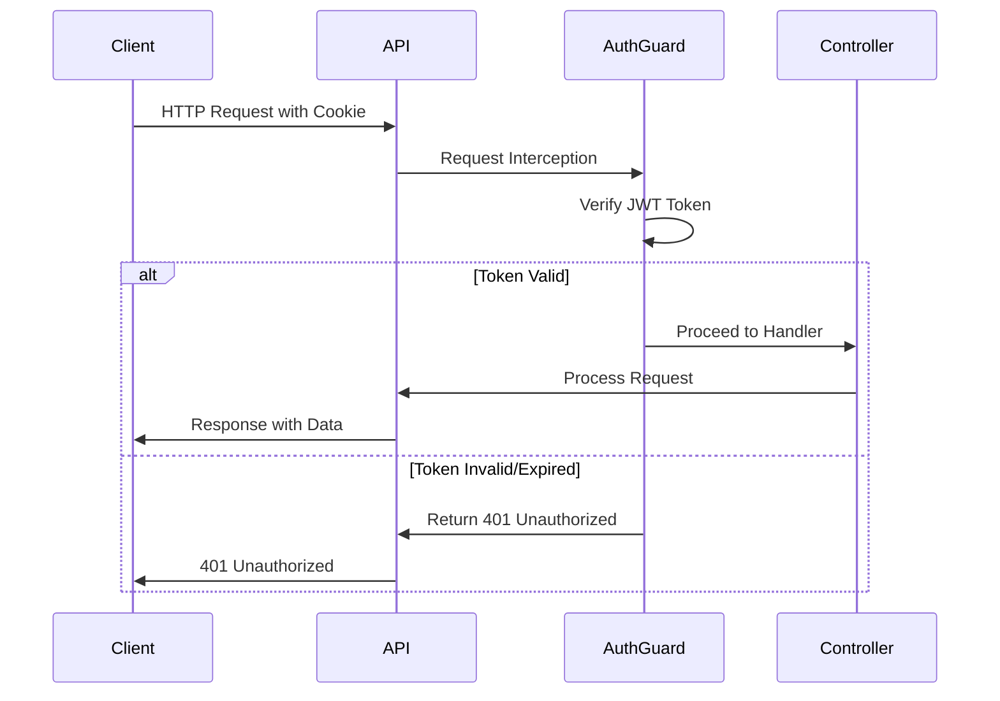

# Resource Endpoints

<cite>
**Referenced Files in This Document**   
- [main.ts](file://apps/server/src/main.ts)
- [setNestApp.ts](file://apps/server/src/setNestApp.ts)
- [users.module.ts](file://apps/server/src/module/users.module.ts)
- [tenants.module.ts](file://apps/server/src/module/tenants.module.ts)
- [programs.module.ts](file://apps/server/src/module/programs.module.ts)
- [routines.module.ts](file://apps/server/src/module/routines.module.ts)
- [exercises.module.ts](file://apps/server/src/module/exercises.module.ts)
- [sessions.module.ts](file://apps/server/src/module/sessions.module.ts)
- [spaces.module.ts](file://apps/server/src/module/spaces.module.ts)
- [files.module.ts](file://apps/server/src/module/files.module.ts)
- [categories.module.ts](file://apps/server/src/module/categories.module.ts)
- [roles.module.ts](file://apps/server/src/module/roles.module.ts)
</cite>

## Table of Contents
1. [Introduction](#introduction)
2. [Authentication and Authorization](#authentication-and-authorization)
3. [Response Structure](#response-structure)
4. [Users](#users)
5. [Tenants](#tenants)
6. [Programs](#programs)
7. [Routines](#routines)
8. [Exercises](#exercises)
9. [Sessions](#sessions)
10. [Spaces](#spaces)
11. [Files](#files)
12. [Categories](#categories)
13. [Roles](#roles)
14. [Error Handling](#error-handling)
15. [Examples](#examples)

## Introduction

This document provides comprehensive documentation for all resource management endpoints in the prj-core application. The API follows RESTful principles and provides standard CRUD operations for managing users, tenants, programs, routines, exercises, sessions, spaces, files, categories, roles, and associated entities.

The API is built using NestJS and exposes endpoints through controllers registered in dedicated modules for each resource type. All endpoints follow a consistent pattern for request/response handling, authentication, and error management.

**Section sources**
- [main.ts](file://apps/server/src/main.ts#L1-L88)
- [setNestApp.ts](file://apps/server/src/setNestApp.ts#L1-L49)

## Authentication and Authorization

All API endpoints require authentication via JWT tokens, which are transmitted through HttpOnly cookies. The only exceptions are explicitly marked public endpoints (e.g., login, registration).

Authentication is enforced globally through the `JwtAuthGuard` configured in the `setNestApp` function, which is applied to all routes by default.

Role-based permissions are implemented using custom decorators from the shared decorator library. These decorators control access to specific endpoints based on user roles and permissions. The system supports fine-grained access control for different user types and tenant contexts.



**Diagram sources**
- [main.ts](file://apps/server/src/main.ts#L58-L64)
- [setNestApp.ts](file://apps/server/src/setNestApp.ts#L38)

**Section sources**
- [setNestApp.ts](file://apps/server/src/setNestApp.ts#L38)

## Response Structure

All API responses are wrapped in a standardized `ResponseEntity` structure that provides consistent formatting across all endpoints. This wrapper includes data, metadata, and status information.

```json
{
  "data": {},
  "meta": {
    "status": "success",
    "message": "Operation completed successfully",
    "timestamp": "2025-01-01T00:00:00.000Z"
  },
  "status": 200
}
```

The response entity interceptor automatically wraps all successful responses, while exception filters handle error responses in a consistent format. Metadata includes operation status, descriptive messages, and timestamps for audit purposes.

**Section sources**
- [setNestApp.ts](file://apps/server/src/setNestApp.ts#L45)
- [main.ts](file://apps/server/src/main.ts#L55-L57)

## Users

The Users API provides comprehensive management capabilities for user accounts within the system. All endpoints are secured with JWT authentication and appropriate role-based access controls.

### Endpoints

#### GET /users
Retrieves a paginated list of users with optional filtering and sorting.

- **Method**: GET
- **URL**: `/users`
- **Authentication**: Required
- **Parameters**:
  - `page`: Page number (default: 1)
  - `limit`: Items per page (default: 10)
  - `sortBy`: Field to sort by
  - `sortOrder`: Sort direction (ASC/DESC)
  - `search`: Text search query
- **Response**: 200 OK with paginated user data

#### GET /users/:id
Retrieves a specific user by ID.

- **Method**: GET
- **URL**: `/users/:id`
- **Authentication**: Required
- **Response**: 200 OK with user data or 404 Not Found

#### POST /users
Creates a new user account.

- **Method**: POST
- **URL**: `/users`
- **Authentication**: Required (admin role)
- **Request Body**: User creation DTO
- **Validation**: Email uniqueness, password strength
- **Response**: 201 Created with user data

#### PATCH /users/:id
Updates an existing user's profile.

- **Method**: PATCH
- **URL**: `/users/:id`
- **Authentication**: Required (user or admin)
- **Request Body**: Partial user update DTO
- **Response**: 200 OK with updated user data

#### DELETE /users/:id
Deletes a user account.

- **Method**: DELETE
- **URL**: `/users/:id`
- **Authentication**: Required (admin role)
- **Response**: 200 OK with deletion confirmation

**Section sources**
- [users.module.ts](file://apps/server/src/module/users.module.ts#L1-L9)

## Tenants

The Tenants API manages organizational tenants within the multi-tenancy system. Each tenant represents a separate organization or business unit with isolated data.

### Endpoints

#### GET /tenants
Lists all available tenants with pagination support.

- **Method**: GET
- **URL**: `/tenants`
- **Authentication**: Required
- **Parameters**: Standard pagination and filtering parameters
- **Response**: 200 OK with tenant list

#### GET /tenants/:id
Retrieves detailed information about a specific tenant.

- **Method**: GET
- **URL**: `/tenants/:id`
- **Authentication**: Required
- **Response**: 200 OK with tenant data or 404 Not Found

#### POST /tenants
Creates a new tenant organization.

- **Method**: POST
- **URL**: `/tenants`
- **Authentication**: Required (super admin)
- **Request Body**: Tenant creation DTO
- **Validation**: Unique tenant name, valid domain
- **Response**: 201 Created with tenant data

#### PATCH /tenants/:id
Updates tenant configuration and settings.

- **Method**: PATCH
- **URL**: `/tenants/:id`
- **Authentication**: Required (tenant admin or super admin)
- **Request Body**: Tenant update DTO
- **Response**: 200 OK with updated tenant data

#### DELETE /tenants/:id
Removes a tenant from the system.

- **Method**: DELETE
- **URL**: `/tenants/:id`
- **Authentication**: Required (super admin)
- **Response**: 200 OK with deletion status

**Section sources**
- [tenants.module.ts](file://apps/server/src/module/tenants.module.ts#L1-L14)

## Programs

The Programs API manages structured programs that contain routines, exercises, and sessions. Programs represent comprehensive fitness or training plans.

### Endpoints

#### GET /programs
Retrieves a list of available programs with filtering options.

- **Method**: GET
- **URL**: `/programs`
- **Authentication**: Required
- **Parameters**: Pagination, sorting, category filtering
- **Response**: 200 OK with program list

#### GET /programs/:id
Gets detailed information about a specific program.

- **Method**: GET
- **URL**: `/programs/:id`
- **Authentication**: Required
- **Response**: 200 OK with program details or 404 Not Found

#### POST /programs
Creates a new program with initial configuration.

- **Method**: POST
- **URL**: `/programs`
- **Authentication**: Required (content manager or admin)
- **Request Body**: Program creation DTO
- **Validation**: Required fields, valid relationships
- **Response**: 201 Created with program data

#### PATCH /programs/:id
Updates an existing program's details.

- **Method**: PATCH
- **URL**: `/programs/:id`
- **Authentication**: Required (program owner or admin)
- **Request Body**: Program update DTO
- **Response**: 200 OK with updated program data

#### DELETE /programs/:id
Deletes a program and its associated content.

- **Method**: DELETE
- **URL**: `/programs/:id`
- **Authentication**: Required (program owner or admin)
- **Response**: 200 OK with deletion confirmation

**Section sources**
- [programs.module.ts](file://apps/server/src/module/programs.module.ts#L1-L13)

## Routines

The Routines API manages exercise routines that are composed of multiple exercises and form the building blocks of programs.

### Endpoints

#### GET /routines
Lists all available routines with filtering capabilities.

- **Method**: GET
- **URL**: `/routines`
- **Authentication**: Required
- **Parameters**: Pagination, sorting, difficulty level
- **Response**: 200 OK with routine list

#### GET /routines/:id
Retrieves detailed information about a specific routine.

- **Method**: GET
- **URL**: `/routines/:id`
- **Authentication**: Required
- **Response**: 200 OK with routine details or 404 Not Found

#### POST /routines
Creates a new routine with specified exercises.

- **Method**: POST
- **URL**: `/routines`
- **Authentication**: Required (content creator or admin)
- **Request Body**: Routine creation DTO
- **Validation**: At least one exercise, valid sequence
- **Response**: 201 Created with routine data

#### PATCH /routines/:id
Updates an existing routine's composition.

- **Method**: PATCH
- **URL**: `/routines/:id`
- **Authentication**: Required (routine owner or admin)
- **Request Body**: Routine update DTO
- **Response**: 200 OK with updated routine data

#### DELETE /routines/:id
Removes a routine from the system.

- **Method**: DELETE
- **URL**: `/routines/:id`
- **Authentication**: Required (routine owner or admin)
- **Response**: 200 OK with deletion status

**Section sources**
- [routines.module.ts](file://apps/server/src/module/routines.module.ts#L1-L13)

## Exercises

The Exercises API manages individual exercise definitions including form, technique, and performance metrics.

### Endpoints

#### GET /exercises
Retrieves a list of all available exercises.

- **Method**: GET
- **URL**: `/exercises`
- **Authentication**: Required
- **Parameters**: Pagination, sorting, muscle group filtering
- **Response**: 200 OK with exercise list

#### GET /exercises/:id
Gets detailed information about a specific exercise.

- **Method**: GET
- **URL**: `/exercises/:id`
- **Authentication**: Required
- **Response**: 200 OK with exercise details or 404 Not Found

#### POST /exercises
Creates a new exercise definition.

- **Method**: POST
- **URL**: `/exercises`
- **Authentication**: Required (exercise specialist or admin)
- **Request Body**: Exercise creation DTO
- **Validation**: Required fields, valid equipment references
- **Response**: 201 Created with exercise data

#### PATCH /exercises/:id
Updates an existing exercise's details.

- **Method**: PATCH
- **URL**: `/exercises/:id`
- **Authentication**: Required (exercise owner or admin)
- **Request Body**: Exercise update DTO
- **Response**: 200 OK with updated exercise data

#### DELETE /exercises/:id
Removes an exercise from the system.

- **Method**: DELETE
- **URL**: `/exercises/:id`
- **Authentication**: Required (exercise owner or admin)
- **Response**: 200 OK with deletion confirmation

**Section sources**
- [exercises.module.ts](file://apps/server/src/module/exercises.module.ts#L1-L14)

## Sessions

The Sessions API manages workout sessions that track user performance and progress over time.

### Endpoints

#### GET /sessions
Lists all workout sessions with filtering options.

- **Method**: GET
- **URL**: `/sessions`
- **Authentication**: Required
- **Parameters**: Pagination, date range, program filtering
- **Response**: 200 OK with session list

#### GET /sessions/:id
Retrieves detailed information about a specific session.

- **Method**: GET
- **URL**: `/sessions/:id`
- **Authentication**: Required
- **Response**: 200 OK with session details or 404 Not Found

#### POST /sessions
Records a new workout session.

- **Method**: POST
- **URL**: `/sessions`
- **Authentication**: Required
- **Request Body**: Session creation DTO
- **Validation**: Valid program reference, completed exercises
- **Response**: 201 Created with session data

#### PATCH /sessions/:id
Updates session details or performance metrics.

- **Method**: PATCH
- **URL**: `/sessions/:id`
- **Authentication**: Required (session owner or coach)
- **Request Body**: Session update DTO
- **Response**: 200 OK with updated session data

#### DELETE /sessions/:id
Removes a session record.

- **Method**: DELETE
- **URL**: `/sessions/:id`
- **Authentication**: Required (session owner or admin)
- **Response**: 200 OK with deletion status

**Section sources**
- [sessions.module.ts](file://apps/server/src/module/sessions.module.ts#L1-L13)

## Spaces

The Spaces API manages physical or virtual spaces where workouts and programs are conducted.

### Endpoints

#### GET /spaces
Retrieves a list of available spaces.

- **Method**: GET
- **URL**: `/spaces`
- **Authentication**: Required
- **Parameters**: Pagination, location filtering, capacity
- **Response**: 200 OK with space list

#### GET /spaces/:id
Gets detailed information about a specific space.

- **Method**: GET
- **URL**: `/spaces/:id`
- **Authentication**: Required
- **Response**: 200 OK with space details or 404 Not Found

#### POST /spaces
Creates a new space definition.

- **Method**: POST
- **URL**: `/spaces`
- **Authentication**: Required (facility manager or admin)
- **Request Body**: Space creation DTO
- **Validation**: Unique name, valid capacity
- **Response**: 201 Created with space data

#### PATCH /spaces/:id
Updates space configuration and availability.

- **Method**: PATCH
- **URL**: `/spaces/:id`
- **Authentication**: Required (space manager or admin)
- **Request Body**: Space update DTO
- **Response**: 200 OK with updated space data

#### DELETE /spaces/:id
Removes a space from the system.

- **Method**: DELETE
- **URL**: `/spaces/:id`
- **Authentication**: Required (facility manager or admin)
- **Response**: 200 OK with deletion confirmation

**Section sources**
- [spaces.module.ts](file://apps/server/src/module/spaces.module.ts#L1-L14)

## Files

The Files API manages media and document files associated with programs, exercises, and other entities.

### Endpoints

#### GET /files
Lists all stored files with metadata.

- **Method**: GET
- **URL**: `/files`
- **Authentication**: Required
- **Parameters**: Pagination, type filtering, size constraints
- **Response**: 200 OK with file list

#### GET /files/:id
Retrieves file metadata and download URL.

- **Method**: GET
- **URL**: `/files/:id`
- **Authentication**: Required
- **Response**: 200 OK with file details or 404 Not Found

#### POST /files
Uploads a new file to the system.

- **Method**: POST
- **URL**: `/files`
- **Authentication**: Required
- **Request Body**: Multipart form data with file
- **Validation**: File type, size limits, virus scanning
- **Response**: 201 Created with file metadata

#### PATCH /files/:id
Updates file metadata or replaces content.

- **Method**: PATCH
- **URL**: `/files/:id`
- **Authentication**: Required (file owner or admin)
- **Request Body**: File update DTO
- **Response**: 200 OK with updated file data

#### DELETE /files/:id
Removes a file from storage.

- **Method**: DELETE
- **URL**: `/files/:id`
- **Authentication**: Required (file owner or admin)
- **Response**: 200 OK with deletion status

**Section sources**
- [files.module.ts](file://apps/server/src/module/files.module.ts#L1-L9)

## Categories

The Categories API manages taxonomic categories for organizing programs, exercises, and other content.

### Endpoints

#### GET /categories
Retrieves a hierarchical list of all categories.

- **Method**: GET
- **URL**: `/categories`
- **Authentication**: Required
- **Parameters**: Pagination, parent category filtering
- **Response**: 200 OK with category tree

#### GET /categories/:id
Gets detailed information about a specific category.

- **Method**: GET
- **URL**: `/categories/:id`
- **Authentication**: Required
- **Response**: 200 OK with category details or 404 Not Found

#### POST /categories
Creates a new category in the taxonomy.

- **Method**: POST
- **URL**: `/categories`
- **Authentication**: Required (content manager or admin)
- **Request Body**: Category creation DTO
- **Validation**: Unique name, valid parent relationship
- **Response**: 201 Created with category data

#### PATCH /categories/:id
Updates category properties and relationships.

- **Method**: PATCH
- **URL**: `/categories/:id`
- **Authentication**: Required (category manager or admin)
- **Request Body**: Category update DTO
- **Response**: 200 OK with updated category data

#### DELETE /categories/:id
Removes a category from the system.

- **Method**: DELETE
- **URL**: `/categories/:id`
- **Authentication**: Required (category manager or admin)
- **Response**: 200 OK with deletion confirmation

**Section sources**
- [categories.module.ts](file://apps/server/src/module/categories.module.ts#L1-L14)

## Roles

The Roles API manages user roles and permission sets within the system.

### Endpoints

#### GET /roles
Lists all available roles with their permissions.

- **Method**: GET
- **URL**: `/roles`
- **Authentication**: Required
- **Parameters**: Pagination, type filtering
- **Response**: 200 OK with role list

#### GET /roles/:id
Retrieves detailed information about a specific role.

- **Method**: GET
- **URL**: `/roles/:id`
- **Authentication**: Required
- **Response**: 200 OK with role details or 404 Not Found

#### POST /roles
Creates a new role with specified permissions.

- **Method**: POST
- **URL**: `/roles`
- **Authentication**: Required (security administrator)
- **Request Body**: Role creation DTO
- **Validation**: Unique role name, valid permissions
- **Response**: 201 Created with role data

#### PATCH /roles/:id
Updates role permissions and properties.

- **Method**: PATCH
- **URL**: `/roles/:id`
- **Authentication**: Required (security administrator)
- **Request Body**: Role update DTO
- **Response**: 200 OK with updated role data

#### DELETE /roles/:id
Removes a role from the system.

- **Method**: DELETE
- **URL**: `/roles/:id`
- **Authentication**: Required (security administrator)
- **Response**: 200 OK with deletion status

**Section sources**
- [roles.module.ts](file://apps/server/src/module/roles.module.ts#L1-L9)

## Error Handling

The API implements comprehensive error handling with standardized response formats for different error types.

### Common Error Responses

#### 400 Bad Request
Returned when request data fails validation.

```json
{
  "data": null,
  "meta": {
    "status": "error",
    "message": "Validation failed: [detailed error messages]",
    "timestamp": "2025-01-01T00:00:00.000Z"
  },
  "status": 400
}
```

#### 401 Unauthorized
Returned when authentication is missing or invalid.

```json
{
  "data": null,
  "meta": {
    "status": "error",
    "message": "Authentication required or token expired",
    "timestamp": "2025-01-01T00:00:00.000Z"
  },
  "status": 401
}
```

#### 403 Forbidden
Returned when user lacks required permissions.

```json
{
  "data": null,
  "meta": {
    "status": "error",
    "message": "Insufficient permissions for this operation",
    "timestamp": "2025-01-01T00:00:00.000Z"
  },
  "status": 403
}
```

#### 404 Not Found
Returned when requested resource does not exist.

```json
{
  "data": null,
  "meta": {
    "status": "error",
    "message": "Requested resource not found",
    "timestamp": "2025-01-01T00:00:00.000Z"
  },
  "status": 404
}
```

#### 409 Conflict
Returned when operation conflicts with existing data.

```json
{
  "data": null,
  "meta": {
    "status": "error",
    "message": "Operation conflicts with existing data",
    "timestamp": "2025-01-01T00:00:00.000Z"
  },
  "status": 409
}
```

Error handling is implemented through global exception filters that catch and standardize all errors before response generation.

**Section sources**
- [setNestApp.ts](file://apps/server/src/setNestApp.ts#L18-L21)

## Examples

### Creating a Program

```bash
curl -X POST https://api.prj-core.com/programs \
  -H "Content-Type: application/json" \
  -H "Cookie: accessToken=your-jwt-token" \
  -d '{
    "name": "Beginner Fitness Program",
    "description": "A 12-week program for fitness beginners",
    "durationWeeks": 12,
    "difficultyLevel": "BEGINNER",
    "categoryIds": ["cat-001", "cat-002"]
  }'
```

### Updating a User Profile

```bash
curl -X PATCH https://api.prj-core.com/users/usr-123 \
  -H "Content-Type: application/json" \
  -H "Cookie: accessToken=your-jwt-token" \
  -d '{
    "firstName": "John",
    "lastName": "Doe",
    "email": "john.doe@example.com"
  }'
```

### Listing Exercises with Filtering

```bash
curl -X GET "https://api.prj-core.com/exercises?page=1&limit=20&sortBy=name&sortOrder=ASC&muscleGroup=CHEST" \
  -H "Cookie: accessToken=your-jwt-token"
```

These examples demonstrate common operations using curl. In production applications, these requests would typically be made through the shared API client library.

**Section sources**
- [main.ts](file://apps/server/src/main.ts#L52-L72)
- [setNestApp.ts](file://apps/server/src/setNestApp.ts#L26-L32)