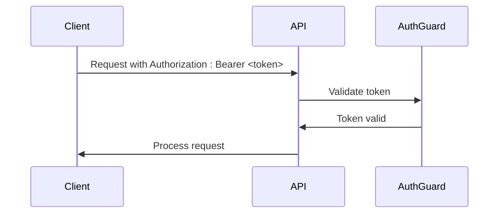
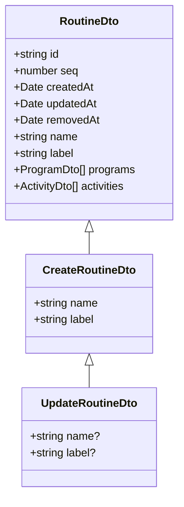
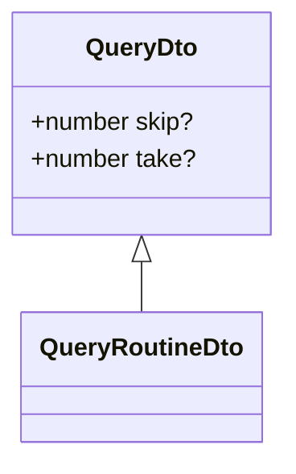
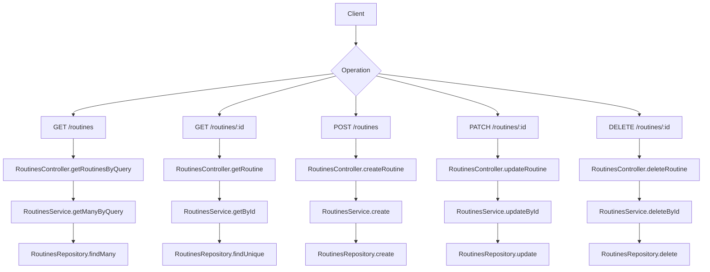

# Routines Endpoints

<cite>
**Referenced Files in This Document**   
- [routines.controller.ts](file://apps/server/src/shared/controller/resources/routines.controller.ts)
- [routines.service.ts](file://apps/server/src/shared/service/resources/routines.service.ts)
- [routines.repository.ts](file://apps/server/src/shared/repository/routines.repository.ts)
- [routine.dto.ts](file://packages/schema/src/dto/routine.dto.ts)
- [create-routine.dto.ts](file://packages/schema/src/dto/create/create-routine.dto.ts)
- [update-routine.dto.ts](file://packages/schema/src/dto/update/update-routine.dto.ts)
- [query.dto.ts](file://packages/schema/src/dto/query/query.dto.ts)
- [query-routine.dto.ts](file://packages/schema/src/dto/query/query-routine.dto.ts)
- [routine.entity.ts](file://packages/schema/src/entity/routine.entity.ts)
- [task.prisma](file://packages/schema/prisma/schema/task.prisma)
- [jwt.auth-guard.ts](file://apps/server/src/shared/guard/jwt.auth-guard.ts)
</cite>

## Table of Contents
1. [Introduction](#introduction)
2. [Authentication and Authorization](#authentication-and-authorization)
3. [Request Schema](#request-schema)
4. [Query Parameters](#query-parameters)
5. [Response Structure](#response-structure)
6. [Endpoint Details](#endpoint-details)
7. [Error Handling](#error-handling)
8. [Examples](#examples)

## Introduction
This document provides comprehensive documentation for the routine management RESTful API endpoints. The API allows for the creation, retrieval, updating, and deletion of routines, which are collections of activities organized into programs. Routines can be filtered by program and status, with support for pagination and sorting.

The endpoints follow REST conventions and are designed to manage routine entities that contain activities and are associated with programs. The API supports standard CRUD operations with additional capabilities for soft deletion and complex querying.

## Authentication and Authorization
All routine endpoints require authentication via JWT (JSON Web Token). The API uses a JWT authentication guard that validates the Authorization header in each request.



**Diagram sources**
- [jwt.auth-guard.ts](file://apps/server/src/shared/guard/jwt.auth-guard.ts)

**Section sources**
- [jwt.auth-guard.ts](file://apps/server/src/shared/guard/jwt.auth-guard.ts)

## Request Schema
The request schema for routine operations includes the following fields:

| Field | Type | Required | Description |
|-------|------|----------|-------------|
| name | string | Yes | The name of the routine |
| label | string | Yes | A descriptive label for the routine |
| programId | string | No | The ID of the associated program |
| order | number | No | The sequence order of the routine |
| status | string | No | The current status of the routine |

The schema is defined in the `CreateRoutineDto` and `UpdateRoutineDto` classes, which extend from the base `RoutineDto`.



**Diagram sources**
- [routine.dto.ts](file://packages/schema/src/dto/routine.dto.ts)
- [create-routine.dto.ts](file://packages/schema/src/dto/create/create-routine.dto.ts)
- [update-routine.dto.ts](file://packages/schema/src/dto/update/update-routine.dto.ts)

**Section sources**
- [routine.dto.ts](file://packages/schema/src/dto/routine.dto.ts)
- [create-routine.dto.ts](file://packages/schema/src/dto/create/create-routine.dto.ts)
- [update-routine.dto.ts](file://packages/schema/src/dto/update/update-routine.dto.ts)

## Query Parameters
The GET /routines endpoint supports the following query parameters for filtering, sorting, and pagination:

| Parameter | Type | Default | Description |
|-----------|------|---------|-------------|
| skip | number | 0 | Number of records to skip (for pagination) |
| take | number | undefined | Number of records to return (for pagination) |
| programId | string | undefined | Filter routines by program ID |
| status | string | undefined | Filter routines by status |

The query parameters are handled by the `QueryRoutineDto` class which extends the base `QueryDto` with pagination capabilities.



**Diagram sources**
- [query.dto.ts](file://packages/schema/src/dto/query/query.dto.ts)
- [query-routine.dto.ts](file://packages/schema/src/dto/query/query-routine.dto.ts)

**Section sources**
- [query.dto.ts](file://packages/schema/src/dto/query/query.dto.ts)
- [query-routine.dto.ts](file://packages/schema/src/dto/query/query-routine.dto.ts)

## Response Structure
The API returns a standardized response structure that includes the routine data and metadata for pagination.

```json
{
  "data": [
    {
      "id": "string",
      "seq": 0,
      "createdAt": "2023-01-01T00:00:00.000Z",
      "updatedAt": "2023-01-01T00:00:00.000Z",
      "removedAt": "2023-01-01T00:00:00.000Z",
      "name": "string",
      "label": "string",
      "programs": [
        {
          "id": "string",
          "seq": 0,
          "createdAt": "2023-01-01T00:00:00.000Z",
          "updatedAt": "2023-01-01T00:00:00.000Z",
          "removedAt": "2023-01-01T00:00:00.000Z",
          "routineId": "string",
          "sessionId": "string",
          "instructorId": "string",
          "capacity": 0,
          "name": "string",
          "level": "string"
        }
      ],
      "activities": [
        {
          "id": "string",
          "seq": 0,
          "createdAt": "2023-01-01T00:00:00.000Z",
          "updatedAt": "2023-01-01T00:00:00.000Z",
          "removedAt": "2023-01-01T00:00:00.000Z",
          "routineId": "string",
          "taskId": "string",
          "order": 0,
          "repetitions": 0,
          "restTime": 0,
          "notes": "string"
        }
      ]
    }
  ],
  "meta": {
    "skip": 0,
    "take": 10,
    "count": 1,
    "message": "success"
  }
}
```

The response structure is implemented using the `wrapResponse` utility function which adds metadata to the data payload.

**Section sources**
- [routines.controller.ts](file://apps/server/src/shared/controller/resources/routines.controller.ts)
- [response.util.ts](file://apps/server/src/shared/util/response.util.ts)

## Endpoint Details
### GET /routines
Retrieves a list of routines with optional filtering and pagination.

- **Method**: GET
- **Path**: /routines
- **Authentication**: Required
- **Parameters**: Query parameters for filtering and pagination
- **Response**: 200 OK with array of routines and metadata

### GET /routines/:id
Retrieves a specific routine by ID, including associated exercises.

- **Method**: GET
- **Path**: /routines/:routineId
- **Authentication**: Required
- **Parameters**: routineId (path parameter)
- **Response**: 200 OK with routine details

### POST /routines
Creates a new routine with optional program association.

- **Method**: POST
- **Path**: /routines
- **Authentication**: Required
- **Request Body**: CreateRoutineDto
- **Response**: 200 OK with created routine

### PATCH /routines/:id
Updates an existing routine.

- **Method**: PATCH
- **Path**: /routines/:routineId
- **Authentication**: Required
- **Parameters**: routineId (path parameter)
- **Request Body**: UpdateRoutineDto
- **Response**: 200 OK with updated routine

### DELETE /routines/:id
Deletes a routine by setting the removedAt timestamp (soft delete).

- **Method**: DELETE
- **Path**: /routines/:routineId
- **Authentication**: Required
- **Parameters**: routineId (path parameter)
- **Response**: 200 OK with deleted routine



**Diagram sources**
- [routines.controller.ts](file://apps/server/src/shared/controller/resources/routines.controller.ts)
- [routines.service.ts](file://apps/server/src/shared/service/resources/routines.service.ts)
- [routines.repository.ts](file://apps/server/src/shared/repository/routines.repository.ts)

**Section sources**
- [routines.controller.ts](file://apps/server/src/shared/controller/resources/routines.controller.ts)
- [routines.service.ts](file://apps/server/src/shared/service/resources/routines.service.ts)
- [routines.repository.ts](file://apps/server/src/shared/repository/routines.repository.ts)

## Error Handling
The API implements standard error handling with appropriate HTTP status codes:

- **400 Bad Request**: Invalid request parameters or body
- **401 Unauthorized**: Missing or invalid authentication token
- **404 Not Found**: Requested routine not found
- **500 Internal Server Error**: Unexpected server error

Specific error cases include:
- Invalid program reference when creating a routine
- Dependency constraints when deleting a routine
- Validation errors for required fields

The error responses follow the same structure as successful responses but with appropriate error codes and messages.

**Section sources**
- [routines.controller.ts](file://apps/server/src/shared/controller/resources/routines.controller.ts)
- [routines.service.ts](file://apps/server/src/shared/service/resources/routines.service.ts)

## Examples
### Retrieving Routines by Program
```bash
curl -X GET "http://api.example.com/routines?programId=123&skip=0&take=10" \
  -H "Authorization: Bearer <your-token>"
```

### Creating a New Routine
```bash
curl -X POST "http://api.example.com/routines" \
  -H "Authorization: Bearer <your-token>" \
  -H "Content-Type: application/json" \
  -d '{
    "name": "Morning Workout",
    "label": "Full Body Routine",
    "programId": "123"
  }'
```

### Updating Routine Sequence
```bash
curl -X PATCH "http://api.example.com/routines/456" \
  -H "Authorization: Bearer <your-token>" \
  -H "Content-Type: application/json" \
  -d '{
    "name": "Evening Workout",
    "label": "Updated Full Body Routine"
  }'
```

**Section sources**
- [routines.controller.ts](file://apps/server/src/shared/controller/resources/routines.controller.ts)