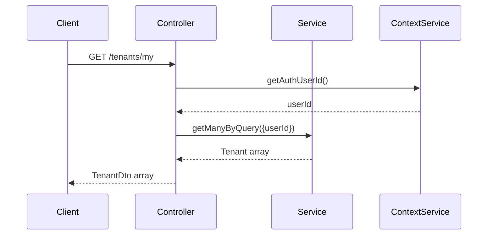
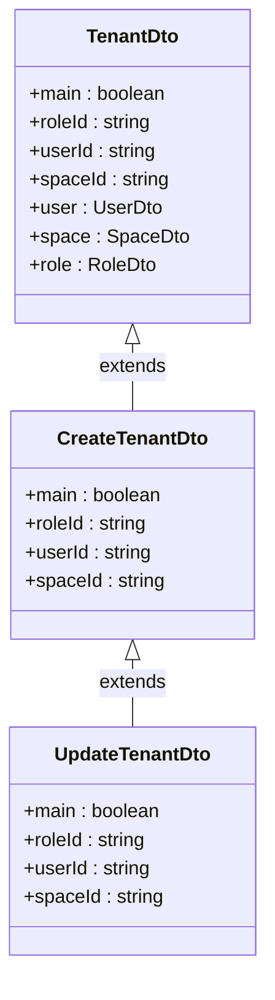

# Tenants Endpoints

<cite>
**Referenced Files in This Document**   
- [tenants.controller.ts](file://apps/server/src/shared/controller/resources/tenants.controller.ts)
- [tenants.service.ts](file://apps/server/src/shared/service/resources/tenants.service.ts)
- [tenant.dto.ts](file://packages/schema/src/dto/tenant.dto.ts)
- [create-tenant.dto.ts](file://packages/schema/src/dto/create/create-tenant.dto.ts)
- [update-tenant.dto.ts](file://packages/schema/src/dto/update/update-tenant.dto.ts)
- [query-tenant.dto.ts](file://packages/schema/src/dto/query/query-tenant.dto.ts)
- [tenant.entity.ts](file://packages/schema/src/entity/tenant.entity.ts)
</cite>

## Table of Contents
1. [Introduction](#introduction)
2. [Authentication and Tenant Isolation](#authentication-and-tenant-isolation)
3. [Tenant Endpoints](#tenant-endpoints)
4. [Request and Response Schemas](#request-and-response-schemas)
5. [Query Parameters for List Endpoint](#query-parameters-for-list-endpoint)
6. [Error Handling](#error-handling)
7. [Curl Examples](#curl-examples)

## Introduction
This document provides comprehensive documentation for the tenant management RESTful API endpoints. The system supports multi-tenancy with proper isolation between tenants and provides CRUD operations for tenant management along with specialized endpoints for retrieving tenant context.

**Section sources**
- [tenants.controller.ts](file://apps/server/src/shared/controller/resources/tenants.controller.ts#L27-L103)

## Authentication and Tenant Isolation
All tenant endpoints require authentication. The system implements tenant isolation through the ContextService which retrieves the authenticated user's ID and ensures that operations are scoped to the appropriate tenant context. When retrieving lists of tenants, the system automatically filters results based on the current user's permissions and tenant associations.

The `getMyTenants` endpoint specifically retrieves tenants associated with the currently authenticated user, enabling proper multi-tenancy support in the application.



**Diagram sources**
- [tenants.controller.ts](file://apps/server/src/shared/controller/resources/tenants.controller.ts#L35-L43)
- [tenants.service.ts](file://apps/server/src/shared/service/resources/tenants.service.ts#L93-L122)

## Tenant Endpoints

### GET /tenants (List with Pagination)
Retrieves a paginated list of tenants with optional filtering and sorting.

**Section sources**
- [tenants.controller.ts](file://apps/server/src/shared/controller/resources/tenants.controller.ts#L89-L102)
- [tenants.service.ts](file://apps/server/src/shared/service/resources/tenants.service.ts#L93-L122)

### GET /tenants/:id
Retrieves a specific tenant by ID.

**Section sources**
- [tenants.controller.ts](file://apps/server/src/shared/controller/resources/tenants.controller.ts#L54-L60)

### GET /tenants/my
Retrieves all tenants associated with the currently authenticated user.

**Section sources**
- [tenants.controller.ts](file://apps/server/src/shared/controller/resources/tenants.controller.ts#L35-L43)

### POST /tenants (Create Tenant)
Creates a new tenant with the provided configuration.

**Section sources**
- [tenants.controller.ts](file://apps/server/src/shared/controller/resources/tenants.controller.ts#L45-L52)
- [tenants.service.ts](file://apps/server/src/shared/service/resources/tenants.service.ts#L19-L32)

### PATCH /tenants/:id (Update Tenant)
Updates an existing tenant's configuration.

**Section sources**
- [tenants.controller.ts](file://apps/server/src/shared/controller/resources/tenants.controller.ts#L62-L71)
- [tenants.service.ts](file://apps/server/src/shared/service/resources/tenants.service.ts#L50-L68)

### DELETE /tenants/:id
Permanently deletes a tenant by ID.

**Section sources**
- [tenants.controller.ts](file://apps/server/src/shared/controller/resources/tenants.controller.ts#L81-L87)
- [tenants.service.ts](file://apps/server/src/shared/service/resources/tenants.service.ts#L87-L91)

## Request and Response Schemas

### Create Tenant Request Schema (POST /tenants)
The request body for creating a tenant includes:
- name: string
- subdomain: string
- configuration settings: object
- main: boolean
- roleId: string
- userId: string
- spaceId: string



**Diagram sources**
- [tenant.dto.ts](file://packages/schema/src/dto/tenant.dto.ts#L11-L32)
- [create-tenant.dto.ts](file://packages/schema/src/dto/create/create-tenant.dto.ts#L5-L10)
- [update-tenant.dto.ts](file://packages/schema/src/dto/update/update-tenant.dto.ts#L4)

**Section sources**
- [create-tenant.dto.ts](file://packages/schema/src/dto/create/create-tenant.dto.ts#L1-L10)
- [update-tenant.dto.ts](file://packages/schema/src/dto/update/update-tenant.dto.ts#L1-L5)

### Response Structure
All successful responses return a standardized response entity with:
- data: Tenant or array of TenantDto objects
- message: "success"
- meta: Page metadata for list operations (skip, take, count)

## Query Parameters for List Endpoint
The GET /tenants endpoint supports the following query parameters:

| Parameter | Type | Description | Required | Default |
|---------|------|-------------|----------|---------|
| skip | number | Number of records to skip for pagination | No | 0 |
| take | number | Number of records to return | No | 10 |
| createdAtSortOrder | string | Sort order for creation date (asc/desc) | No | desc |

The system implements pagination through the QueryDto base class and returns metadata including the total count of records, enabling clients to implement proper pagination UI.

**Section sources**
- [query-tenant.dto.ts](file://packages/schema/src/dto/query/query-tenant.dto.ts#L5-L8)
- [tenants.service.ts](file://apps/server/src/shared/service/resources/tenants.service.ts#L98-L115)

## Error Handling
The API implements standard HTTP error codes for error conditions:

### 409 Conflict
Returned when attempting to create a tenant with a duplicate subdomain. The system validates subdomain uniqueness at the service layer to prevent conflicts.

### 403 Forbidden
Returned when a user attempts to access a tenant they don't have permission to access. Tenant isolation is enforced through the ContextService which verifies user-tenant relationships before allowing access.

### 404 Not Found
Returned when attempting to access a tenant with an ID that doesn't exist.

The error handling is implemented at the controller level with appropriate HTTP status codes returned for each operation.

**Section sources**
- [tenants.controller.ts](file://apps/server/src/shared/controller/resources/tenants.controller.ts#L48-L52)
- [tenants.service.ts](file://apps/server/src/shared/service/resources/tenants.service.ts#L19-L32)

## Curl Examples

### Retrieve Current Tenant Context
```bash
curl -X GET "https://api.example.com/tenants/my" \
  -H "Authorization: Bearer <your-jwt-token>" \
  -H "Content-Type: application/json"
```

### Create New Tenant
```bash
curl -X POST "https://api.example.com/tenants" \
  -H "Authorization: Bearer <your-jwt-token>" \
  -H "Content-Type: application/json" \
  -d '{
    "name": "Acme Corporation",
    "subdomain": "acme",
    "main": true,
    "roleId": "role-123",
    "userId": "user-456",
    "spaceId": "space-789"
  }'
```

**Section sources**
- [tenants.controller.ts](file://apps/server/src/shared/controller/resources/tenants.controller.ts#L35-L43)
- [tenants.controller.ts](file://apps/server/src/shared/controller/resources/tenants.controller.ts#L45-L52)