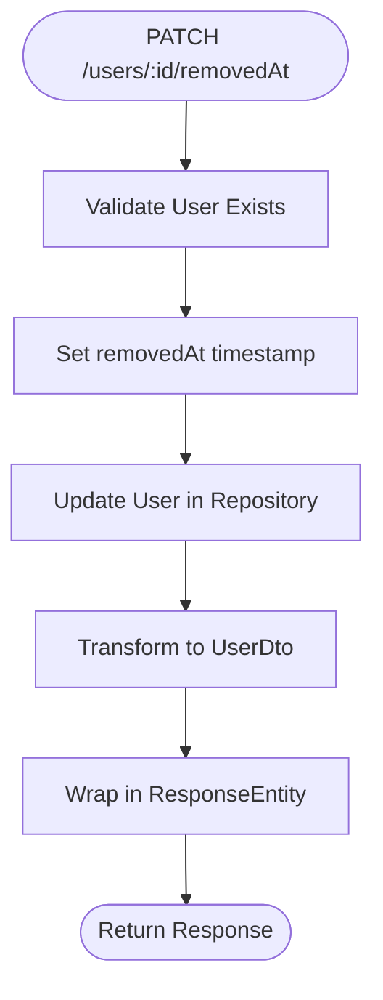

# Users Endpoints

<cite>
**Referenced Files in This Document**   
- [users.controller.ts](file://apps/server/src/shared/controller/resources/users.controller.ts)
- [users.service.ts](file://apps/server/src/shared/service/resources/users.service.ts)
- [user.dto.ts](file://packages/schema/src/dto/user.dto.ts)
- [create-user.dto.ts](file://packages/schema/src/dto/create/create-user.dto.ts)
- [update-user.dto.ts](file://packages/schema/src/dto/update/update-user.dto.ts)
- [query-user.dto.ts](file://packages/schema/src/dto/query/query-user.dto.ts)
- [user.entity.ts](file://packages/schema/src/entity/user.entity.ts)
- [users.module.ts](file://apps/server/src/module/users.module.ts)
</cite>

## Table of Contents
1. [Introduction](#introduction)
2. [Authentication and Authorization](#authentication-and-authorization)
3. [Response Structure](#response-structure)
4. [List Users (GET /users)](#list-users-get-users)
5. [Get User by ID (GET /users/:id)](#get-user-by-id-get-usersid)
6. [Create User (POST /users)](#create-user-post-users)
7. [Update User (PATCH /users/:id)](#update-user-patch-usersid)
8. [Soft Delete User (PATCH /users/:id/removedAt)](#soft-delete-user-patch-usersidremovedat)
9. [Hard Delete User (DELETE /users/:id)](#hard-delete-user-delete-usersid)
10. [Error Responses](#error-responses)
11. [Curl Examples](#curl-examples)

## Introduction
This document provides comprehensive documentation for the user management RESTful API endpoints. The API supports full CRUD operations for user entities with advanced features including pagination, filtering, role-based access control, and soft deletion. All endpoints follow a consistent response pattern using ResponseEntity and require JWT authentication.

The user management system supports associations with tenants, roles, and classifications, enabling complex user management scenarios in multi-tenant applications. The API is designed to be RESTful, predictable, and developer-friendly.

**Section sources**
- [users.controller.ts](file://apps/server/src/shared/controller/resources/users.controller.ts#L28-L125)
- [users.module.ts](file://apps/server/src/module/users.module.ts#L1-L9)

## Authentication and Authorization
All user management endpoints require authentication via JWT token and implement role-based access control using the `@Roles` decorator (inferred from the controller structure). Authentication can be provided through either:

- **Authorization Header**: `Authorization: Bearer <token>`
- **Cookie**: `accessToken` cookie

The API enforces role-based access control to ensure users can only perform operations they are authorized for. Specific role requirements are determined by the `@Roles` decorator on each endpoint, though the exact roles are not specified in the current codebase.


**Diagram sources**
- [users.controller.ts](file://apps/server/src/shared/controller/resources/users.controller.ts#L28-L125)
- [users.service.ts](file://apps/server/src/shared/service/resources/users.service.ts#L1-L150)

## Response Structure
All API responses are wrapped in a ResponseEntity structure that standardizes the response format across all endpoints. The response includes data, status information, and metadata for list operations.

### Response Entity Structure
```json
{
  "data": {},
  "status": "success",
  "message": "Operation completed successfully",
  "meta": {
    "page": 1,
    "limit": 10,
    "total": 100,
    "totalPages": 10
  }
}
```

### Field Descriptions
| Field | Type | Description |
|-------|------|-------------|
| data | object/array | The actual response data (user object or array of users) |
| status | string | Request status ("success" or "error") |
| message | string | Human-readable message about the operation result |
| meta | object | Pagination and query metadata (included in list responses) |

**Section sources**
- [users.controller.ts](file://apps/server/src/shared/controller/resources/users.controller.ts#L109-L115)
- [user.dto.ts](file://packages/schema/src/dto/user.dto.ts#L16-L59)

## List Users (GET /users)
Retrieves a paginated list of users with optional filtering and sorting capabilities.

### Endpoint
```
GET /users
```

### Query Parameters
| Parameter | Type | Required | Default | Description |
|---------|------|----------|---------|-------------|
| page | number | No | 1 | Page number for pagination |
| limit | number | No | 10 | Number of items per page (max 100) |
| sortBy | string | No | createdAt | Field to sort by (name, email, createdAt) |
| sortOrder | string | No | desc | Sort order (asc, desc) |
| tenantId | string | No | - | Filter by tenant ID |
| roleId | string | No | - | Filter by role ID |
| status | string | No | - | Filter by user status (active, inactive) |
| search | string | No | - | Search term for name or email |

### Response
Returns a paginated list of UserDto objects wrapped in ResponseEntity.

```json
{
  "data": [
    {
      "id": "uuid-string",
      "spaceId": "uuid-string",
      "email": "user@example.com",
      "name": "John Doe",
      "phone": "123-456-7890",
      "tenants": [
        {
          "id": "tenant-uuid",
          "roleId": "role-uuid",
          "main": true
        }
      ],
      "profiles": [],
      "associations": []
    }
  ],
  "status": "success",
  "message": "success",
  "meta": {
    "page": 1,
    "limit": 10,
    "total": 50,
    "totalPages": 5
  }
}
```


**Diagram sources**
- [users.controller.ts](file://apps/server/src/shared/controller/resources/users.controller.ts#L91-L115)
- [users.service.ts](file://apps/server/src/shared/service/resources/users.service.ts#L28-L46)
- [query-user.dto.ts](file://packages/schema/src/dto/query/query-user.dto.ts#L1-L50)

**Section sources**
- [users.controller.ts](file://apps/server/src/shared/controller/resources/users.controller.ts#L91-L115)
- [users.service.ts](file://apps/server/src/shared/service/resources/users.service.ts#L28-L46)
- [query-user.dto.ts](file://packages/schema/src/dto/query/query-user.dto.ts#L1-L50)

## Get User by ID (GET /users/:id)
Retrieves a single user by their unique identifier.

### Endpoint
```
GET /users/:id
```

### Path Parameters
| Parameter | Type | Description |
|---------|------|-------------|
| id | string | The UUID of the user to retrieve |

### Response
Returns a single UserDto object wrapped in ResponseEntity.

```json
{
  "data": {
    "id": "uuid-string",
    "spaceId": "uuid-string",
    "email": "user@example.com",
    "name": "John Doe",
    "phone": "123-456-7890",
    "tenants": [
      {
        "id": "tenant-uuid",
        "roleId": "role-uuid",
        "main": true,
        "role": {
          "id": "role-uuid",
          "name": "Administrator"
        }
      }
    ],
    "profiles": [
      {
        "id": "profile-uuid",
        "firstName": "John",
        "lastName": "Doe"
      }
    ],
    "classification": {
      "categoryId": "category-uuid"
    }
  },
  "status": "success",
  "message": "success"
}
```


**Diagram sources**
- [users.controller.ts](file://apps/server/src/shared/controller/resources/users.controller.ts#L45-L51)
- [users.service.ts](file://apps/server/src/shared/service/resources/users.service.ts#L9-L11)
- [user.entity.ts](file://packages/schema/src/entity/user.entity.ts#L1-L26)

**Section sources**
- [users.controller.ts](file://apps/server/src/shared/controller/resources/users.controller.ts#L45-L51)
- [users.service.ts](file://apps/server/src/shared/service/resources/users.service.ts#L9-L11)

## Create User (POST /users)
Creates a new user with specified attributes and role assignments.

### Endpoint
```
POST /users
```

### Request Body (CreateUserDto)
| Field | Type | Required | Description |
|------|------|----------|-------------|
| spaceId | string | Yes | UUID of the associated space |
| email | string | Yes | User's email address (must be unique) |
| name | string | Yes | User's full name |
| phone | string | No | User's phone number |
| password | string | Yes | User's password (hashed server-side) |
| tenants | array | No | Array of tenant associations with role assignments |

### Tenant Association Structure
```json
{
  "tenants": [
    {
      "tenantId": "uuid-string",
      "roleId": "uuid-string",
      "main": true
    }
  ]
}
```

### Example Request
```json
{
  "spaceId": "a1b2c3d4-e5f6-7890-g1h2-i3j4k5l6m7n8",
  "email": "john.doe@example.com",
  "name": "John Doe",
  "phone": "123-456-7890",
  "password": "securePassword123",
  "tenants": [
    {
      "tenantId": "t1e2n3a4-n5t6-7890-a1b2-c3d4e5f6g7h8",
      "roleId": "r1o2l3e4-a5b6-7890-c1d2-e3f4g5h6i7j8",
      "main": true
    }
  ]
}
```

### Response
Returns the created UserDto object wrapped in ResponseEntity.

```json
{
  "data": {
    "id": "new-user-uuid",
    "spaceId": "a1b2c3d4-e5f6-7890-g1h2-i3j4k5l6m7n8",
    "email": "john.doe@example.com",
    "name": "John Doe",
    "phone": "123-456-7890",
    "tenants": [
      {
        "id": "tenant-association-uuid",
        "tenantId": "t1e2n3a4-n5t6-7890-a1b2-c3d4e5f6g7h8",
        "roleId": "r1o2l3e4-a5b6-7890-c1d2-e3f4g5h6i7j8",
        "main": true
      }
    ]
  },
  "status": "success",
  "message": "success"
}
```


**Diagram sources**
- [users.controller.ts](file://apps/server/src/shared/controller/resources/users.controller.ts#L35-L43)
- [users.service.ts](file://apps/server/src/shared/service/resources/users.service.ts#L24-L26)
- [create-user.dto.ts](file://packages/schema/src/dto/create/create-user.dto.ts#L1-L40)

**Section sources**
- [users.controller.ts](file://apps/server/src/shared/controller/resources/users.controller.ts#L35-L43)
- [users.service.ts](file://apps/server/src/shared/service/resources/users.service.ts#L24-L26)
- [create-user.dto.ts](file://packages/schema/src/dto/create/create-user.dto.ts#L1-L40)

## Update User (PATCH /users/:id)
Updates an existing user's profile and associations.

### Endpoint
```
PATCH /users/:id
```

### Path Parameters
| Parameter | Type | Description |
|---------|------|-------------|
| id | string | The UUID of the user to update |

### Request Body (UpdateUserDto)
All fields are optional and only provided fields will be updated.

| Field | Type | Description |
|------|------|-------------|
| name | string | Updated user name |
| phone | string | Updated phone number |
| tenants | array | Updated tenant associations |
| classification | object | Updated user classification |

### Example Request
```json
{
  "name": "John Smith",
  "phone": "987-654-3210",
  "tenants": [
    {
      "tenantId": "t1e2n3a4-n5t6-7890-a1b2-c3d4e5f6g7h8",
      "roleId": "r1o2l3e4-a5b6-7890-c1d2-e3f4g5h6i7j8",
      "main": true
    },
    {
      "tenantId": "a1b2c3d4-e5f6-7890-g1h2-i3j4k5l6m7n8",
      "roleId": "b2c3d4e5-f6g7-8901-h2i3-j4k5l6m7n8o9",
      "main": false
    }
  ],
  "classification": {
    "categoryId": "c1a2t3e4-g5o6-7890-r1y2-i3d4a5t6e7f8"
  }
}
```

### Response
Returns the updated UserDto object wrapped in ResponseEntity.

```json
{
  "data": {
    "id": "existing-user-uuid",
    "spaceId": "a1b2c3d4-e5f6-7890-g1h2-i3j4k5l6m7n8",
    "email": "john.doe@example.com",
    "name": "John Smith",
    "phone": "987-654-3210",
    "tenants": [
      {
        "id": "tenant-association-uuid-1",
        "tenantId": "t1e2n3a4-n5t6-7890-a1b2-c3d4e5f6g7h8",
        "roleId": "r1o2l3e4-a5b6-7890-c1d2-e3f4g5h6i7j8",
        "main": true
      },
      {
        "id": "tenant-association-uuid-2",
        "tenantId": "a1b2c3d4-e5f6-7890-g1h2-i3j4k5l6m7n8",
        "roleId": "b2c3d4e5-f6g7-8901-h2i3-j4k5l6m7n8o9",
        "main": false
      }
    ],
    "classification": {
      "categoryId": "c1a2t3e4-g5o6-7890-r1y2-i3d4a5t6e7f8"
    }
  },
  "status": "success",
  "message": "success"
}
```


**Diagram sources**
- [users.controller.ts](file://apps/server/src/shared/controller/resources/users.controller.ts#L64-L73)
- [users.service.ts](file://apps/server/src/shared/service/resources/users.service.ts#L48-L50)
- [update-user.dto.ts](file://packages/schema/src/dto/update/update-user.dto.ts#L1-L35)

**Section sources**
- [users.controller.ts](file://apps/server/src/shared/controller/resources/users.controller.ts#L64-L73)
- [users.service.ts](file://apps/server/src/shared/service/resources/users.service.ts#L48-L50)
- [update-user.dto.ts](file://packages/schema/src/dto/update/update-user.dto.ts#L1-L35)

## Soft Delete User (PATCH /users/:id/removedAt)
Soft deletes a user by setting the removedAt timestamp, preserving the record for audit purposes.

### Endpoint
```
PATCH /users/:id/removedAt
```

### Path Parameters
| Parameter | Type | Description |
|---------|------|-------------|
| id | string | The UUID of the user to soft delete |

### Response
Returns the soft-deleted UserDto object wrapped in ResponseEntity.

```json
{
  "data": {
    "id": "user-uuid",
    "spaceId": "a1b2c3d4-e5f6-7890-g1h2-i3j4k5l6m7n8",
    "email": "john.doe@example.com",
    "name": "John Doe",
    "phone": "123-456-7890",
    "removedAt": "2025-01-15T10:30:00.000Z"
  },
  "status": "success",
  "message": "success"
}
```



**Diagram sources**
- [users.controller.ts](file://apps/server/src/shared/controller/resources/users.controller.ts#L75-L81)
- [users.service.ts](file://apps/server/src/shared/service/resources/users.service.ts#L52-L57)

**Section sources**
- [users.controller.ts](file://apps/server/src/shared/controller/resources/users.controller.ts#L75-L81)
- [users.service.ts](file://apps/server/src/shared/service/resources/users.service.ts#L52-L57)

## Hard Delete User (DELETE /users/:id)
Permanently removes a user record from the database.

### Endpoint
```
DELETE /users/:id
```

### Path Parameters
| Parameter | Type | Description |
|---------|------|-------------|
| id | string | The UUID of the user to permanently delete |

### Response
Returns the deleted UserDto object wrapped in ResponseEntity.

```json
{
  "data": {
    "id": "user-uuid",
    "spaceId": "a1b2c3d4-e5f6-7890-g1h2-i3j4k5l6m7n8",
    "email": "john.doe@example.com",
    "name": "John Doe"
  },
  "status": "success",
  "message": "success"
}
```


**Diagram sources**
- [users.controller.ts](file://apps/server/src/shared/controller/resources/users.controller.ts#L83-L89)
- [users.service.ts](file://apps/server/src/shared/service/resources/users.service.ts#L20-L22)

**Section sources**
- [users.controller.ts](file://apps/server/src/shared/controller/resources/users.controller.ts#L83-L89)
- [users.service.ts](file://apps/server/src/shared/service/resources/users.service.ts#L20-L22)

## Error Responses
The API returns standardized error responses for various failure scenarios.

### Common Error Codes
| Status Code | Error Type | Description | Example Response |
|------------|-----------|-------------|------------------|
| 400 | Bad Request | Invalid request parameters or body | ```json { "status": "error", "message": "Invalid role ID provided" } ``` |
| 404 | Not Found | User with specified ID not found | ```json { "status": "error", "message": "User not found" } ``` |
| 409 | Conflict | Email already exists | ```json { "status": "error", "message": "User with this email already exists" } ``` |
| 403 | Forbidden | Insufficient permissions | ```json { "status": "error", "message": "Insufficient permissions" } ``` |
| 500 | Internal Server Error | Unexpected server error | ```json { "status": "error", "message": "Internal server error" } ``` |

### Validation Error Structure
When validation fails, the API returns detailed information about the validation errors:

```json
{
  "status": "error",
  "message": "Validation failed",
  "errors": [
    {
      "field": "email",
      "message": "Email must be a valid email address"
    },
    {
      "field": "password",
      "message": "Password must be at least 8 characters long"
    }
  ]
}
```

**Section sources**
- [users.controller.ts](file://apps/server/src/shared/controller/resources/users.controller.ts#L116-L122)
- [users.service.ts](file://apps/server/src/shared/service/resources/users.service.ts#L9-L11)
- [user.dto.ts](file://packages/schema/src/dto/user.dto.ts#L20-L31)

## Curl Examples
### List Users with Filtering
```bash
curl -X GET "http://localhost:3000/users?page=1&limit=10&sortBy=name&order=asc&tenantId=a1b2c3d4-e5f6-7890-g1h2-i3j4k5l6m7n8" \
  -H "Authorization: Bearer your-jwt-token" \
  -H "Content-Type: application/json"
```

### Create a New User
```bash
curl -X POST "http://localhost:3000/users" \
  -H "Authorization: Bearer your-jwt-token" \
  -H "Content-Type: application/json" \
  -d '{
    "spaceId": "a1b2c3d4-e5f6-7890-g1h2-i3j4k5l6m7n8",
    "email": "john.doe@example.com",
    "name": "John Doe",
    "phone": "123-456-7890",
    "password": "securePassword123",
    "tenants": [
      {
        "tenantId": "t1e2n3a4-n5t6-7890-a1b2-c3d4e5f6g7h8",
        "roleId": "r1o2l3e4-a5b6-7890-c1d2-e3f4g5h6i7j8",
        "main": true
      }
    ]
  }'
```

### Update User Information
```bash
curl -X PATCH "http://localhost:3000/users/a1b2c3d4-e5f6-7890-g1h2-i3j4k5l6m7n8" \
  -H "Authorization: Bearer your-jwt-token" \
  -H "Content-Type: application/json" \
  -d '{
    "name": "John Smith",
    "phone": "987-654-3210",
    "tenants": [
      {
        "tenantId": "t1e2n3a4-n5t6-7890-a1b2-c3d4e5f6g7h8",
        "roleId": "r1o2l3e4-a5b6-7890-c1d2-e3f4g5h6i7j8",
        "main": true
      }
    ]
  }'
```

### Soft Delete a User
```bash
curl -X PATCH "http://localhost:3000/users/a1b2c3d4-e5f6-7890-g1h2-i3j4k5l6m7n8/removedAt" \
  -H "Authorization: Bearer your-jwt-token" \
  -H "Content-Type: application/json"
```

### Hard Delete a User
```bash
curl -X DELETE "http://localhost:3000/users/a1b2c3d4-e5f6-7890-g1h2-i3j4k5l6m7n8" \
  -H "Authorization: Bearer your-jwt-token" \
  -H "Content-Type: application/json"
```

**Section sources**
- [users.controller.ts](file://apps/server/src/shared/controller/resources/users.controller.ts#L35-L125)
- [users.service.ts](file://apps/server/src/shared/service/resources/users.service.ts#L1-L150)
- [create-user.dto.ts](file://packages/schema/src/dto/create/create-user.dto.ts#L1-L40)
- [update-user.dto.ts](file://packages/schema/src/dto/update/update-user.dto.ts#L1-L35)