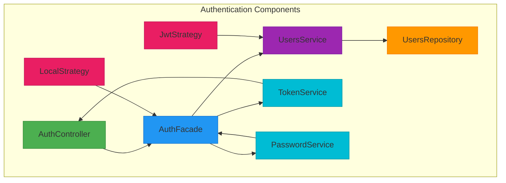
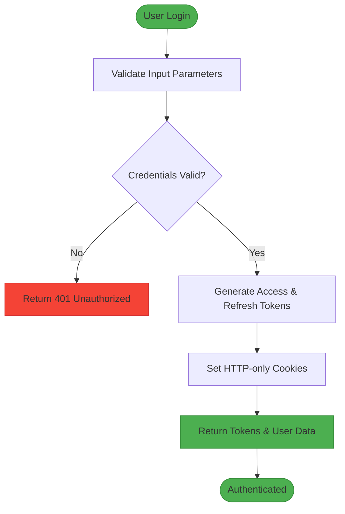
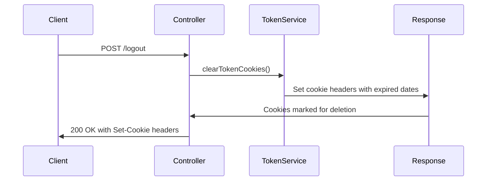
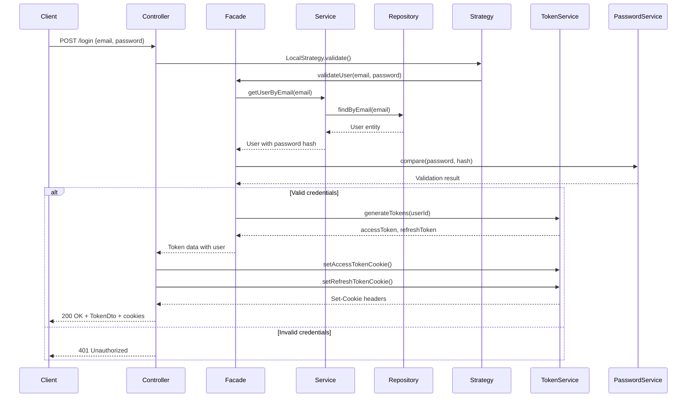
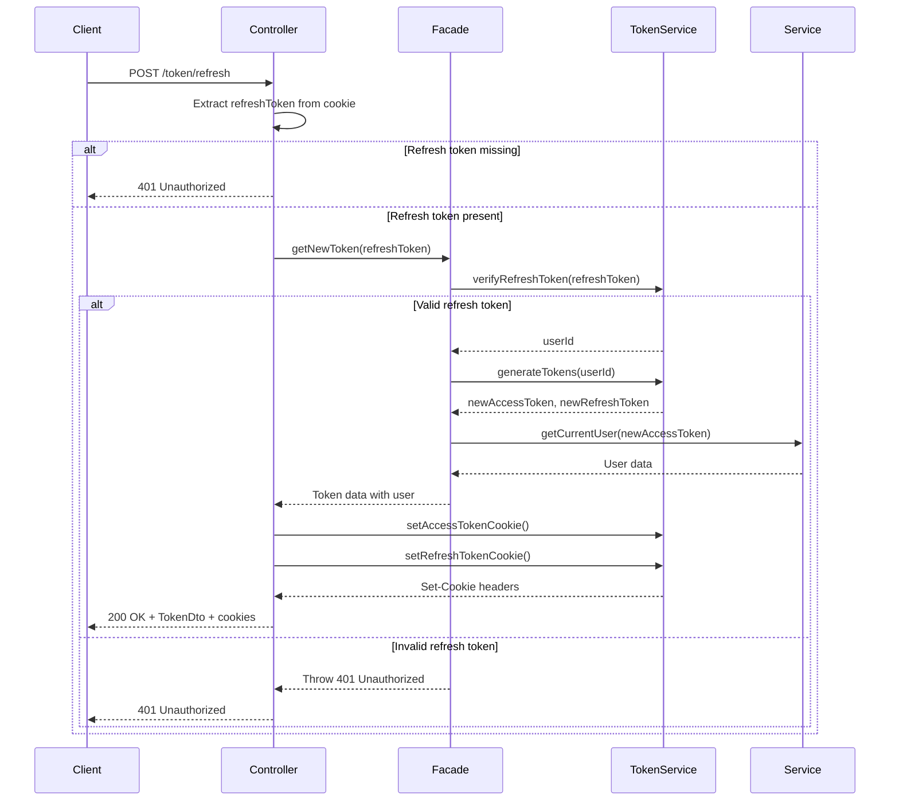
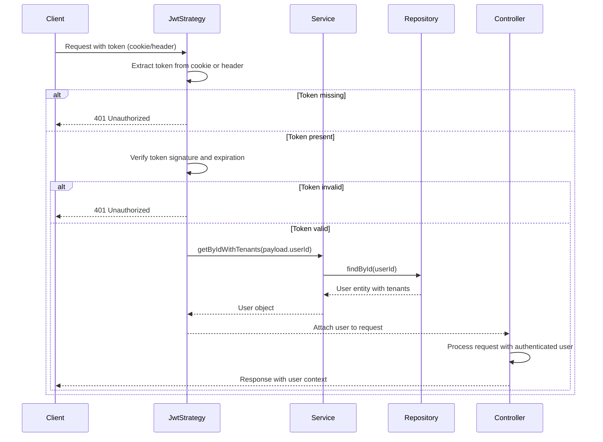

# Authentication Flow

<cite>
**Referenced Files in This Document**   
- [auth.module.ts](file://apps/server/src/module/auth.module.ts)
- [auth.controller.ts](file://apps/server/src/shared/controller/domains/auth.controller.ts)
- [jwt.strategy.ts](file://apps/server/src/shared/strategy/jwt.strategy.ts)
- [local.strategy.ts](file://apps/server/src/shared/strategy/local.strategy.ts)
- [login-payload.dto.ts](file://packages/schema/src/dto/auth/login-payload.dto.ts)
- [token.dto.ts](file://packages/schema/src/dto/auth/token.dto.ts)
- [auth.facade.ts](file://apps/server/src/shared/service/facade/auth.facade.ts)
- [token.service.ts](file://apps/server/src/shared/service/utils/token.service.ts)
- [password.service.ts](file://apps/server/src/shared/service/utils/password.service.ts)
- [users.service.ts](file://apps/server/src/shared/service/resources/users.service.ts)
- [users.repository.ts](file://apps/server/src/shared/repository/users.repository.ts)
</cite>

## Table of Contents
1. [Introduction](#introduction)
2. [Authentication Architecture](#authentication-architecture)
3. [Core Components](#core-components)
4. [Authentication Flow](#authentication-flow)
5. [JWT Implementation](#jwt-implementation)
6. [Token Management](#token-management)
7. [Security Considerations](#security-considerations)
8. [API Endpoints](#api-endpoints)
9. [Error Handling](#error-handling)
10. [Sequence Diagrams](#sequence-diagrams)

## Introduction

The authentication system in prj-core implements a secure JWT-based authentication mechanism with support for both local and JWT strategies. The system handles user login, token generation and validation, refresh token management, and tenant selection workflows. This documentation provides a comprehensive overview of the authentication flow from login request to token validation, detailing the implementation of authentication strategies, core components, and security measures.

**Section sources**
- [auth.controller.ts](file://apps/server/src/shared/controller/domains/auth.controller.ts#L51-L254)
- [auth.module.ts](file://apps/server/src/module/auth.module.ts#L1-L31)

## Authentication Architecture

The authentication system follows a modular architecture with clear separation of concerns. The core components include controllers for handling HTTP requests, services for business logic, strategies for authentication mechanisms, and repositories for data access. The system uses NestJS Passport integration for implementing authentication strategies and leverages JWT for stateless authentication.

**Diagram sources**
- [auth.module.ts](file://apps/server/src/module/auth.module.ts#L1-L31)
- [auth.controller.ts](file://apps/server/src/shared/controller/domains/auth.controller.ts#L51-L254)

## Core Components

### AuthController
The AuthController handles all authentication-related HTTP requests including login, logout, token refresh, and user registration. It uses NestJS decorators for route definition, request validation, and API documentation. The controller interacts with the AuthFacade to delegate business logic and uses TokenService to manage token cookies.

### AuthFacade
The AuthFacade serves as a facade pattern implementation that coordinates multiple services for authentication operations. It orchestrates the interaction between UsersService, TokenService, and PasswordService to provide a unified interface for authentication operations.

### LocalStrategy
The LocalStrategy implements the passport-local strategy for username/password authentication. It validates user credentials by delegating to the AuthFacade and returns the authenticated user object upon successful validation.

### JwtStrategy
The JwtStrategy implements the passport-jwt strategy for token-based authentication. It extracts JWT tokens from cookies or Authorization headers and validates them against the configured secret. The strategy retrieves user information from the database and attaches it to the request object.

### TokenService
The TokenService handles JWT token generation, validation, and cookie management. It creates access and refresh tokens with appropriate expiration times and manages their storage in HTTP-only cookies for enhanced security.

### PasswordService
The PasswordService manages password hashing and verification using secure cryptographic algorithms. It ensures that passwords are stored in hashed form and provides methods for comparing provided passwords with stored hashes.

**Section sources**
- [auth.controller.ts](file://apps/server/src/shared/controller/domains/auth.controller.ts#L51-L254)
- [auth.facade.ts](file://apps/server/src/shared/service/facade/auth.facade.ts#L1-L100)
- [local.strategy.ts](file://apps/server/src/shared/strategy/local.strategy.ts#L1-L18)
- [jwt.strategy.ts](file://apps/server/src/shared/strategy/jwt.strategy.ts#L1-L118)
- [token.service.ts](file://apps/server/src/shared/service/utils/token.service.ts#L1-L50)
- [password.service.ts](file://apps/server/src/shared/service/utils/password.service.ts#L1-L30)

## Authentication Flow

The authentication flow in prj-core follows a standard JWT-based pattern with additional security measures. The process begins with a user submitting login credentials, which are validated and processed through multiple layers of the application.

### Login Process
1. User submits email and password via login endpoint
2. Request is validated against LoginPayloadDto schema
3. LocalStrategy intercepts the request and calls validate method
4. AuthFacade validates user credentials using UsersService and PasswordService
5. Upon successful validation, AuthFacade generates access and refresh tokens
6. Tokens are set as HTTP-only cookies in the response
7. User information and tokens are returned in the response body

### Token Validation
1. Subsequent requests include JWT token in cookie or Authorization header
2. JwtStrategy extracts and validates the token
3. Valid token payload contains user ID for database lookup
4. UsersService retrieves full user information including tenant associations
5. User object is attached to the request for downstream handlers

### Token Refresh
1. Client detects expired access token
2. Refresh token endpoint is called with refresh token from cookie
3. TokenService validates refresh token
4. New access and refresh tokens are generated
5. New tokens are set as cookies and returned in response

**Diagram sources**
- [auth.controller.ts](file://apps/server/src/shared/controller/domains/auth.controller.ts#L60-L97)
- [local.strategy.ts](file://apps/server/src/shared/strategy/local.strategy.ts#L14-L17)

## JWT Implementation

The JWT implementation in prj-core follows industry best practices for security and reliability. Tokens are generated with appropriate expiration times and contain essential user information for stateless authentication.

### Token Structure
Access tokens contain the following claims:
- `userId`: Unique identifier of the authenticated user
- `iat`: Issued at timestamp
- `exp`: Expiration timestamp
- Additional metadata as needed

### Token Generation
Tokens are generated using the configured secret key with HS256 algorithm. The TokenService handles token creation with appropriate expiration settings:
- Access tokens: Short-lived (typically 15-30 minutes)
- Refresh tokens: Long-lived (typically 7 days)

### Token Extraction
The JwtStrategy supports multiple token extraction methods:
1. From HTTP-only cookies (primary method)
2. From Authorization header with Bearer scheme

This dual approach provides flexibility while prioritizing cookie-based storage for enhanced security against XSS attacks.

**Section sources**
- [jwt.strategy.ts](file://apps/server/src/shared/strategy/jwt.strategy.ts#L1-L118)
- [token.service.ts](file://apps/server/src/shared/service/utils/token.service.ts#L1-L50)
- [token.dto.ts](file://packages/schema/src/dto/auth/token.dto.ts#L1-L34)

## Token Management

The token management system in prj-core implements secure practices for token storage, rotation, and invalidation.

### Cookie Configuration
Tokens are stored in HTTP-only, secure cookies with the following attributes:
- `HttpOnly`: Prevents client-side JavaScript access
- `Secure`: Ensures transmission over HTTPS only
- `SameSite`: Set to 'strict' or 'lax' to prevent CSRF attacks
- Appropriate expiration matching token lifetime

### Token Rotation
The system implements token rotation where both access and refresh tokens are renewed during refresh operations. This enhances security by limiting the lifespan of each token instance.

### Logout Mechanism
The logout endpoint clears all authentication cookies including:
- accessToken
- refreshToken
- tenantId
- workspaceId

This ensures complete session termination across the application.

**Diagram sources**
- [auth.controller.ts](file://apps/server/src/shared/controller/domains/auth.controller.ts#L222-L252)
- [token.service.ts](file://apps/server/src/shared/service/utils/token.service.ts#L1-L50)

## Security Considerations

The authentication system implements multiple security measures to protect against common vulnerabilities.

### Password Security
- Passwords are hashed using bcrypt or similar adaptive hashing algorithm
- Hashing includes salt to prevent rainbow table attacks
- Password complexity requirements enforced via validation rules

### Token Security
- HTTP-only cookies prevent XSS-based token theft
- Secure flag ensures transmission over encrypted connections
- SameSite attribute mitigates CSRF attacks
- Short access token lifespan limits exposure window

### Input Validation
- Email format validation using regex patterns
- Password strength requirements (8+ characters, letters, numbers, special chars)
- Comprehensive error handling without information leakage

### Error Handling
- Generic error messages to prevent information disclosure
- Proper HTTP status codes for different error conditions
- Logging of authentication failures for monitoring

**Section sources**
- [password.service.ts](file://apps/server/src/shared/service/utils/password.service.ts#L1-L30)
- [login-payload.dto.ts](file://packages/schema/src/dto/auth/login-payload.dto.ts#L1-L47)
- [auth.controller.ts](file://apps/server/src/shared/controller/domains/auth.controller.ts#L31-L49)

## API Endpoints

The authentication system exposes the following endpoints:

### POST /login
- **Description**: Authenticate user with email and password
- **Request Body**: LoginPayloadDto (email, password)
- **Response**: TokenDto with access token, refresh token, and user data
- **Cookies**: Sets accessToken and refreshToken as HTTP-only cookies
- **Status Codes**: 200 (success), 401 (unauthorized), 400 (bad request)

### POST /sign-up
- **Description**: Create new user account
- **Request Body**: SignUpPayloadDto (email, password, name)
- **Response**: TokenDto with tokens and user data
- **Status Codes**: 201 (created), 409 (conflict - email exists), 400 (bad request)

### POST /token/refresh
- **Description**: Refresh expired access token using refresh token
- **Request**: Requires refreshToken cookie
- **Response**: New TokenDto with refreshed tokens
- **Status Codes**: 200 (success), 401 (unauthorized - invalid/missing refresh token)

### GET /verify-token
- **Description**: Verify the validity of the current access token
- **Request**: Requires valid access token (cookie or header)
- **Response**: Boolean indicating token validity
- **Status Codes**: 200 (valid), 401 (invalid/expired)

### POST /logout
- **Description**: Terminate current session
- **Response**: Clears all authentication cookies
- **Status Codes**: 200 (success)

**Section sources**
- [auth.controller.ts](file://apps/server/src/shared/controller/domains/auth.controller.ts#L60-L252)

## Error Handling

The authentication system implements comprehensive error handling with specific error messages for different failure scenarios:

### Authentication Errors
- **401 Unauthorized**: Invalid credentials, expired or invalid token
- **400 Bad Request**: Malformed request or invalid input format
- **409 Conflict**: Resource conflict (e.g., email already exists)

### Error Messages
- `INVALID_EMAIL_OR_PASSWORD_FORMAT`: Email or password format incorrect
- `INVALID_CREDENTIALS`: Email and password do not match
- `REFRESH_TOKEN_NOT_FOUND`: Refresh token missing from request
- `REFRESH_TOKEN_EXPIRED`: Refresh token has expired
- `TOKEN_INVALID`: Access token is invalid or malformed
- `EMAIL_ALREADY_EXISTS`: User with email already registered

Error messages are standardized and localized where appropriate, with technical details logged server-side while user-facing messages remain generic to prevent information disclosure.

**Section sources**
- [auth.controller.ts](file://apps/server/src/shared/controller/domains/auth.controller.ts#L31-L49)
- [auth.controller.ts](file://apps/server/src/shared/controller/domains/auth.controller.ts#L70-L77)

## Sequence Diagrams

### Login Sequence

**Diagram sources**
- [auth.controller.ts](file://apps/server/src/shared/controller/domains/auth.controller.ts#L60-L97)
- [local.strategy.ts](file://apps/server/src/shared/strategy/local.strategy.ts#L14-L17)
- [auth.facade.ts](file://apps/server/src/shared/service/facade/auth.facade.ts#L1-L50)

### Token Refresh Sequence

**Diagram sources**
- [auth.controller.ts](file://apps/server/src/shared/controller/domains/auth.controller.ts#L100-L144)
- [auth.facade.ts](file://apps/server/src/shared/service/facade/auth.facade.ts#L51-L80)
- [token.service.ts](file://apps/server/src/shared/service/utils/token.service.ts#L1-L50)

### Protected Route Access

**Diagram sources**
- [jwt.strategy.ts](file://apps/server/src/shared/strategy/jwt.strategy.ts#L84-L109)
- [users.service.ts](file://apps/server/src/shared/service/resources/users.service.ts#L1-L30)
- [users.repository.ts](file://apps/server/src/shared/repository/users.repository.ts#L1-L20)