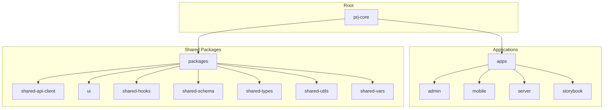
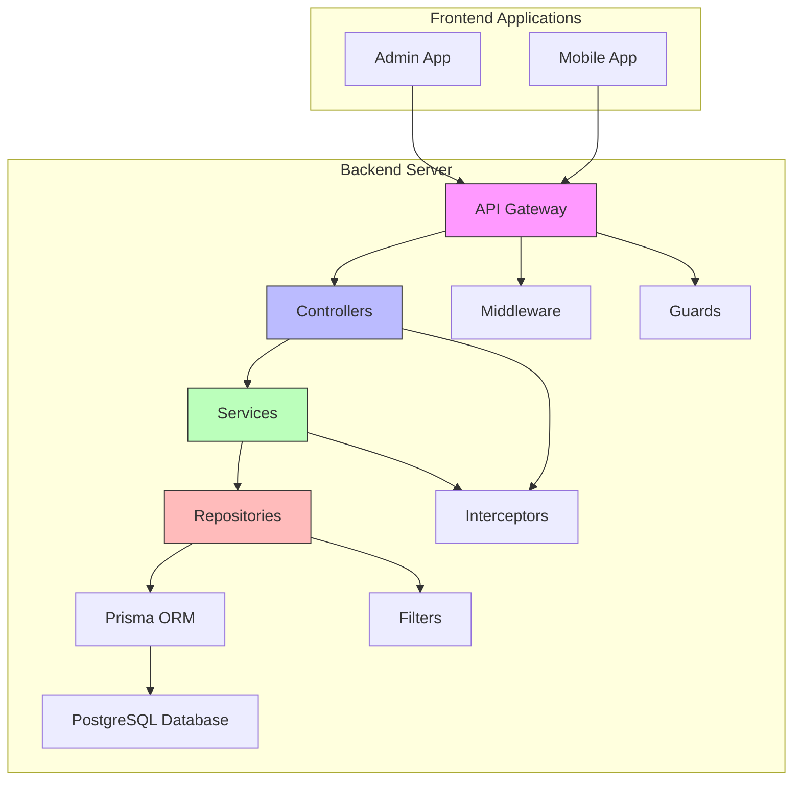
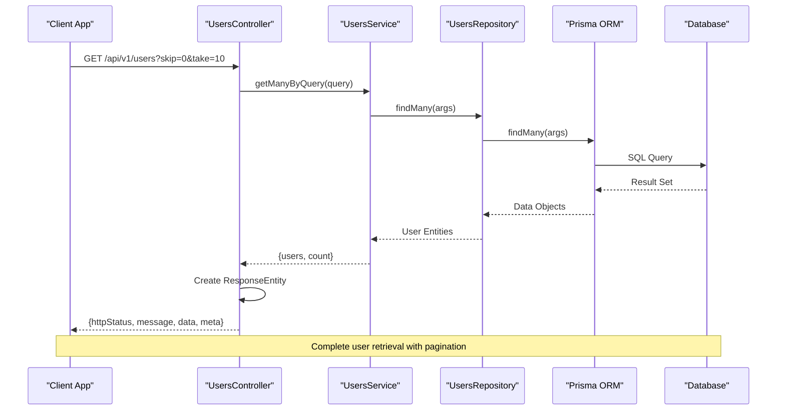
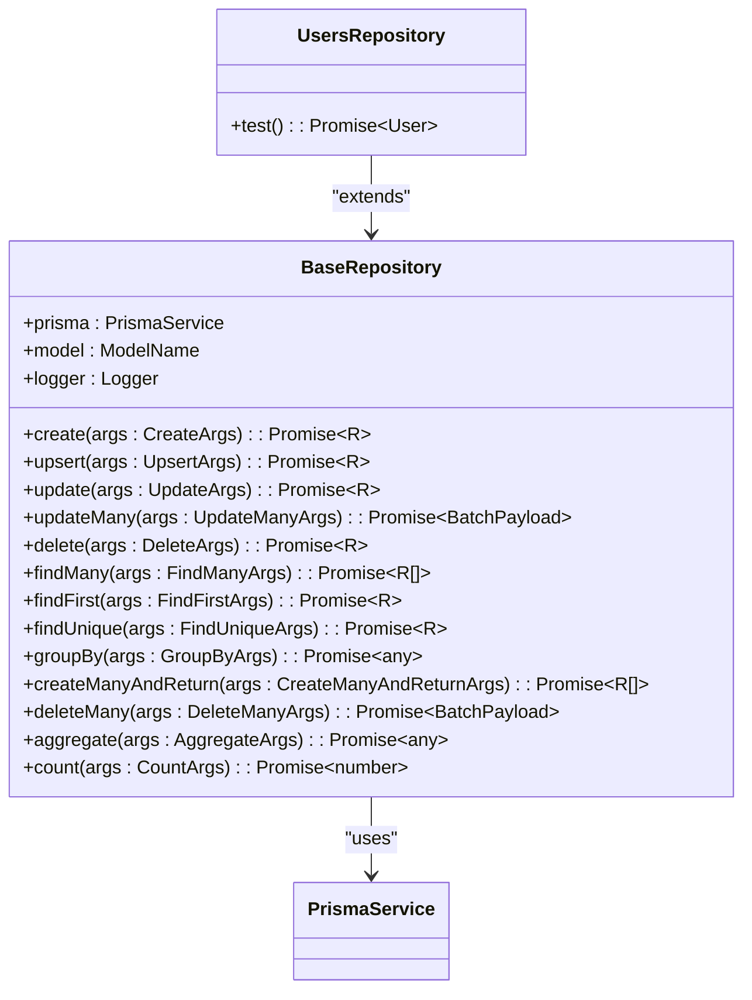
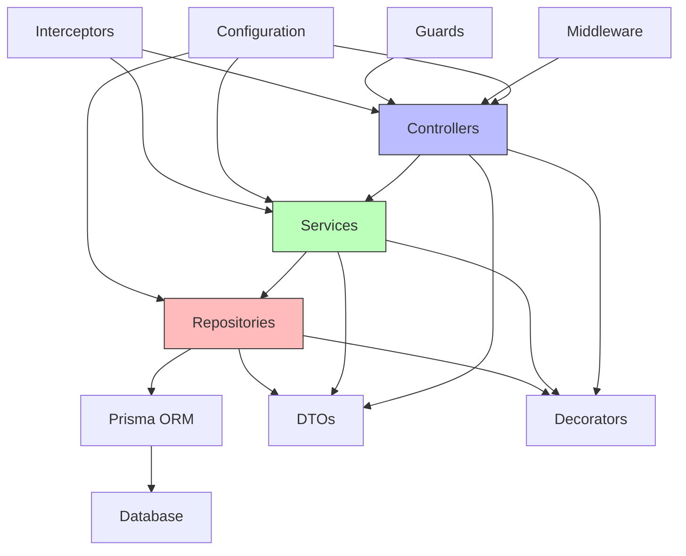

# Backend Architecture

<cite>
**Referenced Files in This Document**   
- [main.ts](file://apps/server/src/main.ts)
- [app.module.ts](file://apps/server/src/module/app.module.ts)
- [users.controller.ts](file://apps/server/src/shared/controller/resources/users.controller.ts)
- [users.service.ts](file://apps/server/src/shared/service/resources/users.service.ts)
- [users.repository.ts](file://apps/server/src/shared/repository/users.repository.ts)
- [base.repository.ts](file://apps/server/src/shared/common/base.repository.ts)
- [use-dto.decorator.ts](file://apps/server/src/shared/decorator/use-dto.decorator.ts)
- [api-response-entity.decorator.ts](file://apps/server/src/shared/decorator/api-response-entity.decorator.ts)
- [auth.guard.ts](file://apps/server/src/shared/guard/auth.guard.ts)
- [jwt.auth-guard.ts](file://apps/server/src/shared/guard/jwt.auth-guard.ts)
- [logger.middleware.ts](file://apps/server/src/shared/middleware/logger.middleware.ts)
- [app.config.ts](file://apps/server/src/shared/config/app.config.ts)
- [config.type.ts](file://apps/server/src/shared/config/config.type.ts)
- [database.config.ts](file://apps/server/src/shared/config/database.config.ts)
</cite>

## Table of Contents

1. [Introduction](#introduction)
2. [Project Structure](#project-structure)
3. [Core Components](#core-components)
4. [Architecture Overview](#architecture-overview)
5. [Detailed Component Analysis](#detailed-component-analysis)
6. [Dependency Analysis](#dependency-analysis)
7. [Performance Considerations](#performance-considerations)
8. [Troubleshooting Guide](#troubleshooting-guide)
9. [Conclusion](#conclusion)

## Introduction

This document provides a comprehensive architectural overview of the backend system for prj-core, a NestJS-based application. The backend follows a modular, layered architecture with clear separation of concerns between controllers, services, and repositories. It leverages Prisma ORM for database interactions and implements a robust security model using JWT-based authentication. The system is designed to support multiple frontend applications including admin and mobile interfaces, with a focus on scalability, maintainability, and developer experience.

## Project Structure

The project follows a monorepo structure using pnpm workspaces, with distinct applications and shared packages. The backend resides in the `apps/server` directory, while shared components are organized in the `packages` directory for reuse across different applications.



**Diagram sources**

- [pnpm-workspace.yaml](file://pnpm-workspace.yaml#L1-L3)

**Section sources**

- [pnpm-workspace.yaml](file://pnpm-workspace.yaml#L1-L55)

## Core Components

The backend architecture is built on NestJS framework and follows a MVC-like pattern with Controllers, Services, and Repositories. The core components include:

- **Controllers**: Handle HTTP requests and responses
- **Services**: Contain business logic and coordinate between repositories
- **Repositories**: Manage data access and database operations
- **Modules**: Organize related functionality and enable dependency injection
- **DTOs**: Define data transfer objects for type safety
- **Entities**: Represent database models through Prisma

The architecture emphasizes separation of concerns, with each layer having distinct responsibilities and clear interfaces between them.

**Section sources**

- [main.ts](file://apps/server/src/main.ts#L1-L76)
- [app.module.ts](file://apps/server/src/module/app.module.ts#L1-L177)

## Architecture Overview

The backend system follows a layered architecture with well-defined boundaries between components. The application is organized into feature modules, each containing controllers, services, and repositories for specific domain entities.



**Diagram sources**

- [main.ts](file://apps/server/src/main.ts#L1-L76)
- [app.module.ts](file://apps/server/src/module/app.module.ts#L1-L177)

## Detailed Component Analysis

### Component Interaction Flow

The typical request flow in the system follows a consistent pattern from controller to repository, with proper error handling and response formatting.



**Diagram sources**

- [users.controller.ts](file://apps/server/src/shared/controller/resources/users.controller.ts#L1-L151)
- [users.service.ts](file://apps/server/src/shared/service/resources/users.service.ts#L1-L149)
- [users.repository.ts](file://apps/server/src/shared/repository/users.repository.ts#L1-L37)

### Controller Layer Analysis

Controllers in the application handle HTTP requests, validate input, and return standardized responses. They use decorators for route definition, authentication, and response formatting.

```mermaid
classDiagram
class UsersController {
+logger : Logger
+service : UsersService
+createUser(createUserDto : CreateUserDto) : ResponseEntity~UserDto~
+getUser(userId : string) : ResponseEntity~UserDto~
+getUsersByQuery(query : QueryUserDto) : ResponseEntity~UserDto[]~
+updateUser(userId : string, updateUserDto : UpdateUserDto) : ResponseEntity~UserDto~
+removeUser(userId : string) : ResponseEntity~UserDto~
+deleteUser(userId : string) : ResponseEntity~UserDto~
}
class ApiResponseEntity {
+dataDto : Type
+httpStatus : HttpStatus
+options : {isArray? : boolean}
}
class Auth {
+options : {public? : boolean}
}
UsersController --> ApiResponseEntity : "uses"
UsersController --> Auth : "uses"
UsersController --> UsersService : "depends on"
```

**Diagram sources**

- [users.controller.ts](file://apps/server/src/shared/controller/resources/users.controller.ts#L1-L151)
- [api-response-entity.decorator.ts](file://apps/server/src/shared/decorator/api-response-entity.decorator.ts#L1-L61)
- [auth.guard.ts](file://apps/server/src/shared/guard/auth.guard.ts#L1-L14)

### Service Layer Analysis

Services contain the business logic and coordinate operations between repositories. They handle complex operations, data transformations, and business rules.

```mermaid
classDiagram
class UsersService {
+repository : UsersRepository
+getById(id : string) : Promise~User~
+removeMany(ids : string[]) : Promise~BatchPayload~
+deleteById(id : string) : Promise~User~
+create(args : UserCreateArgs) : Promise~User~
+getManyByQuery(query : QueryUserDto) : Promise~{users : User[], count : number}~
+updateById(id : string, data : UserUpdateInput) : Promise~User~
+removeById(id : string) : Promise~User~
+getByIdWithTenants(id : string) : Promise~User~
+getByEmail(email : string) : Promise~User~
+getUserWithMainTenant(userId : string) : Promise~User~
}
UsersService --> UsersRepository : "uses"
```

**Diagram sources**

- [users.service.ts](file://apps/server/src/shared/service/resources/users.service.ts#L1-L149)
- [users.repository.ts](file://apps/server/src/shared/repository/users.repository.ts#L1-L37)

### Repository Layer Analysis

Repositories provide an abstraction over Prisma ORM, implementing CRUD operations with consistent logging and error handling. The base repository class provides common functionality for all entity-specific repositories.



**Diagram sources**

- [base.repository.ts](file://apps/server/src/shared/common/base.repository.ts#L1-L156)
- [users.repository.ts](file://apps/server/src/shared/repository/users.repository.ts#L1-L37)
- [prisma.service.ts](file://node_modules/nestjs-prisma/src/prisma.service.ts)

## Dependency Analysis

The backend system has a well-defined dependency structure with clear boundaries between layers. The dependency inversion principle is applied through NestJS dependency injection.



**Diagram sources**

- [app.module.ts](file://apps/server/src/module/app.module.ts#L1-L177)
- [main.ts](file://apps/server/src/main.ts#L1-L76)

## Performance Considerations

The architecture includes several performance optimizations:

1. **Request Logging**: Middleware logs all HTTP requests for monitoring and debugging
2. **Global Pipes**: ValidationPipe with transform and whitelist options ensures data integrity
3. **Caching Strategy**: Not explicitly implemented but can be added at service layer
4. **Database Optimization**: Prisma ORM provides query optimization and connection pooling
5. **Error Handling**: Global filters handle exceptions consistently
6. **Swagger Documentation**: API documentation is generated automatically

The system uses connection pooling with configurable maxConnections (default 100) and supports SSL for database connections in production environments.

**Section sources**

- [main.ts](file://apps/server/src/main.ts#L1-L76)
- [database.config.ts](file://apps/server/src/shared/config/database.config.ts#L1-L42)

## Troubleshooting Guide

Common issues and their solutions:

1. **Authentication Failures**: Check JWT token validity and ensure proper Authorization header format
2. **Database Connection Issues**: Verify database configuration and network connectivity
3. **CORS Errors**: Ensure frontend domains are included in CORS origin list
4. **Validation Errors**: Check request payload against DTO definitions
5. **Performance Issues**: Monitor database queries and consider adding indexes

The system includes comprehensive logging through nestjs-pino, with middleware logging all HTTP requests and guards logging authentication attempts.

**Section sources**

- [logger.middleware.ts](file://apps/server/src/shared/middleware/logger.middleware.ts#L1-L15)
- [jwt.auth-guard.ts](file://apps/server/src/shared/guard/jwt.auth-guard.ts#L1-L63)
- [all-exception.filter.ts](file://apps/server/src/shared/filter/all-exception.filter.ts)

## Conclusion

The prj-core backend architecture demonstrates a well-structured, maintainable design using NestJS framework. The layered architecture with clear separation of concerns enables scalability and ease of development. Key strengths include:

- Modular organization with feature-based modules
- Consistent error handling and response formatting
- Robust security model with JWT authentication
- Comprehensive logging and monitoring
- Automated API documentation with Swagger
- Type-safe data transfer with DTOs and Prisma

The architecture is well-suited for enterprise applications requiring high reliability, security, and maintainability. Future enhancements could include distributed caching, message queues for async operations, and more sophisticated monitoring and alerting.
