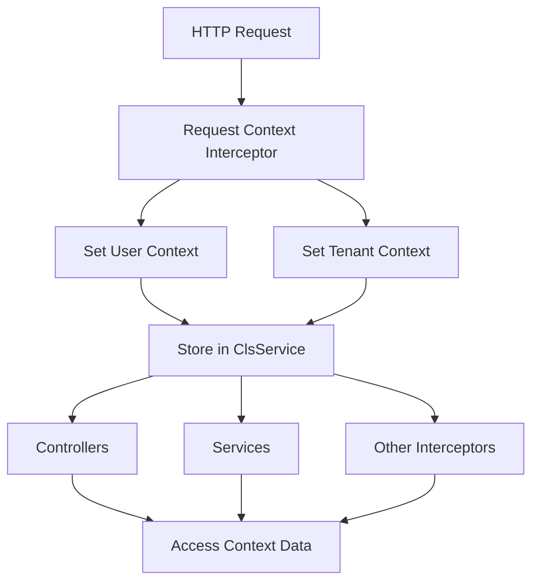
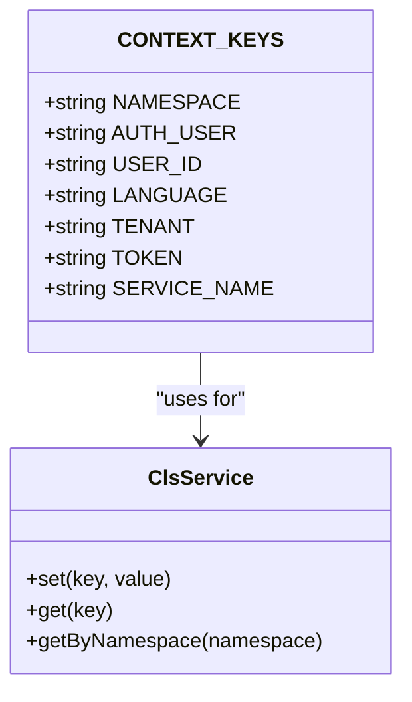
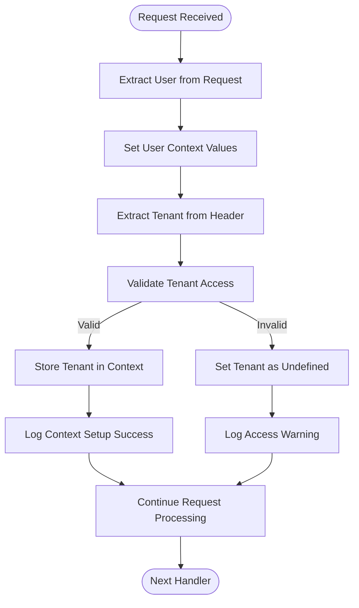
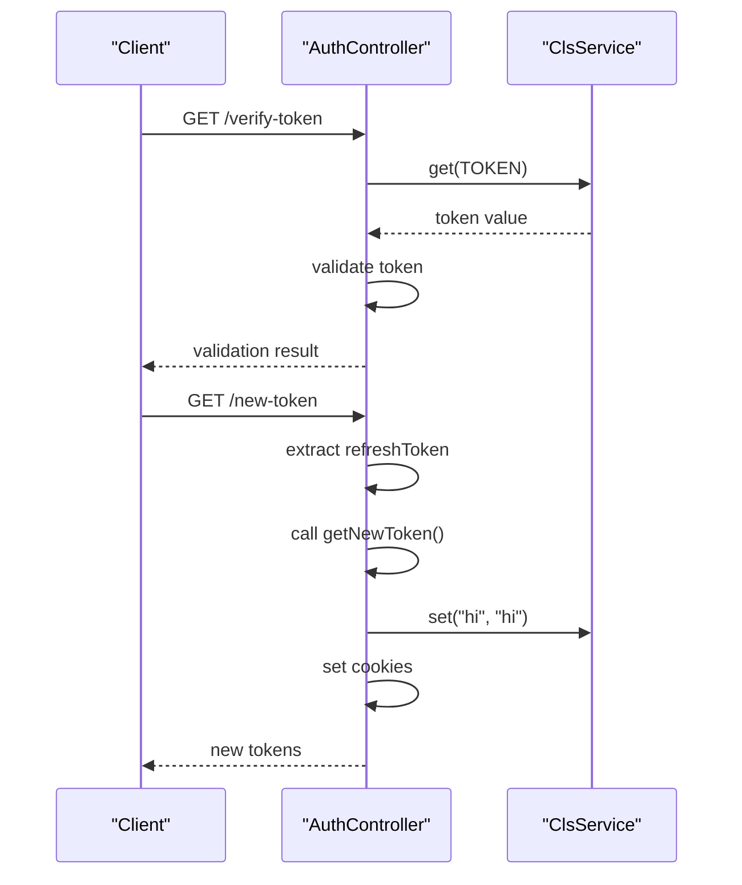
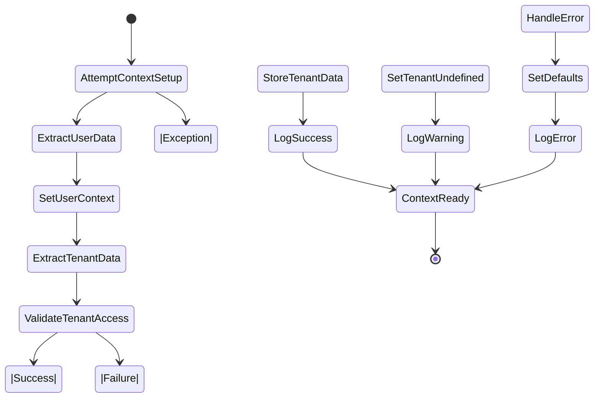

# Context Management with nestjs-cls

<cite>
**Referenced Files in This Document**   
- [global.module.ts](file://apps/server/src/module/global.module.ts)
- [request-context.interceptor.ts](file://packages/be-common/src/interceptor/request-context.interceptor.ts)
- [auth.controller.ts](file://apps/server/src/module/auth/auth.controller.ts)
- [context-keys.constant.ts](file://packages/constant/src/context/context-keys.constant.ts)
- [setNestApp.ts](file://apps/server/src/setNestApp.ts)
</cite>

## Table of Contents
1. [Introduction](#introduction)
2. [Architecture Overview](#architecture-overview)
3. [Core Components](#core-components)
4. [Context Storage and Retrieval](#context-storage-and-retrieval)
5. [Request Context Interceptor](#request-context-interceptor)
6. [Usage in Controllers](#usage-in-controllers)
7. [Configuration and Initialization](#configuration-and-initialization)
8. [Error Handling and Fallbacks](#error-handling-and-fallbacks)
9. [Testing Strategy](#testing-strategy)
10. [Best Practices](#best-practices)

## Introduction

This document provides a comprehensive overview of context management implementation using nestjs-cls in the application. The context management system enables storing and retrieving request-scoped data across different layers of the application without passing parameters explicitly through function calls. This approach enhances code maintainability, reduces coupling between components, and provides a clean way to access user, tenant, and authentication information throughout the request lifecycle.

The implementation leverages the nestjs-cls library to create a thread-safe context storage that persists for the duration of each HTTP request. This allows various components such as controllers, services, and interceptors to access contextual information like the authenticated user, tenant details, and tokens without requiring explicit parameter passing.

**Section sources**
- [global.module.ts](file://apps/server/src/module/global.module.ts)
- [request-context.interceptor.ts](file://packages/be-common/src/interceptor/request-context.interceptor.ts)

## Architecture Overview

The context management system follows a layered architecture where context data is established early in the request lifecycle and made available to all subsequent processing components. The architecture consists of several key components working together to provide a seamless context management experience.



**Diagram sources **
- [request-context.interceptor.ts](file://packages/be-common/src/interceptor/request-context.interceptor.ts)
- [setNestApp.ts](file://apps/server/src/setNestApp.ts)

## Core Components

The context management system comprises several core components that work together to provide a robust solution for managing request-scoped data. These components include the ClsModule configuration, the RequestContextInterceptor, and the context keys constants that define the structure of stored data.

The system is designed to automatically extract user and tenant information from incoming requests and store them in a context that can be accessed by any component during the request lifecycle. This eliminates the need to pass user and tenant data as parameters through multiple layers of the application.

**Section sources**
- [global.module.ts](file://apps/server/src/module/global.module.ts)
- [context-keys.constant.ts](file://packages/constant/src/context/context-keys.constant.ts)

## Context Storage and Retrieval

The context management system uses predefined keys to store and retrieve specific pieces of information from the context store. These keys are defined in the CONTEXT_KEYS constant and provide a standardized way to access user, tenant, and authentication data across the application.



**Diagram sources **
- [context-keys.constant.ts](file://packages/constant/src/context/context-keys.constant.ts)
- [request-context.interceptor.ts](file://packages/be-common/src/interceptor/request-context.interceptor.ts)

## Request Context Interceptor

The RequestContextInterceptor is responsible for establishing the request context at the beginning of each HTTP request. It extracts user information from the request object and tenant information from headers, then stores this data in the context store for later retrieval.

The interceptor processes the request in the following sequence:
1. Extract user data from request.user
2. Set user-related context values
3. Extract tenant information from x-space-id header
4. Validate tenant access rights
5. Store tenant data in context
6. Handle errors gracefully by setting default values



**Diagram sources **
- [request-context.interceptor.ts](file://packages/be-common/src/interceptor/request-context.interceptor.ts)

**Section sources**
- [request-context.interceptor.ts](file://packages/be-common/src/interceptor/request-context.interceptor.ts)

## Usage in Controllers

Controllers access context data through the ClsService instance injected into their constructors. This allows them to retrieve user, tenant, and token information without requiring explicit parameters from the request.

The auth controller demonstrates several patterns for using context data:
- Retrieving the current token for validation
- Setting additional context values during request processing
- Accessing user and tenant information for business logic decisions



**Diagram sources **
- [auth.controller.ts](file://apps/server/src/module/auth/auth.controller.ts)
- [request-context.interceptor.ts](file://packages/be-common/src/interceptor/request-context.interceptor.ts)

**Section sources**
- [auth.controller.ts](file://apps/server/src/module/auth/auth.controller.ts)

## Configuration and Initialization

The context management system is configured during application bootstrap through the ClsModule.forRoot() method in the global modules configuration. This setup ensures that the context service is available application-wide and properly initialized before any requests are processed.

The configuration includes mounting the context middleware and registering plugins for transactional operations, ensuring that context data is preserved across asynchronous operations and database transactions.

```mermaid
graph TB
A[Application Bootstrap] --> B[ClsModule.forRoot()]
B --> C[Configure Global Settings]
C --> D[Enable Middleware]
C --> E[Register Plugins]
D --> F[Mount Context Middleware]
E --> G[Setup Transactional Plugin]
F --> H[Context Ready]
G --> H
```

**Diagram sources **
- [global.module.ts](file://apps/server/src/module/global.module.ts)

**Section sources**
- [global.module.ts](file://apps/server/src/module/global.module.ts)

## Error Handling and Fallbacks

The context management system implements comprehensive error handling to ensure that requests can continue even if context setup fails. The system follows a graceful degradation approach, setting undefined values for missing or invalid context data rather than throwing exceptions.

When errors occur during context setup, the system logs the issue for monitoring purposes while ensuring the request can proceed with default context values. This prevents cascading failures and maintains application availability even when contextual data is incomplete.



**Diagram sources **
- [request-context.interceptor.ts](file://packages/be-common/src/interceptor/request-context.interceptor.ts)

## Testing Strategy

The context management implementation includes comprehensive unit tests that verify the correct behavior of the RequestContextInterceptor and its interaction with the ClsService. The tests use Jest mocking to simulate different scenarios including valid user data, missing headers, and unauthorized access attempts.

Test cases cover:
- Successful context setup with valid user and tenant data
- Handling of requests without user authentication
- Processing requests with invalid or unauthorized tenant headers
- Error recovery when unexpected exceptions occur
- Verification of proper context value storage and retrieval

**Section sources**
- [request-context.interceptor.spec.ts](file://packages/be-common/src/interceptor/request-context.interceptor.spec.ts)

## Best Practices

When working with the context management system, several best practices should be followed to ensure reliable and maintainable code:

1. Always check for undefined values when retrieving context data
2. Use the predefined CONTEXT_KEYS constants rather than string literals
3. Avoid storing large objects in context to prevent memory issues
4. Keep context setup logic in interceptors rather than controllers
5. Implement proper error handling to maintain request flow
6. Use descriptive keys that clearly indicate the purpose of stored data
7. Document any custom context keys added to the system

Following these practices ensures consistency across the codebase and helps prevent common issues related to context management.