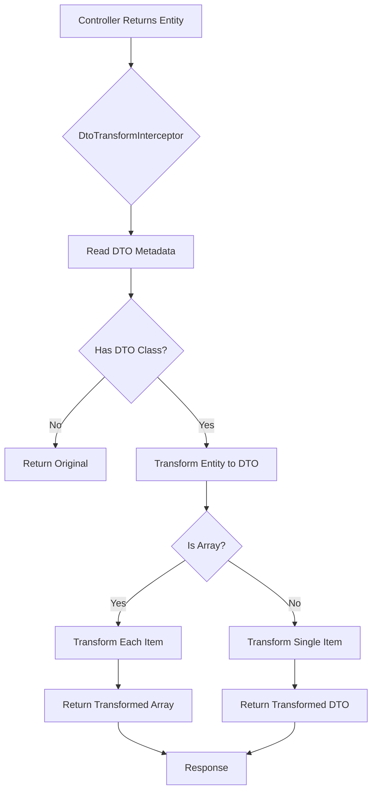
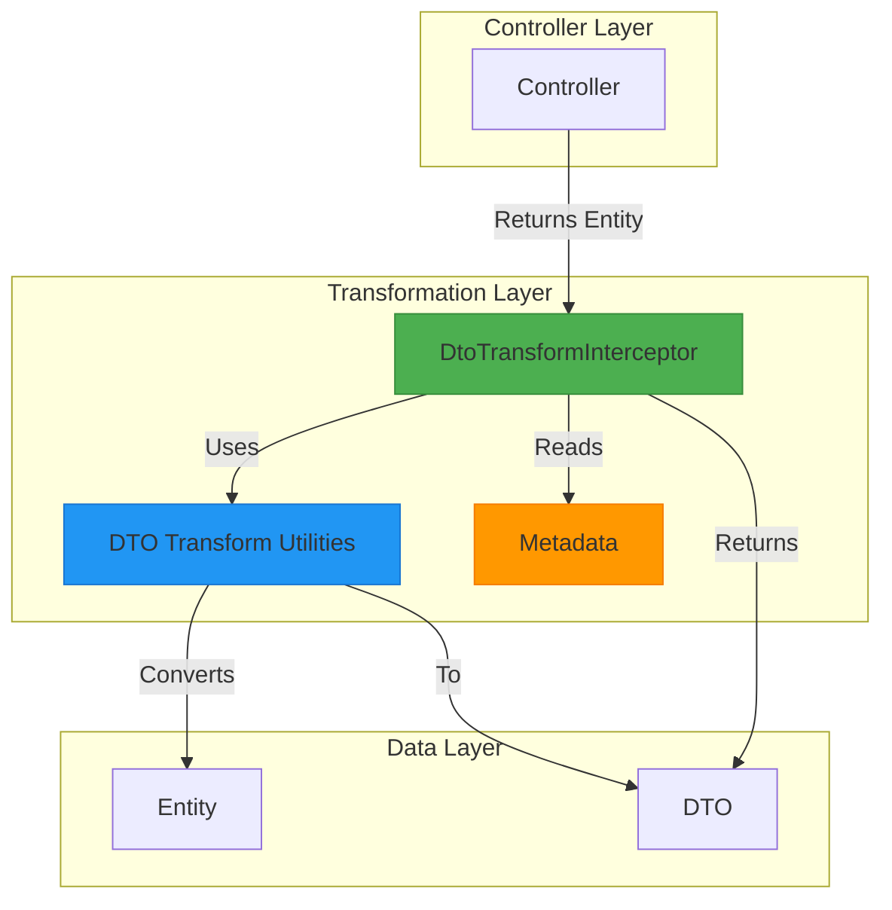
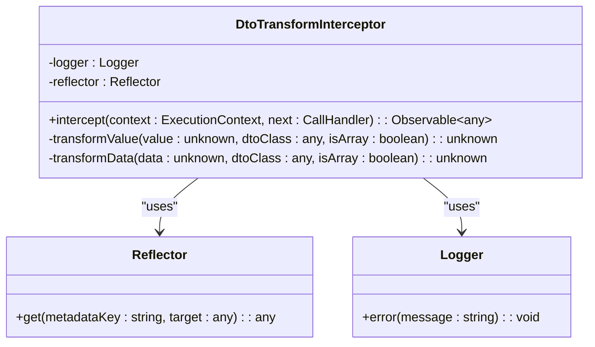
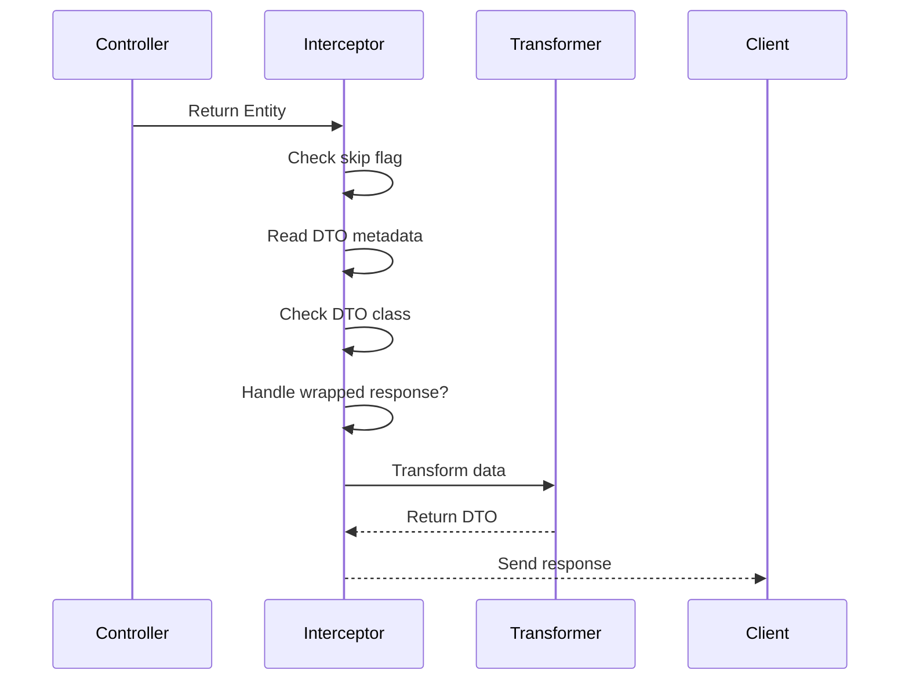

# DTO Transform Interceptor

<cite>
**Referenced Files in This Document**   
- [dto-transform.interceptor.ts](file://apps/server/src/shared/interceptor/dto-transform.interceptor.ts)
- [use-dto.decorator.ts](file://packages/decorator/src/use-dto.decorator.ts)
- [metadata.constants.ts](file://packages/decorator/src/constants/metadata.constants.ts)
- [dto-transform.util.ts](file://apps/server/src/shared/util/dto-transform.util.ts)
- [response.util.ts](file://apps/server/src/shared/util/response.util.ts)
- [abstract.entity.ts](file://packages/entity/src/abstract.entity.ts)
- [api-response-entity.decorator.ts](file://packages/decorator/src/api-response-entity.decorator.ts)
- [response-entity.interceptor.ts](file://apps/server/src/shared/interceptor/response-entity.interceptor.ts)
</cite>

## Table of Contents
1. [Introduction](#introduction)
2. [Core Functionality](#core-functionality)
3. [Architecture Overview](#architecture-overview)
4. [Implementation Details](#implementation-details)
5. [Decorator Integration](#decorator-integration)
6. [Utility Functions](#utility-functions)
7. [Interception Flow](#interception-flow)
8. [Error Handling](#error-handling)
9. [Migration and Deprecation](#migration-and-deprecation)
10. [Best Practices](#best-practices)

## Introduction

The DTO Transform Interceptor is a NestJS interceptor responsible for automatically transforming Entity objects into their corresponding Data Transfer Object (DTO) representations in API responses. This component eliminates the need for manual transformation in controllers, promoting cleaner code and consistent response formatting across the application.

The interceptor works in conjunction with decorators and metadata to determine the appropriate DTO class for transformation, handling both single entities and arrays of entities. It integrates seamlessly with the response processing pipeline, ensuring transformed data is properly formatted before being sent to clients.

**Section sources**
- [dto-transform.interceptor.ts](file://apps/server/src/shared/interceptor/dto-transform.interceptor.ts)

## Core Functionality

The DTO Transform Interceptor provides automatic conversion of Entity instances to DTOs based on metadata attached to controller methods. This functionality enables controllers to return raw Entity instances while ensuring clients receive properly structured DTOs.

Key features include:
- Automatic detection of DTO transformation requirements via metadata
- Support for both single entities and arrays of entities
- Integration with wrapped responses that contain metadata and status information
- Fallback mechanisms for error scenarios
- Configurable skipping of transformation for specific endpoints

The interceptor operates during the response phase of request processing, transforming data after business logic execution but before the final response is constructed.



**Diagram sources**
- [dto-transform.interceptor.ts](file://apps/server/src/shared/interceptor/dto-transform.interceptor.ts)

**Section sources**
- [dto-transform.interceptor.ts](file://apps/server/src/shared/interceptor/dto-transform.interceptor.ts)

## Architecture Overview

The DTO transformation system follows a metadata-driven architecture where decorators attach information to controller methods, and interceptors consume this information to perform automated operations. This separation of concerns allows for declarative programming patterns where developers specify what should happen rather than how it should happen.

The architecture consists of three main components:
1. Decorators that define transformation requirements
2. The interceptor that performs the actual transformation
3. Utility functions that handle the transformation logic

These components work together in a pipeline that processes responses before they are sent to clients.



**Diagram sources**
- [dto-transform.interceptor.ts](file://apps/server/src/shared/interceptor/dto-transform.interceptor.ts)
- [dto-transform.util.ts](file://apps/server/src/shared/util/dto-transform.util.ts)
- [metadata.constants.ts](file://packages/decorator/src/constants/metadata.constants.ts)

## Implementation Details

The DtoTransformInterceptor class implements NestJS's NestInterceptor interface, hooking into the request-response cycle to transform outgoing data. The interceptor uses NestJS's Reflector service to read metadata attached to controller methods, determining the appropriate DTO class and transformation options.

The implementation follows a structured process:
1. Check for skip transformation flag
2. Extract DTO class and array metadata
3. Apply transformation to response data
4. Handle errors gracefully with fallback behavior

The interceptor is designed to be non-intrusive, only acting when explicit transformation instructions are present via metadata.



**Diagram sources**
- [dto-transform.interceptor.ts](file://apps/server/src/shared/interceptor/dto-transform.interceptor.ts)

**Section sources**
- [dto-transform.interceptor.ts](file://apps/server/src/shared/interceptor/dto-transform.interceptor.ts)

## Decorator Integration

The DTO Transform Interceptor relies on metadata set by decorators, primarily the @ApiResponseEntity decorator, to determine transformation requirements. The interceptor reads specific metadata keys to identify the target DTO class and whether the response should be treated as an array.

Three key metadata constants are used:
- DTO_CLASS_METADATA: Specifies the DTO class to use for transformation
- DTO_IS_ARRAY_METADATA: Indicates whether the response contains an array of entities
- SKIP_DTO_TRANSFORM: Allows skipping transformation for specific endpoints

This metadata-driven approach enables declarative configuration of transformation behavior without requiring changes to interceptor logic.

```mermaid
flowchart TD
A[@ApiResponseEntity Decorator] --> B[Set Metadata]
B --> C[DTO_CLASS_METADATA]
B --> D[DTO_IS_ARRAY_METADATA]
C --> E[DtoTransformInterceptor]
D --> E
E --> F[Transform Response]
G[@SkipDtoTransform Decorator] --> H[Set SKIP_DTO_TRANSFORM]
H --> I[DtoTransformInterceptor]
I --> J[Skip Transformation]
```

**Diagram sources**
- [metadata.constants.ts](file://packages/decorator/src/constants/metadata.constants.ts)
- [dto-transform.interceptor.ts](file://apps/server/src/shared/interceptor/dto-transform.interceptor.ts)

**Section sources**
- [metadata.constants.ts](file://packages/decorator/src/constants/metadata.constants.ts)

## Utility Functions

The transformation process leverages utility functions to handle the actual conversion logic. The isEntity function checks whether a value is an instance of AbstractEntity, determining if transformation is needed. The transformToDto function performs the actual conversion using class-transformer's plainToInstance method.

These utilities provide reusable transformation logic that can be called from multiple locations while maintaining consistency in transformation behavior. They handle edge cases such as null/undefined values and support both single entities and arrays.

```mermaid
classDiagram
class dtoTransformUtil {
+isEntity(value : unknown) : value is AbstractEntity
+transformToDto(dtoClass : Constructor, data : unknown, options? : {isArray? : boolean}) : T | T[] | unknown
}
class responseUtil {
+isWrappedResponse(value : unknown) : value is WrappedResponse
+wrapResponse(data : TData, options : ResponseWrapOptions) : WrappedResponse
}
class AbstractEntity {
+id : string
+seq : number
+createdAt : Date
+updatedAt : Date | null
+removedAt : Date | null
}
dtoTransformUtil --> AbstractEntity : "checks instance of"
responseUtil --> AbstractEntity : "uses symbol for wrapping"
```

**Diagram sources**
- [dto-transform.util.ts](file://apps/server/src/shared/util/dto-transform.util.ts)
- [response.util.ts](file://apps/server/src/shared/util/response.util.ts)
- [abstract.entity.ts](file://packages/entity/src/abstract.entity.ts)

**Section sources**
- [dto-transform.util.ts](file://apps/server/src/shared/util/dto-transform.util.ts)
- [response.util.ts](file://apps/server/src/shared/util/response.util.ts)

## Interception Flow

The interception process follows a specific sequence of operations that ensures consistent transformation behavior across all endpoints. When a request is processed, the interceptor executes in the response phase, after the controller has returned its value but before the response is finalized.

The flow begins with checking for the skip transformation flag, allowing certain endpoints to bypass transformation when needed. If transformation is not skipped, the interceptor retrieves the DTO class metadata and array flag from the handler. If no DTO class is specified, the original value is returned unchanged.

For values that require transformation, the interceptor handles both direct data and wrapped responses, ensuring consistent behavior regardless of response structure.



**Diagram sources**
- [dto-transform.interceptor.ts](file://apps/server/src/shared/interceptor/dto-transform.interceptor.ts)
- [dto-transform.util.ts](file://apps/server/src/shared/util/dto-transform.util.ts)

**Section sources**
- [dto-transform.interceptor.ts](file://apps/server/src/shared/interceptor/dto-transform.interceptor.ts)

## Error Handling

The DTO Transform Interceptor includes robust error handling to ensure application stability even when transformation fails. When an error occurs during transformation, the interceptor logs the error message and returns the original value as a fallback.

This fail-safe approach prevents transformation issues from causing server errors, maintaining API availability while providing visibility into transformation problems through logging. The error handling is implemented in the map operator of the Observable chain, catching any exceptions thrown during the transformation process.

The interceptor specifically handles common edge cases including null/undefined values, non-entity objects, and already transformed DTOs, ensuring that only appropriate values are transformed.

**Section sources**
- [dto-transform.interceptor.ts](file://apps/server/src/shared/interceptor/dto-transform.interceptor.ts)

## Migration and Deprecation

The DTO Transform Interceptor represents an evolution from previous patterns that required manual transformation or different decorator-based approaches. The @UseDto decorator and toDto method on AbstractEntity are now deprecated in favor of the automated interceptor-based approach.

This migration provides several benefits:
- Elimination of manual transformation calls in controllers
- Consistent transformation behavior across all endpoints
- Reduced boilerplate code
- Centralized transformation logic

The deprecated methods remain available for backward compatibility but emit warning messages when used, guiding developers toward the preferred interceptor-based pattern.

**Section sources**
- [use-dto.decorator.ts](file://packages/decorator/src/use-dto.decorator.ts)
- [abstract.entity.ts](file://packages/entity/src/abstract.entity.ts)

## Best Practices

When working with the DTO Transform Interceptor, several best practices should be followed:

1. Always use @ApiResponseEntity decorator to specify the expected DTO class
2. Use @SkipDtoTransform when returning non-entity data that should not be transformed
3. Ensure DTO classes are properly defined with appropriate field mappings
4. Test transformation behavior with both single entities and arrays
5. Monitor logs for any transformation errors or warnings

The interceptor should be registered globally or at the module level to ensure consistent application across all endpoints. When creating new controllers, developers should rely on the interceptor for transformation rather than implementing manual conversion logic.

**Section sources**
- [dto-transform.interceptor.ts](file://apps/server/src/shared/interceptor/dto-transform.interceptor.ts)
- [api-response-entity.decorator.ts](file://packages/decorator/src/api-response-entity.decorator.ts)
- [response-entity.interceptor.ts](file://apps/server/src/shared/interceptor/response-entity.interceptor.ts)