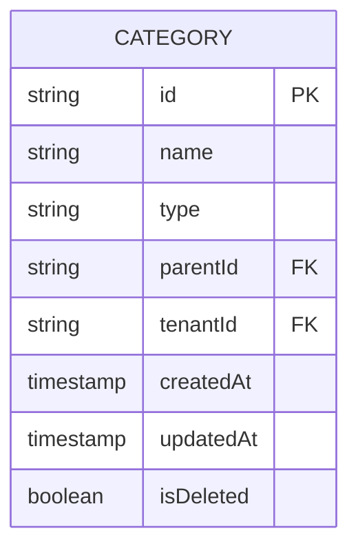
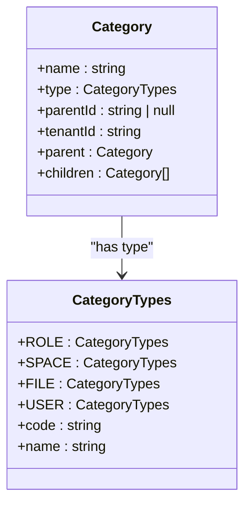
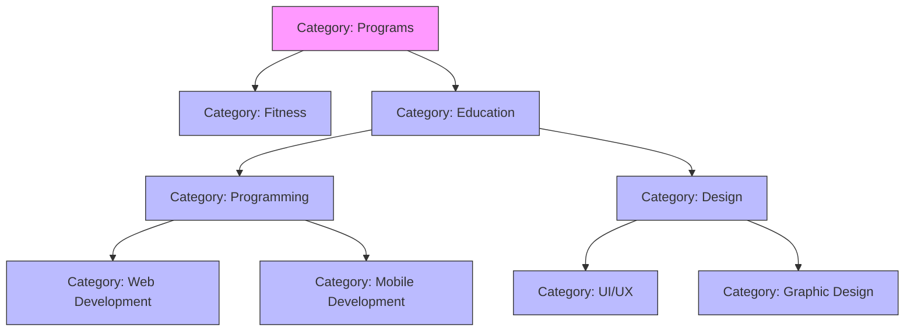
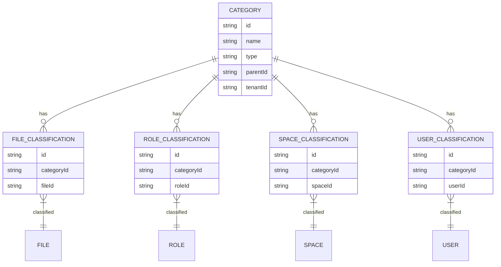
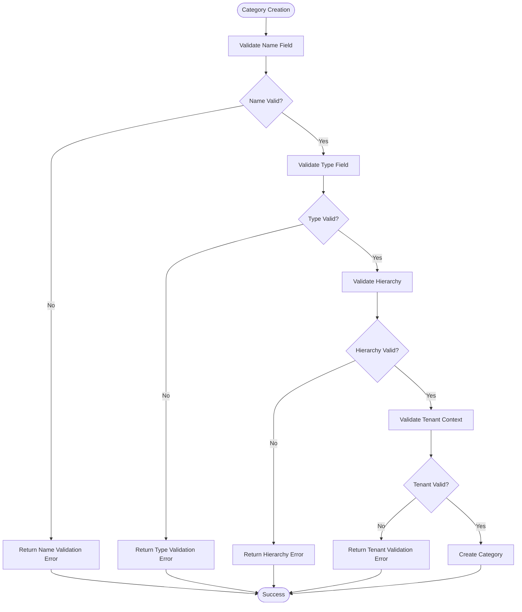
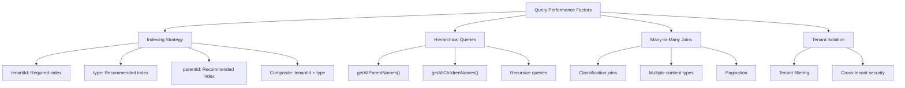
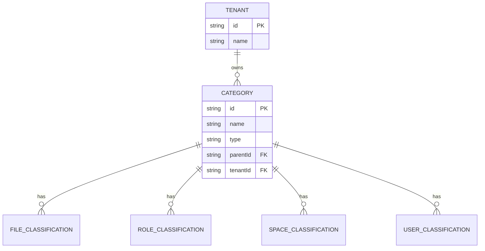

# Category Data Model

<cite>
**Referenced Files in This Document**   
- [category.entity.ts](file://packages/entity/src/category.entity.ts)
- [category.dto.ts](file://packages/dto/src/category.dto.ts)
- [category-types.enum.ts](file://packages/enum/src/category-types.enum.ts)
- [category-names.enum.ts](file://packages/enum/src/category-names.enum.ts)
- [categories.repository.ts](file://apps/server/src/shared/repository/categories.repository.ts)
- [categories.service.ts](file://apps/server/src/shared/service/resources/categories.service.ts)
</cite>

## Table of Contents
1. [Introduction](#introduction)
2. [Category Schema](#category-schema)
3. [Category Types and Classification](#category-types-and-classification)
4. [Hierarchical Relationships](#hierarchical-relationships)
5. [Content Entity Relationships](#content-entity-relationships)
6. [Validation Rules](#validation-rules)
7. [Performance Considerations](#performance-considerations)
8. [Tenant Context Relationships](#tenant-context-relationships)
9. [Conclusion](#conclusion)

## Introduction
The Category entity in prj-core serves as a fundamental classification system for organizing various content types within the application. This documentation provides a comprehensive overview of the Category data model, including its schema, hierarchical structure, relationships with content entities, validation rules, and performance considerations. The Category system enables flexible categorization across different contexts while maintaining data integrity through well-defined constraints and tenant isolation.

**Section sources**
- [category.entity.ts](file://packages/entity/src/category.entity.ts#L1-L63)
- [category.dto.ts](file://packages/dto/src/category.dto.ts#L1-L29)

## Category Schema
The Category entity schema defines the core attributes that characterize each category within the system. The schema includes essential fields for identification, naming, typing, and hierarchical organization.

**Diagram sources**
- [category.entity.ts](file://packages/entity/src/category.entity.ts#L5-L9)

The Category schema consists of the following key fields:
- **name**: String field representing the display name of the category
- **type**: Enum field defining the category classification type
- **parentId**: Optional foreign key establishing parent-child hierarchical relationships
- **tenantId**: Required field establishing tenant context ownership
- Inherited fields from AbstractEntity: id, createdAt, updatedAt, isDeleted

**Section sources**
- [category.entity.ts](file://packages/entity/src/category.entity.ts#L5-L9)
- [category.dto.ts](file://packages/dto/src/category.dto.ts#L10-L27)

## Category Types and Classification
The Category system implements a type-based classification mechanism that determines the usage context and behavior of categories within the application. The CategoryTypes enum defines the available category types, each serving a specific purpose in the system architecture.

**Diagram sources**
- [category-types.enum.ts](file://packages/enum/src/category-types.enum.ts#L1-L25)
- [category.entity.ts](file://packages/entity/src/category.entity.ts#L5-L63)

The available category types include:
- **ROLE**: Used for role-based access control and permission management
- **SPACE**: Organizes spatial or organizational units within the application
- **FILE**: Classifies file and media content types
- **USER**: Categorizes user profiles and account types

Additionally, the CategoryNames enum provides predefined category names for specific content types, ensuring consistency across the system:
- **THUMBNAIL_IMAGE**: Thumbnail images for content preview
- **THUMBNAIL_VIDEO**: Thumbnail videos for content preview
- **VIDEO_CONTENT**: Main video content
- **AUDIO_CONTENT**: Audio files and recordings
- **DOCUMENT_CONTENT**: Document files and text content
- **IMAGE_CONTENT**: Image files and visual content

**Section sources**
- [category-types.enum.ts](file://packages/enum/src/category-types.enum.ts#L1-L25)
- [category-names.enum.ts](file://packages/enum/src/category-names.enum.ts#L1-L36)

## Hierarchical Relationships
The Category entity supports hierarchical organization through parent-child relationships, enabling the creation of nested category structures. This hierarchical model allows for multi-level classification and organization of content.

**Diagram sources**
- [category.entity.ts](file://packages/entity/src/category.entity.ts#L8-L12)

The hierarchical relationships are implemented through:
- **parentId**: A nullable string field that references the parent category's ID
- **parent**: An optional relationship property that provides access to the parent category object
- **children**: An optional array property containing child category objects

The Category entity includes utility methods for navigating the hierarchy:
- `getAllParentNames()`: Recursively collects names of all parent categories from current to root
- `getAllChildrenNames()`: Recursively collects names of all descendant categories

The system does not enforce a maximum hierarchy depth in the schema, but practical limitations may be implemented at the service level to prevent excessively deep nesting that could impact performance.

**Section sources**
- [category.entity.ts](file://packages/entity/src/category.entity.ts#L8-L53)

## Content Entity Relationships
Categories establish many-to-many relationships with various content entities such as Programs, Exercises, and other domain objects through classification entities. This flexible association model enables content to be categorized across multiple dimensions simultaneously.

**Diagram sources**
- [category.entity.ts](file://packages/entity/src/category.entity.ts#L5-L63)
- [categories.repository.ts](file://apps/server/src/shared/repository/categories.repository.ts#L1-L100)

The relationship pattern follows a classification entity approach:
- Each content type (File, Role, Space, User) has a corresponding classification entity
- Classification entities serve as join tables in the many-to-many relationships
- This design allows for additional metadata to be stored about the classification relationship
- The pattern ensures referential integrity and enables efficient querying

The CategoriesService and CategoriesRepository implement methods for managing these relationships, including adding, removing, and querying classifications across different entity types.

**Section sources**
- [category.entity.ts](file://packages/entity/src/category.entity.ts#L5-L63)
- [categories.repository.ts](file://apps/server/src/shared/repository/categories.repository.ts#L1-L100)
- [categories.service.ts](file://apps/server/src/shared/service/resources/categories.service.ts#L1-L200)

## Validation Rules
The Category data model enforces several validation rules to maintain data integrity and consistency across the system. These rules are implemented at both the DTO (Data Transfer Object) and entity levels.

**Diagram sources**
- [category.dto.ts](file://packages/dto/src/category.dto.ts#L10-L27)
- [category.entity.ts](file://packages/entity/src/category.entity.ts#L5-L63)

The validation rules include:

### Naming Validation
- Name field is required and must be a non-empty string
- Default value is an empty string (enforced at DTO level)
- No explicit length constraints in schema, but practical limits may be enforced by UI

### Type Constraints
- Type field is required and must be a valid CategoryTypes enum value
- Default type is CategoryTypes.Role if not specified
- Only predefined category types are allowed (ROLE, SPACE, FILE, USER)

### Hierarchy Validation
- ParentId must reference an existing category within the same tenant
- Circular references are prevented (a category cannot be its own ancestor)
- Parent category must have the same type as the child category
- While not explicitly limited in the schema, practical depth limitations may be enforced

### Tenant Context Validation
- All categories must belong to a tenant
- Cross-tenant category references are prohibited
- Users can only access categories within their assigned tenant context

These validation rules are implemented through decorators in the CategoryDto class and enforced by the CategoriesService during CRUD operations.

**Section sources**
- [category.dto.ts](file://packages/dto/src/category.dto.ts#L10-L27)
- [category.entity.ts](file://packages/entity/src/category.entity.ts#L5-L63)

## Performance Considerations
The Category data model and its relationships have several performance implications that must be considered when querying and managing categories, particularly when dealing with hierarchical data and many-to-many relationships.

**Diagram sources**
- [categories.repository.ts](file://apps/server/src/shared/repository/categories.repository.ts#L1-L100)
- [categories.service.ts](file://apps/server/src/shared/service/resources/categories.service.ts#L1-L200)

### Indexing Strategies
To optimize query performance, the following indexing strategy is recommended:
- **tenantId**: Required index to support tenant isolation and filtering
- **type**: Index to optimize queries by category type
- **parentId**: Index to improve performance of hierarchical queries
- **Composite index on tenantId + type**: For queries that filter by both tenant and type

### Querying by Multiple Categories
When filtering content by multiple categories, the system should:
- Use batch operations to minimize database round-trips
- Implement proper pagination for large result sets
- Consider caching frequently accessed category combinations
- Use efficient join strategies when querying through classification entities

### Hierarchical Query Performance
Recursive operations like `getAllParentNames()` and `getAllChildrenNames()` can be expensive for deeply nested categories. Performance optimizations include:
- Limiting the maximum hierarchy depth
- Implementing caching for frequently accessed category paths
- Using database-level recursive queries when available
- Considering materialized paths for high-read scenarios

### Service-Level Optimizations
The CategoriesService implements several performance optimizations:
- Batch operations for creating/updating multiple categories
- Efficient querying with proper filtering and pagination
- Caching strategies for frequently accessed category data
- Connection pooling and query optimization

**Section sources**
- [categories.repository.ts](file://apps/server/src/shared/repository/categories.repository.ts#L1-L100)
- [categories.service.ts](file://apps/server/src/shared/service/resources/categories.service.ts#L1-L200)

## Tenant Context Relationships
The Category entity is designed with multi-tenancy in mind, ensuring that categories are properly isolated within their respective tenant contexts. This tenant-aware design is fundamental to the system's security and data isolation model.

**Diagram sources**
- [category.entity.ts](file://packages/entity/src/category.entity.ts#L9-L13)
- [categories.service.ts](file://apps/server/src/shared/service/resources/categories.service.ts#L1-L200)

Key aspects of the tenant context relationship include:
- **Mandatory tenant association**: Every category must belong to a tenant
- **Cross-tenant isolation**: Categories from one tenant cannot be accessed or referenced by another tenant
- **Tenant-specific hierarchies**: Category hierarchies are maintained within each tenant context
- **Type consistency across tenants**: Category types are system-wide constants, but instances are tenant-specific

The ContextService, injected into the CategoriesService, ensures that all category operations respect tenant boundaries. When creating, updating, or querying categories, the system validates that the operation is performed within the correct tenant context.

This design enables the system to support multiple independent organizations or business units within a single application instance, each with their own category structures and classifications, while maintaining data security and isolation.

**Section sources**
- [category.entity.ts](file://packages/entity/src/category.entity.ts#L9-L13)
- [categories.service.ts](file://apps/server/src/shared/service/resources/categories.service.ts#L1-L200)

## Conclusion
The Category data model in prj-core provides a flexible and robust classification system that supports hierarchical organization, multi-tenancy, and many-to-many relationships with various content entities. The model is designed with performance and data integrity in mind, implementing comprehensive validation rules and optimization strategies.

Key strengths of the Category system include:
- Clear type-based classification that defines usage contexts
- Flexible hierarchical relationships enabling nested categorization
- Proper tenant isolation ensuring data security in multi-tenant environments
- Efficient many-to-many relationships with content entities through classification entities
- Comprehensive validation rules that maintain data consistency

For optimal performance, applications should leverage the recommended indexing strategies, implement appropriate caching mechanisms, and follow best practices for querying hierarchical data. The system's design allows for extensibility while maintaining strong data integrity and security constraints.

**Section sources**
- [category.entity.ts](file://packages/entity/src/category.entity.ts#L1-L63)
- [category.dto.ts](file://packages/dto/src/category.dto.ts#L1-L29)
- [category-types.enum.ts](file://packages/enum/src/category-types.enum.ts#L1-L25)
- [categories.repository.ts](file://apps/server/src/shared/repository/categories.repository.ts#L1-L100)
- [categories.service.ts](file://apps/server/src/shared/service/resources/categories.service.ts#L1-L200)