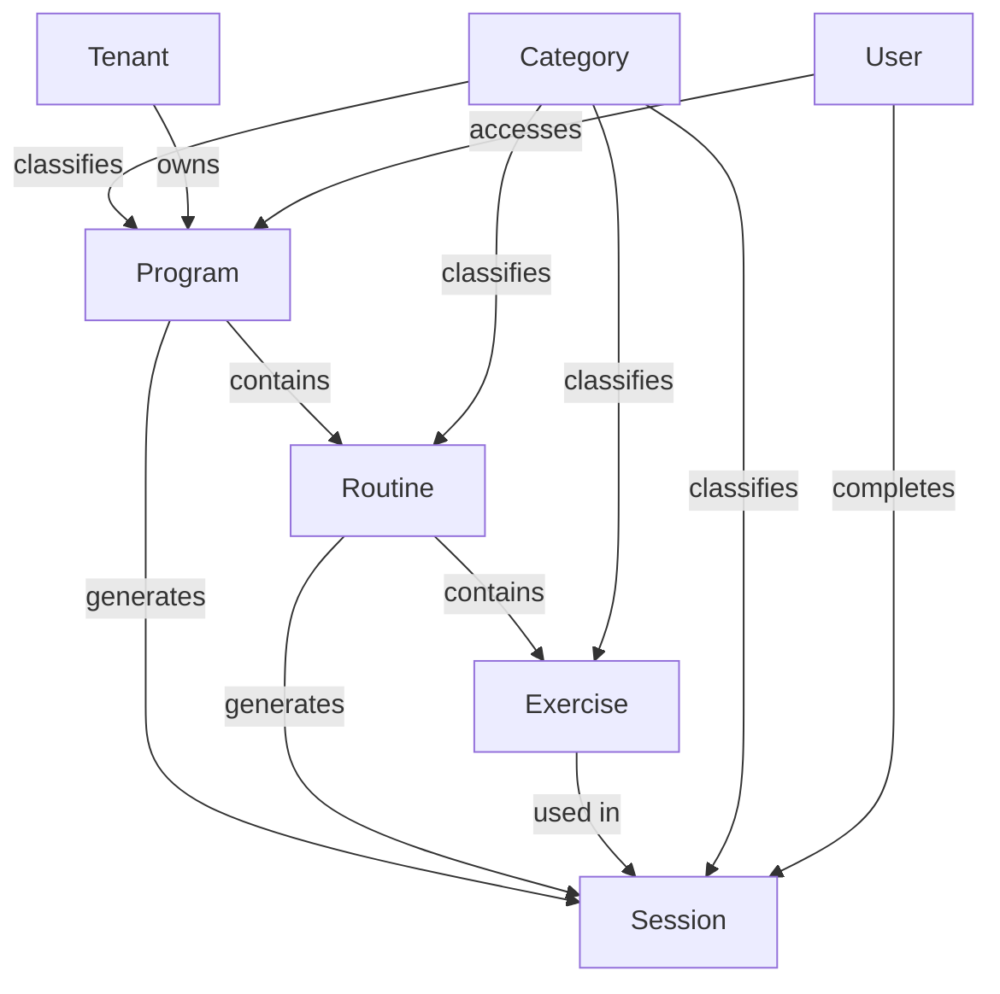
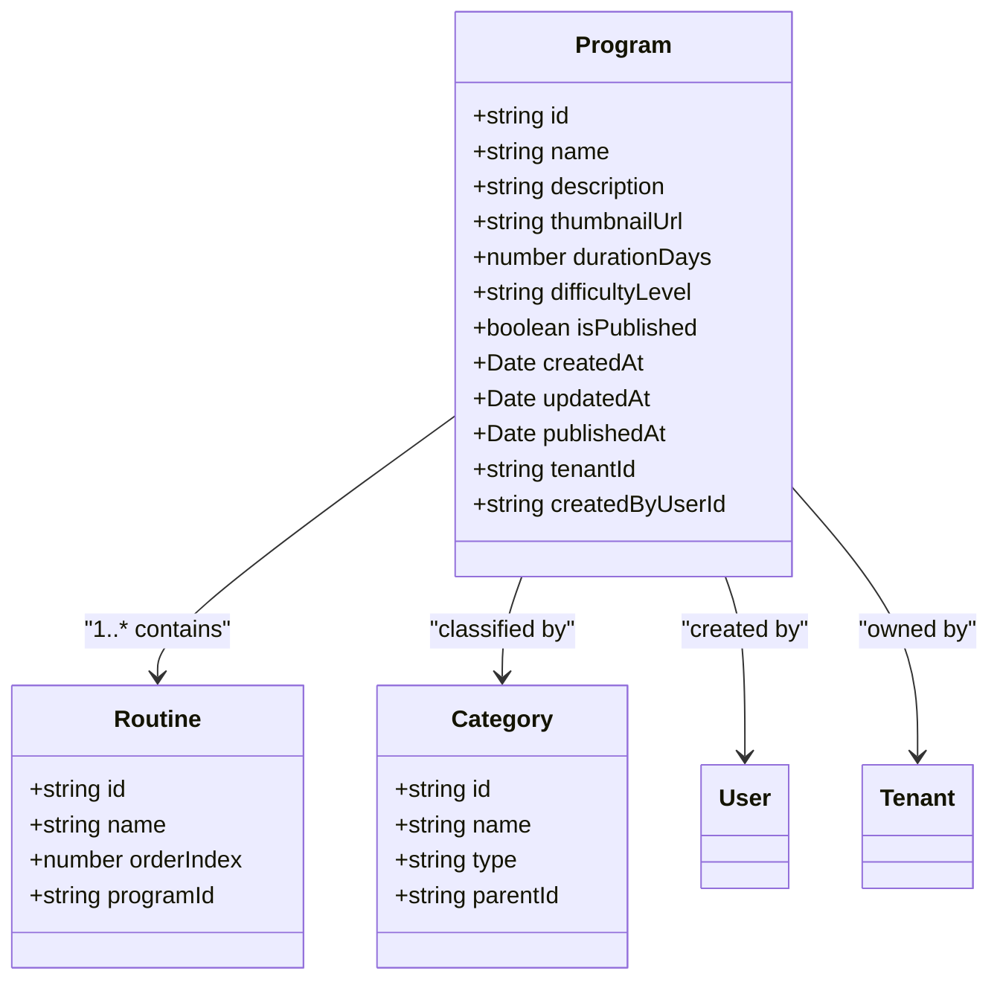
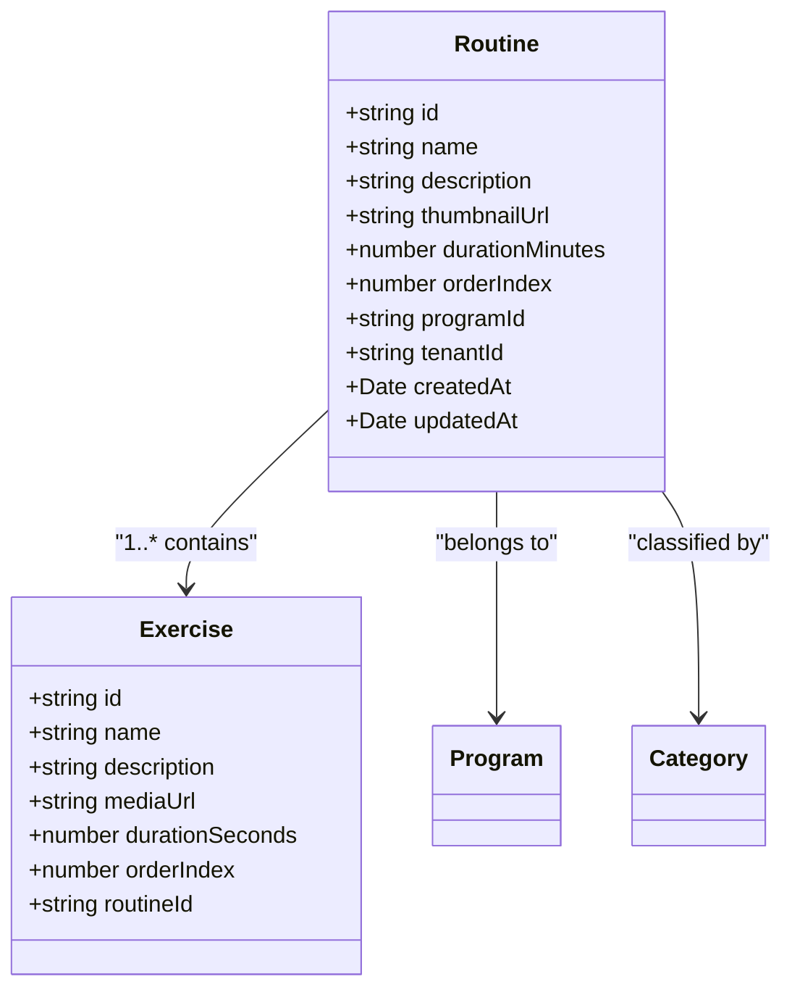
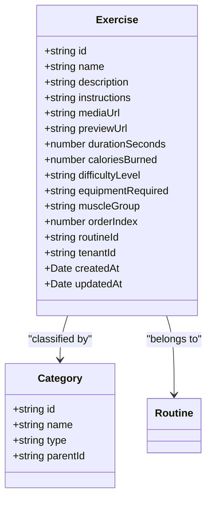
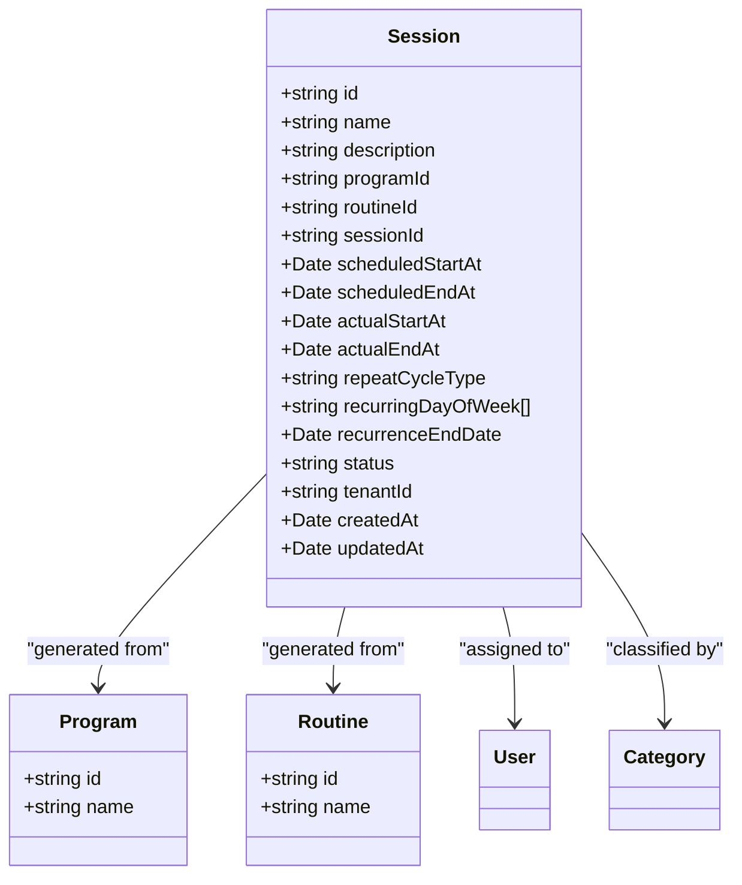
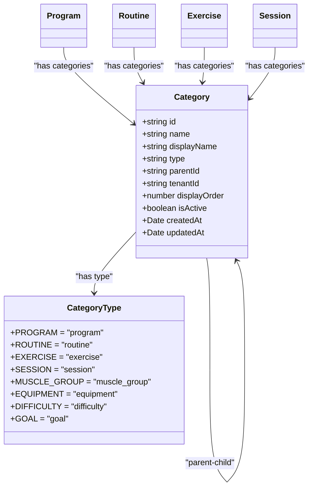
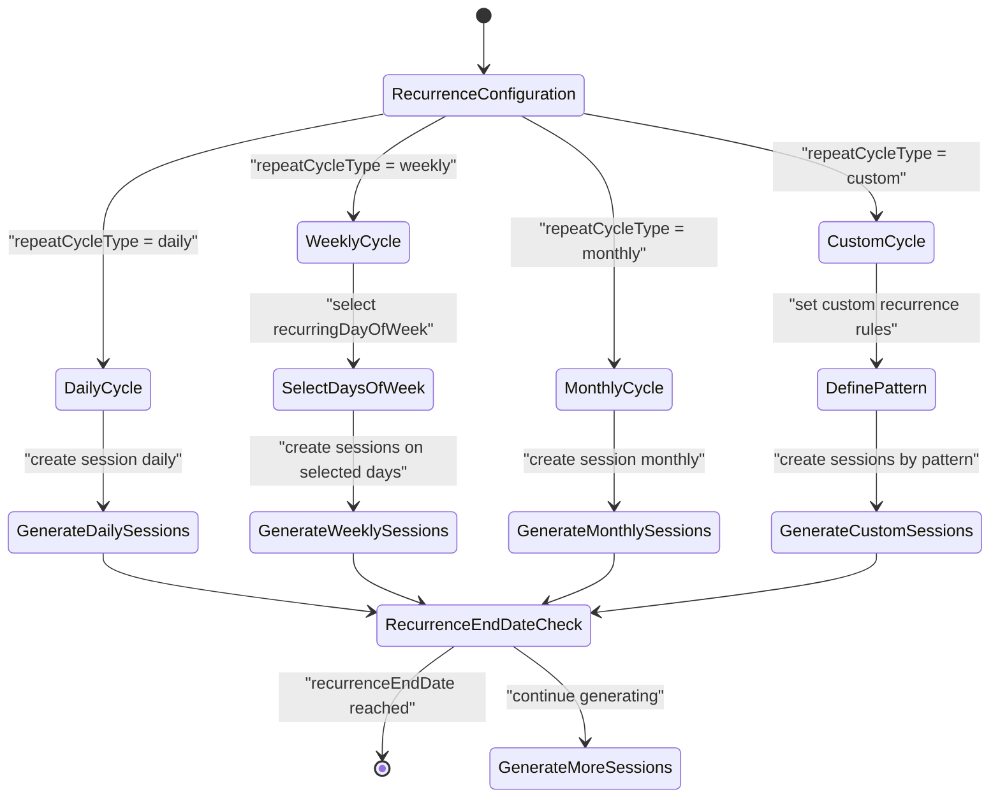
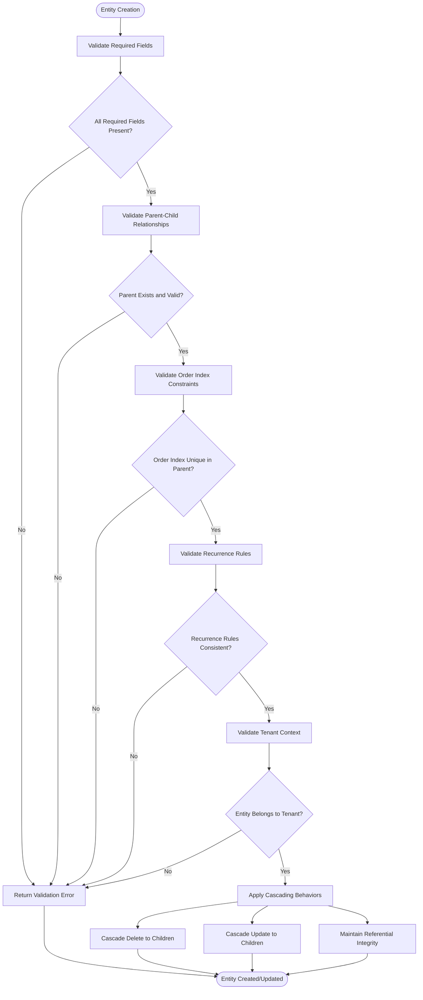
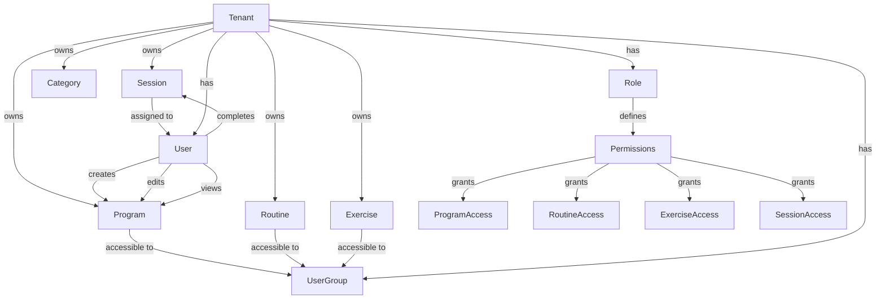

# Content Management Data Models

<cite>
**Referenced Files in This Document**   
- [program.entity.ts](file://packages/schema/src/entity/program.entity.ts)
- [routine.entity.ts](file://packages/schema/src/entity/routine.entity.ts)
- [exercise.entity.ts](file://packages/schema/src/entity/exercise.entity.ts)
- [session.entity.ts](file://packages/schema/src/entity/session.entity.ts)
- [category.entity.ts](file://packages/schema/src/entity/category.entity.ts)
- [program.dto.ts](file://packages/schema/src/dto/program.dto.ts)
- [routine.dto.ts](file://packages/schema/src/dto/routine.dto.ts)
- [exercise.dto.ts](file://packages/schema/src/dto/exercise.dto.ts)
- [session.dto.ts](file://packages/schema/src/dto/session.dto.ts)
- [category.dto.ts](file://packages/schema/src/dto/category.dto.ts)
- [abstract.entity.ts](file://packages/schema/src/entity/abstract.entity.ts)
- [repeat-cycle-types.enum.ts](file://packages/schema/src/enum/repeat-cycle-types.enum.ts)
- [recurring-day-of-week.enum.ts](file://packages/schema/src/enum/recurring-day-of-week.enum.ts)
</cite>

## Table of Contents
1. [Introduction](#introduction)
2. [Core Entity Hierarchy](#core-entity-hierarchy)
3. [Program Entity](#program-entity)
4. [Routine Entity](#routine-entity)
5. [Exercise Entity](#exercise-entity)
6. [Session Entity](#session-entity)
7. [Categorization System](#categorization-system)
8. [Scheduling and Recurrence](#scheduling-and-recurrence)
9. [Data Integrity and Validation](#data-integrity-and-validation)
10. [Performance and Indexing](#performance-and-indexing)
11. [User and Tenant Contexts](#user-and-tenant-contexts)
12. [Conclusion](#conclusion)

## Introduction
The content management system in prj-core implements a hierarchical structure for organizing fitness and wellness content through four primary entities: Program, Routine, Exercise, and Session. These entities form a nested relationship where Programs contain Routines, Routines contain Exercises, and Sessions represent scheduled instances of content delivery. This documentation details the data model architecture, including entity relationships, categorization systems, scheduling logic, data integrity constraints, and performance considerations.

## Core Entity Hierarchy



**Diagram sources**
- [program.entity.ts](file://packages/schema/src/entity/program.entity.ts)
- [routine.entity.ts](file://packages/schema/src/entity/routine.entity.ts)
- [exercise.entity.ts](file://packages/schema/src/entity/exercise.entity.ts)
- [session.entity.ts](file://packages/schema/src/entity/session.entity.ts)
- [category.entity.ts](file://packages/schema/src/entity/category.entity.ts)

**Section sources**
- [program.entity.ts](file://packages/schema/src/entity/program.entity.ts#L1-L50)
- [routine.entity.ts](file://packages/schema/src/entity/routine.entity.ts#L1-L45)
- [exercise.entity.ts](file://packages/schema/src/entity/exercise.entity.ts#L1-L40)
- [session.entity.ts](file://packages/schema/src/entity/session.entity.ts#L1-L60)

## Program Entity

The Program entity represents a comprehensive content plan that serves as the top-level container in the hierarchy. Programs are composed of multiple Routines and can be scheduled to generate Sessions according to defined recurrence patterns.



**Diagram sources**
- [program.entity.ts](file://packages/schema/src/entity/program.entity.ts#L15-L100)
- [routine.entity.ts](file://packages/schema/src/entity/routine.entity.ts#L15-L30)
- [category.entity.ts](file://packages/schema/src/entity/category.entity.ts#L15-L25)

**Section sources**
- [program.entity.ts](file://packages/schema/src/entity/program.entity.ts#L1-L150)
- [program.dto.ts](file://packages/schema/src/dto/program.dto.ts#L1-L80)

## Routine Entity

Routines represent structured sequences within a Program, containing multiple Exercises organized in a specific order. Each Routine is associated with a parent Program and contributes to the overall content flow.



**Diagram sources**
- [routine.entity.ts](file://packages/schema/src/entity/routine.entity.ts#L15-L90)
- [exercise.entity.ts](file://packages/schema/src/entity/exercise.entity.ts#L15-L35)
- [category.entity.ts](file://packages/schema/src/entity/category.entity.ts#L15-L25)

**Section sources**
- [routine.entity.ts](file://packages/schema/src/entity/routine.entity.ts#L1-L120)
- [routine.dto.ts](file://packages/schema/src/dto/routine.dto.ts#L1-L70)

## Exercise Entity

Exercises are the atomic units of content within the system, representing individual activities or movements. Each Exercise contains detailed metadata and media references, and is organized within Routines.



**Diagram sources**
- [exercise.entity.ts](file://packages/schema/src/entity/exercise.entity.ts#L15-L110)
- [category.entity.ts](file://packages/schema/src/entity/category.entity.ts#L15-L25)

**Section sources**
- [exercise.entity.ts](file://packages/schema/src/entity/exercise.entity.ts#L1-L150)
- [exercise.dto.ts](file://packages/schema/src/dto/exercise.dto.ts#L1-L90)

## Session Entity

Sessions represent scheduled instances of content delivery, generated from Programs and Routines according to defined recurrence patterns. Sessions track user engagement and completion status.



**Diagram sources**
- [session.entity.ts](file://packages/schema/src/entity/session.entity.ts#L15-L130)
- [program.entity.ts](file://packages/schema/src/entity/program.entity.ts#L15-L25)
- [routine.entity.ts](file://packages/schema/src/entity/routine.entity.ts#L15-L25)
- [category.entity.ts](file://packages/schema/src/entity/category.entity.ts#L15-L25)

**Section sources**
- [session.entity.ts](file://packages/schema/src/entity/session.entity.ts#L1-L180)
- [session.dto.ts](file://packages/schema/src/dto/session.dto.ts#L1-L100)

## Categorization System

The categorization system provides a flexible taxonomy for classifying content entities across multiple dimensions. Categories form hierarchical trees and can be applied to Programs, Routines, Exercises, and Sessions.



**Diagram sources**
- [category.entity.ts](file://packages/schema/src/entity/category.entity.ts#L15-L80)
- [category.dto.ts](file://packages/schema/src/dto/category.dto.ts#L15-L40)

**Section sources**
- [category.entity.ts](file://packages/schema/src/entity/category.entity.ts#L1-L120)
- [category.dto.ts](file://packages/schema/src/dto/category.dto.ts#L1-L60)
- [category-types.enum.ts](file://packages/schema/src/enum/category-types.enum.ts#L1-L20)

## Scheduling and Recurrence

The scheduling system supports flexible recurrence patterns for generating Sessions from Programs and Routines. The recurrence logic accommodates various cycle types and day-of-week specifications.



**Diagram sources**
- [session.entity.ts](file://packages/schema/src/entity/session.entity.ts#L45-L75)
- [repeat-cycle-types.enum.ts](file://packages/schema/src/enum/repeat-cycle-types.enum.ts#L1-L15)
- [recurring-day-of-week.enum.ts](file://packages/schema/src/enum/recurring-day-of-week.enum.ts#L1-L15)

**Section sources**
- [session.entity.ts](file://packages/schema/src/entity/session.entity.ts#L30-L100)
- [repeat-cycle-types.enum.ts](file://packages/schema/src/enum/repeat-cycle-types.enum.ts#L1-L20)
- [recurring-day-of-week.enum.ts](file://packages/schema/src/enum/recurring-day-of-week.enum.ts#L1-L20)

## Data Integrity and Validation

The data model enforces strict integrity constraints and validation rules to maintain data quality and consistency across the content hierarchy.



**Diagram sources**
- [abstract.entity.ts](file://packages/schema/src/entity/abstract.entity.ts#L15-L40)
- [program.entity.ts](file://packages/schema/src/entity/program.entity.ts#L60-L90)
- [routine.entity.ts](file://packages/schema/src/entity/routine.entity.ts#L50-L80)
- [exercise.entity.ts](file://packages/schema/src/entity/exercise.entity.ts#L50-L80)

**Section sources**
- [abstract.entity.ts](file://packages/schema/src/entity/abstract.entity.ts#L1-L60)
- [program.entity.ts](file://packages/schema/src/entity/program.entity.ts#L50-L120)
- [routine.entity.ts](file://packages/schema/src/entity/routine.entity.ts#L40-L100)
- [exercise.entity.ts](file://packages/schema/src/entity/exercise.entity.ts#L40-L100)

## Performance and Indexing

The data model includes optimized indexing strategies to support efficient querying of nested content structures, filtering, and sorting operations.

```mermaid
erDiagram
PROGRAM {
string id PK
string name
string tenantId FK
string createdByUserId FK
boolean isPublished
number durationDays
string difficultyLevel
datetime createdAt
datetime updatedAt
datetime publishedAt
}
ROUTINE {
string id PK
string name
string programId FK
string tenantId FK
number orderIndex
number durationMinutes
datetime createdAt
datetime updatedAt
}
EXERCISE {
string id PK
string name
string routineId FK
string tenantId FK
number orderIndex
number durationSeconds
string difficultyLevel
datetime createdAt
datetime updatedAt
}
SESSION {
string id PK
string programId FK
string routineId FK
datetime scheduledStartAt
datetime scheduledEndAt
string repeatCycleType
datetime recurrenceEndDate
string status
string tenantId FK
datetime createdAt
datetime updatedAt
}
CATEGORY {
string id PK
string name
string type
string parentId FK
string tenantId FK
number displayOrder
boolean isActive
datetime createdAt
datetime updatedAt
}
PROGRAM ||--o{ ROUTINE : "contains"
ROUTINE ||--o{ EXERCISE : "contains"
PROGRAM ||--o{ SESSION : "generates"
ROUTINE ||--o{ SESSION : "generates"
CATEGORY ||--o{ CATEGORY : "parent-child"
PROGRAM ||--o{ CATEGORY : "classified by"
ROUTINE ||--o{ CATEGORY : "classified by"
EXERCISE ||--o{ CATEGORY : "classified by"
SESSION ||--o{ CATEGORY : "classified by"
index PROGRAM(tenantId, isPublished, createdAt)
index ROUTINE(programId, orderIndex)
index EXERCISE(routineId, orderIndex)
index SESSION(scheduledStartAt, tenantId, status)
index CATEGORY(tenantId, type, parentId)
```

**Diagram sources**
- [program.entity.ts](file://packages/schema/src/entity/program.entity.ts#L30-L50)
- [routine.entity.ts](file://packages/schema/src/entity/routine.entity.ts#L30-L50)
- [exercise.entity.ts](file://packages/schema/src/entity/exercise.entity.ts#L30-L50)
- [session.entity.ts](file://packages/schema/src/entity/session.entity.ts#L30-L50)
- [category.entity.ts](file://packages/schema/src/entity/category.entity.ts#L30-L50)

**Section sources**
- [program.entity.ts](file://packages/schema/src/entity/program.entity.ts#L50-L100)
- [routine.entity.ts](file://packages/schema/src/entity/routine.entity.ts#L50-L100)
- [exercise.entity.ts](file://packages/schema/src/entity/exercise.entity.ts#L50-L100)
- [session.entity.ts](file://packages/schema/src/entity/session.entity.ts#L50-L100)
- [category.entity.ts](file://packages/schema/src/entity/category.entity.ts#L50-L100)

## User and Tenant Contexts

The content management system operates within multi-tenant and multi-user contexts, with strict access controls and ownership relationships.



**Diagram sources**
- [program.entity.ts](file://packages/schema/src/entity/program.entity.ts#L25-L35)
- [session.entity.ts](file://packages/schema/src/entity/session.entity.ts#L25-L35)
- [category.entity.ts](file://packages/schema/src/entity/category.entity.ts#L25-L35)
- [abstract.entity.ts](file://packages/schema/src/entity/abstract.entity.ts#L15-L25)

**Section sources**
- [program.entity.ts](file://packages/schema/src/entity/program.entity.ts#L20-L60)
- [session.entity.ts](file://packages/schema/src/entity/session.entity.ts#L20-L60)
- [category.entity.ts](file://packages/schema/src/entity/category.entity.ts#L20-L60)
- [abstract.entity.ts](file://packages/schema/src/entity/abstract.entity.ts#L10-L50)

## Conclusion
The content management data model in prj-core establishes a robust hierarchical structure for organizing fitness and wellness content through the Program, Routine, Exercise, and Session entities. The model supports complex scheduling and recurrence patterns, flexible categorization across multiple dimensions, and strict data integrity constraints. With optimized indexing for performance and comprehensive tenant and user context management, the system provides a scalable foundation for content delivery and user engagement tracking. The cascading behaviors and validation rules ensure data consistency throughout the content hierarchy, while the multi-tenant architecture supports isolated content management for different organizations or user groups.