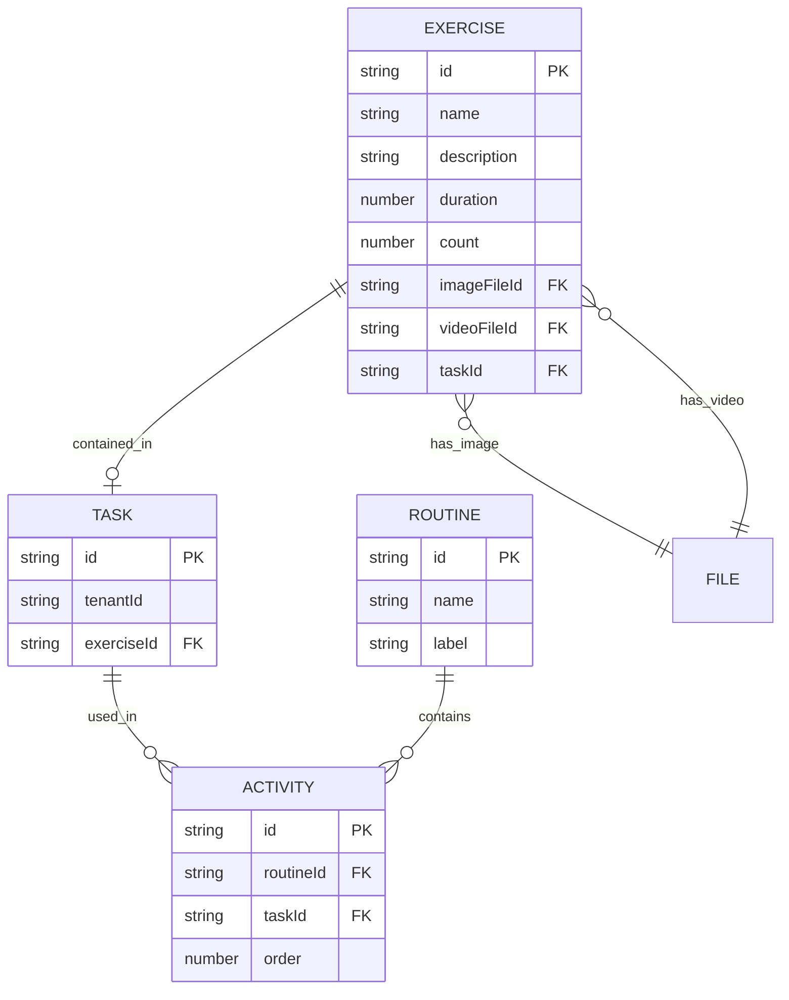
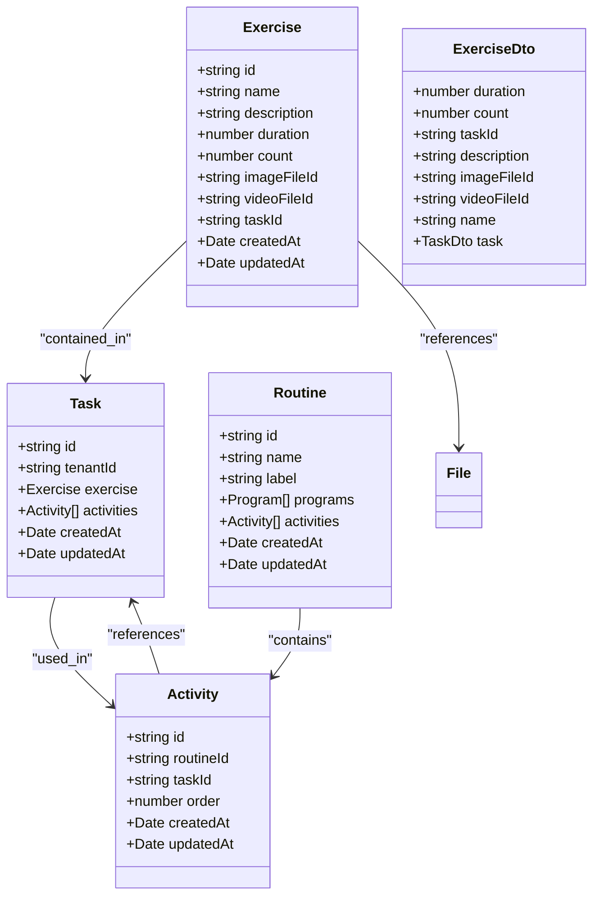

# Exercise Data Model

<cite>
**Referenced Files in This Document**   
- [exercise.entity.ts](file://packages/schema/src/entity/exercise.entity.ts)
- [exercise.dto.ts](file://packages/schema/src/dto/exercise.dto.ts)
- [routine.entity.ts](file://packages/schema/src/entity/routine.entity.ts)
- [routine.dto.ts](file://packages/schema/src/dto/routine.dto.ts)
- [task.entity.ts](file://packages/schema/src/entity/task.entity.ts)
- [task.dto.ts](file://packages/schema/src/dto/task.dto.ts)
- [core.prisma](file://packages/schema/prisma/schema/core.prisma)
- [create-exercise.dto.ts](file://packages/schema/src/dto/create/create-exercise.dto.ts)
</cite>

## Table of Contents
1. [Introduction](#introduction)
2. [Exercise Schema](#exercise-schema)
3. [Relationship with Routines](#relationship-with-routines)
4. [Validation Rules](#validation-rules)
5. [Performance Considerations](#performance-considerations)
6. [Category Classifications](#category-classifications)
7. [Data Model Diagrams](#data-model-diagrams)

## Introduction
This document provides comprehensive documentation for the Exercise entity in prj-core, detailing its schema, relationships, validation rules, and performance considerations. The Exercise entity represents physical or mental activities that are organized within routines and programs, with specific attributes for duration, media references, and descriptive information.

## Exercise Schema

The Exercise entity is defined with the following core attributes:

- **name**: String field representing the exercise name (required)
- **description**: Optional string field for detailed exercise description
- **duration**: Numeric field representing exercise duration in seconds
- **count**: Numeric field representing repetition count
- **imageFileId**: Optional UUID reference to associated image media
- **videoFileId**: Optional UUID reference to associated video media

The schema also includes standard entity fields inherited from AbstractEntity, such as id, createdAt, and updatedAt timestamps.

**Section sources**
- [exercise.entity.ts](file://packages/schema/src/entity/exercise.entity.ts#L7-L21)
- [exercise.dto.ts](file://packages/schema/src/dto/exercise.dto.ts#L13-L37)

## Relationship with Routines

The Exercise entity participates in a composition relationship with Routines through the Task entity. Exercises are not directly associated with Routines but are connected through Tasks, which serve as the intermediary entity in this relationship.

Each Task can contain one Exercise, establishing a one-to-one relationship between Task and Exercise. Routines contain multiple Tasks through their activities collection, creating a hierarchical structure where:
- Routine contains multiple Tasks (via activities)
- Each Task may contain one Exercise
- This enables flexible sequencing and timing of exercises within a routine

The relationship supports timing constraints and repetition patterns through the count field on the Exercise entity and scheduling properties on the containing Task and Routine entities.

**Diagram sources**
- [exercise.entity.ts](file://packages/schema/src/entity/exercise.entity.ts#L7-L21)
- [routine.entity.ts](file://packages/schema/src/entity/routine.entity.ts#L8-L18)
- [task.entity.ts](file://packages/schema/src/entity/task.entity.ts#L8-L14)

**Section sources**
- [exercise.entity.ts](file://packages/schema/src/entity/exercise.entity.ts#L7-L21)
- [routine.entity.ts](file://packages/schema/src/entity/routine.entity.ts#L8-L18)
- [task.entity.ts](file://packages/schema/src/entity/task.entity.ts#L8-L14)

## Validation Rules

### Duration Field Validation
The duration field is validated as a required numeric value with the @NumberField() decorator. The system enforces positive numeric values for duration, ensuring that exercise durations are meaningful and non-negative.

### Media URL Validation
Media references (imageFileId and videoFileId) are validated as optional UUID fields using the @UUIDFieldOptional() decorator. These fields reference File entities in the system, ensuring that only valid, existing files can be associated with exercises.

### Content Constraints
- **Name**: Required string field with no explicit length constraints
- **Description**: Optional string field that can be null
- **Count**: Required numeric field for repetition patterns
- **Required Fields**: name, duration, and count are mandatory
- **Optional Fields**: description, imageFileId, and videoFileId can be null

The CreateExerciseDto extends ExerciseDto while omitting common entity fields and taskId, requiring tenantId for proper tenant scoping.

**Section sources**
- [exercise.dto.ts](file://packages/schema/src/dto/exercise.dto.ts#L13-L37)
- [create-exercise.dto.ts](file://packages/schema/src/dto/create/create-exercise.dto.ts#L6-L13)

## Performance Considerations

### Query Optimization
When querying Exercises with associated media, the system should use eager loading patterns to minimize database round trips. The repository pattern implemented in exercises.repository.ts provides optimized methods for retrieving exercises with their related file references.

### Indexing Strategies
The following indexing strategies are recommended for optimal query performance:

- **Duration-based filtering**: Create an index on the duration field to support queries that filter exercises by time duration
- **Type-based filtering**: While not explicitly defined in the current schema, categorization of exercises should be indexed to support filtering by exercise type
- **Tenant-based queries**: Index on tenantId to support multi-tenancy queries
- **Media presence queries**: Composite index on imageFileId and videoFileId to efficiently find exercises with or without media

Queries that retrieve exercises with their associated media should leverage database joins or include clauses to avoid N+1 query problems.

**Section sources**
- [exercises.repository.ts](file://apps/server/src/shared/repository/exercises.repository.ts)
- [core.prisma](file://packages/schema/prisma/schema/core.prisma)

## Category Classifications

While the current Exercise entity does not directly reference categories, the system supports classification through the category.entity.ts and category.dto.ts files in the shared schema. Exercises can be classified by type through their relationship with Tasks and the broader categorization system.

The classification system likely uses the file-classification.entity.ts and role-classification.entity.ts patterns extended to exercise categorization. Categories are defined with type and name enums that can be applied to exercises through association entities.

This indirect relationship allows for flexible categorization schemes where exercises can belong to multiple categories and classification hierarchies without modifying the core Exercise schema.

**Section sources**
- [category.entity.ts](file://packages/schema/src/entity/category.entity.ts)
- [category.dto.ts](file://packages/schema/src/dto/category.dto.ts)
- [exercise.entity.ts](file://packages/schema/src/entity/exercise.entity.ts)

## Data Model Diagrams

**Diagram sources**
- [exercise.entity.ts](file://packages/schema/src/entity/exercise.entity.ts#L7-L21)
- [task.entity.ts](file://packages/schema/src/entity/task.entity.ts#L8-L14)
- [routine.entity.ts](file://packages/schema/src/entity/routine.entity.ts#L8-L18)
- [activity.entity.ts](file://packages/schema/src/entity/activity.entity.ts)