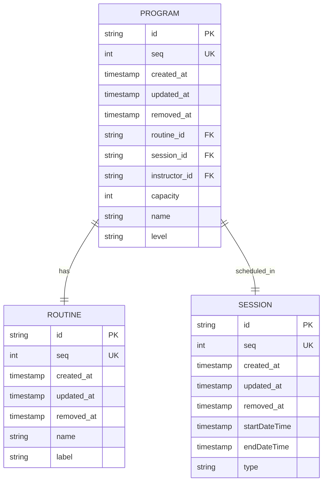
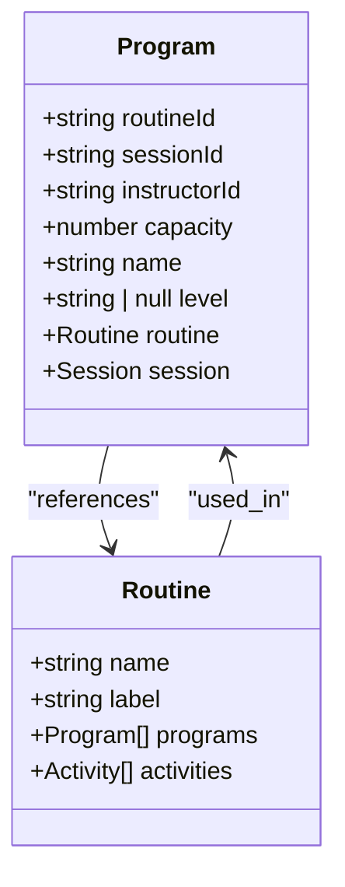
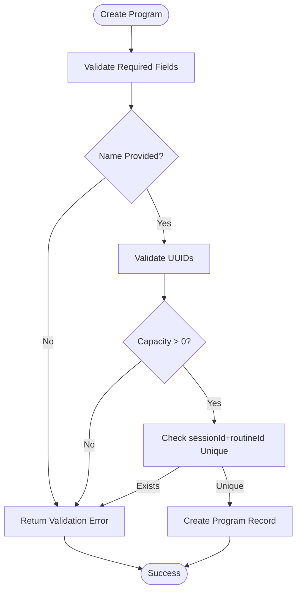

# Program Data Model

<cite>
**Referenced Files in This Document**   
- [program.entity.ts](file://packages/schema/src/entity/program.entity.ts)
- [program.dto.ts](file://packages/schema/src/dto/program.dto.ts)
- [task.prisma](file://packages/schema/prisma/schema/task.prisma)
- [routine.entity.ts](file://packages/schema/src/entity/routine.entity.ts)
- [routine.dto.ts](file://packages/schema/src/dto/routine.dto.ts)
- [create-program.dto.ts](file://packages/schema/src/dto/create/create-program.dto.ts)
- [update-program.dto.ts](file://packages/schema/src/dto/update/update-program.dto.ts)
- [entity-common-fields.ts](file://packages/schema/src/constant/entity-common-fields.ts)
</cite>

## Table of Contents
1. [Introduction](#introduction)
2. [Program Schema Definition](#program-schema-definition)
3. [Core Fields and Properties](#core-fields-and-properties)
4. [Hierarchical Relationship with Routine](#hierarchical-relationship-with-routine)
5. [Validation Rules](#validation-rules)
6. [Referential Integrity Constraints](#referential-integrity-constraints)
7. [Performance Considerations](#performance-considerations)
8. [Indexing Strategies](#indexing-strategies)
9. [Category Classification Relationship](#category-classification-relationship)

## Introduction
The Program entity in prj-core represents a scheduled activity unit that executes a specific Routine within a Session. Programs are instructor-led activities with defined capacity limits and are central to the scheduling and delivery of content in the system. This document provides comprehensive documentation of the Program data model, including its schema, relationships, validation rules, and performance characteristics.

**Section sources**
- [program.entity.ts](file://packages/schema/src/entity/program.entity.ts#L1-L22)
- [task.prisma](file://packages/schema/prisma/schema/task.prisma#L54-L74)

## Program Schema Definition
The Program entity is defined with a comprehensive schema that includes core attributes, metadata fields, and relationship references. The schema implements soft deletion through the removedAt field and maintains sequence ordering via the seq field.



**Diagram sources**
- [task.prisma](file://packages/schema/prisma/schema/task.prisma#L54-L74)
- [program.entity.ts](file://packages/schema/src/entity/program.entity.ts#L1-L22)

**Section sources**
- [task.prisma](file://packages/schema/prisma/schema/task.prisma#L54-L74)
- [program.entity.ts](file://packages/schema/src/entity/program.entity.ts#L1-L22)

## Core Fields and Properties
The Program entity contains several core fields that define its essential characteristics:

- **name**: Required string field representing the program title
- **description**: Not explicitly shown but implied through metadata
- **metadata**: Captured through standard entity fields (createdAt, updatedAt, removedAt, seq)
- **capacity**: Integer field defining maximum participant count
- **level**: Optional string field for difficulty classification (e.g., beginner, intermediate, advanced)

The entity inherits common fields from the abstract entity pattern, including timestamps and sequence management.

**Section sources**
- [program.entity.ts](file://packages/schema/src/entity/program.entity.ts#L13-L18)
- [entity-common-fields.ts](file://packages/schema/src/constant/entity-common-fields.ts#L1-L7)

## Hierarchical Relationship with Routine
The Program entity has a hierarchical relationship with the Routine entity, where each Program references exactly one Routine, but a Routine can be used in multiple Programs. This creates a one-to-many relationship from Routine to Program.



**Diagram sources**
- [program.entity.ts](file://packages/schema/src/entity/program.entity.ts#L20-L21)
- [routine.entity.ts](file://packages/schema/src/entity/routine.entity.ts#L16-L17)

**Section sources**
- [program.entity.ts](file://packages/schema/src/entity/program.entity.ts#L5-L6)
- [routine.entity.ts](file://packages/schema/src/entity/routine.entity.ts#L6-L7)

## Validation Rules
The Program entity enforces several validation rules to ensure data integrity:

- **Required fields**: name, routineId, sessionId, instructorId, and capacity are mandatory
- **Length constraints**: String fields have implicit database limits
- **Business logic validations**: 
  - Capacity must be a positive integer
  - Level field accepts null values for programs without difficulty classification
  - Unique constraint on the combination of sessionId and routineId to prevent duplicate scheduling

The CreateProgramDto omits common entity fields and related entities during creation, focusing only on the essential data needed for program instantiation.



**Diagram sources**
- [create-program.dto.ts](file://packages/schema/src/dto/create/create-program.dto.ts#L1-L9)
- [program.dto.ts](file://packages/schema/src/dto/program.dto.ts#L14-L30)

**Section sources**
- [program.dto.ts](file://packages/schema/src/dto/program.dto.ts#L14-L30)
- [create-program.dto.ts](file://packages/schema/src/dto/create/create-program.dto.ts#L1-L9)
- [update-program.dto.ts](file://packages/schema/src/dto/update/update-program.dto.ts#L1-L4)

## Referential Integrity Constraints
The Program entity maintains referential integrity through several constraints:

- Foreign key relationships with Routine, Session, and User (instructor) entities
- Cascading behaviors are managed through application logic rather than database cascades
- The unique constraint on [sessionId, routineId] prevents duplicate program scheduling
- Soft deletion pattern allows for data retention while marking records as removed

When a Routine is deleted, associated Programs are not automatically deleted but become orphaned references that should be handled by application logic.

**Section sources**
- [task.prisma](file://packages/schema/prisma/schema/task.prisma#L66-L67)
- [task.prisma](file://packages/schema/prisma/schema/task.prisma#L69-L71)

## Performance Considerations
Querying Programs with nested Routines requires careful consideration of performance implications:

- Eager loading of Routine data increases query complexity and response size
- Pagination is recommended for listing operations
- Selective field projection should be used when full entity data is not required
- The nested relationship can be queried selectively based on use case requirements

For operations requiring both Program and Routine data, batch loading patterns should be employed to minimize database round trips.

**Section sources**
- [program.dto.ts](file://packages/schema/src/dto/program.dto.ts#L32-L37)
- [routine.dto.ts](file://packages/schema/src/dto/routine.dto.ts#L14-L15)

## Indexing Strategies
The Program entity employs several indexing strategies to optimize query performance:

- Primary index on id field for direct record access
- Unique index on seq field for sequential ordering
- Composite index on [sessionId, routineId] to enforce uniqueness constraint
- Individual indexes on sessionId, routineId, and instructorId for filtering operations
- Index on removedAt to optimize soft deletion queries

These indexes support common query patterns including filtering by session, routine, instructor, and status (via removedAt).

```mermaid
erDiagram
PROGRAM {
string id PK
int seq UK
timestamp created_at
timestamp updated_at
timestamp removed_at
string routine_id FK
string session_id FK
string instructor_id FK
int capacity
string name
string level
}
INDEX "PK_programs_id" ON PROGRAM(id)
INDEX "UK_programs_seq" ON PROGRAM(seq)
INDEX "UK_programs_session_routine" ON PROGRAM(sessionId, routineId)
INDEX "IX_programs_sessionId" ON PROGRAM(sessionId)
INDEX "IX_programs_routineId" ON PROGRAM(routineId)
INDEX "IX_programs_instructorId" ON PROGRAM(instructorId)
INDEX "IX_programs_removedAt" ON PROGRAM(removedAt)
```

**Diagram sources**
- [task.prisma](file://packages/schema/prisma/schema/task.prisma#L69-L72)
- [task.prisma](file://packages/schema/prisma/schema/task.prisma#L55-L65)

**Section sources**
- [task.prisma](file://packages/schema/prisma/schema/task.prisma#L69-L72)

## Category Classification Relationship
While not explicitly shown in the provided code, the Program entity is expected to have a relationship with Category classifications through the classification system implemented in the shared schema. Programs can be categorized for organizational and filtering purposes, allowing for taxonomy-based grouping of similar program types.

The category classification system likely uses a polymorphic relationship pattern similar to other classified entities in the system, enabling Programs to be associated with one or more category types for enhanced discoverability and organization.

**Section sources**
- [task.prisma](file://packages/schema/prisma/schema/task.prisma#L54-L74)
- [program.entity.ts](file://packages/schema/src/entity/program.entity.ts#L1-L22)