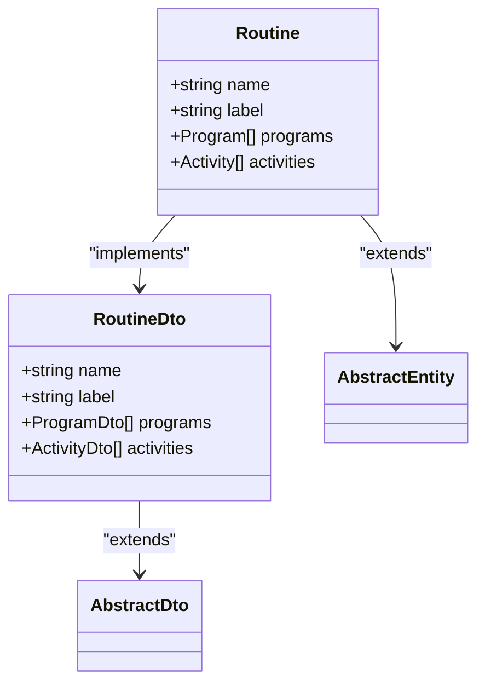
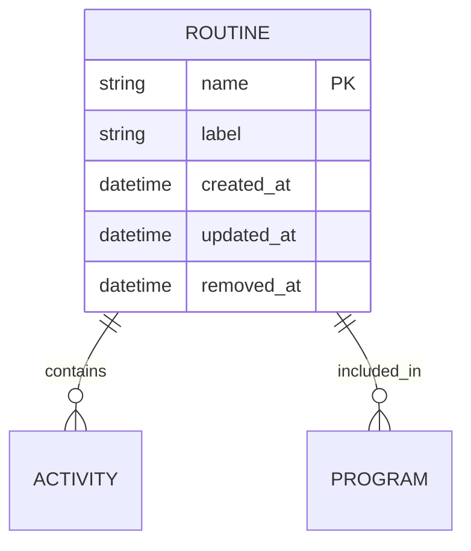
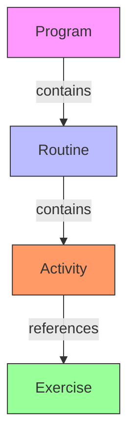
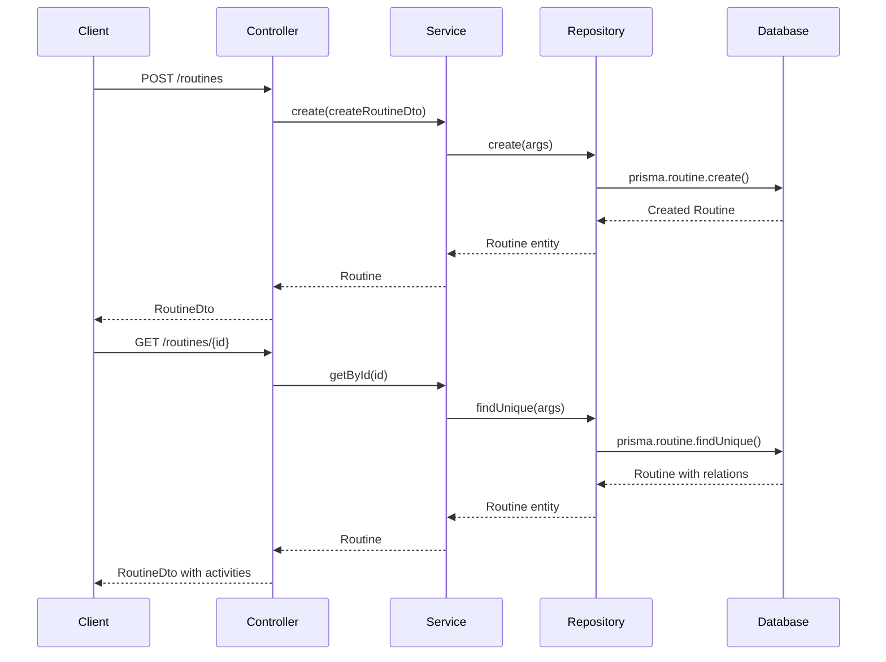
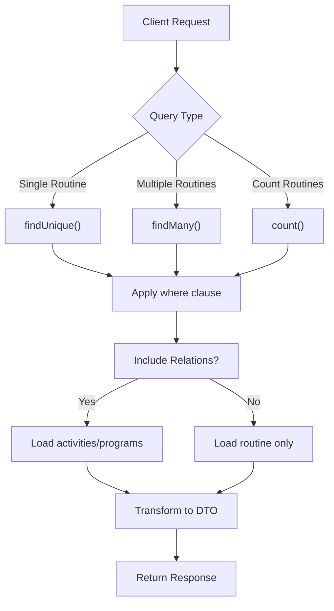

# Routine Data Model

<cite>
**Referenced Files in This Document**   
- [routine.entity.ts](file://packages/schema/src/entity/routine.entity.ts)
- [routine.dto.ts](file://packages/schema/src/dto/routine.dto.ts)
- [routines.controller.ts](file://apps/server/src/shared/controller/resources/routines.controller.ts)
- [routines.service.ts](file://apps/server/src/shared/service/resources/routines.service.ts)
- [routines.repository.ts](file://apps/server/src/shared/repository/routines.repository.ts)
- [core.prisma](file://packages/schema/prisma/schema/core.prisma)
- [activity.entity.ts](file://packages/schema/src/entity/activity.entity.ts)
- [program.entity.ts](file://packages/schema/src/entity/program.entity.ts)
</cite>

## Table of Contents
1. [Introduction](#introduction)
2. [Routine Schema Definition](#routine-schema-definition)
3. [Core Fields](#core-fields)
4. [Relationships](#relationships)
5. [Hierarchical Structure with Exercises](#hierarchical-structure-with-exercises)
6. [Validation Rules](#validation-rules)
7. [Program Integration](#program-integration)
8. [Performance Considerations](#performance-considerations)
9. [Tenant Context](#tenant-context)
10. [Data Flow and Operations](#data-flow-and-operations)

## Introduction
The Routine entity in prj-core represents a structured collection of exercises organized for specific training purposes. This document provides comprehensive documentation of the Routine data model, including its schema, relationships with Exercises and Programs, validation rules, and performance considerations. The Routine serves as a fundamental building block in the fitness program management system, enabling the organization of exercises into meaningful sequences within larger program structures.

## Routine Schema Definition

**Diagram sources**
- [routine.entity.ts](file://packages/schema/src/entity/routine.entity.ts#L8-L18)
- [routine.dto.ts](file://packages/schema/src/dto/routine.dto.ts#L7-L19)

The Routine entity is defined with a clean, extensible structure that inherits from AbstractEntity and implements the Prisma-generated Routine interface. The entity uses the @UseDto decorator to associate with its corresponding DTO (Data Transfer Object), ensuring consistent data transformation between layers. The schema is designed to support both direct database operations and API-level data transfer with proper validation and transformation.

**Section sources**
- [routine.entity.ts](file://packages/schema/src/entity/routine.entity.ts#L1-L19)
- [routine.dto.ts](file://packages/schema/src/dto/routine.dto.ts#L1-L20)

## Core Fields

### Name and Label Properties
The Routine entity contains two primary string fields that define its identity:

- **name**: A required string field that serves as the primary identifier for the routine. This field is annotated with @StringField() in the DTO to ensure proper validation.
- **label**: A required string field that provides a user-friendly display name for the routine. This field is also annotated with @StringField() for validation purposes.

These fields are essential for routine identification and display throughout the application. The name field is typically used for internal references and API operations, while the label field is used in user interfaces for better readability.

**Diagram sources**
- [routine.entity.ts](file://packages/schema/src/entity/routine.entity.ts#L13-L14)
- [routine.dto.ts](file://packages/schema/src/dto/routine.dto.ts#L8-L12)

**Section sources**
- [routine.entity.ts](file://packages/schema/src/entity/routine.entity.ts#L13-L14)
- [routine.dto.ts](file://packages/schema/src/dto/routine.dto.ts#L8-L12)

## Relationships

### Relationship with Exercises (Activities)
The Routine entity maintains a direct relationship with Exercise entities through the activities collection. In the data model, exercises are represented as Activity entities, which are specialized components within a routine. This relationship is defined as a one-to-many association, where a single routine can contain multiple activities (exercises).

The activities relationship is implemented as an optional array of Activity objects in the Routine entity. This design allows for flexible composition of routines with varying numbers of exercises. When routines are retrieved with their associated activities, the system can present a complete view of the workout structure.

### Relationship with Programs
Routines are organized within Programs through a many-to-many relationship. A Program can contain multiple Routines, and a Routine can be included in multiple Programs. This flexible structure enables content reuse and modular program design.

The relationship is implemented through the programs property in the Routine entity, which is an optional array of Program objects. This allows routines to be shared across different programs while maintaining their individual identity and configuration.

**Diagram sources**
- [routine.entity.ts](file://packages/schema/src/entity/routine.entity.ts#L16-L17)
- [activity.entity.ts](file://packages/schema/src/entity/activity.entity.ts)
- [program.entity.ts](file://packages/schema/src/entity/program.entity.ts)

**Section sources**
- [routine.entity.ts](file://packages/schema/src/entity/routine.entity.ts#L16-L17)

## Hierarchical Structure with Exercises

### Sequence Ordering
The hierarchical relationship between Routine and Exercise entities follows a clear parent-child pattern where the Routine serves as the container and organizer of individual Exercises (represented as Activities). While the current implementation does not explicitly show a position or order field in the Routine entity itself, the sequence ordering is managed through the relationship with Activities.

The system supports ordered collections of exercises within a routine, allowing for structured workout flows. The order of exercises is maintained through the array structure of the activities property, with array indexing providing the implicit sequence. This approach simplifies the data model while still enabling ordered execution of exercises.

### Cascading Behaviors
The Routine entity implements cascading behaviors for data operations, ensuring data integrity across related entities:

- **Creation**: When a Routine is created, associated Activities (exercises) can be created simultaneously through nested operations.
- **Update**: Updates to a Routine can cascade to its Activities, allowing for batch modifications of exercise sequences.
- **Soft Deletion**: The removeById operation in the RoutinesService updates the removedAt field, implementing soft deletion that preserves referential integrity while marking the routine as inactive.
- **Hard Deletion**: The deleteById operation permanently removes the Routine and, depending on foreign key constraints, may cascade to remove associated Activities.

**Diagram sources**
- [routines.controller.ts](file://apps/server/src/shared/controller/resources/routines.controller.ts#L31-L37)
- [routines.service.ts](file://apps/server/src/shared/service/resources/routines.service.ts#L14-L20)
- [routines.repository.ts](file://apps/server/src/shared/repository/routines.repository.ts#L15-L18)

**Section sources**
- [routines.service.ts](file://apps/server/src/shared/service/resources/routines.service.ts#L14-L20)
- [routines.repository.ts](file://apps/server/src/shared/repository/routines.repository.ts#L15-L18)

## Validation Rules

### Required Fields
The Routine entity enforces validation rules for required fields through DTO decorators:

- **name**: Marked with @StringField() to ensure it is a non-empty string
- **label**: Also marked with @StringField() to ensure it is a non-empty string

These validation rules are applied at the API level through the CreateRoutineDto and UpdateRoutineDto classes, ensuring that all routine operations maintain data integrity. The @StringField() decorator likely includes checks for presence, type, and potentially length constraints.

### Business Logic Validations
While the core entity definition focuses on structural validation, business logic validations are implemented in the service layer:

- **Uniqueness**: Although not explicitly shown in the entity, business rules likely prevent duplicate routine names within the same context
- **Content Validation**: Before creation or update, the system may validate that routines contain at least one activity (exercise)
- **State Validation**: The soft deletion mechanism (removedAt field) ensures that routines can be deactivated without losing historical data

The validation strategy follows a layered approach, with basic field validation handled by DTO decorators and more complex business rules enforced in the service layer.

**Section sources**
- [routine.dto.ts](file://packages/schema/src/dto/routine.dto.ts#L8-L12)
- [routines.service.ts](file://apps/server/src/shared/service/resources/routines.service.ts)

## Program Integration

### Hierarchical Organization
Routines are integrated into Programs as modular components, creating a hierarchical structure:

- **Program Level**: Represents a complete training program with specific goals and duration
- **Routine Level**: Represents a specific workout session within the program
- **Activity Level**: Represents individual exercises within the routine

This three-tier hierarchy allows for flexible program design, where routines can be reused across different programs and easily modified without affecting the overall program structure.

### Position Constraints
While the current implementation does not explicitly show position fields, the integration with Programs likely involves sequence ordering. The system may manage the order of routines within a program through:

- Array ordering in the programs relationship
- Implicit ordering based on creation date
- Additional metadata stored in the relationship table for many-to-many associations

The exact implementation of position constraints would be defined in the Program entity and the relationship mapping between Programs and Routines.

**Section sources**
- [routine.entity.ts](file://packages/schema/src/entity/routine.entity.ts#L16)
- [program.entity.ts](file://packages/schema/src/entity/program.entity.ts)

## Performance Considerations

### Querying Routines with Nested Exercises
The system is designed to efficiently query routines with their nested exercises (activities) through several mechanisms:

- **Repository Pattern**: The RoutinesRepository provides optimized methods for different query patterns (findMany, findUnique, etc.)
- **Prisma Integration**: Leveraging Prisma's query engine for efficient database operations
- **Selective Loading**: The ability to include or exclude related entities based on query parameters

When retrieving routines with nested exercises, the system can use Prisma's relation loading capabilities to fetch the complete structure in a single query, minimizing database round trips.

### Indexing Strategies
Based on the Prisma schema and repository methods, the following indexing strategies are likely implemented:

- **Primary Key Index**: On the id field for fast lookups
- **Soft Delete Index**: On the removedAt field to efficiently filter active routines
- **Timestamp Indexes**: On created_at and updated_at fields for time-based queries
- **Composite Indexes**: Potentially on frequently queried field combinations

The count method in the RoutinesRepository suggests that the system supports efficient counting operations, which would benefit from appropriate indexing on filterable fields.

**Diagram sources**
- [routines.repository.ts](file://apps/server/src/shared/repository/routines.repository.ts)
- [routines.service.ts](file://apps/server/src/shared/service/resources/routines.service.ts)

**Section sources**
- [routines.repository.ts](file://apps/server/src/shared/repository/routines.repository.ts#L46-L91)

## Tenant Context

### Multi-Tenancy Support
The Routine entity operates within a multi-tenant context, as evidenced by the architecture of the system:

- **Isolation**: Routines are likely associated with specific tenants, ensuring data separation between different organizations or users
- **Access Control**: The system probably implements tenant-based access controls to prevent unauthorized access to routines
- **Context Propagation**: Tenant context is likely passed through the request chain from controller to service to repository

While the Routine entity itself does not explicitly show tenant fields, the multi-tenancy is probably implemented at the service or repository level, with tenant filters automatically applied to all queries.

### User Context Integration
The Routine entity integrates with user contexts through the broader system architecture:

- **Ownership**: Routines may be associated with specific users or roles within a tenant
- **Permissions**: Access to routines is likely governed by role-based or permission-based security
- **Audit Trails**: User context is probably recorded in the created_at, updated_at, and removed_at timestamps for audit purposes

The separation between the entity definition and the operational context allows for flexible security policies without complicating the core data model.

**Section sources**
- [routines.service.ts](file://apps/server/src/shared/service/resources/routines.service.ts)
- [routines.repository.ts](file://apps/server/src/shared/repository/routines.repository.ts)

## Data Flow and Operations

### CRUD Operations
The Routine entity supports standard CRUD (Create, Read, Update, Delete) operations through a well-defined service layer:

- **Create**: Implemented in the create() method of RoutinesService, which delegates to the repository
- **Read**: Supported through getById() and getManyByQuery() methods for single and multiple routine retrieval
- **Update**: Handled by updateById() for full updates
- **Delete**: Implemented as both soft delete (removeById()) and hard delete (deleteById())

The controller layer exposes these operations through REST endpoints, providing a clean API interface for clients.

### Service Layer Architecture
The service layer follows a clean architecture pattern:

- **RoutinesController**: Handles HTTP requests and responses
- **RoutinesService**: Contains business logic and coordinates operations
- **RoutinesRepository**: Manages data persistence and database operations

This separation of concerns ensures that business logic remains independent of transport mechanisms and data storage details.

**Section sources**
- [routines.controller.ts](file://apps/server/src/shared/controller/resources/routines.controller.ts)
- [routines.service.ts](file://apps/server/src/shared/service/resources/routines.service.ts)
- [routines.repository.ts](file://apps/server/src/shared/repository/routines.repository.ts)