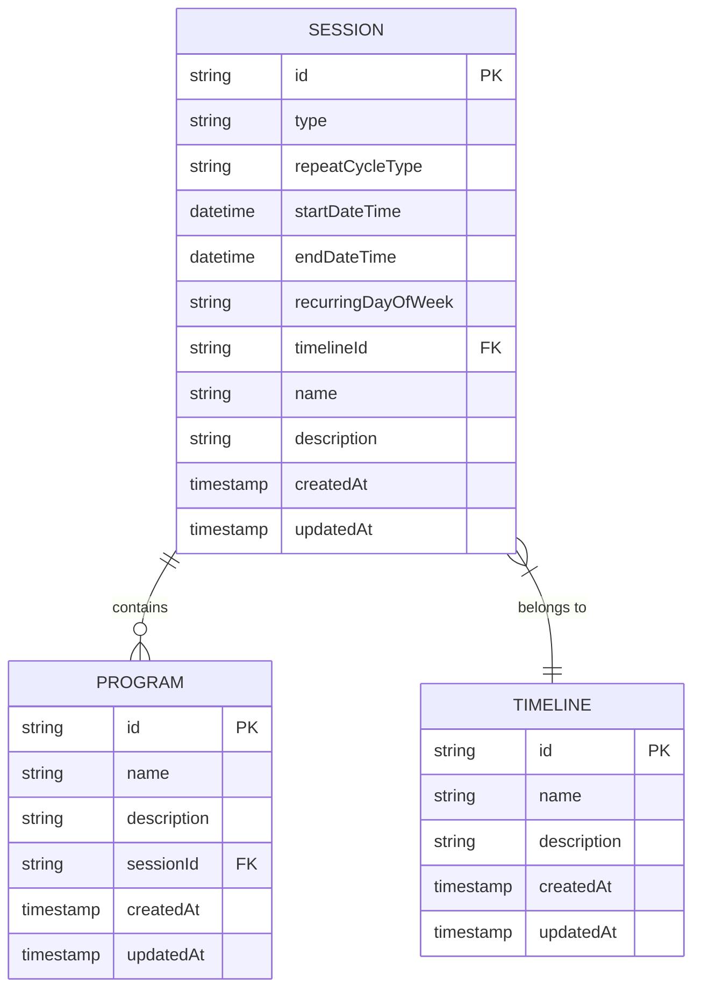
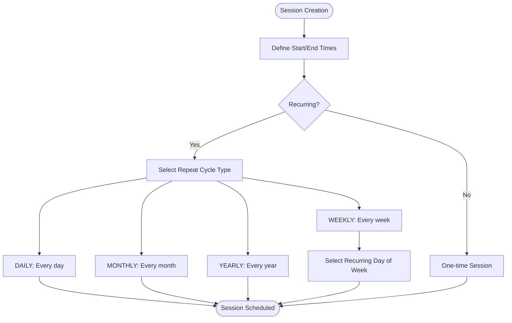
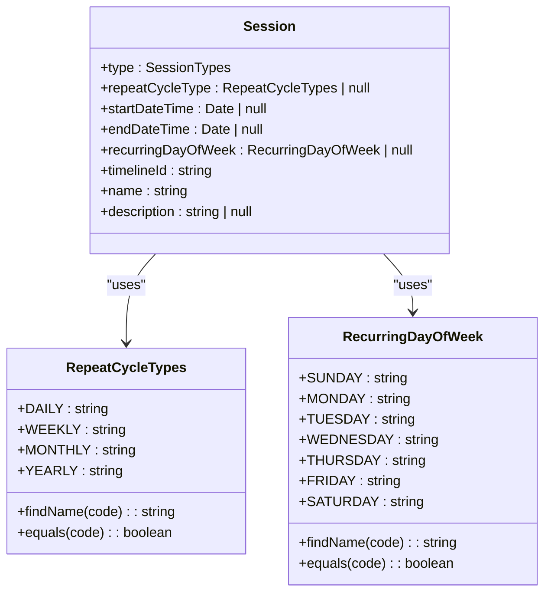
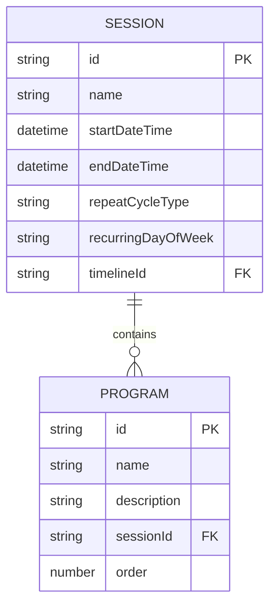
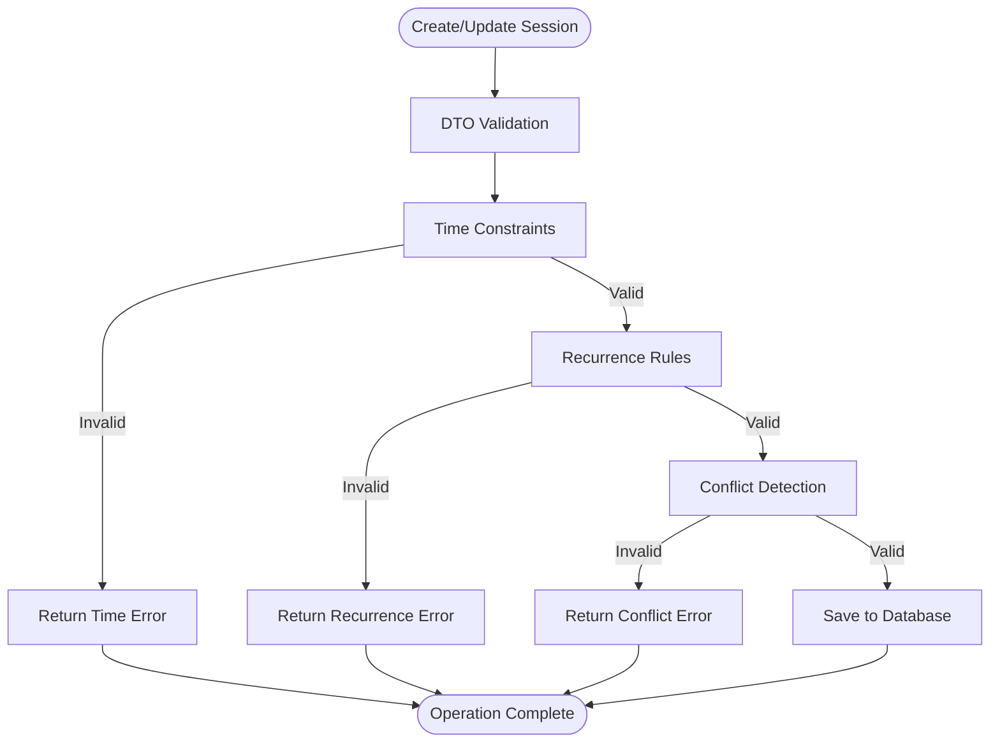
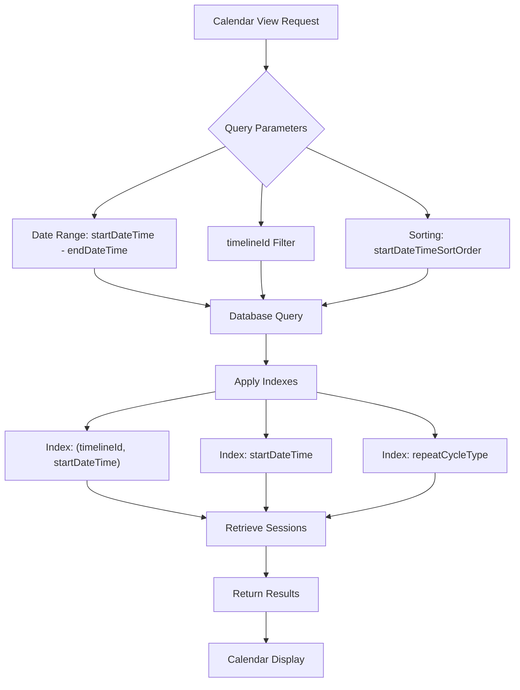
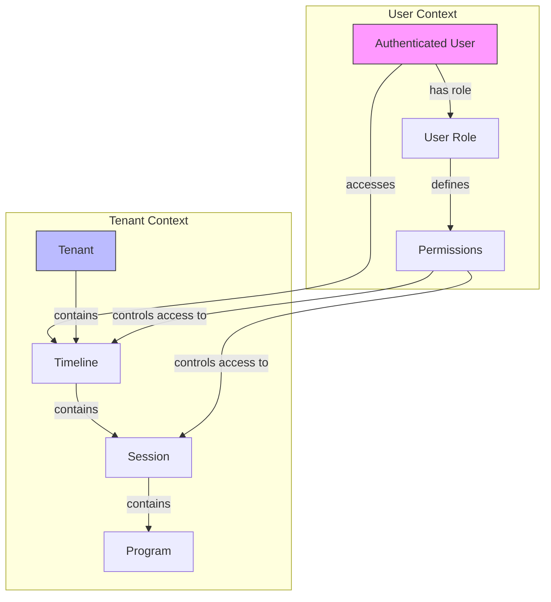

# Session Data Model

<cite>
**Referenced Files in This Document**   
- [session.entity.ts](file://packages/schema/src/entity/session.entity.ts)
- [session.dto.ts](file://packages/schema/src/dto/session.dto.ts)
- [repeat-cycle-types.enum.ts](file://packages/schema/src/enum/repeat-cycle-types.enum.ts)
- [recurring-day-of-week.enum.ts](file://packages/schema/src/enum/recurring-day-of-week.enum.ts)
- [create-session.dto.ts](file://packages/schema/src/dto/create/create-session.dto.ts)
- [update-session.dto.ts](file://packages/schema/src/dto/update/update-session.dto.ts)
- [query-session.dto.ts](file://packages/schema/src/dto/query/query-session.dto.ts)
- [sessions.repository.ts](file://apps/server/src/shared/repository/sessions.repository.ts)
- [sessions.service.ts](file://apps/server/src/shared/service/resources/sessions.service.ts)
- [sessions.controller.ts](file://apps/server/src/shared/controller/resources/sessions.controller.ts)
</cite>

## Table of Contents
1. [Introduction](#introduction)
2. [Session Schema](#session-schema)
3. [Scheduling Information](#scheduling-information)
4. [Recurrence Patterns](#recurrence-patterns)
5. [Relationship with Programs](#relationship-with-programs)
6. [Validation Rules](#validation-rules)
7. [Performance Considerations](#performance-considerations)
8. [User and Tenant Contexts](#user-and-tenant-contexts)
9. [Conclusion](#conclusion)

## Introduction
The Session entity in prj-core represents scheduled events or activities within the system. This document provides comprehensive documentation of the Session data model, focusing on its scheduling capabilities, recurrence patterns, relationships with other entities, validation rules, and performance characteristics. The Session entity is designed to support flexible scheduling with various recurrence patterns while maintaining strong relationships with Programs and other core entities.

**Section sources**
- [session.entity.ts](file://packages/schema/src/entity/session.entity.ts#L1-L25)

## Session Schema
The Session entity schema defines the core structure and attributes of a session, including scheduling information, recurrence patterns, and metadata. The schema is implemented as a TypeScript class that extends AbstractEntity and implements the Prisma-generated SessionEntity interface.

The Session schema includes the following key fields:
- **type**: Enum indicating the session type (SessionTypes)
- **repeatCycleType**: Enum for recurrence pattern (RepeatCycleTypes) or null for non-repeating sessions
- **startDateTime**: Date and time when the session begins, nullable
- **endDateTime**: Date and time when the session ends, nullable
- **recurringDayOfWeek**: Day of week for weekly recurring sessions (RecurringDayOfWeek) or null
- **timelineId**: UUID reference to the associated Timeline entity
- **name**: String name of the session
- **description**: Optional string description of the session

The schema also includes relationship properties:
- **programs**: Array of associated Program entities
- **timeline**: Reference to the parent Timeline entity

**Diagram sources**
- [session.entity.ts](file://packages/schema/src/entity/session.entity.ts#L1-L25)
- [session.dto.ts](file://packages/schema/src/dto/session.dto.ts#L23-L55)

**Section sources**
- [session.entity.ts](file://packages/schema/src/entity/session.entity.ts#L1-L25)
- [session.dto.ts](file://packages/schema/src/dto/session.dto.ts#L23-L55)

## Scheduling Information
The scheduling system for Sessions is built around start and end date-time values with support for both one-time and recurring events. The scheduling information is captured through several key fields in the Session entity.

### Start and End Times
Sessions are defined by their startDateTime and endDateTime properties, both of which are nullable Date objects. This allows for flexible scheduling scenarios:
- Fixed duration sessions with both start and end times specified
- Open-ended sessions with only a start time
- Placeholder sessions with no time specified

The scheduling logic enforces that if both times are provided, the startDateTime must precede the endDateTime. This validation is implemented in the sessions.service.ts file.

### Recurring Day of Week
For weekly recurring sessions, the recurringDayOfWeek field specifies which day of the week the session occurs. This field uses the RecurringDayOfWeek enum which includes all seven days of the week (SUNDAY through SATURDAY). The field is nullable to accommodate non-weekly recurrence patterns or non-repeating sessions.

### Repeat Cycle Types
The repeatCycleType field determines the recurrence pattern of the session using the RepeatCycleTypes enum. The available cycle types include:
- DAILY: Repeats every day
- WEEKLY: Repeats every week on the specified day
- MONTHLY: Repeats monthly on the same date
- YEARLY: Repeats annually on the same date

When repeatCycleType is null, the session is treated as a one-time, non-repeating event.

**Diagram sources**
- [repeat-cycle-types.enum.ts](file://packages/schema/src/enum/repeat-cycle-types.enum.ts#L1-L33)
- [recurring-day-of-week.enum.ts](file://packages/schema/src/enum/recurring-day-of-week.enum.ts#L1-L36)
- [session.entity.ts](file://packages/schema/src/entity/session.entity.ts#L1-L25)

**Section sources**
- [repeat-cycle-types.enum.ts](file://packages/schema/src/enum/repeat-cycle-types.enum.ts#L1-L33)
- [recurring-day-of-week.enum.ts](file://packages/schema/src/enum/recurring-day-of-week.enum.ts#L1-L36)
- [session.entity.ts](file://packages/schema/src/entity/session.entity.ts#L1-L25)

## Recurrence Patterns
The Session entity supports multiple recurrence patterns through the repeatCycleType and related fields. The recurrence system is designed to handle daily, weekly, monthly, and yearly cycles with appropriate validation and exception handling.

### Daily Recurrence
Daily recurring sessions repeat every day at the same time. When repeatCycleType is set to DAILY, the session will occur each day between the startDateTime and endDateTime. The system calculates future occurrences by incrementing the date by one day while maintaining the same time components.

### Weekly Recurrence
Weekly recurring sessions occur on a specific day of the week as defined by the recurringDayOfWeek field. When repeatCycleType is set to WEEKLY, the system uses the recurringDayOfWeek value to determine which day of each week the session should occur. For example, a session with recurringDayOfWeek set to "MON" will occur every Monday.

### Monthly Recurrence
Monthly recurring sessions repeat on the same date each month. When repeatCycleType is set to MONTHLY, the session will occur on the same day of the month (e.g., the 15th of each month). The system handles edge cases such as months with fewer days (e.g., February 30th) by either adjusting to the last day of the month or skipping the occurrence, depending on the business rules.

### Yearly Recurrence
Yearly recurring sessions repeat on the same date each year. When repeatCycleType is set to YEARLY, the session will occur on the same month and day each year (e.g., January 1st annually).

### Exception Handling
The recurrence system includes mechanisms for handling exceptions to regular patterns:
- Individual session instances can be modified without affecting the overall recurrence pattern
- Sessions can be canceled or rescheduled independently
- The system maintains the original recurrence pattern while allowing for exceptions to specific occurrences

**Diagram sources**
- [repeat-cycle-types.enum.ts](file://packages/schema/src/enum/repeat-cycle-types.enum.ts#L1-L33)
- [recurring-day-of-week.enum.ts](file://packages/schema/src/enum/recurring-day-of-week.enum.ts#L1-L36)
- [session.entity.ts](file://packages/schema/src/entity/session.entity.ts#L1-L25)

**Section sources**
- [repeat-cycle-types.enum.ts](file://packages/schema/src/enum/repeat-cycle-types.enum.ts#L1-L33)
- [recurring-day-of-week.enum.ts](file://packages/schema/src/enum/recurring-day-of-week.enum.ts#L1-L36)
- [session.entity.ts](file://packages/schema/src/entity/session.entity.ts#L1-L25)

## Relationship with Programs
The Session entity has a direct relationship with the Program entity, allowing sessions to contain multiple programs. This relationship enables the organization of content or activities within scheduled sessions.

### One-to-Many Relationship
Each Session can have multiple associated Programs, establishing a one-to-many relationship. This is represented in the Session entity through the programs property, which is an array of Program objects. The inverse relationship exists in the Program entity, which would have a sessionId field referencing the parent Session.

### Data Structure
The relationship is implemented through the following properties:
- In Session entity: `programs?: Program[]` - optional array of associated programs
- In Program entity: `sessionId: string` - required reference to the parent session

### Use Cases
This relationship supports several key use cases:
- Scheduling multiple programs within a single session
- Organizing content by time slots
- Creating structured agendas for events
- Managing curriculum delivery in educational contexts

The relationship is lazy-loaded by default, meaning programs are only retrieved when explicitly requested, improving performance for queries that don't require program data.

**Diagram sources**
- [session.entity.ts](file://packages/schema/src/entity/session.entity.ts#L1-L25)
- [session.dto.ts](file://packages/schema/src/dto/session.dto.ts#L23-L55)

**Section sources**
- [session.entity.ts](file://packages/schema/src/entity/session.entity.ts#L1-L25)
- [session.dto.ts](file://packages/schema/src/dto/session.dto.ts#L23-L55)

## Validation Rules
The Session entity implements comprehensive validation rules to ensure data integrity and prevent scheduling conflicts. These rules are enforced at multiple levels: DTO validation, service-level validation, and database constraints.

### Time Constraints
The system enforces the following time-related validation rules:
- If both startDateTime and endDateTime are provided, startDateTime must be before endDateTime
- startDateTime cannot be in the past for certain session types (enforced at business logic level)
- For recurring sessions, the startDateTime establishes the pattern origin point

### Recurrence Rules
Recurrence-specific validation includes:
- When repeatCycleType is WEEKLY, recurringDayOfWeek must be specified
- When repeatCycleType is not WEEKLY, recurringDayOfWeek must be null
- Daily, monthly, and yearly cycles don't require recurringDayOfWeek
- Only valid RepeatCycleTypes values are accepted (DAILY, WEEKLY, MONTHLY, YEARLY, or null)

### Conflict Detection
The system includes conflict detection mechanisms to prevent overlapping sessions:
- The sessions.service.ts file contains logic to check for time conflicts when creating or updating sessions
- Queries can be performed to identify potential overlaps based on timelineId and time ranges
- The repository layer provides methods to efficiently query sessions within date ranges for conflict checking

### DTO Validation
The validation is implemented through decorators in the DTO classes:
- @DateFieldOptional ensures proper date formatting and validation
- @EnumField and @EnumFieldOptional validate enum values
- @StringField enforces string requirements
- @UUIDField validates UUID format for timelineId

**Diagram sources**
- [session.dto.ts](file://packages/schema/src/dto/session.dto.ts#L8-L55)
- [create-session.dto.ts](file://packages/schema/src/dto/create/create-session.dto.ts#L1-L10)
- [update-session.dto.ts](file://packages/schema/src/dto/update/update-session.dto.ts#L1-L5)
- [sessions.service.ts](file://apps/server/src/shared/service/resources/sessions.service.ts)

**Section sources**
- [session.dto.ts](file://packages/schema/src/dto/session.dto.ts#L8-L55)
- [create-session.dto.ts](file://packages/schema/src/dto/create/create-session.dto.ts#L1-L10)
- [update-session.dto.ts](file://packages/schema/src/dto/update/update-session.dto.ts#L1-L5)
- [sessions.service.ts](file://apps/server/src/shared/service/resources/sessions.service.ts)

## Performance Considerations
The Session data model includes several performance optimizations for querying and indexing, particularly for calendar views and date-range queries.

### Querying by Date Ranges
The system is optimized for common calendar use cases:
- Efficient querying of sessions within specific date ranges
- Support for both single-date queries and range queries
- Indexing strategies to accelerate time-based lookups

The query-session.dto.ts file defines parameters for sorting and filtering sessions by startDateTime, enabling efficient retrieval of sessions in chronological order.

### Indexing Strategies
The database schema includes strategic indexes to improve query performance:
- Index on startDateTime for chronological ordering
- Index on timelineId for filtering sessions by timeline
- Composite index on (timelineId, startDateTime) for calendar views
- Index on repeatCycleType for filtering recurring sessions

These indexes enable fast retrieval of sessions for calendar displays, where users typically view sessions by day, week, or month.

### Calendar View Optimization
For calendar views, the system implements the following optimizations:
- Lazy loading of program details to reduce initial payload
- Pagination support through the QuerySessionDto
- Efficient date-range queries using database indexing
- Caching strategies for frequently accessed date ranges

The sessions.repository.ts file contains optimized query methods specifically designed for calendar use cases, including methods to retrieve sessions by timeline and date range.

**Diagram sources**
- [query-session.dto.ts](file://packages/schema/src/dto/query/query-session.dto.ts#L1-L12)
- [sessions.repository.ts](file://apps/server/src/shared/repository/sessions.repository.ts)
- [sessions.service.ts](file://apps/server/src/shared/service/resources/sessions.service.ts)

**Section sources**
- [query-session.dto.ts](file://packages/schema/src/dto/query/query-session.dto.ts#L1-L12)
- [sessions.repository.ts](file://apps/server/src/shared/repository/sessions.repository.ts)
- [sessions.service.ts](file://apps/server/src/shared/service/resources/sessions.service.ts)

## User and Tenant Contexts
The Session entity operates within user and tenant contexts, providing multi-tenancy support and user-specific functionality.

### Tenant Context
Sessions are associated with tenants through the timeline entity, which belongs to a specific tenant. This creates an indirect tenant association for sessions:
- Each session belongs to a timeline
- Each timeline belongs to a tenant
- Users can only access sessions within their tenant

This hierarchical structure ensures data isolation between tenants while allowing for shared infrastructure.

### User Context
User context is managed through authentication and authorization:
- Users can create, read, update, and delete sessions based on their permissions
- The sessions.controller.ts file handles user authentication and role-based access control
- Users can only access sessions within timelines they have permission to view

### Access Control
The system implements the following access control measures:
- Tenant-based isolation of session data
- Role-based permissions for session operations
- Timeline-level access controls that cascade to sessions
- Audit logging of session modifications

The multi-tenancy approach allows the system to serve multiple organizations or departments while maintaining data separation and security.

**Diagram sources**
- [session.entity.ts](file://packages/schema/src/entity/session.entity.ts#L1-L25)
- [sessions.controller.ts](file://apps/server/src/shared/controller/resources/sessions.controller.ts)
- [sessions.service.ts](file://apps/server/src/shared/service/resources/sessions.service.ts)

**Section sources**
- [session.entity.ts](file://packages/schema/src/entity/session.entity.ts#L1-L25)
- [sessions.controller.ts](file://apps/server/src/shared/controller/resources/sessions.controller.ts)
- [sessions.service.ts](file://apps/server/src/shared/service/resources/sessions.service.ts)

## Conclusion
The Session data model in prj-core provides a comprehensive solution for managing scheduled events with flexible recurrence patterns and robust relationships with other entities. The model supports daily, weekly, monthly, and yearly recurrence through the repeatCycleType enum, with specific handling for weekly patterns via the recurringDayOfWeek field. Sessions are connected to Programs through a one-to-many relationship, enabling rich content organization within scheduled time slots.

The validation system ensures data integrity through time constraints, recurrence rules, and conflict detection, while performance optimizations support efficient querying for calendar views and date-range searches. The multi-tenancy architecture provides proper user and tenant context isolation, ensuring data security and access control.

Key strengths of the Session data model include:
- Flexible recurrence patterns with proper validation
- Efficient querying and indexing for calendar use cases
- Clear relationships with Programs and Timelines
- Robust validation and conflict detection
- Multi-tenant support with proper access controls

This comprehensive data model enables the system to support complex scheduling requirements while maintaining data integrity and performance.

**Section sources**
- [session.entity.ts](file://packages/schema/src/entity/session.entity.ts#L1-L25)
- [session.dto.ts](file://packages/schema/src/dto/session.dto.ts#L1-L55)
- [repeat-cycle-types.enum.ts](file://packages/schema/src/enum/repeat-cycle-types.enum.ts#L1-L33)
- [recurring-day-of-week.enum.ts](file://packages/schema/src/enum/recurring-day-of-week.enum.ts#L1-L36)