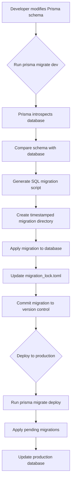
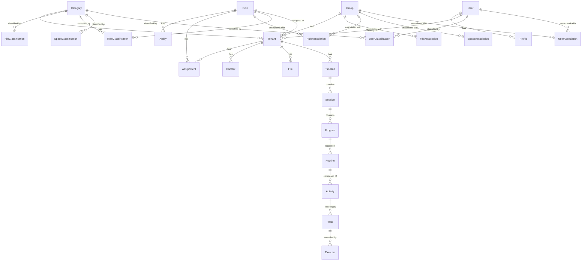
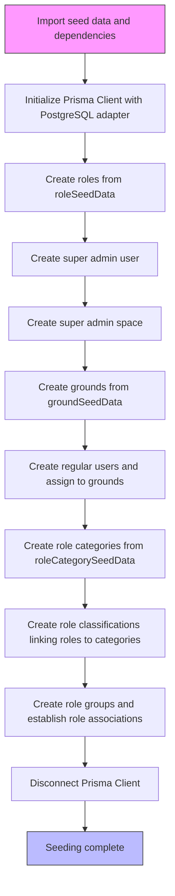

# Data Migration Strategy

<cite>
**Referenced Files in This Document**   
- [seed.ts](file://packages/schema/prisma/seed.ts)
- [seed-data.ts](file://packages/schema/prisma/seed-data.ts)
- [migration_lock.toml](file://packages/schema/prisma/migrations/migration_lock.toml)
- [migration.sql](file://packages/schema/prisma/migrations/20250807132908_/migration.sql)
- [core.prisma](file://packages/schema/prisma/schema/core.prisma)
- [_base.prisma](file://packages/schema/prisma/schema/_base.prisma)
- [task.prisma](file://packages/schema/prisma/schema/task.prisma)
- [user.prisma](file://packages/schema/prisma/schema/user.prisma)
- [role.prisma](file://packages/schema/prisma/schema/role.prisma)
- [space.prisma](file://packages/schema/prisma/schema/space.prisma)
- [file.prisma](file://packages/schema/prisma/schema/file.prisma)
</cite>

## Table of Contents
1. [Introduction](#introduction)
2. [Migration Workflow and Versioning System](#migration-workflow-and-versioning-system)
3. [Migration File Structure](#migration-file-structure)
4. [Database Schema Evolution](#database-schema-evolution)
5. [Seeding Process](#seeding-process)
6. [Creating, Applying, and Rolling Back Migrations](#creating-applying-and-rolling-back-migrations)
7. [Zero-Downtime Migrations](#zero-downtime-migrations)
8. [Data Transformation During Migrations](#data-transformation-during-migrations)
9. [Migration Testing Strategies](#migration-testing-strategies)
10. [Handling Migration Conflicts in Team Environments](#handling-migration-conflicts-in-team-environments)
11. [Conclusion](#conclusion)

## Introduction

The prj-core application utilizes Prisma as its database ORM and migration tool to manage the evolution of its PostgreSQL database schema. This document details the complete data migration strategy, covering the migration workflow, versioning system, file structure, schema evolution, seeding process, and best practices for managing migrations in different environments. The strategy emphasizes safety, reproducibility, and team collaboration, ensuring that database changes are applied consistently across development, staging, and production environments.

The migration system is centered in the `packages/schema/prisma` directory, which contains the Prisma schema files, migration history, and seeding scripts. The architecture follows a multi-file schema approach, with domain-specific models organized into separate `.prisma` files (e.g., `core.prisma`, `task.prisma`, `user.prisma`) that are consolidated by the `_base.prisma` file. This modular structure enhances maintainability and allows for clear separation of concerns across different functional domains of the application.

**Section sources**
- [core.prisma](file://packages/schema/prisma/schema/core.prisma#L1-L238)
- [_base.prisma](file://packages/schema/prisma/schema/_base.prisma#L1-L12)

## Migration Workflow and Versioning System

The migration workflow in prj-core follows Prisma's standard development cycle, which is designed to be both developer-friendly and production-safe. The process begins with developers making changes to the Prisma schema files (e.g., adding new models, modifying fields, or creating relationships). Once the schema changes are complete, the `prisma migrate dev` command is used to create a new migration. This command performs several critical functions: it introspects the current database state, compares it with the updated schema, generates the necessary SQL statements to bridge the gap, and creates a new timestamped migration directory.

The versioning system is based on timestamped directories within the `prisma/migrations` folder. Each migration is assigned a unique name derived from the current date and time (e.g., `20250807132908_`). This timestamp-based naming ensures that migrations are applied in a deterministic order, which is crucial for maintaining consistency across different environments and team members. The system relies on the `migration_lock.toml` file to track the current state of the database schema and prevent conflicts when multiple developers are working on the same codebase. This file should be committed to version control to ensure all team members have a consistent view of the migration history.

The workflow is designed to be iterative and safe for development. When a developer runs `prisma migrate dev`, Prisma first checks the migration history in the database against the local migration files. If there are pending migrations, they are applied in order. If the schema has changed but no migration has been created, a new migration is generated. This process includes creating a database backup before applying changes, allowing for easy rollback if issues are discovered. For production deployments, the `prisma migrate deploy` command is used, which applies pending migrations without generating new ones, ensuring a controlled and predictable deployment process.



**Diagram sources **
- [migration_lock.toml](file://packages/schema/prisma/migrations/migration_lock.toml#L1-L4)
- [migration.sql](file://packages/schema/prisma/migrations/20250807132908_/migration.sql#L1-L722)

**Section sources**
- [migration_lock.toml](file://packages/schema/prisma/migrations/migration_lock.toml#L1-L4)
- [migration.sql](file://packages/schema/prisma/migrations/20250807132908_/migration.sql#L1-L722)

## Migration File Structure

The migration file structure in prj-core follows Prisma's standard convention, with all migrations stored in the `packages/schema/prisma/migrations` directory. Each migration is contained within its own timestamped subdirectory (e.g., `20250807132908_`), which contains a single `migration.sql` file. This SQL file contains all the database operations required to apply the migration, including CREATE statements for new tables and enums, ALTER statements for modifying existing structures, and ADD CONSTRAINT statements for defining relationships.

The structure of the `migration.sql` file is highly organized, following a specific sequence: first, any new ENUM types are created using `CREATE TYPE` statements; then, new tables are created with `CREATE TABLE` statements; followed by the creation of unique indexes with `CREATE UNIQUE INDEX` statements; and finally, foreign key constraints are added with `ALTER TABLE ... ADD CONSTRAINT` statements. This sequence ensures that dependencies are properly resolved—for example, a table cannot reference an ENUM type that doesn't exist, and foreign key constraints cannot be added until both the parent and child tables are created.

Each SQL statement in the migration file is carefully crafted to be idempotent where possible and to include appropriate constraints and indexes. For example, the `CREATE TABLE` statements include `NOT NULL` constraints for required fields, `DEFAULT` values for fields with defaults (such as `CURRENT_TIMESTAMP` for creation timestamps), and primary key constraints. The `CREATE UNIQUE INDEX` statements ensure data integrity by preventing duplicate values in fields that should be unique, such as user emails or phone numbers. The foreign key constraints maintain referential integrity across related tables, with appropriate `ON DELETE` and `ON UPDATE` behaviors defined (typically `RESTRICT` to prevent accidental data deletion).

This structured approach to migration files ensures that each migration is self-contained, reversible (in most cases), and can be applied consistently across different database instances. The use of raw SQL, rather than a higher-level abstraction, gives developers fine-grained control over the database operations and allows for optimization of the migration process.

```mermaid
erDiagram
migration_lock.toml ||--o{ migrations : "contains"
migrations ||--o{ "20250807132908_" : "timestamped directory"
"20250807132908_" }|--o{ migration.sql : "contains"
migration.sql --> CREATE_TYPE : "creates"
migration.sql --> CREATE_TABLE : "creates"
migration.sql --> CREATE_INDEX : "creates"
migration.sql --> ADD_CONSTRAINT : "adds"
CREATE_TYPE --> ENUM : "defines"
CREATE_TABLE --> TABLE : "defines"
CREATE_INDEX --> INDEX : "defines"
ADD_CONSTRAINT --> FOREIGN_KEY : "defines"
```

**Diagram sources **
- [migration_lock.toml](file://packages/schema/prisma/migrations/migration_lock.toml#L1-L4)
- [migration.sql](file://packages/schema/prisma/migrations/20250807132908_/migration.sql#L1-L722)

**Section sources**
- [migration.sql](file://packages/schema/prisma/migrations/20250807132908_/migration.sql#L1-L722)

## Database Schema Evolution

The database schema in prj-core has evolved to support a complex, multi-tenant application with rich domain models for user management, role-based access control, content management, and scheduling. The schema is defined across multiple Prisma schema files, each focusing on a specific domain area. The core entities are defined in `core.prisma`, which establishes fundamental models like `Category`, `Group`, `Tenant`, `Assignment`, `Action`, and `Subject`. These models form the foundation of the application's data model, providing the building blocks for more specialized domains.

The `task.prisma` file defines a sophisticated scheduling and activity management system, with models like `Timeline`, `Session`, `Program`, `Routine`, `Activity`, and `Task`. This domain demonstrates a clear hierarchy and composition pattern: a `Timeline` contains multiple `Session` instances, each `Session` can have multiple `Program` instances, and each `Program` is based on a `Routine`. A `Routine` is composed of multiple `Activity` instances, and each `Activity` references a `Task`. This structure allows for flexible scheduling of recurring events and complex workout routines, with the `Task` model serving as an abstraction layer that can be extended to different domains (e.g., exercise, treatment).

The `user.prisma` and `role.prisma` files define a comprehensive user and permission system. The `User` model includes personal information and relationships to `Profile`, `Tenant`, and `UserClassification` entities. The role-based access control is implemented through a combination of `Role`, `RoleAssociation`, and `RoleClassification` models, which allow for fine-grained permission management. Users are associated with roles through the `Tenant` model, which represents a user's membership in a specific workspace or organization. The `RoleClassification` model links roles to categories, enabling hierarchical organization of permissions.

The schema evolution reflects a thoughtful approach to data modeling, with careful consideration of relationships, constraints, and indexing. For example, the use of `@unique` constraints on fields like user email and phone number ensures data integrity, while the inclusion of `createdAt`, `updatedAt`, and `removedAt` timestamps on all models supports auditing and soft deletion. The extensive use of indexes, defined with `@@index` and `@@unique`, optimizes query performance for common access patterns. This evolution demonstrates a progression from basic entity definitions to a sophisticated, production-ready data model that supports the complex requirements of the prj-core application.



**Diagram sources **
- [core.prisma](file://packages/schema/prisma/schema/core.prisma#L1-L238)
- [task.prisma](file://packages/schema/prisma/schema/task.prisma#L1-L163)
- [user.prisma](file://packages/schema/prisma/schema/user.prisma#L1-L62)
- [role.prisma](file://packages/schema/prisma/schema/role.prisma#L1-L46)

**Section sources**
- [core.prisma](file://packages/schema/prisma/schema/core.prisma#L1-L238)
- [task.prisma](file://packages/schema/prisma/schema/task.prisma#L1-L163)
- [user.prisma](file://packages/schema/prisma/schema/user.prisma#L1-L62)
- [role.prisma](file://packages/schema/prisma/schema/role.prisma#L1-L46)

## Seeding Process

The seeding process in prj-core is implemented through two primary files: `seed.ts` and `seed-data.ts`, located in the `packages/schema/prisma` directory. This process is designed to populate the database with initial data required for application functionality, including user accounts, roles, categories, and organizational structures. The seed data is structured to support a multi-tenant environment, with data organized by tenant and role hierarchies.

The `seed-data.ts` file defines the structure and content of the seed data through a series of TypeScript interfaces and constants. It includes data for users (`userSeedData`), physical locations or businesses (`groundSeedData`), role categories (`roleCategorySeedData`), roles (`roleSeedData`), role classifications (`roleClassificationSeedData`), role groups (`roleGroupSeedData`), and role associations (`roleAssociationSeedData`). This modular approach allows for easy modification and extension of the seed data without changing the core seeding logic.

The `seed.ts` file contains the actual seeding logic, implemented as an asynchronous `main` function that uses the Prisma Client to interact with the database. The process begins by creating roles based on the seed data, followed by the creation of a super administrator user with predefined credentials. A super admin space is then created, which serves as the root organizational unit for the super administrator. The seeding process continues with the creation of grounds (business locations), user groups, role categories, and the establishment of relationships between roles and categories through role classifications.

A key aspect of the seeding process is its idempotency—each entity is created using the `upsert` method, which either creates a new record if it doesn't exist or updates an existing one. This ensures that the seeding process can be run multiple times without creating duplicate data, which is essential for development workflows where the database might be reset frequently. The process also includes extensive logging to provide visibility into what data is being created or updated, which aids in debugging and verification.



**Diagram sources **
- [seed.ts](file://packages/schema/prisma/seed.ts#L1-L583)
- [seed-data.ts](file://packages/schema/prisma/seed-data.ts#L1-L244)

**Section sources**
- [seed.ts](file://packages/schema/prisma/seed.ts#L1-L583)
- [seed-data.ts](file://packages/schema/prisma/seed-data.ts#L1-L244)

## Creating, Applying, and Rolling Back Migrations

The process of creating, applying, and rolling back migrations in prj-core follows Prisma's standard CLI commands, adapted to the project's multi-package monorepo structure. To create a new migration, developers first modify the Prisma schema files in the `packages/schema/prisma/schema` directory. After making the necessary changes, they run the `prisma migrate dev` command from within the `packages/schema` directory. This command generates a new migration based on the differences between the current schema and the database state, creating a timestamped directory in the `prisma/migrations` folder with the corresponding SQL file.

Applying migrations is done through different commands depending on the environment. In development, the `prisma migrate dev` command both creates and applies migrations, making it ideal for iterative development. For non-development environments like staging and production, the `prisma migrate deploy` command is used. This command applies all pending migrations from the migration history without generating new ones, ensuring a controlled and predictable deployment process. The deployment process is designed to be idempotent, meaning it can be safely run multiple times without adverse effects.

Rolling back migrations is a more complex operation that requires careful consideration. Prisma does not provide a built-in rollback command for applied migrations, as this could lead to data loss. Instead, the recommended approach is to create a new migration that reverses the changes of the previous migration. For example, if a migration added a column, the rollback migration would drop that column. This approach maintains the integrity of the migration history and allows for a clear audit trail of all database changes. In emergency situations where a migration must be reverted immediately, developers can use the `prisma migrate reset` command, which deletes and recreates the database, but this should only be used in development environments as it results in complete data loss.

The migration process includes several safety mechanisms. The `migration_lock.toml` file prevents multiple developers from creating conflicting migrations simultaneously. Before applying a migration, Prisma checks the database's migration history table to ensure that migrations are applied in the correct order and that no migrations have been skipped. Additionally, the use of transactions in the migration SQL files ensures that if any part of the migration fails, all changes are rolled back, leaving the database in a consistent state.

**Section sources**
- [migration_lock.toml](file://packages/schema/prisma/migrations/migration_lock.toml#L1-L4)
- [migration.sql](file://packages/schema/prisma/migrations/20250807132908_/migration.sql#L1-L722)

## Zero-Downtime Migrations

While the current migration strategy in prj-core does not explicitly document zero-downtime techniques, the schema design and migration patterns provide a foundation upon which such strategies can be built. Zero-downtime migrations are critical for production environments where database availability is paramount, and they require careful planning and execution to avoid disrupting application services.

The key to achieving zero-downtime migrations lies in writing backward-compatible schema changes that allow both the old and new versions of the application to coexist during the deployment window. For example, when adding a new column, it should be nullable initially, allowing the old application code to continue functioning while the new code begins using the new field. Once the deployment is complete, a subsequent migration can make the column required if necessary. Similarly, when renaming a column, the process should involve adding a new column, migrating data in the application layer, and then removing the old column in a later migration.

For large-scale data migrations that cannot be completed quickly, the process should be broken down into smaller, incremental steps. Data transformation can be performed by the application itself during normal operation, gradually updating records as they are accessed. This approach, known as "online schema change," minimizes the impact on database performance and avoids long-running transactions that could lock tables.

The use of the `prisma migrate deploy` command in production environments supports zero-downtime deployments by applying migrations in a controlled manner. However, additional orchestration is needed to coordinate the database migration with the deployment of application code. This typically involves deploying the new application version in a way that is compatible with the old database schema, applying the migration, and then enabling the new features that depend on the updated schema. Database replication and read-write splitting can also be employed to direct read traffic to replica databases while the primary database is being migrated.

**Section sources**
- [migration.sql](file://packages/schema/prisma/migrations/20250807132908_/migration.sql#L1-L722)

## Data Transformation During Migrations

Data transformation during migrations in prj-core is primarily handled through the seeding process and application-level logic rather than complex migration scripts. The current migration file (`migration.sql`) focuses on schema changes—creating tables, defining columns, and establishing relationships—rather than transforming existing data. This approach aligns with Prisma's philosophy of keeping migrations focused on structural changes while handling data manipulation separately.

For data transformations that are required when introducing new schema elements, the recommended approach is to implement the transformation logic in the application code rather than in the migration script. For example, when a new field is added that requires data derived from existing fields, the application can compute this data on-the-fly during read operations and gradually persist it during write operations. This "lazy migration" strategy minimizes the risk of long-running migrations that could impact database performance and availability.

The seeding process in `seed.ts` demonstrates a sophisticated approach to data creation and relationship establishment. It uses the Prisma Client's `upsert` method to create entities only if they don't already exist, which prevents duplication and allows the seeding process to be run multiple times safely. The script also establishes complex relationships between entities, such as connecting users to roles through tenant assignments and linking roles to categories through role classifications. These operations are performed in a specific order to satisfy foreign key constraints, with parent entities created before their children.

For more complex data transformations that cannot be handled at the application level, custom migration scripts can be created alongside the Prisma migration. These scripts would be written in TypeScript and use the Prisma Client to query and update data in batches, minimizing the impact on database performance. The transformation logic would be tested thoroughly in staging environments before being applied to production data. This hybrid approach—using Prisma for schema changes and custom scripts for data manipulation—provides the flexibility needed to handle complex data evolution scenarios while maintaining the safety and reliability of the migration process.

**Section sources**
- [seed.ts](file://packages/schema/prisma/seed.ts#L1-L583)
- [migration.sql](file://packages/schema/prisma/migrations/20250807132908_/migration.sql#L1-L722)

## Migration Testing Strategies

Migration testing in prj-core leverages Prisma's built-in capabilities and the project's existing testing infrastructure to ensure the reliability and safety of database changes. The primary testing strategy involves using isolated database instances for different environments, allowing migrations to be tested thoroughly before being applied to production. In the development environment, developers can use `prisma migrate dev` to test migrations on their local databases, with the ability to reset the database state using `prisma migrate reset` if needed.

For more comprehensive testing, the project can leverage Prisma's ability to create and manage database schemas from scratch. Test environments can be provisioned with a fresh database instance, and the complete migration history can be applied to ensure that the entire schema evolution process works correctly. This approach verifies not only the latest migration but also the integrity of the entire migration chain, catching any issues that might arise from interactions between multiple migrations.

The existing test suite in the `packages/schema` directory (evidenced by the `__tests__` folders and `vitest.config.ts` file) can be extended to include migration-specific tests. These tests would use the Prisma Client to verify that the schema changes have been applied correctly, that expected tables and columns exist, and that relationships and constraints are properly enforced. Data seeding can also be tested to ensure that the initial data is created as expected and that relationships between entities are correctly established.

Integration tests are particularly important for migration testing, as they verify that the application code works correctly with the updated database schema. These tests would exercise the application's data access patterns, ensuring that queries, mutations, and relationships function as expected after a migration. The use of TypeScript and Prisma's type-safe query builder provides an additional layer of protection, as schema changes automatically update the generated Prisma Client types, making it easier to catch breaking changes in the application code during development.

**Section sources**
- [seed.ts](file://packages/schema/prisma/seed.ts#L1-L583)
- [migration.sql](file://packages/schema/prisma/migrations/20250807132908_/migration.sql#L1-L722)

## Handling Migration Conflicts in Team Environments

Handling migration conflicts in team environments is a critical aspect of prj-core's data migration strategy, addressed through a combination of technical safeguards and development practices. The primary mechanism for preventing conflicts is the `migration_lock.toml` file, which acts as a single source of truth for the current state of the database schema. This file is committed to version control and must be up-to-date for all team members, ensuring that everyone has a consistent view of the migration history.

When multiple developers are working on different features that require database changes, conflicts can arise if they both create migrations based on the same base schema. To resolve this, the team should follow a branching strategy where database changes are coordinated through a central branch (e.g., `develop` or `main`). Developers should pull the latest changes, including any new migrations, before creating their own migration. If two migrations are created concurrently, the team must decide on the order in which they should be applied and potentially merge them into a single migration to maintain a clean migration history.

Prisma's migration system includes built-in conflict detection. When a developer runs `prisma migrate dev`, Prisma checks the local migration files against the database's migration history. If there are migrations in the database that are not present in the local filesystem, Prisma will prompt the developer to either pull those migrations from the database or create a new migration that accounts for the discrepancy. This prevents the accidental recreation of migrations that have already been applied elsewhere.

To further mitigate conflicts, the team should establish clear communication channels for database changes. Any significant schema modification should be discussed in advance, and migrations should be reviewed as part of the pull request process. The review should verify that the migration is necessary, that it follows the project's conventions, and that it includes appropriate safeguards for data integrity. By combining technical controls with collaborative development practices, prj-core can effectively manage migration conflicts and maintain a reliable, consistent database schema across the team.

**Section sources**
- [migration_lock.toml](file://packages/schema/prisma/migrations/migration_lock.toml#L1-L4)

## Conclusion

The data migration strategy for prj-core using Prisma provides a robust and reliable framework for managing the evolution of the application's database schema. By leveraging Prisma's powerful migration tools, the project ensures that database changes are applied consistently across environments, with a clear audit trail and built-in safeguards against common issues. The modular schema structure, organized migration files, and comprehensive seeding process demonstrate a mature approach to database management that supports the complex requirements of a multi-tenant application.

The strategy emphasizes safety, reproducibility, and team collaboration, with mechanisms in place to prevent conflicts and ensure data integrity. While the current implementation focuses on the core migration workflow, there are opportunities to enhance the strategy with more sophisticated techniques for zero-downtime deployments and complex data transformations. By continuing to refine these practices and investing in comprehensive testing, the prj-core team can maintain a high degree of confidence in their database changes and support the ongoing evolution of the application.

The documentation of this migration strategy serves as a valuable resource for both current and future developers, providing clear guidance on how to create, apply, and manage database migrations. It establishes a shared understanding of best practices and helps to ensure that the database remains a stable and reliable foundation for the application's functionality.