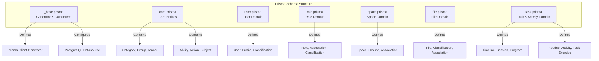
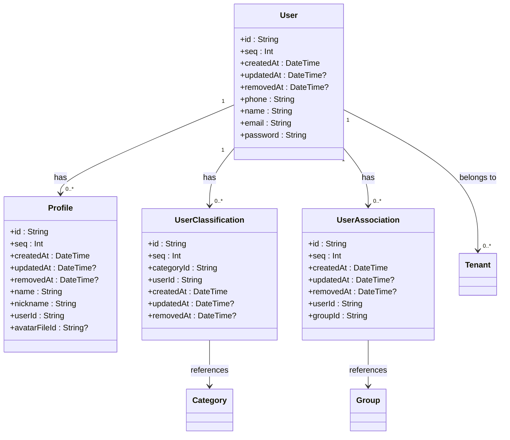
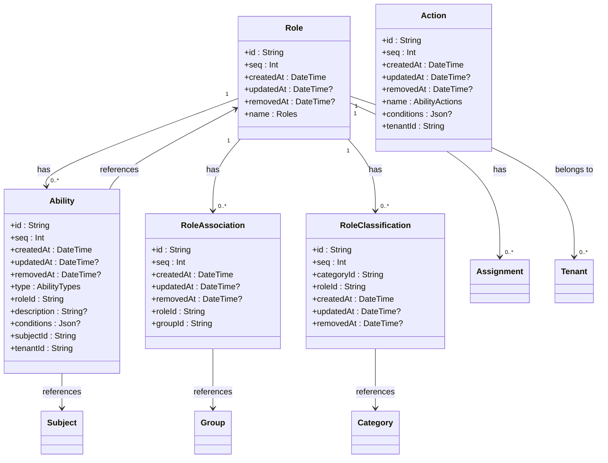
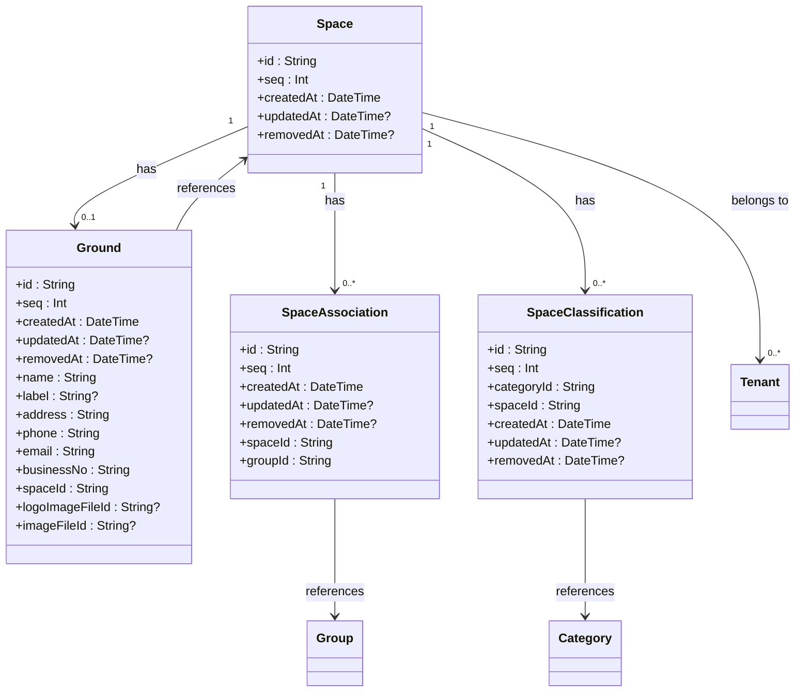
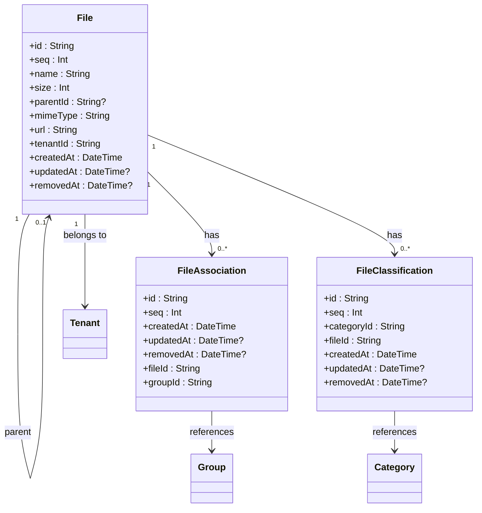
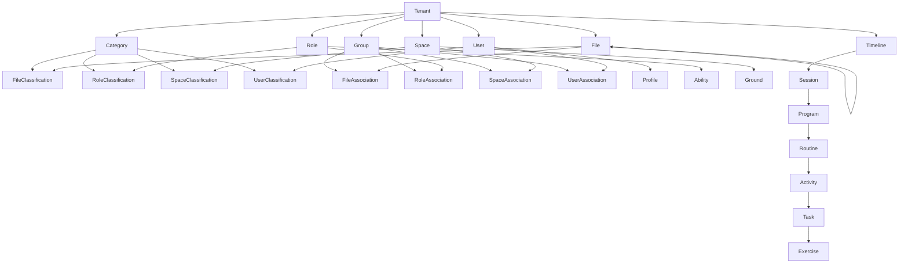

# Data Models & Prisma Schema

<cite>
**Referenced Files in This Document**   
- [core.prisma](file://packages/schema/prisma/schema/core.prisma)
- [user.prisma](file://packages/schema/prisma/schema/user.prisma)
- [role.prisma](file://packages/schema/prisma/schema/role.prisma)
- [space.prisma](file://packages/schema/prisma/schema/space.prisma)
- [file.prisma](file://packages/schema/prisma/schema/file.prisma)
- [task.prisma](file://packages/schema/prisma/schema/task.prisma)
- [_base.prisma](file://packages/schema/prisma/schema/_base.prisma)
</cite>

## Table of Contents
1. [Introduction](#introduction)
2. [Project Structure](#project-structure)
3. [Core Components](#core-components)
4. [Architecture Overview](#architecture-overview)
5. [Detailed Component Analysis](#detailed-component-analysis)
6. [Dependency Analysis](#dependency-analysis)
7. [Performance Considerations](#performance-considerations)
8. [Troubleshooting Guide](#troubleshooting-guide)
9. [Conclusion](#conclusion)

## Introduction
This document provides comprehensive documentation for the Prisma schema in the prj-core repository, detailing the data models, entity relationships, and database design patterns. The system implements a multi-tenant architecture with a rich domain model supporting users, tenants, roles, spaces, programs, routines, exercises, sessions, and files. The schema is organized using a modular approach with domain-specific schema files that define the core entities and their relationships.

## Project Structure
The Prisma schema is organized in a modular structure within the packages/schema/prisma/schema directory, with separate files for different domain areas. This modular approach allows for better organization and maintainability of the schema definitions. The base configuration is defined in _base.prisma, while domain-specific models are organized in separate files such as core.prisma, user.prisma, role.prisma, space.prisma, file.prisma, and task.prisma.



**Diagram sources**
- [_base.prisma](file://packages/schema/prisma/schema/_base.prisma)
- [core.prisma](file://packages/schema/prisma/schema/core.prisma)
- [user.prisma](file://packages/schema/prisma/schema/user.prisma)
- [role.prisma](file://packages/schema/prisma/schema/role.prisma)
- [space.prisma](file://packages/schema/prisma/schema/space.prisma)
- [file.prisma](file://packages/schema/prisma/schema/file.prisma)
- [task.prisma](file://packages/schema/prisma/schema/task.prisma)

**Section sources**
- [_base.prisma](file://packages/schema/prisma/schema/_base.prisma)
- [core.prisma](file://packages/schema/prisma/schema/core.prisma)

## Core Components
The core components of the data model include the fundamental entities that form the foundation of the system: User, Tenant, Role, Space, and Category. These entities establish the multi-tenancy model and access control framework. The User entity represents system users with unique phone, name, and email identifiers. The Tenant entity connects users to specific organizational contexts, while Roles define permission sets within each tenant. Spaces represent physical or logical locations, and Categories provide a hierarchical classification system that can be applied across different entity types.

**Section sources**
- [core.prisma](file://packages/schema/prisma/schema/core.prisma)
- [user.prisma](file://packages/schema/prisma/schema/user.prisma)
- [role.prisma](file://packages/schema/prisma/schema/role.prisma)
- [space.prisma](file://packages/schema/prisma/schema/space.prisma)

## Architecture Overview
The data architecture implements a multi-tenant SaaS platform with a rich domain model supporting scheduling, programming, and content management. The system is built on PostgreSQL with Prisma as the ORM layer, following a modular schema organization. The architecture supports complex relationships between entities while maintaining data isolation between tenants. The model incorporates soft deletion through removedAt fields, temporal tracking with createdAt and updatedAt fields, and hierarchical relationships through parent-child associations.

```mermaid
graph TD
subgraph "Core Identity & Access"
User --> |has many| Profile
User --> |has many| Tenant
Role --> |has many| Ability
Tenant --> |belongs to| User
Tenant --> |belongs to| Role
Tenant --> |belongs to| Space
end
subgraph "Classification & Grouping"
Category --> |has many| Category
Category --> |has many| FileClassification
Category --> |has many| RoleClassification
Category --> |has many| SpaceClassification
Category --> |has many| UserClassification
Group --> |has many| FileAssociation
Group --> |has many| RoleAssociation
Group --> |has many| SpaceAssociation
Group --> |has many| UserAssociation
end
subgraph "Content & Media"
File --> |has many| File
File --> |has one| FileClassification
File --> |has many| FileAssociation
end
subgraph "Scheduling & Programming"
Timeline --> |has many| Session
Session --> |has many| Program
Program --> |belongs to| Routine
Program --> |has one| Instructor
Routine --> |has many| Activity
Activity --> |belongs to| Task
Task --> |has one| Exercise
end
User < --> |participates in| Program
Exercise --> |references| File
Ground --> |represents| Space
```

**Diagram sources**
- [core.prisma](file://packages/schema/prisma/schema/core.prisma)
- [user.prisma](file://packages/schema/prisma/schema/user.prisma)
- [role.prisma](file://packages/schema/prisma/schema/role.prisma)
- [space.prisma](file://packages/schema/prisma/schema/space.prisma)
- [file.prisma](file://packages/schema/prisma/schema/file.prisma)
- [task.prisma](file://packages/schema/prisma/schema/task.prisma)

## Detailed Component Analysis

### User Management Analysis
The user management system implements a comprehensive identity model with profiles, classifications, and associations. The User entity serves as the central identity with unique constraints on phone, name, and email fields. Users can belong to multiple tenants through the Tenant entity, enabling the multi-tenancy model. Profiles extend user information with additional attributes like nickname and avatar. Classifications and associations enable categorization and grouping of users through the Category and Group entities.



**Diagram sources**
- [user.prisma](file://packages/schema/prisma/schema/user.prisma)
- [core.prisma](file://packages/schema/prisma/schema/core.prisma)

**Section sources**
- [user.prisma](file://packages/schema/prisma/schema/user.prisma)
- [core.prisma](file://packages/schema/prisma/schema/core.prisma)

### Role-Based Access Control Analysis
The role-based access control (RBAC) system implements a flexible permissions model with abilities, actions, and subjects. The Role entity defines user roles within a tenant, with predefined roles including USER, SUPER_ADMIN, and ADMIN. Abilities grant specific permissions to roles, with actions like CREATE, READ, UPDATE, DELETE, and ACCESS. The system supports fine-grained access control through the Ability entity, which can be associated with specific subjects. Role classifications and associations enable categorization and grouping of roles through the Category and Group entities.



**Diagram sources**
- [role.prisma](file://packages/schema/prisma/schema/role.prisma)
- [core.prisma](file://packages/schema/prisma/schema/core.prisma)

**Section sources**
- [role.prisma](file://packages/schema/prisma/schema/role.prisma)
- [core.prisma](file://packages/schema/prisma/schema/core.prisma)

### Space & Location Management Analysis
The space management system models physical and logical locations within the application. The Space entity represents a location that can be associated with a Ground (physical location) containing address, contact information, and business details. Spaces can be classified and grouped through the Category and Group entities. The system supports hierarchical organization of spaces through parent-child relationships. The Ground entity contains detailed information about physical locations including address, phone, email, and business number.



**Diagram sources**
- [space.prisma](file://packages/schema/prisma/schema/space.prisma)
- [core.prisma](file://packages/schema/prisma/schema/core.prisma)

**Section sources**
- [space.prisma](file://packages/schema/prisma/schema/space.prisma)
- [core.prisma](file://packages/schema/prisma/schema/core.prisma)

### File Management Analysis
The file management system implements a hierarchical file structure with classification and association capabilities. The File entity represents files with properties like name, size, MIME type, and URL. Files can be organized in a tree structure through parent-child relationships. The system supports classification of files through categories and grouping through associations with groups. Each file belongs to a tenant, ensuring data isolation in the multi-tenant architecture.



**Diagram sources**
- [file.prisma](file://packages/schema/prisma/schema/file.prisma)
- [core.prisma](file://packages/schema/prisma/schema/core.prisma)

**Section sources**
- [file.prisma](file://packages/schema/prisma/schema/file.prisma)
- [core.prisma](file://packages/schema/prisma/schema/core.prisma)

### Program & Activity Management Analysis
The program and activity management system implements a comprehensive scheduling and programming model. The Timeline entity groups related sessions, providing a way to organize events by time periods or themes. Sessions represent specific time-based events that can be one-time, range-based, or recurring. Programs represent scheduled activities within sessions, linking to routines and instructors. Routines define reusable sequences of activities, while activities specify how tasks should be performed with order, repetitions, and rest times. The Task entity serves as an abstraction layer, allowing domain-specific implementations like Exercise.

```mermaid
classDiagram
class Timeline {
+id : String
+seq : Int
+createdAt : DateTime
+updatedAt : DateTime?
+removedAt : DateTime?
+tenantId : String
+name : String
+description : String?
}
class Session {
+id : String
+seq : Int
+createdAt : DateTime
+updatedAt : DateTime?
+removedAt : DateTime?
+type : SessionTypes
+repeatCycleType : RepeatCycleTypes?
+startDateTime : DateTime?
+endDateTime : DateTime?
+recurringDayOfWeek : RecurringDayOfWeek?
+timelineId : String
+name : String
+description : String?
}
class Program {
+id : String
+seq : Int
+createdAt : DateTime
+updatedAt : DateTime?
+removedAt : DateTime?
+routineId : String
+sessionId : String
+instructorId : String
+capacity : Int
+name : String
+level : String?
}
class Routine {
+id : String
+seq : Int
+createdAt : DateTime
+updatedAt : DateTime?
+removedAt : DateTime?
+name : String
+label : String
}
class Activity {
+id : String
+seq : Int
+createdAt : DateTime
+updatedAt : DateTime?
+removedAt : DateTime?
+routineId : String
+taskId : String
+order : Int
+repetitions : Int
+restTime : Int
+notes : String?
}
class Task {
+id : String
+seq : Int
+createdAt : DateTime
+updatedAt : DateTime?
+removedAt : DateTime?
+tenantId : String
}
class Exercise {
+id : String
+seq : Int
+createdAt : DateTime
+updatedAt : DateTime?
+removedAt : DateTime?
+duration : Int
+count : Int
+taskId : String
+description : String?
+imageFileId : String?
+videoFileId : String?
+name : String
}
Timeline "1" --> "0..*" Session : contains
Session "1" --> "0..*" Program : contains
Program "1" --> Routine : references
Program "1" --> Session : references
Routine "1" --> "0..*" Activity : contains
Activity "1" --> Routine : references
Activity "1" --> Task : references
Task "1" --> "0..*" Activity : used in
Task "1" --> "0..1" Exercise : extends
Exercise --> Task : references
```



**Diagram sources**
- [task.prisma](file://packages/schema/prisma/schema/task.prisma)
- [core.prisma](file://packages/schema/prisma/schema/core.prisma)

**Section sources**
- [task.prisma](file://packages/schema/prisma/schema/task.prisma)
- [core.prisma](file://packages/schema/prisma/schema/core.prisma)

## Dependency Analysis
The data model exhibits a well-structured dependency graph with clear relationships between entities. The core dependencies flow from the Tenant entity, which connects Users, Roles, and Spaces. Most entities have a tenantId field, establishing the multi-tenancy model and ensuring data isolation. The Category and Group entities serve as classification and grouping mechanisms that can be applied across different entity types through classification and association entities. The system uses a consistent pattern of soft deletion with removedAt fields and temporal tracking with createdAt and updatedAt fields across all entities.



**Diagram sources**
- [core.prisma](file://packages/schema/prisma/schema/core.prisma)
- [user.prisma](file://packages/schema/prisma/schema/user.prisma)
- [role.prisma](file://packages/schema/prisma/schema/role.prisma)
- [space.prisma](file://packages/schema/prisma/schema/space.prisma)
- [file.prisma](file://packages/schema/prisma/schema/file.prisma)
- [task.prisma](file://packages/schema/prisma/schema/task.prisma)

**Section sources**
- [core.prisma](file://packages/schema/prisma/schema/core.prisma)
- [user.prisma](file://packages/schema/prisma/schema/user.prisma)
- [role.prisma](file://packages/schema/prisma/schema/role.prisma)
- [space.prisma](file://packages/schema/prisma/schema/space.prisma)
- [file.prisma](file://packages/schema/prisma/schema/file.prisma)
- [task.prisma](file://packages/schema/prisma/schema/task.prisma)

## Performance Considerations
The data model incorporates several performance optimization strategies through indexing and relationship design. Most entities have indexes on tenantId to optimize queries within a specific tenant context. The schema includes composite indexes on frequently queried field combinations, such as [timelineId, startDateTime] for sessions and [sessionId, routineId] for programs. The use of UUIDs for primary keys ensures global uniqueness and supports distributed systems. The soft deletion pattern with removedAt fields allows for data retention and recovery while maintaining query performance by avoiding physical record deletion.

**Section sources**
- [task.prisma](file://packages/schema/prisma/schema/task.prisma)
- [core.prisma](file://packages/schema/prisma/schema/core.prisma)

## Troubleshooting Guide
When troubleshooting issues with the data model, consider the following common scenarios: Ensure that tenantId values are correctly set for all tenant-scoped entities to maintain data isolation. Verify that relationships are properly established, particularly in the classification and association patterns where Category and Group entities are linked to other entities. Check that soft deletion is handled correctly by including removedAt: null conditions in queries when retrieving active records. Validate that UUID generation is working correctly for primary keys. Ensure that foreign key relationships are maintained when creating or updating related records.

**Section sources**
- [core.prisma](file://packages/schema/prisma/schema/core.prisma)
- [user.prisma](file://packages/schema/prisma/schema/user.prisma)
- [role.prisma](file://packages/schema/prisma/schema/role.prisma)
- [space.prisma](file://packages/schema/prisma/schema/space.prisma)
- [file.prisma](file://packages/schema/prisma/schema/file.prisma)
- [task.prisma](file://packages/schema/prisma/schema/task.prisma)

## Conclusion
The Prisma schema in prj-core implements a comprehensive data model for a multi-tenant SaaS application with rich functionality for user management, access control, content management, and scheduling. The modular schema organization improves maintainability and clarity. The data model follows consistent patterns for temporal tracking, soft deletion, and multi-tenancy. The relationship design supports complex business requirements while maintaining data integrity and performance. The use of classification and association patterns provides flexibility in organizing and categorizing entities across different domains.