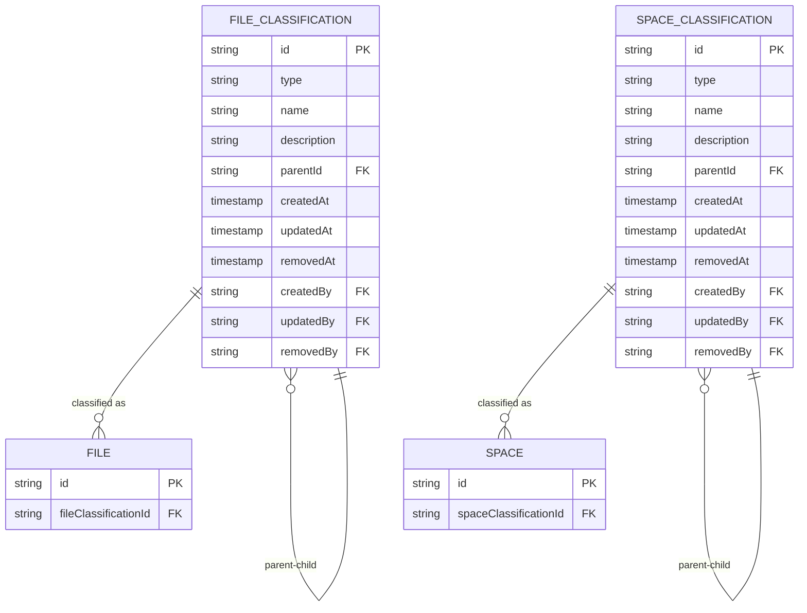
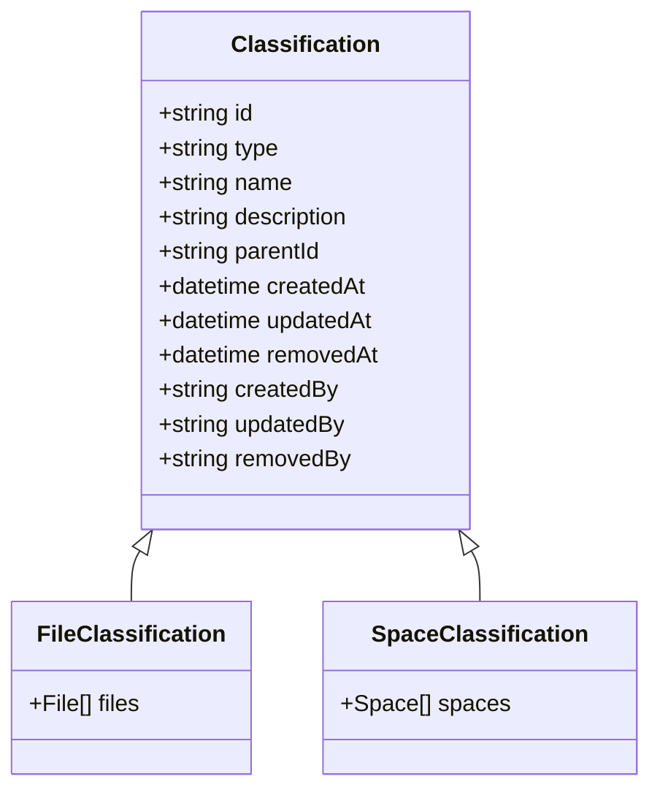
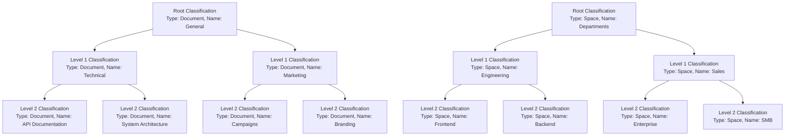
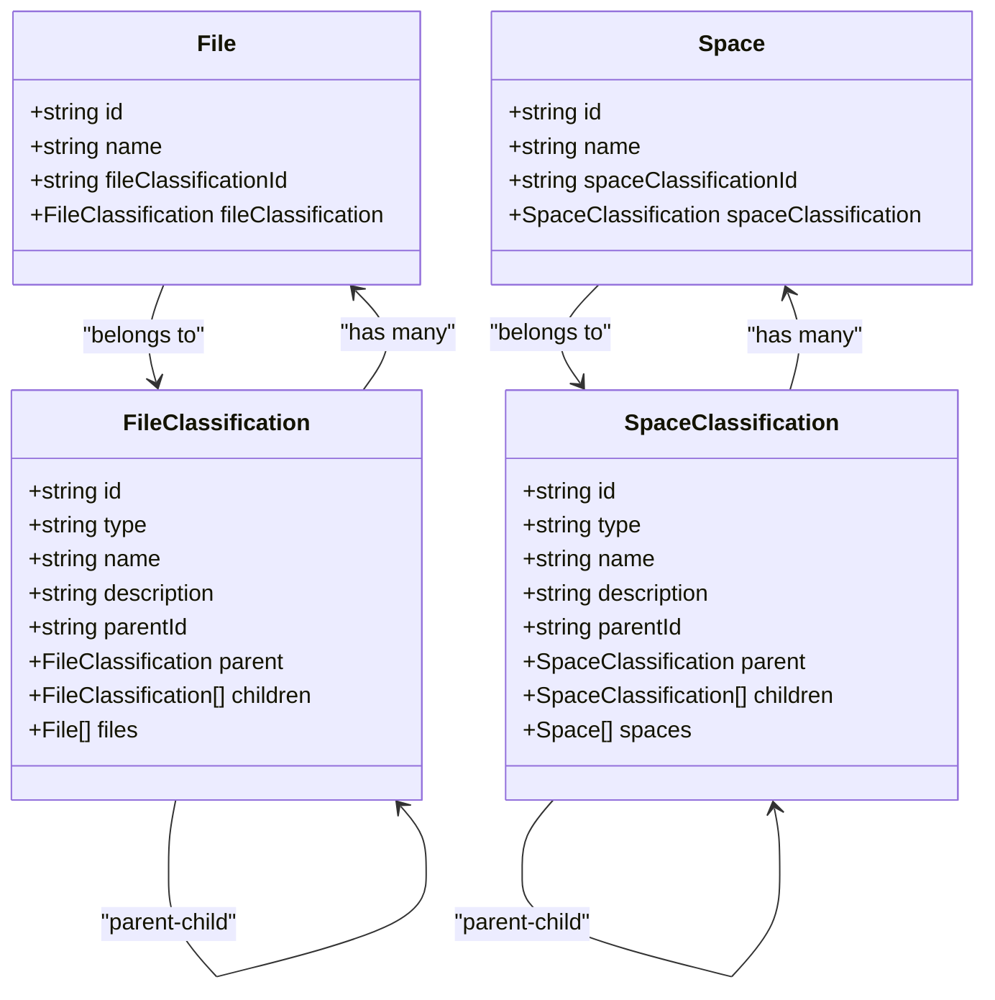
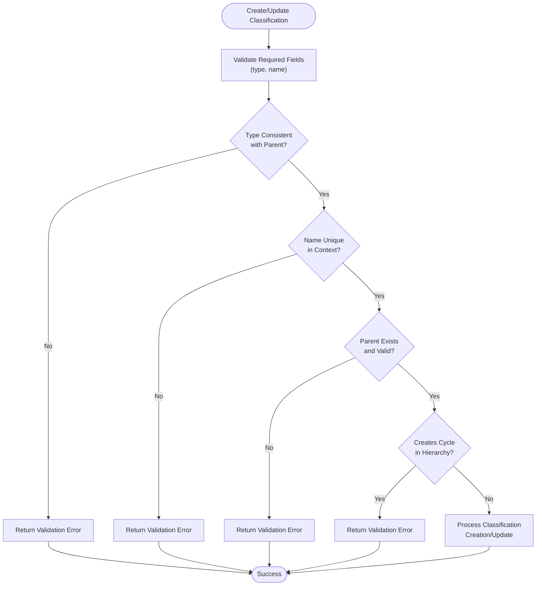
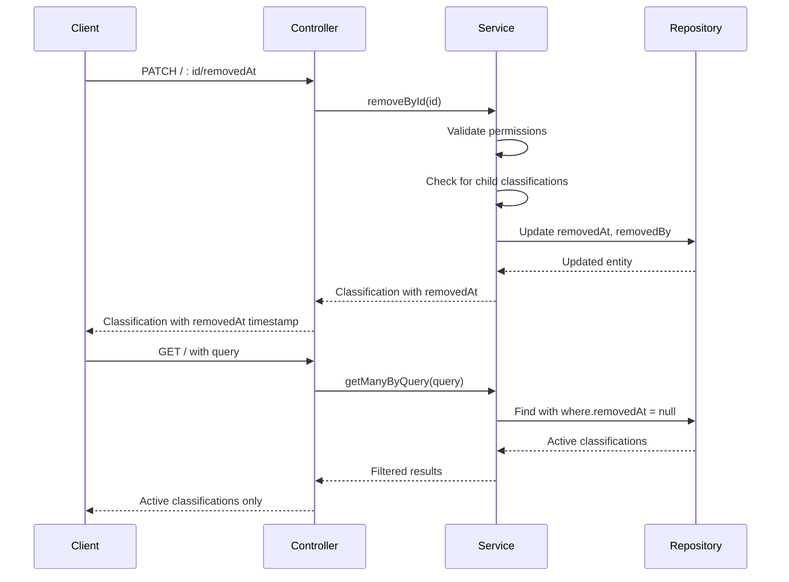

# File & Space Classifications

<cite>
**Referenced Files in This Document**   
- [file-classification.entity.ts](file://packages/schema/src/entity/file-classification.entity.ts)
- [space-classification.entity.ts](file://packages/schema/src/entity/space-classification.entity.ts)
- [file-classifications.service.ts](file://apps/server/src/shared/service/resources/file-classifications.service.ts)
- [space-classifications.service.ts](file://apps/server/src/shared/service/resources/space-classifications.service.ts)
- [file-classifications.controller.ts](file://apps/server/src/shared/controller/resources/file-classifications.controller.ts)
- [space-classifications.controller.ts](file://apps/server/src/shared/controller/resources/space-classifications.controller.ts)
- [create-file-classification.dto.ts](file://packages/schema/src/dto/create/create-file-classification.dto.ts)
- [create-space-classification.dto.ts](file://packages/schema/src/dto/create/create-space-classification.dto.ts)
- [file-classification.dto.ts](file://packages/schema/src/dto/file-classification.dto.ts)
- [space-classification.dto.ts](file://packages/schema/src/dto/space-classification.dto.ts)
- [query-file-classification.dto.ts](file://packages/schema/src/dto/query/query-file-classification.dto.ts)
- [query-space-classification.dto.ts](file://packages/schema/src/dto/query/query-space-classification.dto.ts)
</cite>

## Table of Contents
1. [Introduction](#introduction)
2. [Core Data Model](#core-data-model)
3. [Classification Taxonomy](#classification-taxonomy)
4. [Hierarchical Structure](#hierarchical-structure)
5. [Entity Relationships](#entity-relationships)
6. [Data Validation Rules](#data-validation-rules)
7. [Indexing Strategies](#indexing-strategies)
8. [Soft-Delete Implementation](#soft-delete-implementation)
9. [API Endpoints](#api-endpoints)

## Introduction
This document provides comprehensive documentation for the File and Space Classification systems in prj-core. The classification system implements a flexible taxonomy framework that enables hierarchical categorization of files and spaces through dedicated classification entities. The system supports recursive querying, parent-child relationships, and robust data integrity through validation rules and indexing strategies. This documentation details the data model, relationships, validation mechanisms, and operational characteristics of the classification system.

## Core Data Model

The classification system is built around two primary entity types: FileClassification and SpaceClassification. Both entities share a common structure with type, name, and description fields, and implement similar patterns for hierarchical organization and data management.



**Diagram sources**
- [file-classification.entity.ts](file://packages/schema/src/entity/file-classification.entity.ts)
- [space-classification.entity.ts](file://packages/schema/src/entity/space-classification.entity.ts)

**Section sources**
- [file-classification.entity.ts](file://packages/schema/src/entity/file-classification.entity.ts)
- [space-classification.entity.ts](file://packages/schema/src/entity/space-classification.entity.ts)

## Classification Taxonomy

The classification system implements a taxonomy pattern through the Classification entities, which contain three core fields that define the classification:

- **type**: A string field that categorizes the classification into a specific taxonomy type
- **name**: A string field that provides the human-readable name of the classification
- **description**: An optional string field that provides additional context about the classification

The type field serves as the primary categorization mechanism, allowing for different classification schemes within the same system. Each classification must have a unique combination of type and name within its hierarchy to prevent duplication.



**Diagram sources**
- [file-classification.entity.ts](file://packages/schema/src/entity/file-classification.entity.ts)
- [space-classification.entity.ts](file://packages/schema/src/entity/space-classification.entity.ts)

**Section sources**
- [file-classification.entity.ts](file://packages/schema/src/entity/file-classification.entity.ts)
- [space-classification.entity.ts](file://packages/schema/src/entity/space-classification.entity.ts)

## Hierarchical Structure

The classification system supports hierarchical organization through parent-child relationships. Each classification can have a parent classification, creating a tree-like structure that enables recursive querying and nested categorization.

The hierarchical structure is implemented through the parentId field, which references another classification of the same type (file classification references another file classification, space classification references another space classification). This enables the creation of nested taxonomies where classifications can be organized in multiple levels.



**Diagram sources**
- [file-classification.entity.ts](file://packages/schema/src/entity/file-classification.entity.ts)
- [space-classification.entity.ts](file://packages/schema/src/entity/space-classification.entity.ts)

**Section sources**
- [file-classifications.service.ts](file://apps/server/src/shared/service/resources/file-classifications.service.ts)
- [space-classifications.service.ts](file://apps/server/src/shared/service/resources/space-classifications.service.ts)

## Entity Relationships

The classification system establishes relationships between classifications and their respective entities through dedicated association patterns. File classifications are linked to files, while space classifications are linked to spaces.

The relationship between FileClassification and File is implemented as a one-to-many relationship, where a single file classification can be assigned to multiple files, but each file has exactly one classification. Similarly, the relationship between SpaceClassification and Space follows the same one-to-many pattern.



**Diagram sources**
- [file-classification.entity.ts](file://packages/schema/src/entity/file-classification.entity.ts)
- [space-classification.entity.ts](file://packages/schema/src/entity/space-classification.entity.ts)
- [file.entity.ts](file://packages/schema/src/entity/file.entity.ts)
- [space.entity.ts](file://packages/schema/src/entity/space.entity.ts)

**Section sources**
- [file-classification.entity.ts](file://packages/schema/src/entity/file-classification.entity.ts)
- [space-classification.entity.ts](file://packages/schema/src/entity/space-classification.entity.ts)

## Data Validation Rules

The classification system implements comprehensive data validation rules to ensure data integrity and consistency. These rules are enforced at both the DTO (Data Transfer Object) level and the service level.

Key validation rules include:
- **Required fields**: Type and name fields are required for all classifications
- **Type consistency**: Classifications must maintain type consistency in parent-child relationships
- **Name uniqueness**: Classification names must be unique within their type and parent context
- **Hierarchical integrity**: Parent references must point to valid classifications of the same type
- **Cyclic reference prevention**: The system prevents circular references in the hierarchy

The validation is implemented through class-validator decorators in the DTOs and additional business logic validation in the service layer.



**Diagram sources**
- [create-file-classification.dto.ts](file://packages/schema/src/dto/create/create-file-classification.dto.ts)
- [create-space-classification.dto.ts](file://packages/schema/src/dto/create/create-space-classification.dto.ts)
- [file-classifications.service.ts](file://apps/server/src/shared/service/resources/file-classifications.service.ts)
- [space-classifications.service.ts](file://apps/server/src/shared/service/resources/space-classifications.service.ts)

**Section sources**
- [create-file-classification.dto.ts](file://packages/schema/src/dto/create/create-file-classification.dto.ts)
- [create-space-classification.dto.ts](file://packages/schema/src/dto/create/create-space-classification.dto.ts)
- [file-classifications.service.ts](file://apps/server/src/shared/service/resources/file-classifications.service.ts)
- [space-classifications.service.ts](file://apps/server/src/shared/service/resources/space-classifications.service.ts)

## Indexing Strategies

The classification system implements strategic indexing on key fields to optimize query performance, particularly for filtering and hierarchical operations.

Primary indexes include:
- **Type and Name Composite Index**: Enables efficient filtering by type and name combinations
- **Parent ID Index**: Optimizes hierarchical queries and child classification retrieval
- **Soft-Delete Index**: Includes removedAt in indexes to efficiently filter active records
- **Timestamp Indexes**: Supports time-based queries and sorting

These indexes ensure that common operations such as retrieving all classifications of a specific type, finding children of a parent classification, or searching by name are performed efficiently even as the dataset grows.

```mermaid
erDiagram
FILE_CLASSIFICATION {
string id PK
string type "Indexed"
string name "Indexed"
string description
string parentId "Indexed"
timestamp createdAt "Indexed"
timestamp updatedAt "Indexed"
timestamp removedAt "Indexed"
}
SPACE_CLASSIFICATION {
string id PK
string type "Indexed"
string name "Indexed"
string description
string parentId "Indexed"
timestamp createdAt "Indexed"
timestamp updatedAt "Indexed"
timestamp removedAt "Indexed"
}
index type_name_index on FILE_CLASSIFICATION(type, name)
index parent_index on FILE_CLASSIFICATION(parentId)
index soft_delete_index on FILE_CLASSIFICATION(removedAt)
index timestamps_index on FILE_CLASSIFICATION(createdAt, updatedAt)
index type_name_index on SPACE_CLASSIFICATION(type, name)
index parent_index on SPACE_CLASSIFICATION(parentId)
index soft_delete_index on SPACE_CLASSIFICATION(removedAt)
index timestamps_index on SPACE_CLASSIFICATION(createdAt, updatedAt)
```

**Diagram sources**
- [file-classification.entity.ts](file://packages/schema/src/entity/file-classification.entity.ts)
- [space-classification.entity.ts](file://packages/schema/src/entity/space-classification.entity.ts)

**Section sources**
- [file-classification.entity.ts](file://packages/schema/src/entity/file-classification.entity.ts)
- [space-classification.entity.ts](file://packages/schema/src/entity/space-classification.entity.ts)

## Soft-Delete Implementation

The classification system implements soft-delete functionality to preserve data integrity and maintain audit trails. Instead of permanently removing records, the system marks them as deleted by setting the removedAt timestamp and associated metadata.

Key aspects of the soft-delete implementation:
- **removedAt field**: Timestamp indicating when the classification was deleted
- **removedBy field**: Reference to the user who performed the deletion
- **Automatic filtering**: Query methods automatically exclude soft-deleted records by default
- **Restore capability**: Soft-deleted records can be restored by clearing the removedAt field
- **Audit trail**: All modification metadata (createdBy, updatedBy, removedBy) is preserved

The implementation provides both soft-delete (PATCH with removedAt) and hard-delete (DELETE) endpoints, allowing for different retention policies based on business requirements.



**Diagram sources**
- [file-classifications.controller.ts](file://apps/server/src/shared/controller/resources/file-classifications.controller.ts)
- [space-classifications.controller.ts](file://apps/server/src/shared/controller/resources/space-classifications.controller.ts)
- [file-classifications.service.ts](file://apps/server/src/shared/service/resources/file-classifications.service.ts)
- [space-classifications.service.ts](file://apps/server/src/shared/service/resources/space-classifications.service.ts)

**Section sources**
- [file-classifications.controller.ts](file://apps/server/src/shared/controller/resources/file-classifications.controller.ts)
- [space-classifications.controller.ts](file://apps/server/src/shared/controller/resources/space-classifications.controller.ts)
- [file-classifications.service.ts](file://apps/server/src/shared/service/resources/file-classifications.service.ts)
- [space-classifications.service.ts](file://apps/server/src/shared/service/resources/space-classifications.service.ts)

## API Endpoints

The classification system exposes a comprehensive REST API for managing file and space classifications. The endpoints follow consistent patterns for both file and space classifications.

### File Classification Endpoints

| Method | Endpoint | Description | Request Body | Response |
|--------|---------|-------------|--------------|----------|
| POST | /file-classifications | Create new file classification | CreateFileClassificationDto | FileClassificationDto |
| GET | /file-classifications/:id | Get file classification by ID | None | FileClassificationDto |
| PATCH | /file-classifications/:id | Update file classification | UpdateFileClassificationDto | FileClassificationDto |
| PATCH | /file-classifications/:id/removedAt | Soft-delete file classification | None | FileClassificationDto |
| DELETE | /file-classifications/:id | Hard-delete file classification | None | FileClassificationDto |
| GET | /file-classifications | Query file classifications | Query parameters | Array of FileClassificationDto |

### Space Classification Endpoints

| Method | Endpoint | Description | Request Body | Response |
|--------|---------|-------------|--------------|----------|
| POST | /space-classifications | Create new space classification | CreateSpaceClassificationDto | SpaceClassificationDto |
| GET | /space-classifications/:id | Get space classification by ID | None | SpaceClassificationDto |
| PATCH | /space-classifications/:id | Update space classification | UpdateSpaceClassificationDto | SpaceClassificationDto |
| PATCH | /space-classifications/:id/removedAt | Soft-delete space classification | None | SpaceClassificationDto |
| DELETE | /space-classifications/:id | Hard-delete space classification | None | SpaceClassificationDto |
| GET | /space-classifications | Query space classifications | Query parameters | Array of SpaceClassificationDto |

**Section sources**
- [file-classifications.controller.ts](file://apps/server/src/shared/controller/resources/file-classifications.controller.ts)
- [space-classifications.controller.ts](file://apps/server/src/shared/controller/resources/space-classifications.controller.ts)
- [create-file-classification.dto.ts](file://packages/schema/src/dto/create/create-file-classification.dto.ts)
- [create-space-classification.dto.ts](file://packages/schema/src/dto/create/create-space-classification.dto.ts)
- [file-classification.dto.ts](file://packages/schema/src/dto/file-classification.dto.ts)
- [space-classification.dto.ts](file://packages/schema/src/dto/space-classification.dto.ts)
- [query-file-classification.dto.ts](file://packages/schema/src/dto/query/query-file-classification.dto.ts)
- [query-space-classification.dto.ts](file://packages/schema/src/dto/query/query-space-classification.dto.ts)