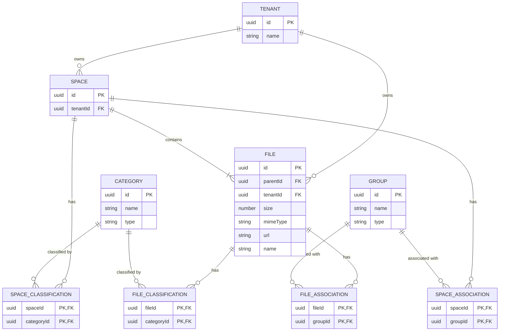
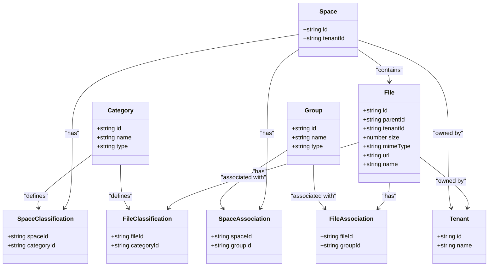

# File & Space Data Models

<cite>
**Referenced Files in This Document**   
- [file.entity.ts](file://packages/schema/src/entity/file.entity.ts)
- [space.entity.ts](file://packages/schema/src/entity/space.entity.ts)
- [file-association.entity.ts](file://packages/schema/src/entity/file-association.entity.ts)
- [space-association.entity.ts](file://packages/schema/src/entity/space-association.entity.ts)
- [file-classification.entity.ts](file://packages/schema/src/entity/file-classification.entity.ts)
- [space-classification.entity.ts](file://packages/schema/src/entity/space-classification.entity.ts)
- [file.dto.ts](file://packages/schema/src/dto/file.dto.ts)
- [space.dto.ts](file://packages/schema/src/dto/space.dto.ts)
- [file-classification.dto.ts](file://packages/schema/src/dto/file-classification.dto.ts)
- [space-classification.dto.ts](file://packages/schema/src/dto/space-classification.dto.ts)
- [file-association.dto.ts](file://packages/schema/src/dto/file-association.dto.ts)
- [space-association.dto.ts](file://packages/schema/src/dto/space-association.dto.ts)
- [field.decorators.ts](file://packages/schema/src/decorator/field.decorators.ts)
</cite>

## Table of Contents
1. [Introduction](#introduction)
2. [File Entity Model](#file-entity-model)
3. [Space Entity Model](#space-entity-model)
4. [File Classification System](#file-classification-system)
5. [Space Classification System](#space-classification-system)
6. [File-Space Association Patterns](#file-space-association-patterns)
7. [Data Validation and Constraints](#data-validation-and-constraints)
8. [Indexing and Search Strategies](#indexing-and-search-strategies)
9. [Relationship Diagrams](#relationship-diagrams)

## Introduction
This document provides comprehensive documentation for the File and Space entities within the prj-core system. It details the data models, relationships, classification systems, and access control mechanisms that govern file management and organizational hierarchy. The documentation covers metadata structures, storage references, classification taxonomies, association patterns, and data validation rules that ensure data integrity across the platform.

## File Entity Model

The File entity represents a digital file within the system, containing essential metadata and storage information. Each file is associated with a parent container, tenant, and includes technical specifications such as size, MIME type, and storage URL.

Key attributes of the File entity include:
- **parentId**: UUID reference to the parent container or directory
- **tenantId**: UUID reference to the owning tenant organization
- **size**: Numeric value representing file size in bytes
- **mimeType**: String identifier for the file's media type
- **url**: String containing the storage location URL
- **name**: Human-readable filename

The File entity extends AbstractEntity and implements data transfer object (DTO) patterns for consistent data handling across the application layers.

**Section sources**
- [file.entity.ts](file://packages/schema/src/entity/file.entity.ts#L1-L15)
- [file.dto.ts](file://packages/schema/src/dto/file.dto.ts#L1-L40)

## Space Entity Model

The Space entity represents an organizational container within the system hierarchy, serving as a logical grouping mechanism for various resources. Spaces support hierarchical organization and can be associated with multiple tenants, classifications, and ground entities.

Key relationships of the Space entity include:
- **tenants**: Collection of Tenant entities associated with the space
- **spaceClassifications**: Collection of SpaceClassification entities defining categorization
- **spaceAssociations**: Collection of SpaceAssociation entities linking to groups
- **ground**: Reference to a Ground entity providing additional context

Spaces function as primary organizational units that can contain files and other resources while maintaining access control and classification metadata.

**Section sources**
- [space.entity.ts](file://packages/schema/src/entity/space.entity.ts#L1-L17)
- [space.dto.ts](file://packages/schema/src/dto/space.dto.ts#L1-L32)

## File Classification System

The file classification system enables categorization of files through a flexible tagging mechanism. The FileClassification entity establishes a many-to-many relationship between files and categories, allowing multiple classification schemes to be applied to individual files.

Key components of the file classification system:
- **FileClassification entity**: Junction table connecting files to categories
- **categoryId**: UUID reference to the classification category
- **fileId**: UUID reference to the associated file
- **category**: Optional navigation property to the Category entity
- **file**: Optional navigation property back to the File entity

This system supports hierarchical taxonomies and allows files to belong to multiple categories simultaneously, enabling sophisticated organization and filtering capabilities.

**Section sources**
- [file-classification.entity.ts](file://packages/schema/src/entity/file-classification.entity.ts#L1-L19)
- [file-classification.dto.ts](file://packages/schema/src/dto/file-classification.dto.ts#L1-L21)

## Space Classification System

The space classification system provides organizational categorization for spaces through the SpaceClassification entity. Similar to the file classification system, it enables spaces to be categorized using a flexible taxonomy approach.

Key components of the space classification system:
- **SpaceClassification entity**: Junction table connecting spaces to categories
- **spaceId**: UUID reference to the associated space
- **categoryId**: UUID reference to the classification category
- **category**: Optional navigation property to the Category entity
- **space**: Optional navigation property back to the Space entity

This classification mechanism supports organizational hierarchies and enables spaces to be grouped by function, department, project type, or other business-relevant dimensions.

**Section sources**
- [space-classification.entity.ts](file://packages/schema/src/entity/space-classification.entity.ts#L1-L19)
- [space-classification.dto.ts](file://packages/schema/src/dto/space-classification.dto.ts#L1-L21)

## File-Space Association Patterns

The system implements association patterns that connect files and spaces through intermediate entities, enabling flexible relationship management and access control inheritance.

### File Association
The FileAssociation entity creates relationships between files and groups:
- **groupId**: UUID reference to the associated group
- **fileId**: UUID reference to the associated file
- **file**: Optional navigation property to the File entity
- **group**: Optional navigation property to the Group entity

### Space Association
The SpaceAssociation entity creates relationships between spaces and groups:
- **spaceId**: UUID reference to the associated space
- **groupId**: UUID reference to the associated group
- **group**: Optional navigation property to the Group entity

These association patterns enable permission inheritance, where access rights are propagated from groups to associated files and spaces, creating a hierarchical security model.

**Section sources**
- [file-association.entity.ts](file://packages/schema/src/entity/file-association.entity.ts#L1-L20)
- [space-association.entity.ts](file://packages/schema/src/entity/space-association.entity.ts#L1-L17)
- [file-association.dto.ts](file://packages/schema/src/dto/file-association.dto.ts#L1-L15)
- [space-association.dto.ts](file://packages/schema/src/dto/space-association.dto.ts#L1-L18)

## Data Validation and Constraints

The system implements comprehensive data validation rules through decorator-based constraints on DTO properties. These validations ensure data integrity and consistency across the application.

### Field Validation Rules
- **UUIDField**: Validates that string values conform to UUID format
- **StringField**: Validates string type with optional length constraints
- **NumberField**: Validates numeric type with optional range constraints
- **ClassField**: Validates complex object types and array structures

### File Upload Constraints
- **Size constraints**: Enforced through NumberField validation on the size property
- **Format restrictions**: Enforced through mimeType validation and business logic
- **Required fields**: parentId, tenantId, name, size, mimeType, and url are required
- **Null safety**: Optional relationships are explicitly marked as nullable

### Data Integrity Rules
- All entity relationships maintain referential integrity through UUID references
- Required fields are enforced at the DTO level before persistence
- Array relationships support multiple associations while maintaining data consistency

**Section sources**
- [file.dto.ts](file://packages/schema/src/dto/file.dto.ts#L1-L40)
- [space.dto.ts](file://packages/schema/src/dto/space.dto.ts#L1-L32)
- [field.decorators.ts](file://packages/schema/src/decorator/field.decorators.ts)

## Indexing and Search Strategies

The system employs indexing strategies to optimize file search and space navigation performance. While specific database indexes are not visible in the entity definitions, the data model supports efficient querying through several mechanisms.

### Query Optimization Features
- **UUID indexing**: All primary and foreign keys use UUIDs, enabling efficient lookups
- **Relationship indexing**: Foreign key fields (parentId, tenantId, etc.) support fast joins
- **Composite queries**: DTO structures enable efficient filtering and sorting
- **Eager loading**: Navigation properties allow for optimized data retrieval

### Search Capabilities
- **Hierarchical navigation**: parentId relationships enable tree traversal
- **Tenant isolation**: tenantId enables efficient multi-tenancy queries
- **Classification filtering**: Classification entities support category-based searches
- **Association queries**: Association entities enable group-based filtering

The data model supports both direct lookups and complex queries across multiple dimensions, including ownership, classification, and organizational structure.

**Section sources**
- [file.entity.ts](file://packages/schema/src/entity/file.entity.ts#L1-L15)
- [space.entity.ts](file://packages/schema/src/entity/space.entity.ts#L1-L17)
- [file.dto.ts](file://packages/schema/src/dto/file.dto.ts#L1-L40)
- [space.dto.ts](file://packages/schema/src/dto/space.dto.ts#L1-L32)

## Relationship Diagrams

**Diagram sources**
- [file.entity.ts](file://packages/schema/src/entity/file.entity.ts#L1-L15)
- [space.entity.ts](file://packages/schema/src/entity/space.entity.ts#L1-L17)
- [file-association.entity.ts](file://packages/schema/src/entity/file-association.entity.ts#L1-L20)
- [space-association.entity.ts](file://packages/schema/src/entity/space-association.entity.ts#L1-L17)
- [file-classification.entity.ts](file://packages/schema/src/entity/file-classification.entity.ts#L1-L19)
- [space-classification.entity.ts](file://packages/schema/src/entity/space-classification.entity.ts#L1-L19)

**Diagram sources**
- [file.entity.ts](file://packages/schema/src/entity/file.entity.ts#L1-L15)
- [space.entity.ts](file://packages/schema/src/entity/space.entity.ts#L1-L17)
- [file-association.entity.ts](file://packages/schema/src/entity/file-association.entity.ts#L1-L20)
- [space-association.entity.ts](file://packages/schema/src/entity/space-association.entity.ts#L1-L17)
- [file-classification.entity.ts](file://packages/schema/src/entity/file-classification.entity.ts#L1-L19)
- [space-classification.entity.ts](file://packages/schema/src/entity/space-classification.entity.ts#L1-L19)