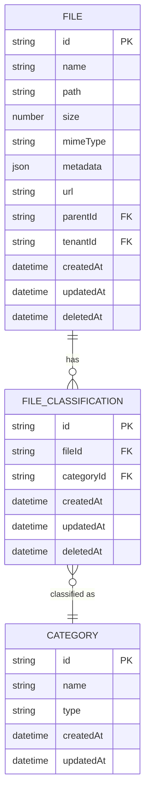

# File Entity Model

<cite>
**Referenced Files in This Document**   
- [file.entity.ts](file://packages/schema/src/entity/file.entity.ts)
- [file-classification.entity.ts](file://packages/schema/src/entity/file-classification.entity.ts)
- [files.module.ts](file://apps/server/src/module/files.module.ts)
- [file-classifications.module.ts](file://apps/server/src/module/file-classifications.module.ts)
- [file-size-validation.pipe.ts](file://apps/server/src/shared/pipe/file-size-validation.pipe.ts)
- [FileUploader.tsx](file://packages/ui/src/components/inputs/FileUploader/FileUploader.tsx)
</cite>

## Table of Contents
1. [Introduction](#introduction)
2. [Core Fields](#core-fields)
3. [Relationship with FileClassification](#relationship-with-fileclassification)
4. [Data Validation Rules](#data-validation-rules)
5. [Database Indexing Strategy](#database-indexing-strategy)
6. [Soft-Delete Implementation](#soft-delete-implementation)
7. [Data Model Diagram](#data-model-diagram)

## Introduction
The File entity in prj-core represents a digital file stored within the system, serving as a fundamental component for managing user-uploaded content. This document provides comprehensive documentation of the File entity model, including its structure, relationships, validation rules, and persistence strategies. The model supports various file types including images, videos, and documents, with robust classification and access control mechanisms.

## Core Fields
The File entity contains essential metadata for managing digital files within the system:

- **id**: Unique identifier (inherited from AbstractEntity)
- **name**: User-friendly name of the file (string)
- **path**: Storage path for the file (string)
- **size**: File size in bytes (number)
- **mimeType**: MIME type indicating file format (string)
- **metadata**: JSON field for storing additional file-specific information
- **url**: Public or private URL for accessing the file
- **parentId**: Reference to parent directory or container
- **tenantId**: Tenant identifier for multi-tenancy support
- **createdAt**: Timestamp of creation (inherited from AbstractEntity)
- **updatedAt**: Timestamp of last modification (inherited from AbstractEntity)
- **deletedAt**: Timestamp for soft-delete functionality

**Section sources**
- [file.entity.ts](file://packages/schema/src/entity/file.entity.ts#L6-L14)

## Relationship with FileClassification
The File entity maintains a one-to-many relationship with the FileClassification entity, enabling flexible categorization and metadata enrichment:

- Each File can have multiple FileClassification entries
- Each FileClassification is associated with exactly one File
- The relationship is established through the fileId foreign key in FileClassification
- Classification inheritance allows files to inherit properties and permissions from their classification categories
- The model supports hierarchical classification through the Category entity

This relationship enables the system to apply different behaviors, access controls, and processing rules based on file classification, while maintaining data integrity through proper foreign key constraints.

**Section sources**
- [file.entity.ts](file://packages/schema/src/entity/file.entity.ts#L6-L14)
- [file-classification.entity.ts](file://packages/schema/src/entity/file-classification.entity.ts#L8-L18)

## Data Validation Rules
The system enforces strict validation rules for file uploads to ensure data quality and system security:

### Size Constraints
- Maximum file size: 50MB (52,428,800 bytes)
- Validation is performed using FileSizeValidationPipe
- Current implementation shows a placeholder validation (1KB limit) that should be updated to 50MB

### Allowed Formats
The system supports three main categories of file types:
- **Image**: JPG, PNG, GIF, and other standard image formats (accept="image/*")
- **Video**: MP4, AVI, MOV, and other common video formats (accept="video/*")
- **Document**: All other supported file types

### Required Fields
The following fields are required for all file records:
- name (string)
- size (number)
- mimeType (string)
- url (string)
- tenantId (string)

The validation is implemented at both the frontend (FileUploader component) and backend (validation pipes) levels to provide immediate user feedback and server-side protection.

**Section sources**
- [file-size-validation.pipe.ts](file://apps/server/src/shared/pipe/file-size-validation.pipe.ts#L1-L10)
- [FileUploader.tsx](file://packages/ui/src/components/inputs/FileUploader/FileUploader.tsx#L153-L161)

## Database Indexing Strategy
To optimize search performance, the system implements database indexing on key fields:

- **name field**: Indexed to enable fast filename searches and autocomplete functionality
- **mimeType field**: Indexed to facilitate filtering by file type (image, video, document)
- **tenantId field**: Indexed for efficient multi-tenancy queries
- **deletedAt field**: Indexed to optimize soft-delete queries and archive operations
- **parentId field**: Indexed to improve directory traversal performance

These indexes support common user operations such as searching for files by name, filtering by type, and navigating folder structures, while maintaining acceptable write performance.

**Section sources**
- [file.entity.ts](file://packages/schema/src/entity/file.entity.ts#L6-L14)

## Soft-Delete Implementation
The File entity implements a soft-delete pattern to preserve data integrity and support recovery:

- **deletedAt field**: Timestamp field that stores the deletion time when a file is removed
- When a file is deleted, deletedAt is set to the current timestamp instead of removing the record
- Soft-deleted files remain in the database but are filtered out from normal queries
- Associated FileClassification records are also soft-deleted through cascade behavior
- The system provides mechanisms to permanently remove soft-deleted files after a retention period
- Recovery functionality allows restoring files by clearing the deletedAt field

This approach ensures that file deletions can be reversed if needed, maintains referential integrity with related records, and supports audit requirements.

**Section sources**
- [file.entity.ts](file://packages/schema/src/entity/file.entity.ts#L6-L14)
- [file-classification.entity.ts](file://packages/schema/src/entity/file-classification.entity.ts#L8-L18)

## Data Model Diagram

**Diagram sources**
- [file.entity.ts](file://packages/schema/src/entity/file.entity.ts#L6-L14)
- [file-classification.entity.ts](file://packages/schema/src/entity/file-classification.entity.ts#L8-L18)