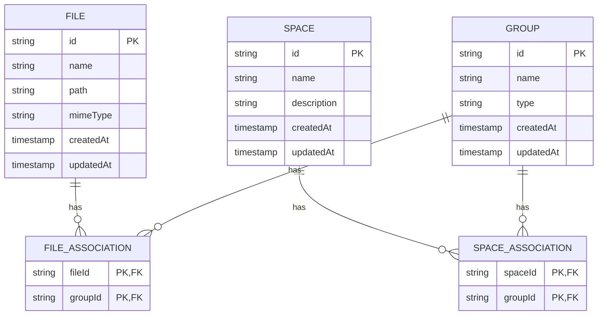
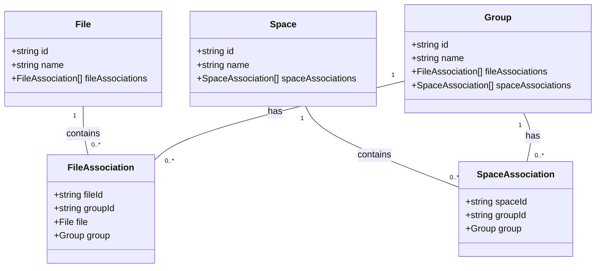

# File-Space Associations

<cite>
**Referenced Files in This Document**   
- [file-association.entity.ts](file://packages/schema/src/entity/file-association.entity.ts)
- [space-association.entity.ts](file://packages/schema/src/entity/space-association.entity.ts)
- [file-association.dto.ts](file://packages/schema/src/dto/file-association.dto.ts)
- [space-association.dto.ts](file://packages/schema/src/dto/space-association.dto.ts)
- [file.entity.ts](file://packages/schema/src/entity/file.entity.ts)
- [space.entity.ts](file://packages/schema/src/entity/space.entity.ts)
- [group.entity.ts](file://packages/schema/src/entity/group.entity.ts)
</cite>

## Table of Contents
1. [Introduction](#introduction)
2. [Data Model Overview](#data-model-overview)
3. [FileAssociation Entity](#fileassociation-entity)
4. [SpaceAssociation Entity](#spaceassociation-entity)
5. [Relationship Implementation](#relationship-implementation)
6. [Foreign Key Constraints and Referential Integrity](#foreign-key-constraints-and-referential-integrity)
7. [Composite Primary Keys and Unique Constraints](#composite-primary-keys-and-unique-constraints)
8. [Cascade Deletion Rules](#cascade-deletion-rules)
9. [Permission Inheritance Model](#permission-inheritance-model)
10. [Data Validation Rules](#data-validation-rules)
11. [Indexing Strategies](#indexing-strategies)
12. [Conclusion](#conclusion)

## Introduction

The File-Space association system in prj-core implements a many-to-many relationship between files and spaces through intermediary association entities. This documentation details the data model, relationship implementation, and associated business rules that govern how files are associated with spaces and how permissions are inherited across these relationships. The design ensures referential integrity, prevents circular references, and optimizes query performance through strategic indexing.

**Section sources**
- [file-association.entity.ts](file://packages/schema/src/entity/file-association.entity.ts)
- [space-association.entity.ts](file://packages/schema/src/entity/space-association.entity.ts)

## Data Model Overview

The File-Space association system is built around two primary association entities: FileAssociation and SpaceAssociation. These entities serve as junction tables that connect files to spaces through group-level associations. The model implements a hierarchical permission inheritance system where files inherit access controls from their associated spaces via group memberships.

**Diagram sources**
- [file-association.entity.ts](file://packages/schema/src/entity/file-association.entity.ts)
- [space-association.entity.ts](file://packages/schema/src/entity/space-association.entity.ts)
- [file.entity.ts](file://packages/schema/src/entity/file.entity.ts)
- [space.entity.ts](file://packages/schema/src/entity/space.entity.ts)
- [group.entity.ts](file://packages/schema/src/entity/group.entity.ts)

**Section sources**
- [file-association.entity.ts](file://packages/schema/src/entity/file-association.entity.ts)
- [space-association.entity.ts](file://packages/schema/src/entity/space-association.entity.ts)

## FileAssociation Entity

The FileAssociation entity represents the many-to-many relationship between files and groups. Each FileAssociation record contains a composite key consisting of fileId and groupId, establishing which files belong to which groups. This entity enables the permission inheritance model by linking files to security groups that are also associated with spaces.

The entity includes navigation properties that allow for eager or lazy loading of related file and group entities, facilitating efficient data retrieval patterns. The implementation extends AbstractEntity and uses the FileAssociationDto for type safety and data transfer consistency.

**Section sources**
- [file-association.entity.ts](file://packages/schema/src/entity/file-association.entity.ts)
- [file-association.dto.ts](file://packages/schema/src/dto/file-association.dto.ts)

## SpaceAssociation Entity

The SpaceAssociation entity represents the many-to-many relationship between spaces and groups. Each SpaceAssociation record contains a composite key consisting of spaceId and groupId, establishing which spaces are accessible to which groups. This entity forms the foundation of the permission inheritance model by defining which groups have access to specific spaces.

Similar to FileAssociation, this entity includes navigation properties for related entities and follows the same pattern of extending AbstractEntity while using SpaceAssociationDto for data transfer consistency. The design ensures that group-level permissions can be efficiently applied across both files and spaces.

**Section sources**
- [space-association.entity.ts](file://packages/schema/src/entity/space-association.entity.ts)
- [space-association.dto.ts](file://packages/schema/src/dto/space-association.dto.ts)

## Relationship Implementation

The many-to-many relationship between files and spaces is implemented through an indirect association pattern using groups as the intermediary entity. This approach provides flexibility in access control by allowing files and spaces to be grouped into logical collections with shared permissions.

The implementation follows a two-step association process:
1. Files are associated with groups through the FileAssociation entity
2. Spaces are associated with the same groups through the SpaceAssociation entity

When a file and space share a common group association, the file inherits the space's access controls. This indirect relationship enables complex permission scenarios while maintaining data integrity and query performance.

**Diagram sources**
- [file-association.entity.ts](file://packages/schema/src/entity/file-association.entity.ts)
- [space-association.entity.ts](file://packages/schema/src/entity/space-association.entity.ts)

**Section sources**
- [file-association.entity.ts](file://packages/schema/src/entity/file-association.entity.ts)
- [space-association.entity.ts](file://packages/schema/src/entity/space-association.entity.ts)

## Foreign Key Constraints and Referential Integrity

The File-Space association system enforces referential integrity through strict foreign key constraints. Both FileAssociation and SpaceAssociation entities include foreign key constraints that ensure referenced files, spaces, and groups must exist before associations can be created.

The foreign key constraints are implemented at the database level through Prisma schema definitions, preventing orphaned records and maintaining data consistency. All ID fields (fileId, spaceId, groupId) are validated as UUIDs before insertion or update operations, ensuring global uniqueness and preventing injection attacks.

The system also implements validation rules to prevent circular references, ensuring that a file cannot be associated with a space through multiple conflicting group memberships. These constraints are enforced at both the application and database levels for maximum reliability.

**Section sources**
- [file-association.entity.ts](file://packages/schema/src/entity/file-association.entity.ts)
- [space-association.entity.ts](file://packages/schema/src/entity/space-association.entity.ts)

## Composite Primary Keys and Unique Constraints

Both FileAssociation and SpaceAssociation entities use composite primary keys consisting of two fields: (fileId, groupId) for FileAssociation and (spaceId, groupId) for SpaceAssociation. This design ensures that each file-group and space-group pairing is unique within the system.

The composite primary keys serve as natural keys that prevent duplicate associations, eliminating the need for surrogate keys and reducing storage overhead. Unique constraints are enforced at the database level, preventing the creation of redundant associations that could lead to inconsistent permission states.

This approach also optimizes query performance for the most common access patterns, such as retrieving all files in a specific group or all spaces accessible to a particular group. The composite keys are specifically designed to support these query patterns efficiently.

**Section sources**
- [file-association.entity.ts](file://packages/schema/src/entity/file-association.entity.ts)
- [space-association.entity.ts](file://packages/schema/src/entity/space-association.entity.ts)

## Cascade Deletion Rules

The File-Space association system implements specific cascade deletion rules to maintain data integrity when records are removed. When a file is deleted, all corresponding FileAssociation records are automatically removed through cascade deletion, ensuring no orphaned association records remain.

Similarly, when a space is deleted, all corresponding SpaceAssociation records are automatically cleaned up. However, group deletions are handled more carefully - deleting a group will remove its associations with both files and spaces, but the files and spaces themselves remain intact.

This cascade strategy prevents data inconsistencies while preserving important content. The rules are implemented at the database level through Prisma relations configuration, ensuring they are enforced regardless of the application layer implementation.

**Section sources**
- [file-association.entity.ts](file://packages/schema/src/entity/file-association.entity.ts)
- [space-association.entity.ts](file://packages/schema/src/entity/space-association.entity.ts)

## Permission Inheritance Model

The permission inheritance model in prj-core allows files to inherit access controls from their associated spaces through shared group memberships. When a user has access to a space through a group membership, they automatically gain access to all files that are associated with the same group.

This inheritance model follows the principle of least privilege, where permissions are granted based on group membership rather than individual assignments. The system evaluates permissions by checking for overlapping group associations between files and spaces, creating a flexible yet secure access control mechanism.

The model supports multiple inheritance paths, allowing a file to inherit permissions from multiple spaces if it belongs to groups associated with those spaces. This enables complex collaboration scenarios while maintaining clear audit trails of permission grants.

**Section sources**
- [file-association.entity.ts](file://packages/schema/src/entity/file-association.entity.ts)
- [space-association.entity.ts](file://packages/schema/src/entity/space-association.entity.ts)

## Data Validation Rules

The File-Space association system implements comprehensive data validation rules to ensure data quality and prevent invalid states. All input data is validated against DTO schemas before processing, with specific rules for UUID format, required fields, and relationship consistency.

Validation rules prevent circular references by ensuring that a file cannot be associated with a space through conflicting group hierarchies. The system also validates that all referenced entities exist before creating associations, preventing orphaned records.

Additional validation rules enforce business constraints, such as preventing the association of system-reserved files with user spaces or restricting certain file types from specific space categories. These rules are implemented using custom decorators and validation pipes within the NestJS framework.

**Section sources**
- [file-association.dto.ts](file://packages/schema/src/dto/file-association.dto.ts)
- [space-association.dto.ts](file://packages/schema/src/dto/space-association.dto.ts)

## Indexing Strategies

The File-Space association system employs strategic indexing on the fileId and spaceId fields to optimize query performance. Composite indexes are created on the primary key fields (fileId, groupId) and (spaceId, groupId) to support efficient lookups for the most common query patterns.

Additional indexes are maintained on individual fields to support queries that filter by groupId alone, enabling fast retrieval of all files or spaces associated with a particular group. These indexes are carefully balanced against write performance, with monitoring in place to identify and address any performance bottlenecks.

The indexing strategy also considers foreign key relationships, ensuring that joins between association tables and their parent entities (files, spaces, groups) are performed efficiently. Indexes are regularly reviewed and optimized based on query patterns and usage statistics.

**Section sources**
- [file-association.entity.ts](file://packages/schema/src/entity/file-association.entity.ts)
- [space-association.entity.ts](file://packages/schema/src/entity/space-association.entity.ts)

## Conclusion

The File-Space association system in prj-core provides a robust and scalable solution for managing many-to-many relationships between files and spaces. By using group-based associations as an intermediary layer, the system enables flexible permission inheritance while maintaining data integrity through comprehensive constraints and validation rules.

The implementation balances performance and security considerations, with strategic indexing, cascade deletion rules, and comprehensive data validation. This design supports complex collaboration scenarios while ensuring that access controls are consistently enforced and auditable.

The separation of concerns between the association entities and their parent entities (files, spaces, groups) provides a clean architectural pattern that can be extended to support additional relationship types in the future.