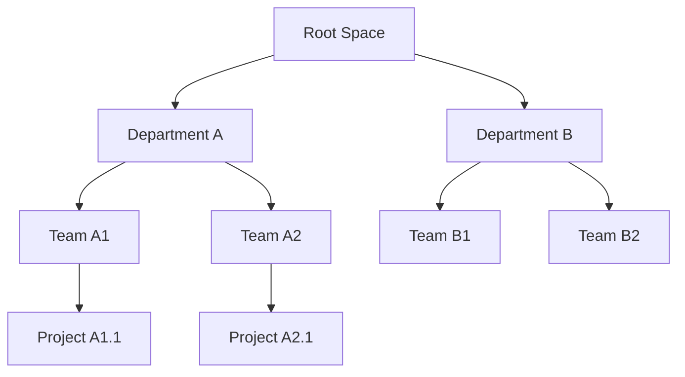
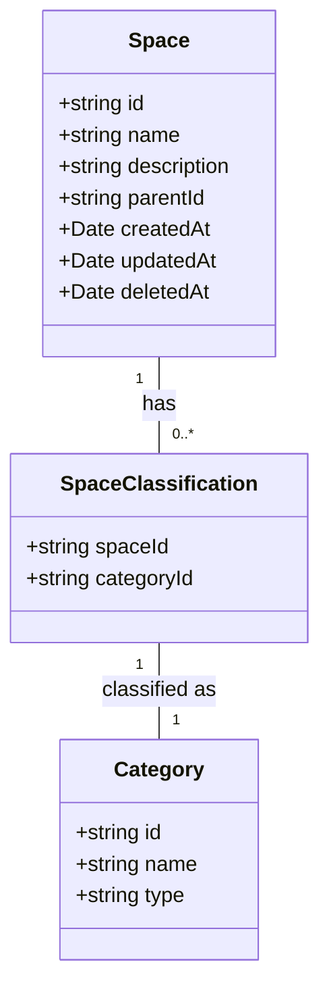
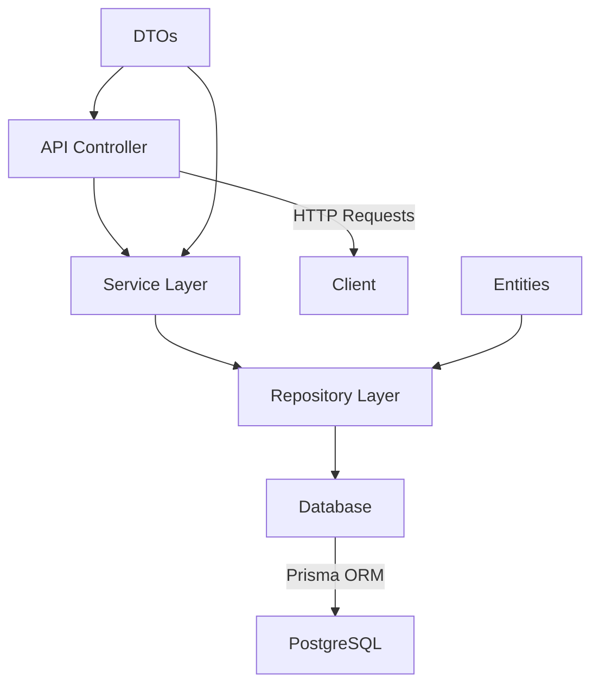
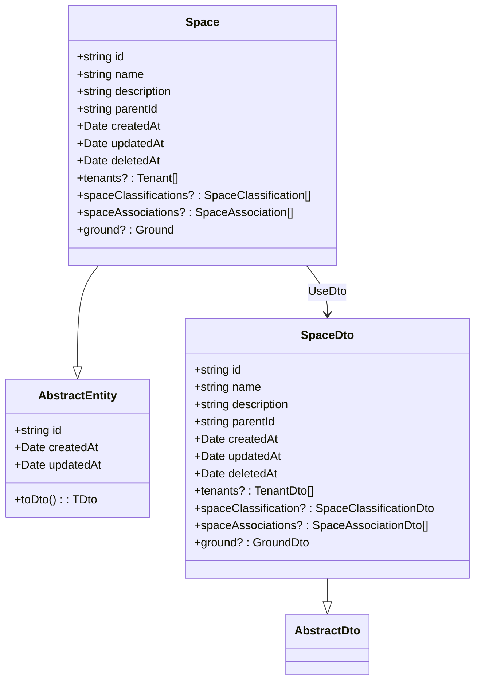
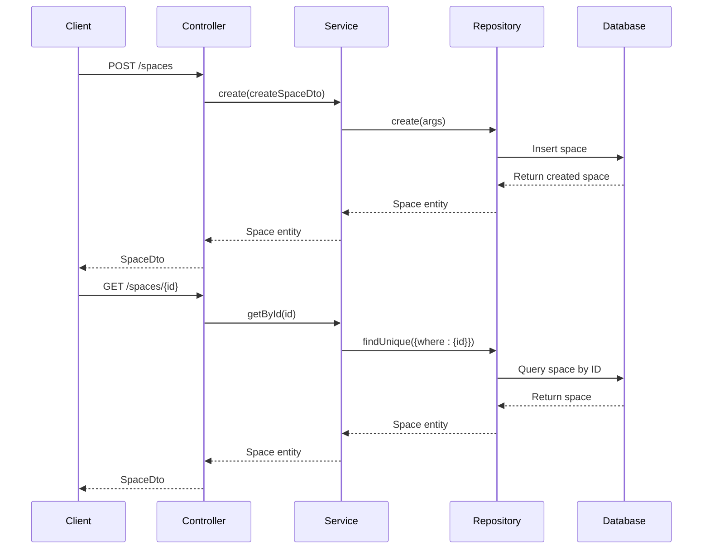

# Space Entity Model

<cite>
**Referenced Files in This Document**   
- [space.entity.ts](file://packages/schema/src/entity/space.entity.ts)
- [space.dto.ts](file://packages/schema/src/dto/space.dto.ts)
- [space-classification.entity.ts](file://packages/schema/src/entity/space-classification.entity.ts)
- [space-classification.dto.ts](file://packages/schema/src/dto/space-classification.dto.ts)
- [spaces.repository.ts](file://apps/server/src/shared/repository/spaces.repository.ts)
- [spaces.service.ts](file://apps/server/src/shared/service/resources/spaces.service.ts)
- [spaces.controller.ts](file://apps/server/src/shared/controller/resources/spaces.controller.ts)
</cite>

## Table of Contents
1. [Introduction](#introduction)
2. [Core Fields](#core-fields)
3. [Hierarchical Structure Implementation](#hierarchical-structure-implementation)
4. [Space and SpaceClassification Relationship](#space-and-spaceclassification-relationship)
5. [Data Validation Rules](#data-validation-rules)
6. [Indexing Strategies](#indexing-strategies)
7. [Soft-Delete Functionality](#soft-delete-functionality)
8. [Architecture Overview](#architecture-overview)
9. [Detailed Component Analysis](#detailed-component-analysis)
10. [Conclusion](#conclusion)

## Introduction
The Space entity in prj-core represents a fundamental organizational unit within the system, serving as a container for various resources and establishing hierarchical relationships. This document provides comprehensive documentation of the Space entity model, detailing its fields, relationships, validation rules, and implementation patterns. The model supports hierarchical organization through parent-child relationships, classification through the SpaceClassification entity, and soft-delete functionality for data integrity.

**Section sources**
- [space.entity.ts](file://packages/schema/src/entity/space.entity.ts#L1-L17)
- [space.dto.ts](file://packages/schema/src/dto/space.dto.ts#L1-L32)

## Core Fields
The Space entity contains essential fields that define its identity and properties. The core fields include:
- **id**: Unique identifier for the space (inherited from AbstractEntity)
- **name**: Human-readable name of the space
- **description**: Detailed description providing context about the space
- **createdAt**: Timestamp indicating when the space was created
- **updatedAt**: Timestamp indicating the last modification
- **parentId**: Reference to parent space for hierarchical organization
- **deletedAt**: Timestamp for soft-delete functionality

These fields are implemented through inheritance from the AbstractEntity class and extended with space-specific properties in the Space entity class.

**Section sources**
- [space.entity.ts](file://packages/schema/src/entity/space.entity.ts#L1-L17)
- [space.dto.ts](file://packages/schema/src/dto/space.dto.ts#L1-L32)

## Hierarchical Structure Implementation
The hierarchical structure of spaces is implemented using the parentId field, which establishes parent-child relationships between spaces. This implementation enables recursive querying capabilities for navigating the space hierarchy.

The parent-child relationship allows for:
- Organizational nesting of spaces
- Inheritance of properties and permissions
- Recursive traversal of the space tree
- Path-based navigation and filtering

The implementation supports operations such as retrieving all descendants of a space, finding ancestors of a specific space, and determining the full path from root to a given space.

**Diagram sources**
- [space.entity.ts](file://packages/schema/src/entity/space.entity.ts#L1-L17)

**Section sources**
- [space.entity.ts](file://packages/schema/src/entity/space.entity.ts#L1-L17)

## Space and SpaceClassification Relationship
The relationship between Space and SpaceClassification entities enables categorization and typing of spaces. This implementation follows a many-to-many pattern through the SpaceClassification entity, which acts as a junction table connecting spaces with classification categories.

The SpaceClassification entity contains:
- **spaceId**: Foreign key referencing the Space entity
- **categoryId**: Foreign key referencing the Category entity
- **category**: Navigation property to access category details
- **space**: Navigation property to access space details

This relationship allows a single space to have multiple classifications and enables classification inheritance patterns where child spaces can inherit classifications from parent spaces.

**Diagram sources**
- [space.entity.ts](file://packages/schema/src/entity/space.entity.ts#L1-L17)
- [space-classification.entity.ts](file://packages/schema/src/entity/space-classification.entity.ts#L1-L19)

**Section sources**
- [space.entity.ts](file://packages/schema/src/entity/space.entity.ts#L1-L17)
- [space-classification.entity.ts](file://packages/schema/src/entity/space-classification.entity.ts#L1-L19)

## Data Validation Rules
The Space entity enforces several validation rules to ensure data integrity and consistency:

### Name Uniqueness Constraints
- Space names must be unique within their parent context
- The validation prevents duplicate space names at the same hierarchy level
- Case-insensitive comparison is used for name uniqueness checking

### Description Length Requirements
- Minimum description length of 10 characters is required
- The validation ensures that spaces have meaningful descriptions
- Empty or minimal descriptions are rejected during creation

### Required Fields
- Name field is mandatory for space creation
- Description field is mandatory and must meet minimum length requirements
- ParentId can be null for root-level spaces

These validation rules are enforced at both the DTO (Data Transfer Object) level and the repository level to ensure data integrity throughout the application layers.

**Section sources**
- [space.dto.ts](file://packages/schema/src/dto/space.dto.ts#L1-L32)
- [spaces.service.ts](file://apps/server/src/shared/service/resources/spaces.service.ts#L1-L51)

## Indexing Strategies
The Space entity implements strategic indexing to optimize navigation performance and query efficiency:

### Name Field Indexing
- Index on the name field to accelerate search operations
- Supports fast lookup when navigating by space name
- Enhances performance for autocomplete and search features

### ParentId Field Indexing
- Index on the parentId field to optimize hierarchical queries
- Accelerates retrieval of child spaces for a given parent
- Improves performance for tree traversal operations

### Composite Indexing
- Composite index on (parentId, name) to support efficient hierarchical navigation
- Optimizes queries that filter by both parent and name
- Enhances performance for path-based lookups

These indexing strategies ensure that common operations such as finding child spaces, navigating the hierarchy, and searching by name perform efficiently even with large datasets.

**Section sources**
- [spaces.repository.ts](file://apps/server/src/shared/repository/spaces.repository.ts#L1-L94)

## Soft-Delete Functionality
The Space entity implements soft-delete functionality using the deletedAt timestamp field, providing data preservation and recovery capabilities:

### Implementation Details
- The removeById method in SpacesService updates the deletedAt field with the current timestamp
- The deleteById method in SpacesService performs hard deletion
- The removedAt field is used to mark spaces as logically deleted
- Queries can filter out soft-deleted spaces by checking for null deletedAt values

### Benefits
- Preserves data integrity and history
- Enables recovery of accidentally deleted spaces
- Maintains referential integrity with related entities
- Supports audit trails and compliance requirements

### Usage Patterns
- Soft-delete is used for user-initiated deletions
- Hard-delete is reserved for administrative operations
- Soft-deleted spaces are excluded from normal queries
- Administrative interfaces can display soft-deleted spaces for recovery

**Section sources**
- [spaces.service.ts](file://apps/server/src/shared/service/resources/spaces.service.ts#L34-L39)
- [spaces.controller.ts](file://apps/server/src/shared/controller/resources/spaces.controller.ts#L137-L143)

## Architecture Overview
The Space entity model follows a layered architecture with clear separation of concerns between data access, business logic, and API presentation layers.

**Diagram sources**
- [spaces.controller.ts](file://apps/server/src/shared/controller/resources/spaces.controller.ts#L1-L168)
- [spaces.service.ts](file://apps/server/src/shared/service/resources/spaces.service.ts#L1-L51)
- [spaces.repository.ts](file://apps/server/src/shared/repository/spaces.repository.ts#L1-L94)

## Detailed Component Analysis

### Space Entity Analysis
The Space entity is implemented as a class that extends AbstractEntity and implements the Space interface from Prisma. It uses the @UseDto decorator to associate with the SpaceDto, enabling automatic transformation between entity and DTO representations.

The entity includes navigation properties for related entities:
- tenants: Collection of Tenant entities associated with the space
- spaceClassifications: Collection of SpaceClassification entities
- spaceAssociations: Collection of SpaceAssociation entities
- ground: Reference to the Ground entity

**Diagram sources**
- [space.entity.ts](file://packages/schema/src/entity/space.entity.ts#L1-L17)
- [space.dto.ts](file://packages/schema/src/dto/space.dto.ts#L1-L32)

**Section sources**
- [space.entity.ts](file://packages/schema/src/entity/space.entity.ts#L1-L17)
- [space.dto.ts](file://packages/schema/src/dto/space.dto.ts#L1-L32)

### Service Layer Analysis
The SpacesService provides the business logic for space operations, acting as an intermediary between the controller and repository layers. It implements methods for CRUD operations and additional business rules.

Key service methods include:
- create: Creates a new space with validation
- getById: Retrieves a space by ID
- updateById: Updates a space with specified changes
- deleteById: Hard deletes a space
- removeById: Soft deletes a space by setting removedAt
- getManyByQuery: Retrieves multiple spaces with pagination

**Diagram sources**
- [spaces.service.ts](file://apps/server/src/shared/service/resources/spaces.service.ts#L1-L51)
- [spaces.repository.ts](file://apps/server/src/shared/repository/spaces.repository.ts#L1-L94)

**Section sources**
- [spaces.service.ts](file://apps/server/src/shared/service/resources/spaces.service.ts#L1-L51)

### Controller Layer Analysis
The SpacesController exposes REST API endpoints for space operations, handling HTTP requests and responses. It uses NestJS decorators for route definition, validation, and Swagger documentation.

Key endpoints include:
- POST /spaces: Create a new space
- GET /spaces/{id}: Retrieve a specific space
- PATCH /spaces/{id}: Update a space
- PATCH /spaces/{id}/removedAt: Soft delete a space
- DELETE /spaces/{id}: Hard delete a space
- GET /spaces: Retrieve multiple spaces with query parameters
- GET /current: Retrieve the current space from context

The controller implements comprehensive error handling and logging, with detailed debug information for troubleshooting.

**Section sources**
- [spaces.controller.ts](file://apps/server/src/shared/controller/resources/spaces.controller.ts#L1-L168)

## Conclusion
The Space entity model in prj-core provides a robust foundation for organizing resources within a hierarchical structure. The implementation features a well-defined set of core fields, sophisticated parent-child relationships, and flexible classification capabilities through the SpaceClassification entity. Data integrity is maintained through comprehensive validation rules, including name uniqueness constraints and description length requirements. Strategic indexing on key fields ensures optimal performance for navigation and querying operations. The soft-delete functionality using the deletedAt timestamp provides data preservation and recovery capabilities while maintaining referential integrity. The layered architecture with clear separation of concerns between controller, service, and repository components ensures maintainability and extensibility of the space management system.