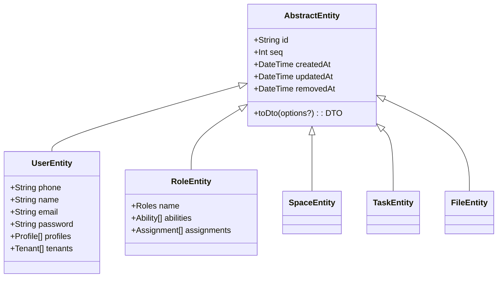
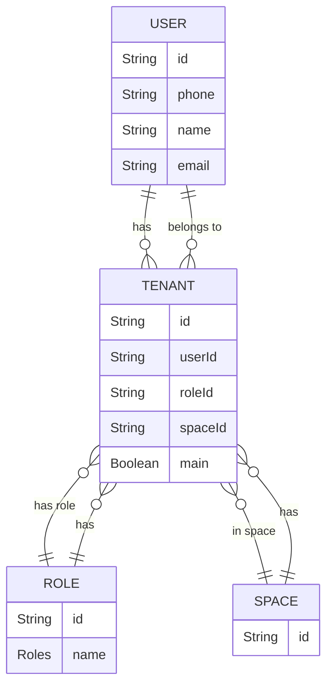
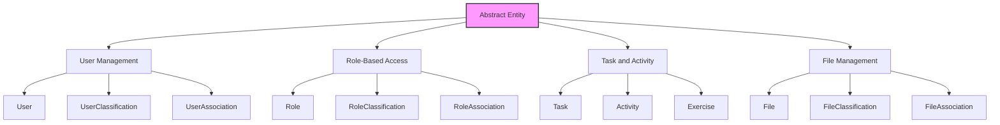

# Abstract Entities

<cite>
**Referenced Files in This Document**   
- [core.prisma](file://packages/prisma/schema/core.prisma)
- [user.prisma](file://packages/prisma/schema/user.prisma)
- [role.prisma](file://packages/prisma/schema/role.prisma)
- [space.prisma](file://packages/prisma/schema/space.prisma)
- [task.prisma](file://packages/prisma/schema/task.prisma)
- [file.prisma](file://packages/prisma/schema/file.prisma)
- [abstract.entity.ts](file://packages/entity/src/abstract.entity.ts)
- [entity-common-fields.ts](file://packages/constant/src/schema/entity-common-fields.ts)
- [seed.ts](file://packages/prisma/seed.ts)
</cite>

## Table of Contents
1. [Introduction](#introduction)
2. [Core Shared Fields](#core-shared-fields)
3. [Base Model Implementation](#base-model-implementation)
4. [Multi-Tenancy Architecture](#multi-tenancy-architecture)
5. [Audit and Timestamp Configuration](#audit-and-timestamp-configuration)
6. [Indexing Strategies](#indexing-strategies)
7. [Field Inheritance Patterns](#field-inheritance-patterns)
8. [Custom Attributes and Decorators](#custom-attributes-and-decorators)
9. [Examples of Abstract Entity Usage](#examples-of-abstract-entity-usage)
10. [Conclusion](#conclusion)

## Introduction
This document provides comprehensive documentation for the abstract entities and shared fields in prj-core's Prisma schema. It details the implementation of base models, field inheritance patterns, and the use of Prisma's attribute system to support multi-tenancy and audit requirements. The documentation covers common fields such as id, createdAt, updatedAt, and their configuration across all entities, along with custom attributes, default values, and indexing strategies.

**Section sources**
- [core.prisma](file://packages/prisma/schema/core.prisma)
- [abstract.entity.ts](file://packages/entity/src/abstract.entity.ts)

## Core Shared Fields
The prj-core Prisma schema implements a consistent set of shared fields across all entities to ensure uniformity in data management and auditing. These core fields include:

- **id**: Unique identifier using UUID as default
- **seq**: Sequential integer for ordering, with auto-increment
- **createdAt**: Timestamp of record creation, mapped to "created_at" in database
- **updatedAt**: Timestamp of last update, mapped to "updated_at" in database
- **removedAt**: Soft delete timestamp, mapped to "removed_at" in database

These fields are consistently applied across all models in the schema, providing a standardized approach to entity identification, ordering, and temporal tracking. The `COMMON_ENTITY_FIELDS` constant in the entity-common-fields.ts file explicitly defines these shared fields for reference across the codebase.

```mermaid
erDiagram
ENTITY ||--o{ TIMESTAMP : "has"
ENTITY ||--o{ IDENTIFIER : "has"
ENTITY ||--o{ SOFT_DELETE : "has"
class ENTITY {
+String id
+Int seq
+DateTime createdAt
+DateTime updatedAt
+DateTime removedAt
}
class TIMESTAMP {
+DateTime createdAt
+DateTime updatedAt
}
class IDENTIFIER {
+String id
+Int seq
}
class SOFT_DELETE {
+DateTime removedAt
}
```

**Diagram sources**
- [core.prisma](file://packages/prisma/schema/core.prisma)
- [entity-common-fields.ts](file://packages/constant/src/schema/entity-common-fields.ts)

**Section sources**
- [core.prisma](file://packages/prisma/schema/core.prisma)
- [entity-common-fields.ts](file://packages/constant/src/schema/entity-common-fields.ts)

## Base Model Implementation
The base model implementation in prj-core follows a pattern of abstract entity inheritance through Prisma's model system. While Prisma doesn't support traditional class inheritance, the schema achieves similar functionality through consistent field replication and attribute application across models.

The AbstractEntity class in abstract.entity.ts serves as the TypeScript representation of the base model, implementing the BaseEntityFields interface and providing DTO transformation capabilities. This class includes the core fields (id, seq, createdAt, updatedAt, removedAt) and a toDto method for converting entities to data transfer objects.

The Prisma schema applies consistent attributes to these shared fields across all models:
- `@id @default(uuid())` for the id field
- `@unique @default(autoincrement())` for the seq field
- `@default(now()) @map("created_at")` for createdAt
- `@updatedAt @map("updated_at")` for updatedAt
- `@map("removed_at")` for removedAt

This implementation ensures that all entities have a consistent structure and behavior while maintaining the flexibility to extend with domain-specific fields.



**Diagram sources**
- [abstract.entity.ts](file://packages/entity/src/abstract.entity.ts)
- [core.prisma](file://packages/prisma/schema/core.prisma)

**Section sources**
- [abstract.entity.ts](file://packages/entity/src/abstract.entity.ts)
- [core.prisma](file://packages/prisma/schema/core.prisma)

## Multi-Tenancy Architecture
The prj-core schema implements a robust multi-tenancy architecture through the consistent use of tenantId fields across entities and the Tenant model as a central component. The Tenant entity serves as the bridge between users, roles, and spaces, enabling a flexible multi-tenancy model where users can belong to multiple tenants with different roles.

Key aspects of the multi-tenancy implementation include:
- **Tenant model**: Central entity that associates users, roles, and spaces
- **tenantId field**: Present on most entities to establish tenant ownership
- **Main tenant flag**: Boolean field indicating the primary tenant for a user
- **Role-based access**: Combination of user, role, and tenant enables fine-grained permissions

The schema supports complex multi-tenancy scenarios where a user can be a super admin in one tenant and a regular user in another. This is achieved through the Assignment entity, which links users to specific roles within specific tenants.

The seed.ts file demonstrates the initialization of this multi-tenancy architecture, creating a super admin user with associated space and tenant, followed by the creation of regular users with their respective tenants and roles.



**Diagram sources**
- [core.prisma](file://packages/prisma/schema/core.prisma)
- [seed.ts](file://packages/prisma/seed.ts)

**Section sources**
- [core.prisma](file://packages/prisma/schema/core.prisma)
- [seed.ts](file://packages/prisma/seed.ts)

## Audit and Timestamp Configuration
The prj-core schema implements comprehensive audit capabilities through a consistent timestamp configuration across all entities. The audit system is built around three key timestamp fields:

- **createdAt**: Records when a record is first created, using `@default(now())` to automatically set the current timestamp upon creation
- **updatedAt**: Automatically updated whenever a record is modified, using the `@updatedAt` attribute
- **removedAt**: Used for soft deletes, allowing records to be marked as deleted without permanent removal

These timestamp fields are consistently mapped to underscore-separated column names in the database (`created_at`, `updated_at`, `removed_at`) using the `@map()` attribute. The `@db.Timestamptz(6)` attribute ensures timezone-aware timestamps with microsecond precision.

The audit configuration supports both real-time tracking of record modifications and historical analysis of data changes. The combination of createdAt and updatedAt enables tracking of record lifespan and modification frequency, while removedAt facilitates data recovery and audit trails for deleted records.

This audit system is applied uniformly across all entities in the schema, ensuring consistent behavior and simplifying audit queries across the entire data model.

**Section sources**
- [core.prisma](file://packages/prisma/schema/core.prisma)
- [user.prisma](file://packages/prisma/schema/user.prisma)
- [role.prisma](file://packages/prisma/schema/role.prisma)

## Indexing Strategies
The prj-core schema implements strategic indexing to optimize query performance across commonly accessed fields. The indexing strategy focuses on fields that are frequently used in WHERE clauses, JOIN operations, and sorting.

Primary indexing patterns include:

- **Primary keys**: All entities have a UUID-based primary key with `@id @default(uuid())`
- **Sequential IDs**: Auto-incrementing seq fields with `@unique @default(autoincrement())` for ordering
- **Tenant-based indexes**: Most entities include indexes on tenantId to optimize tenant-specific queries
- **Timestamp indexes**: createdAt and updatedAt fields are indexed for time-based queries
- **Composite indexes**: Strategic combinations of fields for common query patterns

For example, the Timeline model includes indexes on tenantId, createdAt, and name to optimize queries that filter by tenant and sort by creation time or name. Similarly, the Session model has composite indexes on (timelineId, startDateTime) and (startDateTime, endDateTime) to support efficient querying of sessions within specific time ranges.

The indexing strategy balances query performance with write efficiency, avoiding over-indexing that could impact insert and update operations. The schema uses `@@index` and `@@unique` attributes to define indexes at the model level, ensuring they are properly generated in the database.

**Section sources**
- [task.prisma](file://packages/prisma/schema/task.prisma)
- [core.prisma](file://packages/prisma/schema/core.prisma)

## Field Inheritance Patterns
The prj-core schema implements field inheritance patterns through consistent application of shared fields and attributes across models, compensating for Prisma's lack of native model inheritance. This approach creates a de facto inheritance system where all entities share a common set of fields and behaviors.

Key inheritance patterns include:

- **Base field inheritance**: All entities inherit the core fields (id, seq, createdAt, updatedAt, removedAt) with consistent attributes
- **Naming convention inheritance**: Field names and database mappings follow consistent patterns (e.g., camelCase in Prisma, snake_case in database via @map)
- **Attribute inheritance**: Common attributes like @default, @updatedAt, and @map are consistently applied
- **Relationship pattern inheritance**: Many entities follow similar relationship patterns (e.g., classifications, associations)

The schema also implements domain-specific inheritance patterns, such as the Task-Exercise relationship where Task serves as an abstract base for domain-specific implementations. This pattern allows for extensibility while maintaining a consistent interface.

The field inheritance system enables code reuse in the application layer, where services and repositories can implement generic operations for entities with shared fields, reducing code duplication and improving maintainability.

**Section sources**
- [core.prisma](file://packages/prisma/schema/core.prisma)
- [task.prisma](file://packages/prisma/schema/task.prisma)
- [file.prisma](file://packages/prisma/schema/file.prisma)

## Custom Attributes and Decorators
The prj-core schema leverages Prisma's attribute system and TypeScript decorators to extend the functionality of entities beyond basic field definitions. These custom attributes and decorators provide additional metadata and behavior that support the application's requirements.

Key custom attributes in the Prisma schema include:

- **@map()**: Maps Prisma field names to database column names, enabling camelCase to snake_case conversion
- **@db.Timestamptz(6)**: Specifies database-specific type for timestamp fields with timezone and precision
- **@@unique()**: Defines unique constraints, including composite unique constraints
- **@@index()**: Creates database indexes for query optimization
- **@@map()**: Maps model names to database table names

In the TypeScript layer, the AbstractEntity class uses decorators from the class-transformer library to support DTO conversion. The @UseDto decorator (referenced in the toDto method) allows entities to specify their corresponding DTO class, enabling automatic transformation between entities and DTOs.

The schema also uses JSDoc-style comments with custom tags like @description and @type to document models and fields, providing additional context for developers and documentation generators.

These custom attributes and decorators create a rich metadata layer that enhances the functionality of the data model while maintaining clean separation between the database schema and application logic.

**Section sources**
- [core.prisma](file://packages/prisma/schema/core.prisma)
- [abstract.entity.ts](file://packages/entity/src/abstract.entity.ts)

## Examples of Abstract Entity Usage
The prj-core schema demonstrates several patterns of abstract entity usage through its model definitions. These examples illustrate how the abstract entity patterns support various domain requirements while maintaining consistency across the data model.

### User Management Domain
The User model extends the base entity pattern with user-specific fields like phone, name, email, and password. It also includes relationships to profiles, tenants, and classifications. The UserClassification and UserAssociation models follow the same pattern, inheriting the core fields while adding domain-specific relationships.

### Role-Based Access Control
The Role model implements a flexible role-based access control system, with roles linked to abilities, assignments, and classifications. The RoleClassification and RoleAssociation models follow the same abstract pattern, enabling complex role hierarchies and group memberships.

### Task and Activity System
The Task model serves as an abstract base for domain-specific implementations like Exercise. This pattern allows for extensibility while maintaining a consistent interface. The Activity model references Task, creating a domain-independent activity system that can be used across different domains.

### File Management
The File model implements a hierarchical file system with parent-child relationships, while inheriting the core entity fields. The FileClassification and FileAssociation models follow the same pattern, enabling categorization and grouping of files.

These examples demonstrate how the abstract entity patterns support diverse domain requirements while maintaining consistency in auditing, multi-tenancy, and data management.



**Diagram sources**
- [core.prisma](file://packages/prisma/schema/core.prisma)
- [user.prisma](file://packages/prisma/schema/user.prisma)
- [role.prisma](file://packages/prisma/schema/role.prisma)
- [task.prisma](file://packages/prisma/schema/task.prisma)
- [file.prisma](file://packages/prisma/schema/file.prisma)

**Section sources**
- [core.prisma](file://packages/prisma/schema/core.prisma)
- [user.prisma](file://packages/prisma/schema/user.prisma)
- [role.prisma](file://packages/prisma/schema/role.prisma)
- [task.prisma](file://packages/prisma/schema/task.prisma)
- [file.prisma](file://packages/prisma/schema/file.prisma)

## Conclusion
The abstract entities and shared fields in prj-core's Prisma schema provide a robust foundation for the application's data model. Through consistent implementation of base models, field inheritance patterns, and the Prisma attribute system, the schema supports critical requirements including multi-tenancy, audit trails, and extensibility.

The core shared fields (id, seq, createdAt, updatedAt, removedAt) are uniformly applied across all entities, ensuring consistency in data management and temporal tracking. The multi-tenancy architecture, centered around the Tenant model, enables flexible user-role-space relationships that support complex organizational structures.

The audit configuration with automatic timestamp management provides comprehensive tracking of data changes, while strategic indexing ensures optimal query performance. The field inheritance patterns, though implemented through convention rather than native inheritance, create a cohesive data model that supports code reuse and maintainability.

Together, these patterns form a scalable and maintainable foundation for the prj-core application, balancing flexibility with consistency and providing a solid base for future extension.

**Section sources**
- [core.prisma](file://packages/prisma/schema/core.prisma)
- [abstract.entity.ts](file://packages/entity/src/abstract.entity.ts)