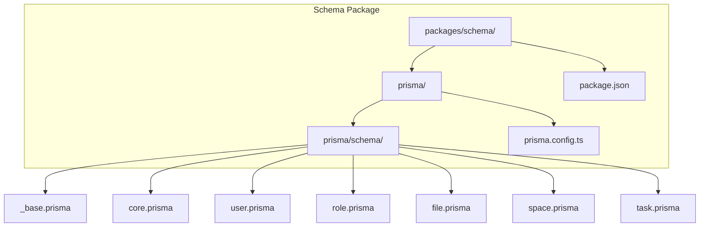
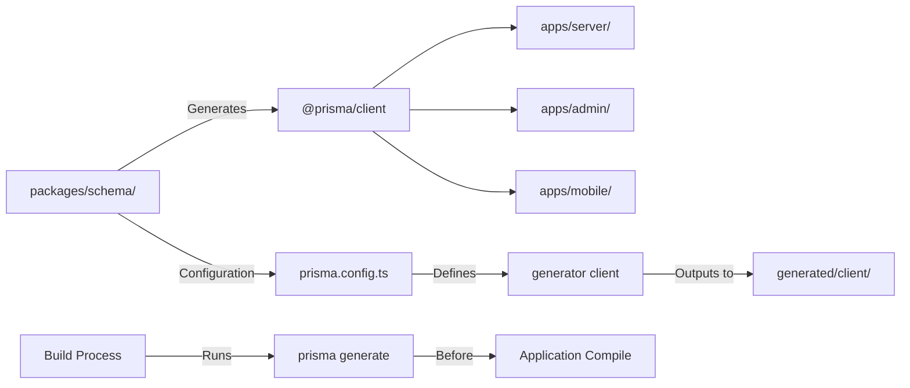
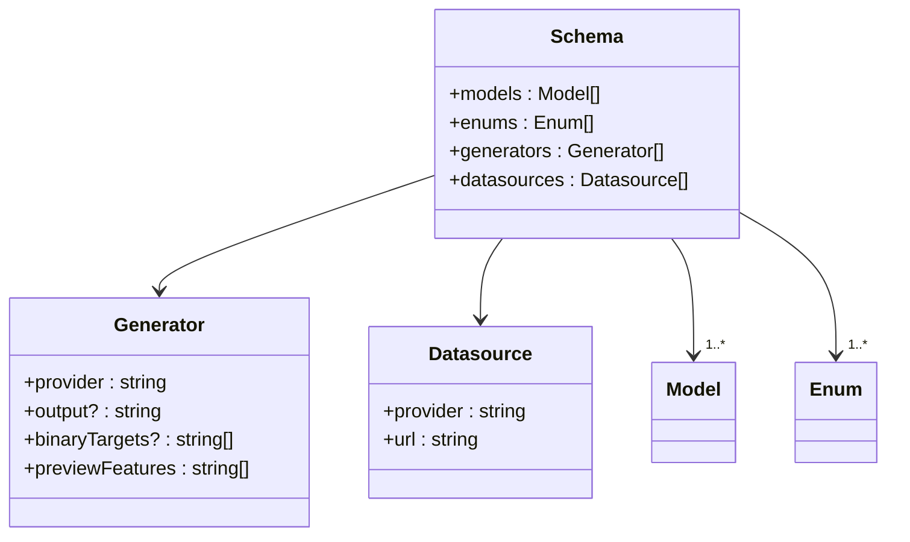
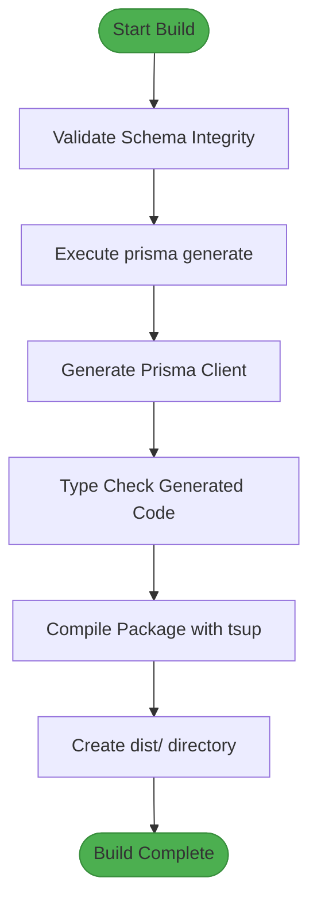
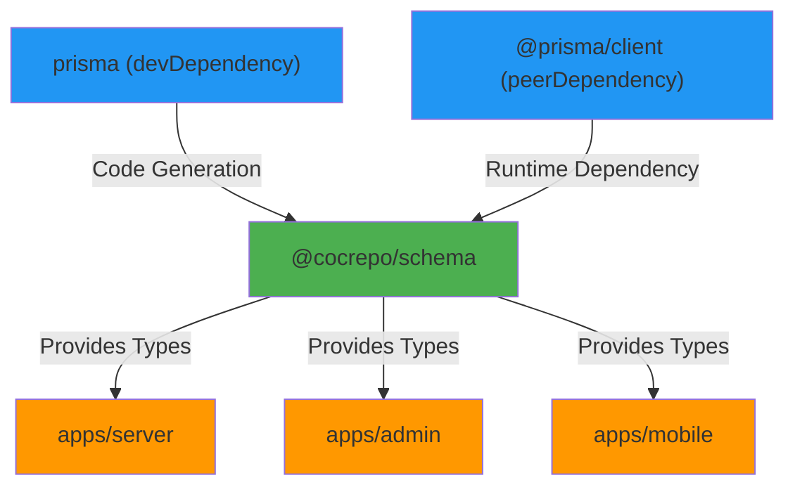

# Generator Blocks

<cite>
**Referenced Files in This Document**   
- [prisma.config.ts](file://packages/schema/prisma.config.ts)
- [_base.prisma](file://packages/schema/prisma/schema/_base.prisma)
- [package.json](file://packages/schema/package.json)
- [tsconfig.json](file://packages/schema/tsconfig.json)
</cite>

## Table of Contents
1. [Introduction](#introduction)
2. [Project Structure](#project-structure)
3. [Core Components](#core-components)
4. [Architecture Overview](#architecture-overview)
5. [Detailed Component Analysis](#detailed-component-analysis)
6. [Dependency Analysis](#dependency-analysis)
7. [Performance Considerations](#performance-considerations)
8. [Troubleshooting Guide](#troubleshooting-guide)
9. [Conclusion](#conclusion)

## Introduction
This document provides comprehensive documentation for the Prisma generator blocks in the prj-core repository. It details the configuration, purpose, and workflow of code generation through Prisma, focusing on how the generator setup supports development across the monorepo. The documentation covers the client generator configuration, output paths, integration with the build system, and practical guidance for extending and troubleshooting the code generation process.

## Project Structure
The Prisma schema and generator configuration are centralized in the `packages/schema` directory, which serves as the shared source of truth for database models across the entire application ecosystem. The schema is modular, with domain-specific models organized in separate files within the `prisma/schema` directory. This modular approach enables maintainability and clear separation of concerns while allowing all applications to consume a unified data model.

**Diagram sources**
- [prisma.config.ts](file://packages/schema/prisma.config.ts)
- [_base.prisma](file://packages/schema/prisma/schema/_base.prisma)

**Section sources**
- [prisma.config.ts](file://packages/schema/prisma.config.ts)
- [package.json](file://packages/schema/package.json)

## Core Components
The core component of the generator configuration is the Prisma client generator defined in the `_base.prisma` file. This generator produces type-safe database access code that is consumed throughout the application. The generated client is configured to output to a local directory within the schema package, enabling seamless import by other packages and applications in the monorepo. The configuration leverages Prisma's multi-file schema support, allowing domain models to be organized in separate files while maintaining a cohesive schema.

**Section sources**
- [_base.prisma](file://packages/schema/prisma/schema/_base.prisma)
- [prisma.config.ts](file://packages/schema/prisma.config.ts)

## Architecture Overview
The code generation architecture follows a centralized schema model where the `packages/schema` package defines all database models and generator configurations. Applications consume the generated Prisma client through package dependencies, ensuring consistency across services. The build process integrates code generation as a pre-build step, guaranteeing that the latest database schema is always reflected in the application code. This architecture enables type safety, reduces duplication, and simplifies schema migrations across the entire codebase.

**Diagram sources**
- [prisma.config.ts](file://packages/schema/prisma.config.ts)
- [package.json](file://packages/schema/package.json)

## Detailed Component Analysis

### Prisma Generator Configuration
The generator configuration is defined in the `_base.prisma` file and specifies the Prisma Client JS provider. This configuration enables type-safe database access across all applications in the monorepo. The generator produces TypeScript types and a query builder that reflect the current database schema, enabling autocompletion and compile-time type checking.

#### Generator Block Structure

**Diagram sources**
- [_base.prisma](file://packages/schema/prisma/schema/_base.prisma)
- [prisma.config.ts](file://packages/schema/prisma.config.ts)

### Code Generation Workflow
The code generation workflow is integrated into the build process through npm scripts defined in the package.json file. The "generate" script executes `prisma generate`, which reads the schema configuration and produces the client code. This process is automatically triggered during the "build" script execution, ensuring that generated code is always up-to-date before compilation.

#### Build Process Flow

**Diagram sources**
- [package.json](file://packages/schema/package.json)
- [tsconfig.json](file://packages/schema/tsconfig.json)

## Dependency Analysis
The generator configuration creates a dependency chain where the schema package produces generated code that is consumed by multiple applications. The package.json file declares both direct and peer dependencies for Prisma, ensuring that the correct versions are available during code generation and runtime. The tsconfig.json file includes path mappings that allow applications to import the generated client using a consistent module path.

**Diagram sources**
- [package.json](file://packages/schema/package.json)
- [tsconfig.json](file://packages/schema/tsconfig.json)

## Performance Considerations
The code generation process is optimized for development workflow efficiency. By configuring the output path in tsconfig.json to map to the generated directory, the TypeScript compiler can resolve imports without requiring file copying or additional build steps. The incremental build configuration in tsconfig.json is disabled to ensure complete type safety, though this may impact build performance for large schemas. The separation of generated code in the "exclude" array prevents unnecessary type checking during development.

## Troubleshooting Guide
Common issues with the generator configuration typically involve missing environment variables, schema validation errors, or dependency version conflicts. Ensure that the DATABASE_URL environment variable is set when running prisma generate, as it's required for certain operations. If generated types are not updating, verify that the schema files are correctly imported in the main schema configuration. For module resolution issues, check that the path mappings in tsconfig.json match the actual output location of the generated client.

**Section sources**
- [prisma.config.ts](file://packages/schema/prisma.config.ts)
- [tsconfig.json](file://packages/schema/tsconfig.json)

## Conclusion
The Prisma generator configuration in prj-core provides a robust foundation for type-safe database access across the entire application ecosystem. By centralizing the schema definition and code generation process, the architecture ensures consistency, reduces duplication, and enables efficient development workflows. The integration with the build system guarantees that generated code reflects the current schema state, while the modular schema organization maintains readability and maintainability. This setup serves as a scalable pattern for monorepos with multiple applications sharing a common data model.