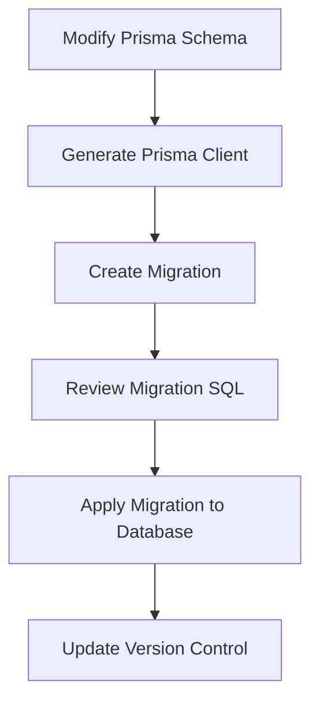
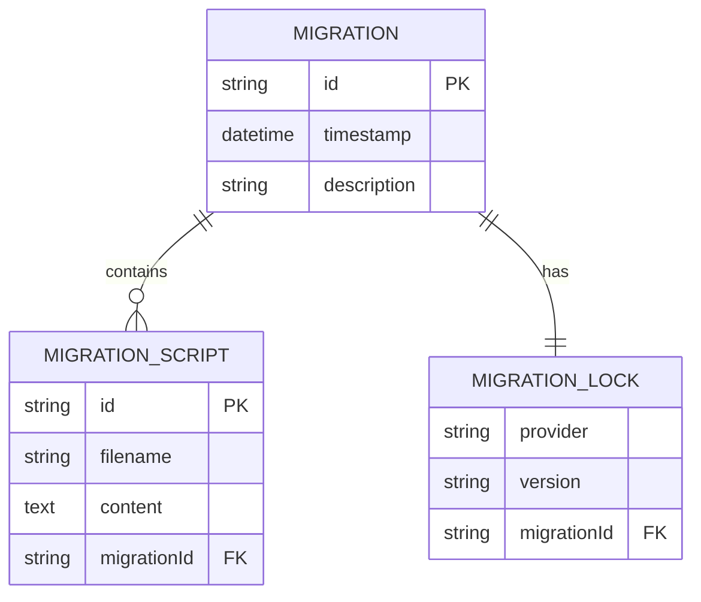
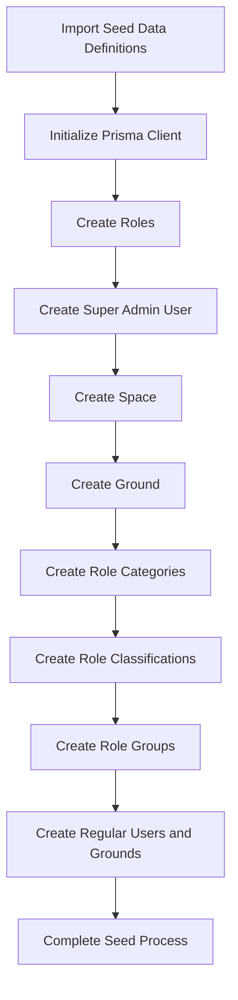

# Migrations Workflow

<cite>
**Referenced Files in This Document**   
- [migration_lock.toml](file://packages/prisma/migrations/migration_lock.toml)
- [migration.sql](file://packages/prisma/migrations/20250807132908_/migration.sql)
- [seed-data.ts](file://packages/prisma/seed-data.ts)
- [seed.ts](file://packages/prisma/seed.ts)
</cite>

## Table of Contents
1. [Introduction](#introduction)
2. [Migration Process Overview](#migration-process-overview)
3. [Migration Scripts and Lock File](#migration-scripts-and-lock-file)
4. [Branching Strategy and Conflict Resolution](#branching-strategy-and-conflict-resolution)
5. [Seed Data Implementation](#seed-data-implementation)
6. [Best Practices for Migrations](#best-practices-for-migrations)
7. [Production Deployment Procedures](#production-deployment-procedures)
8. [Troubleshooting and Rollback](#troubleshooting-and-rollback)
9. [Conclusion](#conclusion)

## Introduction

The Prisma migrations workflow in prj-core provides a structured approach to database schema evolution, ensuring consistency across development, testing, and production environments. This documentation details the complete migration process from schema changes to database updates, covering migration scripts, lock files, branching strategies, seed data implementation, and best practices for production deployments. The system leverages Prisma's multi-file schema architecture and official migration capabilities to manage complex database changes in a team environment.

**Section sources**
- [README.md](file://README.md#L386-L407)

## Migration Process Overview

The migration process in prj-core follows a standardized workflow that begins with schema modifications and culminates in database updates. Developers make changes to the Prisma schema files located in the `packages/prisma/schema/` directory, which are organized by domain (e.g., `user.prisma`, `role.prisma`, `space.prisma`). After schema modifications, the Prisma client is regenerated using `pnpm generate`, followed by creating a migration using `pnpm db:migrate`. This command generates a timestamped migration directory containing SQL scripts that represent the schema changes. The migration is then applied to the database, updating its structure to match the new schema. This process ensures that all database changes are version-controlled and can be consistently applied across different environments.

**Diagram sources**
- [README.md](file://README.md#L392-L393)
- [migration.sql](file://packages/prisma/migrations/20250807132908_/migration.sql#L1-L722)

**Section sources**
- [README.md](file://README.md#L386-L407)
- [migration.sql](file://packages/prisma/migrations/20250807132908_/migration.sql#L1-L722)

## Migration Scripts and Lock File

Migration scripts in prj-core are stored in the `packages/prisma/migrations/` directory, with each migration represented by a timestamped subdirectory containing SQL files. These scripts contain the exact database commands needed to apply or roll back schema changes, including CREATE TABLE, ALTER TABLE, and DROP TABLE statements. The migration lock file (`migration_lock.toml`) plays a critical role in ensuring migration consistency across environments. This file, which must be included in version control, specifies the database provider (PostgreSQL in this case) and prevents accidental edits that could compromise migration integrity. The lock file acts as a safeguard, ensuring that all team members use the same migration configuration and preventing conflicts that could arise from inconsistent migration states.

**Diagram sources**
- [migration_lock.toml](file://packages/prisma/migrations/migration_lock.toml#L1-L4)
- [migration.sql](file://packages/prisma/migrations/20250807132908_/migration.sql#L1-L722)

**Section sources**
- [migration_lock.toml](file://packages/prisma/migrations/migration_lock.toml#L1-L4)
- [migration.sql](file://packages/prisma/migrations/20250807132908_/migration.sql#L1-L722)

## Branching Strategy and Conflict Resolution

In team environments, prj-core employs a coordinated branching strategy for database migrations to prevent conflicts. The recommended approach is to use feature branches for development, with migration creation deferred until just before merging to the main branch. This minimizes the window for migration conflicts. When multiple developers create migrations simultaneously, conflicts are resolved by ensuring migrations are applied in chronological order based on their timestamps. The migration lock file helps identify potential conflicts by ensuring all team members are working with the same migration state. For resolving migration conflicts, the team follows a protocol of communication and coordination, where conflicting migrations are reviewed and potentially combined into a single migration that incorporates all necessary changes. This approach maintains migration history integrity while accommodating parallel development efforts.

**Section sources**
- [migration_lock.toml](file://packages/prisma/migrations/migration_lock.toml#L1-L4)
- [README.md](file://README.md#L392-L393)

## Seed Data Implementation

Seed data implementation in prj-core is handled through dedicated TypeScript files that programmatically populate the database with initial data. The seed process is implemented in two files: `seed-data.ts` and `seed.ts`. The `seed-data.ts` file contains the actual seed data as typed interfaces and exported constants, including user data, ground data, role categories, and other initial entities. This separation of data from logic allows for easy modification and testing of seed data. The `seed.ts` file contains the logic for applying the seed data to the database, using Prisma Client to upsert records and handle relationships between entities. The seed process is idempotent, meaning it can be safely run multiple times without creating duplicate records, as it uses upsert operations that update existing records or create new ones as needed.

**Diagram sources**
- [seed-data.ts](file://packages/prisma/seed-data.ts#L1-L244)
- [seed.ts](file://packages/prisma/seed.ts#L1-L583)

**Section sources**
- [seed-data.ts](file://packages/prisma/seed-data.ts#L1-L244)
- [seed.ts](file://packages/prisma/seed.ts#L1-L583)

## Best Practices for Migrations

The prj-core project follows several best practices for writing and managing migrations. Migrations are designed to be reversible whenever possible, with corresponding down.sql scripts that can undo the changes made by the up.sql script. Migration history is carefully managed by including all migration files in version control, ensuring that the complete evolution of the database schema is tracked. For production deployments, migrations are tested thoroughly in staging environments before application to production databases. The team follows a principle of small, focused migrations rather than large, complex ones, making it easier to understand, review, and rollback changes if necessary. Additionally, all migrations are reviewed as part of the pull request process, ensuring that multiple team members validate the changes before they are merged to the main branch.

**Section sources**
- [migration.sql](file://packages/prisma/migrations/20250807132908_/migration.sql#L1-L722)
- [seed.ts](file://packages/prisma/seed.ts#L1-L583)

## Production Deployment Procedures

Production deployment procedures for database migrations in prj-core follow a strict protocol to ensure reliability and minimize downtime. Before deploying to production, migrations are first applied to a staging environment that mirrors the production setup. The `pnpm prisma migrate deploy` command is used to apply migrations in production, which is designed to be idempotent and safe for production use. The deployment process includes several safeguards: automated backups are taken before migration application, and rollback procedures are documented and tested. For zero-downtime deployments, the team follows a pattern of backward-compatible migrations, where schema changes do not break existing application code. This allows for gradual deployment of application updates alongside database changes. Monitoring is implemented to detect any issues immediately after migration application, and rollback plans are prepared in advance for critical migrations.

**Section sources**
- [README.md](file://README.md#L393-L394)
- [test-database.ts](file://apps/server/src/shared/test/test-database.ts#L38-L44)

## Troubleshooting and Rollback

Troubleshooting migration issues in prj-core involves several strategies and tools. Common issues include migration conflicts, failed migration applications, and data integrity problems. The primary troubleshooting tool is Prisma Studio, which can be launched with `pnpm prisma studio` to inspect the database state and migration history. For failed migrations, the rollback procedure involves identifying the problematic migration and applying the corresponding down.sql script, or using Prisma's migration reset functionality in development environments. The test database setup in `test-database.ts` provides a clean environment for reproducing and debugging migration issues. Additionally, the idempotent nature of the seed script allows for easy restoration of test data when investigating migration-related problems. Monitoring of migration logs and database performance metrics helps identify issues before they affect production systems.

**Section sources**
- [README.md](file://README.md#L395-L396)
- [test-database.ts](file://apps/server/src/shared/test/test-database.ts#L38-L44)
- [seed.ts](file://packages/prisma/seed.ts#L1-L583)

## Conclusion

The Prisma migrations workflow in prj-core provides a robust and reliable system for managing database schema evolution in a team environment. By leveraging Prisma's native migration capabilities, multi-file schema architecture, and comprehensive tooling, the project ensures that database changes are tracked, version-controlled, and consistently applied across environments. The integration of seed data management, clear branching strategies, and thorough production deployment procedures creates a complete ecosystem for database lifecycle management. Following the documented best practices and troubleshooting guidelines enables the development team to maintain database integrity while supporting rapid application development and deployment.