# Model Organization

<cite>
**Referenced Files in This Document**   
- [core.prisma](file://packages/schema/prisma/schema/core.prisma)
- [user.prisma](file://packages/schema/prisma/schema/user.prisma)
- [role.prisma](file://packages/schema/prisma/schema/role.prisma)
- [space.prisma](file://packages/schema/prisma/schema/space.prisma)
- [file.prisma](file://packages/schema/prisma/schema/file.prisma)
- [task.prisma](file://packages/schema/prisma/schema/task.prisma)
- [seed.ts](file://packages/schema/prisma/seed.ts)
- [seed-data.ts](file://packages/schema/prisma/seed-data.ts)
- [prisma.module.ts](file://apps/server/src/module/prisma.module.ts)
</cite>

## Table of Contents
1. [Introduction](#introduction)
2. [Project Structure](#project-structure)
3. [Core Components](#core-components)
4. [Architecture Overview](#architecture-overview)
5. [Detailed Component Analysis](#detailed-component-analysis)
6. [Dependency Analysis](#dependency-analysis)
7. [Performance Considerations](#performance-considerations)
8. [Troubleshooting Guide](#troubleshooting-guide)
9. [Conclusion](#conclusion)

## Introduction
The Prisma model organization in prj-core follows a modular and domain-driven approach, with models grouped by functional domains and organized across multiple schema files. This documentation explains the structure, naming conventions, categorization strategy, and relationship between Prisma models and NestJS modules.

## Project Structure
The Prisma schema is organized in a multi-file structure within the `packages/schema/prisma/schema/` directory. Each domain has its own `.prisma` file, promoting separation of concerns and maintainability. The schema files are:

- `_base.prisma`: Contains generator and datasource configuration
- `core.prisma`: Contains foundational models like Category, Group, Tenant, Assignment, Action, Subject, Ability, Post, and Content
- `user.prisma`: Contains User domain models
- `role.prisma`: Contains Role domain models
- `space.prisma`: Contains Space domain models
- `file.prisma`: Contains File domain models
- `task.prisma`: Contains Task, Activity, Routine, Program, Session, and Timeline models

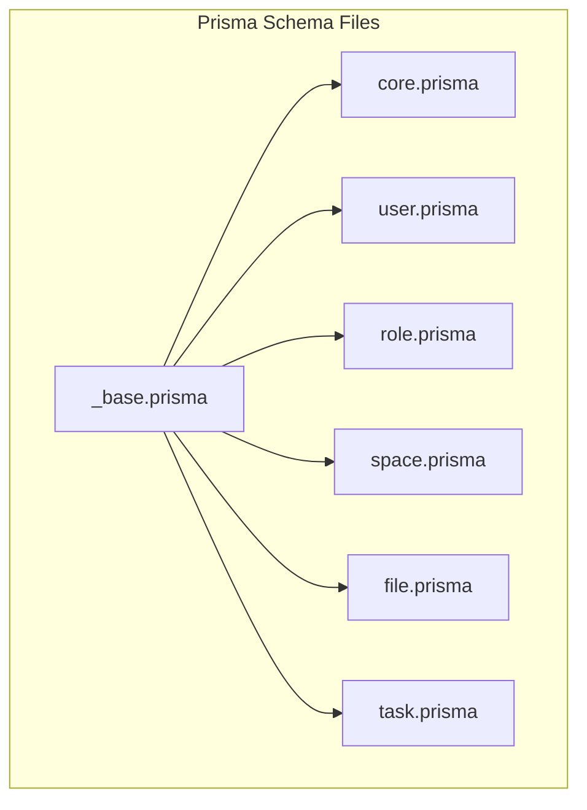

**Diagram sources**
- [core.prisma](file://packages/schema/prisma/schema/core.prisma)
- [user.prisma](file://packages/schema/prisma/schema/user.prisma)
- [role.prisma](file://packages/schema/prisma/schema/role.prisma)
- [space.prisma](file://packages/schema/prisma/schema/space.prisma)
- [file.prisma](file://packages/schema/prisma/schema/file.prisma)
- [task.prisma](file://packages/schema/prisma/schema/task.prisma)

**Section sources**
- [core.prisma](file://packages/schema/prisma/schema/core.prisma)
- [user.prisma](file://packages/schema/prisma/schema/user.prisma)
- [role.prisma](file://packages/schema/prisma/schema/role.prisma)
- [space.prisma](file://packages/schema/prisma/schema/space.prisma)
- [file.prisma](file://packages/schema/prisma/schema/file.prisma)
- [task.prisma](file://packages/schema/prisma/schema/task.prisma)

## Core Components
The Prisma model organization in prj-core is designed to support the application's domain logic and feature modules through a well-structured, modular approach. Models are organized into domain-specific files, each representing a distinct functional area of the application. The organization follows a clear categorization strategy that separates concerns and promotes maintainability.

The core components include foundational models in `core.prisma` such as Category, Group, Tenant, Assignment, Action, Subject, Ability, Post, and Content, which provide the basic building blocks for the application. Domain-specific models are organized in separate files like `user.prisma`, `role.prisma`, `space.prisma`, `file.prisma`, and `task.prisma`, each focusing on a specific aspect of the application's functionality.

**Section sources**
- [core.prisma](file://packages/schema/prisma/schema/core.prisma)
- [user.prisma](file://packages/schema/prisma/schema/user.prisma)
- [role.prisma](file://packages/schema/prisma/schema/role.prisma)
- [space.prisma](file://packages/schema/prisma/schema/space.prisma)
- [file.prisma](file://packages/schema/prisma/schema/file.prisma)
- [task.prisma](file://packages/schema/prisma/schema/task.prisma)

## Architecture Overview
The Prisma model architecture in prj-core follows a domain-driven design approach, with models organized into distinct domains that map to business capabilities. The architecture is modular, with each domain having its own schema file, which promotes separation of concerns and makes the codebase more maintainable.

The architecture is centered around the Tenant model, which represents an organization or workspace in the system. All other models are connected to the Tenant model, either directly or indirectly, creating a hierarchical structure. The Role-based Access Control (RBAC) system is implemented through the Role, Ability, Action, and Subject models, providing fine-grained permission management.

The Task domain models (Task, Activity, Routine, Program, Session, Timeline) form a hierarchical structure for managing scheduled activities, with Timeline serving as a container for Sessions, which in turn contain Programs that reference Routines composed of Activities.

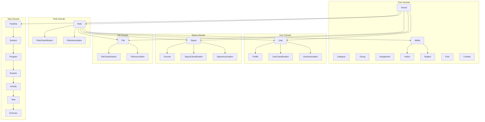

**Diagram sources**
- [core.prisma](file://packages/schema/prisma/schema/core.prisma)
- [user.prisma](file://packages/schema/prisma/schema/user.prisma)
- [role.prisma](file://packages/schema/prisma/schema/role.prisma)
- [space.prisma](file://packages/schema/prisma/schema/space.prisma)
- [file.prisma](file://packages/schema/prisma/schema/file.prisma)
- [task.prisma](file://packages/schema/prisma/schema/task.prisma)

## Detailed Component Analysis

### Core Models Analysis
The core models in `core.prisma` provide the foundational building blocks for the application. These models include Category, Group, Tenant, Assignment, Action, Subject, Ability, Post, and Content, which are used across multiple domains.

The Category model serves as a classification system that can be applied to various entities like users, roles, spaces, and files. It supports hierarchical relationships through parent-child references and is used for organizing data in a tree-like structure. The Group model represents collections of entities and is used for grouping users, roles, spaces, and files.

The Tenant model is central to the multi-tenancy architecture, representing an organization or workspace. It connects users, roles, spaces, files, and other entities within a tenant boundary. The Assignment model links roles to tenants, establishing the role a user plays within a specific tenant.

The RBAC system is implemented through the Action, Subject, Ability, and Role models. Actions represent operations that can be performed (CREATE, READ, UPDATE, DELETE, ACCESS), Subjects represent the entities that actions can be performed on, and Abilities link roles to specific action-subject combinations, defining what a role can or cannot do.

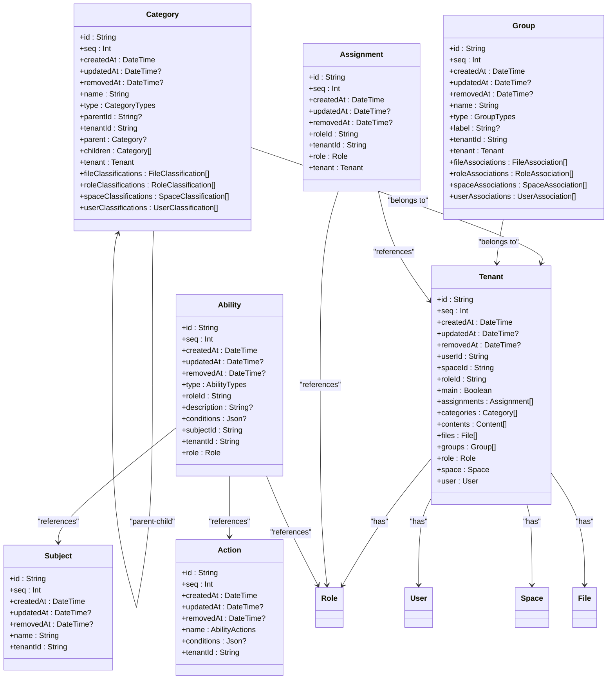

**Diagram sources**
- [core.prisma](file://packages/schema/prisma/schema/core.prisma)

**Section sources**
- [core.prisma](file://packages/schema/prisma/schema/core.prisma)

### User Domain Analysis
The User domain models in `user.prisma` handle user management and related entities. The User model is the central entity, representing a system user with basic information like name, email, and phone. It has a one-to-many relationship with the Profile model, which stores additional user information like nickname and avatar.

The UserClassification model links users to categories, allowing users to be classified into different types or groups. This is implemented through a many-to-one relationship with the Category model. The UserAssociation model connects users to groups, enabling users to be members of multiple groups within a tenant.

The User model follows a soft-delete pattern with the `removedAt` field, allowing records to be marked as deleted without actually removing them from the database. This preserves data integrity and enables recovery of accidentally deleted records.

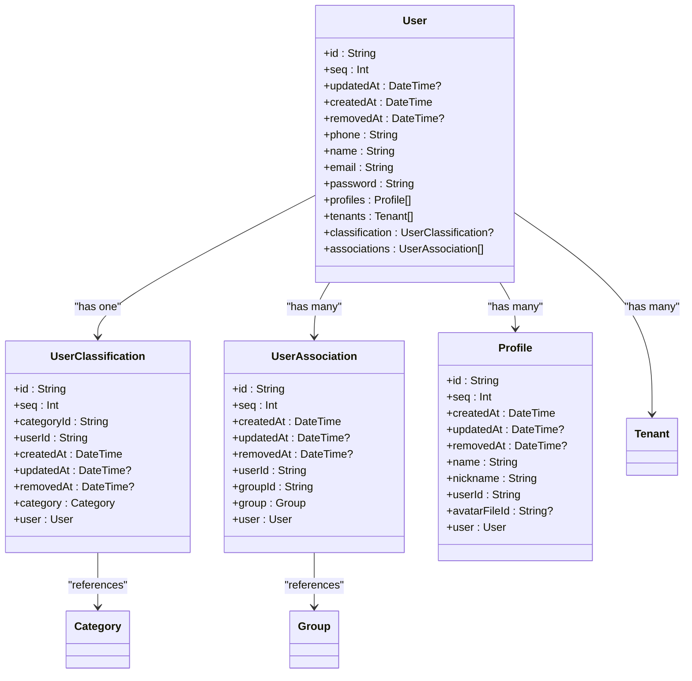

**Diagram sources**
- [user.prisma](file://packages/schema/prisma/schema/user.prisma)

**Section sources**
- [user.prisma](file://packages/schema/prisma/schema/user.prisma)

### Role Domain Analysis
The Role domain models in `role.prisma` implement the role-based access control system. The Role model represents different user roles in the system, with predefined values like USER, ADMIN, and SUPER_ADMIN. Each role can have multiple abilities, which define what actions the role can perform on specific subjects.

The RoleAssociation model connects roles to groups, allowing roles to be assigned to groups of users. This enables bulk permission management, where changing a role's permissions automatically affects all users in groups associated with that role.

The RoleClassification model links roles to categories, providing another dimension for organizing and classifying roles. This allows roles to be grouped into categories like "Common", "User", "Admin", and "Manager", which can be used for filtering and display purposes.

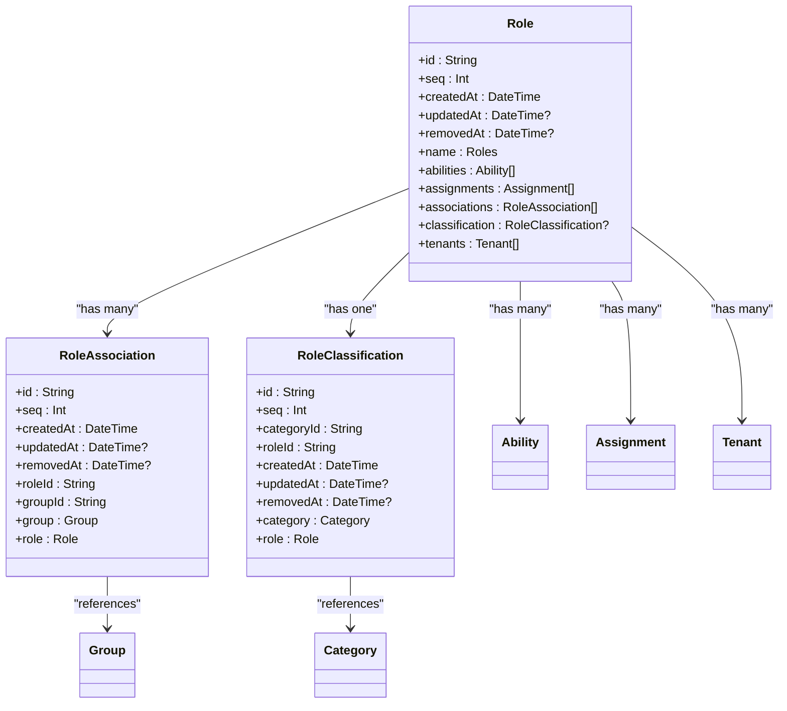

**Diagram sources**
- [role.prisma](file://packages/schema/prisma/schema/role.prisma)

**Section sources**
- [role.prisma](file://packages/schema/prisma/schema/role.prisma)

### Space Domain Analysis
The Space domain models in `space.prisma` represent physical or logical spaces in the system. The Space model is a container that can have multiple tenants, allowing multiple organizations to share the same space. Each space can be classified into categories and associated with groups.

The Ground model represents a physical location or facility, with details like name, address, phone, and business number. It has a one-to-one relationship with the Space model, indicating that each space corresponds to a specific ground.

The SpaceClassification model links spaces to categories, allowing spaces to be classified into different types. The SpaceAssociation model connects spaces to groups, enabling spaces to be members of multiple groups within a tenant.

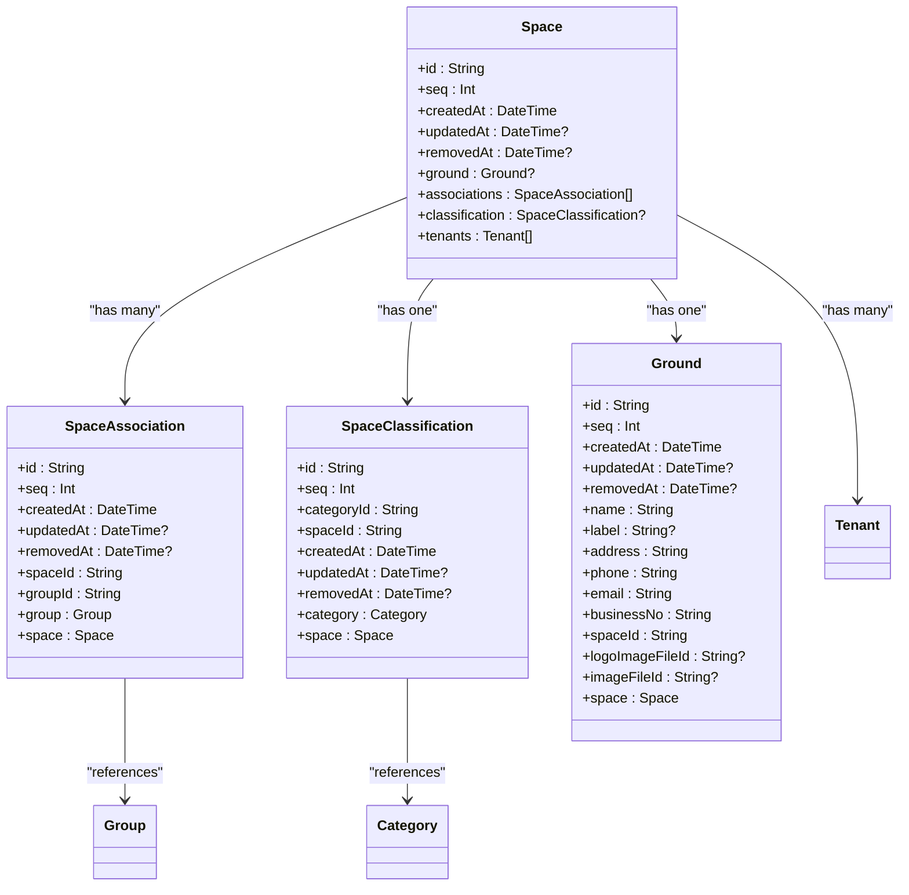

**Diagram sources**
- [space.prisma](file://packages/schema/prisma/schema/space.prisma)

**Section sources**
- [space.prisma](file://packages/schema/prisma/schema/space.prisma)

### File Domain Analysis
The File domain models in `file.prisma` handle file management and organization. The File model represents a file in the system, with properties like name, size, MIME type, and URL. Files can be organized in a hierarchical structure through parent-child relationships, allowing the creation of folders and subfolders.

The FileClassification model links files to categories, enabling files to be classified into different types. The FileAssociation model connects files to groups, allowing files to be shared with multiple groups within a tenant.

Files are tenant-scoped, with each file belonging to a specific tenant. This ensures data isolation between tenants in the multi-tenancy architecture.

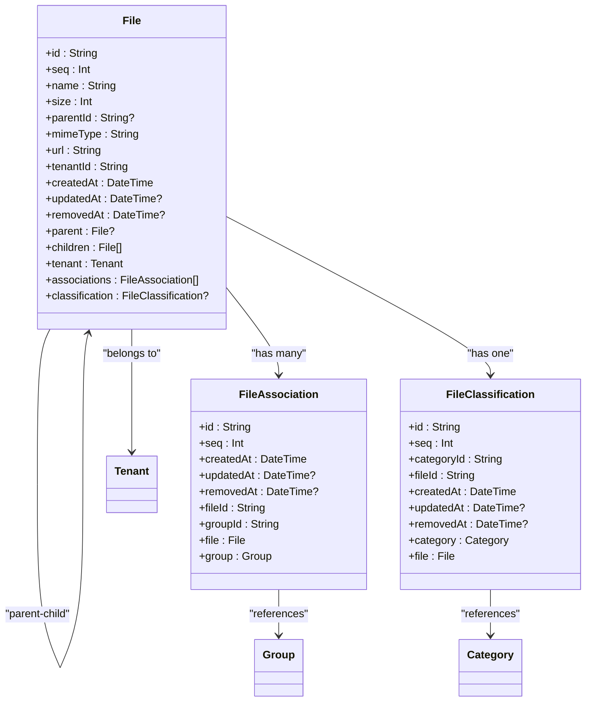

**Diagram sources**
- [file.prisma](file://packages/schema/prisma/schema/file.prisma)

**Section sources**
- [file.prisma](file://packages/schema/prisma/schema/file.prisma)

### Task Domain Analysis
The Task domain models in `task.prisma` represent a hierarchical structure for managing scheduled activities and programs. The domain follows a layered architecture with different levels of abstraction, from high-level timelines to specific exercises.

The Timeline model serves as a container for organizing sessions into meaningful groups, such as "2025년 10월" or "가을 시즌". Each timeline contains multiple sessions, which represent time-bound events that can be one-time, range-based, or recurring.

Sessions contain programs, which represent scheduled activities with specific instructors and capacity limits. Programs reference routines, which are reusable sequences of activities. Activities define how a task should be performed, including order, repetitions, and rest time.

The Task model serves as an abstraction layer that connects domain-specific models like Exercise to the activity scheduling system. This allows tasks to be reused across multiple routines and programs. The Exercise model extends the Task model with exercise-specific properties like duration, count, and media files.

```mermaid
classDiagram
class Timeline {
+id : String
+seq : Int
+createdAt : DateTime
+updatedAt : DateTime?
+removedAt : DateTime?
+tenantId : String
+name : String
+description : String?
+sessions : Session[]
}
class Session {
+id : String
+seq : Int
+createdAt : DateTime
+updatedAt : DateTime?
+removedAt : DateTime?
+type : SessionTypes
+repeatCycleType : RepeatCycleTypes?
+startDateTime : DateTime?
+endDateTime : DateTime?
+recurringDayOfWeek : RecurringDayOfWeek?
+timelineId : String
+name : String
+description : String?
+programs : Program[]
+timeline : Timeline
}
class Program {
+id : String
+seq : Int
+createdAt : DateTime
+updatedAt : DateTime?
+removedAt : DateTime?
+routineId : String
+sessionId : String
+instructorId : String
+capacity : Int
+name : String
+level : String?
+routine : Routine
+session : Session
}
class Routine {
+id : String
+seq : Int
+createdAt : DateTime
+updatedAt : DateTime?
+removedAt : DateTime?
+name : String
+label : String
+activities : Activity[]
+programs : Program[]
}
class Activity {
+id : String
+seq : Int
+createdAt : DateTime
+updatedAt : DateTime?
+removedAt : DateTime?
+routineId : String
+taskId : String
+order : Int
+repetitions : Int
+restTime : Int
+notes : String?
+routine : Routine
+task : Task
}
class Task {
+id : String
+seq : Int
+createdAt : DateTime
+updatedAt : DateTime?
+removedAt : DateTime?
+tenantId : String
+activities : Activity[]
+exercise : Exercise?
}
class Exercise {
+id : String
+seq : Int
+createdAt : DateTime
+updatedAt : DateTime?
+removedAt : DateTime?
+duration : Int
+count : Int
+taskId : String
+description : String?
+imageFileId : String?
+videoFileId : String?
+name : String
+task : Task
}
Timeline --> Session : "contains"
Session --> Program : "contains"
Program --> Routine : "references"
Routine --> Activity : "contains"
Activity --> Task : "references"
Task --> Exercise : "extends"
```

**Diagram sources**
- [task.prisma](file://packages/schema/prisma/schema/task.prisma)

**Section sources**
- [task.prisma](file://packages/schema/prisma/schema/task.prisma)

### Naming Conventions and Categorization Strategy
The Prisma model organization in prj-core follows consistent naming conventions and a clear categorization strategy. Model names are singular and use PascalCase, following Prisma conventions. Field names use camelCase, with foreign key fields suffixed with "Id" (e.g., userId, roleId) and relation fields using the model name (e.g., user, role).

The categorization strategy is implemented through the Category model, which can be applied to various entities like users, roles, spaces, and files. Categories are typed using the CategoryTypes enum, which includes values like Role, Space, File, and User, indicating the type of entity the category applies to.

Groups follow a similar pattern with the GroupTypes enum, allowing groups to be categorized by the type of entity they contain. This dual classification system (categories and groups) provides flexibility in organizing entities, with categories typically used for classification and groups for membership.

Common fields like id, seq, createdAt, updatedAt, and removedAt are consistently applied across all models, providing a uniform interface for record management. The id field uses UUIDs for global uniqueness, while seq provides a sequential identifier for ordering. The removedAt field enables soft deletion, preserving data integrity while marking records as deleted.

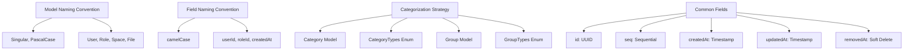

**Diagram sources**
- [core.prisma](file://packages/schema/prisma/schema/core.prisma)
- [user.prisma](file://packages/schema/prisma/schema/user.prisma)
- [role.prisma](file://packages/schema/prisma/schema/role.prisma)
- [space.prisma](file://packages/schema/prisma/schema/space.prisma)
- [file.prisma](file://packages/schema/prisma/schema/file.prisma)

**Section sources**
- [core.prisma](file://packages/schema/prisma/schema/core.prisma)
- [user.prisma](file://packages/schema/prisma/schema/user.prisma)
- [role.prisma](file://packages/schema/prisma/schema/role.prisma)
- [space.prisma](file://packages/schema/prisma/schema/space.prisma)
- [file.prisma](file://packages/schema/prisma/schema/file.prisma)

### Relationship Between Prisma Models and NestJS Modules
The Prisma models are closely integrated with NestJS modules, following a one-to-one mapping pattern. Each domain has a corresponding NestJS module that encapsulates the business logic for that domain. For example, the User domain models are managed by the UsersModule, the Role domain models by the RolesModule, and so on.

The PrismaModule provides the PrismaClient as a global service, which is then injected into repository classes within each domain module. These repositories encapsulate data access logic and provide a clean interface for the services to interact with the database.

The module structure in `apps/server/src/module/` mirrors the Prisma schema organization, with separate modules for each domain. This modular architecture promotes separation of concerns and makes the codebase more maintainable. Each module typically contains controllers, services, repositories, and DTOs specific to its domain.

```mermaid
graph TD
subgraph "NestJS Modules"
UsersModule
RolesModule
SpacesModule
FilesModule
TimelinesModule
SessionsModule
ProgramsModule
RoutinesModule
ExercisesModule
PrismaModule
end
subgraph "Prisma Models"
UserModels
RoleModels
SpaceModels
FileModels
TaskModels
end
UsersModule --> UserModels
RolesModule --> RoleModels
SpacesModule --> SpaceModels
FilesModule --> FileModels
TimelinesModule --> TaskModels
SessionsModule --> TaskModels
ProgramsModule --> TaskModels
RoutinesModule --> TaskModels
ExercisesModule --> TaskModels
PrismaModule --> "All Models"
style UsersModule fill:#f9f,stroke:#333
style RolesModule fill:#f9f,stroke:#333
style SpacesModule fill:#f9f,stroke:#333
style FilesModule fill:#f9f,stroke:#333
style TimelinesModule fill:#f9f,stroke:#333
style SessionsModule fill:#f9f,stroke:#333
style ProgramsModule fill:#f9f,stroke:#333
style RoutinesModule fill:#f9f,stroke:#333
style ExercisesModule fill:#f9f,stroke:#333
style PrismaModule fill:#bbf,stroke:#333
```

**Diagram sources**
- [prisma.module.ts](file://apps/server/src/module/prisma.module.ts)
- [users.module.ts](file://apps/server/src/module/users.module.ts)
- [roles.module.ts](file://apps/server/src/module/roles.module.ts)
- [spaces.module.ts](file://apps/server/src/module/spaces.module.ts)
- [files.module.ts](file://apps/server/src/module/files.module.ts)
- [timelines.module.ts](file://apps/server/src/module/timelines.module.ts)
- [sessions.module.ts](file://apps/server/src/module/sessions.module.ts)
- [programs.module.ts](file://apps/server/src/module/programs.module.ts)
- [routines.module.ts](file://apps/server/src/module/routines.module.ts)
- [exercises.module.ts](file://apps/server/src/module/exercises.module.ts)

**Section sources**
- [prisma.module.ts](file://apps/server/src/module/prisma.module.ts)

## Dependency Analysis
The Prisma models in prj-core have a well-defined dependency structure that reflects the application's domain logic. The Tenant model serves as the central entity, with most other models depending on it either directly or indirectly. This creates a hierarchical structure where all data is scoped to a specific tenant, supporting the multi-tenancy architecture.

The Role-based Access Control (RBAC) system creates dependencies between the Role, Ability, Action, and Subject models. Roles have abilities, which reference actions and subjects, creating a chain of dependencies that defines the permission system.

The Task domain models have a hierarchical dependency structure, with Timeline depending on Session, Session depending on Program, Program depending on Routine, Routine depending on Activity, and Activity depending on Task. This creates a clear flow of dependencies from high-level containers to specific activities.

The categorization system creates dependencies through the Category model, which is referenced by UserClassification, RoleClassification, SpaceClassification, and FileClassification. Similarly, the grouping system creates dependencies through the Group model, which is referenced by UserAssociation, RoleAssociation, SpaceAssociation, and FileAssociation.

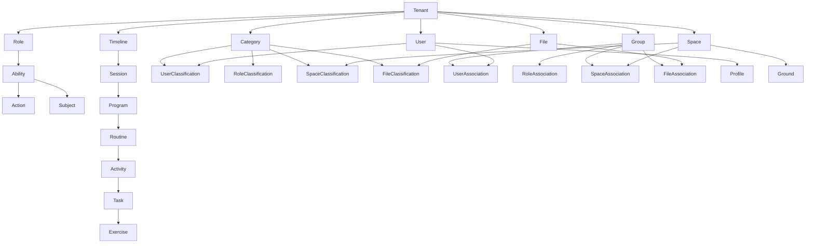

**Diagram sources**
- [core.prisma](file://packages/schema/prisma/schema/core.prisma)
- [user.prisma](file://packages/schema/prisma/schema/user.prisma)
- [role.prisma](file://packages/schema/prisma/schema/role.prisma)
- [space.prisma](file://packages/schema/prisma/schema/space.prisma)
- [file.prisma](file://packages/schema/prisma/schema/file.prisma)
- [task.prisma](file://packages/schema/prisma/schema/task.prisma)

**Section sources**
- [core.prisma](file://packages/schema/prisma/schema/core.prisma)
- [user.prisma](file://packages/schema/prisma/schema/user.prisma)
- [role.prisma](file://packages/schema/prisma/schema/role.prisma)
- [space.prisma](file://packages/schema/prisma/schema/space.prisma)
- [file.prisma](file://packages/schema/prisma/schema/file.prisma)
- [task.prisma](file://packages/schema/prisma/schema/task.prisma)

## Performance Considerations
The Prisma model organization in prj-core includes several performance considerations to ensure efficient database operations. Indexes are strategically applied to frequently queried fields, such as foreign keys and commonly searched attributes. For example, the Timeline model has indexes on tenantId, createdAt, and name, while the Session model has indexes on timelineId, startDateTime, and type.

The use of UUIDs for primary keys ensures global uniqueness and supports distributed systems, but may impact index performance compared to sequential integers. To mitigate this, the seq field provides a sequential identifier that can be used for ordering when appropriate.

Soft deletion is implemented through the removedAt field, which avoids the performance overhead of cascading deletes while preserving data integrity. Queries should include filters for removedAt to exclude deleted records, and appropriate indexes should be created on the removedAt field for efficient filtering.

The hierarchical structure of models like Category (with parent-child relationships) and File (with folder structure) should be queried carefully to avoid performance issues with deep trees. Consider implementing pagination and limiting the depth of queries to prevent excessive database load.

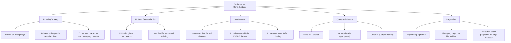

**Section sources**
- [core.prisma](file://packages/schema/prisma/schema/core.prisma)
- [task.prisma](file://packages/schema/prisma/schema/task.prisma)

## Troubleshooting Guide
When working with the Prisma model organization in prj-core, several common issues may arise. This section provides guidance on identifying and resolving these issues.

### Schema Synchronization Issues
When making changes to the Prisma schema, ensure that migrations are properly generated and applied. Use `prisma migrate dev` during development to create and apply migrations, and `prisma migrate deploy` in production. If you encounter schema drift issues, verify that the migration history in the _prisma_migrations table matches your migration files.

### Data Integrity Constraints
The schema includes various constraints to maintain data integrity, such as unique constraints on fields like User.phone, User.name, and User.email. When inserting or updating records, ensure that these constraints are not violated. Use upsert operations when appropriate to handle cases where a record may already exist.

### Relationship Management
When working with relational data, be mindful of the order of operations. For example, when creating a User with a Profile, create the User first, then the Profile with a reference to the User's ID. Similarly, when establishing many-to-many relationships through join tables (like UserAssociation), ensure that both related records exist before creating the association.

### Query Performance
Monitor query performance, especially for complex queries involving multiple joins. Use Prisma's query logging to identify slow queries and optimize them by adding appropriate indexes or restructuring the query. Be cautious with deep include operations, as they can generate complex SQL queries that may impact performance.

### Migration Conflicts
When working in a team environment, migration conflicts can occur if multiple developers create migrations simultaneously. To avoid this, communicate with your team about schema changes and consider using a branching strategy where schema changes are coordinated through a central branch.

**Section sources**
- [core.prisma](file://packages/schema/prisma/schema/core.prisma)
- [user.prisma](file://packages/schema/prisma/schema/user.prisma)
- [seed.ts](file://packages/schema/prisma/seed.ts)
- [seed-data.ts](file://packages/schema/prisma/seed-data.ts)

## Conclusion
The Prisma model organization in prj-core follows a well-structured, domain-driven approach that promotes maintainability and scalability. By organizing models into domain-specific files and following consistent naming conventions, the schema is easy to navigate and understand.

The architecture supports the application's multi-tenancy requirements through the Tenant model, which serves as the central entity connecting users, roles, spaces, files, and other domain-specific models. The RBAC system provides fine-grained permission management, while the categorization and grouping systems offer flexibility in organizing entities.

The integration with NestJS modules follows a clean, modular pattern, with each domain having its own module that encapsulates the business logic for that domain. This separation of concerns makes the codebase more maintainable and testable.

When adding new models, follow the existing patterns by creating a new schema file for the domain, using consistent naming conventions, and ensuring proper relationships with existing models. As the application grows, continue to refine the categorization and grouping strategies to accommodate new use cases while maintaining data integrity and performance.