# Prisma Schema Overview

<cite>
**Referenced Files in This Document**   
- [core.prisma](file://packages/schema/prisma/schema/core.prisma)
- [_base.prisma](file://packages/schema/prisma/schema/_base.prisma)
- [user.prisma](file://packages/schema/prisma/schema/user.prisma)
- [role.prisma](file://packages/schema/prisma/schema/role.prisma)
- [space.prisma](file://packages/schema/prisma/schema/space.prisma)
- [file.prisma](file://packages/schema/prisma/schema/file.prisma)
- [task.prisma](file://packages/schema/prisma/schema/task.prisma)
- [seed.ts](file://packages/schema/prisma/seed.ts)
- [seed-data.ts](file://packages/schema/prisma/seed-data.ts)
</cite>

## Table of Contents
1. [Introduction](#introduction)
2. [Schema Organization and Design Philosophy](#schema-organization-and-design-philosophy)
3. [Connection Configuration and Prisma Settings](#connection-configuration-and-prisma-settings)
4. [Naming Conventions and Global Attributes](#naming-conventions-and-global-attributes)
5. [Entity Domain Model and Multi-Tenancy Architecture](#entity-domain-model-and-multi-tenancy-architecture)
6. [Core Data Models and Relations](#core-data-models-and-relations)
7. [Complex Relation Handling and Cascade Behaviors](#complex-relation-handling-and-cascade-behaviors)
8. [Indexing, Constraints, and Performance Optimization](#indexing-constraints-and-performance-optimization)
9. [Custom Types and Enum Usage](#custom-types-and-enum-usage)
10. [Conclusion](#conclusion)

## Introduction
This document provides a comprehensive overview of the Prisma schema used in the prj-core project. The schema defines a robust, multi-tenant application architecture with sophisticated role-based access control, hierarchical classification systems, and domain-driven design principles. The database structure supports complex relationships between users, roles, spaces, files, and operational entities like sessions and programs, enabling a flexible and scalable platform for managing organizational workflows.

## Schema Organization and Design Philosophy
The Prisma schema follows a modular, domain-driven design approach with models organized into separate files based on their functional domains. This organization enhances maintainability and clarity by grouping related entities together.

The core design philosophy emphasizes flexibility, reusability, and strong typing. The schema implements a multi-tenancy architecture where all tenant-specific data is explicitly linked to a tenant entity, ensuring data isolation and security. Classification and association patterns are used consistently across domains (User, Role, Space, File) to enable consistent categorization and grouping mechanisms.

The schema also implements a soft-delete pattern with `removedAt` fields across all models, preserving data integrity while supporting logical deletion. Timestamps are standardized with `createdAt` and `updatedAt` fields, and all database columns use snake_case naming via the `@map` attribute.

**Section sources**
- [core.prisma](file://packages/schema/prisma/schema/core.prisma)
- [user.prisma](file://packages/schema/prisma/schema/user.prisma)
- [role.prisma](file://packages/schema/prisma/schema/role.prisma)
- [space.prisma](file://packages/schema/prisma/schema/space.prisma)
- [file.prisma](file://packages/schema/prisma/schema/file.prisma)

## Connection Configuration and Prisma Settings
The Prisma configuration is defined in the `_base.prisma` file, which establishes the fundamental connection settings for the entire schema. The datasource is configured for PostgreSQL, leveraging the `@prisma/adapter-pg` adapter for enhanced performance and compatibility.

```mermaid
erDiagram
datasource_db {
provider "postgresql"
url "DATABASE_URL environment variable"
}
generator_client {
provider "prisma-client-js"
}
```

**Diagram sources**
- [_base.prisma](file://packages/schema/prisma/schema/_base.prisma)

The generator block specifies the Prisma Client JS as the provider, enabling type-safe database access in the application code. The configuration supports environment-based database URLs, allowing different connection strings for development, staging, and production environments.

The project uses Prisma Migrate for schema evolution, with migration scripts stored in the migrations directory. The seed script (`seed.ts`) demonstrates the use of the Prisma Client with PostgreSQL adapter for data initialization, including password hashing and transactional operations.

**Section sources**
- [_base.prisma](file://packages/schema/prisma/schema/_base.prisma)
- [seed.ts](file://packages/schema/prisma/seed.ts)

## Naming Conventions and Global Attributes
The schema follows consistent naming conventions and applies global attributes across all models to ensure uniformity and maintainability.

All model fields use camelCase in the Prisma schema, which maps to snake_case in the database using the `@map` attribute. Primary keys consistently use `id` with UUID generation, while sequence numbers use `seq` with auto-increment for ordering purposes. Timestamp fields follow the pattern `createdAt`, `updatedAt`, and `removedAt` for creation, modification, and soft-delete tracking.


**Diagram sources**
- [core.prisma](file://packages/schema/prisma/schema/core.prisma)
- [user.prisma](file://packages/schema/prisma/schema/user.prisma)

The schema uses `@default(uuid())` for primary keys, `@default(now())` for creation timestamps, and `@updatedAt` for modification timestamps. The `@unique` attribute is applied to business-unique fields like email, phone, and name where appropriate. All datetime fields use `@db.Timestamptz(6)` to ensure timezone-aware storage with microsecond precision.

**Section sources**
- [core.prisma](file://packages/schema/prisma/schema/core.prisma)
- [user.prisma](file://packages/schema/prisma/schema/user.prisma)

## Entity Domain Model and Multi-Tenancy Architecture
The entity domain model is built around a robust multi-tenancy architecture where the `Tenant` entity serves as the central connector between users, roles, and spaces. This design enables users to belong to multiple organizations (tenants) with different roles in each.

```mermaid
erDiagram
USER ||--o{ TENANT : "has"
ROLE ||--o{ TENANT : "has"
SPACE ||--o{ TENANT : "has"
TENANT ||--o{ ASSIGNMENT : "has"
USER ||--o{ PROFILE : "has"
USER ||--o{ USER_ASSOCIATION : "has"
USER ||--o{ USER_CLASSIFICATION : "has"
GROUP ||--o{ USER_ASSOCIATION : "has"
CATEGORY ||--o{ USER_CLASSIFICATION : "has"
USER {
String id PK
String phone UK
String name UK
String email UK
String password
}
TENANT {
String id PK
String userId FK
String roleId FK
String spaceId FK
Boolean main
}
ROLE {
String id PK
Roles name UK
}
SPACE {
String id PK
}
ASSIGNMENT {
String id PK
String roleId FK
String tenantId FK
}
PROFILE {
String id PK
String userId FK
String nickname UK
}
USER_ASSOCIATION {
String id PK
String userId FK
String groupId FK
}
USER_CLASSIFICATION {
String id PK
String userId FK
String categoryId FK
}
```



**Diagram sources**
- [core.prisma](file://packages/schema/prisma/schema/core.prisma)
- [user.prisma](file://packages/schema/prisma/schema/user.prisma)
- [role.prisma](file://packages/schema/prisma/schema/role.prisma)
- [space.prisma](file://packages/schema/prisma/schema/space.prisma)

The multi-tenancy model allows users to have a "main" tenant designation while belonging to multiple tenants. Each tenant assignment includes a role, enabling role-based access control within each organizational context. The `Space` entity represents a top-level organizational unit, while `Ground` represents a physical location or branch within a space.

This architecture supports complex organizational hierarchies where users can have different roles across different spaces, and permissions are evaluated in the context of the current tenant. The design also supports data isolation, as all tenant-specific data is linked through the tenant entity.

**Section sources**
- [core.prisma](file://packages/schema/prisma/schema/core.prisma)
- [user.prisma](file://packages/schema/prisma/schema/user.prisma)
- [role.prisma](file://packages/schema/prisma/schema/role.prisma)
- [space.prisma](file://packages/schema/prisma/schema/space.prisma)

## Core Data Models and Relations
The schema defines a comprehensive set of core data models that support the application's business logic. These models are interconnected through well-defined relationships that enforce data integrity and enable complex queries.

The classification and association patterns are implemented consistently across domains. Each domain (User, Role, Space, File) has corresponding `Classification` and `Association` entities that link to `Category` and `Group` respectively. This design enables flexible categorization and grouping of entities without requiring schema changes.


**Diagram sources**
- [core.prisma](file://packages/schema/prisma/schema/core.prisma)
- [file.prisma](file://packages/schema/prisma/schema/file.prisma)
- [role.prisma](file://packages/schema/prisma/schema/role.prisma)
- [space.prisma](file://packages/schema/prisma/schema/space.prisma)
- [user.prisma](file://packages/schema/prisma/schema/user.prisma)

The operational domain models include `Timeline`, `Session`, `Program`, `Routine`, `Activity`, and `Task`, which form a hierarchical structure for managing scheduled events and activities. The `Task` entity serves as an abstraction layer that can be extended by domain-specific entities like `Exercise`, enabling a flexible and extensible design.

**Section sources**
- [core.prisma](file://packages/schema/prisma/schema/core.prisma)
- [task.prisma](file://packages/schema/prisma/schema/task.prisma)
- [file.prisma](file://packages/schema/prisma/schema/file.prisma)

## Complex Relation Handling and Cascade Behaviors
The schema implements sophisticated relation handling to manage complex business logic and maintain data integrity. While Prisma does not support database-level cascade operations in all cases, the application logic and seed data demonstrate careful consideration of entity lifecycles.

The hierarchical relationships in the `Category` model use self-referential relations to create tree structures, with `parentId` linking to the parent category and `children` representing the collection of child categories. This design enables flexible categorization with multiple levels of hierarchy.


**Diagram sources**
- [user.prisma](file://packages/schema/prisma/schema/user.prisma)
- [space.prisma](file://packages/schema/prisma/schema/space.prisma)
- [core.prisma](file://packages/schema/prisma/schema/core.prisma)

The seed data (`seed.ts`) demonstrates complex relation handling during data initialization, including upsert operations to avoid duplicates, transactional integrity, and proper sequencing of dependent entity creation. For example, when creating a user with tenant assignments, the code first ensures the role exists, then creates the user, and finally creates the tenant assignment.

The `Task` and `Exercise` relationship demonstrates a 1:1 inheritance pattern, where `Exercise` extends `Task` with domain-specific properties. This design allows `Activity` to reference `Task` generically while still accessing `Exercise`-specific data when needed.

**Section sources**
- [seed.ts](file://packages/schema/prisma/seed.ts)
- [seed-data.ts](file://packages/schema/prisma/seed-data.ts)
- [task.prisma](file://packages/schema/prisma/schema/task.prisma)

## Indexing, Constraints, and Performance Optimization
The schema includes comprehensive indexing and constraint definitions to ensure data integrity and optimize query performance. Unique constraints are applied to business-critical fields like email, phone, and name to prevent duplicates.

Composite indexes are strategically placed on commonly queried field combinations, particularly those involving tenant context. For example, the `Session` model includes indexes on `[timelineId, startDateTime]` and `[startDateTime, endDateTime]` to optimize time-based queries within a specific timeline.

```mermaid
erDiagram
TIMELINE ||--o{ SESSION : "contains"
SESSION ||--o{ PROGRAM : "has"
PROGRAM ||--o{ ROUTINE : "references"
ACTIVITY ||--o{ TASK : "references"
TASK ||--o{ EXERCISE : "extends"
TIMELINE {
String id PK
String tenantId FK
String name
DateTime createdAt
}
SESSION {
String id PK
String timelineId FK
SessionTypes type
DateTime startDateTime
DateTime endDateTime
}
PROGRAM {
String id PK
String sessionId FK
String routineId FK
Int capacity
}
ROUTINE {
String id PK
String name
}
ACTIVITY {
String id PK
String routineId FK
String taskId FK
Int order
}
TASK {
String id PK
String tenantId FK
}
EXERCISE {
String id PK
String taskId FK UK
String name
Int duration
}
%% Index annotations
note as IndexNote
Indexes:
- Timeline: [tenantId], [tenantId, createdAt], [name]
- Session: [timelineId, startDateTime], [startDateTime, endDateTime], [type, startDateTime]
- Program: [sessionId], [routineId], [instructorId]
- Activity: [routineId, order]
- Task: [tenantId]
- Exercise: [name]
end note
IndexNote .. TIMELINE
```

**Diagram sources**
- [task.prisma](file://packages/schema/prisma/schema/task.prisma)

The schema also uses `@@unique` constraints on association and classification tables to prevent duplicate relationships. For example, `UserClassification` has a composite unique constraint on `[categoryId, userId]` to ensure a user can only be classified once per category.

The `@db.Timestamptz(6)` attribute on datetime fields ensures high-precision, timezone-aware storage, which is critical for time-based operations across different geographic regions. The use of UUIDs for primary keys provides globally unique identifiers that facilitate distributed systems and data merging.

**Section sources**
- [task.prisma](file://packages/schema/prisma/schema/task.prisma)
- [core.prisma](file://packages/schema/prisma/schema/core.prisma)

## Custom Types and Enum Usage
The schema extensively uses enums to define fixed sets of values for various attributes, ensuring data consistency and providing clear semantics. These enums are used for role types, session types, repeat cycle types, recurring days of week, ability actions, ability types, category types, group types, and more.


**Diagram sources**
- [core.prisma](file://packages/schema/prisma/schema/core.prisma)

These enums are defined directly in the Prisma schema and are automatically generated as TypeScript types, providing type safety throughout the application. The use of enums improves code readability, prevents invalid values, and enables better tooling support.

The schema also uses custom scalar types through Prisma's attribute system, such as `Json` for flexible data storage in the `conditions` field of `Action` and `Ability` entities. This allows for dynamic rule definitions and conditional logic without requiring schema changes.

**Section sources**
- [core.prisma](file://packages/schema/prisma/schema/core.prisma)

## Conclusion
The Prisma schema in prj-core demonstrates a sophisticated, well-architected database design that supports a complex multi-tenant application with rich role-based access control and flexible data modeling. The modular organization, consistent naming conventions, and thoughtful relation design create a maintainable and scalable foundation for the application.

Key strengths of the schema include its consistent implementation of classification and association patterns across domains, robust multi-tenancy architecture, and comprehensive indexing strategy. The use of enums and strong typing ensures data integrity while providing excellent developer experience through generated TypeScript types.

The schema effectively balances flexibility with structure, allowing for extensible domain models while maintaining data consistency and performance. The separation of concerns between abstract entities like `Task` and domain-specific entities like `Exercise` enables a clean, maintainable architecture that can evolve with changing business requirements.