# Relation Models

<cite>
**Referenced Files in This Document**   
- [core.prisma](file://packages/schema/prisma/schema/core.prisma)
- [user.prisma](file://packages/schema/prisma/schema/user.prisma)
- [role.prisma](file://packages/schema/prisma/schema/role.prisma)
- [space.prisma](file://packages/schema/prisma/schema/space.prisma)
- [file.prisma](file://packages/schema/prisma/schema/file.prisma)
- [task.prisma](file://packages/schema/prisma/schema/task.prisma)
- [migration.sql](file://packages/schema/prisma/migrations/20250807132908_/migration.sql)
</cite>

## Table of Contents
1. [Introduction](#introduction)
2. [One-to-One Relationships](#one-to-one-relationships)
3. [One-to-Many Relationships](#one-to-many-relationships)
4. [Many-to-Many Relationships](#many-to-many-relationships)
5. [Self-Relations](#self-relations)
6. [Multiple Relations Between Models](#multiple-relations-between-models)
7. [Embedded Relations and Classification Patterns](#embedded-relations-and-classification-patterns)
8. [Referential Actions and Cascade Behavior](#referential-actions-and-cascade-behavior)
9. [Querying Related Data](#querying-related-data)
10. [Performance Optimization](#performance-optimization)

## Introduction
This document provides comprehensive documentation for the relation models in prj-core's Prisma schema. The system implements a sophisticated multi-tenant architecture with complex relationship patterns across key entities. The schema demonstrates advanced Prisma features including various relationship types, referential actions, and classification patterns. The relationships are designed to support a flexible, scalable system that can handle complex domain requirements while maintaining data integrity.

**Section sources**
- [core.prisma](file://packages/schema/prisma/schema/core.prisma#L1-L238)
- [user.prisma](file://packages/schema/prisma/schema/user.prisma#L1-L62)
- [role.prisma](file://packages/schema/prisma/schema/role.prisma#L1-L46)

## One-to-One Relationships
One-to-one relationships in the prj-core schema are implemented using unique fields and relations. The most prominent example is the relationship between `Exercise` and `Task`, where each exercise is associated with exactly one task, and each task can have at most one exercise.

```mermaid
classDiagram
class Exercise {
+String id
+Int seq
+DateTime createdAt
+DateTime? updatedAt
+DateTime? removedAt
+Int duration
+Int count
+String taskId
+String? description
+String? imageFileId
+String name
+String? videoFileId
}
class Task {
+String id
+Int seq
+DateTime createdAt
+DateTime? updatedAt
+DateTime? removedAt
+String tenantId
}
Exercise --> Task : "1 : 1"
```

**Diagram sources**
- [task.prisma](file://packages/schema/prisma/schema/task.prisma#L126-L163)
- [task.prisma](file://packages/schema/prisma/schema/task.prisma#L145-L162)

Another example is the relationship between `Ground` and `Space`, where each ground is associated with exactly one space, and each space can have at most one ground.

```mermaid
classDiagram
class Ground {
+String id
+Int seq
+DateTime createdAt
+DateTime? updatedAt
+DateTime? removedAt
+String name
+String? label
+String address
+String phone
+String email
+String businessNo
+String spaceId
+String? logoImageFileId
+String? imageFileId
}
class Space {
+String id
+Int seq
+DateTime createdAt
+DateTime? updatedAt
+DateTime? removedAt
+Ground?
}
Ground --> Space : "1 : 1"
```

**Diagram sources**
- [space.prisma](file://packages/schema/prisma/schema/space.prisma#L1-L64)
- [space.prisma](file://packages/schema/prisma/schema/space.prisma#L45-L64)

**Section sources**
- [task.prisma](file://packages/schema/prisma/schema/task.prisma#L126-L163)
- [space.prisma](file://packages/schema/prisma/schema/space.prisma#L1-L64)

## One-to-Many Relationships
One-to-many relationships are extensively used throughout the prj-core schema. These relationships are implemented using relation fields and foreign key constraints. The most common pattern is a parent entity having multiple child entities.

The `Category` model demonstrates a self-referential one-to-many relationship where a category can have multiple child categories, but each child category has exactly one parent category.

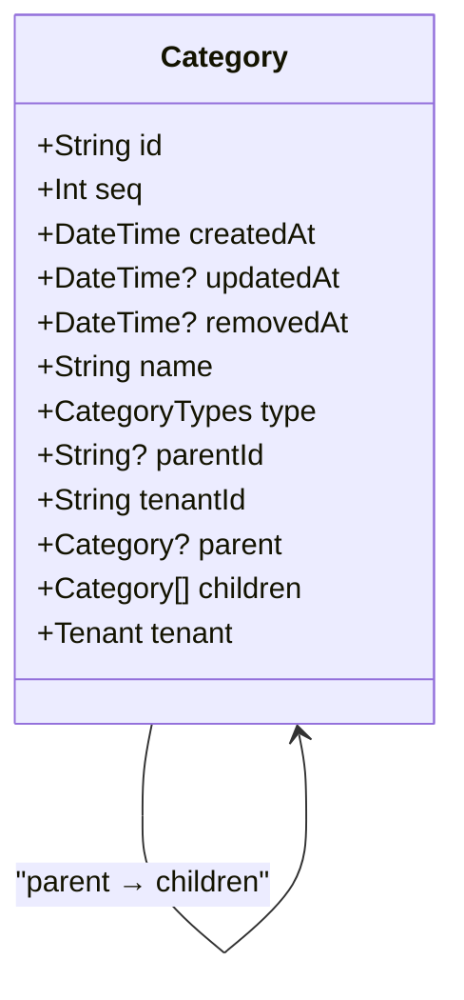

**Diagram sources**
- [core.prisma](file://packages/schema/prisma/schema/core.prisma#L1-L20)

The `Tenant` model has one-to-many relationships with several entities, including assignments, categories, files, groups, and users. Each tenant can have multiple instances of these entities, but each instance belongs to exactly one tenant.

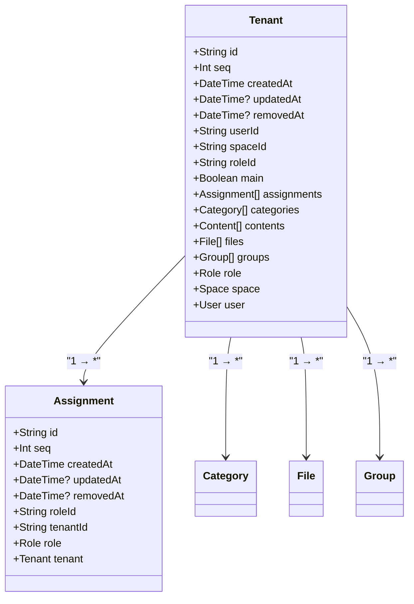

**Diagram sources**
- [core.prisma](file://packages/schema/prisma/schema/core.prisma#L41-L61)
- [core.prisma](file://packages/schema/prisma/schema/core.prisma#L63-L75)

**Section sources**
- [core.prisma](file://packages/schema/prisma/schema/core.prisma#L1-L238)

## Many-to-Many Relationships
The prj-core schema implements many-to-many relationships using explicit join models rather than implicit relations. This approach provides greater flexibility and allows for additional fields in the relationship.

The relationship between `User` and `Group` is implemented through the `UserAssociation` model, which serves as a join table with additional metadata.

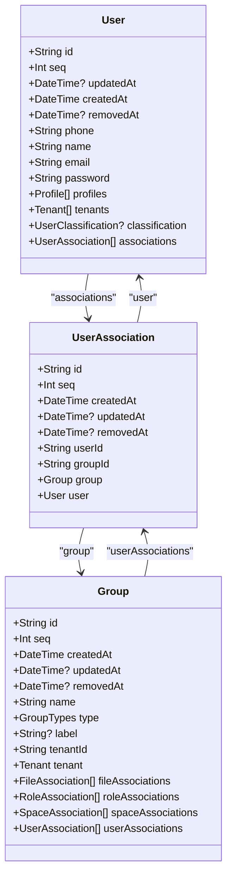

**Diagram sources**
- [user.prisma](file://packages/schema/prisma/schema/user.prisma#L1-L62)
- [role.prisma](file://packages/schema/prisma/schema/role.prisma#L1-L46)

Similar patterns are used for other many-to-many relationships:

- `Role` and `Group` through `RoleAssociation`
- `Space` and `Group` through `SpaceAssociation`
- `File` and `Group` through `FileAssociation`
- `Task` and `Activity` through the relation field with composite unique constraint

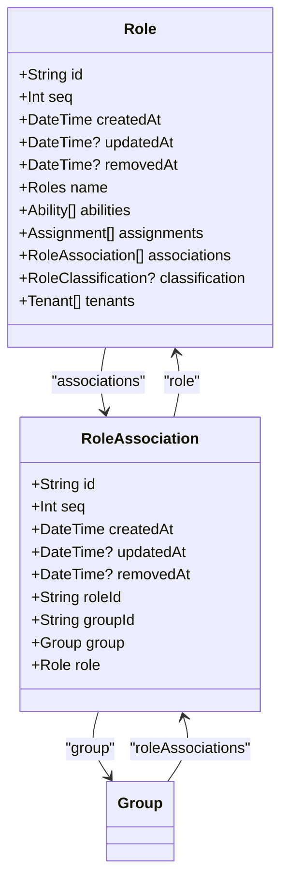

**Diagram sources**
- [role.prisma](file://packages/schema/prisma/schema/role.prisma#L1-L46)

**Section sources**
- [user.prisma](file://packages/schema/prisma/schema/user.prisma#L1-L62)
- [role.prisma](file://packages/schema/prisma/schema/role.prisma#L1-L46)
- [space.prisma](file://packages/schema/prisma/schema/space.prisma#L1-L64)
- [file.prisma](file://packages/schema/prisma/schema/file.prisma#L1-L51)

## Self-Relations
Self-relations are used in the prj-core schema to represent hierarchical structures within the same model. The most prominent example is the self-relation in the `Category` model, which allows categories to form a tree structure.


**Diagram sources**
- [core.prisma](file://packages/schema/prisma/schema/core.prisma#L1-L20)

The `File` model also implements a self-relation to support a hierarchical file structure, where files can have parent files and multiple child files.

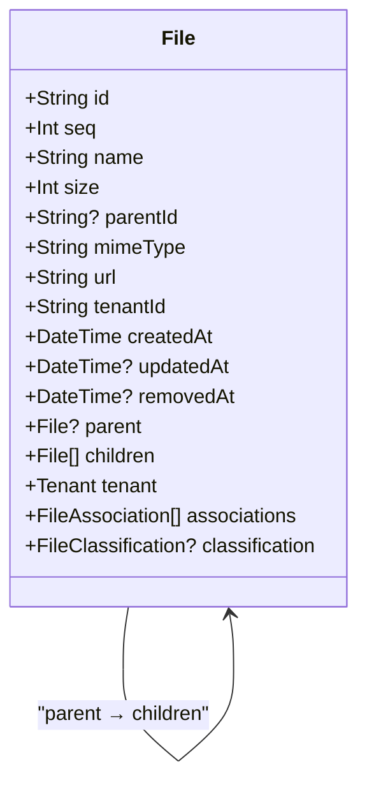

**Diagram sources**
- [file.prisma](file://packages/schema/prisma/schema/file.prisma#L1-L51)

These self-relations are implemented using the `@relation` attribute with a specified name and fields that reference the same model.

**Section sources**
- [core.prisma](file://packages/schema/prisma/schema/core.prisma#L1-L20)
- [file.prisma](file://packages/schema/prisma/schema/file.prisma#L1-L51)

## Multiple Relations Between Models
The prj-core schema includes several examples of multiple relations between the same models, which allows for different types of relationships between entities.

The `Category` model has multiple relations with other models through classification patterns. For example, a category can classify users, roles, spaces, and files through separate relation fields.

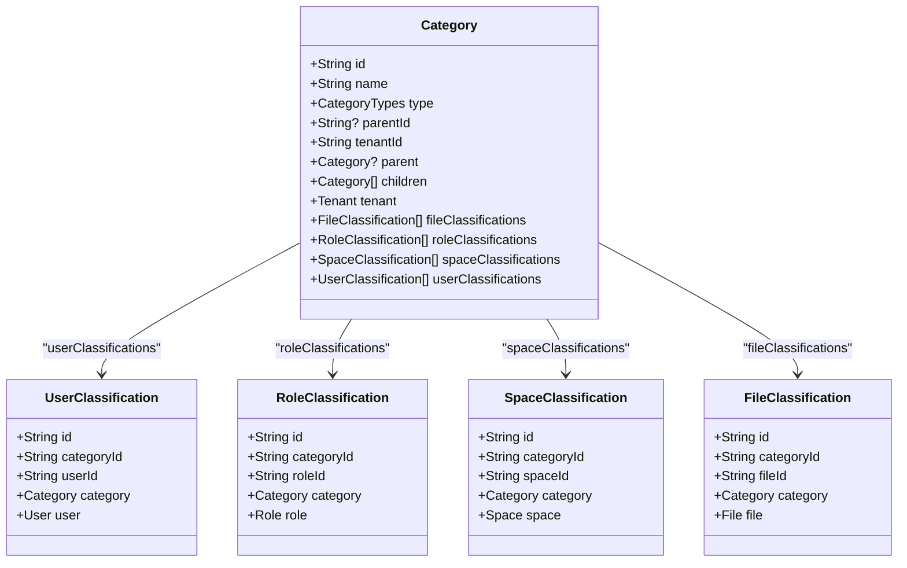

**Diagram sources**
- [core.prisma](file://packages/schema/prisma/schema/core.prisma#L1-L20)
- [user.prisma](file://packages/schema/prisma/schema/user.prisma#L19-L32)
- [role.prisma](file://packages/schema/prisma/schema/role.prisma#L32-L46)
- [space.prisma](file://packages/schema/prisma/schema/space.prisma#L15-L28)
- [file.prisma](file://packages/schema/prisma/schema/file.prisma#L22-L35)

The `Group` model similarly has multiple relations with users, roles, spaces, and files through association patterns.

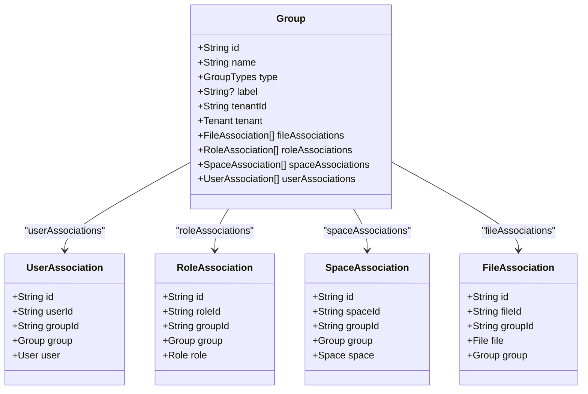

**Diagram sources**
- [role.prisma](file://packages/schema/prisma/schema/role.prisma#L17-L46)
- [space.prisma](file://packages/schema/prisma/schema/space.prisma#L30-L43)
- [file.prisma](file://packages/schema/prisma/schema/file.prisma#L37-L50)

**Section sources**
- [core.prisma](file://packages/schema/prisma/schema/core.prisma#L1-L20)
- [user.prisma](file://packages/schema/prisma/schema/user.prisma#L19-L32)
- [role.prisma](file://packages/schema/prisma/schema/role.prisma#L17-L46)
- [space.prisma](file://packages/schema/prisma/schema/space.prisma#L15-L43)
- [file.prisma](file://packages/schema/prisma/schema/file.prisma#L22-L50)

## Embedded Relations and Classification Patterns
The prj-core schema implements sophisticated embedded relation patterns through classification and association models. These patterns allow for flexible categorization and grouping of entities without requiring changes to the core models.

The classification pattern is used to categorize entities such as users, roles, spaces, and files. Each classification model includes a composite unique constraint to ensure that an entity can only be classified once per category.

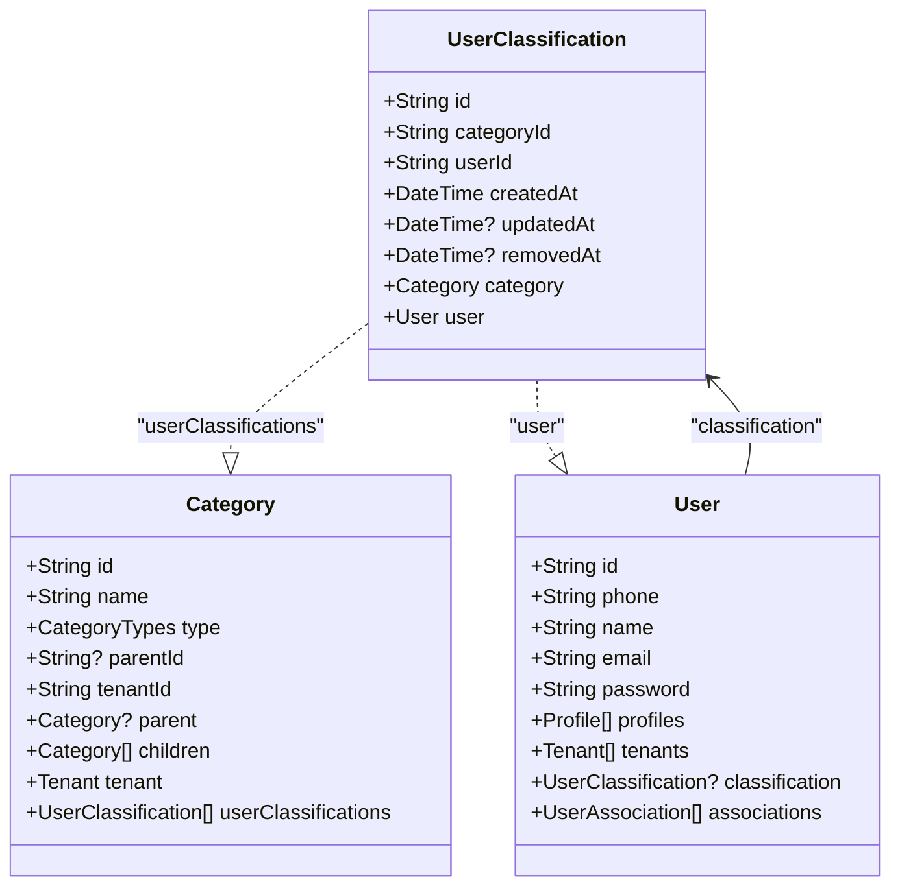

**Diagram sources**
- [user.prisma](file://packages/schema/prisma/schema/user.prisma#L19-L32)
- [core.prisma](file://packages/schema/prisma/schema/core.prisma#L1-L20)

The association pattern is used to group entities such as users, roles, spaces, and files. Unlike classification, an entity can be associated with multiple groups.

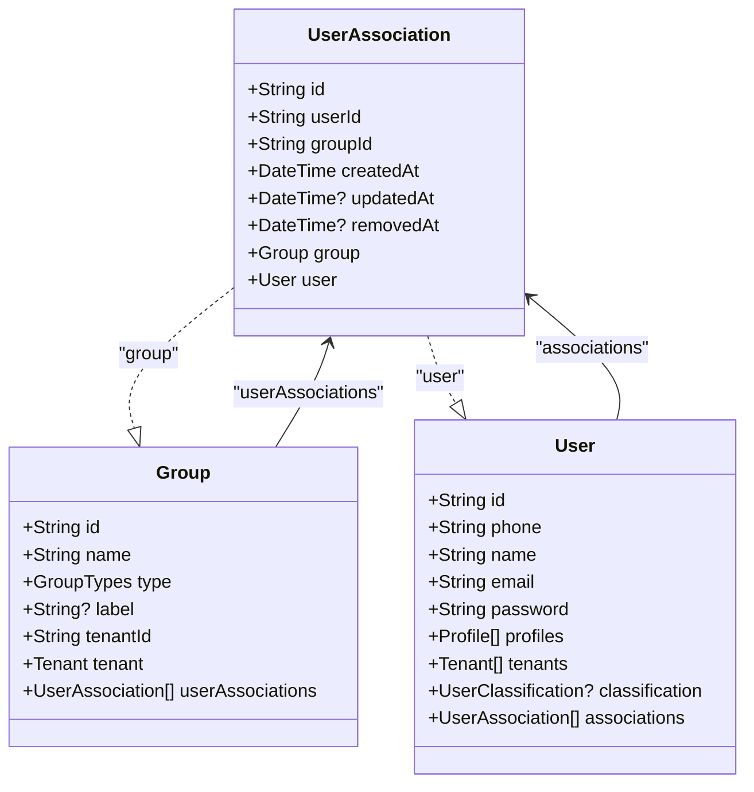

**Diagram sources**
- [user.prisma](file://packages/schema/prisma/schema/user.prisma#L34-L46)
- [role.prisma](file://packages/schema/prisma/schema/role.prisma#L17-L30)

These patterns enable a flexible system where entities can be organized and categorized in multiple ways without requiring changes to the core entity models.

**Section sources**
- [user.prisma](file://packages/schema/prisma/schema/user.prisma#L19-L46)
- [role.prisma](file://packages/schema/prisma/schema/role.prisma#L17-L30)
- [space.prisma](file://packages/schema/prisma/schema/space.prisma#L15-L43)
- [file.prisma](file://packages/schema/prisma/schema/file.prisma#L22-L50)

## Referential Actions and Cascade Behavior
The prj-core schema defines specific referential actions for foreign key constraints to control cascade behavior. These actions are implemented at the database level through the migration SQL.

For self-relations in `Category` and `File`, the ON DELETE action is SET NULL, which means that when a parent entity is deleted, the child entities are not deleted but their parent reference is set to null.

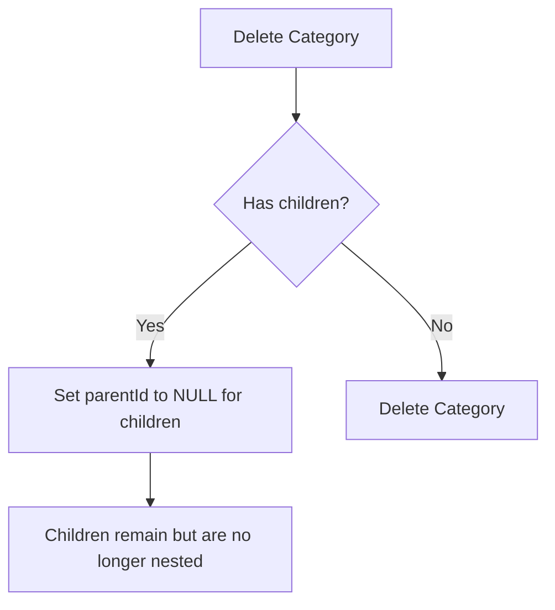

**Diagram sources**
- [migration.sql](file://packages/schema/prisma/migrations/20250807132908_/migration.sql#L621-L623)
- [migration.sql](file://packages/schema/prisma/migrations/20250807132908_/migration.sql#L669-L671)

For most other relationships, the ON DELETE action is RESTRICT, which prevents deletion of a parent entity if it has related children. This ensures data integrity by preventing orphaned records.

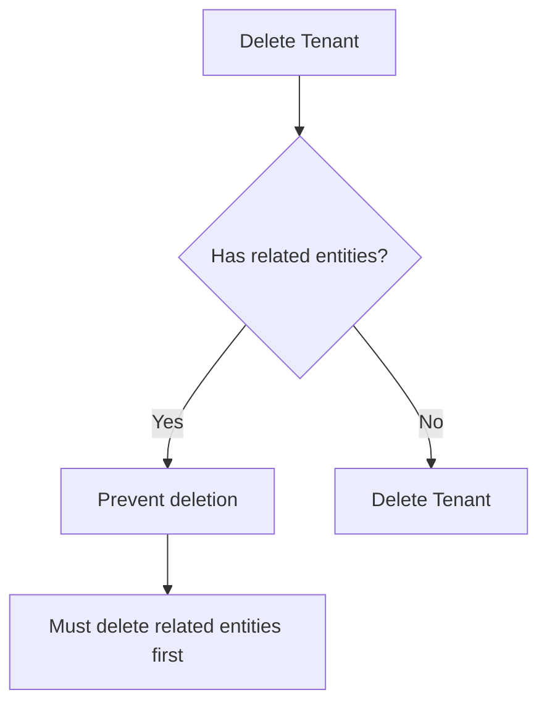

**Diagram sources**
- [migration.sql](file://packages/schema/prisma/migrations/20250807132908_/migration.sql#L624-L626)
- [migration.sql](file://packages/schema/prisma/migrations/20250807132908_/migration.sql#L627-L629)

The ON UPDATE action for all relationships is CASCADE, which means that when a primary key is updated, the foreign key references are automatically updated.

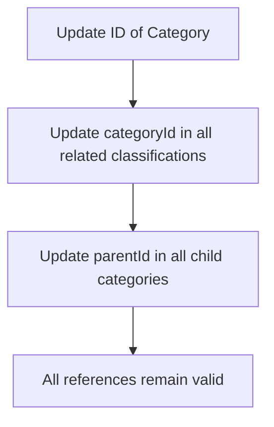

**Diagram sources**
- [migration.sql](file://packages/schema/prisma/migrations/20250807132908_/migration.sql#L621-L623)
- [migration.sql](file://packages/schema/prisma/migrations/20250807132908_/migration.sql#L624-L626)

This configuration ensures data consistency while allowing for flexible hierarchical structures in certain cases.

**Section sources**
- [migration.sql](file://packages/schema/prisma/migrations/20250807132908_/migration.sql#L621-L623)
- [migration.sql](file://packages/schema/prisma/migrations/20250807132908_/migration.sql#L624-L629)
- [migration.sql](file://packages/schema/prisma/migrations/20250807132908_/migration.sql#L669-L671)

## Querying Related Data
Querying related data in the prj-core schema follows Prisma's standard patterns for relation queries. The schema's design enables efficient querying of related entities through the generated Prisma Client.

To query a model with its related entities, use the `include` option:

```typescript
// Get a user with their profiles and tenant
const userWithProfiles = await prisma.user.findUnique({
  where: { id: 'user-id' },
  include: {
    profiles: true,
    tenants: true,
    classification: true,
    associations: true,
  },
});
```

For more complex queries, use the `select` option to specify exactly which fields to return:

```typescript
// Get a user with selected fields from related entities
const userWithSelected = await prisma.user.findUnique({
  where: { id: 'user-id' },
  select: {
    name: true,
    email: true,
    profiles: {
      select: {
        nickname: true,
        avatarFileId: true,
      },
    },
    tenants: {
      select: {
        role: {
          select: {
            name: true,
          },
        },
      },
    },
  },
});
```

When querying through join models, you can filter based on the join model's fields:

```typescript
// Get users in a specific group
const usersInGroup = await prisma.user.findMany({
  where: {
    associations: {
      some: {
        groupId: 'group-id',
      },
    },
  },
  include: {
    associations: {
      where: {
        groupId: 'group-id',
      },
    },
  },
});
```

You can also use nested filters to query based on related entity properties:

```typescript
// Get categories with their children and parent
const categoryHierarchy = await prisma.category.findMany({
  where: {
    tenantId: 'tenant-id',
  },
  include: {
    parent: true,
    children: true,
  },
});
```

The schema's indexing strategy supports efficient querying of related data, with indexes on foreign key fields and commonly queried combinations.

**Section sources**
- [core.prisma](file://packages/schema/prisma/schema/core.prisma#L1-L238)
- [user.prisma](file://packages/schema/prisma/schema/user.prisma#L1-L62)
- [role.prisma](file://packages/schema/prisma/schema/role.prisma#L1-L46)

## Performance Optimization
The prj-core schema includes several performance optimization strategies to ensure efficient querying and data access.

### Indexing Strategy
The schema defines indexes on commonly queried fields and foreign key relationships:

```sql
-- Indexes defined in migration
CREATE INDEX "Category_tenantId_idx" ON "Category"("tenantId");
CREATE INDEX "Timeline_tenantId_idx" ON "Timeline"("tenantId");
CREATE INDEX "Session_timelineId_idx" ON "Session"("timelineId");
CREATE INDEX "Program_sessionId_idx" ON "Program"("sessionId");
CREATE INDEX "Program_routineId_idx" ON "Program"("routineId");
CREATE INDEX "Activity_routineId_idx" ON "Activity"("routineId");
CREATE INDEX "Task_tenantId_idx" ON "Task"("tenantId");
```

These indexes support efficient filtering and joining operations, particularly for tenant-scoped queries which are common in the multi-tenant architecture.

### Relation Load Optimization
To optimize relation loading, consider the following patterns:

1. Use `include` only for relations that are actually needed
2. Use `select` to limit the fields returned from related entities
3. Use `distinct` when querying through many-to-many relationships to avoid duplicates

```typescript
// Efficient query - only load needed relations and fields
const optimizedQuery = await prisma.user.findMany({
  where: { tenantId: 'tenant-id' },
  select: {
    id: true,
    name: true,
    email: true,
    profiles: {
      select: {
        nickname: true,
      },
      take: 1, // Only get the first profile if only one is needed
    },
  },
});
```

### Batch Operations
For operations involving multiple related entities, use Prisma's transaction and batch operations:

```typescript
// Use transactions for multiple related operations
await prisma.$transaction([
  prisma.user.update({
    where: { id: 'user-id' },
    data: { name: 'new name' },
  }),
  prisma.profile.update({
    where: { userId: 'user-id' },
    data: { nickname: 'new nickname' },
  }),
]);
```

### Connection Management
The schema's design supports efficient connection management by:

1. Using explicit join models for many-to-many relationships, which allows for filtering and pagination
2. Implementing soft delete patterns with `removedAt` fields, which preserves referential integrity
3. Using UUIDs for primary keys, which enables distributed systems and reduces index fragmentation

These optimization strategies ensure that the schema performs well even with large datasets and complex queries.

**Section sources**
- [migration.sql](file://packages/schema/prisma/migrations/20250807132908_/migration.sql#L471-L475)
- [core.prisma](file://packages/schema/prisma/schema/core.prisma#L1-L238)
- [task.prisma](file://packages/schema/prisma/schema/task.prisma#L1-L163)