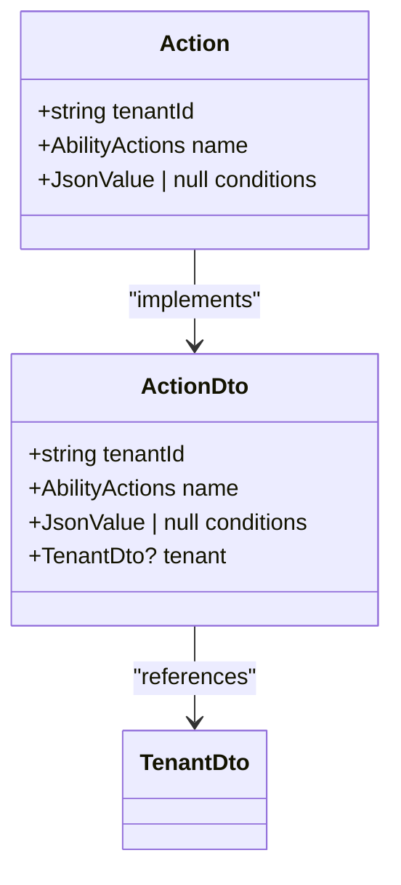
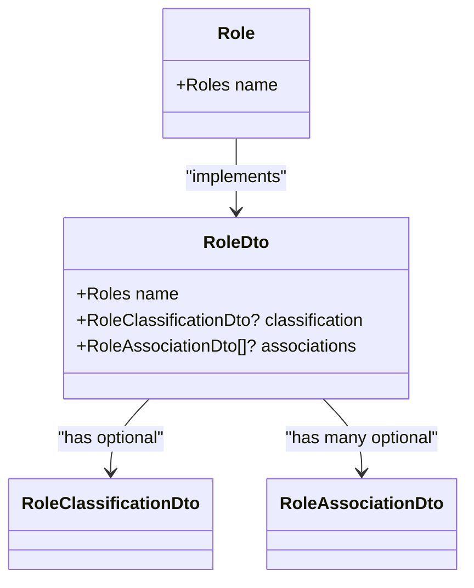
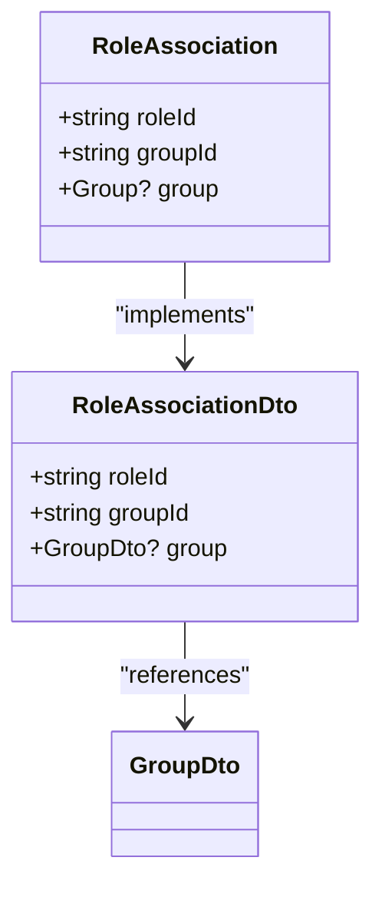
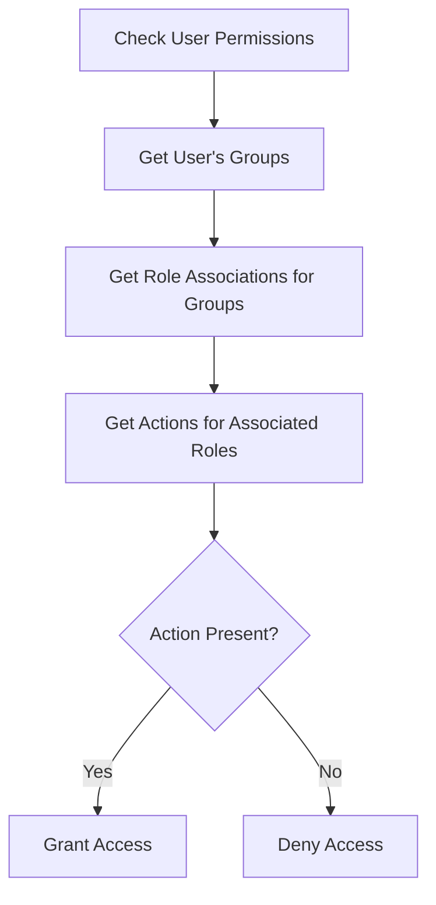
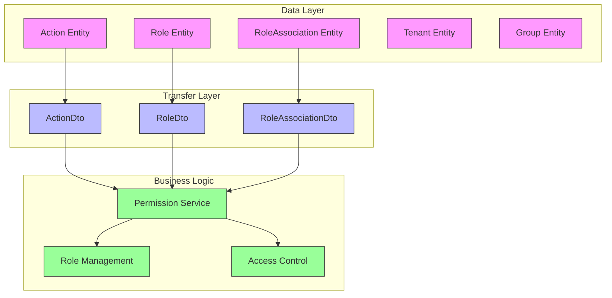

# Action Permission Model

<cite>
**Referenced Files in This Document**   
- [action.entity.ts](file://packages/schema/src/entity/action.entity.ts)
- [action.dto.ts](file://packages/schema/src/dto/action.dto.ts)
- [role.entity.ts](file://packages/schema/src/entity/role.entity.ts)
- [role-association.entity.ts](file://packages/schema/src/entity/role-association.entity.ts)
- [role.dto.ts](file://packages/schema/src/dto/role.dto.ts)
- [role-association.dto.ts](file://packages/schema/src/dto/role-association.dto.ts)
- [schema.prisma](file://packages/schema/prisma/schema.prisma)
</cite>

## Table of Contents
1. [Introduction](#introduction)
2. [Action Entity Schema](#action-entity-schema)
3. [Role Entity Structure](#role-entity-structure)
4. [Role-Action Relationship Model](#role-action-relationship-model)
5. [Data Validation and Constraints](#data-validation-and-constraints)
6. [Permission Query Patterns](#permission-query-patterns)
7. [Performance Optimization Strategies](#performance-optimization-strategies)
8. [Architecture Overview](#architecture-overview)

## Introduction
The action-based permission system in prj-core implements a flexible role-based access control (RBAC) model that enables fine-grained authorization through action identifiers, role definitions, and their mappings. This documentation details the data model that underpins the permission system, focusing on the Action entity, its relationship with Roles, and the mechanisms for permission evaluation. The system is designed to support multi-tenant applications with complex authorization requirements.

## Action Entity Schema

The Action entity represents discrete permissions within the system, defined by unique identifiers and optional conditional logic. Each action is associated with a specific tenant in the multi-tenant architecture.

**Diagram sources**
- [action.entity.ts](file://packages/schema/src/entity/action.entity.ts#L7-L12)
- [action.dto.ts](file://packages/schema/src/dto/action.dto.ts#L12-L24)

**Section sources**
- [action.entity.ts](file://packages/schema/src/entity/action.entity.ts#L1-L13)
- [action.dto.ts](file://packages/schema/src/dto/action.dto.ts#L1-L25)

### Action Properties
- **tenantId**: UUID string that establishes tenant context for the action (required)
- **name**: Enum value from AbilityActions that serves as the unique action identifier
- **conditions**: Optional JSON field that can store rule-based constraints for conditional permissions

The Action entity extends AbstractEntity and uses the @UseDto decorator to associate with its corresponding DTO, ensuring consistent data transfer object patterns across the application.

## Role Entity Structure

Roles represent collections of permissions that can be assigned to user groups. Each role has a predefined name from the Roles enum, establishing a standardized set of role types across the system.

**Diagram sources**
- [role.entity.ts](file://packages/schema/src/entity/role.entity.ts#L6-L9)
- [role.dto.ts](file://packages/schema/src/dto/role.dto.ts#L7-L16)

**Section sources**
- [role.entity.ts](file://packages/schema/src/entity/role.entity.ts#L1-L10)
- [role.dto.ts](file://packages/schema/src/dto/role.dto.ts#L1-L17)

### Role Properties
- **name**: Enum value from Roles that uniquely identifies the role type
- The RoleDto includes relationships to RoleClassificationDto (for role categorization) and RoleAssociationDto (for role-to-group mappings)

## Role-Action Relationship Model

The permission system connects roles and actions through role associations, which link roles to groups that may have specific action permissions. This creates a many-to-many relationship between roles and actions via group membership.

**Diagram sources**
- [role-association.entity.ts](file://packages/schema/src/entity/role-association.entity.ts#L7-L16)
- [role-association.dto.ts](file://packages/schema/src/dto/role-association.dto.ts#L5-L14)

**Section sources**
- [role-association.entity.ts](file://packages/schema/src/entity/role-association.entity.ts#L1-L17)
- [role-association.dto.ts](file://packages/schema/src/dto/role-association.dto.ts#L1-L15)

### Relationship Flow
1. Actions are defined with specific AbilityActions names and tenant context
2. Roles are created with predefined role types from the Roles enum
3. Role associations connect roles to groups (users, organizations, etc.)
4. Permission evaluation occurs by checking if a user's group has a role that grants the required action

This indirect relationship allows for flexible permission management where changing a role's associated actions automatically updates permissions for all users with that role.

## Data Validation and Constraints

The permission data model implements several validation rules and constraints to ensure data integrity and consistency.

### Field-Level Validation
- **tenantId**: Validated as UUID in both Action and RoleAssociation entities
- **name**: Constrained to enum values (AbilityActions for actions, Roles for roles)
- **conditions**: Optional JSON field with schema validation for structured rule definitions

### Referential Integrity
The Prisma schema enforces referential integrity through foreign key constraints:
- Action.tenantId references Tenant.id with appropriate relationship
- RoleAssociation.roleId references Role.id with cascade delete
- RoleAssociation.groupId references Group.id with cascade delete

### Unique Constraints
- Action entities must have unique combinations of tenantId and name within each tenant
- Role entities have unique name constraints within the system
- RoleAssociation entities ensure unique roleId + groupId pairs to prevent duplicate associations

These constraints prevent permission conflicts and ensure that each action assignment is explicitly defined.

## Permission Query Patterns

The system supports several query patterns for efficient permission checking and evaluation.

### Direct Permission Lookup

**Diagram sources**
- [role-association.entity.ts](file://packages/schema/src/entity/role-association.entity.ts#L12-L13)
- [action.entity.ts](file://packages/schema/src/entity/action.entity.ts#L9-L10)

### Batch Permission Evaluation
For scenarios requiring multiple permission checks, the system supports batch queries that retrieve all actions for a user's roles in a single database operation. This reduces round trips and improves performance for complex authorization scenarios.

### Conditional Permission Evaluation
When actions have conditions defined, the system evaluates these JSON-based rules during permission checks. The conditions field supports complex logic including:
- Resource ownership rules
- Time-based access restrictions
- Attribute-based conditions
- Contextual requirements

## Performance Optimization Strategies

The permission system incorporates several performance optimizations for frequent permission lookups.

### Caching Mechanisms
- **Role-Action Mapping Cache**: Stores pre-computed role-to-action mappings to avoid repeated database queries
- **User Permission Cache**: Caches the complete set of permissions for frequently accessed users
- **Tenant-Level Action Cache**: Maintains action definitions at the tenant level to reduce redundant lookups

### Database Indexing
Strategic database indexes are implemented on key fields:
- Composite index on Action(tenantId, name) for fast action lookups
- Index on RoleAssociation(roleId, groupId) for efficient role membership queries
- Index on Role(name) for quick role retrieval by type

### Query Optimization
- **Eager Loading**: Critical relationships are pre-loaded to minimize N+1 query problems
- **Batch Operations**: Multiple permission checks are consolidated into single queries when possible
- **Projection**: Queries retrieve only necessary fields rather than complete entities

### Scalability Considerations
The multi-tenant design ensures isolation between tenants while allowing shared infrastructure. The UUID-based identifiers and tenant scoping enable horizontal scaling across multiple database instances if needed.

## Architecture Overview

The action-based permission system follows a clean separation of concerns between data entities, transfer objects, and business logic.

**Diagram sources**
- [action.entity.ts](file://packages/schema/src/entity/action.entity.ts#L7-L12)
- [role.entity.ts](file://packages/schema/src/entity/role.entity.ts#L6-L9)
- [role-association.entity.ts](file://packages/schema/src/entity/role-association.entity.ts#L7-L16)
- [action.dto.ts](file://packages/schema/src/dto/action.dto.ts#L12-L24)
- [role.dto.ts](file://packages/schema/src/dto/role.dto.ts#L7-L16)
- [role-association.dto.ts](file://packages/schema/src/dto/role-association.dto.ts#L5-L14)

**Section sources**
- [action.entity.ts](file://packages/schema/src/entity/action.entity.ts#L1-L13)
- [role.entity.ts](file://packages/schema/src/entity/role.entity.ts#L1-L10)
- [role-association.entity.ts](file://packages/schema/src/entity/role-association.entity.ts#L1-L17)

The architecture enables extensible permission management with clear boundaries between data storage, data transfer, and authorization logic. This design supports both simple role-based access and complex, context-aware permission evaluation.