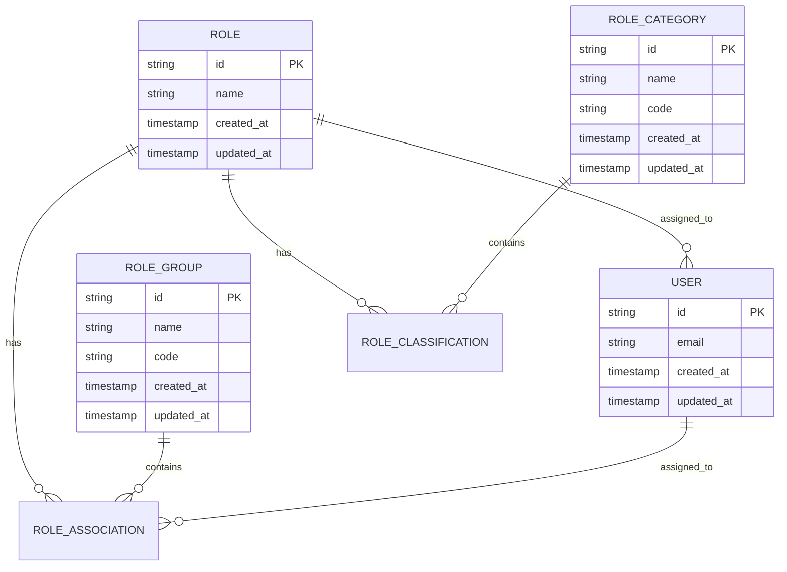
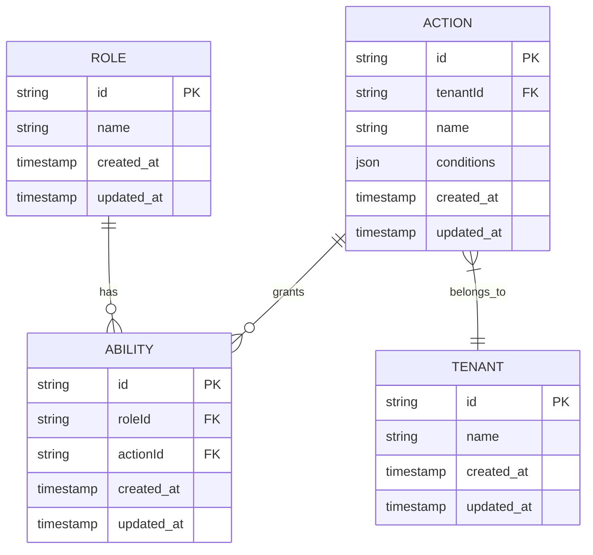
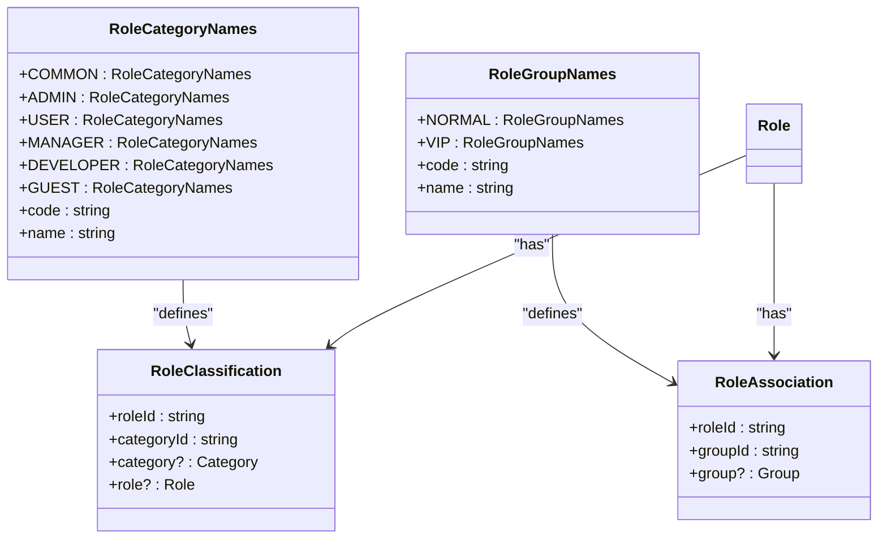
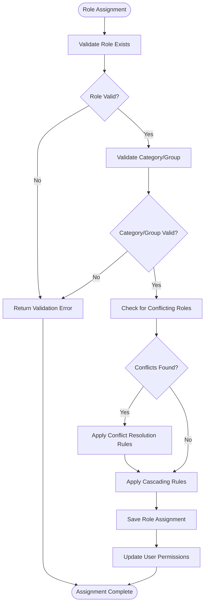
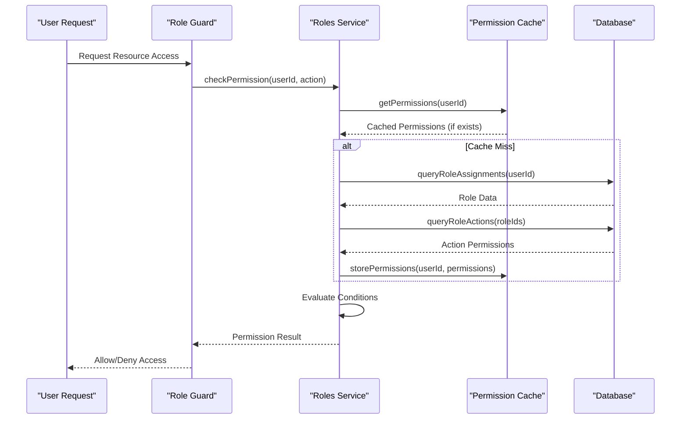
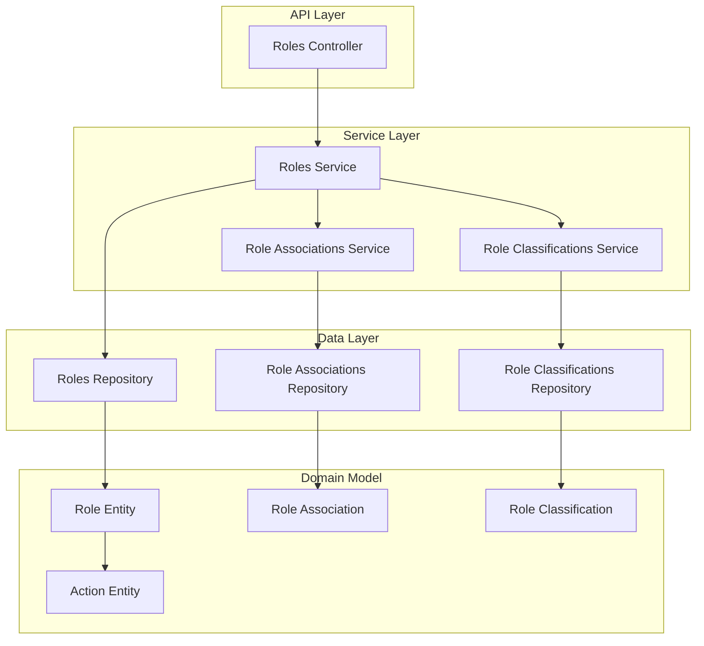

# Role & Permission Data Models

<cite>
**Referenced Files in This Document**   
- [role.entity.ts](file://packages/schema/src/entity/role.entity.ts)
- [action.entity.ts](file://packages/schema/src/entity/action.entity.ts)
- [role-association.entity.ts](file://packages/schema/src/entity/role-association.entity.ts)
- [role-classification.entity.ts](file://packages/schema/src/entity/role-classification.entity.ts)
- [role.dto.ts](file://packages/schema/src/dto/role.dto.ts)
- [action.dto.ts](file://packages/schema/src/dto/action.dto.ts)
- [role-association.dto.ts](file://packages/schema/src/dto/role-association.dto.ts)
- [role-classification.dto.ts](file://packages/schema/src/dto/role-classification.dto.ts)
- [role-category-names.enum.ts](file://packages/schema/src/enum/role-category-names.enum.ts)
- [role-group-names.enum.ts](file://packages/schema/src/enum/role-group-names.enum.ts)
- [role-type.constant.ts](file://packages/schema/src/constant/role-type.constant.ts)
- [roles.module.ts](file://apps/server/src/module/roles.module.ts)
- [role-associations.module.ts](file://apps/server/src/module/role-associations.module.ts)
- [role-classifications.module.ts](file://apps/server/src/module/role-classifications.module.ts)
</cite>

## Table of Contents
1. [Introduction](#introduction)
2. [Role Hierarchy and Classifications](#role-hierarchy-and-classifications)
3. [Action-Permission System](#action-permission-system)
4. [Fine-Grained Permissions Implementation](#fine-grained-permissions-implementation)
5. [Data Integrity and Validation](#data-integrity-and-validation)
6. [Query Patterns and Performance](#query-patterns-and-performance)
7. [Architecture Overview](#architecture-overview)

## Introduction
This document provides comprehensive documentation for the role-based access control (RBAC) system in prj-core. The system implements a sophisticated permission model that combines role hierarchies, role classifications, and fine-grained permissions through categories and groups. The documentation details the data models, relationships, and implementation strategies for managing user permissions and access control within the application.

## Role Hierarchy and Classifications

The role-based access control system in prj-core implements a hierarchical structure for managing user permissions. The core role entity serves as the foundation for the permission system, with roles being classified into categories and associated with user groups.

**Diagram sources**
- [role.entity.ts](file://packages/schema/src/entity/role.entity.ts#L1-L10)
- [role-classification.entity.ts](file://packages/schema/src/entity/role-classification.entity.ts#L1-L19)
- [role-association.entity.ts](file://packages/schema/src/entity/role-association.entity.ts#L1-L17)

**Section sources**
- [role.entity.ts](file://packages/schema/src/entity/role.entity.ts#L1-L10)
- [role.dto.ts](file://packages/schema/src/dto/role.dto.ts#L1-L17)
- [role-type.constant.ts](file://packages/schema/src/constant/role-type.constant.ts#L1-L5)

## Action-Permission System

The action-permission system in prj-core defines specific actions that can be performed within the application and maps these actions to roles. Each action represents a discrete operation that users may be permitted to execute, with optional conditions that further refine when the action is allowed.

**Diagram sources**
- [action.entity.ts](file://packages/schema/src/entity/action.entity.ts#L1-L13)
- [action.dto.ts](file://packages/schema/src/dto/action.dto.ts#L1-L25)

**Section sources**
- [action.entity.ts](file://packages/schema/src/entity/action.entity.ts#L1-L13)
- [action.dto.ts](file://packages/schema/src/dto/action.dto.ts#L1-L25)

## Fine-Grained Permissions Implementation

The system implements fine-grained permissions through role categories and groups, allowing for sophisticated permission management. Role categories provide a way to classify roles into logical groupings (such as ADMIN, USER, MANAGER, etc.), while role groups enable the creation of user segments with specific permission profiles.

**Diagram sources**
- [role-category-names.enum.ts](file://packages/schema/src/enum/role-category-names.enum.ts#L1-L27)
- [role-group-names.enum.ts](file://packages/schema/src/enum/role-group-names.enum.ts#L1-L23)
- [role-classification.entity.ts](file://packages/schema/src/entity/role-classification.entity.ts#L1-L19)
- [role-association.entity.ts](file://packages/schema/src/entity/role-association.entity.ts#L1-L17)

**Section sources**
- [role-category-names.enum.ts](file://packages/schema/src/enum/role-category-names.enum.ts#L1-L27)
- [role-group-names.enum.ts](file://packages/schema/src/enum/role-group-names.enum.ts#L1-L23)
- [role-classification.dto.ts](file://packages/schema/src/dto/role-classification.dto.ts#L1-L21)
- [role-association.dto.ts](file://packages/schema/src/dto/role-association.dto.ts#L1-L15)

## Data Integrity and Validation

The role-based access control system implements comprehensive data integrity constraints and validation rules to ensure the consistency and reliability of role assignments. These constraints include foreign key relationships, required field validations, and business rule enforcement.

**Diagram sources**
- [role.entity.ts](file://packages/schema/src/entity/role.entity.ts#L1-L10)
- [role-association.entity.ts](file://packages/schema/src/entity/role-association.entity.ts#L1-L17)
- [role-classification.entity.ts](file://packages/schema/src/entity/role-classification.entity.ts#L1-L19)

**Section sources**
- [role.entity.ts](file://packages/schema/src/entity/role.entity.ts#L1-L10)
- [role-association.entity.ts](file://packages/schema/src/entity/role-association.entity.ts#L1-L17)
- [role-classification.entity.ts](file://packages/schema/src/entity/role-classification.entity.ts#L1-L19)

## Query Patterns and Performance

The system implements optimized query patterns for efficient permission checking and role management. These patterns leverage database indexing, caching strategies, and pre-computed permission sets to ensure responsive performance even with complex permission hierarchies.

**Diagram sources**
- [roles.module.ts](file://apps/server/src/module/roles.module.ts#L1-L9)
- [role-associations.module.ts](file://apps/server/src/module/role-associations.module.ts)
- [role-classifications.module.ts](file://apps/server/src/module/role-classifications.module.ts)

**Section sources**
- [roles.module.ts](file://apps/server/src/module/roles.module.ts#L1-L9)
- [role-associations.module.ts](file://apps/server/src/module/role-associations.module.ts)
- [role-classifications.module.ts](file://apps/server/src/module/role-classifications.module.ts)

## Architecture Overview

The role-based access control system in prj-core follows a modular architecture with clear separation of concerns. The system is organized into distinct components that handle role management, permission evaluation, and access control enforcement.

**Diagram sources**
- [roles.module.ts](file://apps/server/src/module/roles.module.ts#L1-L9)
- [role-associations.module.ts](file://apps/server/src/module/role-associations.module.ts)
- [role-classifications.module.ts](file://apps/server/src/module/role-classifications.module.ts)
- [role.entity.ts](file://packages/schema/src/entity/role.entity.ts#L1-L10)

**Section sources**
- [roles.module.ts](file://apps/server/src/module/roles.module.ts#L1-L9)
- [role-associations.module.ts](file://apps/server/src/module/role-associations.module.ts)
- [role-classifications.module.ts](file://apps/server/src/module/role-classifications.module.ts)