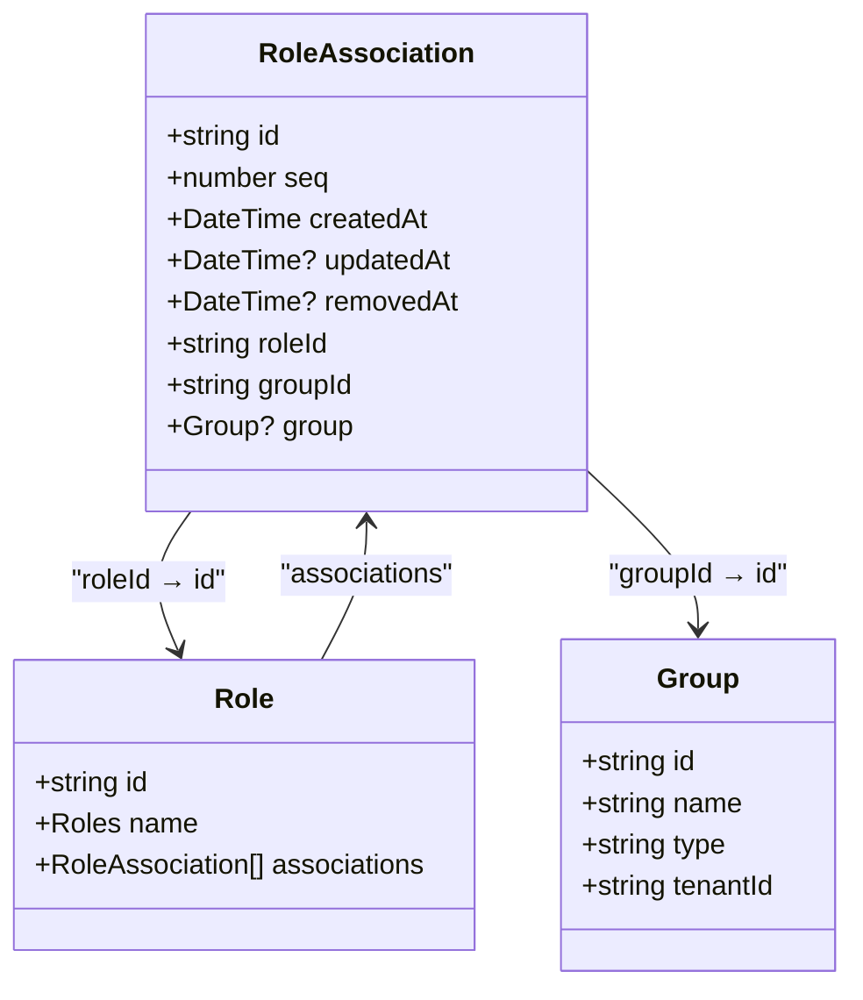
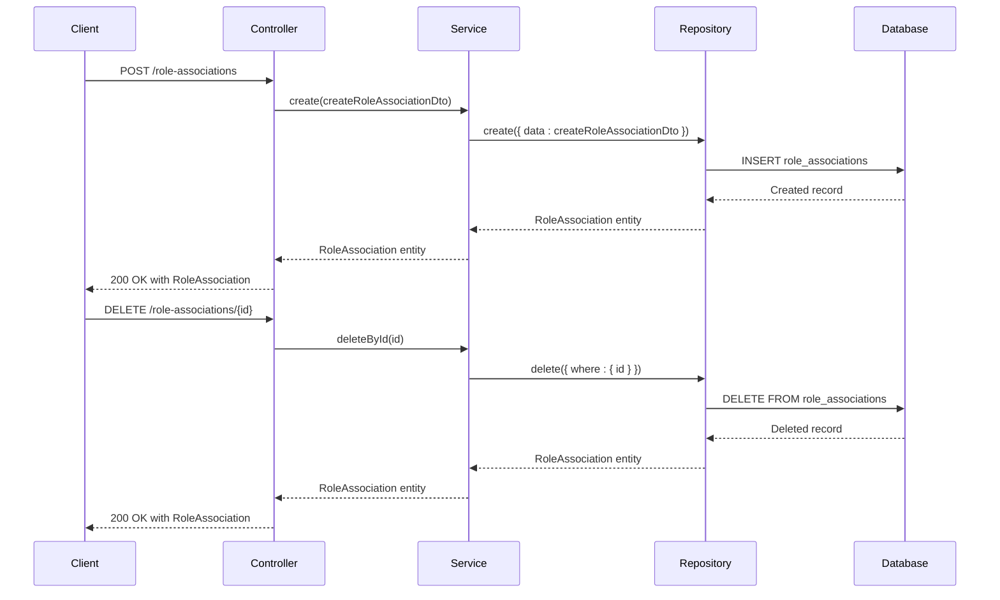
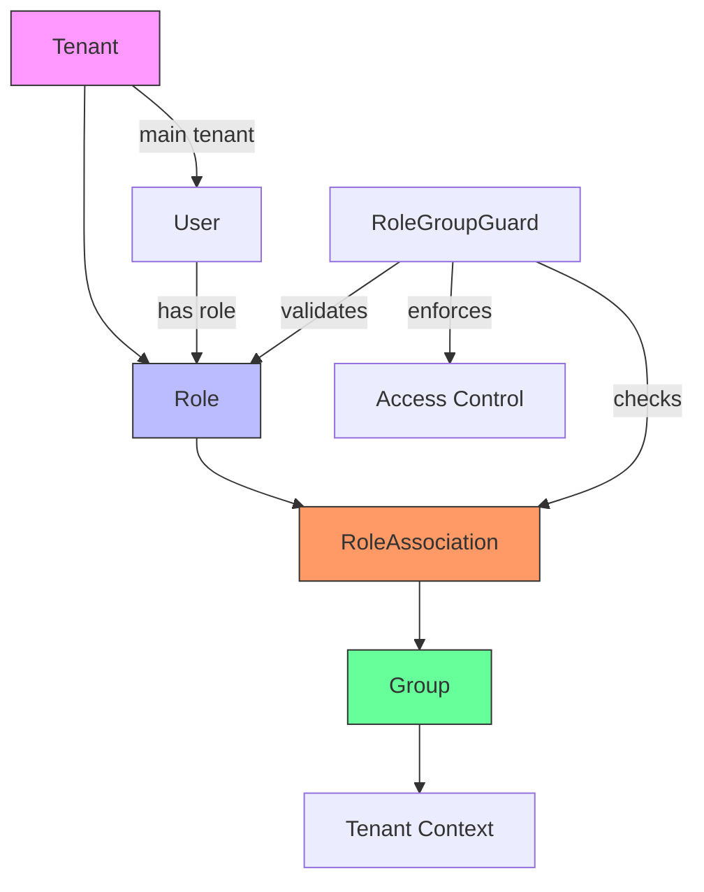
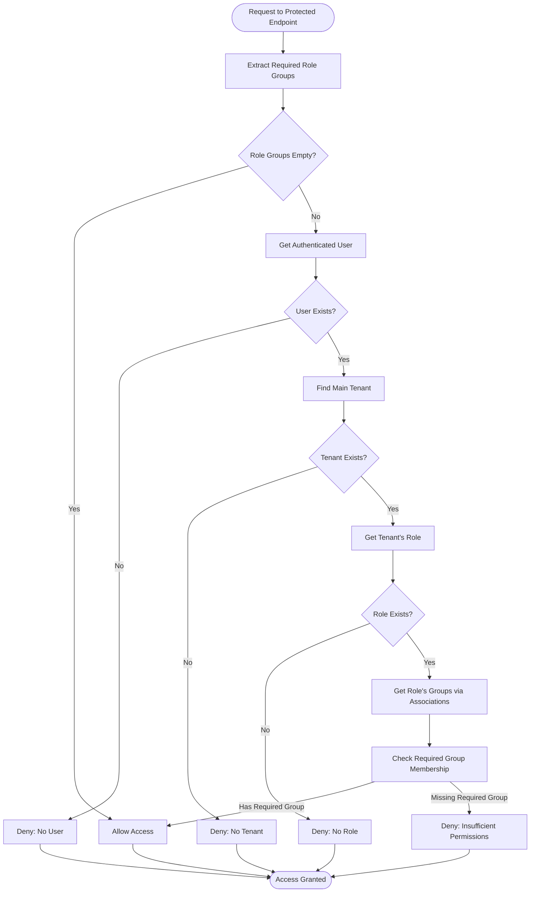

# Role Association Mechanism

<cite>
**Referenced Files in This Document**   
- [role-association.entity.ts](file://packages/schema/src/entity/role-association.entity.ts)
- [role-association.dto.ts](file://packages/schema/src/dto/role-association.dto.ts)
- [role.prisma](file://packages/schema/prisma/schema/role.prisma)
- [role-associations.service.ts](file://apps/server/src/shared/service/resources/role-associations.service.ts)
- [role-associations.controller.ts](file://apps/server/src/shared/controller/resources/role-associations.controller.ts)
- [role-associations.repository.ts](file://apps/server/src/shared/repository/role-associations.repository.ts)
- [role-associations.module.ts](file://apps/server/src/module/role-associations.module.ts)
- [role-group.guard.ts](file://apps/server/src/shared/guard/role-group.guard.ts)
- [seed.ts](file://packages/schema/prisma/seed.ts)
</cite>

## Table of Contents
1. [Introduction](#introduction)
2. [Role Association Entity Structure](#role-association-entity-structure)
3. [Composite Key and Constraints](#composite-key-and-constraints)
4. [Data Integrity Rules](#data-integrity-rules)
5. [Role Association Lifecycle](#role-association-lifecycle)
6. [Multi-tenancy and Tenant Context](#multi-tenancy-and-tenant-context)
7. [Role-based Access Control](#role-based-access-control)
8. [Common Issues and Solutions](#common-issues-and-solutions)
9. [Conclusion](#conclusion)

## Introduction

The role association mechanism in prj-core provides a flexible system for managing role-to-group mappings within a multi-tenant application architecture. This system enables fine-grained permission management by establishing relationships between roles and groups, which are then used for access control decisions. The implementation leverages Prisma ORM for database operations and follows NestJS patterns for service-oriented architecture.

The role association entity serves as a junction table that connects roles with groups, enabling a many-to-many relationship between these entities. This design allows roles to belong to multiple groups and groups to contain multiple roles, creating a flexible permission hierarchy that supports complex authorization scenarios.

**Section sources**
- [role-association.entity.ts](file://packages/schema/src/entity/role-association.entity.ts#L1-L16)
- [role-association.dto.ts](file://packages/schema/src/dto/role-association.dto.ts#L1-L14)

## Role Association Entity Structure

The role association mechanism is implemented through a dedicated entity that establishes relationships between roles and groups. The entity structure is defined in both TypeScript classes and Prisma schema, ensuring type safety and database consistency.

The `RoleAssociation` entity contains two primary foreign key fields: `roleId` and `groupId`, which reference the respective primary keys in the Role and Group tables. These fields form the foundation of the association mechanism, enabling the mapping of roles to specific groups.



**Diagram sources **
- [role-association.entity.ts](file://packages/schema/src/entity/role-association.entity.ts#L12-L13)
- [role.prisma](file://packages/schema/prisma/schema/role.prisma#L18-L27)

**Section sources**
- [role-association.entity.ts](file://packages/schema/src/entity/role-association.entity.ts#L1-L16)
- [role-association.dto.ts](file://packages/schema/src/dto/role-association.dto.ts#L1-L14)

## Composite Key and Constraints

The role association mechanism implements a composite unique constraint to ensure data integrity and prevent duplicate associations. Unlike traditional primary key approaches, the system uses a UUID primary key (`id`) while enforcing uniqueness on the combination of `groupId` and `roleId`.

This design choice provides several advantages:
- Maintains consistent UUID primary keys across all entities
- Enables flexible querying by either group or role
- Prevents duplicate role-group mappings
- Supports soft deletion through the `removedAt` field

The composite unique constraint is defined in the Prisma schema using the `@@unique([groupId, roleId])` directive, which creates a database-level constraint ensuring that no two role associations can have the same combination of group and role IDs.

```mermaid
erDiagram
ROLE-ASSOCIATION {
string id PK
int seq UK
datetime created_at
datetime? updated_at
datetime? removed_at
string role_id FK
string group_id FK
}
ROLE {
string id PK
Roles name UK
}
GROUP {
string id PK
string name
string type
string tenant_id FK
}
ROLE-ASSOCIATION ||--|{ ROLE : "roleId → id"
ROLE-ASSOCIATION ||--|{ GROUP : "groupId → id"
ROLE }o--|| ROLE-ASSOCIATION : "associations"
ROLE-ASSOCIATION {
Note "Composite unique constraint: [groupId, roleId]" as constraint1
}
```

**Diagram sources **
- [role.prisma](file://packages/schema/prisma/schema/role.prisma#L28)
- [role-association.entity.ts](file://packages/schema/src/entity/role-association.entity.ts#L12-L13)

**Section sources**
- [role.prisma](file://packages/schema/prisma/schema/role.prisma#L18-L28)
- [role-association.entity.ts](file://packages/schema/src/entity/role-association.entity.ts#L12-L13)

## Data Integrity Rules

The role association mechanism enforces several data integrity rules to maintain consistency and reliability within the system. These rules are implemented at multiple levels: database constraints, entity relationships, and application logic.

Database-level constraints ensure referential integrity through foreign key relationships. The `roleId` field references the `id` field in the Role table, while the `groupId` field references the `id` field in the Group table. These foreign key constraints prevent the creation of orphaned associations and maintain data consistency.

Application-level validation is implemented through the DTO (Data Transfer Object) pattern. The `RoleAssociationDto` class uses decorators to enforce field requirements and types:
- `@UUIDField()` ensures that both `roleId` and `groupId` contain valid UUIDs
- The `group` property is marked as optional with `required: false`
- The `group` property is excluded from Swagger documentation with `swagger: false`

The system also implements soft deletion through the `removedAt` field, which allows for logical deletion of role associations without permanently removing the data from the database. This approach supports audit trails and potential data recovery.

**Section sources**
- [role-association.dto.ts](file://packages/schema/src/dto/role-association.dto.ts#L6-L13)
- [role.prisma](file://packages/schema/prisma/schema/role.prisma#L23-L26)
- [role-associations.service.ts](file://apps/server/src/shared/service/resources/role-associations.service.ts#L46-L51)

## Role Association Lifecycle

The role association lifecycle is managed through a comprehensive set of CRUD operations exposed via the service, repository, and controller layers. The architecture follows the NestJS pattern of separation of concerns, with each layer responsible for specific aspects of the lifecycle management.

The creation process begins with the `createRoleAssociation` endpoint in the controller, which receives a `CreateRoleAssociationDto` containing the role and group IDs. The controller delegates to the service layer, which in turn uses the repository to persist the data to the database.



**Diagram sources **
- [role-associations.controller.ts](file://apps/server/src/shared/controller/resources/role-associations.controller.ts#L30-L39)
- [role-associations.service.ts](file://apps/server/src/shared/service/resources/role-associations.service.ts#L22-L26)
- [role-associations.repository.ts](file://apps/server/src/shared/repository/role-associations.repository.ts#L15-L21)

**Section sources**
- [role-associations.controller.ts](file://apps/server/src/shared/controller/resources/role-associations.controller.ts#L30-L96)
- [role-associations.service.ts](file://apps/server/src/shared/service/resources/role-associations.service.ts#L14-L51)
- [role-associations.repository.ts](file://apps/server/src/shared/repository/role-associations.repository.ts#L15-L52)

## Multi-tenancy and Tenant Context

The role association mechanism is designed to operate within a multi-tenant architecture, where multiple organizations or clients share the same application instance while maintaining data isolation. The tenant context is established through the hierarchical relationship between tenants, roles, and role associations.

In the system, tenants are associated with roles through the Tenant entity, which has a `roleId` field that references the Role entity. This creates a chain of relationships: Tenant → Role → RoleAssociation → Group. This hierarchy enables tenant-specific role configurations and group memberships.

The seed data initialization process demonstrates this multi-tenancy pattern by creating role groups within the context of a specific tenant (identified by `seq=1`). The `createRoleGroupsAndAssociations` function in the seed script first retrieves the tenant context before creating groups and establishing role associations.



**Diagram sources **
- [tenant.entity.ts](file://packages/schema/src/entity/tenant.entity.ts#L11-L17)
- [role-group.guard.ts](file://apps/server/src/shared/guard/role-group.guard.ts#L47-L53)
- [seed.ts](file://packages/schema/prisma/seed.ts#L462-L464)

**Section sources**
- [tenant.entity.ts](file://packages/schema/src/entity/tenant.entity.ts#L11-L17)
- [role-group.guard.ts](file://apps/server/src/shared/guard/role-group.guard.ts#L37-L45)
- [seed.ts](file://packages/schema/prisma/seed.ts#L458-L548)

## Role-based Access Control

The role association mechanism is integral to the application's role-based access control (RBAC) system. Role associations are used by guards to enforce authorization policies and determine user permissions.

The `RoleGroupGuard` is a key component that leverages role associations to validate user access. When a protected endpoint is accessed, the guard extracts the required role groups from the route metadata and compares them against the user's role associations. The guard navigates through the user's tenant context to access their role and associated groups.

The access control flow works as follows:
1. Extract required role groups from route metadata
2. Retrieve the authenticated user from the request context
3. Find the user's main tenant
4. Access the tenant's assigned role
5. Retrieve the role's associations to determine group membership
6. Compare required groups against user's groups
7. Grant or deny access based on membership



**Diagram sources **
- [role-group.guard.ts](file://apps/server/src/shared/guard/role-group.guard.ts#L15-L63)
- [role-association.entity.ts](file://packages/schema/src/entity/role-association.entity.ts#L15)
- [role.dto.ts](file://packages/schema/src/dto/role.dto.ts#L14)

**Section sources**
- [role-group.guard.ts](file://apps/server/src/shared/guard/role-group.guard.ts#L15-L63)
- [role.dto.ts](file://packages/schema/src/dto/role.dto.ts#L14-L15)

## Common Issues and Solutions

The role association mechanism addresses several common challenges in role-based access control systems, particularly in multi-tenant environments. These include race conditions, permission inheritance, and data consistency issues.

One potential race condition occurs during concurrent creation of role associations. The system mitigates this through the database-level unique constraint on the `[groupId, roleId]` combination, which prevents duplicate associations even under high concurrency. The application layer also implements proper error handling to manage constraint violations gracefully.

Permission inheritance is handled through the hierarchical relationship between roles, groups, and tenants. When a user is assigned to a tenant with a specific role, they inherit all permissions associated with that role's group memberships. This inheritance is enforced at runtime by the role guards, which evaluate the complete role-group mapping when making access decisions.

Data consistency is maintained through several mechanisms:
- Foreign key constraints ensure referential integrity
- Soft deletion preserves historical data
- Transactional operations prevent partial updates
- Validation at multiple layers (DTO, service, database)

The system also addresses the challenge of role assignment validation through the use of DTOs and service-layer validation. When creating a role association, the system validates that both the role and group exist before establishing the relationship, preventing orphaned references.

**Section sources**
- [role-associations.repository.ts](file://apps/server/src/shared/repository/role-associations.repository.ts#L15-L21)
- [role-associations.service.ts](file://apps/server/src/shared/service/resources/role-associations.service.ts#L22-L26)
- [role-group.guard.ts](file://apps/server/src/shared/guard/role-group.guard.ts#L47-L53)
- [seed.ts](file://packages/schema/prisma/seed.ts#L523-L536)

## Conclusion

The role association mechanism in prj-core provides a robust and flexible system for managing role-to-group mappings in a multi-tenant environment. By leveraging a junction table pattern with composite constraints, the system enables fine-grained access control while maintaining data integrity.

Key strengths of the implementation include:
- Clear separation of concerns between entity, DTO, service, and controller layers
- Comprehensive data integrity rules at both database and application levels
- Support for soft deletion and audit trails
- Integration with multi-tenancy through tenant context
- Role-based access control through guards that leverage role associations

The system demonstrates best practices in NestJS and Prisma usage, with proper type safety, validation, and error handling throughout the stack. The design allows for scalability and extensibility, making it suitable for complex authorization scenarios in enterprise applications.