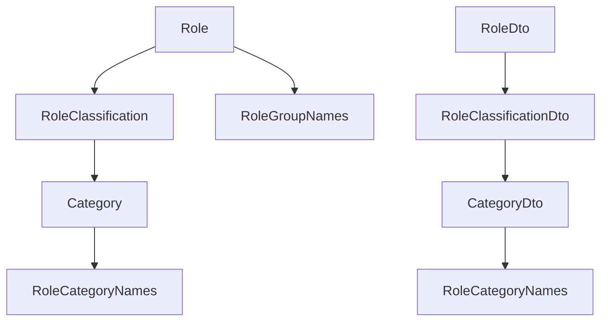
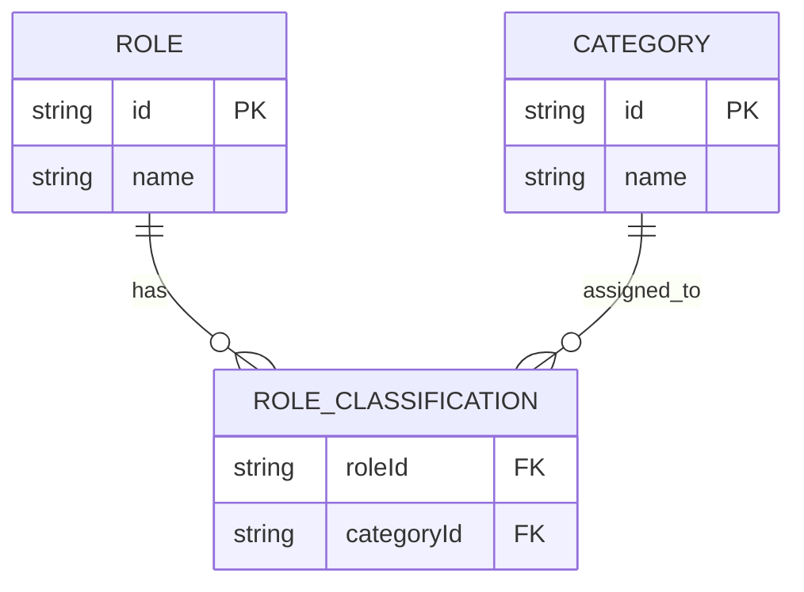
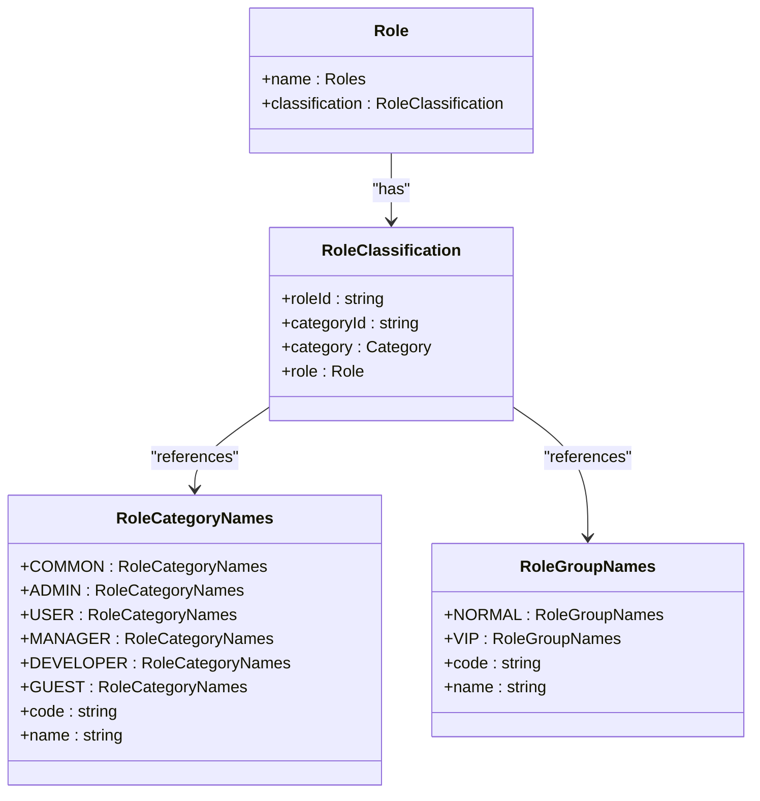

# Role Classification System

<cite>
**Referenced Files in This Document**   
- [role.entity.ts](file://packages/schema/src/entity/role.entity.ts)
- [role-classification.entity.ts](file://packages/schema/src/entity/role-classification.entity.ts)
- [role.dto.ts](file://packages/schema/src/dto/role.dto.ts)
- [role-classification.dto.ts](file://packages/schema/src/dto/role-classification.dto.ts)
- [role-category-names.enum.ts](file://packages/schema/src/enum/role-category-names.enum.ts)
- [role-group-names.enum.ts](file://packages/schema/src/enum/role-group-names.enum.ts)
- [role.prisma](file://packages/schema/prisma/schema/role.prisma)
- [core.prisma](file://packages/schema/prisma/schema/core.prisma)
</cite>

## Table of Contents
1. [Introduction](#introduction)
2. [Role Classification Architecture](#role-classification-architecture)
3. [Core Components](#core-components)
4. [Entity Relationships](#entity-relationships)
5. [Role Categorization Logic](#role-categorization-logic)
6. [Permission Resolution Impact](#permission-resolution-impact)
7. [Common Issues and Solutions](#common-issues-and-solutions)
8. [Conclusion](#conclusion)

## Introduction

The Role Classification System in prj-core provides a structured approach to organizing and managing user roles through hierarchical classification mechanisms. This system enables fine-grained access control by categorizing roles into meaningful groups and types, facilitating scalable permission management across the application ecosystem. The implementation leverages both role categories and role groups as complementary classification dimensions, allowing for flexible and maintainable role-based access control (RBAC).

**Section sources**
- [role-category-names.enum.ts](file://packages/schema/src/enum/role-category-names.enum.ts#L1-L27)
- [role-group-names.enum.ts](file://packages/schema/src/enum/role-group-names.enum.ts#L1-L23)

## Role Classification Architecture

The role classification system is built on a modular architecture that separates concerns between role definitions, classification metadata, and entity relationships. The system employs a decorator-based pattern for DTO (Data Transfer Object) mapping and leverages Prisma for database modeling. Two primary classification mechanisms are implemented: role categories for functional grouping and role groups for tier-based classification.

**Diagram sources**
- [role.entity.ts](file://packages/schema/src/entity/role.entity.ts#L1-L10)
- [role-classification.entity.ts](file://packages/schema/src/entity/role-classification.entity.ts#L1-L19)
- [role-category-names.enum.ts](file://packages/schema/src/enum/role-category-names.enum.ts#L1-L27)

**Section sources**
- [role.entity.ts](file://packages/schema/src/entity/role.entity.ts#L1-L10)
- [role-classification.entity.ts](file://packages/schema/src/entity/role-classification.entity.ts#L1-L19)

## Core Components

The role classification system comprises several core components that work together to define and enforce role hierarchies. The primary components include the Role entity, RoleClassification entity, associated DTOs, and enumeration types that define valid category and group values.

The Role entity serves as the foundation, representing individual roles within the system. Each role is associated with a classification through the RoleClassification entity, which establishes the relationship between roles and categories. The DTO layer provides serialization and validation capabilities, while the enum types ensure type safety and consistency across the codebase.

**Section sources**
- [role.entity.ts](file://packages/schema/src/entity/role.entity.ts#L1-L10)
- [role-classification.entity.ts](file://packages/schema/src/entity/role-classification.entity.ts#L1-L19)
- [role.dto.ts](file://packages/schema/src/dto/role.dto.ts#L1-L17)
- [role-classification.dto.ts](file://packages/schema/src/dto/role-classification.dto.ts#L1-L21)

## Entity Relationships

The role classification system implements a many-to-one relationship between roles and categories, allowing multiple roles to belong to the same category while maintaining referential integrity. The relationship is established through the RoleClassification entity, which acts as a junction table with foreign key references to both Role and Category entities.

**Diagram sources**
- [role.prisma](file://packages/schema/prisma/schema/role.prisma)
- [core.prisma](file://packages/schema/prisma/schema/core.prisma)
- [role-classification.entity.ts](file://packages/schema/src/entity/role-classification.entity.ts#L1-L19)

**Section sources**
- [role.prisma](file://packages/schema/prisma/schema/role.prisma)
- [core.prisma](file://packages/schema/prisma/schema/core.prisma)
- [role-classification.entity.ts](file://packages/schema/src/entity/role-classification.entity.ts#L1-L19)

## Role Categorization Logic

The role categorization system implements a comprehensive set of predefined categories and groups that serve as classification dimensions for roles. Role categories represent functional domains (e.g., ADMIN, USER, DEVELOPER), while role groups represent access tiers (e.g., NORMAL, VIP).

The RoleCategoryNames enum defines six primary role categories:
- COMMON: Shared roles across multiple contexts
- ADMIN: Administrative privileges and system management
- USER: Standard user capabilities
- MANAGER: Supervisory and team management functions
- DEVELOPER: Technical and development-related permissions
- GUEST: Limited access with minimal privileges

The RoleGroupNames enum defines two primary role groups:
- NORMAL: Standard access level
- VIP: Elevated privileges and enhanced capabilities

This dual classification system enables precise role definition by combining functional category with access tier, allowing for nuanced permission assignments based on both role type and privilege level.

**Diagram sources**
- [role-category-names.enum.ts](file://packages/schema/src/enum/role-category-names.enum.ts#L1-L27)
- [role-group-names.enum.ts](file://packages/schema/src/enum/role-group-names.enum.ts#L1-L23)
- [role.entity.ts](file://packages/schema/src/entity/role.entity.ts#L1-L10)

**Section sources**
- [role-category-names.enum.ts](file://packages/schema/src/enum/role-category-names.enum.ts#L1-L27)
- [role-group-names.enum.ts](file://packages/schema/src/enum/role-group-names.enum.ts#L1-L23)

## Permission Resolution Impact

The role classification system significantly impacts permission resolution by providing structured metadata that informs access control decisions. When evaluating permissions, the system can leverage both the role category and role group to determine appropriate access levels.

The classification hierarchy enables cascading permission inheritance, where roles within certain categories automatically inherit baseline permissions associated with that category. For example, all roles in the ADMIN category inherit administrative privileges, while roles in the DEVELOPER category inherit technical capabilities.

Additionally, the role group dimension allows for tier-based permission escalation. A VIP user role might have enhanced capabilities compared to a NORMAL user role within the same functional category. This dual-axis approach to permission resolution provides both breadth (through categories) and depth (through groups) in access control.

The system also supports dynamic permission evaluation by allowing runtime inspection of role classifications. This enables context-aware access decisions based on the specific combination of category and group, rather than relying solely on individual role names.

**Section sources**
- [role.dto.ts](file://packages/schema/src/dto/role.dto.ts#L1-L17)
- [role-classification.dto.ts](file://packages/schema/src/dto/role-classification.dto.ts#L1-L21)
- [role-category-names.enum.ts](file://packages/schema/src/enum/role-category-names.enum.ts#L1-L27)

## Common Issues and Solutions

Several common issues arise in role classification management, along with their corresponding solutions:

**Issue 1: Role Proliferation**
As systems grow, the number of roles can multiply uncontrollably, leading to management complexity.

*Solution*: Implement strict role categorization and reuse existing categories rather than creating new roles. Use role groups to differentiate access levels within categories instead of creating separate roles.

**Issue 2: Permission Overlap**
Multiple roles may have overlapping permissions, creating confusion and potential security risks.

*Solution*: Establish clear category boundaries and conduct regular permission audits. Use the classification system to identify and consolidate overlapping roles.

**Issue 3: Inconsistent Role Naming**
Without standardized naming conventions, role names can become inconsistent and confusing.

*Solution*: Enforce naming standards based on the role category and group. For example, use patterns like "{Category}_{Group}" (e.g., "ADMIN_VIP", "USER_NORMAL").

**Issue 4: Difficulty in Permission Auditing**
Tracking permissions across numerous roles can be challenging.

*Solution*: Leverage the classification system to group roles for auditing purposes. Generate reports by category and group to identify permission patterns and anomalies.

**Issue 5: Migration Challenges**
Updating role classifications across existing user bases can be complex.

*Solution*: Implement backward-compatible classification changes and provide migration tools that can update role assignments based on category and group rules.

These solutions are implemented through the structured approach provided by the role classification system, which enforces consistency and provides the metadata needed for effective role management.

**Section sources**
- [role.entity.ts](file://packages/schema/src/entity/role.entity.ts#L1-L10)
- [role-classification.entity.ts](file://packages/schema/src/entity/role-classification.entity.ts#L1-L19)
- [role-category-names.enum.ts](file://packages/schema/src/enum/role-category-names.enum.ts#L1-L27)

## Conclusion

The Role Classification System in prj-core provides a robust framework for organizing and managing user roles through a dual classification mechanism of categories and groups. This approach enables fine-grained access control while maintaining scalability and manageability. By leveraging well-defined entity relationships, type-safe enumerations, and a clear architectural pattern, the system ensures consistent role management across the application ecosystem. The implementation supports both functional categorization and tier-based grouping, allowing for nuanced permission resolution that can adapt to evolving business requirements.