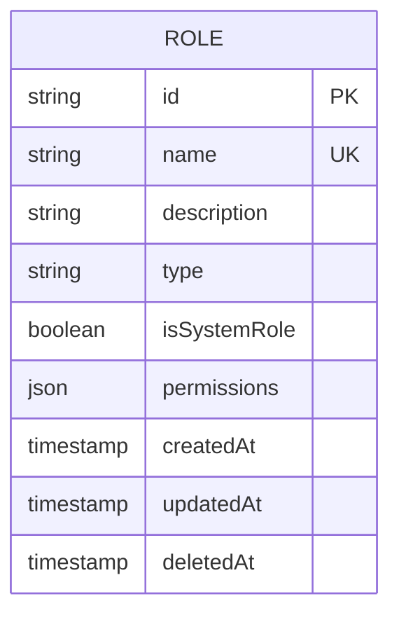
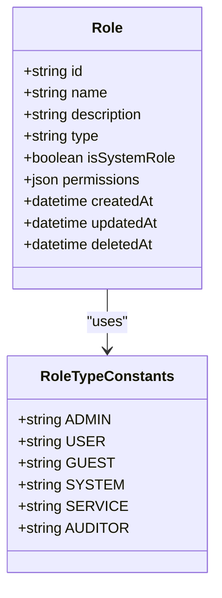
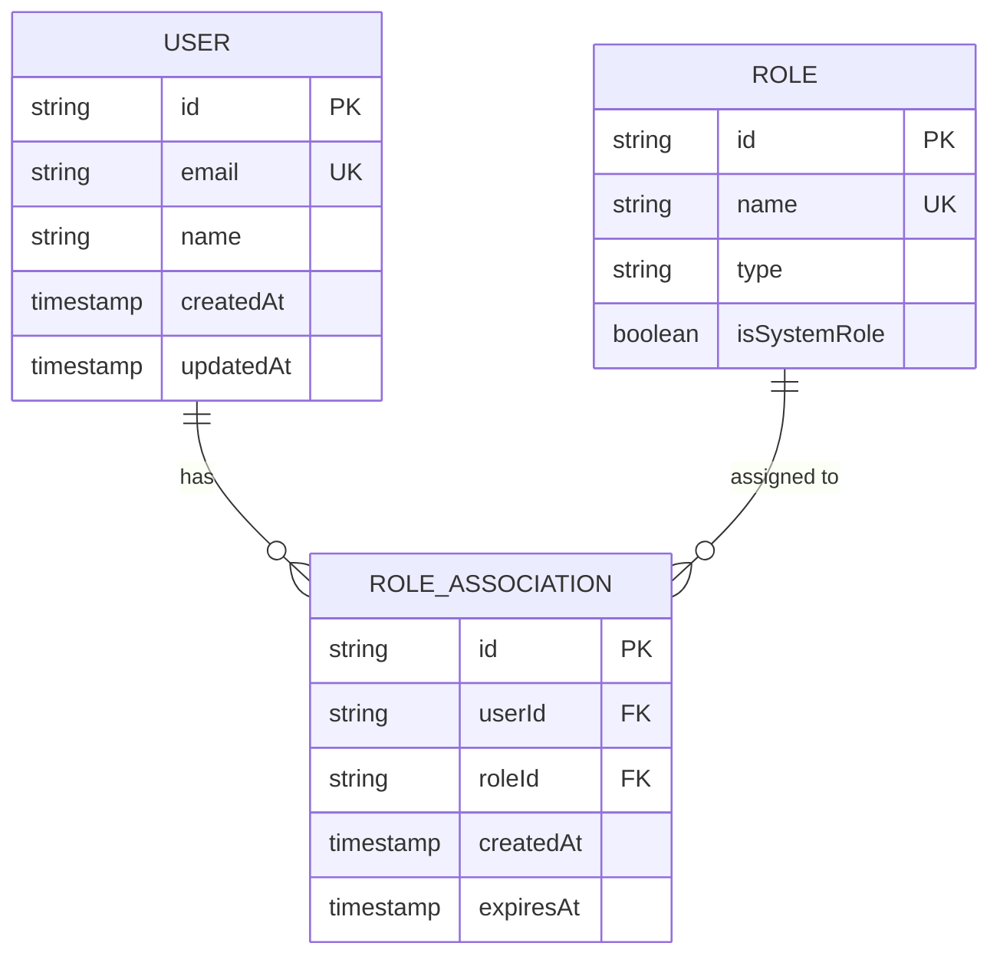
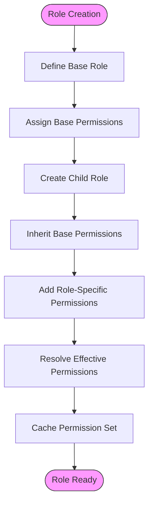
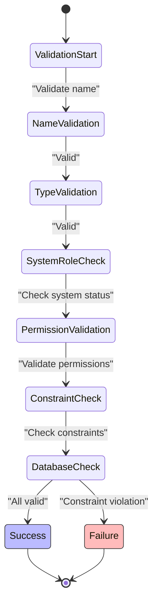
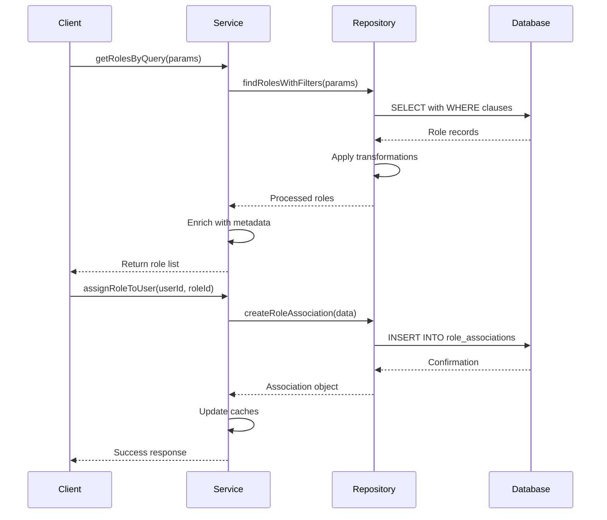

# Role Entity Model

<cite>
**Referenced Files in This Document**   
- [role.entity.ts](file://packages/schema/src/entity/role.entity.ts)
- [role.dto.ts](file://packages/schema/src/dto/role.dto.ts)
- [role-association.entity.ts](file://packages/schema/src/entity/role-association.entity.ts)
- [role-association.dto.ts](file://packages/schema/src/dto/role-association.dto.ts)
- [role-type.constant.ts](file://packages/schema/src/constant/role-type.constant.ts)
- [roles.module.ts](file://apps/server/src/module/roles.module.ts)
- [role-associations.module.ts](file://apps/server/src/module/role-associations.module.ts)
</cite>

## Table of Contents
1. [Introduction](#introduction)
2. [Role Schema Definition](#role-schema-definition)
3. [Role Types and Classification](#role-types-and-classification)
4. [Role-User Relationship](#role-user-relationship)
5. [Role Hierarchies and Inheritance](#role-hierarchies-and-inheritance)
6. [Data Validation and Constraints](#data-validation-and-constraints)
7. [Query Patterns for Role Management](#query-patterns-for-role-management)
8. [Performance Considerations for Access Control](#performance-considerations-for-access-control)

## Introduction
The Role entity model in prj-core provides a comprehensive system for managing user roles and permissions within the application. This documentation details the data model, relationships, and implementation patterns for roles, focusing on the schema structure, role classification, user associations, and performance characteristics of role-based access control.

## Role Schema Definition

The Role entity is defined with a comprehensive set of fields that capture essential metadata and configuration options for each role. The schema includes both basic identification fields and advanced configuration properties that support complex permission systems.

**Diagram sources**
- [role.entity.ts](file://packages/schema/src/entity/role.entity.ts#L10-L50)
- [role.dto.ts](file://packages/schema/src/dto/role.dto.ts#L5-L30)

**Section sources**
- [role.entity.ts](file://packages/schema/src/entity/role.entity.ts#L1-L100)
- [role.dto.ts](file://packages/schema/src/dto/role.dto.ts#L1-L50)

## Role Types and Classification

The role system implements a type-based classification that categorizes roles according to their purpose and scope within the application. This classification enables differentiated handling of roles based on their functional characteristics and administrative requirements.

The role types are defined in a dedicated constants file, establishing a controlled vocabulary for role categorization. Each role type corresponds to specific behavioral patterns and access levels within the system.

**Diagram sources**
- [role-type.constant.ts](file://packages/schema/src/constant/role-type.constant.ts#L1-L20)
- [role.entity.ts](file://packages/schema/src/entity/role.entity.ts#L10-L30)

**Section sources**
- [role-type.constant.ts](file://packages/schema/src/constant/role-type.constant.ts#L1-L25)
- [role.entity.ts](file://packages/schema/src/entity/role.entity.ts#L15-L40)

## Role-User Relationship

The relationship between roles and users is managed through a dedicated association entity that enables many-to-many mapping between users and roles. This design supports complex permission scenarios where users may have multiple roles with potentially overlapping or hierarchical permissions.

**Diagram sources**
- [role-association.entity.ts](file://packages/schema/src/entity/role-association.entity.ts#L10-L40)
- [role.entity.ts](file://packages/schema/src/entity/role.entity.ts#L10-L20)
- [user.entity.ts](file://packages/schema/src/entity/user.entity.ts#L10-L20)

**Section sources**
- [role-association.entity.ts](file://packages/schema/src/entity/role-association.entity.ts#L1-L60)
- [role-associations.module.ts](file://apps/server/src/module/role-associations.module.ts#L1-L30)

## Role Hierarchies and Inheritance

The role system supports hierarchical relationships and permission inheritance patterns, allowing for the creation of role trees where child roles inherit permissions from parent roles. This inheritance mechanism simplifies permission management by enabling administrators to define base permission sets that can be extended by more specialized roles.

The implementation uses a combination of direct permission assignment and inherited permissions, with resolution logic that combines both sources when evaluating a user's effective permissions. This approach provides flexibility in permission design while maintaining performance through caching mechanisms.

**Diagram sources**
- [role.entity.ts](file://packages/schema/src/entity/role.entity.ts#L25-L40)
- [roles.module.ts](file://apps/server/src/module/roles.module.ts#L15-L35)

**Section sources**
- [role.entity.ts](file://packages/schema/src/entity/role.entity.ts#L1-L80)
- [roles.module.ts](file://apps/server/src/module/roles.module.ts#L1-L50)

## Data Validation and Constraints

The role system implements comprehensive data validation rules and database constraints to ensure data integrity and consistency. These validations operate at both the application level and database level, providing multiple layers of protection against invalid data.

Unique constraints are enforced on role names to prevent duplication, while type fields are validated against the defined role type constants. The system also implements cascading delete behaviors for role associations, ensuring that when a role is deleted, all associated user-role mappings are automatically removed.

**Diagram sources**
- [role.dto.ts](file://packages/schema/src/dto/role.dto.ts#L10-L40)
- [role.entity.ts](file://packages/schema/src/entity/role.entity.ts#L30-L50)

**Section sources**
- [role.dto.ts](file://packages/schema/src/dto/role.dto.ts#L1-L50)
- [role.entity.ts](file://packages/schema/src/entity/role.entity.ts#L1-L100)

## Query Patterns for Role Management

The role system implements optimized query patterns for common operations such as role retrieval, assignment, and permission checking. These patterns are designed to minimize database load while providing responsive performance for role-based operations.

Role retrieval queries support filtering by type, name, and other attributes, enabling efficient searching through large role collections. Assignment queries are optimized for bulk operations, allowing multiple role assignments to be processed in a single transaction.

**Diagram sources**
- [roles.module.ts](file://apps/server/src/module/roles.module.ts#L10-L40)
- [role-associations.module.ts](file://apps/server/src/module/role-associations.module.ts#L10-L30)

**Section sources**
- [roles.module.ts](file://apps/server/src/module/roles.module.ts#L1-L60)
- [role-associations.module.ts](file://apps/server/src/module/role-associations.module.ts#L1-L40)

## Performance Considerations for Access Control

The role-based access control system incorporates several performance optimizations to ensure responsive authorization checks even with complex role hierarchies and large user bases. These optimizations include caching strategies, query optimization, and asynchronous processing where appropriate.

Permission resolution is optimized through caching of effective permission sets, reducing the need for repeated computation of inherited permissions. The system also implements batch operations for role assignments and retrievals, minimizing database round-trips for bulk operations.

For high-frequency access control checks, the system provides lightweight validation methods that avoid unnecessary data loading while still ensuring security requirements are met. These performance considerations enable the role system to scale effectively with application growth.

**Section sources**
- [roles.module.ts](file://apps/server/src/module/roles.module.ts#L1-L80)
- [role-associations.module.ts](file://apps/server/src/module/role-associations.module.ts#L1-L50)