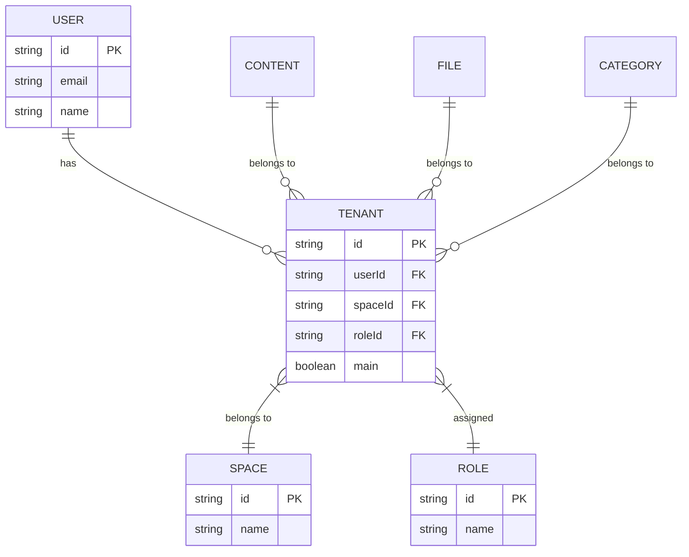
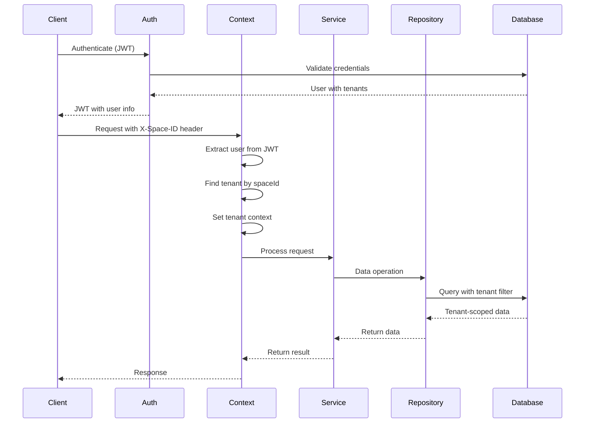
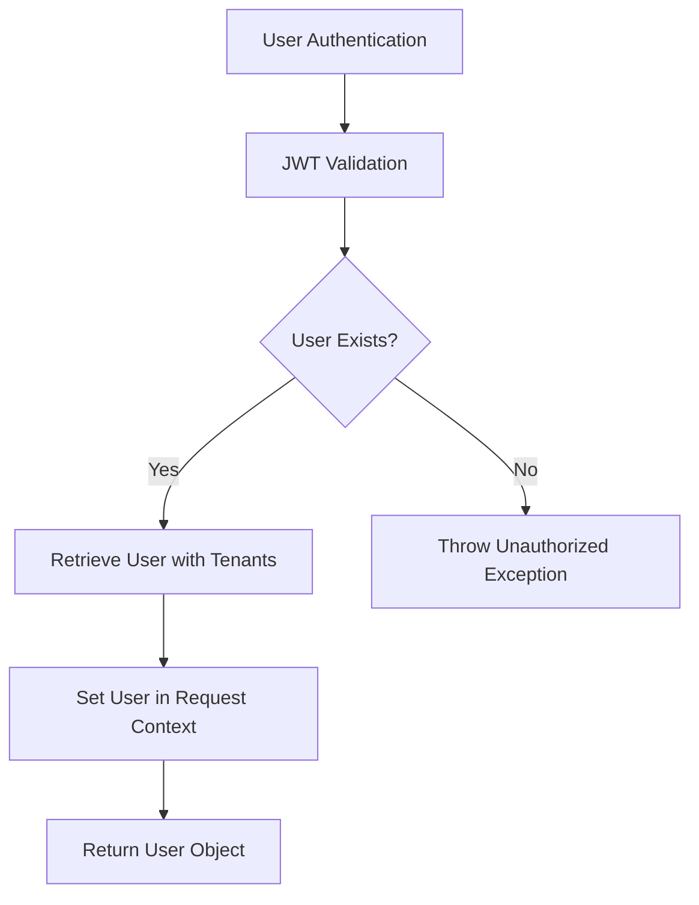
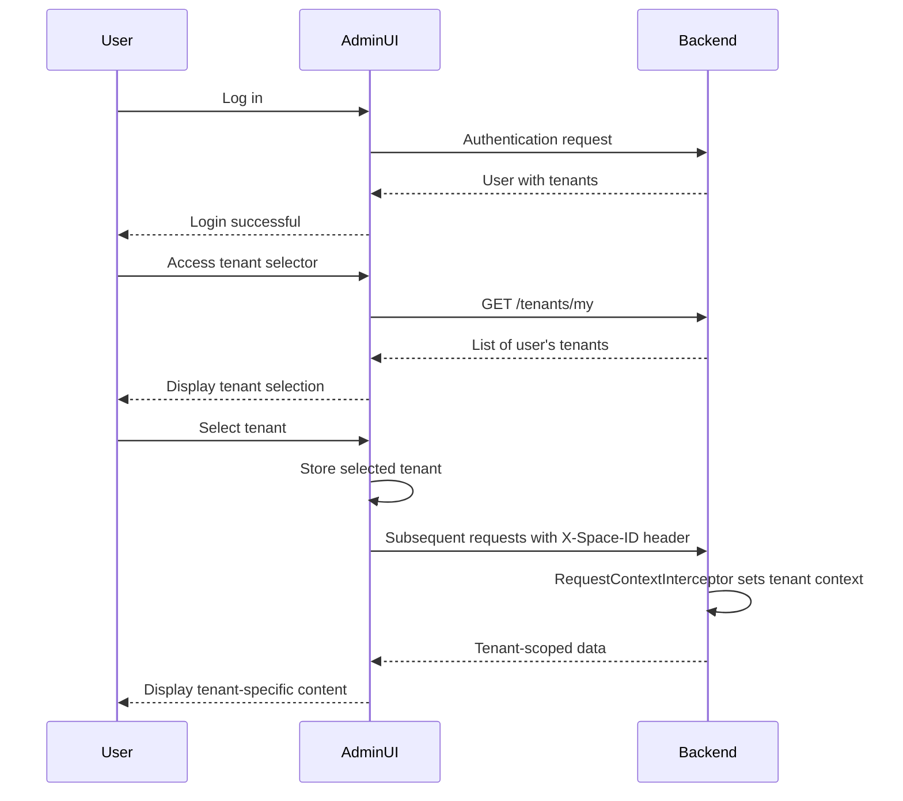

# Multi-Tenancy Architecture

<cite>
**Referenced Files in This Document**   
- [tenant.entity.ts](file://packages/schema/src/entity/tenant.entity.ts)
- [tenants.service.ts](file://apps/server/src/shared/service/resources/tenants.service.ts)
- [tenants.repository.ts](file://apps/server/src/shared/repository/tenants.repository.ts)
- [request-context.interceptor.ts](file://apps/server/src/shared/interceptor/request-context.interceptor.ts)
- [context.service.ts](file://apps/server/src/shared/service/utils/context.service.ts)
- [core.prisma](file://packages/schema/prisma/schema/core.prisma)
- [useAdminTenantSelectRoute.ts](file://apps/admin/src/hooks/useAdminTenantSelectRoute.ts)
- [tenant-select.tsx](file://apps/admin/src/routes/admin/auth/login/tenant-select.tsx)
- [select-tenant.dto.ts](file://packages/schema/src/dto/select-tenant.dto.ts)
</cite>

## Table of Contents
1. [Introduction](#introduction)
2. [Multi-Tenancy Design Approach](#multi-tenancy-design-approach)
3. [Data Isolation Mechanisms](#data-isolation-mechanisms)
4. [Tenant Context Establishment and Propagation](#tenant-context-establishment-and-propagation)
5. [Tenant Switching in Admin Interface](#tenant-switching-in-admin-interface)
6. [Cross-Tenant Data Access Patterns](#cross-tenant-data-access-patterns)
7. [Performance Considerations and Scalability](#performance-considerations-and-scalability)

## Introduction
The prj-core application implements a multi-tenancy architecture that enables multiple independent organizations (tenants) to share the same application instance while maintaining strict data isolation. This document details the architectural approach, data isolation mechanisms, tenant context management, and scalability considerations for the multi-tenancy implementation.

**Section sources**
- [tenant.entity.ts](file://packages/schema/src/entity/tenant.entity.ts)
- [core.prisma](file://packages/schema/prisma/schema/core.prisma)

## Multi-Tenancy Design Approach
The prj-core application implements a row-level isolation approach for multi-tenancy, where all tenant-specific data is stored in a single database with tenant discrimination achieved through a tenantId field in relevant database tables. This design choice balances data isolation requirements with operational efficiency and cost-effectiveness.

The Tenant entity serves as the central component of the multi-tenancy model, establishing relationships with users, spaces, and roles. Each tenant is associated with a specific space through the spaceId field, and users can belong to multiple tenants, with their access rights determined by the role assigned within each tenant context.

This row-level isolation approach was selected over database-per-tenant or schema-per-tenant models for several reasons:
- **Operational Simplicity**: Managing a single database instance reduces operational overhead compared to maintaining separate databases for each tenant.
- **Cost Efficiency**: Shared infrastructure reduces hardware and licensing costs.
- **Easier Updates**: Schema changes and application updates can be deployed uniformly across all tenants.
- **Cross-Tenant Analytics**: Enables reporting and analytics across multiple tenants when authorized.

The design supports both single-tenant and multi-tenant user scenarios, where users can belong to multiple tenants and switch between them within the application interface.

**Diagram sources **
- [core.prisma](file://packages/schema/prisma/schema/core.prisma)
- [tenant.entity.ts](file://packages/schema/src/entity/tenant.entity.ts)

**Section sources**
- [core.prisma](file://packages/schema/prisma/schema/core.prisma)
- [tenant.entity.ts](file://packages/schema/src/entity/tenant.entity.ts)

## Data Isolation Mechanisms
The prj-core application implements data isolation at both the database and application layers to ensure tenant data remains segregated and secure.

### Database Layer Isolation
At the database layer, data isolation is achieved through the inclusion of a tenantId field in all tenant-specific tables. This field serves as a foreign key to the Tenant table, establishing the ownership relationship between data records and their respective tenants. The Prisma schema defines this relationship explicitly, with the @map("tenant_id") directive ensuring proper column mapping.

Key tables that include tenant isolation include:
- Content: Contains tenantId field to associate content with specific tenants
- File: Includes tenantId to ensure files are isolated by tenant
- Category: Has tenantId to maintain category separation between tenants
- Action: Uses tenantId to scope actions to specific tenants
- Subject: Contains tenantId to isolate subjects by tenant

The database design ensures referential integrity through foreign key constraints, preventing orphaned records and maintaining data consistency across tenant boundaries.

### Application Layer Isolation
At the application layer, data isolation is enforced through a combination of context management, repository patterns, and query filtering. The ContextService maintains the current tenant context throughout the request lifecycle, ensuring that all data access operations are scoped to the appropriate tenant.

The TenantsService and associated repository implement tenant-aware queries that automatically filter results based on the current tenant context. When retrieving data, the service layer ensures that queries include appropriate WHERE clauses to limit results to the current tenant's data.

Security enforcement occurs through guards and interceptors that validate tenant access rights before allowing data operations. The RoleGroupGuard, for example, ensures that users have appropriate role-based permissions within their current tenant context before allowing access to protected resources.

**Diagram sources **
- [request-context.interceptor.ts](file://apps/server/src/shared/interceptor/request-context.interceptor.ts)
- [context.service.ts](file://apps/server/src/shared/service/utils/context.service.ts)
- [tenants.service.ts](file://apps/server/src/shared/service/resources/tenants.service.ts)
- [tenants.repository.ts](file://apps/server/src/shared/repository/tenants.repository.ts)

**Section sources**
- [core.prisma](file://packages/schema/prisma/schema/core.prisma)
- [tenants.service.ts](file://apps/server/src/shared/service/resources/tenants.service.ts)
- [tenants.repository.ts](file://apps/server/src/shared/repository/tenants.repository.ts)
- [request-context.interceptor.ts](file://apps/server/src/shared/interceptor/request-context.interceptor.ts)

## Tenant Context Establishment and Propagation
The prj-core application establishes and propagates tenant context through a well-defined process that begins at authentication and continues throughout the request lifecycle.

### Authentication and Context Initialization
During authentication, the JWT strategy validates user credentials and retrieves the user's information, including their associated tenants. The validate method in the JWT strategy returns the complete user object with tenant information, which becomes available in subsequent requests.

**Diagram sources **
- [jwt.strategy.ts](file://apps/server/src/shared/strategy/jwt.strategy.ts)

### Request Context Interception
The RequestContextInterceptor plays a crucial role in establishing tenant context for each request. This interceptor executes early in the request lifecycle and performs the following steps:

1. Extracts the authenticated user from the request object
2. Checks for the X-Space-ID header in the request
3. Finds the appropriate tenant by matching the spaceId from the header with the user's tenants
4. Sets the tenant context in the ContextService

The interceptor handles various edge cases:
- When no X-Space-ID header is present, the tenant context is set to undefined
- When the user doesn't have access to the requested spaceId, the tenant context is set to undefined
- When the user has no tenants, the tenant context is set to undefined

This approach ensures that requests without proper tenant context are processed safely, with appropriate authorization checks preventing unauthorized access.

### Context Propagation
Once established, the tenant context is propagated throughout the application via the ContextService, which uses cls-hooked (Continuation Local Storage) to maintain context across asynchronous operations. This ensures that the tenant context remains available to all components involved in processing the request, regardless of the call stack or asynchronous boundaries.

The ContextService provides methods to access various aspects of the context:
- getAuthUser(): Retrieves the authenticated user
- getAuthUserId(): Gets the user ID
- getTenant(): Returns the current tenant object
- getTenantId(): Retrieves the tenant ID
- getSpaceId(): Gets the space ID associated with the current tenant

This context propagation mechanism enables services and repositories to automatically scope their operations to the current tenant without requiring explicit tenant parameters in method calls.

**Section sources**
- [request-context.interceptor.ts](file://apps/server/src/shared/interceptor/request-context.interceptor.ts)
- [context.service.ts](file://apps/server/src/shared/service/utils/context.service.ts)
- [jwt.strategy.ts](file://apps/server/src/shared/strategy/jwt.strategy.ts)

## Tenant Switching in Admin Interface
The admin interface provides a tenant switching mechanism that allows users with access to multiple tenants to seamlessly switch between them.

### Frontend Implementation
The tenant switching functionality is implemented in the admin application through dedicated routes and components:

- The `useAdminTenantSelectRoute` hook manages the state and handlers for the tenant selection interface
- The `tenant-select.tsx` route component renders the tenant selection page, displaying a list of available tenants to the user
- Upon selection, the interface navigates to the dashboard with the selected tenant context

The UI presents users with a list of their available tenants, typically displayed with identifying information such as tenant name. When a user selects a tenant, the application updates its state and proceeds to the main application interface with the new tenant context.

### Backend Coordination
The tenant switching mechanism coordinates with the backend through the X-Space-ID header. When a user selects a tenant in the admin interface, subsequent requests include the X-Space-ID header with the spaceId of the selected tenant. This header is then processed by the RequestContextInterceptor, which establishes the appropriate tenant context for the request.

The SelectTenantDto data transfer object defines the structure for tenant selection operations, containing the selectedTenantId field that identifies the tenant to switch to. This DTO is used in API contracts to ensure consistent data exchange between the frontend and backend during tenant switching operations.

The design allows for a smooth user experience where switching tenants feels like navigating within the application, while ensuring that all subsequent operations are properly scoped to the newly selected tenant.

**Diagram sources **
- [useAdminTenantSelectRoute.ts](file://apps/admin/src/hooks/useAdminTenantSelectRoute.ts)
- [tenant-select.tsx](file://apps/admin/src/routes/admin/auth/login/tenant-select.tsx)
- [request-context.interceptor.ts](file://apps/server/src/shared/interceptor/request-context.interceptor.ts)
- [select-tenant.dto.ts](file://packages/schema/src/dto/select-tenant.dto.ts)

**Section sources**
- [useAdminTenantSelectRoute.ts](file://apps/admin/src/hooks/useAdminTenantSelectRoute.ts)
- [tenant-select.tsx](file://apps/admin/src/routes/admin/auth/login/tenant-select.tsx)
- [select-tenant.dto.ts](file://packages/schema/src/dto/select-tenant.dto.ts)

## Cross-Tenant Data Access Patterns
The prj-core application implements strict data isolation by default, preventing cross-tenant data access. However, certain administrative and reporting scenarios may require controlled cross-tenant operations.

### Default Isolation
By design, the application prevents cross-tenant data access through multiple mechanisms:
- Query filtering: All data access operations include tenant-specific filters
- Context validation: Services verify that operations are performed within the correct tenant context
- Authorization checks: Guards ensure users have appropriate permissions for the current tenant

### Administrative Access
Super administrators may require access to data across multiple tenants for operational purposes. This access is implemented through role-based permissions rather than bypassing tenant isolation. The SUPER_ADMIN role has privileges that allow viewing and managing data across tenants, but this is achieved through explicit permission grants rather than removing isolation controls.

The RoleGroupGuard enforces these permissions by checking if the user's role belongs to authorized role groups. For cross-tenant operations, specific role groups are required, ensuring that only appropriately privileged users can perform these actions.

### Security Implications
The cross-tenant data access patterns have several security implications that are addressed in the implementation:

1. **Principle of Least Privilege**: Users are granted access only to the tenants they need, minimizing the attack surface.
2. **Auditability**: All cross-tenant operations are logged, providing an audit trail of administrative activities.
3. **Context Awareness**: Even when accessing data across tenants, the system maintains awareness of the current context, preventing accidental data manipulation.
4. **Explicit Authorization**: Cross-tenant operations require explicit permissions, preventing accidental or unauthorized access.

The design avoids creating backdoors or bypass mechanisms that could compromise tenant isolation, instead implementing cross-tenant capabilities as first-class features with appropriate security controls.

**Section sources**
- [role-group.guard.ts](file://apps/server/src/shared/guard/role-group.guard.ts)
- [tenants.service.ts](file://apps/server/src/shared/service/resources/tenants.service.ts)
- [context.service.ts](file://apps/server/src/shared/service/utils/context.service.ts)

## Performance Considerations and Scalability
The multi-tenancy implementation in prj-core includes several performance and scalability considerations to support a growing number of tenants and users.

### Database Performance
The row-level isolation approach provides several performance benefits:
- **Index Efficiency**: TenantId fields are indexed to ensure fast filtering and querying
- **Query Optimization**: The Prisma ORM generates efficient queries with proper WHERE clauses for tenant filtering
- **Connection Pooling**: A single database connection pool serves all tenants, optimizing resource utilization

To maintain performance as the number of tenants grows, the following strategies are employed:
- Proper indexing on tenantId fields across all tenant-specific tables
- Query optimization to minimize the performance impact of tenant filtering
- Caching of frequently accessed tenant-specific data

### Scalability Strategies
The architecture supports scalability through several mechanisms:

1. **Horizontal Scaling**: The stateless application layer can be scaled horizontally by adding more server instances behind a load balancer.
2. **Database Optimization**: The single-database model allows for centralized optimization and maintenance.
3. **Caching**: Tenant-specific data can be cached at multiple levels to reduce database load.
4. **Connection Management**: Efficient connection pooling ensures optimal database resource utilization.

### Future Scaling Considerations
As the number of tenants increases, the following scaling strategies may be considered:
- **Database Sharding**: For very large deployments, tenant data could be partitioned across multiple database instances based on tenant characteristics.
- **Read Replicas**: Implementing read replicas to handle reporting and analytics workloads.
- **Caching Layer**: Introducing a distributed caching layer (e.g., Redis) to reduce database load for frequently accessed tenant data.

The current implementation provides a solid foundation for growth, with the row-level isolation model supporting thousands of tenants before requiring more complex scaling solutions.

**Section sources**
- [tenants.repository.ts](file://apps/server/src/shared/repository/tenants.repository.ts)
- [tenants.service.ts](file://apps/server/src/shared/service/resources/tenants.service.ts)
- [core.prisma](file://packages/schema/prisma/schema/core.prisma)