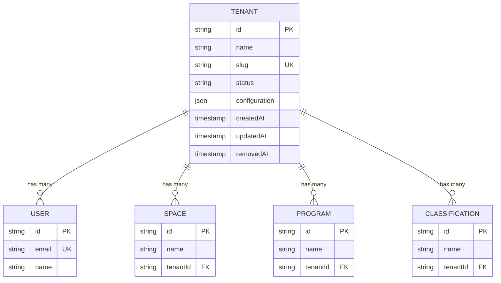
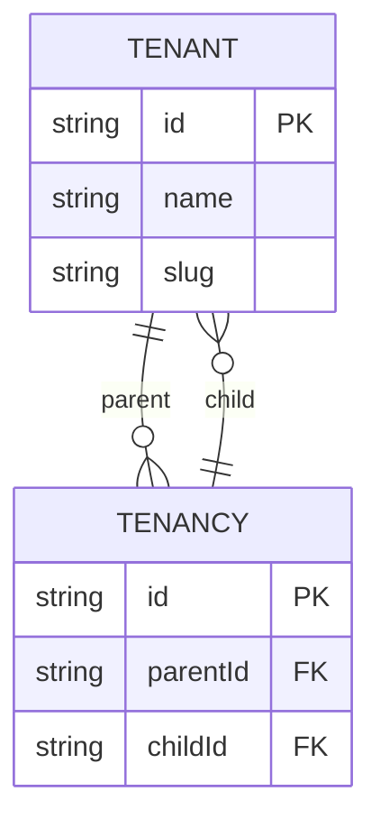
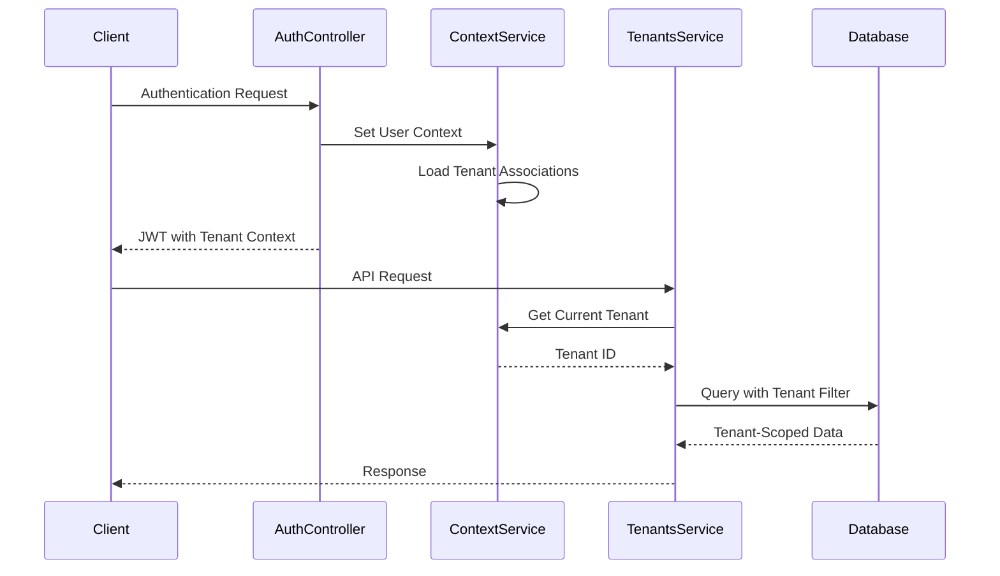

# Tenant Entity Model

<cite>
**Referenced Files in This Document**   
- [tenant.entity.ts](file://packages/schema/src/entity/tenant.entity.ts)
- [tenant.dto.ts](file://packages/schema/src/dto/tenant.dto.ts)
- [tenants.service.ts](file://apps/server/src/shared/service/resources/tenants.service.ts)
- [tenants.controller.ts](file://apps/server/src/shared/controller/resources/tenants.controller.ts)
- [tenants.repository.ts](file://apps/server/src/shared/repository/tenants.repository.ts)
- [tenancy.entity.ts](file://packages/schema/src/entity/tenancy.entity.ts)
</cite>

## Table of Contents
1. [Introduction](#introduction)
2. [Field Definitions](#field-definitions)
3. [Entity Relationships](#entity-relationships)
4. [Tenant Isolation Strategy](#tenant-isolation-strategy)
5. [Hierarchical Tenant Structure](#hierarchical-tenant-structure)
6. [Unique Constraints and Enforcement](#unique-constraints-and-enforcement)
7. [Data Flow and Request Context](#data-flow-and-request-context)

## Introduction
The Tenant entity in prj-core serves as a fundamental organizational unit that enables multi-tenancy within the application. This model defines the structure and behavior of tenant organizations, providing isolation between different groups of users, spaces, programs, and other resources. The tenant model supports a comprehensive multi-tenancy architecture that ensures data separation while enabling shared infrastructure.

**Section sources**
- [tenant.entity.ts](file://packages/schema/src/entity/tenant.entity.ts)
- [tenant.dto.ts](file://packages/schema/src/dto/tenant.dto.ts)

## Field Definitions
The Tenant entity contains several key fields that define its properties and behavior:

- **id**: Unique identifier for the tenant (string, required, primary key)
- **name**: Human-readable name of the tenant organization (string, required)
- **slug**: URL-friendly identifier derived from the name (string, required, unique)
- **status**: Operational status of the tenant (enum, default: "ACTIVE")
- **configuration**: JSON field storing tenant-specific settings and preferences (JSON object, optional)

The entity also includes standard audit fields such as createdAt, updatedAt, and removedAt for tracking lifecycle events. The configuration field allows for flexible tenant customization without requiring schema changes, supporting various application settings that can be tailored to each tenant's needs.

**Section sources**
- [tenant.entity.ts](file://packages/schema/src/entity/tenant.entity.ts)
- [tenant.dto.ts](file://packages/schema/src/dto/tenant.dto.ts)

## Entity Relationships
The Tenant entity maintains several critical relationships with other entities in the system:

**Diagram sources**
- [tenant.entity.ts](file://packages/schema/src/entity/tenant.entity.ts)
- [user.entity.ts](file://packages/schema/src/entity/user.entity.ts)
- [space.entity.ts](file://packages/schema/src/entity/space.entity.ts)
- [program.entity.ts](file://packages/schema/src/entity/program.entity.ts)
- [classification.entity.ts](file://packages/schema/src/entity/classification.entity.ts)

The Tenant entity serves as the parent in relationships with Users (via UserAssociation), Spaces, Programs, and Classifications. Each of these entities references the tenant through a foreign key relationship, ensuring that all resources are scoped to a specific tenant. This relationship structure enables the tenant isolation strategy by providing a clear hierarchy for data access and permissions.

**Section sources**
- [tenant.entity.ts](file://packages/schema/src/entity/tenant.entity.ts)
- [user-association.entity.ts](file://packages/schema/src/entity/user-association.entity.ts)
- [space.entity.ts](file://packages/schema/src/entity/space.entity.ts)
- [program.entity.ts](file://packages/schema/src/entity/program.entity.ts)
- [classification.entity.ts](file://packages/schema/src/entity/classification.entity.ts)

## Tenant Isolation Strategy
The tenant isolation strategy is implemented at the database level through a combination of foreign key relationships and query filtering. All tenant-scoped entities include a tenantId field that establishes ownership and enables data segregation. The TenantsService enforces tenant context by automatically filtering queries based on the authenticated user's tenant associations.

When retrieving data, the service layer automatically applies tenant-specific filters to ensure that users can only access resources belonging to their associated tenants. This is achieved through the getManyByQuery method in the TenantsService, which incorporates the current user's tenant context into all queries. The repository layer further enforces this isolation by validating tenant boundaries during create, update, and delete operations.

**Section sources**
- [tenants.service.ts](file://apps/server/src/shared/service/resources/tenants.service.ts)
- [tenants.repository.ts](file://apps/server/src/shared/repository/tenants.repository.ts)

## Hierarchical Tenant Structure
The system supports a hierarchical relationship between tenants through the Tenancy entity, which establishes parent-child relationships between tenant organizations. This hierarchical structure enables organizational nesting, where a parent tenant can have multiple child tenants that inherit certain configurations and policies.

The hierarchy is implemented through a self-referential relationship in the Tenancy entity, allowing tenants to be organized in a tree structure. This enables use cases such as enterprise accounts with multiple departmental sub-tenants or franchise models with a central organization and multiple location-based tenants. The parent tenant can manage overarching policies while child tenants maintain autonomy over their specific configurations and user bases.

**Diagram sources**
- [tenancy.entity.ts](file://packages/schema/src/entity/tenancy.entity.ts)
- [tenant.entity.ts](file://packages/schema/src/entity/tenant.entity.ts)

**Section sources**
- [tenancy.entity.ts](file://packages/schema/src/entity/tenancy.entity.ts)

## Unique Constraints and Enforcement
The Tenant entity enforces several unique constraints to maintain data integrity:

- **id**: Globally unique identifier (UUID) ensuring no two tenants have the same ID
- **slug**: Unique constraint preventing duplicate URL-friendly identifiers across tenants
- **name**: While not strictly unique, business logic prevents creation of tenants with identical names within the same organizational hierarchy

These constraints are enforced at both the database and application levels. The database implements unique indexes on the id and slug fields, while the application layer validates these constraints during tenant creation and updates. The TenantsService handles conflict detection and returns appropriate error responses when constraint violations occur.

The slug field is particularly important as it serves as the primary identifier in URLs and API endpoints, requiring careful validation to ensure it remains URL-safe and unique across the entire system.

**Section sources**
- [tenant.entity.ts](file://packages/schema/src/entity/tenant.entity.ts)
- [tenants.service.ts](file://apps/server/src/shared/service/resources/tenants.service.ts)

## Data Flow and Request Context
Tenant context is maintained across requests through a combination of authentication tokens and context services. When a user authenticates, the ContextService extracts their tenant associations and makes this information available throughout the request lifecycle.

**Diagram sources**
- [context.service.ts](file://apps/server/src/shared/service/context.service.ts)
- [tenants.service.ts](file://apps/server/src/shared/service/resources/tenants.service.ts)
- [tenants.controller.ts](file://apps/server/src/shared/controller/resources/tenants.controller.ts)

The ContextService plays a crucial role in maintaining tenant context, storing the current user's tenant information and providing it to services that need to enforce tenant isolation. This context is established at the beginning of each request and used throughout the call chain to ensure all data operations respect tenant boundaries. The TenantsController and TenantsService work together to validate tenant access and filter results appropriately based on the current context.

**Section sources**
- [context.service.ts](file://apps/server/src/shared/service/context.service.ts)
- [tenants.service.ts](file://apps/server/src/shared/service/resources/tenants.service.ts)
- [tenants.controller.ts](file://apps/server/src/shared/controller/resources/tenants.controller.ts)