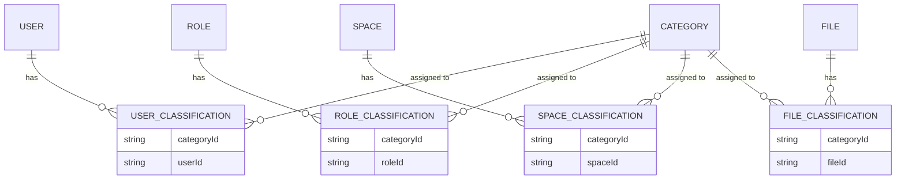
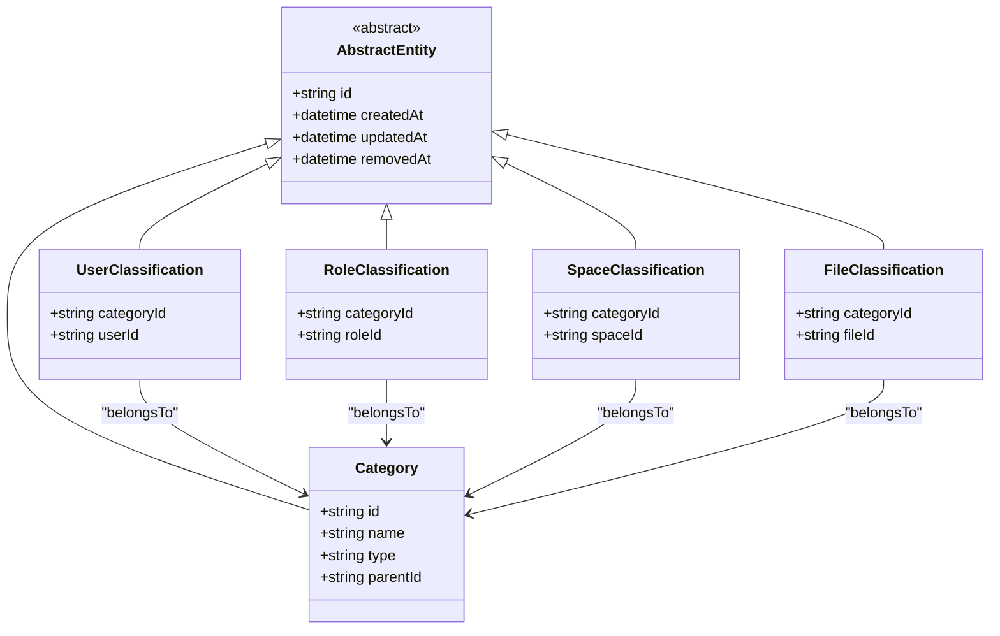
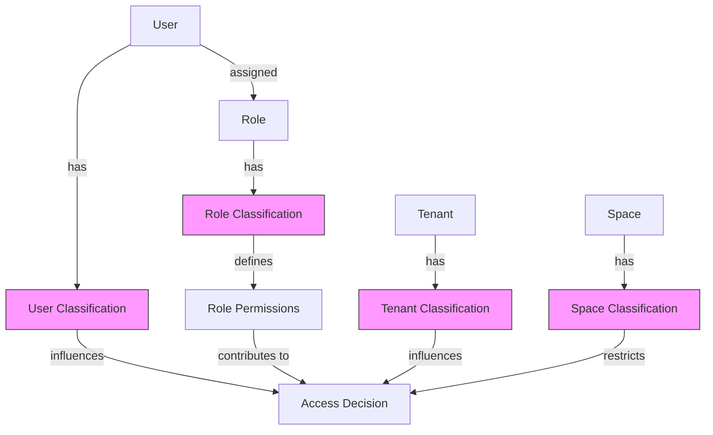
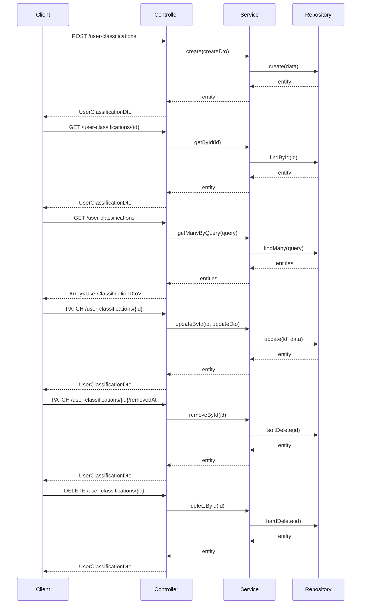
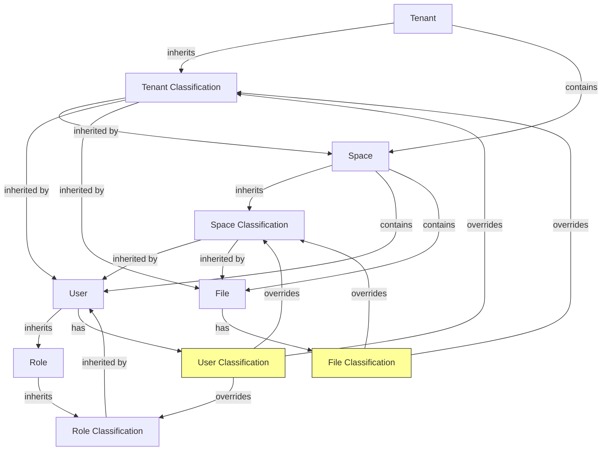

# User & Tenant Classification Systems

<cite>
**Referenced Files in This Document**   
- [user-classification.entity.ts](file://packages/entity/src/user-classification.entity.ts)
- [role-classification.entity.ts](file://packages/entity/src/role-classification.entity.ts)
- [space-classification.entity.ts](file://packages/entity/src/space-classification.entity.ts)
- [file-classification.entity.ts](file://packages/entity/src/file-classification.entity.ts)
- [user-classification.dto.ts](file://packages/dto/src/user-classification.dto.ts)
- [role-classification.dto.ts](file://packages/dto/src/role-classification.dto.ts)
- [space-classification.dto.ts](file://packages/dto/src/space-classification.dto.ts)
- [file-classification.dto.ts](file://packages/dto/src/file-classification.dto.ts)
- [user-classifications.controller.ts](file://apps/server/src/shared/controller/resources/user-classifications.controller.ts)
- [role-classifications.controller.ts](file://apps/server/src/shared/controller/resources/role-classifications.controller.ts)
- [space-classifications.controller.ts](file://apps/server/src/shared/controller/resources/space-classifications.controller.ts)
- [file-classifications.controller.ts](file://apps/server/src/shared/controller/resources/file-classifications.controller.ts)
- [user-classifications.service.ts](file://apps/server/src/shared/service/resources/user-classifications.service.ts)
- [role-classifications.service.ts](file://apps/server/src/shared/service/resources/role-classifications.service.ts)
- [space-classifications.service.ts](file://apps/server/src/shared/service/resources/space-classifications.service.ts)
- [file-classifications.service.ts](file://apps/server/src/shared/service/resources/file-classifications.service.ts)
- [category.entity.ts](file://packages/entity/src/category.entity.ts)
- [role.entity.ts](file://packages/entity/src/role.entity.ts)
- [space.entity.ts](file://packages/entity/src/space.entity.ts)
- [file.entity.ts](file://packages/entity/src/file.entity.ts)
- [user.entity.ts](file://packages/entity/src/user.entity.ts)
</cite>

## Table of Contents
1. [Introduction](#introduction)
2. [Classification Entity Structure](#classification-entity-structure)
3. [Type Hierarchies and Value Constraints](#type-hierarchies-and-value-constraints)
4. [Validity Periods](#validity-periods)
5. [Classification Usage Patterns](#classification-usage-patterns)
6. [Relationship with Role-Based Access Control](#relationship-with-role-based-access-control)
7. [API Endpoints for Classification Management](#api-endpoints-for-classification-management)
8. [Classification Inheritance and Override Mechanisms](#classification-inheritance-and-override-mechanisms)
9. [Conclusion](#conclusion)

## Introduction
The prj-core system implements a flexible classification framework that enables categorization of users, roles, spaces, and files through a unified model. This documentation details the data model, usage patterns, and API interfaces for the classification system, focusing on how classifications are applied to Users and Tenants for access control, feature flagging, and business logic routing.

**Section sources**
- [user-classification.entity.ts](file://packages/entity/src/user-classification.entity.ts)
- [role-classification.entity.ts](file://packages/entity/src/role-classification.entity.ts)
- [space-classification.entity.ts](file://packages/entity/src/space-classification.entity.ts)
- [file-classification.entity.ts](file://packages/entity/src/file-classification.entity.ts)

## Classification Entity Structure

The classification system follows a consistent pattern across different entity types, implementing a many-to-many relationship between categorized entities and classification categories. Each classification entity serves as a junction table that links a specific instance of an entity to a category.

**Diagram sources**
- [user-classification.entity.ts](file://packages/entity/src/user-classification.entity.ts)
- [role-classification.entity.ts](file://packages/entity/src/role-classification.entity.ts)
- [space-classification.entity.ts](file://packages/entity/src/space-classification.entity.ts)
- [file-classification.entity.ts](file://packages/entity/src/file-classification.entity.ts)

**Section sources**
- [user-classification.entity.ts](file://packages/entity/src/user-classification.entity.ts)
- [role-classification.entity.ts](file://packages/entity/src/role-classification.entity.ts)
- [space-classification.entity.ts](file://packages/entity/src/space-classification.entity.ts)
- [file-classification.entity.ts](file://packages/entity/src/file-classification.entity.ts)

## Type Hierarchies and Value Constraints

The classification system implements a consistent type hierarchy across all classification types. Each classification entity extends the AbstractEntity class and implements the corresponding Prisma interface, ensuring standardized fields and behaviors.

**Diagram sources**
- [user-classification.entity.ts](file://packages/entity/src/user-classification.entity.ts)
- [role-classification.entity.ts](file://packages/entity/src/role-classification.entity.ts)
- [space-classification.entity.ts](file://packages/entity/src/space-classification.entity.ts)
- [file-classification.entity.ts](file://packages/entity/src/file-classification.entity.ts)
- [category.entity.ts](file://packages/entity/src/category.entity.ts)

**Section sources**
- [user-classification.dto.ts](file://packages/dto/src/user-classification.dto.ts)
- [role-classification.dto.ts](file://packages/dto/src/role-classification.dto.ts)
- [space-classification.dto.ts](file://packages/dto/src/space-classification.dto.ts)
- [file-classification.dto.ts](file://packages/dto/src/file-classification.dto.ts)

## Validity Periods

The classification system supports temporal validity through the standard entity timestamps inherited from AbstractEntity. While explicit start and end dates are not implemented in the classification entities themselves, the createdAt and updatedAt fields provide temporal context for classification assignments. The removedAt field enables soft deletion, preserving historical classification data while marking it as inactive.

The system follows a pattern where classification validity is determined by:
1. The presence of removedAt (null = active, timestamp = inactive)
2. The createdAt timestamp for determining when a classification was assigned
3. The updatedAt timestamp for tracking modifications to the classification

This approach allows for audit trails and historical analysis of classification changes without requiring dedicated validity period fields.

**Section sources**
- [user-classification.entity.ts](file://packages/entity/src/user-classification.entity.ts)
- [role-classification.entity.ts](file://packages/entity/src/role-classification.entity.ts)
- [space-classification.entity.ts](file://packages/entity/src/space-classification.entity.ts)
- [file-classification.entity.ts](file://packages/entity/src/file-classification.entity.ts)

## Classification Usage Patterns

Classifications are used throughout the system for access control, feature flagging, and business logic routing. The consistent pattern across user, role, space, and file classifications enables a unified approach to conditional logic based on entity categorization.

For access control, classifications determine:
- User permissions based on assigned categories
- Role capabilities derived from role classifications
- Space access restrictions based on space classifications
- File access controls based on file classifications

For feature flagging, classifications enable:
- User-specific feature availability
- Tenant-level feature toggles
- Role-based interface variations
- Space-specific functionality

For business logic routing, classifications drive:
- Workflow variations based on user categories
- Processing rules determined by role classifications
- Space-specific business rules
- File handling procedures based on classification

```mermaid
flowchart TD
Start([Entity Classification]) --> AccessControl["Access Control Decision"]
Start --> FeatureFlag["Feature Flag Evaluation"]
Start --> BusinessLogic["Business Logic Routing"]
AccessControl --> |User Classification| UserAuth["User Authentication & Authorization"]
AccessControl --> |Role Classification| RoleAuth["Role-Based Permissions"]
AccessControl --> |Space Classification| SpaceAccess["Space Access Control"]
AccessControl --> |File Classification| FileAccess["File Access Control"]
FeatureFlag --> |User Classification| UserFeatures["User-Specific Features"]
FeatureFlag --> |Tenant Classification| TenantFeatures["Tenant-Level Features"]
FeatureFlag --> |Role Classification| RoleFeatures["Role-Based UI Variations"]
BusinessLogic --> |User Classification| UserWorkflows["User Workflow Variations"]
BusinessLogic --> |Role Classification| RoleRules["Role-Based Processing Rules"]
BusinessLogic --> |Space Classification| SpaceRules["Space-Specific Business Rules"]
BusinessLogic --> |File Classification| FileProcessing["File Handling Procedures"]
```

**Diagram sources**
- [user-classifications.service.ts](file://apps/server/src/shared/service/resources/user-classifications.service.ts)
- [role-classifications.service.ts](file://apps/server/src/shared/service/resources/role-classifications.service.ts)
- [space-classifications.service.ts](file://apps/server/src/shared/service/resources/space-classifications.service.ts)
- [file-classifications.service.ts](file://apps/server/src/shared/service/resources/file-classifications.service.ts)

**Section sources**
- [user-classifications.service.ts](file://apps/server/src/shared/service/resources/user-classifications.service.ts)
- [role-classifications.service.ts](file://apps/server/src/shared/service/resources/role-classifications.service.ts)
- [space-classifications.service.ts](file://apps/server/src/shared/service/resources/space-classifications.service.ts)
- [file-classifications.service.ts](file://apps/server/src/shared/service/resources/file-classifications.service.ts)

## Relationship with Role-Based Access Control

The classification system integrates closely with role-based access control (RBAC), creating a hybrid authorization model that combines role assignments with categorical classifications. User classifications extend the traditional RBAC model by adding dimensional attributes that influence permission evaluation.

The relationship between user classifications and roles is implemented through:
1. Direct user classifications that modify individual user permissions
2. Role classifications that establish baseline capabilities for role members
3. Inherited classifications from tenant and space contexts

When evaluating access, the system considers:
- The user's assigned roles
- The user's direct classifications
- The classifications of the user's roles
- The classifications inherited from organizational context

This multi-layered approach enables fine-grained access control that goes beyond traditional role-based systems, allowing for dynamic permission evaluation based on multiple classification dimensions.

**Diagram sources**
- [user-classification.entity.ts](file://packages/entity/src/user-classification.entity.ts)
- [role-classification.entity.ts](file://packages/entity/src/role-classification.entity.ts)
- [user.entity.ts](file://packages/entity/src/user.entity.ts)
- [role.entity.ts](file://packages/entity/src/role.entity.ts)
- [tenancy.entity.ts](file://packages/entity/src/tenancy.entity.ts)
- [space.entity.ts](file://packages/entity/src/space.entity.ts)

**Section sources**
- [user-classifications.service.ts](file://apps/server/src/shared/service/resources/user-classifications.service.ts)
- [role-classifications.service.ts](file://apps/server/src/shared/service/resources/role-classifications.service.ts)

## API Endpoints for Classification Management

The classification system provides RESTful API endpoints for managing all classification types. The endpoints follow a consistent pattern across user, role, space, and file classifications, enabling standardized interaction with the classification data.

**Diagram sources**
- [user-classifications.controller.ts](file://apps/server/src/shared/controller/resources/user-classifications.controller.ts)
- [user-classifications.service.ts](file://apps/server/src/shared/service/resources/user-classifications.service.ts)
- [user-classifications.repository.ts](file://apps/server/src/shared/repository/user-classifications.repository.ts)

**Section sources**
- [user-classifications.controller.ts](file://apps/server/src/shared/controller/resources/user-classifications.controller.ts)
- [role-classifications.controller.ts](file://apps/server/src/shared/controller/resources/role-classifications.controller.ts)
- [space-classifications.controller.ts](file://apps/server/src/shared/controller/resources/space-classifications.controller.ts)
- [file-classifications.controller.ts](file://apps/server/src/shared/controller/resources/file-classifications.controller.ts)

## Classification Inheritance and Override Mechanisms

The classification system implements a hierarchical inheritance model where classifications can be inherited from parent contexts while allowing for local overrides. This mechanism enables both consistency across organizational units and flexibility for specific instances.

Inheritance occurs through:
1. Tenant-level classifications that apply to all users and spaces within a tenant
2. Space-level classifications that apply to all files and users within a space
3. Role-level classifications that apply to all users assigned to a role

Override mechanisms allow:
1. User-specific classifications that override inherited role classifications
2. Space-specific classifications that override inherited tenant classifications
3. File-specific classifications that override inherited space classifications

The resolution order for classification conflicts follows a specificity hierarchy:
1. Direct entity classifications (most specific)
2. Space-level classifications
3. Role-level classifications
4. Tenant-level classifications (least specific)

This inheritance and override system enables a flexible configuration model where general policies can be established at higher levels while allowing exceptions at lower levels as needed.

**Diagram sources**
- [user-classifications.service.ts](file://apps/server/src/shared/service/resources/user-classifications.service.ts)
- [space-classifications.service.ts](file://apps/server/src/shared/service/resources/space-classifications.service.ts)
- [role-classifications.service.ts](file://apps/server/src/shared/service/resources/role-classifications.service.ts)
- [tenants.service.ts](file://apps/server/src/shared/service/resources/tenants.service.ts)
- [spaces.service.ts](file://apps/server/src/shared/service/resources/spaces.service.ts)
- [users.service.ts](file://apps/server/src/shared/service/resources/users.service.ts)

**Section sources**
- [user-classifications.service.ts](file://apps/server/src/shared/service/resources/user-classifications.service.ts)
- [space-classifications.service.ts](file://apps/server/src/shared/service/resources/space-classifications.service.ts)
- [role-classifications.service.ts](file://apps/server/src/shared/service/resources/role-classifications.service.ts)

## Conclusion

The User & Tenant Classification system in prj-core provides a robust and flexible framework for categorizing entities and leveraging those categories for access control, feature flagging, and business logic routing. By implementing a consistent pattern across user, role, space, and file classifications, the system enables unified management and evaluation of classification data.

The integration with role-based access control creates a powerful hybrid authorization model that combines the simplicity of role assignments with the granularity of categorical classifications. The inheritance and override mechanisms allow for both organizational consistency and individual flexibility, making the system adaptable to complex business requirements.

The well-defined API endpoints and service layer abstractions ensure that classification management is standardized and maintainable, while the underlying data model supports efficient querying and indexing for performance-critical authorization decisions.

This comprehensive classification system forms a foundational component of the prj-core platform, enabling sophisticated user and tenant management capabilities that scale from simple use cases to complex enterprise requirements.