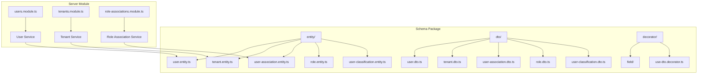
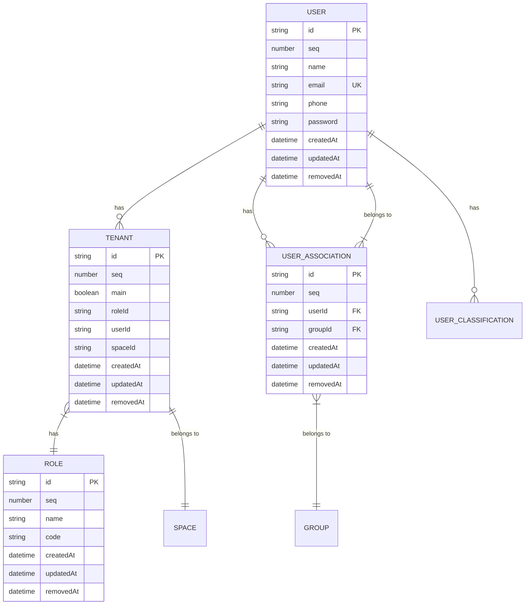
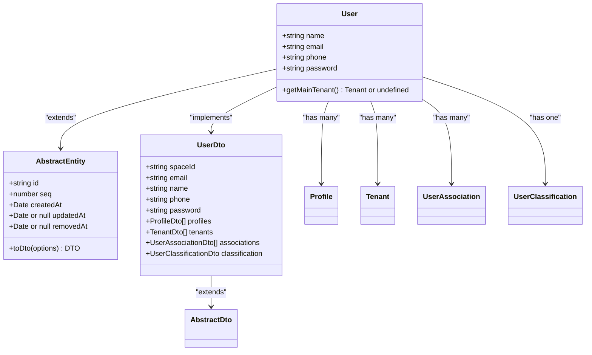
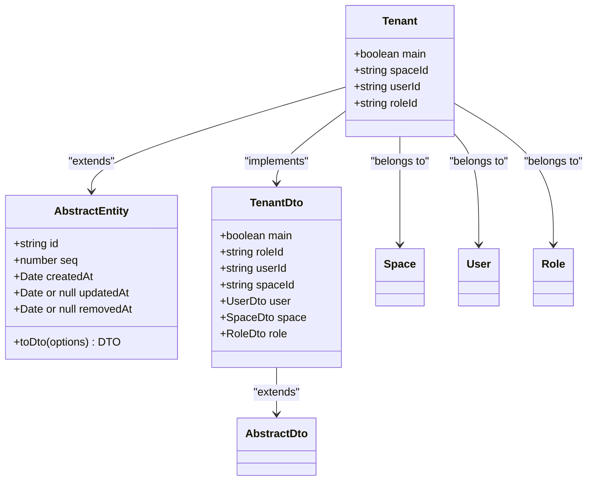
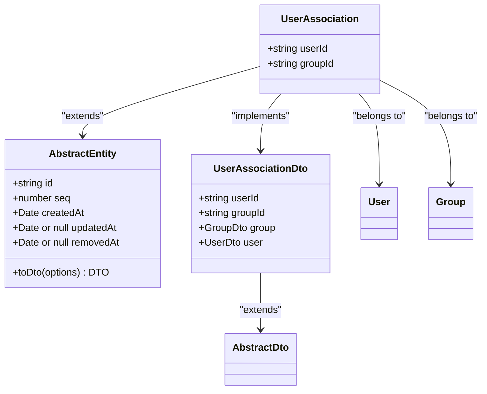
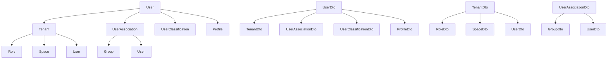

# User & Tenant Data Models

<cite>
**Referenced Files in This Document**   
- [user.entity.ts](file://packages/schema/src/entity/user.entity.ts)
- [tenant.entity.ts](file://packages/schema/src/entity/tenant.entity.ts)
- [user-association.entity.ts](file://packages/schema/src/entity/user-association.entity.ts)
- [user.dto.ts](file://packages/schema/src/dto/user.dto.ts)
- [tenant.dto.ts](file://packages/schema/src/dto/tenant.dto.ts)
- [user-association.dto.ts](file://packages/schema/src/dto/user-association.dto.ts)
- [abstract.entity.ts](file://packages/schema/src/entity/abstract.entity.ts)
- [abstract.dto.ts](file://packages/schema/src/dto/abstract.dto.ts)
- [role.entity.ts](file://packages/schema/src/entity/role.entity.ts)
- [user-classification.entity.ts](file://packages/schema/src/entity/user-classification.entity.ts)
</cite>

## Table of Contents
1. [Introduction](#introduction)
2. [Project Structure](#project-structure)
3. [Core Components](#core-components)
4. [Architecture Overview](#architecture-overview)
5. [Detailed Component Analysis](#detailed-component-analysis)
6. [Dependency Analysis](#dependency-analysis)
7. [Performance Considerations](#performance-considerations)
8. [Troubleshooting Guide](#troubleshooting-guide)
9. [Conclusion](#conclusion)

## Introduction
This document provides comprehensive documentation for the User and Tenant entities within the prj-core system, focusing on the multi-tenancy architecture implementation. The documentation details the data models, relationships, constraints, and access control mechanisms that enable secure and scalable multi-tenant operations. The system implements a sophisticated tenant isolation strategy with role-based access control at the data model level, ensuring data privacy and security across different organizational boundaries.

## Project Structure

**Diagram sources**
- [user.entity.ts](file://packages/schema/src/entity/user.entity.ts)
- [tenant.entity.ts](file://packages/schema/src/entity/tenant.entity.ts)
- [user-association.entity.ts](file://packages/schema/src/entity/user-association.entity.ts)
- [user.dto.ts](file://packages/schema/src/dto/user.dto.ts)
- [tenant.dto.ts](file://packages/schema/src/dto/tenant.dto.ts)
- [user-association.dto.ts](file://packages/schema/src/dto/user-association.dto.ts)

**Section sources**
- [user.entity.ts](file://packages/schema/src/entity/user.entity.ts)
- [tenant.entity.ts](file://packages/schema/src/entity/tenant.entity.ts)
- [user-association.entity.ts](file://packages/schema/src/entity/user-association.entity.ts)

## Core Components

The core components of the multi-tenancy architecture consist of User, Tenant, and UserAssociation entities that work together to enable secure multi-tenant operations. The User entity represents system users with personal information and authentication credentials, while the Tenant entity represents organizational boundaries within the system. The UserAssociation entity serves as a junction table that connects users to tenants, enabling users to belong to multiple tenants simultaneously. Each entity extends AbstractEntity, inheriting common fields such as id, seq, createdAt, updatedAt, and removedAt for consistent data management across the system.

**Section sources**
- [user.entity.ts](file://packages/schema/src/entity/user.entity.ts)
- [tenant.entity.ts](file://packages/schema/src/entity/tenant.entity.ts)
- [user-association.entity.ts](file://packages/schema/src/entity/user-association.entity.ts)
- [abstract.entity.ts](file://packages/schema/src/entity/abstract.entity.ts)

## Architecture Overview

**Diagram sources**
- [user.entity.ts](file://packages/schema/src/entity/user.entity.ts)
- [tenant.entity.ts](file://packages/schema/src/entity/tenant.entity.ts)
- [user-association.entity.ts](file://packages/schema/src/entity/user-association.entity.ts)
- [role.entity.ts](file://packages/schema/src/entity/role.entity.ts)
- [user-classification.entity.ts](file://packages/schema/src/entity/user-classification.entity.ts)

## Detailed Component Analysis

### User Entity Analysis

**Diagram sources**
- [user.entity.ts](file://packages/schema/src/entity/user.entity.ts)
- [user.dto.ts](file://packages/schema/src/dto/user.dto.ts)
- [abstract.entity.ts](file://packages/schema/src/entity/abstract.entity.ts)
- [abstract.dto.ts](file://packages/schema/src/dto/abstract.dto.ts)

**Section sources**
- [user.entity.ts](file://packages/schema/src/entity/user.entity.ts)
- [user.dto.ts](file://packages/schema/src/dto/user.dto.ts)

### Tenant Entity Analysis

**Diagram sources**
- [tenant.entity.ts](file://packages/schema/src/entity/tenant.entity.ts)
- [tenant.dto.ts](file://packages/schema/src/dto/tenant.dto.ts)
- [abstract.entity.ts](file://packages/schema/src/entity/abstract.entity.ts)
- [abstract.dto.ts](file://packages/schema/src/dto/abstract.dto.ts)

**Section sources**
- [tenant.entity.ts](file://packages/schema/src/entity/tenant.entity.ts)
- [tenant.dto.ts](file://packages/schema/src/dto/tenant.dto.ts)

### User-Tenant Association Analysis

**Diagram sources**
- [user-association.entity.ts](file://packages/schema/src/entity/user-association.entity.ts)
- [user-association.dto.ts](file://packages/schema/src/dto/user-association.dto.ts)
- [abstract.entity.ts](file://packages/schema/src/entity/abstract.entity.ts)
- [abstract.dto.ts](file://packages/schema/src/dto/abstract.dto.ts)

**Section sources**
- [user-association.entity.ts](file://packages/schema/src/entity/user-association.entity.ts)
- [user-association.dto.ts](file://packages/schema/src/dto/user-association.dto.ts)

## Dependency Analysis

**Diagram sources**
- [user.entity.ts](file://packages/schema/src/entity/user.entity.ts)
- [tenant.entity.ts](file://packages/schema/src/entity/tenant.entity.ts)
- [user-association.entity.ts](file://packages/schema/src/entity/user-association.entity.ts)
- [user.dto.ts](file://packages/schema/src/dto/user.dto.ts)
- [tenant.dto.ts](file://packages/schema/src/dto/tenant.dto.ts)
- [user-association.dto.ts](file://packages/schema/src/dto/user-association.dto.ts)

**Section sources**
- [user.entity.ts](file://packages/schema/src/entity/user.entity.ts)
- [tenant.entity.ts](file://packages/schema/src/entity/tenant.entity.ts)
- [user-association.entity.ts](file://packages/schema/src/entity/user-association.entity.ts)

## Performance Considerations

The data model includes several performance optimizations for common query patterns. Indexes are implemented on frequently queried fields such as email (unique), userId, groupId, and spaceId to ensure efficient lookups. The system uses DTOs (Data Transfer Objects) to control data exposure and prevent over-fetching, with the @Exclude decorator used to hide sensitive fields like passwords from API responses. The entity-DTO pattern with class-transformer enables efficient serialization and transformation between database entities and API responses. For multi-tenancy queries, the main field in the Tenant entity allows for quick identification of a user's primary tenant, optimizing common access patterns.

## Troubleshooting Guide

Common issues in the User and Tenant data model typically relate to relationship management and data consistency. When users cannot access expected tenants, verify the UserAssociation records and ensure the correct groupId is assigned. For authentication issues, check that the password field is properly hashed and stored. When encountering serialization errors, ensure that the @UseDto decorator is properly configured on entities. For performance issues with tenant queries, verify that appropriate indexes exist on the userId, spaceId, and main fields. Data integrity issues can be addressed by checking the foreign key constraints between User, Tenant, and UserAssociation entities.

## Conclusion

The User and Tenant data models in prj-core provide a robust foundation for multi-tenancy with comprehensive isolation, access control, and relationship management. The architecture effectively separates concerns between entities and DTOs, enabling secure data exposure while maintaining flexibility in data relationships. The implementation of UserAssociation as a junction table allows for complex user-tenant relationships, supporting scenarios where users belong to multiple organizational units. The consistent use of abstract base classes ensures uniform behavior across entities, while the decorator-based validation system provides clear field constraints and documentation. This design supports scalable multi-tenant applications with strong data isolation and flexible access control patterns.